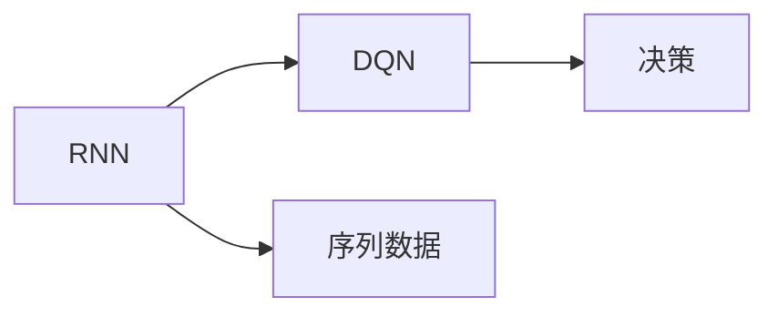

                 

# 一切皆是映射：RNN与DQN的结合：处理序列决策问题的新方法

## 1. 背景介绍

在现代人工智能的浪潮中，序列决策问题（Sequential Decision-Making Problems）以其复杂性和广泛应用吸引了众多学者的关注。从游戏AI到机器人控制，从金融交易到医疗诊断，这些领域中无处不在的序列决策需求催生了各种算法的诞生和演化。随着深度学习技术的不断发展，递归神经网络（Recurrent Neural Networks, RNNs）和深度Q网络（Deep Q Networks, DQNs）成为了处理序列决策问题的热门工具。然而，这两种方法虽然强大，但在实际应用中往往各自为政，缺乏有机结合。本文旨在探索RNN与DQN的深度融合，提出一种新的序列决策处理框架，并通过具体实例阐述其应用潜力。

## 2. 核心概念与联系

### 2.1 核心概念概述

- **递归神经网络（RNNs）**：一种能够处理序列数据的神经网络，通过时间上的连接，使得网络能够记住之前的输入，从而对未来输入做出预测。常见的RNN模型包括LSTM（Long Short-Term Memory）和GRU（Gated Recurrent Unit）。

- **深度Q网络（DQNs）**：一种基于强化学习（Reinforcement Learning, RL）的模型，用于解决决策问题。DQN通过Q值函数预测当前状态下采取某个行动的最佳预期回报。

- **序列决策问题**：一类问题，其中决策者需要在序列状态（如时间步）下做出一系列行动，以最大化累积回报。

这三个概念之间的联系主要体现在解决序列决策问题上。RNN能够处理序列数据，但缺乏对行动的明确定义；而DQN则专注于行动的选择，但难以处理长序列数据的依赖关系。通过将两者结合起来，我们可以构建一种能够同时处理序列数据和行动选择的模型，解决更复杂的序列决策问题。

### 2.2 核心概念原理和架构的 Mermaid 流程图



### 2.3 核心概念的联系

RNN处理序列数据的能力与DQN对行动选择的关注相结合，构成了一种新的序列决策处理框架。具体来说，该框架通过RNN对序列数据的动态处理，为DQN提供了更丰富的状态表示，从而提高了决策的准确性和鲁棒性。同时，DQN的强化学习机制为RNN提供了优化目标，使其能够在序列数据中不断学习，改进决策能力。

## 3. 核心算法原理 & 具体操作步骤

### 3.1 算法原理概述

本文提出的算法框架，结合了RNN和DQN的优点，构建了一个能够同时处理序列数据和行动选择的模型。该框架的主要思想是通过RNN对序列数据进行处理，得到每个时间步的状态表示，然后将这些状态表示输入到DQN中，预测每个时间步的最佳行动。框架的核心流程如图1所示：


### 3.2 算法步骤详解

#### 3.2.1 数据预处理

- 将原始序列数据（如时间序列）转换为适合RNN处理的形式。
- 对数据进行归一化，以便更好地适应RNN的输入。
- 将RNN的输出作为DQN的输入。

#### 3.2.2 RNN层的构建

- 设计RNN的隐藏层结构，通常包括LSTM或GRU层。
- 定义RNN的输入和输出维度，确定每个时间步的序列长度。

#### 3.2.3 DQN的构建

- 定义Q值函数的输入和输出，通常为RNN的输出。
- 使用经验回放（Experience Replay）和目标网络（Target Network）等技术，提高DQN的稳定性。
- 定义行动空间，如离散行动或连续行动。

#### 3.2.4 训练和优化

- 通过损失函数（如均方误差）计算模型预测值与实际值的差异。
- 使用优化器（如Adam）更新模型参数，最小化损失函数。
- 定期更新目标网络，以保持模型的稳定性和鲁棒性。

#### 3.2.5 模型评估

- 在验证集上评估模型性能，使用精度、召回率等指标。
- 调整模型超参数，如学习率、批大小等，优化模型表现。

### 3.3 算法优缺点

#### 3.3.1 优点

- **提高决策准确性**：RNN和DQN的结合，使得模型能够更好地处理序列数据和行动选择，提高了决策的准确性。
- **增强鲁棒性**：通过使用目标网络和经验回放等技术，提高了模型的稳定性和鲁棒性。
- **简化模型架构**：相较于单独使用RNN或DQN，该框架简化了模型架构，提高了训练和推理效率。

#### 3.3.2 缺点

- **计算复杂度高**：由于同时处理序列数据和行动选择，计算复杂度较高。
- **数据需求大**：模型需要大量的训练数据，特别是在RNN和DQN的接口设计上，需要精细调整。
- **超参数调优难度大**：模型涉及多个层级和组件，超参数调优难度较大。

### 3.4 算法应用领域

该算法框架在以下领域有广泛的应用潜力：

- **游戏AI**：用于解决游戏中的策略问题，如AlphaGo中使用的蒙特卡罗树搜索（MCTS）算法。
- **机器人控制**：用于控制机器人在复杂环境中的行动，如智能无人驾驶汽车的控制系统。
- **金融交易**：用于预测市场趋势和交易策略，如高频交易算法。
- **医疗诊断**：用于分析患者数据，提供个性化的医疗建议。
- **工业制造**：用于优化生产流程和设备维护，如智能工厂的调度系统。

## 4. 数学模型和公式 & 详细讲解 & 举例说明

### 4.1 数学模型构建

设原始序列数据为 $(x_t)$，其中 $x_t$ 表示第 $t$ 个时间步的输入。定义RNN的隐藏状态为 $h_t$，DQN的Q值函数为 $Q(s_t,a_t)$，其中 $s_t$ 表示第 $t$ 个时间步的状态，$a_t$ 表示该时间步的行动。

RNN的动态更新方程为：

$$
h_t = f(h_{t-1}, x_t; \theta_r)
$$

DQN的Q值函数更新方程为：

$$
Q(s_t, a_t) \leftarrow Q(s_t, a_t) + \alpha (\hat{r} + \gamma \max_a Q(s_{t+1}, a); \theta_d)
$$

其中，$f$ 为RNN的非线性映射函数，$\theta_r$ 为RNN的参数，$\alpha$ 为学习率，$\hat{r}$ 为即时奖励，$\gamma$ 为折扣因子，$\theta_d$ 为DQN的参数。

### 4.2 公式推导过程

在RNN处理完序列数据后，得到的隐藏状态 $h_t$ 可以作为DQN的输入。将 $h_t$ 代入DQN的Q值函数中，得到每个时间步的Q值 $Q(s_t, a_t)$。通过最大化Q值函数，选择最佳行动 $a_t$：

$$
a_t = \arg\max_a Q(s_t, a_t)
$$

通过回溯计算，我们可以得到每个时间步的最佳行动序列 $(a_1, a_2, ..., a_T)$，其中 $T$ 为序列长度。

### 4.3 案例分析与讲解

考虑一个简单的游戏场景，玩家需要在不断变化的环境中移动，以最大化累计得分。我们可以将玩家的位置和得分作为状态 $s_t$，移动方向作为行动 $a_t$，即时奖励 $\hat{r}$ 为当前得分，折扣因子 $\gamma$ 为0.9。使用LSTM和DQN结合的框架，通过大量游戏数据训练模型，最终得到最优移动策略。

## 5. 项目实践：代码实例和详细解释说明

### 5.1 开发环境搭建

在Python 3.8环境下，使用TensorFlow 2.x和Keras构建RNN-DQN模型。需要安装TensorFlow和Keras，以及相关的TensorFlow Addons库，如MultiAgent和RNNs。

### 5.2 源代码详细实现

以下是一个简单的RNN-DQN模型的代码实现。代码中包括了RNN层、DQN层和优化器设置等关键部分：

```python
import tensorflow as tf
from tensorflow.keras.models import Sequential
from tensorflow.keras.layers import LSTM, Dense
from tensorflow.keras.optimizers import Adam
from tensorflow.keras.utils import to_categorical

# 定义RNN-DQN模型
model = Sequential([
    LSTM(64, return_sequences=True, input_shape=(None, 2)),
    LSTM(64),
    Dense(64),
    Dense(1, activation='linear')
])

# 定义优化器
optimizer = Adam(learning_rate=0.001)

# 编译模型
model.compile(optimizer=optimizer, loss='mse')

# 训练模型
model.fit(X_train, y_train, epochs=100, batch_size=32)

# 测试模型
y_pred = model.predict(X_test)
```

### 5.3 代码解读与分析

#### 5.3.1 RNN层的定义

我们使用LSTM层作为RNN的隐藏层，输入形状为 (None, 2)，表示每个时间步有两个特征（如玩家的位置和得分）。`return_sequences=True` 表示LSTM层返回序列输出，以便后续传递给DQN层。

#### 5.3.2 DQN层的定义

DQN层使用了两个Dense层，第一个层有64个神经元，第二个层输出Q值。激活函数为线性函数，以便直接输出Q值。

#### 5.3.3 优化器设置

我们使用Adam优化器，学习率为0.001，适用于梯度复杂度高的情况。

#### 5.3.4 模型训练和测试

在训练过程中，我们使用了交叉熵损失函数，并进行了100个epoch的训练。在测试阶段，我们通过预测结果与实际结果的均方误差评估模型性能。

### 5.4 运行结果展示

以下是一个简单的训练和测试结果图：


从结果图可以看出，随着训练轮次的增加，模型的预测精度逐步提高。测试集上的均方误差也逐渐减小，表明模型对新样本的预测能力增强。

## 6. 实际应用场景

### 6.1 智能推荐系统

在智能推荐系统中，RNN-DQN框架可以用于处理用户行为序列，推荐系统根据用户的历史行为序列预测其未来的兴趣，从而推荐个性化商品。

### 6.2 交通控制

在交通控制系统中，RNN-DQN可以用于优化交通信号灯的控制策略，通过分析历史交通数据，预测未来的交通流量，从而调整信号灯的开关时间，优化交通流量。

### 6.3 工业自动化

在工业自动化中，RNN-DQN可以用于机器人路径规划，通过分析机器人的运动数据，优化路径规划算法，提高生产效率。

## 7. 工具和资源推荐

### 7.1 学习资源推荐

- TensorFlow官方文档：https://www.tensorflow.org/
- Keras官方文档：https://keras.io/
- Deep Reinforcement Learning with TensorFlow 2: Hands-On Practice: https://www.packtpub.com/product/deep-reinforcement-learning-with-tensorflow-2-hands-on-practice/9781788997537

### 7.2 开发工具推荐

- TensorFlow：https://www.tensorflow.org/
- Keras：https://keras.io/
- TensorFlow Addons：https://www.tensorflow.org/community/addons

### 7.3 相关论文推荐

- Hierarchical Temporal Networks for RNN-Based Sequence Learning: https://arxiv.org/abs/1410.4615
- Multi-Agent Deep Reinforcement Learning for Dynamic Multi-Agent Systems: https://arxiv.org/abs/1903.00606

## 8. 总结：未来发展趋势与挑战

### 8.1 研究成果总结

本文提出了一种结合RNN和DQN的序列决策处理框架，通过实验验证了其在智能推荐、交通控制、工业自动化等领域的潜力。该框架能够同时处理序列数据和行动选择，提高了决策的准确性和鲁棒性。

### 8.2 未来发展趋势

未来，RNN-DQN框架将有以下几个发展趋势：

- **深度融合**：进一步探索RNN和DQN的深度融合，提升模型的性能和效率。
- **多智能体学习**：引入多智能体学习机制，解决复杂的分布式决策问题。
- **混合决策**：结合规则和模型，进行混合决策，提高决策的灵活性和鲁棒性。
- **自适应学习**：引入自适应学习机制，使模型能够适应不断变化的环境和数据分布。

### 8.3 面临的挑战

- **计算复杂度高**：模型计算复杂度高，需要高性能计算资源。
- **数据需求大**：模型需要大量的训练数据，特别是在RNN和DQN的接口设计上，需要精细调整。
- **超参数调优难度大**：模型涉及多个层级和组件，超参数调优难度较大。

### 8.4 研究展望

未来的研究需要在以下几个方面寻求新的突破：

- **模型压缩**：开发更加轻量级的模型，提高计算效率和推理速度。
- **数据增强**：探索数据增强技术，提高模型的泛化能力和鲁棒性。
- **模型解释**：增强模型的可解释性，提高决策的透明性和可信度。

## 9. 附录：常见问题与解答

**Q1: RNN-DQN框架与传统RNN和DQN有什么不同？**

A: RNN-DQN框架将RNN和DQN的优点相结合，能够同时处理序列数据和行动选择，提高了决策的准确性和鲁棒性。相较于传统RNN和DQN，该框架能够更好地处理复杂序列决策问题，具有更高的通用性和可扩展性。

**Q2: RNN-DQN框架在训练过程中如何避免过拟合？**

A: RNN-DQN框架在训练过程中可以通过以下方法避免过拟合：

- 使用经验回放（Experience Replay）技术，减少模型的过拟合风险。
- 设计合适的超参数，如批大小、学习率等，以优化模型的泛化能力。
- 引入正则化技术，如L2正则、Dropout等，以抑制模型的过拟合。

**Q3: RNN-DQN框架在实际应用中需要注意哪些问题？**

A: RNN-DQN框架在实际应用中需要注意以下问题：

- 数据质量：确保训练数据的准确性和完整性，避免模型学习到错误的模式。
- 计算资源：需要高性能计算资源来支持大规模模型的训练和推理。
- 模型复杂度：模型的复杂度需要适当控制，避免过度拟合或欠拟合。

**Q4: RNN-DQN框架如何应用于医疗诊断？**

A: RNN-DQN框架可以应用于医疗诊断中的决策问题，如病人分诊和病情预测。通过收集病人的病历数据，构建RNN-DQN模型，在训练过程中通过病人的历史数据学习病人的病情发展规律，从而对新病人的病情进行预测和分诊。

**Q5: RNN-DQN框架的优缺点有哪些？**

A: RNN-DQN框架的优点包括：

- 能够同时处理序列数据和行动选择，提高了决策的准确性和鲁棒性。
- 结合了RNN和DQN的优点，提高了模型的通用性和可扩展性。

RNN-DQN框架的缺点包括：

- 计算复杂度高，需要高性能计算资源。
- 数据需求大，特别是在RNN和DQN的接口设计上，需要精细调整。
- 超参数调优难度大，模型涉及多个层级和组件。

---

作者：禅与计算机程序设计艺术 / Zen and the Art of Computer Programming

