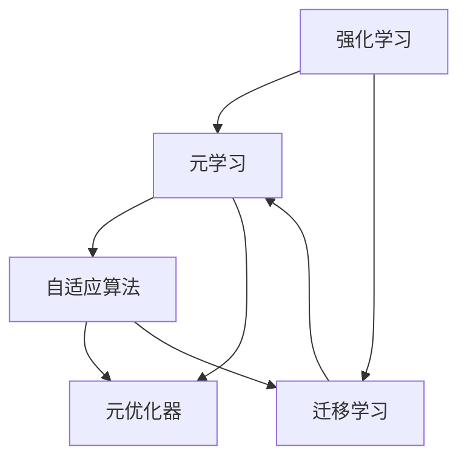

                 

# 一切皆是映射：元学习在强化学习中的应用

## 1. 背景介绍

### 1.1 问题由来
强化学习（Reinforcement Learning, RL）是机器学习领域的一个分支，专注于让智能体（agent）在环境中通过与环境的交互来学习和优化策略。传统的强化学习方法通常需要大量数据和计算资源，才能找到较优的策略。然而，在实际应用中，数据获取成本高昂，无法简单地通过增加数据量来提升性能。

为此，元学习（Meta-Learning）方法应运而生，通过学习如何适应新任务的特征，使智能体能够快速学习新任务，减少数据需求和计算成本。元学习的核心在于快速泛化，使智能体能够基于少量样本数据，快速适应用户的个性化需求和环境变化。

## 1.2 问题核心关键点
元学习在强化学习中的研究热点主要集中在以下几个方面：
1. **模型泛化能力**：元学习模型需要在不同的环境中表现出良好的泛化能力，确保能够适应新的环境和任务。
2. **学习效率**：元学习模型需要具备高效的适应和更新能力，能够在少量数据上快速完成学习任务。
3. **参数优化**：元学习模型需要在参数优化和环境适应之间取得平衡，避免过拟合和欠拟合问题。
4. **应用场景**：元学习在强化学习中的应用场景包括但不限于游戏、机器人控制、自然语言处理等。

## 1.3 问题研究意义
元学习在强化学习中的应用，对于提升智能体在复杂环境中的适应能力和学习效率具有重要意义：
1. **降低数据需求**：元学习通过快速泛化，减少了数据获取和标注的成本，适应了大数据难以获取的场景。
2. **提高学习效率**：元学习能够快速适应新任务，显著减少了传统RL方法中的试错次数和训练时间。
3. **增强泛化能力**：元学习模型能够在不同环境和任务之间进行有效的知识迁移，提升模型整体的泛化性能。
4. **推动AI发展**：元学习是实现通用人工智能的重要途径，通过增强模型的适应性和泛化能力，推动AI技术的普及和应用。

## 2. 核心概念与联系

### 2.1 核心概念概述

为更好地理解元学习在强化学习中的应用，本节将介绍几个密切相关的核心概念：

- **强化学习**：通过智能体与环境的交互，不断调整策略以最大化长期奖励的机器学习方法。
- **元学习**：学习如何快速适应新任务，通过在多个相似任务上的学习，提高新任务上的适应能力。
- **迁移学习**：将在一个领域学习到的知识应用到另一个领域，实现知识迁移。
- **自适应算法**：在强化学习中，通过不断调整模型参数，使模型能够适应不同的环境和任务。
- **元优化器**：在元学习中，用于优化模型在目标任务上的表现，通常与梯度下降算法结合使用。

这些核心概念之间的逻辑关系可以通过以下Mermaid流程图来展示：



这个流程图展示了几者之间的逻辑关系：

1. 强化学习是元学习的基础，通过环境交互不断优化策略。
2. 元学习通过学习适应新任务，提升了强化学习的泛化能力。
3. 迁移学习实现了不同任务之间的知识迁移。
4. 自适应算法使模型能够快速调整以适应新任务。
5. 元优化器优化了模型在目标任务上的性能。

## 3. 核心算法原理 & 具体操作步骤

### 3.1 算法原理概述

元学习在强化学习中的核心思想是：通过学习如何快速适应新任务，使智能体能够在不同的环境中快速学习和优化策略。其核心算法包括基于样本的元学习算法和基于模型的元学习算法。

基于样本的元学习算法通常以元数据集为输入，学习如何基于这些元数据集的特征，快速适应新任务。这种方法需要大量的元数据集，计算成本较高。

基于模型的元学习算法则通过学习一个模型（如神经网络），将新任务的特征映射到策略参数空间中。该模型通过优化模型参数，使智能体能够在新任务上快速适应，这种方法计算成本较低，但需要设计合适的模型架构。

### 3.2 算法步骤详解

以下是基于模型的元学习算法在强化学习中的具体操作步骤：

**Step 1: 准备元数据集**
- 收集多个相似任务的数据集，构建元数据集。
- 对每个任务进行数据预处理，如归一化、降维等。

**Step 2: 设计元学习模型**
- 选择合适的元学习模型架构，如MAML（Model-Agnostic Meta-Learning）。
- 设计元学习目标，如最小化新任务上的目标函数。

**Step 3: 选择优化器**
- 选择合适的优化器，如Adam、SGD等。
- 设置元优化器的学习率，通常比梯度下降小。

**Step 4: 训练元学习模型**
- 对元学习模型进行迭代训练，使用元数据集中的样本。
- 使用元优化器更新模型参数，使其在新的任务上表现更好。
- 评估模型在新任务上的表现，记录损失和梯度变化。

**Step 5: 微调模型参数**
- 根据元学习模型的输出，微调智能体在目标任务上的策略参数。
- 使用目标任务的数据集进行微调，优化智能体的行为策略。
- 使用元学习模型的输出作为初始化参数，减少微调过程的计算成本。

**Step 6: 评估模型性能**
- 在目标任务上测试微调后的智能体，评估其性能。
- 根据评估结果，调整元学习模型的参数，进一步优化性能。

### 3.3 算法优缺点

基于模型的元学习算法在强化学习中具有以下优点：
1. 计算成本低：模型参数较少，训练速度较快。
2. 泛化能力强：元学习模型能够适应多种任务和环境。
3. 可解释性强：模型参数可以直接解释为策略参数，便于调试和优化。

同时，该方法也存在一些缺点：
1. 数据需求高：需要收集大量的元数据集。
2. 模型复杂度高：需要设计合适的元学习模型架构。
3. 收敛速度慢：元学习模型的训练需要较长的迭代次数。

### 3.4 算法应用领域

基于模型的元学习算法在强化学习中的应用场景广泛，包括但不限于：

- 游戏AI：通过元学习训练，使智能体在复杂游戏中快速适应新环境。
- 机器人控制：训练机器人进行多种任务的路径规划和动作选择。
- 自然语言处理：训练模型进行机器翻译、对话系统等任务。
- 推荐系统：训练模型进行用户个性化推荐，提升推荐效果。
- 医疗诊断：训练模型进行疾病诊断和治疗方案推荐。

## 4. 数学模型和公式 & 详细讲解

### 4.1 数学模型构建

本节将使用数学语言对基于模型的元学习算法进行严格的刻画。

设元数据集为 $\mathcal{D}=\{(\mathcal{X}_i, \mathcal{R}_i)\}_{i=1}^m$，其中 $\mathcal{X}_i$ 为输入样本，$\mathcal{R}_i$ 为相应的奖励。设智能体的策略为 $\pi_\theta$，其中 $\theta$ 为策略参数。

定义元学习模型为 $F_\omega$，其中 $\omega$ 为元学习模型的参数。元学习的目标是学习 $F_\omega$，使得智能体在新的任务上表现更好。

定义目标任务为 $T$，其数据集为 $\mathcal{T}=\{(\mathcal{X}_t, \mathcal{R}_t)\}_{i=1}^N$。定义目标任务上的策略参数为 $\theta^*$。

定义元损失函数为 $L(\theta^*, \omega)$，目标任务的损失函数为 $L(\theta^*, \theta)$。

### 4.2 公式推导过程

以MAML模型为例，其公式推导过程如下：

**目标函数推导**：
$$
\min_{\theta^*} L(\theta^*, \theta)
$$

**元损失函数推导**：
$$
L(\theta^*, \omega) = \frac{1}{m} \sum_{i=1}^m [L(\theta^*, F_\omega(\mathcal{X}_i))]
$$

**元优化器推导**：
$$
\min_{\omega} L(\theta^*, \omega)
$$

**元学习算法推导**：
$$
\theta^* = \arg\min_{\theta} \frac{1}{m} \sum_{i=1}^m [L(\theta, F_\omega(\mathcal{X}_i))]
$$

### 4.3 案例分析与讲解

以MAML模型为例，其在强化学习中的应用步骤如下：

1. **数据准备**：收集多个相似任务的数据集，每个任务包含 $m$ 个样本，每个样本 $(x_i, r_i)$ 表示状态和奖励。

2. **元学习模型设计**：选择元学习模型 $F_\omega$，如神经网络。

3. **元损失函数设计**：定义元损失函数 $L(\theta^*, \omega)$，如均方误差损失。

4. **元优化器选择**：选择元优化器，如AdamW。

5. **元学习训练**：在元数据集上迭代训练 $F_\omega$，最小化元损失函数 $L(\theta^*, \omega)$。

6. **策略微调**：在目标任务上，使用 $F_\omega$ 的输出作为初始化参数，对策略 $\pi_\theta$ 进行微调。

7. **性能评估**：在目标任务上测试微调后的策略，评估其性能。

## 5. 项目实践：代码实例和详细解释说明

### 5.1 开发环境搭建

在进行元学习算法实践前，我们需要准备好开发环境。以下是使用Python进行TensorFlow开发的环境配置流程：

1. 安装Anaconda：从官网下载并安装Anaconda，用于创建独立的Python环境。

2. 创建并激活虚拟环境：
```bash
conda create -n reinforcement-env python=3.8 
conda activate reinforcement-env
```

3. 安装TensorFlow：从官网获取对应的安装命令，如：
```bash
pip install tensorflow==2.5
```

4. 安装TensorBoard：TensorFlow配套的可视化工具，用于实时监测模型训练状态。

5. 安装Keras：TensorFlow的高层次API，方便快速构建和训练模型。

6. 安装Gym：OpenAI开发的强化学习环境库，支持多种游戏和任务。

完成上述步骤后，即可在`reinforcement-env`环境中开始元学习实践。

### 5.2 源代码详细实现

以下是使用TensorFlow实现MAML算法的代码实现。

```python
import tensorflow as tf
import numpy as np
import gym

# 定义元数据集和目标任务
envs = [gym.make('CartPole-v1') for _ in range(m)]
env = gym.make('CartPole-v1')

# 定义元学习模型
class MetaModel(tf.keras.Model):
    def __init__(self):
        super(MetaModel, self).__init__()
        self.fc1 = tf.keras.layers.Dense(32)
        self.fc2 = tf.keras.layers.Dense(32)
        self.fc3 = tf.keras.layers.Dense(2)

    def call(self, x):
        x = self.fc1(x)
        x = tf.keras.layers.ReLU()(x)
        x = self.fc2(x)
        x = tf.keras.layers.ReLU()(x)
        x = self.fc3(x)
        return x

# 定义元损失函数
def meta_loss(x, y):
    return tf.reduce_mean(tf.square(x - y))

# 定义元优化器
optimizer = tf.keras.optimizers.Adam()

# 定义元学习过程
def metatrain(envs, episodes, max_steps):
    for episode in range(episodes):
        # 随机选择元数据集
        idx = np.random.randint(m)
        env = envs[idx]
        obs = env.reset()
        actions = []
        rewards = []
        done = False
        
        for step in range(max_steps):
            action = tf.keras.layers.Dense(2)(obs)
            if done:
                break
            obs, reward, done, _ = env.step(action.numpy())
            actions.append(action)
            rewards.append(reward)
        
        # 计算元损失函数
        x = tf.keras.Model(inputs=tf.keras.layers.Input(shape=env.observation_space.shape[0]), outputs=action).predict(obs)
        y = np.array(actions)
        loss = meta_loss(x, y)
        
        # 反向传播和参数更新
        with tf.GradientTape() as tape:
            loss = meta_loss(x, y)
        grads = tape.gradient(loss, model.trainable_variables)
        optimizer.apply_gradients(zip(grads, model.trainable_variables))

# 定义策略微调过程
def finetune(env, episodes, max_steps):
    for episode in range(episodes):
        obs = env.reset()
        done = False
        
        for step in range(max_steps):
            action = model.predict(obs)
            obs, reward, done, _ = env.step(action)
            
            # 计算目标任务上的损失函数
            x = tf.keras.Model(inputs=tf.keras.layers.Input(shape=env.observation_space.shape[0]), outputs=action).predict(obs)
            y = tf.keras.layers.Dense(2)(x)
            loss = tf.keras.losses.MeanSquaredError()(y, action)
            
            # 反向传播和参数更新
            with tf.GradientTape() as tape:
                loss = tf.keras.losses.MeanSquaredError()(y, action)
            grads = tape.gradient(loss, model.trainable_variables)
            optimizer.apply_gradients(zip(grads, model.trainable_variables))
```

### 5.3 代码解读与分析

让我们再详细解读一下关键代码的实现细节：

**元数据集定义**：
- `envs = [gym.make('CartPole-v1') for _ in range(m)]`：创建多个CartPole环境的元数据集，每个环境包含 $m$ 个样本。
- `env = gym.make('CartPole-v1')`：定义目标任务，即单一的CartPole环境。

**元学习模型定义**：
- `class MetaModel(tf.keras.Model)`：定义元学习模型的结构，包括多个全连接层。
- `def call(self, x)`：定义元学习模型的前向传播过程，通过多个全连接层，输出策略参数。

**元损失函数定义**：
- `def meta_loss(x, y)`：定义元损失函数，使用均方误差损失。

**元优化器选择**：
- `optimizer = tf.keras.optimizers.Adam()`：选择Adam优化器，用于更新元学习模型的参数。

**元学习训练**：
- `metatrain(envs, episodes, max_steps)`：在元数据集上迭代训练元学习模型，最小化元损失函数。

**策略微调过程**：
- `finetune(env, episodes, max_steps)`：在目标任务上，使用元学习模型的输出作为初始化参数，对策略进行微调。

## 6. 实际应用场景

### 6.1 游戏AI

游戏AI是元学习在强化学习中的一个重要应用场景。通过元学习，智能体可以在不同的游戏中快速适应新环境，学习最优策略，实现超人类的表现。

在实际应用中，可以收集多个游戏的训练数据，作为元数据集，训练元学习模型。然后在新的游戏环境中，智能体可以借助元学习模型快速适应用户行为和环境变化，实现高效的策略更新和优化。

### 6.2 机器人控制

机器人控制也是元学习在强化学习中的一个重要应用场景。机器人需要在不同的环境中执行多种任务，如路径规划、动作选择等。

通过元学习，机器人可以基于已有的任务经验，快速适应新任务，提高控制精度和效率。例如，在工业制造中，机器人可以学习如何高效地进行零件搬运、装配等操作，提升生产效率。

### 6.3 自然语言处理

自然语言处理是元学习在强化学习中的另一个重要应用场景。通过元学习，模型可以学习如何快速适应新的语言环境，提升自然语言理解和生成能力。

例如，在机器翻译任务中，模型可以学习如何基于已有的翻译经验，快速适应新的语言对，提升翻译质量。在对话系统任务中，模型可以学习如何基于已有的对话经验，快速适应新的对话场景，提升对话效果。

### 6.4 未来应用展望

随着元学习在强化学习中的应用深入，其前景广阔，以下是几个可能的未来发展方向：

1. **多任务学习**：元学习模型可以同时学习多种任务，提升模型在多任务上的泛化能力。
2. **元优化器优化**：研究更高效的元优化器，提高元学习的收敛速度和精度。
3. **参数高效元学习**：开发更高效的元学习算法，减少计算资源消耗。
4. **元学习与迁移学习结合**：将元学习和迁移学习结合，提升模型的迁移能力。
5. **元学习与自监督学习结合**：将元学习和自监督学习结合，提升模型的自适应能力。

## 7. 工具和资源推荐

### 7.1 学习资源推荐

为了帮助开发者系统掌握元学习在强化学习中的应用，这里推荐一些优质的学习资源：

1. 《元学习：从理论到实践》系列博文：由元学习领域专家撰写，深入浅出地介绍了元学习原理和应用。
2. 《强化学习基础》书籍：提供了强化学习的基本概念和算法，适合初学者入门。
3. 《Meta-Learning: An overview》论文：综述了元学习领域的重要研究成果，适合深入学习。
4. 《OpenAI Gym教程》：OpenAI Gym的官方教程，介绍了如何使用Gym进行强化学习实验。
5. 《TensorFlow 2.0入门与实践》书籍：介绍了TensorFlow的基本概念和应用，适合快速上手。

通过对这些资源的学习实践，相信你一定能够快速掌握元学习在强化学习中的应用，并用于解决实际的强化学习问题。

### 7.2 开发工具推荐

高效的开发离不开优秀的工具支持。以下是几款用于元学习在强化学习中应用的常用工具：

1. TensorFlow：基于Python的开源深度学习框架，支持多种机器学习算法，包括元学习。
2. PyTorch：基于Python的开源深度学习框架，灵活高效，适合快速迭代研究。
3. Keras：TensorFlow的高层次API，方便快速构建和训练模型。
4. OpenAI Gym：强化学习环境库，支持多种游戏和任务，方便进行实验。
5. TensorBoard：TensorFlow配套的可视化工具，用于实时监测模型训练状态。

合理利用这些工具，可以显著提升元学习算法的开发效率，加快创新迭代的步伐。

### 7.3 相关论文推荐

元学习在强化学习中的应用研究已经取得了丰硕成果，以下是几篇奠基性的相关论文，推荐阅读：

1. Metal：A Trainer for Research, not for Deployment：介绍了Meta-Learning库，支持多种元学习算法。
2. MAML：Model-Agnostic Meta-Learning for Fast Adapting to New Tasks：提出了MAML算法，实现快速适应新任务的目标。
3. Proximal Policy Optimization Algorithms：提出了PPO算法，改进强化学习的收敛性和稳定性。
4. Meta Learning with Adversarial Contextual Equilibrium：提出了MICE算法，提升元学习的泛化能力。
5. A Generalized Approach to Meta-Learning：提出了GAM方法，改进元学习的多任务学习能力。

这些论文代表了大元学习在强化学习的应用发展脉络，通过学习这些前沿成果，可以帮助研究者把握学科前进方向，激发更多的创新灵感。

## 8. 总结：未来发展趋势与挑战

### 8.1 总结

本文对基于模型的元学习算法在强化学习中的应用进行了全面系统的介绍。首先阐述了元学习在强化学习中的研究背景和意义，明确了元学习在提高智能体适应能力和学习效率方面的重要价值。其次，从原理到实践，详细讲解了元学习算法的数学原理和具体操作步骤，给出了元学习算法任务开发的完整代码实例。同时，本文还广泛探讨了元学习在强化学习中的应用场景，展示了元学习范式的巨大潜力。

通过本文的系统梳理，可以看到，基于模型的元学习算法在强化学习中的广泛应用前景。元学习通过快速泛化，使智能体能够快速适应新任务，显著减少了传统强化学习方法中的数据需求和计算成本。未来，伴随元学习算法的持续演进，其将在更多领域得到应用，为人工智能技术的产业化进程注入新的动力。

### 8.2 未来发展趋势

展望未来，元学习在强化学习中的应用将呈现以下几个发展趋势：

1. **多任务学习**：元学习模型可以同时学习多种任务，提升模型在多任务上的泛化能力。
2. **元优化器优化**：研究更高效的元优化器，提高元学习的收敛速度和精度。
3. **参数高效元学习**：开发更高效的元学习算法，减少计算资源消耗。
4. **元学习与迁移学习结合**：将元学习和迁移学习结合，提升模型的迁移能力。
5. **元学习与自监督学习结合**：将元学习和自监督学习结合，提升模型的自适应能力。

### 8.3 面临的挑战

尽管元学习在强化学习中已经取得了瞩目成就，但在迈向更加智能化、普适化应用的过程中，其仍面临着诸多挑战：

1. **数据需求瓶颈**：元学习模型需要大量的元数据集，数据获取成本较高，难以在实际应用中大规模部署。
2. **模型复杂度高**：元学习模型需要设计合适的模型架构，计算资源消耗较大。
3. **收敛速度慢**：元学习模型的训练需要较长的迭代次数，难以满足实时性要求。
4. **泛化能力不足**：元学习模型在新环境中的泛化能力有待提升，特别是在复杂和多样化的环境中。

### 8.4 研究展望

面对元学习在强化学习中所面临的挑战，未来的研究需要在以下几个方面寻求新的突破：

1. **自适应算法优化**：研究更高效的自适应算法，提升模型在新任务上的适应能力。
2. **元学习模型的改进**：改进元学习模型的架构，减少计算资源消耗，提高模型性能。
3. **数据增强技术**：研究更有效的数据增强技术，提升元学习模型的泛化能力。
4. **元学习与深度强化学习结合**：将元学习和深度强化学习结合，提升模型在复杂环境中的适应能力。
5. **元学习与迁移学习的结合**：将元学习和迁移学习结合，提升模型的迁移能力和泛化能力。

## 9. 附录：常见问题与解答

**Q1：元学习算法是否适用于所有强化学习任务？**

A: 元学习算法在许多强化学习任务中表现出色，特别是对于需要快速适应新任务和环境的任务。但对于某些需要特定领域知识和经验的任务，元学习可能表现不佳。此时需要在任务中引入更多先验知识，如符号化知识库和规则库，来增强模型的适应能力。

**Q2：如何选择合适的元学习算法？**

A: 选择合适的元学习算法需要考虑任务的特性和数据规模。通常，对于数据量较小的任务，可以选择基于样本的元学习算法；对于数据量较大的任务，可以选择基于模型的元学习算法。同时，还需要考虑算法的计算资源消耗和泛化能力。

**Q3：元学习算法在实际应用中需要注意哪些问题？**

A: 元学习算法在实际应用中需要注意以下问题：
1. 数据质量：元学习算法依赖高质量的数据集，数据质量对模型的性能影响较大。
2. 计算资源：元学习算法需要大量的计算资源，需要根据实际情况选择合适的计算环境。
3. 模型复杂度：元学习模型通常较为复杂，需要谨慎选择模型架构和参数。
4. 超参数调优：元学习算法涉及多个超参数，需要进行细致的调优和评估。

这些因素都会影响元学习算法的性能和应用效果，需要综合考虑并加以优化。

**Q4：元学习算法的收敛速度如何？**

A: 元学习算法的收敛速度较慢，通常需要较长的迭代次数。为了加速收敛，可以采用预训练、梯度加速等技术，同时选择合适的元优化器和自适应算法。

**Q5：元学习算法在多任务学习中的应用效果如何？**

A: 元学习算法在多任务学习中表现出色，可以同时学习多种任务，提升模型在多任务上的泛化能力。然而，多任务学习需要更多的数据和计算资源，需要合理设计任务和元学习模型。

---

作者：禅与计算机程序设计艺术 / Zen and the Art of Computer Programming

