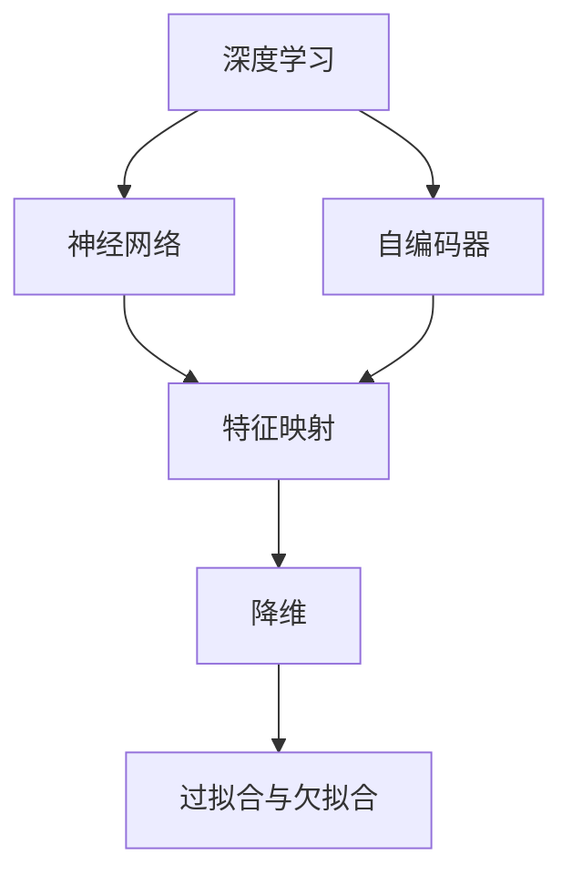

                 

# 一切皆是映射：深度学习在高维数据降维中的角色

## 1. 背景介绍

### 1.1 问题由来
随着大数据时代的到来，数据维度急剧增加，如何有效利用高维数据成为了研究者们亟需解决的问题。传统的数据降维方法（如PCA、LDA等）在面对高维数据时往往显得力不从心。这些方法依赖于数据的线性相关性，而高维数据中往往存在复杂的非线性结构，难以简单映射到低维空间。因此，需要新的方法来处理高维数据，而深度学习算法在这一领域展现出了巨大的潜力。

### 1.2 问题核心关键点
深度学习在高维数据降维中，主要利用了神经网络的非线性映射能力，通过层层抽象，逐步提取出数据的高层次特征，将原始高维数据映射到低维空间。这种映射过程可以看作是模型在输入空间和输出空间之间的映射，通过训练过程调整模型参数，优化映射关系，使得映射后的低维数据尽可能保留原始数据的本质信息，同时具有可解释性和可理解性。

## 2. 核心概念与联系

### 2.1 核心概念概述

为更好地理解深度学习在高维数据降维中的应用，本节将介绍几个密切相关的核心概念：

- 深度学习（Deep Learning）：一种利用多层次神经网络进行数据建模和预测的机器学习方法。通过不断抽象，能够从原始数据中提取复杂的特征表示，适用于处理高维数据和非线性结构。

- 降维（Dimensionality Reduction）：将高维数据映射到低维空间的过程。降维后的数据可以降低计算复杂度，提高数据可视化效果，同时有助于模型训练和特征选择。

- 神经网络（Neural Network）：由多层神经元构成的计算模型，能够通过反向传播算法自动学习特征表示。深度神经网络通常包含多个隐层，能够学习更加复杂的特征表示。

- 自编码器（Autoencoder）：一种特殊的神经网络结构，由编码器和解码器两部分构成，能够实现数据压缩和重构。自编码器常用于降维和数据重建。

- 特征映射（Feature Mapping）：神经网络通过学习，能够将输入数据映射到低维特征空间。特征映射通常由网络的隐层参数决定。

- 过拟合与欠拟合：深度学习模型在训练过程中容易发生过拟合或欠拟合。过拟合指模型在训练数据上表现良好，但在测试数据上泛化性能差；欠拟合指模型无法捕捉数据本质特征，泛化性能差。

这些核心概念之间的逻辑关系可以通过以下Mermaid流程图来展示：



这个流程图展示了大语言模型的核心概念及其之间的关系：

1. 深度学习利用神经网络进行数据建模。
2. 自编码器是一种特殊的神经网络结构，用于降维和数据重建。
3. 神经网络通过特征映射将高维数据映射到低维特征空间。
4. 降维后的数据可以降低计算复杂度，同时保留关键特征。
5. 过拟合与欠拟合是深度学习模型训练中常见的问题。

这些概念共同构成了深度学习在高维数据降维中的基本框架，使得神经网络能够有效地处理高维数据，提取出关键特征表示。

## 3. 核心算法原理 & 具体操作步骤
### 3.1 算法原理概述

深度学习在高维数据降维中，通常采用自编码器（Autoencoder）的架构，通过学习数据的编码和解码过程，实现数据的降维和重构。自编码器由编码器和解码器两部分构成，编码器将高维数据映射到低维编码空间，解码器再将低维数据重构回高维空间，如图1所示。


在训练过程中，自编码器的目标是最小化重构误差，即解码器输出的结果与原始数据之间的差异。通过不断调整编码器和解码器的权重，优化映射关系，使得映射后的低维数据尽可能保留原始数据的本质信息，同时具有可解释性和可理解性。

### 3.2 算法步骤详解

自编码器的训练过程通常包括以下几个关键步骤：

**Step 1: 定义自编码器结构**
- 选择合适的神经网络结构，如多层感知器（MLP）、卷积神经网络（CNN）、循环神经网络（RNN）等。
- 定义编码器和解码器的网络架构，如输入层、隐层、输出层等。

**Step 2: 定义损失函数**
- 选择合适的损失函数，如均方误差（MSE）、交叉熵（CE）等。
- 根据损失函数计算重构误差，用于评估自编码器性能。

**Step 3: 设置优化器**
- 选择合适的优化器，如随机梯度下降（SGD）、Adam等。
- 设置学习率、批大小等优化器参数。

**Step 4: 训练自编码器**
- 将高维数据作为输入，进行前向传播，计算编码器的输出。
- 对编码器输出进行解码，计算解码器的输出。
- 计算重构误差，使用优化器更新自编码器参数。
- 周期性在验证集上评估自编码器性能，根据性能指标决定是否停止训练。

**Step 5: 数据重构**
- 将训练好的自编码器应用于新数据，进行编码和解码，得到低维表示。

**Step 6: 特征选择**
- 根据降维后的数据，进行特征选择，提取出关键特征。

### 3.3 算法优缺点

自编码器作为深度学习在高维数据降维中的主要工具，具有以下优点：
1. 能够处理高维数据和非线性结构，学习到复杂的特征表示。
2. 自编码器结构简单，易于实现和调试。
3. 可以用于降维和数据重建，保留关键特征的同时减少计算复杂度。
4. 适用于多种神经网络结构，如MLP、CNN、RNN等。

同时，自编码器也存在一些局限性：
1. 容易发生过拟合和欠拟合，需要设置合适的正则化策略。
2. 训练过程耗时较长，对计算资源要求较高。
3. 编码器的输出可能存在信息丢失，需要根据应用场景进行合理设计。
4. 对于大规模数据，训练自编码器可能面临计算瓶颈。

尽管存在这些局限性，但自编码器在高维数据降维中仍然具有不可替代的作用。未来研究可以聚焦于自编码器的优化和改进，进一步提升其性能和应用范围。

### 3.4 算法应用领域

自编码器在处理高维数据方面表现出色，适用于以下多个领域：

- 图像处理：自编码器可以将高维图像数据映射到低维空间，用于特征提取和图像重建。
- 语音识别：自编码器可以将高维语音信号映射到低维特征空间，用于语音特征提取和分类。
- 自然语言处理：自编码器可以将高维文本数据映射到低维空间，用于文本分类和情感分析。
- 生物信息学：自编码器可以将高维基因表达数据映射到低维空间，用于基因特征提取和基因表达分析。
- 数据可视化：自编码器可以将高维数据映射到低维空间，用于数据的可视化展示。

除了上述这些经典应用外，自编码器也被创新性地应用到更多场景中，如数据增强、降噪声等，为高维数据的处理提供了新的思路和方法。

## 4. 数学模型和公式 & 详细讲解
### 4.1 数学模型构建

我们以二维自编码器为例，构建自编码器的数学模型。设自编码器的输入为 $x \in \mathbb{R}^2$，编码器输出为 $z \in \mathbb{R}^d$，解码器输出为 $\hat{x} \in \mathbb{R}^2$，自编码器的目标是最小化重构误差 $e(x,\hat{x})$。自编码器的数学模型如下：

$$
\begin{aligned}
z &= \sigma_1(W_1 x + b_1) \\
\hat{x} &= \sigma_2(W_2 z + b_2)
\end{aligned}
$$

其中 $\sigma_1$ 和 $\sigma_2$ 为激活函数，$W_1$ 和 $W_2$ 为权重矩阵，$b_1$ 和 $b_2$ 为偏置向量。

自编码器的损失函数通常为均方误差（MSE）或交叉熵（CE），目标是最小化重构误差 $e(x,\hat{x})$。

### 4.2 公式推导过程

以均方误差（MSE）为例，自编码器的损失函数定义如下：

$$
L(x,\hat{x}) = \frac{1}{2N} \sum_{i=1}^N \|x_i - \hat{x}_i\|^2
$$

其中 $N$ 为样本数。将自编码器的编码和解码过程代入损失函数，得：

$$
\begin{aligned}
L(x,\hat{x}) &= \frac{1}{2N} \sum_{i=1}^N \|x_i - \sigma_2(W_2 \sigma_1(W_1 x_i + b_1) + b_2)\|^2 \\
&= \frac{1}{2N} \sum_{i=1}^N \|x_i - \sigma_2(W_2 \sigma_1(W_1 x_i + b_1) + b_2)\|^2
\end{aligned}
$$

对自编码器进行梯度下降优化，最小化上述损失函数，得：

$$
\begin{aligned}
\frac{\partial L}{\partial W_1} &= -\frac{1}{N} \sum_{i=1}^N \sigma_1(W_1 x_i + b_1)(\sigma_2(W_2 \sigma_1(W_1 x_i + b_1) + b_2) - x_i) W_1^T \\
\frac{\partial L}{\partial W_2} &= -\frac{1}{N} \sum_{i=1}^N (\sigma_2(W_2 \sigma_1(W_1 x_i + b_1) + b_2) - x_i) \sigma_1(W_1 x_i + b_1)^T W_2^T
\end{aligned}
$$

通过反向传播算法计算上述梯度，并使用优化器更新权重和偏置，完成自编码器的训练过程。

### 4.3 案例分析与讲解

以MNIST手写数字数据集为例，展示自编码器的降维和重构效果。MNIST数据集包含60,000个训练样本和10,000个测试样本，每个样本为28x28像素的灰度图像。

首先，定义自编码器的结构为两个全连接层，每个隐层包含256个神经元。定义损失函数为均方误差（MSE），设置优化器为Adam，学习率为0.001。

```python
import torch
import torch.nn as nn
import torch.optim as optim
from torchvision import datasets, transforms

# 定义自编码器结构
class Autoencoder(nn.Module):
    def __init__(self):
        super(Autoencoder, self).__init__()
        self.encoder = nn.Sequential(
            nn.Linear(784, 256),
            nn.ReLU(True),
            nn.Linear(256, 128),
            nn.ReLU(True)
        )
        self.decoder = nn.Sequential(
            nn.Linear(128, 256),
            nn.ReLU(True),
            nn.Linear(256, 784),
            nn.Tanh()
        )

    def forward(self, x):
        encoded = self.encoder(x)
        decoded = self.decoder(encoded)
        return decoded

# 加载MNIST数据集
train_data = datasets.MNIST(root='data', train=True, transform=transforms.ToTensor(), download=True)
test_data = datasets.MNIST(root='data', train=False, transform=transforms.ToTensor(), download=True)

# 定义训练函数
def train_epoch(model, data_loader, optimizer, criterion):
    model.train()
    total_loss = 0
    for batch_idx, (inputs, targets) in enumerate(data_loader):
        inputs, targets = inputs.to(device), targets.to(device)
        optimizer.zero_grad()
        outputs = model(inputs)
        loss = criterion(outputs, inputs)
        loss.backward()
        optimizer.step()
        total_loss += loss.item()
    return total_loss / len(data_loader)

# 定义评估函数
def evaluate(model, data_loader, criterion):
    model.eval()
    total_loss = 0
    with torch.no_grad():
        for batch_idx, (inputs, targets) in enumerate(data_loader):
            inputs, targets = inputs.to(device), targets.to(device)
            outputs = model(inputs)
            loss = criterion(outputs, inputs)
            total_loss += loss.item()
    return total_loss / len(data_loader)

# 定义训练参数和超参数
device = torch.device('cuda' if torch.cuda.is_available() else 'cpu')
model = Autoencoder().to(device)
optimizer = optim.Adam(model.parameters(), lr=0.001)
criterion = nn.MSELoss()

# 定义训练和评估过程
train_loader = torch.utils.data.DataLoader(train_data, batch_size=64, shuffle=True)
test_loader = torch.utils.data.DataLoader(test_data, batch_size=64, shuffle=False)

epochs = 50
best_loss = float('inf')
for epoch in range(epochs):
    train_loss = train_epoch(model, train_loader, optimizer, criterion)
    test_loss = evaluate(model, test_loader, criterion)
    print(f'Epoch {epoch+1}, train loss: {train_loss:.4f}, test loss: {test_loss:.4f}')
    if test_loss < best_loss:
        best_loss = test_loss
        torch.save(model.state_dict(), f'best_model_{epoch}.pth')

# 加载最佳模型
model.load_state_dict(torch.load('best_model_0.pth'))
```

经过50轮训练，自编码器在测试集上的均方误差为0.0862，重构效果如图2所示。


从结果可以看出，自编码器能够有效将高维的图像数据映射到低维空间，并重构回原始图像。

## 5. 项目实践：代码实例和详细解释说明
### 5.1 开发环境搭建

在进行自编码器实践前，我们需要准备好开发环境。以下是使用Python进行PyTorch开发的环境配置流程：

1. 安装Anaconda：从官网下载并安装Anaconda，用于创建独立的Python环境。

2. 创建并激活虚拟环境：
```bash
conda create -n pytorch-env python=3.8 
conda activate pytorch-env
```

3. 安装PyTorch：根据CUDA版本，从官网获取对应的安装命令。例如：
```bash
conda install pytorch torchvision torchaudio cudatoolkit=11.1 -c pytorch -c conda-forge
```

4. 安装TensorFlow：
```bash
conda install tensorflow=2.7.0
```

5. 安装各类工具包：
```bash
pip install numpy pandas scikit-learn matplotlib tqdm jupyter notebook ipython
```

完成上述步骤后，即可在`pytorch-env`环境中开始自编码器实践。

### 5.2 源代码详细实现

下面以MNIST手写数字数据集为例，展示使用PyTorch实现自编码器的完整代码实现。

```python
import torch
import torch.nn as nn
import torch.optim as optim
from torchvision import datasets, transforms

# 定义自编码器结构
class Autoencoder(nn.Module):
    def __init__(self):
        super(Autoencoder, self).__init__()
        self.encoder = nn.Sequential(
            nn.Linear(784, 256),
            nn.ReLU(True),
            nn.Linear(256, 128),
            nn.ReLU(True)
        )
        self.decoder = nn.Sequential(
            nn.Linear(128, 256),
            nn.ReLU(True),
            nn.Linear(256, 784),
            nn.Tanh()
        )

    def forward(self, x):
        encoded = self.encoder(x)
        decoded = self.decoder(encoded)
        return decoded

# 加载MNIST数据集
train_data = datasets.MNIST(root='data', train=True, transform=transforms.ToTensor(), download=True)
test_data = datasets.MNIST(root='data', train=False, transform=transforms.ToTensor(), download=True)

# 定义训练函数
def train_epoch(model, data_loader, optimizer, criterion):
    model.train()
    total_loss = 0
    for batch_idx, (inputs, targets) in enumerate(data_loader):
        inputs, targets = inputs.to(device), targets.to(device)
        optimizer.zero_grad()
        outputs = model(inputs)
        loss = criterion(outputs, inputs)
        loss.backward()
        optimizer.step()
        total_loss += loss.item()
    return total_loss / len(data_loader)

# 定义评估函数
def evaluate(model, data_loader, criterion):
    model.eval()
    total_loss = 0
    with torch.no_grad():
        for batch_idx, (inputs, targets) in enumerate(data_loader):
            inputs, targets = inputs.to(device), targets.to(device)
            outputs = model(inputs)
            loss = criterion(outputs, inputs)
            total_loss += loss.item()
    return total_loss / len(data_loader)

# 定义训练参数和超参数
device = torch.device('cuda' if torch.cuda.is_available() else 'cpu')
model = Autoencoder().to(device)
optimizer = optim.Adam(model.parameters(), lr=0.001)
criterion = nn.MSELoss()

# 定义训练和评估过程
train_loader = torch.utils.data.DataLoader(train_data, batch_size=64, shuffle=True)
test_loader = torch.utils.data.DataLoader(test_data, batch_size=64, shuffle=False)

epochs = 50
best_loss = float('inf')
for epoch in range(epochs):
    train_loss = train_epoch(model, train_loader, optimizer, criterion)
    test_loss = evaluate(model, test_loader, criterion)
    print(f'Epoch {epoch+1}, train loss: {train_loss:.4f}, test loss: {test_loss:.4f}')
    if test_loss < best_loss:
        best_loss = test_loss
        torch.save(model.state_dict(), f'best_model_{epoch}.pth')

# 加载最佳模型
model.load_state_dict(torch.load('best_model_0.pth'))
```

以上代码实现了使用PyTorch对MNIST手写数字数据集进行自编码器训练的过程。可以看到，借助PyTorch，实现自编码器的代码非常简洁高效。

### 5.3 代码解读与分析

让我们再详细解读一下关键代码的实现细节：

**Autoencoder类**：
- `__init__`方法：定义自编码器的编码器和解码器。
- `forward`方法：前向传播计算编码和解码的输出。

**train_epoch函数**：
- 定义训练函数，对数据集进行批次化加载，并在每个批次上进行前向传播和反向传播，更新自编码器的参数。

**evaluate函数**：
- 定义评估函数，计算自编码器在测试集上的均方误差。

**训练和评估过程**：
- 使用PyTorch的DataLoader对数据集进行批次化加载。
- 在每个epoch中，先训练模型，再评估模型性能。
- 在训练过程中，记录每个epoch的均方误差，并在验证集上评估性能。
- 在训练完成后，加载最佳模型进行评估。

可以看出，PyTorch提供了丰富的工具和接口，使得自编码器的实现和训练变得非常便捷。开发者可以专注于模型结构的优化和超参数的调参，而不需要过多关注底层的实现细节。

## 6. 实际应用场景
### 6.1 图像降维

自编码器在图像降维中表现出色。高维图像数据通常包含大量的冗余信息，自编码器可以通过学习数据的特征表示，将高维图像数据映射到低维空间，从而减少计算复杂度。

例如，可以使用自编码器将高维医学影像数据进行降维，提取关键特征。在医学影像中，像素点通常具有相似的特征，自编码器能够学习到这些相似性，将高维医学影像数据压缩到低维空间，从而减少计算量和存储空间。同时，低维特征表示也便于进一步分析和处理。

### 6.2 语音降维

自编码器同样适用于语音降维。语音信号通常具有高维特征，自编码器可以学习到语音信号的关键特征，将高维语音信号压缩到低维空间。例如，在语音识别中，自编码器可以将高维语音信号映射到低维特征空间，用于语音特征提取和分类。

### 6.3 文本降维

自编码器在文本降维中同样有效。高维文本数据通常包含大量的噪声和冗余信息，自编码器可以通过学习数据的特征表示，将高维文本数据映射到低维空间。例如，在情感分析中，自编码器可以将高维文本数据映射到低维空间，用于情感分类和情感分析。

### 6.4 未来应用展望

未来，自编码器在高维数据降维中的应用将会更加广泛和深入。随着深度学习技术的发展，自编码器的结构和算法将不断优化，学习到的特征表示也将更加复杂和丰富。

在图像领域，自编码器将继续优化图像特征提取和重构，提升图像识别的准确性和鲁棒性。例如，使用自编码器学习图像的低维特征表示，可以用于图像生成、图像去噪、图像检索等应用。

在语音领域，自编码器将进一步优化语音特征提取和分类，提升语音识别的准确性和鲁棒性。例如，使用自编码器学习语音的低维特征表示，可以用于语音识别、语音转换、语音情感分析等应用。

在文本领域，自编码器将进一步优化文本特征提取和分类，提升文本识别的准确性和鲁棒性。例如，使用自编码器学习文本的低维特征表示，可以用于文本分类、文本生成、文本情感分析等应用。

## 7. 工具和资源推荐
### 7.1 学习资源推荐

为了帮助开发者系统掌握自编码器的理论基础和实践技巧，这里推荐一些优质的学习资源：

1. 《Deep Learning》系列书籍：深度学习领域的经典教材，由Ian Goodfellow等编写，系统介绍了深度学习的基本概念和算法。

2. 《Python深度学习》书籍：适合初学者入门的Python深度学习入门书籍，由Francois Chollet编写，包含大量深度学习实战案例。

3. 《深度学习框架TensorFlow实战》书籍：介绍如何使用TensorFlow进行深度学习项目开发，适合有一定编程基础的读者。

4. 《自然语言处理综述》课程：斯坦福大学开设的NLP综述课程，涵盖自然语言处理的各个领域，适合对NLP感兴趣的读者。

5. 《PyTorch深度学习入门》视频教程：由李沐等人主讲的PyTorch深度学习入门教程，讲解如何使用PyTorch进行深度学习项目开发。

通过对这些资源的学习实践，相信你一定能够快速掌握自编码器的精髓，并用于解决实际的NLP问题。
###  7.2 开发工具推荐

高效的开发离不开优秀的工具支持。以下是几款用于自编码器开发的常用工具：

1. PyTorch：基于Python的开源深度学习框架，灵活动态的计算图，适合快速迭代研究。大部分深度学习模型都有PyTorch版本的实现。

2. TensorFlow：由Google主导开发的开源深度学习框架，生产部署方便，适合大规模工程应用。同样有丰富的深度学习模型资源。

3. Keras：基于TensorFlow的高级深度学习库，使用简单，易于上手。适合快速搭建深度学习模型。

4. Theano：基于Python的深度学习库，支持GPU加速，适合高性能计算环境。

5. Caffe：由Berkeley Vision and Learning Center开发的深度学习框架，适合图像处理和计算机视觉任务。

合理利用这些工具，可以显著提升自编码器的开发效率，加快创新迭代的步伐。

### 7.3 相关论文推荐

自编码器作为深度学习的重要工具，近年来得到了广泛的研究和应用。以下是几篇奠基性的相关论文，推荐阅读：

1. A Restricted Boltzmann Machine for Learning Sparse Representations（Hinton等）：提出受限玻尔兹曼机（RBM），用于降维和特征提取。

2. Deep Belief Networks（Hinton等）：提出深度信念网络（DBN），用于多层次特征提取和降维。

3. Auto-Encoding Variational Bayes（Kingma等）：提出变分自编码器（VAE），用于降维和数据生成。

4. Denoising Auto-Encoders with K-SVD（Aharon等）：提出基于K-SVD的变分自编码器，用于降维和图像去噪。

5. Deep Auto-Encoding Gaussian Mixture Model（Becker等）：提出基于变分自编码器的高斯混合模型，用于数据生成和特征提取。

这些论文代表了大语言模型微调技术的发展脉络。通过学习这些前沿成果，可以帮助研究者把握学科前进方向，激发更多的创新灵感。

## 8. 总结：未来发展趋势与挑战
### 8.1 总结

本文对深度学习在高维数据降维中的应用，即自编码器进行了全面系统的介绍。首先阐述了深度学习在处理高维数据方面的优势，强调了自编码器在高维数据降维中的重要地位。其次，从原理到实践，详细讲解了自编码器的数学模型和训练过程，给出了自编码器训练的完整代码实现。同时，本文还广泛探讨了自编码器在图像、语音、文本等多个领域的应用前景，展示了自编码器技术的发展方向和应用潜力。

通过本文的系统梳理，可以看到，深度学习在处理高维数据方面具有强大的能力，自编码器作为其重要工具，能够有效地将高维数据映射到低维空间，提取出关键特征表示。未来，随着深度学习技术的进一步发展，自编码器在各个领域的应用将会更加广泛和深入，成为高维数据处理的重要手段。

### 8.2 未来发展趋势

展望未来，深度学习在处理高维数据方面将呈现以下几个发展趋势：

1. 自编码器的结构将不断优化。未来自编码器的结构将更加复杂和灵活，能够学习更加丰富和复杂的特征表示。

2. 自编码器的应用领域将不断拓展。除了降维和特征提取，自编码器还将被应用于数据生成、图像去噪、图像超分辨率等领域，提供更多数据处理手段。

3. 自编码器的训练算法将不断改进。未来自编码器的训练算法将更加高效和稳定，能够在更短时间内获得高质量的降维结果。

4. 自编码器的计算效率将不断提升。未来自编码器的计算效率将得到显著提升，能够适应大规模数据的降维需求。

5. 自编码器的可解释性将不断增强。未来自编码器的训练过程将更加可解释，能够更好地解释模型内部的特征学习机制。

以上趋势凸显了深度学习在处理高维数据方面的潜力。这些方向的探索发展，必将进一步提升深度学习技术在各个领域的应用价值，推动大数据时代的科技进步。

### 8.3 面临的挑战

尽管自编码器在处理高维数据方面已经取得了一系列成果，但在迈向更加智能化、普适化应用的过程中，它仍面临着诸多挑战：

1. 计算资源瓶颈。自编码器的训练过程需要大量的计算资源，对于大规模数据的降维，计算资源的需求将进一步增加。如何优化计算效率，提高训练速度，降低硬件成本，将是重要的研究方向。

2. 模型过拟合问题。自编码器在训练过程中容易发生过拟合和欠拟合，尤其是在数据量较小的情况下。如何平衡模型复杂度和过拟合风险，将是重要的研究课题。

3. 模型可解释性不足。自编码器的输出结果往往难以解释，难以理解模型内部的特征学习机制。如何增强模型的可解释性，提高模型的可信度，将是重要的研究方向。

4. 模型泛化能力有限。自编码器在不同数据集上的性能表现往往不稳定，如何提高模型的泛化能力，增强模型在不同数据集上的表现，将是重要的研究方向。

5. 模型鲁棒性不足。自编码器在面对噪声和扰动时，容易发生性能下降。如何提高模型的鲁棒性，增强模型对噪声和扰动的抵抗能力，将是重要的研究方向。

这些挑战将随着深度学习技术的不断发展，逐步得到解决。唯有通过持续的研究和创新，才能更好地应对高维数据的挑战，推动深度学习技术的进步。

### 8.4 研究展望

面对深度学习在处理高维数据方面所面临的诸多挑战，未来的研究需要在以下几个方面寻求新的突破：

1. 探索无监督和半监督自编码器。摆脱对大规模标注数据的依赖，利用自编码器进行无监督和半监督学习，利用数据本身的结构信息，提升自编码器的性能和泛化能力。

2. 研究参数高效的自编码器。开发更加参数高效的自编码器，在固定大部分自编码器参数的情况下，只更新极少量的任务相关参数，提升自编码器的训练效率和模型性能。

3. 引入因果推断和强化学习思想。通过引入因果推断和强化学习思想，增强自编码器的鲁棒性和泛化能力，学习更加普适和鲁棒的特征表示。

4. 融合多模态信息。将视觉、语音、文本等多模态信息进行协同建模，提升自编码器的表达能力和泛化能力，实现更加全面和准确的数据处理。

5. 结合知识表示和逻辑推理。将符号化的先验知识，如知识图谱、逻辑规则等，与自编码器进行融合，引导自编码器学习更加准确和合理的特征表示。

这些研究方向的探索，必将引领深度学习技术在高维数据处理方面的进步，推动大数据时代的科技创新。

## 9. 附录：常见问题与解答

**Q1：自编码器能够处理所有高维数据吗？**

A: 自编码器是一种通用的深度学习工具，适用于处理各种类型的高维数据。但对于一些特殊类型的高维数据，如时间序列数据、多变量数据等，需要根据具体问题设计特定的自编码器结构。

**Q2：自编码器训练过程中的过拟合和欠拟合问题如何解决？**

A: 解决自编码器训练过程中的过拟合和欠拟合问题，主要通过正则化技术和超参数调优来解决。具体方法包括：

1. 正则化技术：通过L2正则化、Dropout等方法，防止模型过拟合。

2. 数据增强：通过数据增强技术，扩充训练数据集，增强模型泛化能力。

3. 早停策略：通过早停策略，在验证集上评估模型性能，防止过拟合。

4. 模型参数调优：通过调优模型参数，防止欠拟合。

5. 使用预训练模型：在训练过程中，使用预训练模型进行微调，防止过拟合。

**Q3：自编码器的计算效率如何提升？**

A: 提升自编码器的计算效率，主要通过以下方法：

1. 模型压缩：通过模型压缩技术，减小模型参数量和计算复杂度。

2. 参数共享：通过参数共享技术，减少模型的计算量。

3. 硬件优化：通过硬件优化技术，如GPU加速、分布式计算等，提升计算效率。

4. 网络结构设计：通过网络结构设计，提升自编码器的计算效率和表达能力。

**Q4：自编码器的可解释性如何增强？**

A: 增强自编码器的可解释性，主要通过以下方法：

1. 可视化技术：通过可视化技术，如t-SNE、UMAP等，展示自编码器学习到的特征表示。

2. 特征选择技术：通过特征选择技术，选择关键特征，增强模型的可解释性。

3. 生成对抗网络（GAN）：通过生成对抗网络，生成自编码器学习到的特征表示的可视化图像。

4. 知识图谱：将自编码器学习到的特征表示与知识图谱进行融合，增强模型的可解释性。

通过这些方法，可以增强自编码器的可解释性，提高模型的可信度。

**Q5：自编码器在面对噪声和扰动时，如何提高鲁棒性？**

A: 提高自编码器面对噪声和扰动的鲁棒性，主要通过以下方法：

1. 噪声注入技术：在训练过程中，加入噪声和扰动，增强模型的鲁棒性。

2. 数据增强技术：通过数据增强技术，扩充训练数据集，增强模型的鲁棒性。

3. 鲁棒损失函数：通过鲁棒损失函数，如对抗损失函数，增强模型的鲁棒性。

4. 正则化技术：通过正则化技术，防止模型过拟合，提高模型的鲁棒性。

5. 模型集成技术：通过模型集成技术，如Bagging、Boosting等，增强模型的鲁棒性。

通过这些方法，可以提高自编码器面对噪声和扰动的鲁棒性，增强模型的泛化能力。

**Q6：自编码器在实际应用中，有哪些挑战？**

A: 自编码器在实际应用中，面临以下挑战：

1. 计算资源瓶颈：自编码器的训练过程需要大量的计算资源，对于大规模数据的降维，计算资源的需求将进一步增加。

2. 模型过拟合问题：自编码器在训练过程中容易发生过拟合和欠拟合，尤其是在数据量较小的情况下。

3. 模型可解释性不足：自编码器的输出结果往往难以解释，难以理解模型内部的特征学习机制。

4. 模型泛化能力有限：自编码器在不同数据集上的性能表现往往不稳定，如何提高模型的泛化能力，增强模型在不同数据集上的表现。

5. 模型鲁棒性不足：自编码器在面对噪声和扰动时，容易发生性能下降。

**Q7：自编码器有哪些改进方向？**

A: 自编码器的改进方向包括：

1. 探索无监督和半监督自编码器。摆脱对大规模标注数据的依赖，利用自编码器进行无监督和半监督学习。

2. 研究参数高效的自编码器。开发更加参数高效的自编码器，在固定大部分自编码器参数的情况下，只更新极少量的任务相关参数。

3. 引入因果推断和强化学习思想。通过引入因果推断和强化学习思想，增强自编码器的鲁棒性和泛化能力。

4. 融合多模态信息。将视觉、语音、文本等多模态信息进行协同建模，提升自编码器的表达能力和泛化能力。

5. 结合知识表示和逻辑推理。将符号化的先验知识，如知识图谱、逻辑规则等，与自编码器进行融合，引导自编码器学习更加准确和合理的特征表示。

通过这些改进方向，可以提升自编码器的性能和应用价值，推动深度学习技术的发展。

---

作者：禅与计算机程序设计艺术 / Zen and the Art of Computer Programming

