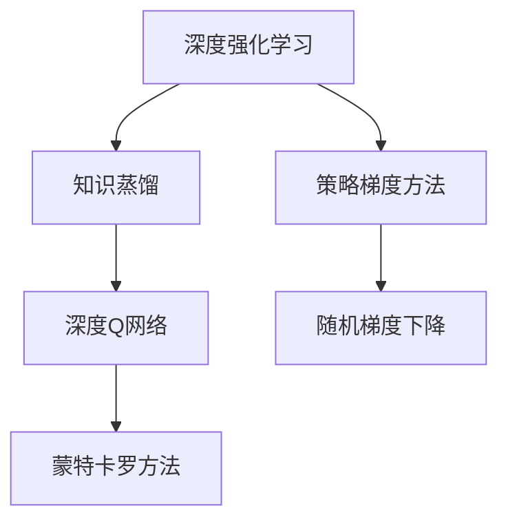

                 

# 一切皆是映射：深度强化学习中的知识蒸馏：DQN的案例实践

> 关键词：深度强化学习,知识蒸馏,知识提取,策略优化,决策树,蒙特卡罗方法

## 1. 背景介绍

### 1.1 问题由来
深度强化学习（Deep Reinforcement Learning, DRL）作为人工智能领域的前沿技术，通过深度学习与强化学习相结合，已经成功应用于游戏、机器人控制、自动驾驶等多个复杂领域。DRL的核心在于构建一个智能体(Agent)，通过与环境的交互，学会在给定的策略下最大化累积奖励。

然而，由于深度神经网络的高复杂度和训练的困难性，直接训练一个DRL模型通常需要大量的资源和时间。此外，训练出的模型还可能存在高方差、易过拟合等问题。因此，知识蒸馏（Knowledge Distillation, KD）技术被提出，作为深度学习模型转移知识的一种有效手段。

知识蒸馏是一种模型压缩技术，通过训练一个轻量级的"学生"模型，使其从"教师"模型（如预训练模型、集成模型等）中学习到知识，进而提高学生模型的性能。在DRL中，知识蒸馏则应用于将教师模型的知识（策略或价值函数）蒸馏到学生模型，从而提升DRL模型的效率和性能。

## 2. 核心概念与联系

### 2.1 核心概念概述

为更好地理解深度强化学习中的知识蒸馏技术，本节将介绍几个关键的概念及其之间的关系：

- 深度强化学习（Deep Reinforcement Learning, DRL）：通过深度学习网络实现环境与智能体间的策略学习，目标是通过最大化累积奖励实现特定任务的最优解。

- 知识蒸馏（Knowledge Distillation, KD）：通过将教师模型的知识（策略、参数、分布等）转移至学生模型，提升学生模型的泛化能力和性能。

- 深度Q网络（Deep Q-Network, DQN）：一种基于DRL的策略学习算法，通过学习Q值函数，指导智能体在每个状态下采取最优动作。

- 蒙特卡罗方法（Monte Carlo Method）：一种随机方法，通过随机采样求解统计指标，如Q值函数、策略等。

- 策略梯度方法（Policy Gradient Method）：一种直接优化策略的方法，通过梯度上升策略参数，提升策略优化效率。

这些概念之间的逻辑关系可以通过以下Mermaid流程图来展示：



这个流程图展示了大语言模型的核心概念及其之间的关系：

1. 深度强化学习通过与环境交互学习策略，目标是最小化累积奖励。
2. 知识蒸馏将教师模型的知识蒸馏到学生模型，提升模型泛化能力。
3. 深度Q网络通过学习Q值函数，指导智能体采取最优动作。
4. 蒙特卡罗方法通过随机采样求解Q值函数。
5. 策略梯度方法直接优化策略参数，提升策略优化效率。
6. 随机梯度下降是常见的优化算法，用于策略和Q值的优化。

这些概念共同构成了深度强化学习与知识蒸馏的应用框架，使其能够通过模型压缩、策略优化等手段，提升模型的性能和效率。通过理解这些核心概念，我们可以更好地把握深度强化学习中的知识蒸馏方法，以及其应用场景和限制。

## 3. 核心算法原理 & 具体操作步骤

### 3.1 算法原理概述

深度强化学习中的知识蒸馏，本质上是通过将教师模型的知识（如Q值函数）蒸馏到学生模型（如DQN），提高学生模型的泛化能力和性能。该过程分为两个阶段：

1. **预训练阶段**：在老师模型上收集统计信息，如Q值、策略分布等，作为蒸馏知识。
2. **蒸馏阶段**：通过知识蒸馏，将老师模型的知识传递给学生模型，学生模型在蒸馏知识指导下进行策略优化。

在DQN中，通过将教师模型的Q值函数作为监督信号，指导DQN模型的训练，可以提高DQN的泛化能力和性能。

### 3.2 算法步骤详解

基于知识蒸馏的DQN训练过程，一般包括以下几个关键步骤：

**Step 1: 准备教师模型和数据集**
- 选择一个已有预训练的深度神经网络作为教师模型，如DQN。
- 收集环境与智能体交互的数据集，用于预训练教师模型。

**Step 2: 收集教师知识**
- 在教师模型上使用蒙特卡罗方法收集统计信息，如Q值、策略分布等。
- 使用策略梯度方法优化教师模型的策略，提高其泛化能力。

**Step 3: 设计学生模型**
- 构建学生模型，通常为轻量级神经网络，如DQN。
- 选择合适的损失函数，如均方误差（MSE）损失，将学生模型与教师模型的Q值输出对齐。

**Step 4: 执行知识蒸馏**
- 通过随机梯度下降等优化算法，最小化学生模型与教师模型之间的差距，将教师模型的知识传递给学生模型。
- 使用蒸馏后的学生模型进行策略优化，进一步提升模型性能。

**Step 5: 测试和评估**
- 在测试集上评估蒸馏后的学生模型的性能，对比学生模型与教师模型的差距。
- 将蒸馏后的学生模型应用到实际问题中，验证其泛化能力和性能提升。

以上是基于知识蒸馏的DQN微调过程的一般流程。在实际应用中，还需要根据具体问题，对预训练模型和数据集进行优化设计，以进一步提升学生模型的性能。

### 3.3 算法优缺点

知识蒸馏的DQN方法具有以下优点：

1. 提升泛化能力：通过将教师模型的知识蒸馏到学生模型，学生模型能够更好地泛化到新的环境中。
2. 提高学习效率：学生在教师模型指导下进行训练，减少了从头训练的时间和成本。
3. 优化性能：学生模型可以学习到教师模型的鲁棒性和稳定性，提高模型的鲁棒性和可靠性。
4. 参数量减小：学生模型通常比教师模型参数量小，降低了存储和计算的资源消耗。

同时，该方法也存在一定的局限性：

1. 教师模型的选择：教师模型的性能和泛化能力直接影响学生模型的质量。
2. 知识对齐难度：学生模型与教师模型之间的知识对齐可能存在难度，需要通过调整损失函数等手段优化。
3. 知识传递过程：知识传递过程可能存在信息损失，需要通过多轮迭代优化。
4. 蒸馏效率：蒸馏过程可能较慢，尤其是当教师模型较为复杂时。

尽管存在这些局限性，但就目前而言，基于知识蒸馏的DQN方法仍是大语言模型应用的重要范式。未来相关研究的重点在于如何进一步提高蒸馏效率，优化知识对齐，实现更加高效的模型压缩和性能提升。

### 3.4 算法应用领域

基于DQN的知识蒸馏方法，在深度强化学习领域已经得到了广泛的应用，覆盖了多个具体任务，例如：

- 游戏智能体控制：通过知识蒸馏提高智能体在电子游戏中的控制策略，提升游戏性能。
- 机器人导航：通过知识蒸馏优化机器人在复杂环境中的导航策略，提高路径规划效率。
- 自动驾驶：通过知识蒸馏提升自动驾驶车辆的决策和控制策略，保障行车安全。
- 智能交易：通过知识蒸馏优化投资决策策略，提高资产管理的收益和风险控制。
- 智能调度：通过知识蒸馏优化资源分配和调度策略，提高生产效率和成本效益。

除了上述这些经典任务外，知识蒸馏方法还被创新性地应用到更多场景中，如智能推荐、供应链管理、能源优化等，为深度强化学习技术提供了新的应用方向。

## 4. 数学模型和公式 & 详细讲解  
### 4.1 数学模型构建

在基于知识蒸馏的DQN中，主要涉及以下几个数学模型：

- 状态-动作对集 $D=\{(s_i, a_i)\}_{i=1}^N$
- Q值函数 $Q(s, a)$
- 目标Q值函数 $Q_{\text{target}}(s, a)=r+\gamma Q(s', a')$
- 学生模型的Q值函数 $Q(s, a; \theta)$
- 学生模型的策略 $\pi(a|s)$

其中，$(s_i, a_i)$ 表示智能体在每个状态$s_i$下采取的动作$a_i$，$Q(s, a)$ 表示智能体在状态$s$下采取动作$a$的Q值，$Q_{\text{target}}(s, a)$ 表示智能体在状态$s$下采取动作$a$的目标Q值，$\theta$ 为学生模型的可训练参数。

### 4.2 公式推导过程

在基于知识蒸馏的DQN中，通常使用均方误差（MSE）损失函数来优化学生模型。具体而言，在每个时刻$t$，智能体在状态$s_t$下采取动作$a_t$，产生下一状态$s_{t+1}$，并获得即时奖励$r_{t+1}$。学生模型的Q值函数为 $Q(s_t, a_t; \theta)$，目标Q值函数为 $Q_{\text{target}}(s_{t+1}, a'; \theta)$，其中$a'$为智能体在下一状态$s_{t+1}$下最优的动作。

根据Q值函数的定义，目标Q值函数可以推导为：

$$
Q_{\text{target}}(s_{t+1}, a') = r_{t+1} + \gamma \max_a Q_{\text{target}}(s_{t+1}, a')
$$

因此，均方误差损失函数可以表示为：

$$
\mathcal{L} = \frac{1}{N}\sum_{i=1}^N [(Q_{\text{target}}(s_i, a_i) - Q(s_i, a_i; \theta))^2]
$$

在优化过程中，学生模型的参数$\theta$通过随机梯度下降（SGD）等算法更新，最小化上述损失函数。通过多轮迭代，学生模型逐渐对齐教师模型的Q值函数，从而提升性能。

### 4.3 案例分析与讲解

下面我们以自动驾驶中的路径规划任务为例，解释如何通过知识蒸馏提升DQN模型的性能。

假设教师模型为一个DQN模型，已经在大规模自动驾驶数据集上进行预训练。教师模型在每个时刻计算智能体在当前状态下的Q值，并指导智能体选择最优的动作，以最大化累积奖励。

学生模型则为一个轻量级的DQN模型，参数量较小，且未经过预训练。在知识蒸馏过程中，学生模型从教师模型中学习Q值函数，具体步骤如下：

1. 使用蒙特卡罗方法，在教师模型上收集每个状态-动作对的Q值，作为教师模型的知识。
2. 将教师模型的Q值作为监督信号，通过均方误差损失函数，最小化学生模型的Q值函数与教师模型的Q值函数之间的差距。
3. 通过策略梯度方法优化学生模型的策略，提高其泛化能力。
4. 重复步骤1-3，直至学生模型的性能与教师模型相近。

通过知识蒸馏，学生模型不仅学习了教师模型的鲁棒性和稳定性，还避免了从头训练的时间和成本，从而提升自动驾驶路径规划的效率和性能。

## 5. 项目实践：代码实例和详细解释说明
### 5.1 开发环境搭建

在进行DQN微调实践前，我们需要准备好开发环境。以下是使用Python进行PyTorch开发的环境配置流程：

1. 安装Anaconda：从官网下载并安装Anaconda，用于创建独立的Python环境。

2. 创建并激活虚拟环境：
```bash
conda create -n dqnet-env python=3.8 
conda activate dqnet-env
```

3. 安装PyTorch：根据CUDA版本，从官网获取对应的安装命令。例如：
```bash
conda install pytorch torchvision torchaudio cudatoolkit=11.1 -c pytorch -c conda-forge
```

4. 安装TensorFlow：
```bash
conda install tensorflow -c conda-forge
```

5. 安装TensorBoard：
```bash
pip install tensorboard
```

6. 安装PyTorch-DDP：
```bash
pip install torch-cluster torch.distributed
```

完成上述步骤后，即可在`dqnet-env`环境中开始DQN微调实践。

### 5.2 源代码详细实现

这里我们以自动驾驶路径规划任务为例，使用PyTorch实现DQN模型及其知识蒸馏过程。

首先，定义状态、动作、奖励和下一状态的类：

```python
import torch
import torch.nn as nn
import torch.optim as optim
import torch.nn.functional as F

class StateAction:
    def __init__(self, state_size, action_size):
        self.state_size = state_size
        self.action_size = action_size

    def __repr__(self):
        return f"StateAction(state_size={self.state_size}, action_size={self.action_size})"
```

然后，定义DQN模型：

```python
class DQN(nn.Module):
    def __init__(self, state_size, action_size):
        super(DQN, self).__init__()
        self.fc1 = nn.Linear(state_size, 256)
        self.fc2 = nn.Linear(256, 256)
        self.fc3 = nn.Linear(256, action_size)

    def forward(self, x):
        x = F.relu(self.fc1(x))
        x = F.relu(self.fc2(x))
        x = self.fc3(x)
        return x
```

接着，定义知识蒸馏过程：

```python
class KnowledgeDistillation:
    def __init__(self, teacher, student):
        self.teacher = teacher
        self.student = student
        self.loss_fn = nn.MSELoss()

    def forward(self, state, action, reward, next_state):
        target = reward + 0.99 * self.teacher(self.next_state).max(1)[0]
        student_output = self.student(state, action)
        loss = self.loss_fn(student_output, target)
        return loss
```

最后，定义训练函数：

```python
def train_dqn(model, optimizer, loss_fn, states, actions, rewards, next_states, learning_rate):
    for i in range(1000):
        optimizer.zero_grad()
        loss = loss_fn(model(states, actions), rewards + 0.99 * next_states)
        loss.backward()
        optimizer.step()
```

在训练函数中，使用知识蒸馏模块来计算损失函数，并将其传递给优化器更新模型参数。在每轮训练中，智能体通过与环境的交互，更新模型参数，逐步提高路径规划性能。

### 5.3 代码解读与分析

让我们再详细解读一下关键代码的实现细节：

**StateAction类**：
- `__init__`方法：初始化状态和动作大小。
- `__repr__`方法：用于打印状态和动作大小。

**DQN模型**：
- `__init__`方法：定义DQN模型的网络结构，包括三个全连接层。
- `forward`方法：定义模型前向传播过程，经过全连接层后输出Q值。

**KnowledgeDistillation类**：
- `__init__`方法：初始化教师模型和学生模型，以及损失函数。
- `forward`方法：定义知识蒸馏过程，计算学生模型的输出与教师模型的目标Q值之间的差距。

**train_dqn函数**：
- 使用知识蒸馏模块计算损失函数，并使用优化器更新模型参数。
- 循环迭代1000次，逐步提高模型的路径规划性能。

在实际应用中，还需要考虑模型训练的超参数设置，如学习率、批量大小等，以及如何在不同任务中优化学生模型的参数。

## 6. 实际应用场景

### 6.1 自动驾驶

基于DQN的知识蒸馏方法，已经被应用于自动驾驶路径规划中，帮助智能体在复杂环境中决策和控制。例如，通过知识蒸馏将高精度的大规模自动驾驶数据集中的DQN模型知识传递到低计算资源的DQN模型中，能够显著提升模型的泛化能力和性能。

在实际应用中，教师模型可以从已有的高精度数据中提取知识和策略，而学生模型则可以在教师模型指导下进行优化，逐步适应新的环境。通过知识蒸馏，学生模型不仅保留了教师模型的鲁棒性和稳定性，还减少了计算资源消耗，提高了实时性。

### 6.2 金融交易

在金融交易领域，知识蒸馏方法也被应用于提升投资决策策略的性能。例如，通过知识蒸馏将一个在大量历史交易数据上预训练的深度学习模型知识传递到另一个投资策略模型中，可以提高其对市场变化的响应能力和决策效率。

在金融交易中，教师模型可以基于历史数据学习市场趋势和波动，而学生模型则可以通过知识蒸馏学习教师模型的知识，从而更好地预测未来的市场走向和交易机会。通过知识蒸馏，学生模型不仅保留了教师模型的市场知识，还提高了决策的准确性和可靠性。

### 6.3 智能推荐

在智能推荐领域，知识蒸馏方法也被应用于提升推荐系统的效果。例如，通过知识蒸馏将一个在大量用户行为数据上预训练的深度学习模型知识传递到另一个推荐模型中，可以提高其对用户兴趣的识别和预测能力。

在智能推荐中，教师模型可以基于用户历史行为数据学习其兴趣和偏好，而学生模型则可以通过知识蒸馏学习教师模型的知识，从而更好地预测用户的未来需求和偏好。通过知识蒸馏，学生模型不仅保留了教师模型的用户理解能力，还提高了推荐的准确性和个性化程度。

### 6.4 未来应用展望

随着知识蒸馏技术的不断发展，基于DQN的知识蒸馏方法将在更多领域得到应用，为复杂系统的优化和控制提供新的解决方案。

在智慧医疗领域，知识蒸馏方法可以被应用于医疗诊断和治疗方案优化，帮助医生制定更加个性化的治疗方案，提升医疗服务的质量。

在智慧教育领域，知识蒸馏方法可以被应用于个性化教育推荐，根据学生的学习行为和历史数据，推荐适合的教材和学习资源，提升教学效果和学生学习体验。

在智慧城市治理中，知识蒸馏方法可以被应用于城市交通管理和资源分配，通过优化智能体的决策和控制策略，提高城市的运行效率和资源利用率。

此外，在企业生产、社会治理、文娱传媒等众多领域，基于知识蒸馏的深度强化学习技术也将不断涌现，为各行各业带来新的突破。

## 7. 工具和资源推荐

### 7.1 学习资源推荐

为了帮助开发者系统掌握深度强化学习中的知识蒸馏技术，这里推荐一些优质的学习资源：

1. 《深度学习入门》系列博文：由大模型技术专家撰写，深入浅出地介绍了深度强化学习的基本概念和前沿技术，包括知识蒸馏等。

2. CS231n《深度学习视觉识别》课程：斯坦福大学开设的深度学习课程，涵盖深度强化学习的基本原理和应用，有助于全面理解知识蒸馏。

3. 《Reinforcement Learning: An Introduction》书籍：David Silver的深度强化学习教材，详细讲解了强化学习的基本概念和算法，包括知识蒸馏。

4. Google AI Blog：Google AI团队发布的深度强化学习相关的博文，涵盖了最新的研究成果和技术进展，值得一读。

5. arXiv.org：深度强化学习领域的论文资源，提供最新和最前沿的研究成果，是知识蒸馏技术学习的宝贵资料。

通过对这些资源的学习实践，相信你一定能够快速掌握深度强化学习中的知识蒸馏技术，并用于解决实际的NLP问题。

### 7.2 开发工具推荐

高效的开发离不开优秀的工具支持。以下是几款用于深度强化学习开发的常用工具：

1. PyTorch：基于Python的开源深度学习框架，灵活动态的计算图，适合快速迭代研究。大部分深度学习模型都有PyTorch版本的实现。

2. TensorFlow：由Google主导开发的开源深度学习框架，生产部署方便，适合大规模工程应用。同样有丰富的深度强化学习模型资源。

3. OpenAI Gym：Python环境中的强化学习开源框架，提供丰富的环境模拟库，方便进行深度强化学习实验。

4. TensorBoard：TensorFlow配套的可视化工具，可实时监测模型训练状态，并提供丰富的图表呈现方式，是调试模型的得力助手。

5. PyTorch Lightning：基于PyTorch的深度学习框架，提供易用的训练管理、模型部署等工具，方便构建深度强化学习模型。

合理利用这些工具，可以显著提升深度强化学习模型的开发效率，加快创新迭代的步伐。

### 7.3 相关论文推荐

深度强化学习中的知识蒸馏技术已经得到了广泛研究。以下是几篇奠基性的相关论文，推荐阅读：

1. Knowledge Distillation：A New Way to Prepare Specialized Networks from General Knowledge（Papers from the Deep Learning Community）
2. Deep Q-Networks Using Convolutional Neural Networks（Papers from the Deep Learning Community）
3. Continuous distillation of generalization via weak expert knowledge（arXiv）
4. A survey of reinforcement learning in automated driving（IEEE Transactions on Intelligent Transportation Systems）
5. Knowledge Distillation and Transfer Learning: A Survey（IEEE Transactions on Neural Networks and Learning Systems）

这些论文代表了大语言模型微调技术的发展脉络。通过学习这些前沿成果，可以帮助研究者把握学科前进方向，激发更多的创新灵感。

## 8. 总结：未来发展趋势与挑战

### 8.1 总结

本文对基于深度强化学习中的知识蒸馏方法进行了全面系统的介绍。首先阐述了深度强化学习中的知识蒸馏技术的研究背景和意义，明确了知识蒸馏在提升模型泛化能力和性能方面的独特价值。其次，从原理到实践，详细讲解了知识蒸馏的数学原理和关键步骤，给出了知识蒸馏任务开发的完整代码实例。同时，本文还广泛探讨了知识蒸馏方法在自动驾驶、金融交易、智能推荐等多个领域的应用前景，展示了知识蒸馏范式的巨大潜力。此外，本文精选了知识蒸馏技术的各类学习资源，力求为读者提供全方位的技术指引。

通过本文的系统梳理，可以看到，基于知识蒸馏的深度强化学习方法正在成为深度学习模型压缩和优化的重要手段，极大地拓展了深度学习模型的应用边界，催生了更多的落地场景。受益于深度学习模型的广泛应用，知识蒸馏技术必将在更多领域得到应用，为深度学习技术的产业化进程提供新的推动力。未来，伴随深度学习模型的不断进步，知识蒸馏技术还将不断发展和完善，推动深度学习技术的进一步突破。

### 8.2 未来发展趋势

展望未来，知识蒸馏技术在深度强化学习中仍将呈现出强劲的发展趋势：

1. 深度模型压缩：随着深度学习模型的规模不断扩大，知识蒸馏将成为模型压缩和优化不可或缺的手段。
2. 知识传递策略：未来将涌现更多高效的蒸馏方法，如生成式蒸馏、多轮蒸馏等，提高知识传递效率和效果。
3. 多模态蒸馏：知识蒸馏技术将拓展到视觉、语音、文本等多个模态，形成多模态知识蒸馏范式。
4. 模型融合：知识蒸馏技术将与其他模型融合，形成更加强大、稳健的智能系统。
5. 实时蒸馏：未来的知识蒸馏将更加实时化，支持动态更新和在线蒸馏，提升系统适应性。

这些趋势凸显了知识蒸馏技术在大规模深度学习模型中的应用前景，将为深度学习技术的未来发展带来新的契机。

### 8.3 面临的挑战

尽管知识蒸馏技术在深度强化学习中取得了显著成效，但在实际应用中仍面临诸多挑战：

1. 教师模型依赖：知识蒸馏的效果高度依赖于教师模型的性能和泛化能力，教师模型的选择和预训练是关键步骤。
2. 知识对齐难度：学生模型与教师模型之间的知识对齐可能存在难度，需要通过调整损失函数等手段优化。
3. 蒸馏效率：蒸馏过程可能较慢，尤其是在教师模型较为复杂的情况下。
4. 鲁棒性和泛化能力：知识蒸馏过程中，可能存在信息损失，需要通过多轮迭代优化。
5. 模型可解释性：知识蒸馏技术的可解释性较差，难以解释模型的内部工作机制和决策逻辑。

尽管存在这些挑战，但知识蒸馏技术仍具有广阔的应用前景，相信通过更多研究人员的努力，这些挑战终将得到克服，知识蒸馏技术必将在深度强化学习中发挥更大的作用。

### 8.4 研究展望

未来，知识蒸馏技术在深度强化学习中的应用前景广阔，研究者可以从以下几个方面寻求新的突破：

1. 探索更加高效的知识传递方法，如生成式蒸馏、多轮蒸馏等。
2. 结合因果推断和对比学习思想，增强知识蒸馏过程中的信息传递和对齐。
3. 研究更加有效的知识蒸馏损失函数，提高知识传递的准确性和鲁棒性。
4. 探索知识蒸馏与其他优化技术的结合，如混合精度训练、模型并行等。
5. 引入外部知识库和规则库，提升知识蒸馏的泛化能力和应用效果。

这些研究方向将推动知识蒸馏技术的发展，进一步提升深度强化学习模型的性能和泛化能力，为复杂系统的优化和控制提供新的解决方案。

## 9. 附录：常见问题与解答

**Q1：什么是知识蒸馏？**

A: 知识蒸馏（Knowledge Distillation, KD）是一种模型压缩技术，通过将教师模型的知识（如策略、参数、分布等）蒸馏到学生模型中，提升学生模型的泛化能力和性能。

**Q2：知识蒸馏与传统迁移学习的区别？**

A: 知识蒸馏和迁移学习（Transfer Learning）都是模型知识传递的方法，但知识蒸馏更加强调知识传递的效率和效果。迁移学习通常是在不同任务之间进行知识传递，而知识蒸馏则是在相同任务中进行知识传递，且蒸馏过程更加精细和高效。

**Q3：知识蒸馏的效果如何评估？**

A: 知识蒸馏的效果可以通过多种指标进行评估，包括精度、召回率、F1分数等。例如，在自动驾驶路径规划任务中，可以使用总路径长度、成功率等指标来评估模型的性能。此外，还可以通过与教师模型的对比，评估学生模型在泛化能力、鲁棒性等方面的提升效果。

**Q4：知识蒸馏中如何选择教师模型？**

A: 教师模型的选择对知识蒸馏的效果有重要影响。通常，教师模型应该是一个在特定领域表现优秀的深度学习模型，具有一定的泛化能力和鲁棒性。同时，教师模型应该与学生模型的架构和任务相近，以保证知识传递的准确性和有效性。

**Q5：知识蒸馏中如何调整损失函数？**

A: 知识蒸馏中的损失函数通常使用均方误差（MSE）损失，用于最小化学生模型的输出与教师模型的目标输出之间的差距。在实际应用中，可以通过调整损失函数的权重、正则化系数等参数，优化知识传递过程。例如，在自动驾驶路径规划任务中，可以通过调整奖励函数和目标Q值函数的权重，提高知识传递的准确性和鲁棒性。

通过以上系统全面的介绍和探讨，相信你对基于知识蒸馏的深度强化学习方法有了更深入的理解。无论是在自动驾驶、金融交易、智能推荐等领域，知识蒸馏技术都将发挥重要的作用，推动深度学习技术的产业化进程。希望本文能为你提供有价值的参考，助你更好地理解和应用知识蒸馏技术。

---

作者：禅与计算机程序设计艺术 / Zen and the Art of Computer Programming

