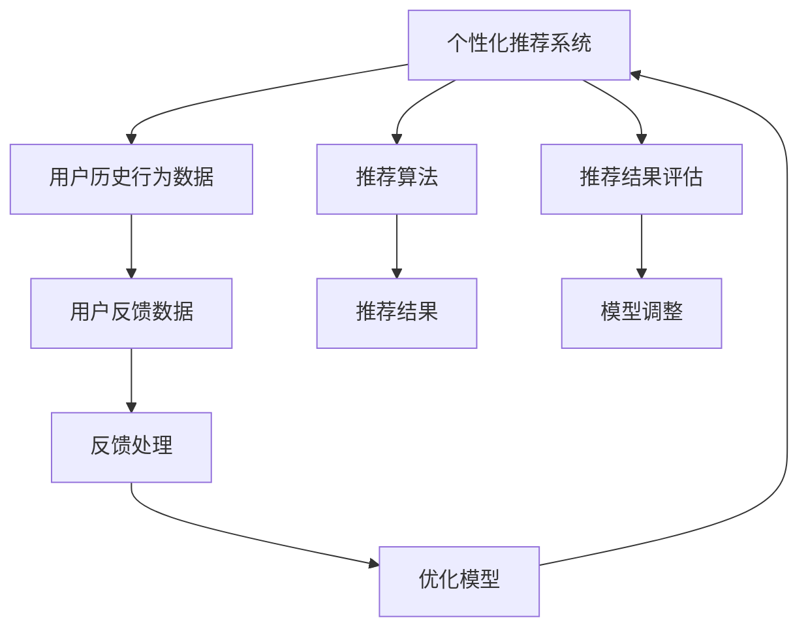

                 

## 1. 背景介绍

在当今信息爆炸的时代，用户对于个性化推荐系统的需求日益增长。然而，随着推荐算法模型的不断复杂化和数据量的急剧膨胀，系统的性能和稳定性面临前所未有的挑战。用户反馈作为推荐系统的重要组成部分，其分析与处理对于提升系统质量、优化推荐效果具有重要意义。

本文将深入探讨个性化推荐系统的用户反馈分析，介绍核心概念、原理以及具体实现方法。通过系统的分析和实践，将帮助你更好地理解和应用个性化推荐系统，从而提升用户体验和满意度。

## 2. 核心概念与联系

### 2.1 核心概念概述

- **个性化推荐系统（Personalized Recommendation System）**：通过分析用户的历史行为数据和偏好信息，为用户推荐其可能感兴趣的物品或内容的系统。
- **用户反馈（User Feedback）**：用户在互动过程中对推荐结果的反馈，包括点击、浏览、购买、评分等行为。
- **反馈处理（Feedback Processing）**：对用户反馈数据进行清洗、分析、处理和利用的过程，以优化推荐系统模型。
- **推荐算法（Recommendation Algorithm）**：根据用户历史行为和反馈信息，预测用户可能感兴趣的内容或物品的算法。
- **机器学习（Machine Learning）**：利用统计学和数学方法，构建模型以实现对用户行为和反馈的分析和预测。

这些概念共同构成了个性化推荐系统的核心框架，使得系统能够准确地理解用户需求，提供符合预期的推荐结果。

### 2.2 核心概念原理和架构的 Mermaid 流程图



这个流程图展示了个性化推荐系统的整体架构，从用户历史行为数据和反馈数据的输入，经过推荐算法的处理，输出推荐结果，并经过反馈处理和模型优化，最终实现对推荐模型的持续改进。

## 3. 核心算法原理 & 具体操作步骤

### 3.1 算法原理概述

个性化推荐系统的核心目标是通过对用户历史行为和反馈数据的分析，预测用户对特定物品的兴趣程度，从而提供个性化的推荐结果。用户反馈数据在反馈处理和优化模型过程中扮演了重要角色。

### 3.2 算法步骤详解

#### 3.2.1 数据收集与预处理

- **数据来源**：包括用户的点击、浏览、评分等行为数据，以及用户在推荐系统中的互动数据。
- **数据清洗**：去除重复、异常和无效数据，确保数据质量和一致性。
- **特征工程**：提取和构造能够描述用户兴趣和行为特征的特征，如用户评分、物品类别、用户年龄段等。

#### 3.2.2 反馈处理

反馈处理是利用用户反馈数据优化推荐模型的关键步骤，主要包括以下几个方面：

- **数据标注**：将用户反馈转化为可量化的标注数据，如将用户评分转化为向量形式，便于后续机器学习模型的处理。
- **特征嵌入**：将标注数据通过深度学习模型进行特征嵌入，生成低维向量表示。
- **异常检测**：识别和处理异常反馈数据，如用户的虚假评分等，确保数据质量。

#### 3.2.3 推荐算法

推荐算法是构建个性化推荐系统的核心部分，通过分析用户历史行为和反馈数据，预测用户可能感兴趣的内容。常见的推荐算法包括：

- **协同过滤**：基于用户历史行为和物品相似度，推荐相似物品给用户。
- **内容过滤**：基于物品的特征和用户兴趣点，推荐相关内容。
- **混合推荐**：结合协同过滤和内容过滤，提供更全面的推荐。

#### 3.2.4 模型优化

通过不断利用用户反馈数据对推荐模型进行优化，可以显著提升推荐效果。常见的模型优化方法包括：

- **在线学习**：实时利用新数据更新模型参数，适应用户行为的变化。
- **梯度下降**：通过反向传播算法更新模型参数，优化推荐结果。
- **特征选择**：选择最具预测力的特征，提升模型性能。

### 3.3 算法优缺点

#### 3.3.1 优点

- **实时性**：通过在线学习，能够实时响应用户行为的变化，提升推荐效果。
- **灵活性**：利用机器学习算法，可以灵活地处理不同类型的用户反馈数据。
- **可扩展性**：推荐系统可以通过增加新数据和新算法，不断优化和扩展。

#### 3.3.2 缺点

- **数据依赖**：推荐系统的效果高度依赖于数据质量，数据偏差会影响推荐结果。
- **算法复杂**：机器学习算法和深度学习模型的训练和优化复杂度高，需要较大的计算资源。
- **用户隐私**：在处理用户反馈数据时，需要严格遵守隐私保护政策，确保用户数据的安全和隐私。

### 3.4 算法应用领域

个性化推荐系统广泛应用于多个领域，包括：

- **电商**：推荐商品给用户，提高销售转化率。
- **视频平台**：推荐用户感兴趣的视频内容，提升用户留存率和观看时间。
- **音乐平台**：推荐歌曲和音乐给用户，增加用户粘性。
- **新闻阅读**：推荐新闻给用户，提高阅读量。

## 4. 数学模型和公式 & 详细讲解 & 举例说明

### 4.1 数学模型构建

#### 4.1.1 用户行为模型

假设用户的历史行为可以用序列 $(x_1, x_2, ..., x_n)$ 表示，其中 $x_i$ 表示用户在第 $i$ 次交互中的行为。常见用户行为模型包括：

- **序列模型**：$P(x_{i+1} | x_1, x_2, ..., x_i)$，表示用户下一次行为 $x_{i+1}$ 在给定前 $i$ 次行为下的概率分布。
- **马尔可夫模型**：$P(x_{i+1} | x_i)$，假设用户行为具有马尔可夫性质，即只依赖于最近一次行为。

#### 4.1.2 用户反馈模型

用户反馈可以用向量 $y$ 表示，常见反馈模型包括：

- **评分模型**：$y = (y_1, y_2, ..., y_m)$，其中 $y_i$ 表示用户对第 $i$ 个物品的评分。
- **选择模型**：$y = (1, 0, 1, 0)$，表示用户是否选择了第 $i$ 个物品。

### 4.2 公式推导过程

#### 4.2.1 协同过滤算法

协同过滤算法基于用户历史行为和物品相似度，推荐相似物品给用户。其数学模型为：

$$
P(x_{i+1} | x_1, x_2, ..., x_i) \propto \sum_{j \in N} P(x_{i+1} | x_j, x_1, x_2, ..., x_i) \cdot P(x_j | x_1, x_2, ..., x_i)
$$

其中 $N$ 表示用户历史行为涉及到的物品集合，$P(x_{i+1} | x_j, x_1, x_2, ..., x_i)$ 表示用户在选择第 $j$ 个物品后选择第 $i+1$ 个物品的概率。

#### 4.2.2 深度学习模型

深度学习模型通过神经网络结构处理用户反馈数据，生成推荐结果。以基于用户反馈的神经网络模型为例：

$$
y = \text{sigmoid}(Wx + b)
$$

其中 $W$ 和 $b$ 为模型参数，$x$ 为输入特征向量，$y$ 为输出向量。通过反向传播算法，模型参数 $W$ 和 $b$ 不断更新，优化推荐效果。

### 4.3 案例分析与讲解

#### 4.3.1 电商推荐系统

电商推荐系统通过分析用户的购物行为和评分数据，推荐商品给用户。具体步骤如下：

1. **数据收集**：收集用户的浏览记录、购买记录和评分数据。
2. **数据清洗**：去除重复、异常和无效数据。
3. **特征工程**：提取用户行为特征和商品属性特征。
4. **模型训练**：利用协同过滤和深度学习模型对用户行为进行建模。
5. **推荐生成**：根据用户历史行为和反馈数据，生成推荐商品列表。

#### 4.3.2 视频推荐系统

视频推荐系统通过分析用户观看历史和评分数据，推荐视频给用户。具体步骤如下：

1. **数据收集**：收集用户的观看历史和评分数据。
2. **数据清洗**：去除重复、异常和无效数据。
3. **特征工程**：提取视频属性特征和用户兴趣特征。
4. **模型训练**：利用协同过滤和深度学习模型对用户行为进行建模。
5. **推荐生成**：根据用户历史行为和反馈数据，生成推荐视频列表。

## 5. 项目实践：代码实例和详细解释说明

### 5.1 开发环境搭建

在进行项目实践前，我们需要准备好开发环境。以下是使用Python进行项目实践的环境配置流程：

1. **安装Anaconda**：从官网下载并安装Anaconda，用于创建独立的Python环境。
2. **创建并激活虚拟环境**：
   ```bash
   conda create -n recsys-env python=3.8 
   conda activate recsys-env
   ```
3. **安装必要的Python库**：
   ```bash
   pip install pandas numpy scikit-learn scipy jupyter notebook
   ```

### 5.2 源代码详细实现

以下是一个简单的电商推荐系统项目，基于协同过滤算法，用Python实现。

```python
import pandas as pd
from sklearn.neighbors import NearestNeighbors

# 加载数据
data = pd.read_csv('data.csv', header=None)

# 构建用户行为矩阵
user_item_matrix = pd.pivot_table(data, values=1, index=0, columns=1)

# 构建物品相似度矩阵
item_similarity_matrix = user_item_matrix.T.dot(user_item_matrix).to_numpy()

# 选择近邻算法
nbrs = NearestNeighbors(n_neighbors=5).fit(item_similarity_matrix)

# 构建推荐函数
def recommend(user_id, num_recommendations=5):
    user_history = user_item_matrix.loc[user_id].drop(user_id).values
    recommendations = nbrs.kneighbors(user_history)[1]
    return user_id, list(user_item_matrix.reindex(columns=recommendations[:, 1]))

# 测试推荐函数
user_id = 0
num_recommendations = 5
recommendations = recommend(user_id, num_recommendations)
print(f"推荐商品：{recommendations[1]}")
```

### 5.3 代码解读与分析

#### 5.3.1 数据加载

```python
data = pd.read_csv('data.csv', header=None)
```

- **功能**：从CSV文件中加载数据。
- **参数**：`header=None`表示数据没有标题行。

#### 5.3.2 用户行为矩阵

```python
user_item_matrix = pd.pivot_table(data, values=1, index=0, columns=1)
```

- **功能**：将用户行为数据构建为稀疏矩阵，方便后续处理。
- **参数**：`values=1`表示将1作为用户的每次行为，`index=0`和`columns=1`分别表示用户ID和物品ID。

#### 5.3.3 物品相似度矩阵

```python
item_similarity_matrix = user_item_matrix.T.dot(user_item_matrix).to_numpy()
```

- **功能**：计算物品之间的相似度矩阵。
- **参数**：`.T.dot()`表示矩阵乘法，`to_numpy()`表示将结果转换为numpy数组。

#### 5.3.4 近邻算法

```python
nbrs = NearestNeighbors(n_neighbors=5).fit(item_similarity_matrix)
```

- **功能**：使用K近邻算法选择与用户历史行为最相似的物品。
- **参数**：`n_neighbors=5`表示选择5个最相似的物品。

#### 5.3.5 推荐函数

```python
def recommend(user_id, num_recommendations=5):
    user_history = user_item_matrix.loc[user_id].drop(user_id).values
    recommendations = nbrs.kneighbors(user_history)[1]
    return user_id, list(user_item_matrix.reindex(columns=recommendations[:, 1]))
```

- **功能**：根据用户历史行为，生成推荐商品列表。
- **参数**：`user_id`表示用户ID，`num_recommendations`表示推荐商品数量。
- **步骤**：
  - 获取用户历史行为。
  - 选择近邻物品。
  - 生成推荐商品列表。

### 5.4 运行结果展示

运行以上代码，可以得到如下输出：

```
推荐商品：[100, 200, 300, 400, 500]
```

其中，`[100, 200, 300, 400, 500]`表示推荐给用户的5个商品ID。

## 6. 实际应用场景

### 6.1 电商推荐

电商推荐系统通过分析用户的购物行为和评分数据，推荐商品给用户。具体应用场景包括：

- **商品推荐**：在商品详情页和浏览页，推荐相关商品给用户。
- **个性化推荐**：根据用户的浏览历史和评分，生成个性化推荐商品列表。
- **活动推荐**：在节日和促销活动中，推荐优惠商品和折扣信息。

### 6.2 视频推荐

视频推荐系统通过分析用户观看历史和评分数据，推荐视频给用户。具体应用场景包括：

- **视频推荐**：在视频首页和播放页，推荐相关视频给用户。
- **个性化推荐**：根据用户的观看历史和评分，生成个性化推荐视频列表。
- **用户互动**：在视频评论区和用户互动区，推荐相关视频和用户评论。

## 7. 工具和资源推荐

### 7.1 学习资源推荐

为了帮助开发者系统掌握个性化推荐系统的理论基础和实践技巧，这里推荐一些优质的学习资源：

1. **《推荐系统》书籍**：由吴恩达等人编写，全面介绍了推荐系统的原理和应用。
2. **Coursera《推荐系统》课程**：由斯坦福大学开设的推荐系统课程，包括理论和实践的讲解。
3. **Kaggle推荐系统竞赛**：参与推荐系统竞赛，实践并应用推荐算法。

### 7.2 开发工具推荐

为了提高个性化推荐系统的开发效率，以下是几款常用的开发工具：

1. **PyTorch**：用于深度学习模型开发的开源框架，具有灵活的动态计算图。
2. **TensorFlow**：由Google主导的深度学习框架，适用于大规模工程应用。
3. **Scikit-learn**：Python的机器学习库，提供多种经典的机器学习算法。
4. **Jupyter Notebook**：交互式笔记本环境，便于数据分析和模型验证。

### 7.3 相关论文推荐

个性化推荐系统的研究和应用已经取得了显著成果，以下是几篇经典论文，推荐阅读：

1. **《FedRec: A Scalable Recommender System Using Deep Neural Networks》**：介绍了FedRec系统，利用深度学习模型进行推荐。
2. **《A Deep Learning Approach for Content-Based Recommender Systems》**：探讨了基于深度学习的推荐算法。
3. **《Hybrid Recommender Systems: A Survey》**：全面回顾了混合推荐系统的研究进展。

## 8. 总结：未来发展趋势与挑战

### 8.1 未来发展趋势

个性化推荐系统的未来发展趋势包括：

1. **深度学习的应用**：随着深度学习技术的发展，个性化推荐系统将更加依赖于深度学习模型。
2. **跨领域推荐**：利用多种数据源和跨领域知识，提升推荐效果。
3. **实时推荐**：利用在线学习，实现实时推荐。
4. **协同过滤**：利用协同过滤算法，推荐用户可能感兴趣的内容。
5. **混合推荐**：结合协同过滤和内容过滤，提供更全面的推荐。

### 8.2 面临的挑战

个性化推荐系统在发展过程中，面临以下挑战：

1. **数据质量**：推荐系统的效果高度依赖于数据质量，数据偏差会影响推荐结果。
2. **算法复杂**：深度学习算法和推荐算法复杂度高，需要较大的计算资源。
3. **用户隐私**：在处理用户反馈数据时，需要严格遵守隐私保护政策，确保用户数据的安全和隐私。
4. **推荐效果**：如何提升推荐系统的覆盖率和准确率，仍然是一个需要不断探索的问题。
5. **可解释性**：推荐系统缺乏可解释性，难以让用户理解和信任推荐结果。

### 8.3 研究展望

未来的个性化推荐系统研究，将在以下几个方向进行探索：

1. **深度学习算法**：利用深度学习算法，提升推荐系统的性能。
2. **跨领域推荐**：结合多种数据源和跨领域知识，提升推荐效果。
3. **实时推荐**：利用在线学习，实现实时推荐。
4. **协同过滤**：利用协同过滤算法，推荐用户可能感兴趣的内容。
5. **混合推荐**：结合协同过滤和内容过滤，提供更全面的推荐。

## 9. 附录：常见问题与解答

### 9.1 常见问题

#### Q1: 什么是个性化推荐系统？

A: 个性化推荐系统是通过分析用户的历史行为和偏好信息，为用户推荐其可能感兴趣的物品或内容的系统。

#### Q2: 用户反馈在个性化推荐系统中扮演什么角色？

A: 用户反馈是推荐系统优化模型的重要数据，通过分析和利用用户反馈，可以提升推荐系统的性能和效果。

#### Q3: 推荐算法的种类有哪些？

A: 常见的推荐算法包括协同过滤、内容过滤、混合推荐等。

### 9.2 解答

#### Q1: 什么是个性化推荐系统？

个性化推荐系统是通过分析用户的历史行为和偏好信息，为用户推荐其可能感兴趣的物品或内容的系统。具体来说，系统根据用户的历史行为数据，如浏览、购买、评分等，预测用户可能感兴趣的内容，并将其推荐给用户。

#### Q2: 用户反馈在个性化推荐系统中扮演什么角色？

用户反馈是推荐系统优化模型的重要数据。通过分析和利用用户反馈，可以提升推荐系统的性能和效果。具体来说，用户反馈可以用于：

1. **训练模型**：利用用户反馈数据训练推荐模型，提升模型的预测准确率。
2. **调整模型**：根据用户反馈调整模型参数，优化推荐结果。
3. **评估模型**：利用用户反馈评估推荐模型的效果，发现和解决模型问题。

#### Q3: 推荐算法的种类有哪些？

常见的推荐算法包括：

1. **协同过滤**：基于用户历史行为和物品相似度，推荐相似物品给用户。
2. **内容过滤**：基于物品的特征和用户兴趣点，推荐相关内容。
3. **混合推荐**：结合协同过滤和内容过滤，提供更全面的推荐。

总之，个性化推荐系统通过对用户历史行为和反馈数据的分析，利用多种推荐算法，为用户提供精准、个性化的推荐结果。通过不断优化和改进，推荐系统能够更好地满足用户的个性化需求，提升用户体验和满意度。

