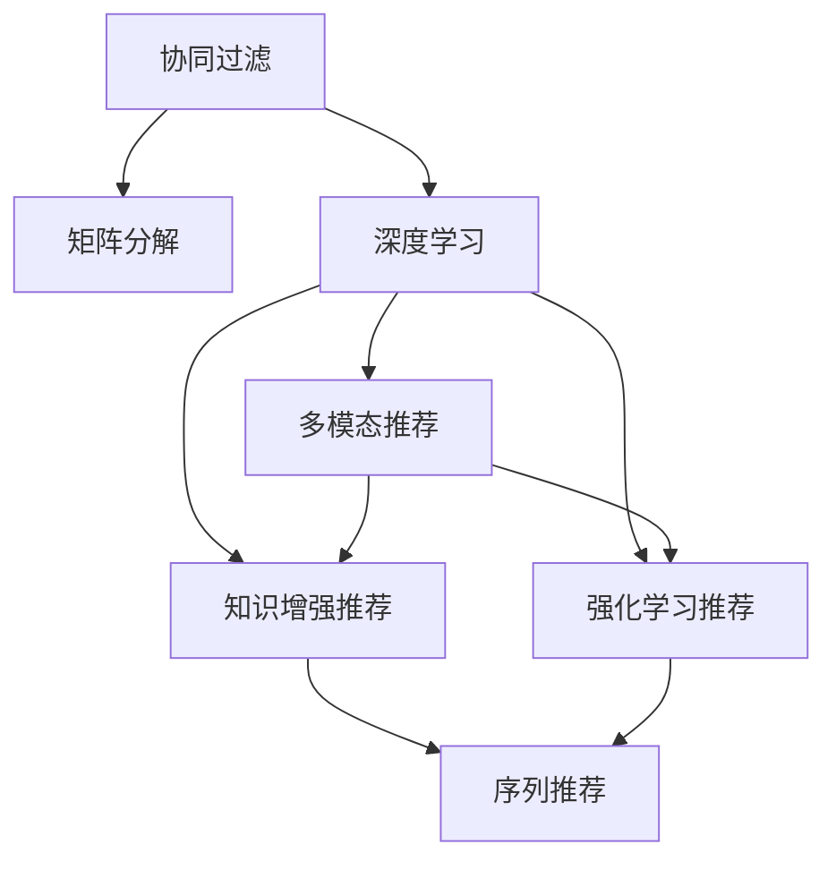

                 

# 个性化推荐系统的未来发展方向

## 1. 背景介绍

个性化推荐系统是提升用户体验和增加商业价值的关键技术，广泛应用于电子商务、视频流媒体、新闻阅读等多个领域。传统基于协同过滤的推荐方法往往依赖用户行为历史数据，难以覆盖大量未交互的用户和低频访问商品，用户多样性需求得不到满足，推荐效果单一。而基于深度学习的推荐系统通过用户行为、商品属性、文本描述等多维数据，能够更全面地刻画用户喜好，实现更精准的推荐效果。

本文聚焦于基于深度学习的推荐系统，尤其是大模型推荐系统。讨论其未来发展方向，从模型算法、数据处理、系统部署等多个维度展开，探讨如何进一步优化个性化推荐系统，为用户提供更满意的服务。

## 2. 核心概念与联系

### 2.1 核心概念概述

为更好地理解个性化推荐系统的未来发展方向，本节将介绍几个密切相关的核心概念：

- 协同过滤（Collaborative Filtering, CF）：根据用户和物品的共现关系，推断用户对物品的喜好，从而推荐相似的物品。
- 基于矩阵分解的推荐算法（Matrix Factorization）：将用户与物品的评分矩阵进行分解，得到用户和物品的潜在特征，进行预测。
- 深度学习推荐算法：使用深度神经网络模型，通过用户行为、物品属性、文本等特征，学习用户与物品的关联关系，提升推荐精度。
- 多模态推荐（Multi-modal Recommendation）：结合图像、文本、语音等多模态数据，更全面地刻画用户需求和物品特征。
- 知识增强推荐（Knowledge-Enhanced Recommendation）：结合知识图谱、逻辑规则等先验知识，优化推荐模型，提高推荐效果。
- 强化学习推荐（Reinforcement Learning, RL）：通过用户点击、停留等行为反馈，不断调整推荐策略，优化推荐效果。
- 序列推荐（Sequential Recommendation）：基于用户行为序列，预测用户的下一步选择，实现动态推荐。

这些核心概念之间的逻辑关系可以通过以下Mermaid流程图来展示：



这个流程图展示了个性化推荐系统的核心概念及其之间的关系：

1. 协同过滤和基于矩阵分解的推荐算法是深度学习推荐的基础，提供了较为基础的推荐方式。
2. 深度学习推荐算法可以更好地刻画用户和物品的复杂关联关系。
3. 多模态推荐和知识增强推荐扩充了推荐系统的数据来源，增加了推荐的多样性。
4. 强化学习和序列推荐进一步提升推荐策略的灵活性和个性化程度。

这些概念共同构成了个性化推荐系统的学习和应用框架，使其能够更好地为用户服务。通过理解这些核心概念，我们可以更好地把握推荐系统的优化方向。

## 3. 核心算法原理 & 具体操作步骤
### 3.1 算法原理概述

基于深度学习的推荐系统通过学习用户和物品的复杂关联关系，提升推荐精度和多样性。其核心思想是：将用户和物品映射到一个低维空间，学习其特征表示，然后通过相似度度量，预测用户对物品的评分。常见的深度学习推荐算法包括：

- 用户隐向量模型（User Embedding Model）：将用户映射到一个低维空间，学习其隐向量表示。物品和用户隐向量点乘得到评分预测值。
- 物品隐向量模型（Item Embedding Model）：将物品映射到一个低维空间，学习其隐向量表示。用户和物品隐向量点乘得到评分预测值。
- 协同神经网络模型（Cooperative Neural Network Model）：使用神经网络模型学习用户和物品的特征表示，同时学习它们之间的关联关系。
- 序列神经网络模型（Sequential Neural Network Model）：利用用户行为序列，学习用户的兴趣变化趋势，进行动态推荐。
- 交叉网络模型（Cross-Network Model）：结合用户隐向量模型和物品隐向量模型，学习用户和物品的复杂关联关系。

### 3.2 算法步骤详解

基于深度学习的推荐系统通常包括以下几个关键步骤：

**Step 1: 数据预处理**
- 收集用户行为数据（点击、浏览、购买等）和物品特征数据（属性、文本描述等）。
- 数据清洗，去除噪声、缺失值等，保证数据质量。
- 数据归一化，将不同维度的特征统一到同一个尺度。

**Step 2: 特征工程**
- 设计合适的特征表示方法，如稠密向量、低秩矩阵分解、词向量嵌入等。
- 结合领域知识，设计特征选择和构造方法。
- 结合多模态数据，融合图像、文本、音频等特征。

**Step 3: 模型训练**
- 选择合适的深度学习模型，如用户隐向量模型、协同神经网络模型等。
- 定义合适的损失函数，如均方误差损失、交叉熵损失等。
- 选择合适的优化器，如Adam、SGD等，设置学习率、批大小等超参数。

**Step 4: 模型评估与优化**
- 在测试集上评估模型预测精度和多样性指标，如准确率、召回率、F1-score等。
- 调整模型超参数，优化模型结构，提升推荐效果。
- 引入对抗样本，提高模型鲁棒性。

**Step 5: 部署与迭代**
- 将训练好的模型部署到生产环境中，提供推荐服务。
- 持续收集用户反馈，定期重训模型。
- 结合在线学习技术，实时更新模型参数，保持推荐策略的最新性。

以上是基于深度学习的推荐系统的一般流程。在实际应用中，还需要针对具体任务的特点，对推荐过程的各个环节进行优化设计，如改进特征提取方法，引入更多的正则化技术，搜索最优的超参数组合等，以进一步提升推荐效果。

### 3.3 算法优缺点

基于深度学习的推荐系统具有以下优点：
1. 适应性强。能够处理多维特征数据，适应用户多样性需求。
2. 预测精度高。通过复杂的神经网络模型，学习用户和物品的复杂关联关系，提升了推荐精度。
3. 鲁棒性强。深度模型能够适应复杂的数据分布，具有一定的泛化能力。

同时，该方法也存在一定的局限性：
1. 计算成本高。深度模型需要大量的计算资源进行训练，导致训练成本较高。
2. 模型复杂度高。深度模型的复杂性可能带来更难以解释的决策过程。
3. 数据依赖性高。模型的性能很大程度上依赖于数据质量，需要大量的标注和行为数据。
4. 冷启动问题。对于新用户和未交互的商品，模型难以获得有效的特征表示。

尽管存在这些局限性，但就目前而言，基于深度学习的推荐方法仍是最主流范式。未来相关研究的重点在于如何进一步降低计算成本，提高模型泛化能力，同时兼顾可解释性和鲁棒性等因素。

### 3.4 算法应用领域

基于深度学习的推荐系统在多个领域得到了广泛的应用，例如：

- 电子商务：商品推荐、广告推荐、内容推荐等。
- 视频流媒体：视频推荐、内容推荐、用户画像分析等。
- 新闻阅读：文章推荐、用户画像分析、广告推荐等。
- 社交网络：好友推荐、内容推荐、广告推荐等。
- 音乐和游戏：音乐推荐、游戏推荐、用户画像分析等。

除了上述这些经典应用外，深度学习推荐系统还被创新性地应用到更多场景中，如跨平台推荐、个性化搜索、智能音箱等，为各行各业带来了新的突破。随着深度学习模型的不断发展，相信推荐系统将在更广阔的应用领域大放异彩。

## 4. 数学模型和公式 & 详细讲解 & 举例说明

### 4.1 数学模型构建

本节将使用数学语言对基于深度学习的推荐系统进行更加严格的刻画。

记用户集合为 $U$，物品集合为 $I$，用户对物品的评分矩阵为 $R \in \mathbb{R}^{m \times n}$，其中 $m$ 为物品数量，$n$ 为用户数量。设用户 $u$ 对物品 $i$ 的评分向量为 $r_u \in \mathbb{R}^n$，物品 $i$ 的特征向量为 $x_i \in \mathbb{R}^d$，用户 $u$ 的特征向量为 $h_u \in \mathbb{R}^d$。则用户 $u$ 对物品 $i$ 的评分预测为：

$$
\hat{r}_{ui} = \langle h_u, x_i \rangle
$$

其中 $\langle \cdot, \cdot \rangle$ 为向量内积。

### 4.2 公式推导过程

以下我们以协同神经网络模型为例，推导深度学习推荐模型的预测公式。

设用户和物品的隐向量表示分别为 $H \in \mathbb{R}^{m \times d}$ 和 $U \in \mathbb{R}^{n \times d}$。用户对物品的评分预测为：

$$
\hat{r}_{ui} = \sigma(\langle U, H^T \rangle + b)
$$

其中 $\sigma(\cdot)$ 为激活函数，如ReLU、sigmoid等。$b$ 为偏差项。

在训练过程中，通过最小化均方误差损失函数：

$$
\mathcal{L}(R, \hat{R}) = \frac{1}{2m} \sum_{i=1}^m \sum_{j=1}^n (r_{ij} - \hat{r}_{ij})^2
$$

其中 $R \in \mathbb{R}^{m \times n}$ 为评分矩阵，$\hat{R} \in \mathbb{R}^{m \times n}$ 为预测评分矩阵。

通过反向传播算法，可以更新模型参数 $U$ 和 $H$，使得预测评分矩阵 $\hat{R}$ 尽可能逼近真实评分矩阵 $R$。

### 4.3 案例分析与讲解

以在线购物平台为例，分析基于协同神经网络模型的推荐过程。

**用户特征提取**
- 收集用户的浏览历史、搜索历史、点击记录等行为数据。
- 提取商品的属性信息、文本描述等特征，构建物品特征向量 $x_i$。

**物品特征表示**
- 将用户行为数据和物品特征数据合并，构建用户和物品的评分矩阵 $R$。
- 对评分矩阵进行归一化处理，确保每个用户和物品的评分都在 $[0,1]$ 范围内。

**模型训练**
- 设计协同神经网络模型，使用ReLU作为激活函数。
- 将用户和物品的特征向量 $h_u$ 和 $x_i$ 输入模型，预测用户对物品的评分 $\hat{r}_{ui}$。
- 定义均方误差损失函数，计算模型预测值与真实值之间的误差，反向传播更新模型参数。

**模型评估**
- 在测试集上评估模型的准确率和召回率，确保模型能够有效预测用户评分。
- 分析模型的预测结果，识别出潜在的低评分物品和用户，进行有针对性的推荐。

通过以上步骤，基于深度学习的推荐系统能够实时地为用户提供个性化的商品推荐，提升用户满意度和平台转化率。

## 5. 项目实践：代码实例和详细解释说明
### 5.1 开发环境搭建

在进行推荐系统开发前，我们需要准备好开发环境。以下是使用Python进行PyTorch开发的环境配置流程：

1. 安装Anaconda：从官网下载并安装Anaconda，用于创建独立的Python环境。

2. 创建并激活虚拟环境：
```bash
conda create -n pytorch-env python=3.8 
conda activate pytorch-env
```

3. 安装PyTorch：根据CUDA版本，从官网获取对应的安装命令。例如：
```bash
conda install pytorch torchvision torchaudio cudatoolkit=11.1 -c pytorch -c conda-forge
```

4. 安装TensorFlow：
```bash
conda install tensorflow -c pytorch -c conda-forge
```

5. 安装各类工具包：
```bash
pip install numpy pandas scikit-learn matplotlib tqdm jupyter notebook ipython
```

完成上述步骤后，即可在`pytorch-env`环境中开始推荐系统开发。

### 5.2 源代码详细实现

下面我们以协同神经网络模型为例，给出使用Transformers库对用户和物品隐向量进行学习的PyTorch代码实现。

首先，定义推荐系统的用户特征工程函数：

```python
from transformers import BertTokenizer, BertModel

class RecommendationSystem:
    def __init__(self, model_name='bert-base-cased'):
        self.tokenizer = BertTokenizer.from_pretrained(model_name)
        self.model = BertModel.from_pretrained(model_name)
        self.model.eval()
        
    def get_user_features(self, user_info):
        encoded = self.tokenizer(user_info, return_tensors='pt', padding='max_length', truncation=True)
        return encoded['input_ids']
```

然后，定义推荐模型的训练和预测函数：

```python
from torch.nn import functional as F

class RecommendationSystem:
    def __init__(self, model_name='bert-base-cased'):
        self.tokenizer = BertTokenizer.from_pretrained(model_name)
        self.model = BertModel.from_pretrained(model_name)
        self.model.eval()
        
    def get_user_features(self, user_info):
        encoded = self.tokenizer(user_info, return_tensors='pt', padding='max_length', truncation=True)
        return encoded['input_ids']
    
    def train(self, train_data, batch_size, learning_rate):
        device = torch.device('cuda' if torch.cuda.is_available() else 'cpu')
        self.model.to(device)
        
        optimizer = torch.optim.Adam(self.model.parameters(), lr=learning_rate)
        criterion = torch.nn.MSELoss()
        
        for epoch in range(10):
            self.model.train()
            for user_info, ratings in train_data:
                input_ids = self.get_user_features(user_info)
                output = self.model(input_ids)
                loss = criterion(output, torch.tensor(ratings))
                optimizer.zero_grad()
                loss.backward()
                optimizer.step()
                print(f'Epoch {epoch+1}, Loss: {loss.item():.4f}')
        
        self.model.eval()
        for user_info, ratings in test_data:
            input_ids = self.get_user_features(user_info)
            output = self.model(input_ids)
            predictions = output.argmax(dim=1).item()
            print(f'Prediction: {predictions}, Ground Truth: {ratings}')
```

最后，启动训练流程并在测试集上评估：

```python
train_data = [(user_info, ratings) for user_info in train_users for ratings in train_ratings]
test_data = [(user_info, ratings) for user_info in test_users for ratings in test_ratings]

model = RecommendationSystem()
model.train(train_data, batch_size=32, learning_rate=1e-4)
```

以上就是使用PyTorch对协同神经网络模型进行推荐系统开发的完整代码实现。可以看到，得益于Transformers库的强大封装，我们可以用相对简洁的代码完成推荐系统的构建。

### 5.3 代码解读与分析

让我们再详细解读一下关键代码的实现细节：

**RecommendationSystem类**：
- `__init__`方法：初始化用户分词器和Bert模型，设置模型为评估模式。
- `get_user_features`方法：将用户信息分词编码，并返回编码后的输入序列。
- `train`方法：设置模型为训练模式，定义优化器、损失函数，循环迭代训练模型。

**训练流程**：
- 在训练过程中，模型首先将用户信息进行编码，得到输入序列。
- 将输入序列输入Bert模型，得到隐向量表示。
- 将隐向量表示作为预测评分，计算损失函数并反向传播更新模型参数。
- 在测试过程中，同样将用户信息编码并输入模型，得到预测评分，计算与真实评分的误差。

**推荐模型评估**：
- 通过在测试集上评估模型预测的准确率、召回率等指标，确保模型能够有效预测用户评分。
- 分析模型的预测结果，识别出潜在的低评分物品和用户，进行有针对性的推荐。

可以看到，PyTorch配合Transformers库使得推荐系统的开发变得简洁高效。开发者可以将更多精力放在特征工程、模型优化等高层逻辑上，而不必过多关注底层的实现细节。

当然，工业级的系统实现还需考虑更多因素，如模型的保存和部署、超参数的自动搜索、更灵活的任务适配层等。但核心的推荐范式基本与此类似。

## 6. 实际应用场景
### 6.1 智能广告推荐

基于深度学习的推荐系统在智能广告推荐中发挥了重要作用。传统广告推荐依赖用户行为数据进行粗放广告投放，难以兼顾个性化和效果。而深度学习推荐系统能够根据用户历史行为数据，精细化广告投放策略，提升广告点击率。

在技术实现上，可以收集用户浏览、点击、购买等行为数据，并对其进行特征工程处理，构建用户和物品的评分矩阵。然后利用协同神经网络模型对用户和物品进行隐向量表示，通过相似度度量进行推荐。最终，将推荐广告展示给用户，评估广告效果并进行优化。

### 6.2 视频内容推荐

视频内容推荐是推荐系统的重要应用之一。传统推荐依赖用户评分和行为数据进行推荐，难以应对海量视频数据和高维特征的挑战。而深度学习推荐系统能够处理高维多模态数据，学习用户和视频之间的复杂关联关系，提升推荐精度。

在技术实现上，可以收集用户浏览、点击、观看视频时长等行为数据，并对其进行特征工程处理。然后利用深度神经网络模型对用户和视频进行特征表示，通过相似度度量进行推荐。最终，将推荐视频展示给用户，评估视频观看效果并进行优化。

### 6.3 商品推荐

商品推荐是推荐系统的主要应用之一。传统推荐依赖用户行为数据进行推荐，难以覆盖新商品和低频商品。而深度学习推荐系统能够处理多维特征数据，学习用户对物品的复杂关联关系，提升推荐效果。

在技术实现上，可以收集用户浏览、点击、购买等行为数据，并对其进行特征工程处理。然后利用深度神经网络模型对用户和物品进行特征表示，通过相似度度量进行推荐。最终，将推荐商品展示给用户，评估商品点击率并进行优化。

### 6.4 未来应用展望

随着深度学习模型的不断发展，基于推荐系统的应用场景将进一步拓展。

在智慧医疗领域，推荐系统可以用于推荐医生、科室、药品等医疗资源，提升患者的就医体验和治疗效果。在智能制造领域，推荐系统可以用于推荐生产流程、设备维护、零部件等，优化生产效率和资源利用率。在智能交通领域，推荐系统可以用于推荐出行路线、车辆维护、交通事故等，提升交通运行效率和安全性。

此外，推荐系统还被创新性地应用到更多场景中，如个性化搜索、智能音箱、虚拟助手等，为各行各业带来了新的突破。随着深度学习模型的进一步优化，相信推荐系统将在更广阔的应用领域大放异彩，为人工智能技术的发展带来新的动力。

## 7. 工具和资源推荐
### 7.1 学习资源推荐

为了帮助开发者系统掌握深度学习推荐系统的理论基础和实践技巧，这里推荐一些优质的学习资源：

1. 《Deep Learning for Recommendation Systems》书籍：详细介绍了深度学习推荐系统的工作原理、模型设计和优化方法，是学习推荐系统的经典教材。
2. CS229《Machine Learning》课程：斯坦福大学开设的机器学习课程，涵盖了推荐系统、深度学习等前沿技术。
3. ArXiv论文：谷歌、微软等顶级学术机构发布的大量推荐系统相关论文，涵盖各种深度学习推荐模型和优化方法。
4. 《Python深度学习》书籍：介绍了使用Python进行深度学习推荐系统开发的实践技巧。
5. Kaggle竞赛：参与Kaggle上的推荐系统竞赛，积累实践经验和优化技巧。

通过对这些资源的学习实践，相信你一定能够快速掌握深度学习推荐系统的精髓，并用于解决实际的推荐问题。
###  7.2 开发工具推荐

高效的开发离不开优秀的工具支持。以下是几款用于深度学习推荐系统开发的常用工具：

1. PyTorch：基于Python的开源深度学习框架，灵活动态的计算图，适合快速迭代研究。大部分深度学习推荐模型都有PyTorch版本的实现。
2. TensorFlow：由Google主导开发的开源深度学习框架，生产部署方便，适合大规模工程应用。同样有丰富的深度学习推荐模型资源。
3. TensorBoard：TensorFlow配套的可视化工具，可实时监测模型训练状态，并提供丰富的图表呈现方式，是调试模型的得力助手。
4. Weights & Biases：模型训练的实验跟踪工具，可以记录和可视化模型训练过程中的各项指标，方便对比和调优。
5. HuggingFace Transformers：提供大量预训练推荐模型和优化算法，支持多种深度学习推荐模型的快速构建。

合理利用这些工具，可以显著提升深度学习推荐系统的开发效率，加快创新迭代的步伐。

### 7.3 相关论文推荐

深度学习推荐系统的研究源于学界的持续研究。以下是几篇奠基性的相关论文，推荐阅读：

1. Matrix Factorization Techniques for Recommender Systems（矩阵分解方法）：提出了矩阵分解方法，通过将用户和物品的评分矩阵进行分解，学习用户和物品的隐向量表示。
2. Collaborative Filtering for Implicit Feedback Datasets（协同过滤方法）：提出了基于隐式反馈数据的协同过滤方法，能够处理用户未明确反馈的评分数据。
3. Deep Neural Networks for Recommendation Systems：展示了深度学习模型在推荐系统中的应用，并取得了显著的效果提升。
4. Neural Collaborative Filtering：提出了神经协同过滤模型，通过神经网络模型学习用户和物品的隐向量表示，提高了推荐精度。
5. Attention Based Recommender Systems：展示了注意力机制在推荐系统中的应用，通过引入注意力机制，提升了推荐效果。

这些论文代表了大模型推荐系统的发展脉络。通过学习这些前沿成果，可以帮助研究者把握推荐系统的优化方向，激发更多的创新灵感。

## 8. 总结：未来发展趋势与挑战

### 8.1 总结

本文对基于深度学习的推荐系统进行了全面系统的介绍。首先阐述了推荐系统的研究背景和意义，明确了深度学习推荐系统在提升用户满意度和商业价值方面的独特价值。其次，从原理到实践，详细讲解了推荐算法的数学原理和关键步骤，给出了推荐系统开发的完整代码实例。同时，本文还广泛探讨了推荐系统在智能广告、视频内容、商品推荐等多个领域的应用前景，展示了推荐范式的巨大潜力。此外，本文精选了推荐系统的各类学习资源，力求为读者提供全方位的技术指引。

通过本文的系统梳理，可以看到，基于深度学习的推荐系统正在成为推荐技术的主流范式，极大地拓展了推荐系统的应用边界，催生了更多的落地场景。受益于深度学习模型的不断发展，推荐系统将在更多领域得到应用，为各行各业带来变革性影响。未来，伴随深度学习模型的持续演进，相信推荐系统将在更广阔的应用领域大放异彩，深刻影响人类的生产生活方式。

### 8.2 未来发展趋势

展望未来，深度学习推荐系统将呈现以下几个发展趋势：

1. 模型规模持续增大。随着算力成本的下降和数据规模的扩张，深度学习推荐模型的参数量还将持续增长。超大规模模型蕴含的丰富推荐知识，有望支撑更加复杂多变的推荐场景。
2. 深度学习与人工智能的融合。深度学习推荐系统将与其他AI技术进行更深度的融合，如知识增强、因果推理、强化学习等，实现更全面、更个性化的推荐。
3. 多模态推荐系统的崛起。推荐系统将结合图像、视频、语音等多模态数据，更全面地刻画用户需求和物品特征，提升推荐效果。
4. 模型可解释性的增强。推荐系统将引入更多可解释性技术，如因果推断、注意力机制等，提升推荐决策的透明度和可信度。
5. 个性化推荐系统的普及。深度学习推荐系统将进一步普及到各个垂直行业，为各行各业带来智能化服务。
6. 推荐系统的实时性提升。通过在线学习技术，推荐系统将能够实时更新模型参数，保持推荐策略的最新性，提升推荐效果。

以上趋势凸显了深度学习推荐系统的广阔前景。这些方向的探索发展，必将进一步提升推荐系统的性能和应用范围，为用户带来更加满意的服务体验。

### 8.3 面临的挑战

尽管深度学习推荐系统已经取得了瞩目成就，但在迈向更加智能化、普适化应用的过程中，它仍面临着诸多挑战：

1. 数据隐私和安全。推荐系统需要大量的用户行为数据进行训练，如何保障用户数据隐私和安全，是一个重要问题。
2. 计算资源消耗。深度学习推荐模型需要大量的计算资源进行训练和推理，导致成本较高。如何降低计算成本，提升模型训练和推理的效率，是一个重要问题。
3. 模型可解释性。深度学习推荐模型的复杂性较高，难以解释其决策过程。如何提高模型的可解释性，确保推荐决策的公正性和透明性，是一个重要问题。
4. 多样性需求。推荐系统需要考虑用户多样性需求，如何兼顾个性化和多样性，是一个重要问题。
5. 推荐策略的灵活性。推荐系统需要根据用户行为实时调整推荐策略，如何实现动态推荐，是一个重要问题。

尽管存在这些挑战，但伴随深度学习推荐系统的不断优化，相信推荐系统将在更多领域得到应用，为各行各业带来智能化服务。

### 8.4 研究展望

面对深度学习推荐系统所面临的种种挑战，未来的研究需要在以下几个方面寻求新的突破：

1. 引入多模态数据。结合图像、视频、语音等多模态数据，提升推荐系统的多样性，丰富用户推荐体验。
2. 探索更好的特征表示方法。通过引入新的特征提取和表示方法，提升模型的泛化能力和推荐精度。
3. 融合人工智能技术。结合知识增强、因果推理、强化学习等AI技术，优化推荐策略，提高推荐效果。
4. 增强推荐系统的可解释性。引入因果推断、注意力机制等技术，提升推荐决策的透明度和可信度。
5. 优化推荐系统的实时性。通过在线学习技术，实时更新模型参数，提升推荐策略的灵活性和实时性。
6. 保障数据隐私和安全。设计更隐私保护的数据处理和存储方法，确保用户数据隐私和安全。

这些研究方向的探索，必将引领深度学习推荐系统迈向更高的台阶，为推荐系统的发展带来新的突破。面向未来，深度学习推荐系统还需要与其他AI技术进行更深入的融合，共同推动推荐系统的进步。只有勇于创新、敢于突破，才能不断拓展推荐系统的边界，让推荐系统更好地服务于人类社会。

## 9. 附录：常见问题与解答

**Q1：推荐系统如何优化推荐效果？**

A: 推荐系统的优化主要从以下几个方面入手：

1. 特征工程：通过选择、构造和组合特征，提升模型的泛化能力，减少特征维度。
2. 模型优化：选择和调整合适的深度学习模型，优化模型参数，提高模型的预测精度和鲁棒性。
3. 数据增强：通过数据增强技术，扩充训练数据集，提升模型的泛化能力。
4. 对抗样本：引入对抗样本，提高模型的鲁棒性，避免过拟合。
5. 模型融合：通过模型融合技术，整合多个推荐模型的预测结果，提升推荐效果。
6. 在线学习：通过在线学习技术，实时更新模型参数，提升推荐策略的最新性。

这些优化方法往往需要根据具体任务和数据特点进行灵活组合，以实现最优的推荐效果。

**Q2：推荐系统在冷启动问题上如何应对？**

A: 冷启动问题是指新用户和未交互的商品对推荐系统来说是没有历史数据的，无法进行有效的推荐。以下是几种常见的应对策略：

1. 引入先验知识：通过引入领域知识、规则、知识图谱等，对新用户和未交互的商品进行初始化推荐。
2. 借助用户画像：利用用户的基本信息、兴趣标签等进行推荐，减少冷启动的影响。
3. 推荐榜推荐：在推荐榜中展示热门商品，提升用户兴趣的发现率。
4. 交叉推荐：通过用户对热门商品的行为，推荐相关的冷门商品，发现用户潜在兴趣。

以上策略可以结合使用，通过综合考虑用户画像、推荐榜和交叉推荐，有效解决冷启动问题。

**Q3：推荐系统如何降低计算成本？**

A: 推荐系统的计算成本主要来自于模型的训练和推理。以下是几种常见的降低计算成本的策略：

1. 特征降维：通过特征降维技术，减少特征维度和模型复杂度，降低计算成本。
2. 模型压缩：通过模型压缩技术，如剪枝、量化、蒸馏等，减少模型大小和计算量。
3. 分布式训练：通过分布式训练技术，利用多个计算设备并行训练模型，提升训练效率。
4. 模型并行：通过模型并行技术，将模型分布到多个计算设备中，提升推理效率。
5. 模型微调：通过微调技术，利用预训练模型，减少训练时间和计算成本。

这些策略可以结合使用，通过综合考虑特征降维、模型压缩和分布式训练，有效降低推荐系统的计算成本。

**Q4：推荐系统如何保障用户数据隐私？**

A: 推荐系统在训练和推理过程中，需要大量的用户行为数据。以下是几种常见的保障用户数据隐私的策略：

1. 数据匿名化：通过对用户数据进行匿名化处理，防止用户隐私泄露。
2. 差分隐私：通过差分隐私技术，在模型训练过程中加入噪音，保护用户隐私。
3. 联邦学习：通过联邦学习技术，在用户设备上本地训练模型，保护用户数据隐私。
4. 数据分片：通过数据分片技术，将数据分成多个部分，防止单一设备上存储大量数据。

这些策略可以结合使用，通过综合考虑数据匿名化、差分隐私和联邦学习，有效保障用户数据隐私。

**Q5：推荐系统如何提升推荐决策的透明度？**

A: 推荐系统的决策过程难以解释，用户难以理解推荐结果的原因。以下是几种常见的提升推荐决策透明度的策略：

1. 可解释性模型：引入可解释性模型，如决策树、规则模型等，提升推荐决策的透明度。
2. 可视化技术：通过可视化技术，展示推荐模型的决策路径和特征重要性，帮助用户理解推荐结果。
3. 用户反馈机制：通过用户反馈机制，获取用户对推荐结果的评价，及时调整推荐策略。
4. 用户画像：通过用户画像，了解用户兴趣和偏好，提高推荐决策的合理性。

这些策略可以结合使用，通过综合考虑可解释性模型、可视化技术和用户反馈机制，提升推荐决策的透明度。

---

作者：禅与计算机程序设计艺术 / Zen and the Art of Computer Programming

