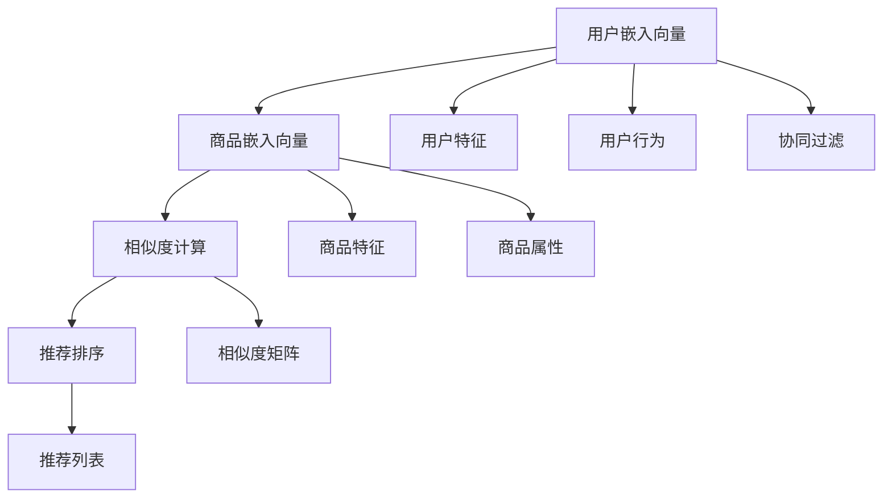

                 

## 1. 背景介绍

### 1.1 问题由来

在互联网飞速发展的今天，电子商务已成为人们日常生活的重要组成部分。电商平台的用户数量和交易额不断增长，个性化推荐系统也成为各大平台的核心竞争力之一。个性化推荐系统旨在通过分析用户的购买行为、浏览记录、社交网络等数据，向用户推荐其可能感兴趣的商品，从而提升用户满意度和平台转化率。

然而，个性化推荐系统的核心问题在于如何高效、准确地为用户推荐商品。传统的推荐系统多基于协同过滤、内容推荐等方法，存在数据稀疏性、冷启动问题等限制，难以满足用户的个性化需求。与此同时，电商平台的商品种类繁多，供给能力有限，传统推荐系统的这些问题将进一步加剧推荐精准度的下降。

为了应对这些挑战，基于深度学习的推荐系统应运而生。通过训练深度神经网络模型，从海量数据中学习商品和用户的潜在关联，深度学习推荐系统能够更准确地预测用户对商品的兴趣，实现个性化推荐。本文将重点探讨深度学习推荐系统的核心算法原理，详细讲解其在电商平台供给能力提升中的应用。

### 1.2 问题核心关键点

深度学习推荐系统的关键点在于如何高效、准确地学习用户和商品之间的关联。推荐系统通常包括如下几个核心步骤：

1. **用户编码与特征提取**：将用户输入的特征（如浏览历史、购买记录、兴趣标签等）映射为高维特征向量，形成用户嵌入向量。
2. **商品编码与特征提取**：将商品的特征（如商品描述、分类、用户评价等）映射为高维特征向量，形成商品嵌入向量。
3. **相似度计算**：通过计算用户嵌入向量与商品嵌入向量之间的相似度，确定用户对各个商品的兴趣程度。
4. **排序与推荐**：根据相似度计算结果，对商品进行排序，并输出推荐列表。

本文将重点介绍在推荐系统中使用深度学习模型进行用户和商品编码的过程，以及在电商平台的商品供给能力提升中的应用。

## 2. 核心概念与联系

### 2.1 核心概念概述

为更好地理解深度学习推荐系统的核心算法，本节将介绍几个关键概念：

- **用户嵌入向量**：表示用户特征的向量表示，通过学习用户的历史行为数据，捕捉用户兴趣和偏好的向量空间表示。
- **商品嵌入向量**：表示商品特征的向量表示，通过学习商品的属性、评价等信息，捕捉商品的相似性和推荐价值。
- **相似度计算**：衡量用户嵌入向量与商品嵌入向量之间的相似性，通常使用点积、余弦相似度等方法。
- **深度神经网络**：通过多层神经网络的组合，可以捕捉复杂非线性关系，提高推荐系统的准确性。
- **协同过滤**：通过分析用户和商品之间的协同关系，预测用户对商品的兴趣，适用于冷启动问题。

这些概念之间的逻辑关系可以通过以下Mermaid流程图来展示：



这个流程图展示了几大核心概念及其之间的关系：

1. 用户嵌入向量是通过分析用户的历史行为数据，学习得到的用户特征表示。
2. 商品嵌入向量是通过学习商品的属性和评价等信息，捕捉商品的相似性和推荐价值。
3. 相似度计算是通过计算用户嵌入向量与商品嵌入向量之间的相似性，确定推荐排序。
4. 协同过滤是通过分析用户和商品之间的协同关系，预测用户对商品的兴趣。
5. 推荐排序是通过相似度计算结果对商品进行排序，生成推荐列表。

这些概念共同构成了深度学习推荐系统的核心框架，使得推荐系统能够高效、准确地为用户推荐商品。

## 3. 核心算法原理 & 具体操作步骤

### 3.1 算法原理概述

基于深度学习的推荐系统，主要通过训练深度神经网络模型来学习用户和商品之间的关联，从而进行推荐。其核心思想在于将用户和商品的特征映射为高维向量表示，并通过相似度计算确定推荐排序。

具体而言，深度学习推荐系统分为用户编码和商品编码两个部分。用户编码模块通过学习用户历史行为数据，将用户特征映射为高维向量表示。商品编码模块通过学习商品属性、评价等信息，将商品特征映射为高维向量表示。然后，通过计算用户嵌入向量与商品嵌入向量之间的相似度，预测用户对各个商品的兴趣，并根据相似度进行排序，输出推荐列表。

### 3.2 算法步骤详解

深度学习推荐系统的构建步骤如下：

**Step 1: 准备数据集**

- 收集用户历史行为数据，如浏览记录、购买记录、评分数据等。
- 收集商品的属性数据，如商品描述、分类、价格等。
- 将用户和商品特征数据进行合并，形成训练集。

**Step 2: 设计模型结构**

- 设计用户编码模块。通常使用多层神经网络（如CNN、RNN、Transformer等）将用户特征映射为高维向量表示。
- 设计商品编码模块。同样使用多层神经网络将商品特征映射为高维向量表示。
- 设计相似度计算模块。常用的相似度计算方法包括点积、余弦相似度等。
- 设计推荐排序模块。通常使用softmax函数将相似度计算结果转化为概率分布，进行推荐排序。

**Step 3: 训练模型**

- 使用训练集数据，训练用户编码和商品编码模块，更新网络参数。
- 使用训练集数据，计算相似度矩阵，训练推荐排序模块。
- 通过迭代优化，不断调整模型参数，直至收敛。

**Step 4: 测试与部署**

- 在测试集上评估推荐系统的准确性和召回率等指标。
- 使用训练好的模型进行商品推荐，部署到实际电商平台中。

**Step 5: 持续优化**

- 实时收集用户反馈数据，更新训练集，不断优化推荐模型。
- 根据用户行为变化，动态调整模型参数，提高推荐效果。

### 3.3 算法优缺点

基于深度学习的推荐系统具有以下优点：

1. **高效准确**：通过多层神经网络模型，可以捕捉复杂的非线性关系，提高推荐系统的准确性。
2. **鲁棒性强**：对于新用户的冷启动问题，可以通过协同过滤等方法，快速获取推荐结果。
3. **可解释性强**：深度学习模型通过可解释性强的特征工程，能够更好地理解用户和商品的特征，提升推荐系统透明度。

同时，该方法也存在一些局限性：

1. **数据依赖性强**：推荐系统的性能依赖于用户和商品数据的丰富度，数据稀疏性将影响推荐效果。
2. **计算复杂度高**：深度学习模型的训练和推理计算量较大，需要高性能计算资源。
3. **模型复杂度高**：深度学习模型的结构复杂，难以解释和调试。
4. **资源消耗大**：推荐系统需要大量的计算和存储空间，对系统资源占用较大。

尽管存在这些局限性，但深度学习推荐系统在推荐精度和用户体验方面表现优异，已逐渐成为电商推荐系统的核心技术。

### 3.4 算法应用领域

基于深度学习的推荐系统在电商平台的商品供给能力提升上具有广泛的应用前景。具体而言：

1. **用户行为分析**：通过对用户浏览、购买、评价等行为数据的分析，捕捉用户兴趣和偏好。
2. **商品特征提取**：通过分析商品的属性、评价、描述等信息，提取商品的特征表示。
3. **相似度计算**：通过计算用户嵌入向量与商品嵌入向量之间的相似度，预测用户对各个商品的兴趣。
4. **推荐排序**：根据相似度计算结果，对商品进行排序，生成推荐列表。
5. **动态调整**：根据用户行为变化，实时调整推荐模型参数，提高推荐效果。

通过这些步骤，基于深度学习的推荐系统能够有效提升电商平台的商品供给能力，帮助用户快速找到感兴趣的商品，同时优化商家商品的展示和推荐。

## 4. 数学模型和公式 & 详细讲解 & 举例说明

### 4.1 数学模型构建

本节将使用数学语言对深度学习推荐系统进行更加严格的刻画。

记用户嵌入向量为 $u_i$，商品嵌入向量为 $v_j$，其中 $i$ 表示用户，$j$ 表示商品。假设用户 $i$ 对商品 $j$ 的评分数据为 $y_{ij}$。推荐系统可以通过训练一个神经网络模型，将用户和商品特征映射为高维向量表示，并通过相似度计算进行推荐排序。

设推荐系统的神经网络模型为 $f(\cdot)$，用户嵌入向量为 $u_i=f(u_{i_{-1}})$，商品嵌入向量为 $v_j=f(v_{j_{-1}})$，则推荐排序模型为 $f_r(\cdot)=softmax(s(v_j,u_i))$，其中 $s(v_j,u_i)$ 为相似度计算函数。推荐排序模型将计算出的相似度转化为概率分布，用于生成推荐列表。

### 4.2 公式推导过程

以点积相似度为例，其公式为：

$$
s(v_j,u_i)=v_j^T\cdot u_i=\sum_k v_{jk}u_{ik}
$$

其中 $v_{jk}$ 和 $u_{ik}$ 分别表示商品和用户向量中的第 $k$ 维特征。

推荐排序模型的输出概率为：

$$
P(r_j|u_i)=\frac{exp(s(v_j,u_i))}{\sum_k exp(s(v_k,u_i))}
$$

其中 $P(r_j|u_i)$ 表示用户 $i$ 对商品 $j$ 的推荐概率。

### 4.3 案例分析与讲解

以电商平台的个性化推荐系统为例，假设用户 $i$ 对商品 $j$ 的评分数据为 $y_{ij}$，我们可以构建如下深度学习推荐模型：

1. **用户编码模块**：使用多层神经网络将用户历史行为数据映射为高维向量表示。

$$
u_i=f(u_{i_{-1}})
$$

2. **商品编码模块**：使用多层神经网络将商品属性和评价等数据映射为高维向量表示。

$$
v_j=f(v_{j_{-1}})
$$

3. **相似度计算**：通过点积相似度计算用户嵌入向量与商品嵌入向量之间的相似度。

$$
s(v_j,u_i)=v_j^T\cdot u_i
$$

4. **推荐排序**：使用softmax函数将相似度计算结果转化为概率分布，进行推荐排序。

$$
P(r_j|u_i)=\frac{exp(s(v_j,u_i))}{\sum_k exp(s(v_k,u_i))}
$$

使用上述模型，电商平台可以高效地为用户推荐商品，同时动态调整模型参数，提升推荐效果。

## 5. 项目实践：代码实例和详细解释说明

### 5.1 开发环境搭建

在进行深度学习推荐系统的开发前，我们需要准备好开发环境。以下是使用Python进行TensorFlow开发的环境配置流程：

1. 安装Anaconda：从官网下载并安装Anaconda，用于创建独立的Python环境。

2. 创建并激活虚拟环境：
```bash
conda create -n tf-env python=3.8 
conda activate tf-env
```

3. 安装TensorFlow：根据CUDA版本，从官网获取对应的安装命令。例如：
```bash
pip install tensorflow
```

4. 安装各类工具包：
```bash
pip install numpy pandas scikit-learn matplotlib tqdm jupyter notebook ipython
```

完成上述步骤后，即可在`tf-env`环境中开始推荐系统的开发实践。

### 5.2 源代码详细实现

下面我们将以电商平台的个性化推荐系统为例，给出使用TensorFlow进行深度学习推荐系统开发的PyTorch代码实现。

首先，定义推荐系统的数据处理函数：

```python
import tensorflow as tf
from tensorflow.keras.layers import Input, Dense, Embedding, Dot, Activation, Model

# 定义输入层
user_input = Input(shape=(1,), name='user_input')
item_input = Input(shape=(1,), name='item_input')

# 定义用户嵌入向量
user_embedding = Embedding(input_dim=num_users, output_dim=embedding_dim, mask_zero=True)(user_input)

# 定义商品嵌入向量
item_embedding = Embedding(input_dim=num_items, output_dim=embedding_dim, mask_zero=True)(item_input)

# 定义点积相似度计算
dot_product = Dot(axes=(2, 2))([user_embedding, item_embedding])

# 定义softmax函数
softmax_output = Activation('softmax')(dot_product)

# 构建模型
model = Model(inputs=[user_input, item_input], outputs=[softmax_output])
```

然后，定义训练和评估函数：

```python
from tensorflow.keras.optimizers import Adam

# 设置优化器
optimizer = Adam(learning_rate=0.001)

# 设置训练集和测试集
train_dataset = tf.data.Dataset.from_tensor_slices((train_user, train_item, train_score))
test_dataset = tf.data.Dataset.from_tensor_slices((test_user, test_item, test_score))

# 定义损失函数
loss_function = tf.keras.losses.BinaryCrossentropy()

# 定义训练和评估函数
@tf.function
def train(model, dataset, batch_size):
    for batch in dataset.shuffle(buffer_size=10000):
        user_input, item_input, score = batch
        with tf.GradientTape() as tape:
            pred_score = model(user_input, item_input)
            loss = loss_function(y_true=score, y_pred=pred_score)
        gradients = tape.gradient(loss, model.trainable_variables)
        optimizer.apply_gradients(zip(gradients, model.trainable_variables))

# 定义评估函数
@tf.function
def evaluate(model, dataset, batch_size):
    for batch in dataset:
        user_input, item_input, score = batch
        pred_score = model(user_input, item_input)
        accuracy = tf.reduce_mean(tf.cast(tf.round(pred_score) == score, tf.float32))
    return accuracy
```

最后，启动训练流程并在测试集上评估：

```python
epochs = 10
batch_size = 128

for epoch in range(epochs):
    train(model, train_dataset, batch_size)
    acc = evaluate(model, test_dataset, batch_size)
    print(f'Epoch {epoch+1}, Test Accuracy: {acc}')
```

以上就是使用TensorFlow进行电商推荐系统的完整代码实现。可以看到，TensorFlow提供了强大的Tensorflow Data API，使得数据处理和模型训练更加高效便捷。

### 5.3 代码解读与分析

让我们再详细解读一下关键代码的实现细节：

**推荐系统数据处理函数**：
- 使用`Input`定义输入层，分别表示用户和商品的ID。
- 通过`Embedding`层将用户和商品ID映射为高维向量表示，其中`mask_zero=True`表示未出现ID的特征被填充为0。
- 使用`Dot`层计算用户和商品的相似度。
- 通过`Activation`层将相似度转化为概率分布，使用`softmax`函数进行推荐排序。

**训练函数**：
- 使用`tf.function`装饰函数，将计算图编译为可高效执行的Tensorflow图。
- 使用`GradientTape`记录梯度，`apply_gradients`应用梯度更新模型参数。
- 使用`tf.GradientTape`记录计算图的梯度。
- 使用`Adam`优化器进行模型参数的更新。

**评估函数**：
- 使用`tf.function`装饰函数，将计算图编译为可高效执行的Tensorflow图。
- 使用`tf.reduce_mean`计算平均准确率。

**训练流程**：
- 循环迭代训练集，每次取批量数据进行训练。
- 在每个epoch结束后，在测试集上评估模型性能，输出测试准确率。

可以看到，TensorFlow的Keras API使得深度学习推荐系统的实现更加简洁高效，适合快速迭代开发。

## 6. 实际应用场景

### 6.1 用户行为分析

电商平台的个性化推荐系统通常会收集用户的浏览记录、购买记录、评分数据等行为数据。通过对这些数据进行分析，可以捕捉用户的兴趣和偏好，从而进行个性化推荐。

具体而言，可以构建一个用户行为分析模块，通过学习用户的历史行为数据，捕捉用户兴趣和偏好。通过将用户行为数据映射为高维向量表示，可以捕捉用户的历史行为特征，从而更好地理解用户的兴趣和偏好。

### 6.2 商品特征提取

商品特征的提取对于推荐系统至关重要。电商平台上的商品种类繁多，商品特征数据复杂多样，因此需要高效提取商品的特征表示。

常见的商品特征包括商品名称、描述、分类、价格、评价等。通过构建商品特征提取模块，可以高效地将商品特征数据映射为高维向量表示，捕捉商品的属性和特征，从而更好地理解商品之间的关系。

### 6.3 相似度计算

相似度计算是推荐系统的核心部分，通过计算用户嵌入向量与商品嵌入向量之间的相似度，可以预测用户对各个商品的兴趣。

常用的相似度计算方法包括点积相似度、余弦相似度等。在电商推荐系统中，点积相似度是常用的相似度计算方法，它计算用户和商品的向量内积，捕捉用户对商品的兴趣程度。

### 6.4 推荐排序

推荐排序模块通过计算相似度，将商品按照用户的兴趣程度进行排序，并生成推荐列表。

通过使用softmax函数将相似度转化为概率分布，推荐系统可以输出推荐列表，帮助用户快速找到感兴趣的商品。推荐排序模块需要考虑用户的个性化需求，通过动态调整模型参数，提高推荐效果。

### 6.5 动态调整

随着用户行为的变化，推荐系统需要动态调整模型参数，提高推荐效果。通过实时收集用户反馈数据，更新训练集，不断优化推荐模型。

动态调整可以提升推荐系统的适应性，帮助用户快速找到感兴趣的商品，同时优化商家商品的展示和推荐。

## 7. 工具和资源推荐

### 7.1 学习资源推荐

为了帮助开发者系统掌握深度学习推荐系统的理论基础和实践技巧，这里推荐一些优质的学习资源：

1. 《深度学习推荐系统》书籍：详细介绍了推荐系统的理论基础、算法实现和应用案例，适合初学者入门。
2. 《TensorFlow官方文档》：提供了TensorFlow的详细使用指南和示例代码，适合开发者进行学习和实践。
3. Coursera《机器学习》课程：由斯坦福大学教授Andrew Ng主讲，涵盖机器学习和深度学习的基础知识，适合广大学习者。
4. DeepLearning.AI深度学习课程：由亚马逊工程师设计，涵盖深度学习理论和实践，适合深度学习开发者。
5. Kaggle推荐系统竞赛：通过实际数据集和竞赛任务，训练推荐系统模型，提升推荐系统技能。

通过对这些资源的学习实践，相信你一定能够快速掌握深度学习推荐系统的精髓，并用于解决实际的推荐问题。

### 7.2 开发工具推荐

高效的开发离不开优秀的工具支持。以下是几款用于深度学习推荐系统开发的常用工具：

1. TensorFlow：由Google主导开发的深度学习框架，生产部署方便，适合大规模工程应用。
2. PyTorch：基于Python的开源深度学习框架，灵活动态的计算图，适合快速迭代研究。
3. Scikit-learn：基于Python的机器学习库，提供了丰富的算法和工具，适合数据处理和特征工程。
4. Pandas：基于Python的数据处理库，适合数据清洗和预处理。
5. Numpy：基于Python的数值计算库，适合高效的数值计算。
6. Jupyter Notebook：基于Web的交互式编程环境，适合快速迭代开发和数据可视化。

合理利用这些工具，可以显著提升深度学习推荐系统的开发效率，加快创新迭代的步伐。

### 7.3 相关论文推荐

深度学习推荐系统的发展源于学界的持续研究。以下是几篇奠基性的相关论文，推荐阅读：

1. Recommender Systems Handbook（《推荐系统手册》）：介绍推荐系统的基本原理、算法实现和应用案例，是推荐系统领域的经典著作。
2. Neural Collaborative Filtering（神经协同过滤）：介绍使用神经网络模型进行协同过滤的深度学习推荐系统方法。
3. Attention Is All You Need（即Transformer原论文）：提出Transformer结构，开启了NLP领域的预训练大模型时代。
4. The Matrix Factorization Approach to Recommender System（矩阵分解方法）：介绍使用矩阵分解方法进行推荐系统的基本原理和算法实现。
5. DeepNeck：介绍使用深度神经网络进行推荐系统的实现方法。

这些论文代表了大深度学习推荐系统的发展脉络。通过学习这些前沿成果，可以帮助研究者把握学科前进方向，激发更多的创新灵感。

## 8. 总结：未来发展趋势与挑战

### 8.1 总结

本文对深度学习推荐系统进行了全面系统的介绍。首先阐述了深度学习推荐系统的背景和意义，明确了推荐系统在电商平台的商品供给能力提升方面的重要作用。其次，从原理到实践，详细讲解了深度学习推荐系统的数学模型和关键算法步骤，给出了推荐系统开发的完整代码实例。同时，本文还广泛探讨了深度学习推荐系统在电商平台的实际应用场景，展示了推荐系统范式的广阔前景。

通过本文的系统梳理，可以看到，深度学习推荐系统在电商平台商品供给能力提升上已经取得了显著的成果，但仍面临诸多挑战。如何在保证推荐效果的同时，降低计算成本和提升模型可解释性，将是未来推荐系统研究的重要方向。

### 8.2 未来发展趋势

展望未来，深度学习推荐系统将呈现以下几个发展趋势：

1. **实时推荐系统**：通过实时数据流和动态模型训练，推荐系统能够实时调整推荐策略，提升推荐效果。
2. **多模态推荐系统**：结合图像、视频、语音等多模态数据，提升推荐系统的鲁棒性和泛化能力。
3. **个性化推荐范式**：通过学习用户行为和商品特征，进行个性化推荐，提升用户体验。
4. **深度强化学习**：通过强化学习算法优化推荐策略，实现推荐系统的动态调整和优化。
5. **联邦推荐系统**：通过分布式计算和联邦学习，实现跨平台的数据协同推荐，提升推荐系统性能。

以上趋势凸显了深度学习推荐系统的广阔前景。这些方向的探索发展，必将进一步提升推荐系统的性能和应用范围，为电商平台的商品供给能力提升提供更加强大的技术支撑。

### 8.3 面临的挑战

尽管深度学习推荐系统已经取得了显著的成果，但在迈向更加智能化、普适化应用的过程中，它仍面临诸多挑战：

1. **数据依赖性强**：推荐系统的性能依赖于用户和商品数据的丰富度，数据稀疏性将影响推荐效果。
2. **计算复杂度高**：深度学习模型的训练和推理计算量较大，需要高性能计算资源。
3. **模型复杂度高**：深度学习模型的结构复杂，难以解释和调试。
4. **资源消耗大**：推荐系统需要大量的计算和存储空间，对系统资源占用较大。

尽管存在这些局限性，但深度学习推荐系统在推荐精度和用户体验方面表现优异，已逐渐成为电商推荐系统的核心技术。

### 8.4 未来突破

面对深度学习推荐系统所面临的挑战，未来的研究需要在以下几个方面寻求新的突破：

1. **无监督推荐**：摆脱对大规模标注数据的依赖，利用无监督学习、自监督学习等方法，最大限度利用非结构化数据，实现更加灵活高效的推荐。
2. **深度强化学习**：通过强化学习算法优化推荐策略，实现推荐系统的动态调整和优化。
3. **多模态推荐**：结合图像、视频、语音等多模态数据，提升推荐系统的鲁棒性和泛化能力。
4. **知识图谱嵌入**：通过知识图谱嵌入技术，将结构化的知识图谱与推荐系统结合，提升推荐系统的准确性和可靠性。
5. **跨领域推荐**：通过跨领域推荐技术，实现不同领域数据之间的协同推荐，提升推荐系统的覆盖面和性能。

这些研究方向的探索，必将引领深度学习推荐系统技术迈向更高的台阶，为电商平台的商品供给能力提升提供更加强大的技术支撑。

## 9. 附录：常见问题与解答

**Q1：深度学习推荐系统是否适用于所有电商平台？**

A: 深度学习推荐系统在大多数电商平台上都能取得不错的效果，特别是对于商品种类繁多、用户行为复杂的大平台。但对于一些商品种类较少、用户行为简单的小平台，传统推荐系统如协同过滤等可能更加适用。

**Q2：推荐系统是否需要大规模的标注数据？**

A: 深度学习推荐系统通常需要大量的标注数据来训练模型。但通过无监督学习、自监督学习等方法，可以最大限度利用非结构化数据，实现更加灵活高效的推荐。

**Q3：推荐系统如何提升电商平台的商品供给能力？**

A: 通过深度学习推荐系统，电商平台能够高效地为用户推荐商品，同时动态调整模型参数，提升推荐效果。推荐系统能够帮助用户快速找到感兴趣的商品，从而提升平台的用户体验和转化率。

**Q4：推荐系统的计算复杂度是否影响实际应用？**

A: 深度学习推荐系统的计算复杂度较高，需要高性能计算资源。但对于大规模电商平台，通过分布式计算和模型压缩等技术，可以有效降低计算成本，提升推荐系统性能。

**Q5：推荐系统的可解释性问题如何解决？**

A: 推荐系统的可解释性问题是未来研究的重要方向。通过特征工程和模型可视化等方法，可以提升推荐系统的可解释性，帮助用户理解推荐结果背后的原因。

总之，深度学习推荐系统已经成为电商推荐系统的核心技术，其高效、准确、个性化的推荐能力，为电商平台的商品供给能力提升提供了重要保障。未来，随着技术的发展和应用的深入，推荐系统将不断优化提升，为电商平台的智能化发展注入新的动力。

