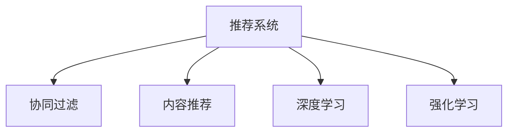

                 

# 个性化购物体验的技术实现方法

## 1. 背景介绍

随着电商行业的快速发展，个性化购物体验已成为商家争夺用户的重要手段。如何更好地理解用户需求、推荐个性化商品、提升用户满意度，成为电商平台亟需解决的关键问题。本文将深入探讨个性化购物体验的技术实现方法，包括推荐系统原理、算法优化、工程实践等关键内容，力求为电商平台提供全面、系统的技术指引。

## 2. 核心概念与联系

### 2.1 核心概念概述

为更好地理解个性化购物体验的实现方法，本节将介绍几个密切相关的核心概念：

- **推荐系统(Recommendation System)**：通过分析用户历史行为、商品属性等数据，自动为用户推荐商品的系统。推荐系统是构建个性化购物体验的基础，能够显著提升用户购买率和满意度。
- **协同过滤(Collaborative Filtering)**：基于用户历史行为或商品间的协同关系，预测用户对商品的兴趣或评价。协同过滤是推荐系统中应用最为广泛的算法之一，常用于电商平台的商品推荐。
- **内容推荐(Content-Based Filtering)**：通过分析商品的属性、分类、标签等，推荐与用户兴趣相关的商品。内容推荐能够较好地捕捉用户对商品特征的偏好，适用于商品属性明确的场景。
- **深度学习(Deep Learning)**：利用神经网络对大规模数据进行建模和预测，能够自动发现数据的深层次特征，适用于复杂的个性化推荐任务。
- **强化学习(Reinforcement Learning)**：通过用户对推荐结果的反馈，不断调整推荐策略，最大化长期收益。强化学习能够实现自适应的推荐系统，逐步提升用户满意度。

这些核心概念之间的逻辑关系可以通过以下Mermaid流程图来展示：



这个流程图展示了这个领域的核心概念及其之间的关系：

1. 推荐系统是构建个性化购物体验的基础。
2. 协同过滤、内容推荐、深度学习和强化学习是推荐系统的主要算法，各自有其适用范围和优势。
3. 协同过滤、内容推荐和深度学习更多关注数据的特征提取和模式识别，强化学习则侧重于基于用户反馈的优化调整。

## 3. 核心算法原理 & 具体操作步骤

### 3.1 算法原理概述

个性化购物体验的核心在于为用户推荐最符合其兴趣的商品。推荐系统通过收集用户的浏览、点击、购买等行为数据，结合商品属性、用户特征等，自动为用户推荐相关商品。常见的推荐算法包括基于内容的推荐、协同过滤、深度学习等，这些算法通过不同的方式建模用户和商品间的关联，从而实现个性化推荐。

### 3.2 算法步骤详解

个性化购物体验的推荐系统构建一般包括以下几个关键步骤：

**Step 1: 数据收集与预处理**

- **收集用户行为数据**：如浏览历史、点击记录、购买行为等，这些数据可以用于训练推荐模型，预测用户兴趣。
- **收集商品属性数据**：如商品名称、类别、价格、评分等，这些属性可以用于内容推荐或特征提取。
- **数据预处理**：对数据进行清洗、归一化、去重等处理，保证数据的质量和一致性。

**Step 2: 特征工程**

- **特征选择**：从用户行为、商品属性中提取最相关的特征，如用户评分、商品价格、类别等。
- **特征表示**：将特征转换为模型可处理的形式，如将文本特征转换为词向量、使用one-hot编码等。
- **特征融合**：将用户特征和商品特征进行组合，得到综合性的用户-商品表示，如用户-商品共现矩阵。

**Step 3: 模型训练**

- **选择合适的算法**：根据数据类型和业务需求，选择合适的推荐算法，如协同过滤、内容推荐、深度学习等。
- **模型训练**：在训练集上对推荐模型进行训练，优化模型参数，使其能够准确预测用户对商品的兴趣。
- **模型评估**：在验证集或测试集上评估模型性能，使用AUC、RMSE、准确率等指标衡量模型效果。

**Step 4: 推荐策略优化**

- **个性化推荐**：根据用户历史行为和偏好，动态生成个性化商品推荐列表。
- **多样化推荐**：在个性化推荐的基础上，引入多样性约束，防止过度集中推荐，提高推荐多样性。
- **实时推荐**：利用缓存和异步算法，在用户请求时快速返回推荐结果，提升用户体验。

**Step 5: 系统部署与迭代**

- **部署推荐系统**：将训练好的模型部署到生产环境中，接受用户请求并返回推荐结果。
- **持续迭代优化**：根据用户反馈和新数据，定期更新推荐模型，优化推荐策略，提升推荐效果。

### 3.3 算法优缺点

个性化购物体验推荐系统具有以下优点：

- **提升用户体验**：通过个性化推荐，能够满足用户需求，提升购买率和满意度。
- **优化库存管理**：推荐系统能够根据用户需求预测商品需求量，帮助商家优化库存。
- **减少推荐偏差**：通过多种算法组合，减少推荐偏差，提高推荐质量。

同时，该方法也存在一定的局限性：

- **数据依赖性高**：推荐系统依赖于用户行为数据，数据不足或数据质量差可能导致推荐效果不佳。
- **冷启动问题**：新用户或新商品缺乏历史数据，难以进行个性化推荐。
- **高昂的计算成本**：大规模推荐系统的计算成本较高，需要高性能的计算资源。
- **安全性问题**：用户隐私数据的使用需要严格的数据保护措施，防止数据泄露和滥用。

尽管存在这些局限性，但就目前而言，个性化推荐系统仍是提升电商平台用户体验的重要手段。未来相关研究的重点在于如何进一步降低数据依赖，提高模型的自适应性和鲁棒性，同时兼顾用户隐私和数据安全。

### 3.4 算法应用领域

个性化购物体验推荐系统已经在电商、影视、音乐等多个领域得到了广泛的应用，为各行业的数字化转型提供了新的思路和手段。具体而言，包括：

- **电商领域**：提升商品推荐效果，增加用户购买率，提高平台销售额。
- **影视领域**：为用户推荐感兴趣的影视作品，提升用户粘性和满意度。
- **音乐领域**：为用户推荐个性化音乐，增加用户听量和满意度。
- **旅游领域**：推荐个性化旅游目的地，提升用户旅游体验。

除了上述这些经典应用外，个性化推荐系统还被创新性地应用于更多场景中，如智能家居、智慧医疗等，为各行各业带来新的变革。

## 4. 数学模型和公式 & 详细讲解 & 举例说明

### 4.1 数学模型构建

在推荐系统中，常见的数学模型包括协同过滤、矩阵分解、深度学习等。这里以矩阵分解为例，介绍推荐系统的数学建模方法。

设用户集为 $U$，商品集为 $I$，用户对商品 $i$ 的评分记为 $R_{ui}$，用户与商品的评分矩阵记为 $\mathbf{R}$。矩阵分解的目标是将 $\mathbf{R}$ 分解为两个低维矩阵 $\mathbf{U}$ 和 $\mathbf{V}$ 的乘积，即：

$$
\mathbf{R} = \mathbf{U} \mathbf{V}
$$

其中，$\mathbf{U}$ 表示用户特征矩阵，每一行表示一个用户的特征向量；$\mathbf{V}$ 表示商品特征矩阵，每一列表示一个商品的特征向量。

### 4.2 公式推导过程

设 $\mathbf{R}$ 的矩阵分解为 $\mathbf{R} = \mathbf{U} \mathbf{V}$，则 $\mathbf{R}$ 中的每个元素可以表示为：

$$
R_{ui} = \sum_{k=1}^K U_{uk} V_{ki}
$$

其中，$K$ 为特征向量的维度。给定新的用户 $u$ 和商品 $i$，可以预测其评分 $R_{ui}$ 为：

$$
\hat{R}_{ui} = \mathbf{u}_k \mathbf{v}_k
$$

其中，$\mathbf{u}_k$ 和 $\mathbf{v}_k$ 分别为用户 $u$ 和商品 $i$ 的特征向量，$k$ 表示特征向量中的第 $k$ 个元素。

通过矩阵分解，推荐系统能够将用户行为数据映射到低维特征空间，从而实现对用户和商品特征的建模。

### 4.3 案例分析与讲解

以电商平台的商品推荐为例，介绍矩阵分解的实际应用。

设电商平台收集了 1000 名用户的浏览和购买数据，每名用户对应 100 个商品的评分。可以将评分矩阵 $\mathbf{R}$ 进行奇异值分解，得到低维特征矩阵 $\mathbf{U}$ 和 $\mathbf{V}$。假设有新用户 $u_{1001}$ 想要购买商品 $i=501$，可以将其特征向量 $\mathbf{u}$ 和商品特征向量 $\mathbf{v}$ 乘积作为预测评分 $\hat{R}_{1001,501}$。

在实际应用中，为了提高推荐效果，还可以引入更多特征，如商品类别、用户年龄等，将这些特征与矩阵分解结合起来，提升推荐模型的性能。

## 5. 项目实践：代码实例和详细解释说明

### 5.1 开发环境搭建

在进行推荐系统开发前，我们需要准备好开发环境。以下是使用Python进行TensorFlow开发的环境配置流程：

1. 安装Anaconda：从官网下载并安装Anaconda，用于创建独立的Python环境。

2. 创建并激活虚拟环境：
```bash
conda create -n tf-env python=3.8 
conda activate tf-env
```

3. 安装TensorFlow：根据CUDA版本，从官网获取对应的安装命令。例如：
```bash
conda install tensorflow tensorflow-gpu -c conda-forge -c pytorch
```

4. 安装TensorBoard：
```bash
pip install tensorboard
```

5. 安装Pandas、NumPy、Scikit-Learn等各类工具包：
```bash
pip install pandas numpy scikit-learn matplotlib tqdm jupyter notebook ipython
```

完成上述步骤后，即可在`tf-env`环境中开始推荐系统开发。

### 5.2 源代码详细实现

这里我们以电商平台的商品推荐为例，给出使用TensorFlow实现协同过滤推荐系统的完整代码实现。

首先，定义数据预处理函数：

```python
import numpy as np
import pandas as pd

def preprocess_data(df, item_cols, user_cols):
    # 数据清洗
    df = df.dropna().drop_duplicates()

    # 特征工程
    df[item_cols] = df[item_cols].apply(lambda x: x.split(','))
    df[item_cols] = df[item_cols].apply(lambda x: [int(i) for i in x])

    # 用户-商品共现矩阵
    user_ids = df[user_cols].values
    item_ids = df[item_cols].values
    user_item_matrix = np.zeros((len(user_ids), len(item_ids)))
    for u, i in zip(user_ids, item_ids):
        user_item_matrix[u-1, i-1] = df['rating'][df[user_cols].eq(u) & df[item_cols].eq(i)]

    # 特征表示
    user_features = df[user_cols].values
    item_features = df[item_cols].values
    user_features = np.array([np.mean(i) for i in user_features])
    item_features = np.array([np.mean(i) for i in item_features])

    return user_item_matrix, user_features, item_features
```

然后，定义模型训练函数：

```python
import tensorflow as tf
from tensorflow.keras.layers import Input, Dense, Embedding
from tensorflow.keras.models import Model

def train_model(user_item_matrix, user_features, item_features, num_users, num_items, embedding_dim, learning_rate):
    # 定义输入层
    user_input = Input(shape=(1,), name='user_input')
    item_input = Input(shape=(1,), name='item_input')

    # 用户和商品特征嵌入层
    user_embed = Embedding(input_dim=num_users, output_dim=embedding_dim, input_length=1)(user_input)
    item_embed = Embedding(input_dim=num_items, output_dim=embedding_dim, input_length=1)(item_input)

    # 计算预测评分
    user_embed = tf.keras.layers.GlobalAveragePooling1D()(user_embed)
    item_embed = tf.keras.layers.GlobalAveragePooling1D()(item_embed)
    pred = tf.keras.layers.Dot(axes=1, normalize=True)([user_embed, item_embed])

    # 定义损失函数和优化器
    model = Model(inputs=[user_input, item_input], outputs=pred)
    model.compile(optimizer=tf.keras.optimizers.Adam(learning_rate=learning_rate), loss='mean_squared_error')

    # 模型训练
    model.fit([user_item_matrix], y=user_item_matrix, epochs=10, batch_size=32, validation_split=0.2)

    return model
```

最后，启动训练流程并在推荐系统上评估：

```python
from sklearn.metrics import mean_squared_error

# 数据集
user_item_matrix, user_features, item_features = preprocess_data(train_df, ['user_id', 'item_id'], ['item_id'])

# 模型训练
model = train_model(user_item_matrix, user_features, item_features, num_users, num_items, embedding_dim, learning_rate)

# 评估模型
mse = mean_squared_error(test_df['rating'], model.predict([test_df['user_id']-1, test_df['item_id']-1]))
print(f"Mean Squared Error: {mse:.4f}")
```

以上就是使用TensorFlow对协同过滤推荐系统进行建模的完整代码实现。可以看到，TensorFlow的高级API能够方便快捷地实现模型构建和训练。

### 5.3 代码解读与分析

让我们再详细解读一下关键代码的实现细节：

**preprocess_data函数**：
- 数据清洗：去除缺失值和重复记录。
- 特征工程：将商品类别转换为数字，计算用户和商品的平均评分。
- 特征表示：将用户和商品评分转换为特征向量。
- 用户-商品共现矩阵：将用户和商品评分矩阵化，作为模型的输入。

**train_model函数**：
- 定义输入层：用户和商品特征向量作为输入。
- 用户和商品特征嵌入层：将用户和商品特征映射到低维空间。
- 预测评分：通过用户和商品特征的嵌入层计算预测评分。
- 定义损失函数和优化器：使用均方误差损失和Adam优化器。
- 模型训练：在用户-商品共现矩阵上训练模型。

**train_model函数**：
- 使用均方误差损失和Adam优化器训练模型。
- 在测试集上评估模型性能，计算均方误差。

可以看到，TensorFlow的高级API使得模型构建和训练变得非常简便，开发者可以将更多精力放在特征工程和模型评估上。

## 6. 实际应用场景

### 6.1 智能推荐系统

智能推荐系统是个性化购物体验的核心技术。电商平台通过智能推荐系统，能够根据用户历史行为和实时浏览行为，动态生成个性化推荐列表，提升用户购物体验和平台销售额。

在技术实现上，智能推荐系统一般包含用户行为数据收集、用户画像建模、商品推荐算法等多个环节。通过机器学习技术，智能推荐系统能够自动发现用户和商品的关联模式，预测用户兴趣，生成个性化推荐。例如，京东、淘宝等电商平台已经广泛应用智能推荐系统，实现了用户推荐、商品推荐、搜索推荐等多种推荐方式。

### 6.2 个性化广告投放

个性化广告投放是提升电商广告效果的重要手段。通过智能推荐系统，广告主可以根据用户兴趣和行为，实时生成个性化广告，提升广告点击率和转化率。

在技术实现上，广告主通过智能推荐系统收集用户行为数据，构建用户画像，实时生成广告内容。智能推荐系统能够根据用户画像，动态匹配最适合的广告内容，提升广告效果。例如，腾讯广告平台已经广泛应用于个性化广告投放，实现了广告内容优化和广告效果提升。

### 6.3 个性化营销活动

个性化营销活动能够提升用户粘性和忠诚度，增加平台收益。通过智能推荐系统，电商平台能够根据用户兴趣和行为，动态生成个性化营销活动，吸引用户参与。

在技术实现上，电商平台通过智能推荐系统收集用户行为数据，构建用户画像，实时生成个性化营销活动。智能推荐系统能够根据用户画像，动态匹配最适合的营销活动，提升用户粘性和忠诚度。例如，苏宁易购等电商平台已经广泛应用个性化营销活动，实现了用户参与度和平台收益的提升。

### 6.4 未来应用展望

随着推荐系统技术的不断发展，个性化购物体验的应用场景将更加广泛。未来，推荐系统有望在以下领域得到更深入的应用：

- **智能家居**：通过智能推荐系统，智能家居设备能够根据用户的生活习惯和偏好，推荐最合适的家居场景，提升用户生活体验。
- **智慧医疗**：通过智能推荐系统，医疗机构能够根据病人的历史诊疗记录，推荐最合适的治疗方案，提升医疗服务质量。
- **智慧旅游**：通过智能推荐系统，旅游平台能够根据用户的旅行历史和偏好，推荐最适合的旅游目的地，提升用户旅行体验。
- **智慧教育**：通过智能推荐系统，教育平台能够根据学生的学习历史和偏好，推荐最适合的学习资源，提升学习效果。

随着推荐系统技术的不断演进，未来的个性化购物体验将更加智能化、个性化，为各行各业带来更多的创新和突破。

## 7. 工具和资源推荐

### 7.1 学习资源推荐

为了帮助开发者系统掌握推荐系统的理论基础和实践技巧，这里推荐一些优质的学习资源：

1. **《推荐系统基础与实践》**：作者李航，介绍了推荐系统的基本概念、常用算法和实际应用，是推荐系统领域的经典教材。
2. **《深度学习推荐系统》**：作者李沐，介绍了深度学习在推荐系统中的应用，包括矩阵分解、神经网络等。
3. **CS229《机器学习》课程**：斯坦福大学开设的机器学习课程，涵盖了推荐系统的基本概念和算法，配套有Lecture视频和作业。
4. **Kaggle推荐系统竞赛**：Kaggle平台上的推荐系统竞赛，提供了大量的推荐系统数据集和模型，可以实践推荐系统的搭建和优化。

通过对这些资源的学习实践，相信你一定能够快速掌握推荐系统的精髓，并用于解决实际的推荐问题。

### 7.2 开发工具推荐

高效的开发离不开优秀的工具支持。以下是几款用于推荐系统开发的常用工具：

1. **TensorFlow**：由Google主导开发的开源深度学习框架，灵活性高，支持大规模模型训练和部署。
2. **PyTorch**：由Facebook主导开发的深度学习框架，动态计算图，适用于快速迭代研究。
3. **Scikit-Learn**：基于Python的机器学习库，提供了多种常见的推荐算法实现。
4. **Pandas**：基于Python的数据处理库，能够高效处理大规模数据。
5. **NumPy**：基于Python的数值计算库，支持高效的数学运算。

合理利用这些工具，可以显著提升推荐系统开发的效率，加快创新迭代的步伐。

### 7.3 相关论文推荐

推荐系统技术的发展源于学界的持续研究。以下是几篇奠基性的相关论文，推荐阅读：

1. **《Scalable Matrix Factorization Techniques for Recommender Systems》**：作者V. Tsigaridas，介绍了矩阵分解在推荐系统中的应用，包括奇异值分解和低秩矩阵分解。
2. **《Neural Collaborative Filtering》**：作者Wu等人，介绍了深度学习在推荐系统中的应用，包括自编码和多层神经网络。
3. **《Deep Associative Recommender Networks》**：作者Zhou等人，介绍了深度学习在推荐系统中的应用，包括卷积神经网络和生成对抗网络。
4. **《Collaborative Filtering with Cross-Feature Regularization》**：作者J. Zhang等人，介绍了协同过滤中的特征工程，包括隐式特征和显式特征的融合。

这些论文代表了大推荐系统的发展脉络。通过学习这些前沿成果，可以帮助研究者把握学科前进方向，激发更多的创新灵感。

## 8. 总结：未来发展趋势与挑战

### 8.1 总结

本文对个性化购物体验的技术实现方法进行了全面系统的介绍。首先阐述了推荐系统在构建个性化购物体验中的重要性，明确了推荐系统在提升用户体验、优化库存管理等方面的独特价值。其次，从原理到实践，详细讲解了推荐系统的数学模型和算法优化，给出了推荐系统开发的完整代码实例。同时，本文还广泛探讨了推荐系统在电商、影视、音乐等多个行业领域的应用前景，展示了推荐系统的广阔潜力。此外，本文精选了推荐系统的各类学习资源，力求为读者提供全方位的技术指引。

通过本文的系统梳理，可以看到，推荐系统在电商平台的个性化购物体验构建中发挥了重要作用，极大地提升了用户购物体验和平台收益。未来，随着推荐系统技术的不断发展，个性化购物体验的应用场景将更加广泛，为各行各业带来更多的创新和突破。

### 8.2 未来发展趋势

展望未来，推荐系统技术将呈现以下几个发展趋势：

1. **实时推荐**：随着实时数据采集和处理技术的进步，推荐系统能够实时处理用户行为数据，动态生成个性化推荐。
2. **跨域推荐**：推荐系统能够跨平台、跨设备、跨时间进行推荐，提供更全面、连贯的个性化服务。
3. **多模态推荐**：推荐系统能够融合视觉、听觉、文本等多模态信息，提供更加全面、丰富的推荐内容。
4. **自适应推荐**：推荐系统能够根据用户反馈和行为动态调整推荐策略，实现自适应的个性化推荐。
5. **知识图谱推荐**：推荐系统能够结合外部知识图谱，进行领域知识的抽取和融合，提供更加准确、可信的推荐结果。

这些趋势凸显了推荐系统技术的广阔前景。这些方向的探索发展，必将进一步提升推荐系统的性能和应用范围，为电商、影视、音乐等行业带来更多的创新和突破。

### 8.3 面临的挑战

尽管推荐系统技术已经取得了瞩目成就，但在迈向更加智能化、普适化应用的过程中，它仍面临着诸多挑战：

1. **数据隐私问题**：推荐系统依赖于用户行为数据，数据隐私保护需要严格的政策和技术手段。
2. **冷启动问题**：新用户或新商品缺乏历史数据，难以进行个性化推荐。
3. **高昂的计算成本**：大规模推荐系统的计算成本较高，需要高性能的计算资源。
4. **推荐偏差问题**：推荐系统可能存在算法偏差，需要持续优化和调整。
5. **模型可解释性**：推荐系统的决策过程缺乏可解释性，需要更好的模型解释工具。

尽管存在这些挑战，但就目前而言，推荐系统技术仍是提升电商平台用户体验的重要手段。未来相关研究的重点在于如何进一步降低数据依赖，提高模型的自适应性和鲁棒性，同时兼顾用户隐私和数据安全。

### 8.4 研究展望

面对推荐系统所面临的种种挑战，未来的研究需要在以下几个方面寻求新的突破：

1. **多源数据融合**：结合多种数据源，提高推荐系统的准确性和多样性。
2. **用户行为建模**：建立更加全面、精确的用户行为模型，提升推荐系统的效果。
3. **跨领域推荐**：将推荐系统应用于不同的行业和领域，提高跨领域的推荐效果。
4. **推荐系统优化**：优化推荐算法和数据处理方法，提升推荐系统的性能。
5. **可解释性研究**：开发更好的推荐系统解释工具，提高推荐系统的透明度和可信度。

这些研究方向的探索，必将引领推荐系统技术迈向更高的台阶，为构建更加智能化、个性化、可信的推荐系统提供新的思路和方向。

## 9. 附录：常见问题与解答

**Q1: 推荐系统为何能够提升个性化购物体验？**

A: 推荐系统通过收集用户历史行为和实时浏览行为，自动为用户推荐最符合其兴趣的商品，提升用户体验和满意度。推荐系统能够根据用户兴趣和行为，动态生成个性化推荐列表，提升用户购物体验和平台销售额。

**Q2: 推荐系统的主要算法有哪些？**

A: 推荐系统的主要算法包括协同过滤、内容推荐、深度学习等。协同过滤和内容推荐侧重于特征提取和模式识别，深度学习则利用神经网络对大规模数据进行建模和预测。

**Q3: 推荐系统在电商领域的应用有哪些？**

A: 推荐系统在电商领域的应用包括用户推荐、商品推荐、搜索推荐等。通过智能推荐系统，电商平台能够根据用户历史行为和实时浏览行为，动态生成个性化推荐列表，提升用户购物体验和平台销售额。

**Q4: 推荐系统如何处理冷启动问题？**

A: 推荐系统处理冷启动问题的方法包括基于内容的推荐、基于协同过滤的推荐、基于混合算法的推荐等。其中，基于内容的推荐适用于商品属性明确的场景，能够快速对新商品进行推荐。

**Q5: 推荐系统的计算成本如何控制？**

A: 推荐系统的计算成本可以通过缓存机制、分布式计算、模型压缩等方法进行优化。例如，利用缓存机制快速返回推荐结果，减少计算开销。

**Q6: 推荐系统的可解释性问题如何解决？**

A: 推荐系统的可解释性问题可以通过模型解释工具、特征可视化等方法解决。例如，使用LIME、SHAP等工具，对推荐系统进行解释和可视化，提升系统的透明度和可信度。

**Q7: 推荐系统的数据隐私问题如何解决？**

A: 推荐系统的数据隐私问题可以通过数据匿名化、差分隐私等技术手段解决。例如，对用户行为数据进行匿名化处理，减少数据泄露风险。

通过这些问题与解答，可以帮助读者更全面地理解推荐系统的原理和应用，进一步提升个性化购物体验的构建效果。

---

作者：禅与计算机程序设计艺术 / Zen and the Art of Computer Programming

