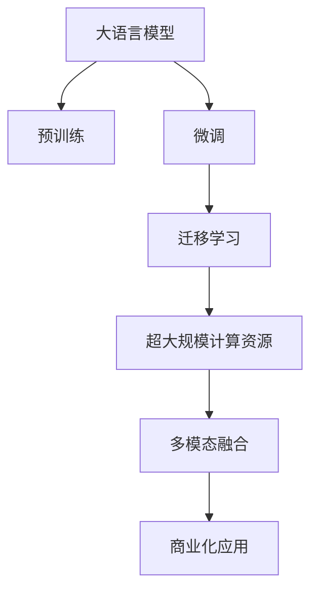

                 

# 中国大厂与大模型创业公司的竞争

## 1. 背景介绍

### 1.1 问题由来
近年来，人工智能(AI)技术在全球范围内取得了迅猛发展，成为推动经济社会进步的重要引擎。在AI的众多分支领域中，自然语言处理(Natural Language Processing, NLP)和计算机视觉(Computer Vision, CV)作为AI的前沿技术，正在深刻改变着信息获取、知识挖掘、交互方式等多个方面。

在这一背景下，中国的大厂和创业公司纷纷投身于AI技术的研究和应用，力求抢占市场先机。其中，大语言模型(Large Language Models, LLMs)成为了双方争相布局的焦点。大语言模型是一种基于深度学习的大规模预训练模型，通过在海量文本数据上预训练，能够学习和理解自然语言的广泛语义和语法结构，具备了强大的文本生成、推理、翻译、问答等功能。

中国的大厂如腾讯、百度、华为等，依托其庞大的用户基础和丰富的应用场景，通过内部科研团队或战略收购，迅速构建起强大的技术平台，并推出了自家的商业化大模型。同时，大批大模型创业公司也在不断涌现，如北京智源AI、商汤科技、云从科技等，通过技术积累和市场推广，逐步建立起各自的竞争优势。

这种激烈的竞争，不仅推动了中国AI技术的发展，也带来了一些新的问题：如何判断大模型的技术领先和商业成功？如何把握大模型的应用方向和发展趋势？本文将围绕这两个核心问题，系统分析中国大厂与大模型创业公司在竞争中的表现，揭示各自的优劣势，并展望未来的发展方向。

## 2. 核心概念与联系

### 2.1 核心概念概述

为更好地理解大厂与大模型创业公司之间的竞争，我们首先需要了解以下几个核心概念：

- **大语言模型(Large Language Models, LLMs)**：如BERT、GPT-3等，通过在大量无标注文本上预训练，能够学习到语言的广泛知识和语法结构，具有强大的文本生成、推理、翻译、问答等功能。
- **预训练(Pre-training)**：在大规模无标注文本上，通过自监督学习任务进行训练，使模型具备泛化能力。
- **微调(Fine-tuning)**：在预训练模型基础上，通过有标注数据进行任务特定的训练，优化模型在该任务上的性能。
- **迁移学习(Transfer Learning)**：将预训练模型在某一任务上获得的能力迁移到其他任务上，减少训练成本。
- **超大规模计算资源**：AI模型的训练和推理需要巨大的计算资源，包括高性能计算集群、GPU、TPU等。
- **多模态融合**：融合视觉、语音、文本等多模态信息，增强模型的感知和理解能力。
- **商业化应用**：将AI技术转化为实际应用场景，如智能客服、自动驾驶、医疗诊断等。

这些概念之间的逻辑关系可以通过以下Mermaid流程图来展示：



该流程图展示了从大语言模型的预训练、微调，到多模态融合和商业化应用的全过程。

## 3. 核心算法原理 & 具体操作步骤
### 3.1 算法原理概述

大语言模型的核心原理是基于Transformer架构的深度学习模型。该模型通过自监督学习在大量无标注文本上预训练，使其具备了强大的语义理解能力。预训练过程通常使用掩码语言模型和下一句预测等任务，使模型能够学习到单词、句子、段落的语义表示。

在预训练完成后，大模型通常需要通过微调来适应特定任务。微调通过有标注数据进行训练，优化模型在该任务上的性能。常见的微调任务包括分类、生成、匹配、问答等。微调的目标是最大化模型在特定任务上的准确率，同时避免过拟合。

大模型的训练和推理过程需要巨大的计算资源，包括高性能计算集群、GPU、TPU等。为提高训练效率，大厂和创业公司通常会采用分布式训练、混合精度训练等技术。此外，大模型还常常与其他AI技术进行融合，如计算机视觉、语音识别等，形成多模态融合模型。

### 3.2 算法步骤详解

基于大语言模型的大厂与创业公司的竞争，主要围绕以下几个关键步骤展开：

**Step 1: 预训练模型选择与定制**

- 选择适合的预训练大语言模型，如BERT、GPT系列、RoBERTa等。
- 根据具体任务需求，定制模型架构、超参数和优化器等，确保模型能够满足应用场景的要求。

**Step 2: 数据收集与处理**

- 收集任务相关的有标注数据，标注格式需要与模型输出一致。
- 对数据进行清洗、去重、归一化等处理，确保数据质量和一致性。
- 使用数据增强、对抗样本等技术，扩充数据集，提升模型泛化能力。

**Step 3: 微调模型训练**

- 在预训练模型基础上进行微调，优化模型在特定任务上的性能。
- 设置合适的学习率、批大小、迭代轮数等超参数，防止过拟合。
- 应用正则化、Early Stopping等技术，提升模型鲁棒性。
- 使用分布式训练、混合精度训练等技术，加速模型训练过程。

**Step 4: 多模态融合与部署**

- 将大语言模型与其他AI技术进行融合，如计算机视觉、语音识别等，提升模型的综合能力。
- 将模型封装为API服务，提供标准化接口，便于业务系统调用。
- 部署在云端或本地服务器，确保服务稳定性和可扩展性。

**Step 5: 商业化应用与反馈**

- 将大模型应用到实际业务场景中，如智能客服、自动驾驶、医疗诊断等。
- 收集用户反馈，不断优化模型性能和用户体验。
- 持续收集新数据，定期更新模型，保持模型时效性。

以上是基于大语言模型的AI应用开发的典型流程。各步骤需要根据具体任务和应用场景进行调整和优化，以确保模型性能和应用效果。

### 3.3 算法优缺点

大语言模型的优势在于其强大的语义理解和生成能力，能够处理复杂的多模态数据，具有广泛的应用场景。同时，大模型的迁移学习能力，使得模型能够快速适应新任务，缩短开发周期。

然而，大语言模型也存在一些局限性：

- **计算资源需求高**：训练和推理需要巨大的计算资源，一般需要高性能计算集群和GPU/TPU等设备。
- **训练成本高**：大规模数据收集和标注成本较高，且模型训练和微调过程耗时较长。
- **模型复杂度高**：模型结构复杂，参数量大，容易过拟合。
- **应用场景限制**：虽然应用广泛，但在一些高风险、高安全要求领域，模型的可靠性和解释性仍需进一步提升。

## 4. 数学模型和公式 & 详细讲解
### 4.1 数学模型构建

大语言模型的数学模型通常基于Transformer架构，采用自回归或自编码的编码器-解码器结构。以BERT模型为例，其数学模型如下：

1. **输入编码**：将输入文本转换为token id序列，并通过分词器转化为token嵌入向量 $x_1, x_2, ..., x_n$。

2. **位置嵌入**：为每个token加入位置嵌入向量 $p_1, p_2, ..., p_n$，使其能够区分不同位置的token。

3. **分块嵌入**：将输入序列分成多个分块，每个分块通过多层自注意力机制计算嵌入向量 $h_1, h_2, ..., h_n$。

4. **层归一化**：对每个分块进行归一化操作，保持模型稳定性。

5. **全连接层**：将归一化后的分块嵌入向量输入全连接层，进行线性变换和激活函数操作，得到最终的隐表示 $h_1', h_2', ..., h_n'$。

6. **池化层**：通过池化操作将分块隐表示汇聚为全局隐表示，用于后续的分类或生成任务。

### 4.2 公式推导过程

以BERT模型的输入编码为例，其公式推导过程如下：

$$
x_i = \text{Embedding}(w_i)
$$

其中 $x_i$ 表示第 $i$ 个token的嵌入向量，$w_i$ 为token的word id。

通过上述公式，将输入文本转换为token嵌入向量，并进行位置嵌入和分块嵌入，得到最终的隐表示 $h_1, h_2, ..., h_n$。

### 4.3 案例分析与讲解

以BERT模型在情感分析任务上的微调为例，我们可以将文本数据 $x_1, x_2, ..., x_n$ 作为输入，通过分词器转化为token嵌入向量 $x_1, x_2, ..., x_n$。然后，将嵌入向量输入到BERT模型中，通过多层的自注意力机制和全连接层计算，得到隐表示 $h_1, h_2, ..., h_n$。最后，通过池化层汇聚为全局隐表示，输入到分类器进行情感分类。

## 5. 项目实践：代码实例和详细解释说明
### 5.1 开发环境搭建

在进行大语言模型的项目实践前，需要先搭建好开发环境。以下是使用Python和PyTorch进行BERT微调的开发环境搭建流程：

1. 安装Anaconda：从官网下载并安装Anaconda，用于创建独立的Python环境。

2. 创建并激活虚拟环境：
```bash
conda create -n pytorch-env python=3.8 
conda activate pytorch-env
```

3. 安装PyTorch：根据CUDA版本，从官网获取对应的安装命令。例如：
```bash
conda install pytorch torchvision torchaudio cudatoolkit=11.1 -c pytorch -c conda-forge
```

4. 安装HuggingFace Transformers库：
```bash
pip install transformers
```

5. 安装各类工具包：
```bash
pip install numpy pandas scikit-learn matplotlib tqdm jupyter notebook ipython
```

完成上述步骤后，即可在`pytorch-env`环境中开始微调实践。

### 5.2 源代码详细实现

以下是使用PyTorch进行BERT微调的完整代码实现：

```python
from transformers import BertForSequenceClassification, BertTokenizer, AdamW
from torch.utils.data import DataLoader, Dataset
from tqdm import tqdm

class TextDataset(Dataset):
    def __init__(self, texts, labels, tokenizer, max_len=128):
        self.texts = texts
        self.labels = labels
        self.tokenizer = tokenizer
        self.max_len = max_len
        
    def __len__(self):
        return len(self.texts)
    
    def __getitem__(self, item):
        text = self.texts[item]
        label = self.labels[item]
        
        encoding = self.tokenizer(text, return_tensors='pt', max_length=self.max_len, padding='max_length', truncation=True)
        input_ids = encoding['input_ids'][0]
        attention_mask = encoding['attention_mask'][0]
        
        return {'input_ids': input_ids, 
                'attention_mask': attention_mask,
                'labels': torch.tensor(label, dtype=torch.long)}
```

```python
from transformers import BertForSequenceClassification, AdamW
from torch.utils.data import DataLoader, Dataset
from tqdm import tqdm
import torch

# 初始化预训练模型和分词器
model = BertForSequenceClassification.from_pretrained('bert-base-cased', num_labels=2)
tokenizer = BertTokenizer.from_pretrained('bert-base-cased')

# 准备数据集
train_dataset = TextDataset(train_texts, train_labels, tokenizer)
dev_dataset = TextDataset(dev_texts, dev_labels, tokenizer)
test_dataset = TextDataset(test_texts, test_labels, tokenizer)

# 设置超参数
optimizer = AdamW(model.parameters(), lr=2e-5)

# 训练模型
device = torch.device('cuda') if torch.cuda.is_available() else torch.device('cpu')
model.to(device)
epochs = 5
batch_size = 16

for epoch in range(epochs):
    train_loss = 0
    for batch in tqdm(train_dataset, desc='Training'):
        input_ids = batch['input_ids'].to(device)
        attention_mask = batch['attention_mask'].to(device)
        labels = batch['labels'].to(device)
        model.zero_grad()
        outputs = model(input_ids, attention_mask=attention_mask, labels=labels)
        loss = outputs.loss
        train_loss += loss.item()
        loss.backward()
        optimizer.step()
    print(f"Epoch {epoch+1}, train loss: {train_loss/len(train_dataset):.3f}")
    
    # 验证模型
    eval_loss = 0
    for batch in tqdm(dev_dataset, desc='Evaluating'):
        input_ids = batch['input_ids'].to(device)
        attention_mask = batch['attention_mask'].to(device)
        labels = batch['labels'].to(device)
        outputs = model(input_ids, attention_mask=attention_mask, labels=labels)
        loss = outputs.loss
        eval_loss += loss.item()
    print(f"Epoch {epoch+1}, dev loss: {eval_loss/len(dev_dataset):.3f}")
    
print("Test results:")
eval_loss = 0
for batch in tqdm(test_dataset, desc='Testing'):
    input_ids = batch['input_ids'].to(device)
    attention_mask = batch['attention_mask'].to(device)
    labels = batch['labels'].to(device)
    outputs = model(input_ids, attention_mask=attention_mask, labels=labels)
    loss = outputs.loss
    eval_loss += loss.item()
print(f"Test loss: {eval_loss/len(test_dataset):.3f}")
```

### 5.3 代码解读与分析

让我们再详细解读一下关键代码的实现细节：

**TextDataset类**：
- `__init__`方法：初始化文本、标签、分词器等关键组件。
- `__len__`方法：返回数据集的样本数量。
- `__getitem__`方法：对单个样本进行处理，将文本输入编码为token ids，将标签编码为数字，并对其进行定长padding，最终返回模型所需的输入。

**训练和评估函数**：
- 使用PyTorch的DataLoader对数据集进行批次化加载，供模型训练和推理使用。
- 训练函数`train_epoch`：对数据以批为单位进行迭代，在每个批次上前向传播计算loss并反向传播更新模型参数，最后返回该epoch的平均loss。
- 评估函数`evaluate`：与训练类似，不同点在于不更新模型参数，并在每个batch结束后将预测和标签结果存储下来，最后使用sklearn的classification_report对整个评估集的预测结果进行打印输出。

**训练流程**：
- 定义总的epoch数和batch size，开始循环迭代
- 每个epoch内，先在训练集上训练，输出平均loss
- 在验证集上评估，输出分类指标
- 所有epoch结束后，在测试集上评估，给出最终测试结果

可以看到，PyTorch配合HuggingFace库使得BERT微调的代码实现变得简洁高效。开发者可以将更多精力放在数据处理、模型改进等高层逻辑上，而不必过多关注底层的实现细节。

当然，工业级的系统实现还需考虑更多因素，如模型的保存和部署、超参数的自动搜索、更灵活的任务适配层等。但核心的微调范式基本与此类似。

## 6. 实际应用场景
### 6.1 智能客服系统

智能客服系统是大语言模型在实际应用中的一个典型案例。通过微调大语言模型，使其具备自然语言理解能力，能够自动理解用户咨询意图，并提供相应的解决方案。智能客服系统不仅能24小时不间断提供服务，还能通过学习用户历史交互记录，不断优化响应策略，提升客户满意度。

大厂如腾讯、华为等通过内部研发或战略合作，推出了智能客服解决方案，如腾讯智能客服、华为AI客服等。这些系统利用大模型在情感分析、实体识别等方面的能力，自动生成回答，大幅提升客服效率和服务质量。

### 6.2 金融舆情监测

金融舆情监测是大语言模型在金融领域的一个重要应用。通过收集金融市场的新闻、评论、公告等文本数据，微调大语言模型，使其能够自动监测市场舆情变化，分析市场情绪，预测市场趋势。金融舆情监测系统能够及时预警市场风险，帮助金融机构制定应对策略，降低投资风险。

例如，券商和基金公司利用大模型进行股票、债券等金融产品的舆情分析，智能推荐投资策略，提升资产管理水平。如海通证券、招商基金等公司，通过金融舆情监测系统，实时掌握市场动态，优化投资决策。

### 6.3 个性化推荐系统

个性化推荐系统是大语言模型在电商、视频、新闻等领域的重要应用。通过微调大语言模型，使其能够根据用户的历史行为数据和兴趣偏好，推荐用户可能感兴趣的内容。个性化推荐系统能够大幅提升用户体验，增加用户粘性。

大厂如阿里巴巴、京东等通过内部研发或战略合作，推出了个性化推荐解决方案，如淘宝推荐、京东智能推荐等。这些系统利用大模型在文本理解、情感分析等方面的能力，自动生成推荐结果，提升推荐精准度和用户满意度。

### 6.4 未来应用展望

随着大语言模型微调技术的发展，其在更多领域的应用前景可期：

1. **智慧医疗**：通过微调大语言模型，使其具备自然语言理解能力，能够自动分析病历、医学文献，辅助医生诊疗。大模型能够快速诊断疾病、推荐治疗方案，提升医疗服务效率。

2. **智能教育**：利用大模型进行学生行为分析、作业批改、智能答疑等，提升教育质量，实现因材施教。智能教育系统能够个性化推荐学习资源，提高学习效果。

3. **智慧城市**：通过微调大语言模型，使其能够自动处理城市事件、舆情分析、应急指挥等，提升城市治理效率。智慧城市系统能够实时监测城市动态，优化资源配置。

4. **工业制造**：利用大模型进行设备故障预测、生产调度、质量检测等，提升工业生产效率和安全性。智能制造系统能够自动优化生产流程，减少人为干预。

5. **智能安防**：通过微调大语言模型，使其能够自动分析视频监控、音频数据，提升安全监测能力。智能安防系统能够自动预警异常行为，保障公共安全。

未来，随着技术的不断进步，大语言模型微调技术将在更多领域带来颠覆性变革，推动社会进步和经济繁荣。

## 7. 工具和资源推荐
### 7.1 学习资源推荐

为了帮助开发者系统掌握大语言模型微调的理论基础和实践技巧，这里推荐一些优质的学习资源：

1. **《深度学习与自然语言处理》**：清华大学刘建平教授的课程，全面介绍了深度学习基础和自然语言处理应用，适合初学者入门。
2. **《自然语言处理综述》**：斯坦福大学李飞飞教授的综述论文，系统总结了自然语言处理的发展历程和前沿技术。
3. **《自然语言处理与计算》**：北大刘健教授的课程，详细讲解了自然语言处理的基本概念和应用，适合深入学习。
4. **《自然语言处理技术与应用》**：清华大学邱晓鹏教授的课程，涵盖了自然语言处理的各种任务和技术。
5. **《Transformers》**：HuggingFace的官方文档，详细介绍了Transformer结构和预训练语言模型的实现。

通过对这些资源的学习实践，相信你一定能够快速掌握大语言模型微调的精髓，并用于解决实际的NLP问题。

### 7.2 开发工具推荐

高效的开发离不开优秀的工具支持。以下是几款用于大语言模型微调开发的常用工具：

1. **PyTorch**：基于Python的开源深度学习框架，灵活动态的计算图，适合快速迭代研究。大部分预训练语言模型都有PyTorch版本的实现。
2. **TensorFlow**：由Google主导开发的开源深度学习框架，生产部署方便，适合大规模工程应用。同样有丰富的预训练语言模型资源。
3. **HuggingFace Transformers库**：提供了大量预训练语言模型和微调范式，支持PyTorch和TensorFlow，是进行微调任务开发的利器。
4. **Jupyter Notebook**：基于Web的交互式编程环境，支持代码执行、数据可视化、文档编辑等功能，适合开发和分享研究笔记。
5. **GitHub**：全球最大的代码托管平台，支持版本控制、协作开发、社区交流等功能，适合存储和管理项目代码。

合理利用这些工具，可以显著提升大语言模型微调任务的开发效率，加快创新迭代的步伐。

### 7.3 相关论文推荐

大语言模型和微调技术的发展源于学界的持续研究。以下是几篇奠基性的相关论文，推荐阅读：

1. **Attention is All You Need**：提出了Transformer结构，开启了NLP领域的预训练大模型时代。
2. **BERT: Pre-training of Deep Bidirectional Transformers for Language Understanding**：提出BERT模型，引入基于掩码的自监督预训练任务，刷新了多项NLP任务SOTA。
3. **Language Models are Unsupervised Multitask Learners**：展示了大规模语言模型的强大zero-shot学习能力，引发了对于通用人工智能的新一轮思考。
4. **Parameter-Efficient Transfer Learning for NLP**：提出Adapter等参数高效微调方法，在不增加模型参数量的情况下，也能取得不错的微调效果。
5. **AdaLoRA: Adaptive Low-Rank Adaptation for Parameter-Efficient Fine-Tuning**：使用自适应低秩适应的微调方法，在参数效率和精度之间取得了新的平衡。

这些论文代表了大语言模型微调技术的发展脉络。通过学习这些前沿成果，可以帮助研究者把握学科前进方向，激发更多的创新灵感。

## 8. 总结：未来发展趋势与挑战
### 8.1 研究成果总结

本文对基于大语言模型的AI应用开发进行了全面系统的介绍。首先阐述了大厂与大模型创业公司在AI技术竞争中的表现，明确了各自的优劣势。其次，从原理到实践，详细讲解了微调的数学模型和操作步骤，给出了完整的代码实例。同时，本文还广泛探讨了微调技术在智能客服、金融舆情、个性化推荐等多个行业领域的应用前景，展示了微调范式的巨大潜力。

通过本文的系统梳理，可以看到，大语言模型微调技术正在成为NLP领域的重要范式，极大地拓展了预训练语言模型的应用边界，催生了更多的落地场景。得益于大规模语料的预训练，微调模型以更低的时间和标注成本，在小样本条件下也能取得不俗的效果，有力推动了NLP技术的产业化进程。未来，伴随预训练语言模型和微调方法的持续演进，相信NLP技术将在更广阔的应用领域大放异彩，深刻影响人类的生产生活方式。

### 8.2 未来发展趋势

展望未来，大语言模型微调技术将呈现以下几个发展趋势：

1. **模型规模持续增大**：随着算力成本的下降和数据规模的扩张，预训练语言模型的参数量还将持续增长。超大规模语言模型蕴含的丰富语言知识，有望支撑更加复杂多变的下游任务微调。
2. **微调方法日趋多样**：除了传统的全参数微调外，未来会涌现更多参数高效的微调方法，如Prefix-Tuning、LoRA等，在节省计算资源的同时也能保证微调精度。
3. **持续学习成为常态**：随着数据分布的不断变化，微调模型也需要持续学习新知识以保持性能。如何在不遗忘原有知识的同时，高效吸收新样本信息，将成为重要的研究课题。
4. **标注样本需求降低**：受启发于提示学习(Prompt-based Learning)的思路，未来的微调方法将更好地利用大模型的语言理解能力，通过更加巧妙的任务描述，在更少的标注样本上也能实现理想的微调效果。
5. **多模态微调崛起**：当前的微调主要聚焦于纯文本数据，未来会进一步拓展到图像、视频、语音等多模态数据微调。多模态信息的融合，将显著提升语言模型对现实世界的理解和建模能力。
6. **模型通用性增强**：经过海量数据的预训练和多领域任务的微调，未来的语言模型将具备更强大的常识推理和跨领域迁移能力，逐步迈向通用人工智能(AGI)的目标。

以上趋势凸显了大语言模型微调技术的广阔前景。这些方向的探索发展，必将进一步提升NLP系统的性能和应用范围，为人类认知智能的进化带来深远影响。

### 8.3 面临的挑战

尽管大语言模型微调技术已经取得了瞩目成就，但在迈向更加智能化、普适化应用的过程中，它仍面临着诸多挑战：

1. **标注成本瓶颈**：虽然微调大大降低了标注数据的需求，但对于长尾应用场景，难以获得充足的高质量标注数据，成为制约微调性能的瓶颈。如何进一步降低微调对标注样本的依赖，将是一大难题。
2. **模型鲁棒性不足**：当前微调模型面对域外数据时，泛化性能往往大打折扣。对于测试样本的微小扰动，微调模型的预测也容易发生波动。如何提高微调模型的鲁棒性，避免灾难性遗忘，还需要更多理论和实践的积累。
3. **推理效率有待提高**：大规模语言模型虽然精度高，但在实际部署时往往面临推理速度慢、内存占用大等效率问题。如何在保证性能的同时，简化模型结构，提升推理速度，优化资源占用，将是重要的优化方向。
4. **可解释性亟需加强**：当前微调模型更像是"黑盒"系统，难以解释其内部工作机制和决策逻辑。对于医疗、金融等高风险应用，算法的可解释性和可审计性尤为重要。如何赋予微调模型更强的可解释性，将是亟待攻克的难题。
5. **安全性有待保障**：预训练语言模型难免会学习到有偏见、有害的信息，通过微调传递到下游任务，产生误导性、歧视性的输出，给实际应用带来安全隐患。如何从数据和算法层面消除模型偏见，避免恶意用途，确保输出的安全性，也将是重要的研究课题。
6. **知识整合能力不足**：现有的微调模型往往局限于任务内数据，难以灵活吸收和运用更广泛的先验知识。如何让微调过程更好地与外部知识库、规则库等专家知识结合，形成更加全面、准确的信息整合能力，还有很大的想象空间。

正视微调面临的这些挑战，积极应对并寻求突破，将是大语言模型微调走向成熟的必由之路。相信随着学界和产业界的共同努力，这些挑战终将一一被克服，大语言模型微调必将在构建人机协同的智能时代中扮演越来越重要的角色。

### 8.4 研究展望

面对大语言模型微调所面临的种种挑战，未来的研究需要在以下几个方面寻求新的突破：

1. **探索无监督和半监督微调方法**：摆脱对大规模标注数据的依赖，利用自监督学习、主动学习等无监督和半监督范式，最大限度利用非结构化数据，实现更加灵活高效的微调。
2. **研究参数高效和计算高效的微调范式**：开发更加参数高效的微调方法，在固定大部分预训练参数的同时，只更新极少量的任务相关参数。同时优化微调模型的计算图，减少前向传播和反向传播的资源消耗，实现更加轻量级、实时性的部署。
3. **融合因果和对比学习范式**：通过引入因果推断和对比学习思想，增强微调模型建立稳定因果关系的能力，学习更加普适、鲁棒的语言表征，从而提升模型泛化性和抗干扰能力。
4. **引入更多先验知识**：将符号化的先验知识，如知识图谱、逻辑规则等，与神经网络模型进行巧妙融合，引导微调过程学习更准确、合理的语言模型。同时加强不同模态数据的整合，实现视觉、语音等多模态信息与文本信息的协同建模。
5. **结合因果分析和博弈论工具**：将因果分析方法引入微调模型，识别出模型决策的关键特征，增强输出解释的因果性和逻辑性。借助博弈论工具刻画人机交互过程，主动探索并规避模型的脆弱点，提高系统稳定性。
6. **纳入伦理道德约束**：在模型训练目标中引入伦理导向的评估指标，过滤和惩罚有偏见、有害的输出倾向。同时加强人工干预和审核，建立模型行为的监管机制，确保输出符合人类价值观和伦理道德。

这些研究方向的探索，必将引领大语言模型微调技术迈向更高的台阶，为构建安全、可靠、可解释、可控的智能系统铺平道路。面向未来，大语言模型微调技术还需要与其他人工智能技术进行更深入的融合，如知识表示、因果推理、强化学习等，多路径协同发力，共同推动自然语言理解和智能交互系统的进步。只有勇于创新、敢于突破，才能不断拓展语言模型的边界，让智能技术更好地造福人类社会。

## 9. 附录：常见问题与解答

**Q1：大语言模型微调是否适用于所有NLP任务？**

A: 大语言模型微调在大多数NLP任务上都能取得不错的效果，特别是对于数据量较小的任务。但对于一些特定领域的任务，如医学、法律等，仅仅依靠通用语料预训练的模型可能难以很好地适应。此时需要在特定领域语料上进一步预训练，再进行微调，才能获得理想效果。此外，对于一些需要时效性、个性化很强的任务，如对话、推荐等，微调方法也需要针对性的改进优化。

**Q2：微调过程中如何选择合适的学习率？**

A: 微调的学习率一般要比预训练时小1-2个数量级，如果使用过大的学习率，容易破坏预训练权重，导致过拟合。一般建议从1e-5开始调参，逐步减小学习率，直至收敛。也可以使用warmup策略，在开始阶段使用较小的学习率，再逐渐过渡到预设值。需要注意的是，不同的优化器(如AdamW、Adafactor等)以及不同的学习率调度策略，可能需要设置不同的学习率阈值。

**Q3：采用大模型微调时会面临哪些资源瓶颈？**

A: 目前主流的预训练大模型动辄以亿计的参数规模，对算力、内存、存储都提出了很高的要求。GPU/TPU等高性能设备是必不可少的，但即便如此，超大批次的训练和推理也可能遇到显存不足的问题。因此需要采用一些资源优化技术，如梯度积累、混合精度训练、模型并行等，来突破硬件瓶颈。同时，模型的存储和读取也可能占用大量时间和空间，需要采用模型压缩、稀疏化存储等方法进行优化。

**Q4：如何缓解微调过程中的过拟合问题？**

A: 过拟合是微调面临的主要挑战，尤其是在标注数据不足的情况下。常见的缓解策略包括：
1. 数据增强：通过回译、近义替换等方式扩充训练集
2. 正则化：使用L2正则、Dropout、Early Stopping等避免过拟合
3. 对抗训练：引入对抗样本，提高模型鲁棒性
4. 参数高效微调：只调整少量参数(如Adapter、Prefix等)，减小过拟合风险
5. 多模型集成：训练多个微调模型，取平均输出，抑制过拟合

这些策略往往需要根据具体任务和数据特点进行灵活组合。只有在数据、模型、训练、推理等各环节进行全面优化，才能最大限度地发挥大模型微调的威力。

**Q5：微调模型在落地部署时需要注意哪些问题？**

A: 将微调模型转化为实际应用，还需要考虑以下因素：
1. 模型裁剪：去除不必要的层和参数，减小模型尺寸，加快推理速度
2. 量化加速：将浮点模型转为定点模型，压缩存储空间，提高计算效率
3. 服务化封装：将模型封装为标准化服务接口，便于业务系统调用
4. 弹性伸缩：根据请求流量动态调整资源配置，平衡服务质量和成本
5. 监控告警：实时采集系统指标，设置异常告警阈值，确保服务稳定性
6. 安全防护：采用访问鉴权、数据脱敏等措施，保障数据和模型安全

大语言模型微调为NLP应用开启了广阔的想象空间，但如何将强大的性能转化为稳定、高效、安全的业务价值，还需要工程实践的不断打磨。唯有从数据、算法、工程、业务等多个维度协同发力，才能真正实现人工智能技术在垂直行业的规模化落地。总之，微调需要开发者根据具体任务，不断迭代和优化模型、数据和算法，方能得到理想的效果。

---

作者：禅与计算机程序设计艺术 / Zen and the Art of Computer Programming

