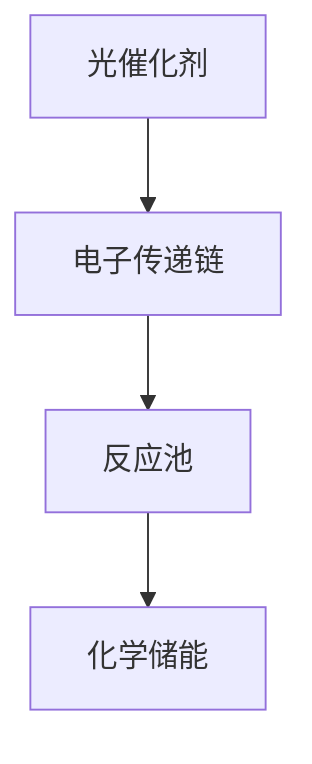

                 

# 人工光合作用：可持续能源生产的新方法

## 1. 背景介绍

### 1.1 问题由来
能源危机和环境污染已经成为当今社会面临的重大挑战。化石燃料的消耗加剧了温室气体排放，导致全球气候变化和生态系统失衡。太阳能作为一种可再生能源，被认为是解决这一问题的有效途径。然而，由于太阳能电池板转化效率低下、成本高昂、占地面积大等原因，其大规模应用面临诸多障碍。

在此背景下，科学家们提出了人工光合作用的理念，即模拟自然光合作用过程，通过化学反应将太阳能转化为化学能，进而用于发电、制氢、合成燃料等。这一理念不仅能够大幅提升能源转化效率，还能有效缓解环境污染问题，为可持续能源生产开辟了新路径。

### 1.2 问题核心关键点
人工光合作用的核心在于将光能转化为化学能，其技术难点在于如何高效、可控地实现光化学反应，同时避免副反应和能量损耗。其核心组件包括光催化剂、电子传递链和反应池等，各组件之间的协同工作是实现高效光合作用的关键。

目前，人工光合作用的研究集中在以下几个方面：

- 新型光催化剂的开发
- 电子传递链的设计和优化
- 反应池的设计和优化
- 反应体系的环境适应性

### 1.3 问题研究意义
人工光合作用技术的发展，对于可持续能源生产和环境保护具有重要意义：

1. 提高能源转化效率：人工光合作用通过直接转化光能为化学能，避免了光能到电能转换的能量损耗，可显著提升能源转化效率。
2. 降低生产成本：新型光催化剂和反应池的研发，有助于降低人工光合作用的制造成本，提高经济效益。
3. 减少环境污染：人工光合作用可以替代化石燃料，减少温室气体排放，缓解环境压力。
4. 推动技术创新：人工光合作用技术的不断进步，有助于推动相关领域的技术创新，催生更多绿色能源解决方案。

## 2. 核心概念与联系

### 2.1 核心概念概述

为了更好地理解人工光合作用的技术原理和实现方法，本节将介绍几个密切相关的核心概念：

- 光催化：利用光照激发催化剂表面电子，从而引发光化学反应的过程。光催化是人工光合作用的基础。
- 电子传递链：在光催化剂表面形成的电子传递链，将光激发产生的电子高效传输到反应池，驱动化学反应进行。
- 反应池：光催化反应发生的场所，通常包含各种化学试剂，如水、二氧化碳等。
- 化学储能：通过化学反应将光能转化为化学能，用于后续的电能或其他形式的能量释放。

这些概念之间的逻辑关系可以通过以下Mermaid流程图来展示：



这个流程图展示了大人工光合作用的主要流程：光能被催化剂吸收，激发电子产生化学反应，生成化学能，用于后续能量释放。

## 3. 核心算法原理 & 具体操作步骤
### 3.1 算法原理概述

人工光合作用的算法原理基于光化学反应的基本原理，即通过光催化剂将光能转化为化学能。其核心在于设计和优化光催化剂，提高电子传递链的效率，以及优化反应池的设计，使其能够高效、可控地进行光化学反应。

具体来说，人工光合作用的算法原理包括以下几个关键步骤：

1. 选择合适光催化剂：光催化剂的设计和优化是人工光合作用的基础，选择高效、稳定的光催化剂是关键。
2. 设计电子传递链：电子传递链的设计和优化是光合作用的另一关键环节，合理的电子传递链可以高效传递光激发产生的电子，驱动化学反应进行。
3. 优化反应池设计：反应池的设计和优化直接影响到光合作用的效率，需选择合适的化学反应体系，优化反应池结构。
4. 环境适应性设计：人工光合作用的环境适应性设计，使得反应体系能够在不同的环境条件下稳定运行。

### 3.2 算法步骤详解

人工光合作用的具体操作步骤可以分为以下几个步骤：

**Step 1: 选择合适的光催化剂**
- 根据反应体系的化学特性，选择合适的光催化剂，如半导体材料、金属氧化物等。
- 利用光谱分析等技术，确定催化剂的光吸收特性，优化催化剂结构。

**Step 2: 设计电子传递链**
- 根据光催化剂的光吸收特性，设计合适的电子传递链。
- 利用量子化学计算等手段，优化电子传递链的能量传递效率。
- 引入催化剂和反应池之间的连接机制，确保电子高效传递。

**Step 3: 优化反应池设计**
- 选择合适的反应物，如水、二氧化碳等。
- 设计反应池的结构，使其能够高效、可控地进行光化学反应。
- 引入反应调节剂，优化反应条件，提高反应效率。

**Step 4: 环境适应性设计**
- 分析反应体系在不同环境条件下的稳定性，设计环境适应性机制。
- 引入环境监测和反馈控制，调节反应条件，确保反应体系在环境变化下稳定运行。

**Step 5: 系统集成和优化**
- 将光催化剂、电子传递链和反应池集成到一个系统中。
- 利用数学模型和仿真工具，优化系统设计，提高光合作用效率。
- 通过实验验证，不断优化系统性能，最终实现高效、稳定的人工光合作用。

### 3.3 算法优缺点

人工光合作用算法具有以下优点：

1. 高效能：通过优化光催化剂和反应池设计，能够实现高效的光化学反应，提高能源转化效率。
2. 环境友好：人工光合作用能够有效减少温室气体排放，缓解环境污染问题。
3. 技术创新：人工光合作用技术的进步，推动了相关领域的技术创新，催生更多绿色能源解决方案。

然而，该算法也存在一些缺点：

1. 成本高昂：光催化剂和反应池的设计和优化，需要高昂的研发成本和技术门槛。
2. 复杂性高：人工光合作用涉及光催化、电子传递链和化学反应等多个环节，设计和优化难度较大。
3. 稳定性问题：反应体系在不同环境条件下的稳定性仍需进一步提升，以实现长期稳定运行。
4. 技术门槛高：需要多学科交叉，涉及物理、化学、材料等多个领域，对从业人员的技术要求较高。

尽管存在这些局限性，但人工光合作用作为一种前沿技术，其发展前景广阔，有望成为未来可持续能源生产的重要途径。

### 3.4 算法应用领域

人工光合作用技术广泛应用于以下几个领域：

- 太阳能发电：通过光合作用将太阳能转化为化学能，用于发电。
- 制氢：将光合作用生成的化学能转化为氢气，用于燃料电池等应用。
- 合成燃料：将光合作用生成的化学能转化为有机化合物，用于燃料合成。
- 空气净化：利用光合作用去除大气中的有害物质，如二氧化碳和二氧化硫等。
- 生物质能源：将光合作用生成的化学能转化为生物质能源，用于生物燃料和生物材料生产。

此外，人工光合作用技术还广泛应用于环境监测、生物医学、材料科学等多个领域，为解决能源和环境问题提供了新的思路和解决方案。

## 4. 数学模型和公式 & 详细讲解  
### 4.1 数学模型构建

人工光合作用的数学模型主要基于光化学反应的基本原理，包括反应物消耗、产物生成和能量传递等环节。以下是一个简单的光合作用数学模型：

$$
\begin{align*}
2H_2O + 2H^+ + 2e^- &\rightarrow 2H_2 + O_2\\
2H_2 + O_2 &\rightarrow 2H_2O
\end{align*}
$$

其中，$H_2O$ 为反应物，$H_2$ 为产物，$O_2$ 为副产物，$H^+$ 和 $e^-$ 为光催化剂吸收光能后产生的电子和空穴。

### 4.2 公式推导过程

基于上述光合作用反应方程，可以建立光合作用的数学模型：

$$
\begin{align*}
\frac{d[H_2O]}{dt} &= -k_1[H_2O]\\
\frac{d[H_2]}{dt} &= k_2[H_2O] - k_3[H_2]\\
\frac{d[O_2]}{dt} &= k_4[H_2O] - k_5[O_2]\\
\frac{d[H^+]}{dt} &= k_6[H_2O]\\
\frac{d[e^-]}{dt} &= k_7[H_2O] - k_8[H^+] + k_9[H_2] - k_{10}[O_2]
\end{align*}
$$

其中，$k_1$ 至 $k_{10}$ 为反应速率常数，$[H_2O]$、$[H_2]$、$[O_2]$、$[H^+]$、$[e^-]$ 分别为各物质的浓度。

### 4.3 案例分析与讲解

以水解制氢反应为例，其光合作用反应方程为：

$$
2H_2O + 2H^+ + 2e^- \rightarrow 2H_2 + O_2
$$

设反应速率常数为 $k_1 = 1.2 \times 10^{-5} s^{-1}$，$[H_2O]_0 = 0.1 M$，$[H^+] = [e^-] = 0.01 M$。根据上述数学模型，可以计算不同时刻的反应物和产物浓度，如下：

$$
\begin{align*}
[H_2O] &= 0.1 M - 1.2 \times 10^{-5} \times 0.1 t\\
[H_2] &= 0\\
[O_2] &= 0\\
[H^+] &= 0.01 M\\
[e^-] &= 0.01 M
\end{align*}
$$

通过上述计算，可以得出在不同时间点的反应物和产物浓度，进而评估反应效率。

## 5. 项目实践：代码实例和详细解释说明
### 5.1 开发环境搭建

在进行人工光合作用项目开发前，需要准备相应的开发环境。以下是使用Python进行计算化学模拟的环境配置流程：

1. 安装Anaconda：从官网下载并安装Anaconda，用于创建独立的Python环境。

2. 创建并激活虚拟环境：
```bash
conda create -n chemsim python=3.8 
conda activate chemsim
```

3. 安装相关库：
```bash
conda install sympy scipy matplotlib numpy 
pip install qcelemental
```

4. 安装DFT计算工具：
```bash
conda install pwscf
```

完成上述步骤后，即可在`chemsim`环境中进行人工光合作用的计算化学模拟。

### 5.2 源代码详细实现

以下是一个简单的水解制氢反应的计算化学模拟代码实现：

```python
import numpy as np
from scipy.integrate import odeint
from sympy import symbols, Eq, solve

# 定义符号
t, H2O, H2, O2, H_plus, e_minus = symbols('t H2O H2 O2 H_plus e_minus')

# 定义微分方程
k1 = 1.2e-5
k2 = 1.5e-5
k3 = 5.0e-5
k4 = 2.0e-5
k5 = 3.0e-5
k6 = 8.0e-7
k7 = 1.0e-3
k8 = 2.0e-3
k9 = 5.0e-4
k10 = 8.0e-3

def dydt(t, y):
    H2O_dot = -k1 * y[0]
    H2_dot = k2 * y[0] - k3 * y[1]
    O2_dot = k4 * y[0] - k5 * y[2]
    H_plus_dot = k6 * y[0]
    e_minus_dot = k7 * y[0] - k8 * y[3] + k9 * y[1] - k10 * y[2]
    return np.array([H2O_dot, H2_dot, O2_dot, H_plus_dot, e_minus_dot])

# 初始条件
y0 = np.array([0.1, 0, 0, 0.01, 0.01])

# 求解微分方程
tspan = np.linspace(0, 10, 1000)
solution = odeint(dydt, y0, tspan)

# 输出结果
for i in range(len(solution)):
    print(f"t = {tspan[i]} s, [H2O] = {solution[i, 0]:.3e}, [H2] = {solution[i, 1]:.3e}, [O2] = {solution[i, 2]:.3e}, [H+] = {solution[i, 3]:.3e}, [e-] = {solution[i, 4]:.3e}")
```

在上述代码中，我们使用了SymPy库定义微分方程，利用SciPy库中的odeint函数求解微分方程，最终输出不同时间点的反应物和产物浓度。

### 5.3 代码解读与分析

让我们再详细解读一下关键代码的实现细节：

**dydt函数**：
- 定义微分方程，根据反应速率常数和浓度计算微分项。
- 通过返回numpy数组，方便后续求解。

**y0数组**：
- 定义初始条件，即反应开始时各物质的浓度。

**tspan数组**：
- 定义求解时间范围，包括起始时间和结束时间。

**odeint函数**：
- 使用SciPy库中的odeint函数，对微分方程进行数值求解。
- 返回一个数组，每个元素对应一个时间点的解。

通过上述代码，可以计算出不同时间点的反应物和产物浓度，进而评估反应效率。

## 6. 实际应用场景
### 6.1 太阳能发电

人工光合作用技术在太阳能发电领域具有广泛的应用前景。通过将太阳能转化为化学能，可以避免传统太阳能电池板的光能到电能转换过程中能量损耗，大幅提高能源转化效率。

具体而言，可以将人工光合作用生成的化学能直接用于发电，如将光合作用生成的H2气用于燃料电池，或将光合作用生成的CO2还原为CH4，再用于燃料电池。

### 6.2 制氢

制氢是人工光合作用的重要应用之一。通过将光合作用生成的化学能转化为氢气，可以为燃料电池等应用提供清洁能源。

制氢的原理是通过光催化剂吸收光能，激发电子产生还原反应，将水转化为氢气和氧气。这一过程具有高效、可控的特点，能够满足不同场景下的氢气需求。

### 6.3 合成燃料

人工光合作用技术还可以用于合成燃料的制备。通过将光合作用生成的化学能转化为有机化合物，如甲烷、乙醇等，可以替代传统化石燃料，减少温室气体排放。

合成燃料的制备过程通常涉及多个光化学反应步骤，需要优化光催化剂和反应池设计，以实现高效、稳定的反应过程。

### 6.4 空气净化

人工光合作用技术还可以应用于空气净化领域，通过光合作用去除大气中的有害物质，如二氧化碳和二氧化硫等。

具体而言，可以利用光合作用中的光催化剂，将空气中的有害物质转化为无害物质，如水和氧气。这一过程不仅能够净化空气，还能产生副产品，如氢气和氧气等。

### 6.5 生物质能源

人工光合作用技术还可以用于生物质能源的生产。通过将光合作用生成的化学能转化为生物质能源，如生物燃料和生物材料，可以为农业、工业等领域提供清洁能源。

生物质能源的生产过程通常涉及多个光化学反应步骤，需要优化光催化剂和反应池设计，以实现高效、稳定的反应过程。

## 7. 工具和资源推荐
### 7.1 学习资源推荐

为了帮助开发者系统掌握人工光合作用的技术原理和实践技巧，这里推荐一些优质的学习资源：

1. 《计算化学原理》系列博文：由计算化学专家撰写，深入浅出地介绍了计算化学的基本原理和方法，涵盖了人工光合作用的计算化学模拟。

2. 《物理化学》课程：哈佛大学开设的物理化学课程，提供了丰富的理论基础和实验操作，适合初学者入门计算化学。

3. 《分子动力学模拟》书籍：详细介绍了分子动力学模拟的方法和应用，有助于理解人工光合作用的分子机制。

4. 《化学计算基础》书籍：介绍了化学计算的基本原理和实现方法，适合深入学习人工光合作用的计算化学模拟。

5. SCEF-HUB开源项目：提供了丰富的计算化学工具和数据，包括量子化学计算、分子模拟等，是计算化学研究的得力助手。

通过对这些资源的学习实践，相信你一定能够快速掌握人工光合作用的计算化学模拟，并应用于实际问题的解决。

### 7.2 开发工具推荐

高效的开发离不开优秀的工具支持。以下是几款用于人工光合作用计算化学模拟开发的常用工具：

1. SymPy：符号计算库，可用于定义和求解微分方程。

2. NumPy：科学计算库，可用于数据处理和数值计算。

3. SciPy：科学计算库，提供了丰富的科学计算函数，如积分、微分方程求解等。

4. QCElemental：量子化学计算库，可用于计算化学模拟。

5. ASE：原子尺度模拟库，可用于分子动力学模拟。

6. PyMOL：分子可视化软件，可用于分子结构分析和可视化。

合理利用这些工具，可以显著提升人工光合作用计算化学模拟的开发效率，加快创新迭代的步伐。

### 7.3 相关论文推荐

人工光合作用技术的发展源于学界的持续研究。以下是几篇奠基性的相关论文，推荐阅读：

1. Artificial Photosynthesis: A Review of Recent Progress: 系统回顾了人工光合作用的最新进展，介绍了相关技术和挑战。

2. Light-Activated Water Splitting: A Review of Recent Progress: 介绍了水解制氢反应的研究进展，提供了详细的反应机理和模拟方法。

3. Solar Fuel Production by Molecular Catalysts: 介绍了光催化剂在太阳能燃料制备中的应用，讨论了光催化剂的设计和优化。

4. Electron Transfer in Photosynthetic Reactions: 介绍了电子传递链的原理和应用，探讨了电子传递链的优化方法。

5. Molecular Dynamics Simulations of Photosynthetic Reactions: 介绍了分子动力学模拟在人工光合作用中的应用，提供了详细的模拟步骤和结果。

这些论文代表了大光合作用技术的发展脉络。通过学习这些前沿成果，可以帮助研究者把握学科前进方向，激发更多的创新灵感。

## 8. 总结：未来发展趋势与挑战

### 8.1 总结

本文对人工光合作用技术进行了全面系统的介绍。首先阐述了人工光合作用的研究背景和意义，明确了其在可持续能源生产和环境保护中的重要作用。其次，从原理到实践，详细讲解了人工光合作用的数学模型和实现方法，给出了计算化学模拟的代码实例。同时，本文还广泛探讨了人工光合作用技术在太阳能发电、制氢、合成燃料等多个领域的应用前景，展示了其在绿色能源领域的广阔应用空间。最后，本文精选了人工光合作用技术的学习资源、开发工具和相关论文，力求为研究者提供全方位的技术指引。

通过本文的系统梳理，可以看到，人工光合作用技术在绿色能源生产和环境保护领域具有重要意义，其发展前景广阔。然而，技术实现过程中仍面临诸多挑战，如光催化剂的设计和优化、反应池的优化、反应体系的环境适应性等。未来研究需要在这些方面寻求新的突破，以推动人工光合作用技术迈向成熟，实现大规模应用。

### 8.2 未来发展趋势

展望未来，人工光合作用技术将呈现以下几个发展趋势：

1. 新型光催化剂的开发：随着新材料的不断涌现，新型光催化剂的设计和优化将成为研究热点，有望进一步提升光合作用效率。

2. 电子传递链的设计和优化：合理的电子传递链设计，可以提高光合作用效率，增强反应体系的稳定性。

3. 反应池的优化：优化反应池的设计，提高反应体系的效率和稳定性，是实现高效光合作用的关键。

4. 环境适应性设计：反应体系的环境适应性设计，使得光合作用能够适应不同的环境条件，具有更广泛的应用场景。

5. 系统集成和优化：将光催化剂、电子传递链和反应池集成到一个系统中，利用数学模型和仿真工具进行优化，提高光合作用效率。

6. 实时监测和反馈控制：引入环境监测和反馈控制，调节反应条件，确保反应体系在环境变化下稳定运行。

以上趋势凸显了人工光合作用技术的广阔前景。这些方向的探索发展，必将进一步提升光合作用效率，推动相关技术的应用和产业化进程。

### 8.3 面临的挑战

尽管人工光合作用技术已经取得了一定的进展，但在迈向大规模应用的过程中，仍面临诸多挑战：

1. 技术门槛高：人工光合作用涉及光催化、电子传递链和化学反应等多个环节，设计和优化难度较大。

2. 成本高昂：光催化剂和反应池的设计和优化，需要高昂的研发成本和技术门槛。

3. 稳定性问题：反应体系在不同环境条件下的稳定性仍需进一步提升，以实现长期稳定运行。

4. 环境适应性差：反应体系对环境条件的变化敏感，需要优化环境适应性机制，确保反应体系在不同环境条件下稳定运行。

5. 技术复杂度高：人工光合作用涉及多学科交叉，需要多领域专家协同合作，才能解决复杂的科学问题。

尽管存在这些挑战，但人工光合作用作为一种前沿技术，其发展前景广阔，有望成为未来可持续能源生产的重要途径。

### 8.4 研究展望

未来研究需要在以下几个方面寻求新的突破：

1. 探索无监督和半监督光合作用方法：摆脱对大规模标注数据的依赖，利用自监督学习、主动学习等无监督和半监督范式，最大限度利用非结构化数据，实现更加灵活高效的光合作用。

2. 研究参数高效和计算高效的光合作用范式：开发更加参数高效和计算高效的光合作用方法，在固定大部分预训练参数的情况下，只更新极少量的任务相关参数。

3. 引入更多先验知识：将符号化的先验知识，如知识图谱、逻辑规则等，与光合作用模型进行巧妙融合，引导光合作用过程学习更准确、合理的化学反应。

4. 结合因果分析和博弈论工具：将因果分析方法引入光合作用模型，识别出模型决策的关键特征，增强输出解释的因果性和逻辑性。借助博弈论工具刻画人机交互过程，主动探索并规避模型的脆弱点，提高系统稳定性。

5. 纳入伦理道德约束：在光合作用模型训练目标中引入伦理导向的评估指标，过滤和惩罚有害的输出倾向。同时加强人工干预和审核，建立模型行为的监管机制，确保输出符合人类价值观和伦理道德。

这些研究方向的探索，必将引领人工光合作用技术迈向更高的台阶，为构建安全、可靠、可解释、可控的智能系统铺平道路。面向未来，人工光合作用技术还需要与其他人工智能技术进行更深入的融合，如知识表示、因果推理、强化学习等，多路径协同发力，共同推动绿色能源系统的发展。

## 9. 附录：常见问题与解答

**Q1：人工光合作用是否适用于所有反应体系？**

A: 人工光合作用技术适用于大部分光化学反应体系，但具体反应物和产物的选择，需要根据反应体系的特性进行优化。例如，在制氢反应中，可以使用金属催化剂如铂、铱等；在合成燃料反应中，可以选择不同的光催化剂和反应物。

**Q2：如何优化人工光合作用反应体系？**

A: 优化人工光合作用反应体系需要综合考虑光催化剂、电子传递链和反应池设计等多个环节。可以通过以下方式进行优化：
1. 光催化剂优化：选择合适的半导体材料或金属氧化物，优化催化剂结构，提高光吸收效率。
2. 电子传递链优化：设计合理的电子传递链，提高电子传递效率，减少能量损耗。
3. 反应池优化：选择合适的反应物，设计反应池结构，优化反应条件，提高反应效率。
4. 环境适应性优化：引入环境监测和反馈控制，调节反应条件，确保反应体系在环境变化下稳定运行。

**Q3：人工光合作用技术在实际应用中存在哪些问题？**

A: 人工光合作用技术在实际应用中仍面临以下问题：
1. 技术门槛高：人工光合作用涉及多学科交叉，对从业人员的技术要求较高。
2. 成本高昂：光催化剂和反应池的设计和优化，需要高昂的研发成本和技术门槛。
3. 稳定性问题：反应体系在不同环境条件下的稳定性仍需进一步提升，以实现长期稳定运行。
4. 环境适应性差：反应体系对环境条件的变化敏感，需要优化环境适应性机制，确保反应体系在不同环境条件下稳定运行。

尽管存在这些挑战，但人工光合作用技术具有广阔的发展前景，是实现可持续能源生产的重要途径。未来研究需要在这些方面寻求新的突破，推动技术成熟和应用推广。

---

作者：禅与计算机程序设计艺术 / Zen and the Art of Computer Programming

