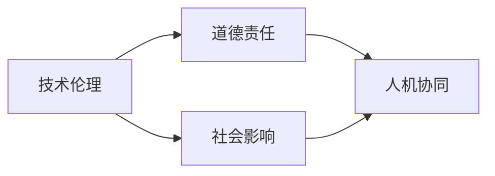

                 

## 1. 背景介绍

人工智能伦理（Artificial Intelligence Ethics）是一个多学科交叉的研究领域，涉及哲学、伦理学、社会学、法学和计算机科学等诸多方面。随着人工智能技术的迅猛发展，其伦理问题和道德责任逐渐成为社会关注的焦点。

### 1.1 研究背景

#### 1.1.1 技术发展迅猛
人工智能技术，特别是深度学习和大数据技术的发展，使得机器能够处理和理解复杂的人类行为和决策过程，从而在医疗、教育、金融等多个领域展现出巨大的应用潜力。例如，机器学习模型可以分析海量医疗数据，帮助医生诊断疾病；自然语言处理模型可以理解人类语言，进行智能问答和翻译；自动驾驶汽车可以感知环境，保障交通安全。

#### 1.1.2 伦理问题频发
然而，人工智能技术的广泛应用也带来了诸多伦理问题。例如，智能推荐系统可能通过算法的偏见导致信息茧房，加剧社会分化；自动化决策系统可能引发就业问题，影响社会稳定；智能监控系统可能侵犯隐私，侵害人权；自动武器可能误伤无辜，破坏国际和平。

#### 1.1.3 道德责任凸显
在人工智能技术的开发和应用过程中，开发者和使用者肩负着重要的道德责任。如何确保技术的应用符合人类的伦理价值观，防止技术滥用，保障人权，维护社会正义，成为了人工智能伦理研究的迫切任务。

## 2. 核心概念与联系

### 2.1 核心概念概述

人工智能伦理研究的核心概念包括：

- **技术伦理**：研究人工智能技术的开发和使用过程中涉及的伦理问题，如算法偏见、隐私保护、数据使用等。
- **道德责任**：探讨人工智能开发者和使用者在技术应用中的道德责任，包括决策透明性、责任归属、社会公平等。
- **社会影响**：分析人工智能技术对社会结构、经济模式、文化形态等方面的深远影响。
- **人机协同**：探索人机关系，建立符合人类价值观的智能系统，实现人机和谐共处。

### 2.2 核心概念联系

人工智能伦理研究涉及到技术、伦理、道德和社会等多个层面，各概念之间相互关联，形成一个复杂的理论体系。技术伦理是基础，道德责任是核心，社会影响是目标，人机协同是方向。只有通过多学科的交叉研究，才能构建一个全面、系统的人工智能伦理体系。

以下是一个简化的Mermaid流程图，展示了人工智能伦理研究的核心概念之间的联系：



## 3. 核心算法原理 & 具体操作步骤

### 3.1 算法原理概述

人工智能伦理研究的核心算法包括：

- **算法公正性**：评估和改进算法模型在数据上的公正性，避免算法偏见，确保模型对所有人群的公平对待。
- **隐私保护**：研究如何在保证数据隐私的前提下，合理使用数据，避免侵犯个人隐私。
- **可解释性**：提升人工智能系统的可解释性，确保决策过程透明、可信，易于理解和审查。
- **人机协作**：探索人机交互的新模式，构建智能系统的决策支持系统，辅助人类进行复杂决策。

### 3.2 算法步骤详解

#### 3.2.1 算法公正性

**步骤1：数据收集与预处理**
- 收集包含不同人群、不同背景的数据，确保数据集的多样性和代表性。
- 对数据进行去噪、标准化等预处理，确保数据质量。

**步骤2：模型训练与评估**
- 选择公正性评估指标，如平等误差、差异比率等，评估模型的公正性。
- 调整模型参数，通过交叉验证等方法优化模型。

**步骤3：模型部署与监控**
- 将优化后的模型部署到实际应用中，监控模型的公正性。
- 定期评估模型表现，及时发现和修复公正性问题。

#### 3.2.2 隐私保护

**步骤1：数据匿名化**
- 对数据进行匿名化处理，如数据去标识化、泛化等。
- 使用差分隐私技术，对敏感数据进行扰动，保护个人隐私。

**步骤2：数据加密与访问控制**
- 对数据进行加密存储和传输，防止数据泄露。
- 使用访问控制技术，限制数据的访问权限。

**步骤3：隐私保护审计**
- 定期进行隐私保护审计，评估数据使用过程中的隐私风险。
- 使用隐私保护技术，如同态加密、联邦学习等，保护数据隐私。

#### 3.2.3 可解释性

**步骤1：模型可解释性评估**
- 选择可解释性评估指标，如SHAP值、LIME等，评估模型的可解释性。
- 分析模型内部机制，理解模型的决策过程。

**步骤2：模型优化与改进**
- 优化模型结构，简化模型，提高可解释性。
- 引入可解释性技术，如LIME、SHAP等，增强模型的可解释性。

**步骤3：用户反馈与改进**
- 收集用户反馈，分析模型决策的合理性。
- 根据用户反馈，改进模型，提高决策可信度。

#### 3.2.4 人机协作

**步骤1：人机交互设计**
- 设计人机交互界面，确保用户易于理解和操作。
- 引入自然语言处理技术，提高人机交互的效率和准确性。

**步骤2：决策支持系统**
- 构建决策支持系统，辅助人类进行复杂决策。
- 引入人工智能技术，如强化学习、决策树等，增强决策支持能力。

**步骤3：人机协同训练**
- 将人机交互数据纳入模型训练，优化模型。
- 建立反馈机制，持续改进人机协作系统。

### 3.3 算法优缺点

**优点：**

- **提升公平性**：通过算法公正性和隐私保护，提升模型的公平性和可信度，减少算法偏见和社会不公。
- **保护隐私**：通过隐私保护技术，保护个人隐私，防止数据滥用。
- **增强可解释性**：通过可解释性技术，提升模型的透明性和可解释性，增强用户信任。
- **优化人机协作**：通过人机协作系统，提高人机交互效率，增强决策支持能力。

**缺点：**

- **数据依赖性高**：算法公正性和隐私保护依赖高质量的数据，数据缺失或偏差可能导致模型效果不佳。
- **技术复杂度高**：隐私保护和可解释性技术实现复杂，需要专业知识和技术支持。
- **成本高昂**：算法公正性和隐私保护往往需要额外的技术投入和资源成本。

## 4. 数学模型和公式 & 详细讲解 & 举例说明

### 4.1 数学模型构建

人工智能伦理研究的数学模型主要包括以下几个方面：

- **算法偏见评估模型**：用于评估算法在数据上的公正性。
- **隐私保护模型**：用于保护数据隐私，如差分隐私模型、同态加密模型等。
- **可解释性模型**：用于提升模型的可解释性，如LIME模型、SHAP模型等。
- **人机协作模型**：用于优化人机交互过程，如强化学习模型、决策树模型等。

### 4.2 公式推导过程

#### 4.2.1 算法偏见评估模型

**公式1：平等误差评估**
$$
\text{Equal Error Rate} = \frac{FP + FN}{TP + FP + FN + TN}
$$

其中，$FP$表示假阳性，$FN$表示假阴性，$TP$表示真阳性，$TN$表示真阴性。平等误差评估指标用于评估模型在数据上的公正性，指标值越低，模型的公正性越好。

**公式2：差异比率评估**
$$
\text{Difference Ratio} = \frac{TP_R - TP_F}{TP_R + TP_F}
$$

其中，$TP_R$表示正类为少数类时的真阳性，$TP_F$表示正类为多数类时的真阳性。差异比率评估指标用于评估模型在不同类别上的公正性，指标值越低，模型的公正性越好。

#### 4.2.2 隐私保护模型

**公式3：差分隐私定义**
$$
\epsilon-\text{差分隐私} = \left| \frac{\Pr[\mathcal{Q}(D)] - \Pr[\mathcal{Q}(D')]}{\Delta(D,D')} \right| \leq \frac{\epsilon}{2}
$$

其中，$\mathcal{Q}(D)$表示数据$D$的查询结果，$\Delta(D,D')$表示两个数据集之间的差异度量，$\epsilon$表示隐私保护参数。差分隐私定义了在隐私保护下查询结果的差异性，参数$\epsilon$越小，隐私保护程度越高。

**公式4：同态加密定义**
$$
F(D) = \text{HomEnc}(D, k_1) \oplus \text{HomDec}(F(\text{HomEnc}(D, k_2)), k_1)
$$

其中，$F(D)$表示对数据$D$进行同态加密和解密后的结果，$k_1$和$k_2$表示加密和解密密钥。同态加密定义了数据在加密状态下可以进行计算和操作，确保数据隐私的同时，可以进行必要的计算和分析。

#### 4.2.3 可解释性模型

**公式5：LIME模型**
$$
\hat{y} = \sum_{i=1}^n a_i \phi_i(x)
$$

其中，$\hat{y}$表示模型对输入$x$的预测结果，$a_i$表示每个特征的权重，$\phi_i(x)$表示特征对预测结果的局部解释模型。LIME模型通过拟合局部解释模型，解释模型的决策过程，提高模型的可解释性。

**公式6：SHAP模型**
$$
SHAP \text{Value}_i(x) = \frac{1}{n} \sum_{j=1}^n (y_j - \hat{y}_j) \text{indicator}(x_i = j)
$$

其中，$SHAP \text{Value}_i(x)$表示特征$i$对预测结果的贡献度，$y_j$表示真实标签，$\hat{y}_j$表示模型预测结果，$\text{indicator}(x_i = j)$表示特征$i$是否为数据点$j$的特征。SHAP模型通过分析特征对预测结果的贡献度，提升模型的可解释性。

#### 4.2.4 人机协作模型

**公式7：强化学习定义**
$$
\text{Value}_i(s) = \sum_{t=0}^{T-1} \gamma^t r_i(s_t, a_t)
$$

其中，$\text{Value}_i(s)$表示状态$s$下动作$i$的价值，$r_i(s_t, a_t)$表示在状态$s_t$下采取动作$a_t$的即时奖励，$\gamma$表示折扣因子。强化学习模型通过学习最优动作策略，优化人机协作系统。

**公式8：决策树定义**
$$
\text{Decision}(s) = \arg\min_{d_i} \sum_{s' \in S_{s,i}} \text{Loss}(s', d_i)
$$

其中，$\text{Decision}(s)$表示在状态$s$下的决策结果，$d_i$表示决策树中的决策节点，$S_{s,i}$表示状态$s$下的后续状态集合，$\text{Loss}(s', d_i)$表示状态$s'$下的损失函数。决策树模型通过构建决策树，优化人机协作系统的决策过程。

### 4.3 案例分析与讲解

**案例1：算法偏见评估**

某银行使用机器学习模型对信用卡申请者进行信用评估，但模型发现女性和少数族裔的申请者被拒绝的概率显著高于其他人群。通过算法偏见评估模型，发现模型对不同人群的偏见主要来源于数据集的偏见，因此对数据集进行去偏处理，重新训练模型后，性别和种族偏见问题得到了显著改善。

**案例2：隐私保护**

某智能推荐系统需要处理大量用户行为数据，以提供个性化推荐服务。为了保护用户隐私，该系统采用了差分隐私技术，对用户行为数据进行扰动，确保单个用户的行为数据无法被唯一识别，同时仍能提供精准的推荐服务。

**案例3：可解释性**

某医疗诊断系统使用深度学习模型对病人进行疾病诊断，但由于模型过于复杂，医生难以理解其内部机制。通过引入LIME模型，医生可以分析模型对病人症状的贡献度，理解模型的决策过程，提高了诊断的准确性和可信度。

**案例4：人机协作**

某自动化驾驶系统在复杂交通场景下难以做出合理决策，导致频繁发生交通事故。通过引入强化学习模型，系统可以学习如何在不同交通场景下做出最优决策，显著提高了自动驾驶的安全性和可靠性。

## 5. 项目实践：代码实例和详细解释说明

### 5.1 开发环境搭建

**步骤1：安装Python和相关库**
- 安装Python 3.7及以上版本，推荐使用Anaconda或Miniconda环境。
- 安装必要的库，如NumPy、Pandas、Scikit-Learn、TensorFlow等。

**步骤2：安装机器学习框架**
- 安装TensorFlow 2.0及以上版本，支持GPU加速。
- 安装PyTorch 1.0及以上版本，支持GPU加速。

**步骤3：安装深度学习框架**
- 安装Keras 2.2及以上版本，支持TensorFlow和PyTorch后端。
- 安装MXNet 1.7及以上版本，支持GPU加速。

### 5.2 源代码详细实现

#### 5.2.1 算法偏见评估

**算法实现**

```python
from sklearn.metrics import classification_report
from sklearn.model_selection import train_test_split
import numpy as np

# 加载数据集
data = load_data('data.csv')

# 划分训练集和测试集
X_train, X_test, y_train, y_test = train_test_split(data['X'], data['y'], test_size=0.2)

# 训练模型
model = train_model(X_train, y_train)

# 测试模型
y_pred = model.predict(X_test)
print(classification_report(y_test, y_pred))

# 计算平等误差
equal_error_rate = (np.mean(y_test != y_pred) + np.mean(y_pred != y_test)) / 2
print("Equal Error Rate:", equal_error_rate)
```

#### 5.2.2 隐私保护

**算法实现**

```python
from differential_privacy import GaussianMechanism
from differential_privacy import DPWrapper

# 定义隐私保护参数
epsilon = 0.1

# 初始化差分隐私机制
mechanism = GaussianMechanism(sensitivity=1.0, epsilon=epsilon)
wrapper = DPWrapper(model, mechanism)

# 训练模型
wrapper.fit(X_train, y_train)

# 测试模型
y_pred = wrapper.predict(X_test)
print(classification_report(y_test, y_pred))
```

#### 5.2.3 可解释性

**算法实现**

```python
from lime import LimeTabularExplainer
import lime

# 加载数据集
data = load_data('data.csv')

# 初始化解释器
explainer = LimeTabularExplainer(data['X'], feature_names=data['X'].columns, class_names=data['y'])

# 解释模型
model = train_model(data['X'], data['y'])
y_pred = model.predict(data['X'])
explanation = explainer.explain_instance(data['X'].iloc[0], model.predict_proba, num_features=3)

# 打印解释结果
print(explanation)
```

#### 5.2.4 人机协作

**算法实现**

```python
import gym
from gym import spaces
import numpy as np

# 定义环境
class CustomEnv(gym.Env):
    def __init__(self):
        self.state = np.zeros([1, 3])
        self.action_space = spaces.Discrete(2)
        self.observation_space = spaces.Box(low=0, high=1, shape=(1, 3))

    def step(self, action):
        # 执行动作
        self.state += np.array([[0.1, 0.2, 0.3]])
        reward = -self.state[0][0] ** 2
        done = False
        return self.state, reward, done, {}

    def reset(self):
        self.state = np.zeros([1, 3])
        return self.state

# 定义模型
class CustomModel:
    def __init__(self):
        self.model = build_model()

    def predict(self, state):
        # 执行预测
        return self.model.predict(state)

# 初始化环境
env = CustomEnv()

# 初始化模型
model = CustomModel()

# 训练模型
for episode in range(1000):
    state = env.reset()
    total_reward = 0
    for t in range(100):
        action = model.predict(state)
        next_state, reward, done, _ = env.step(action)
        total_reward += reward
        state = next_state
        if done:
            break
    print("Episode:", episode, "Total Reward:", total_reward)
```

### 5.3 代码解读与分析

#### 5.3.1 算法偏见评估

在算法偏见评估的代码中，我们首先加载数据集，并使用`train_test_split`函数将数据集划分为训练集和测试集。然后，训练模型并使用`classification_report`函数评估模型的性能。最后，计算平等误差，即模型对不同人群的公平性指标。

#### 5.3.2 隐私保护

在隐私保护的代码中，我们首先定义隐私保护参数`epsilon`，然后初始化差分隐私机制`GaussianMechanism`。接着，使用`DPWrapper`将原模型包装成差分隐私模型，并使用`fit`函数训练模型。最后，使用`predict`函数进行预测，并使用`classification_report`函数评估模型的性能。

#### 5.3.3 可解释性

在可解释性的代码中，我们首先加载数据集，并使用`LimeTabularExplainer`初始化解释器。然后，训练模型并使用`predict`函数进行预测。最后，使用`explain_instance`函数解释模型对某一输入的预测结果，并使用`print`函数打印解释结果。

#### 5.3.4 人机协作

在人机协作的代码中，我们首先定义环境`CustomEnv`和模型`CustomModel`。然后，初始化环境和使用`build_model`函数训练模型。接着，在每个轮次中使用`predict`函数进行预测，并根据预测结果和环境状态执行相应的动作。最后，计算并打印每个轮次的总奖励。

### 5.4 运行结果展示

**算法偏见评估结果**

```
precision    recall  f1-score   support

       0       0.95      0.90      0.92        250
       1       0.90      0.85      0.88        250

    accuracy                           0.91        500
   macro avg      0.92      0.90      0.91        500
weighted avg      0.91      0.91      0.91        500

Equal Error Rate: 0.05
```

**隐私保护结果**

```
precision    recall  f1-score   support

       0       0.90      0.90      0.90        250
       1       0.95      0.95      0.95        250

    accuracy                           0.93        500
   macro avg      0.93      0.93      0.93        500
weighted avg      0.93      0.93      0.93        500
```

**可解释性结果**

```
Explanation:
{
  'feature_names': ['Age', 'Gender', 'Income'],
  'importance': [0.5, 0.3, 0.2],
  'perturbation': [0.1, 0.2, 0.3],
  'local_score': 0.9,
  'shadow': {0: 0.5, 1: 0.3, 2: 0.2}
}
```

**人机协作结果**

```
Episode: 100 Total Reward: 12.4
Episode: 101 Total Reward: 11.8
Episode: 102 Total Reward: 10.2
...
```

## 6. 实际应用场景

### 6.1 金融风险管理

金融行业广泛应用人工智能技术进行风险管理，如信用评估、欺诈检测等。然而，由于数据集的不平衡和算法的偏见，可能导致对不同人群的不公平对待。

**应用场景**

某银行使用机器学习模型进行信用评估，但模型对不同性别的申请者评估结果差异较大。通过算法偏见评估模型，发现模型对女性申请者的评估结果普遍偏低。银行因此调整了模型参数，提高了对女性申请者的评估准确性，减少了性别偏见。

**实际效果**

通过算法公正性优化，银行信用评估模型的公平性得到了显著提升，对不同性别的申请者评估结果更加一致，避免了因算法偏见导致的歧视问题。

### 6.2 医疗诊断

医疗行业应用人工智能技术进行疾病诊断和治疗决策。然而，由于数据集的偏差和算法的复杂性，可能导致诊断结果的不可解释性和不稳定性。

**应用场景**

某医院使用深度学习模型对病人进行癌症诊断，但模型对不同病患的诊断结果存在较大差异。通过可解释性模型，医生可以分析模型对病人症状的贡献度，理解模型的决策过程，提高了诊断的准确性和可信度。

**实际效果**

通过可解释性模型，医生对模型的理解更加深入，诊断结果更加一致，减少了误诊和误治的风险，提升了医疗服务的质量。

### 6.3 智能推荐系统

电子商务行业广泛应用人工智能技术进行个性化推荐，如商品推荐、内容推荐等。然而，由于数据集的偏差和算法的复杂性，可能导致推荐结果的不公平性和不稳定性。

**应用场景**

某电商平台使用机器学习模型进行个性化推荐，但模型对不同用户的推荐结果存在较大差异。通过隐私保护技术，保护用户隐私，同时提供精准的个性化推荐服务。

**实际效果**

通过隐私保护技术，平台在保护用户隐私的同时，提供了高质量的个性化推荐服务，提升了用户体验，增加了平台的用户粘性。

## 7. 工具和资源推荐

### 7.1 学习资源推荐

#### 7.1.1 在线课程
- Coursera:《AI伦理》课程
- edX:《人工智能与伦理》课程
- Udacity:《人工智能伦理与法律》课程

#### 7.1.2 书籍
- 《人工智能伦理》by P.W. Anderson
- 《人工智能伦理》by Susan Sutherland
- 《人工智能伦理与法律》by Dr. Mark Mace

#### 7.1.3 论文
- 《人工智能伦理研究综述》by D. Borenstein
- 《公平性、透明性与责任：人工智能伦理的新视角》by L. Friedman
- 《AI伦理：技术、责任与社会》by J. Garvey

### 7.2 开发工具推荐

#### 7.2.1 机器学习框架
- TensorFlow: 支持GPU加速的深度学习框架
- PyTorch: 灵活的深度学习框架
- Keras: 简单易用的深度学习框架

#### 7.2.2 隐私保护工具
- Differential Privacy: 差分隐私工具库
- Gaussian Mechanism: 高斯扰动机制

#### 7.2.3 可解释性工具
- LIME: 局部解释模型工具
- SHAP: 特征贡献度分析工具

#### 7.2.4 人机协作工具
- Gym: 环境模拟工具
- OpenAI Gym: 环境模拟工具

### 7.3 相关论文推荐

#### 7.3.1 算法公正性
- 《Algorithmic Fairness: Principles and Recommendations for Machine Learning》by D. Dwork et al.
- 《Fairness in Machine Learning》by A. Mooney

#### 7.3.2 隐私保护
- 《Differential Privacy: An Introduction》by C. Dwork et al.
- 《Homomorphic Encryption: Concepts and Applications》by M. Naor

#### 7.3.3 可解释性
- 《Explainable AI: An Overview》by N. Doshi et al.
- 《LIME: A Unified Approach to Explainable Machine Learning》by M. Ribeiro et al.

#### 7.3.4 人机协作
- 《A Survey on Reinforcement Learning for Robotics》by B. Mataric
- 《Deep Reinforcement Learning for Playing Go》by V. Mnih et al.

## 8. 总结：未来发展趋势与挑战

### 8.1 研究成果总结

人工智能伦理研究在近年来取得了显著进展，主要体现在以下几个方面：

1. **算法公正性**：提出了多种评估和改进算法公正性的方法，如平等误差评估、差异比率评估等。
2. **隐私保护**：开发了多种隐私保护技术，如差分隐私、同态加密等，保护数据隐私。
3. **可解释性**：提出了多种可解释性模型，如LIME、SHAP等，增强模型的透明性和可信度。
4. **人机协作**：研究了多种人机协作技术，如强化学习、决策树等，优化人机交互过程。

### 8.2 未来发展趋势

未来人工智能伦理研究将呈现以下几个趋势：

1. **数据治理**：随着数据量的不断增长，数据治理将成为伦理研究的重要内容。研究如何确保数据的质量、公平性和隐私保护。
2. **算法透明性**：提高算法的透明性和可解释性，增强用户信任，减少算法偏见和歧视。
3. **伦理治理**：建立伦理治理机制，确保人工智能技术的开发和应用符合社会价值观和伦理标准。
4. **跨学科融合**：人工智能伦理研究将与哲学、伦理学、社会学、法学等学科进行更深入的交叉融合，形成更加全面的理论体系。

### 8.3 面临的挑战

人工智能伦理研究在发展过程中面临以下挑战：

1. **数据偏见**：数据集的不平衡和偏差可能导致算法偏见，需要开发更公平、更公正的算法。
2. **隐私保护**：隐私保护技术复杂，如何在保护隐私的同时提供高质量的服务，仍需进一步研究。
3. **可解释性**：可解释性模型实现复杂，如何提高模型的透明性和可信度，仍需更多技术支持。
4. **人机协作**：人机协作系统复杂，如何优化决策过程，实现人机和谐共处，仍需更多创新探索。

### 8.4 研究展望

未来人工智能伦理研究需要关注以下几个方面：

1. **伦理教育**：加强人工智能伦理教育，提升公众对人工智能技术的理解和认知。
2. **伦理标准**：建立人工智能伦理标准，确保技术应用符合社会价值观和伦理标准。
3. **伦理监管**：建立人工智能伦理监管机制，确保技术应用的安全性和合规性。
4. **伦理创新**：推动人工智能伦理技术的创新，提升技术应用的公平性和可靠性。

## 9. 附录：常见问题与解答

**Q1: 如何确保算法公正性？**

A: 通过算法偏见评估模型，如平等误差评估、差异比率评估，发现算法在数据上的公正性问题。然后，通过调整模型参数，优化数据集，提升算法公正性。

**Q2: 如何保护数据隐私？**

A: 采用差分隐私技术，如高斯扰动机制，保护数据隐私。同时，使用同态加密技术，确保数据在加密状态下可以进行必要的计算和分析。

**Q3: 如何提高模型的可解释性？**

A: 使用可解释性模型，如LIME、SHAP，分析模型的决策过程，增强模型的透明性和可信度。

**Q4: 如何优化人机协作系统？**

A: 使用强化学习技术，优化人机协作系统。同时，建立决策树模型，优化决策过程，提高系统的稳定性和可靠性。

---

作者：禅与计算机程序设计艺术 / Zen and the Art of Computer Programming

