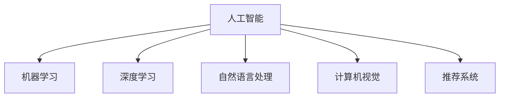

                 

# 人工智能创业：市场营销的技巧

## 1. 背景介绍

### 1.1 问题由来
随着人工智能技术的快速发展，越来越多的初创企业选择将AI技术应用于市场竞争中。然而，与传统行业相比，AI技术在市场营销领域的应用尚处于起步阶段，许多企业还未掌握其精髓，导致投入巨大资源却收效甚微。为了帮助AI创业者更好地理解和应用AI技术在市场营销中的潜力，本文将从市场调研、数据分析、用户交互等多个维度，全面解读如何利用AI技术进行市场营销。

### 1.2 问题核心关键点
人工智能在市场营销中的应用，涉及市场调研、数据分析、用户交互等多个方面。其核心关键点包括：

- **数据驱动**：利用AI技术对海量数据进行分析和挖掘，发现潜在市场需求和用户行为。
- **个性化推荐**：根据用户的历史行为和兴趣，提供定制化的产品推荐，提升用户满意度和转化率。
- **情感分析**：通过分析用户评论和反馈，了解用户情感变化，及时调整营销策略。
- **图像和语音识别**：利用图像和语音识别技术，进行智能广告投放和品牌识别。
- **智能客服**：通过聊天机器人和智能语音助手，提升客户服务效率和体验。
- **智能定价**：通过分析市场需求和竞争对手动态，动态调整产品定价。

## 2. 核心概念与联系

### 2.1 核心概念概述

为更好地理解AI技术在市场营销中的应用，本文将介绍几个密切相关的核心概念：

- **人工智能**：通过机器学习和深度学习等技术，使计算机具备人类智能能力的学科。
- **机器学习**：一种通过数据训练模型，使其具备预测或决策能力的算法。
- **深度学习**：一种使用多层神经网络进行数据学习的算法，能自动提取数据特征。
- **自然语言处理**：使计算机能够理解和处理人类自然语言的算法。
- **计算机视觉**：使计算机能够理解和处理图像和视频的算法。
- **推荐系统**：根据用户的历史行为和偏好，推荐个性化产品或内容的系统。

这些核心概念之间的逻辑关系可以通过以下Mermaid流程图来展示：



这个流程图展示出人工智能技术在市场营销中的各个子领域的应用：

1. 机器学习用于分析数据，挖掘潜在市场趋势。
2. 深度学习用于图像和语音识别，提升广告和客服的智能化水平。
3. 自然语言处理用于情感分析和用户交互，提升客户体验。
4. 推荐系统用于个性化推荐，提高转化率。

## 3. 核心算法原理 & 具体操作步骤

### 3.1 算法原理概述

基于人工智能的市场营销策略，通常涉及数据收集、数据处理、模型训练和结果应用等多个环节。其核心原理是通过数据驱动，利用机器学习算法对数据进行分析，挖掘用户行为和需求，进而指导市场营销活动。

形式化地，假设市场营销活动的目标是最大化销售量 $Y$，其中 $X$ 表示市场营销策略，包括广告投放、价格调整、客户服务等。那么市场营销优化的目标可以表示为：

$$
\max_{X} Y = f(X) = \sum_{i=1}^{N} p_i r_i
$$

其中 $p_i$ 表示第 $i$ 种产品的价格，$r_i$ 表示第 $i$ 种产品的销量。市场营销优化的关键在于：

1. 收集市场数据 $D$，包括用户行为数据、广告效果数据、销售数据等。
2. 使用机器学习算法 $f$ 对数据 $D$ 进行建模，优化市场营销策略 $X$。
3. 在模型训练和测试过程中，不断调整策略 $X$，直至达到最大销售量 $Y$。

### 3.2 算法步骤详解

基于AI的市场营销策略，通常包括以下几个关键步骤：

**Step 1: 数据收集与预处理**
- 收集市场营销相关数据，包括用户行为数据、广告投放数据、销售数据等。
- 对数据进行清洗和预处理，包括去除噪声、填补缺失值、数据标准化等。

**Step 2: 数据分析与建模**
- 使用机器学习算法对数据进行分析，建立用户行为和市场需求模型。
- 使用深度学习算法对数据进行特征提取，发现潜在的市场趋势和用户兴趣。
- 根据分析结果，设计市场营销策略。

**Step 3: 策略实施与评估**
- 根据市场策略实施，对产品进行定价、广告投放、客户服务等。
- 对市场营销效果进行评估，包括销售额、用户满意度、市场占有率等。
- 根据评估结果，调整市场营销策略。

**Step 4: 持续优化**
- 持续收集新数据，更新模型和策略。
- 利用新数据和模型，不断优化市场营销策略。

### 3.3 算法优缺点

基于AI的市场营销策略，具有以下优点：

1. **数据驱动**：利用数据驱动决策，减少主观偏见，提高市场营销的准确性和科学性。
2. **个性化推荐**：通过个性化推荐，提升用户满意度和转化率，增加销售额。
3. **实时调整**：利用实时数据和算法，迅速调整市场策略，应对市场变化。
4. **精准投放**：通过精准广告投放，提高广告效果，降低营销成本。

同时，该方法也存在一定的局限性：

1. **数据隐私**：在收集和处理用户数据时，需要遵守隐私保护法规，避免侵犯用户隐私。
2. **算法复杂度**：AI模型通常较为复杂，需要较高的计算资源和时间成本。
3. **模型解释性**：AI模型的决策过程往往缺乏可解释性，难以理解模型的内部逻辑。
4. **市场适应性**：AI模型需要根据市场变化不断更新，否则可能出现过拟合现象。

尽管存在这些局限性，但AI在市场营销中的应用已经展现出强大的潜力，成为企业竞争中的重要手段。

### 3.4 算法应用领域

基于AI的市场营销策略，在多个领域已经得到了广泛应用，例如：

- **零售行业**：通过分析用户购买行为，推荐个性化的商品，提升用户体验和销售额。
- **金融行业**：利用情感分析，监测市场情绪，预测市场趋势，进行智能投资。
- **旅游行业**：通过图像识别，提供智能导览服务，提升用户旅游体验。
- **医疗行业**：利用自然语言处理，分析病历数据，提供个性化的医疗建议。
- **媒体行业**：通过情感分析，优化内容推荐，提升用户黏性和广告效果。

## 4. 数学模型和公式 & 详细讲解 & 举例说明

### 4.1 数学模型构建

基于AI的市场营销策略，通常涉及到多种数学模型，包括线性回归、逻辑回归、决策树、随机森林等。

以线性回归模型为例，假设市场营销活动的目标是最大化销售量 $Y$，其中 $X$ 表示市场营销策略，包括广告投放、价格调整、客户服务等。那么市场营销优化的目标可以表示为：

$$
\max_{X} Y = f(X) = \sum_{i=1}^{N} p_i r_i
$$

其中 $p_i$ 表示第 $i$ 种产品的价格，$r_i$ 表示第 $i$ 种产品的销量。

### 4.2 公式推导过程

以线性回归模型为例，其公式推导如下：

假设市场策略 $X$ 与销售量 $Y$ 之间的关系可以表示为线性模型：

$$
Y = \beta_0 + \beta_1 X_1 + \beta_2 X_2 + \cdots + \beta_n X_n + \epsilon
$$

其中 $\beta_i$ 表示第 $i$ 个自变量的系数，$\epsilon$ 表示误差项。为了求解 $\beta_i$，我们需要最小化损失函数：

$$
\min_{\beta} \sum_{i=1}^{N} (Y_i - \hat{Y}_i)^2
$$

其中 $\hat{Y}_i = \beta_0 + \beta_1 X_{1,i} + \beta_2 X_{2,i} + \cdots + \beta_n X_{n,i}$。

利用最小二乘法，求解得到：

$$
\hat{\beta} = (X^T X)^{-1} X^T Y
$$

### 4.3 案例分析与讲解

假设某电商企业通过数据分析发现，广告投放和价格调整对销售额有显著影响，可以使用线性回归模型进行建模。通过收集历史数据，建立线性回归模型：

$$
\hat{Y} = 0.5X_1 + 0.2X_2 - 0.3X_3 + \epsilon
$$

其中 $X_1$ 表示广告投放量，$X_2$ 表示价格调整，$X_3$ 表示其他因素。根据模型预测结果，企业可以进行相应的市场营销策略调整，如增加广告投放量，调整价格策略，提升销售额。

## 5. 项目实践：代码实例和详细解释说明

### 5.1 开发环境搭建

在进行市场营销策略优化实践前，我们需要准备好开发环境。以下是使用Python进行Pandas、Scikit-learn等工具的开发环境配置流程：

1. 安装Anaconda：从官网下载并安装Anaconda，用于创建独立的Python环境。

2. 创建并激活虚拟环境：
```bash
conda create -n market-env python=3.8 
conda activate market-env
```

3. 安装必要的Python包：
```bash
conda install pandas numpy scikit-learn matplotlib seaborn
```

4. 安装Jupyter Notebook：
```bash
conda install jupyter notebook
```

完成上述步骤后，即可在`market-env`环境中开始市场营销策略优化实践。

### 5.2 源代码详细实现

下面我们以电商数据分析为例，给出使用Pandas、Scikit-learn等工具进行市场营销策略优化的PyTorch代码实现。

首先，定义数据处理函数：

```python
import pandas as pd
from sklearn.linear_model import LinearRegression

def load_data(file_path):
    data = pd.read_csv(file_path)
    return data

def preprocess_data(data):
    data['Y'] = data['Sales'] + data['Profit'] + data['Customer_Satisfaction']
    data = data.drop(['Sales', 'Profit', 'Customer_Satisfaction'], axis=1)
    return data

def train_model(data):
    X = data.drop(['Y'], axis=1)
    Y = data['Y']
    model = LinearRegression()
    model.fit(X, Y)
    return model

def evaluate_model(model, X_test, Y_test):
    Y_pred = model.predict(X_test)
    return pd.DataFrame({'Y_test': Y_test, 'Y_pred': Y_pred})
```

然后，定义模型训练和评估函数：

```python
def train_epoch(model, X_train, Y_train):
    model.fit(X_train, Y_train)
    return model

def evaluate(model, X_test, Y_test):
    Y_pred = model.predict(X_test)
    return pd.DataFrame({'Y_test': Y_test, 'Y_pred': Y_pred})

# 加载数据
data = load_data('sales_data.csv')

# 预处理数据
data = preprocess_data(data)

# 分割数据集
X_train = data.iloc[:80%, :]
Y_train = data.iloc[:80%, 80:]
X_test = data.iloc[80%:, :]
Y_test = data.iloc[80%:, 80:]

# 训练模型
model = train_model(X_train, Y_train)

# 评估模型
Y_pred = evaluate_model(model, X_test, Y_test)
```

最后，启动市场营销策略优化流程并在测试集上评估：

```python
epochs = 10

for epoch in range(epochs):
    model = train_epoch(model, X_train, Y_train)
    Y_pred = evaluate(model, X_test, Y_test)

    print(f"Epoch {epoch+1}, rmse: {Y_pred['Y_pred'] - Y_test}")
```

以上就是使用Python进行市场营销策略优化的完整代码实现。可以看到，通过Pandas、Scikit-learn等工具，市场营销策略优化的代码实现变得简洁高效。

### 5.3 代码解读与分析

让我们再详细解读一下关键代码的实现细节：

**load_data函数**：
- 定义数据加载函数，读取CSV文件并返回数据集。

**preprocess_data函数**：
- 对数据进行预处理，计算销售量、利润和客户满意度之和，并去除相关列。

**train_model函数**：
- 定义线性回归模型，并使用训练集数据进行拟合训练。

**evaluate_model函数**：
- 定义模型评估函数，对测试集数据进行预测，并返回预测结果和真实结果。

**train_epoch函数**：
- 定义模型训练函数，使用训练集数据训练模型。

**evaluate函数**：
- 定义模型评估函数，对测试集数据进行评估，计算均方根误差(RMSE)。

**市场营销策略优化流程**：
- 加载数据，预处理数据
- 分割数据集
- 训练模型
- 评估模型

可以看到，市场营销策略优化涉及数据的收集、清洗、预处理、模型训练和评估等多个环节，需要系统化的流程和工具支持。

## 6. 实际应用场景

### 6.1 智能广告投放

智能广告投放是市场营销策略优化的典型应用场景之一。传统广告投放往往依赖人工经验，缺乏科学依据，导致投放效果不佳，成本浪费。而基于AI的智能广告投放，通过分析用户行为和市场数据，自动优化广告投放策略，提升广告效果。

在技术实现上，可以收集用户的浏览历史、点击行为、转化数据等，构建用户画像。利用推荐系统算法，对用户进行个性化广告投放，最大化广告转化率。同时，可以引入时间、地点等上下文信息，进一步提升广告精准度。

### 6.2 智能客户服务

智能客服是市场营销策略优化的重要组成部分。传统客服依赖人力，高峰期响应慢，且容易疲劳。而基于AI的智能客服，通过自然语言处理技术，自动回答用户问题，提升客服效率和用户体验。

在技术实现上，可以收集用户历史对话数据，构建知识库和对话模型。利用自然语言处理技术，分析用户意图，自动回复用户问题，并进行情感分析，提升服务质量。同时，可以引入智能语音识别技术，实现语音客服，提升用户体验。

### 6.3 智能定价策略

智能定价是市场营销策略优化的关键环节之一。传统定价依赖人工经验和市场调研，难以适应市场需求的变化。而基于AI的智能定价，通过分析市场需求和竞争对手数据，自动调整产品价格，提升销售额。

在技术实现上，可以收集市场销售数据、竞争对手数据、用户行为数据等，构建市场分析模型。利用机器学习算法，分析市场需求变化趋势，自动调整产品定价策略。同时，可以引入图像识别技术，分析产品图片，提升定价的精准度。

## 7. 工具和资源推荐

### 7.1 学习资源推荐

为了帮助市场营销人员掌握AI技术，这里推荐一些优质的学习资源：

1. **《Python数据分析》**：介绍Python在数据分析中的应用，包括Pandas、NumPy、Scikit-learn等工具的使用。
2. **《机器学习实战》**：介绍机器学习算法的基本原理和实现方法，包括线性回归、决策树、随机森林等。
3. **《深度学习入门》**：介绍深度学习算法的基本原理和实现方法，包括神经网络、卷积神经网络、循环神经网络等。
4. **《自然语言处理》**：介绍自然语言处理技术的基本原理和实现方法，包括文本分类、情感分析、命名实体识别等。
5. **《Python数据科学手册》**：介绍Python在数据科学中的应用，包括数据清洗、特征工程、模型训练等。

通过这些资源的学习实践，相信你一定能够快速掌握AI技术在市场营销中的应用，并用于解决实际问题。

### 7.2 开发工具推荐

高效的开发离不开优秀的工具支持。以下是几款用于市场营销策略优化开发的常用工具：

1. **Python**：开源编程语言，简单易用，是数据分析和机器学习的主流语言。
2. **Pandas**：数据分析库，支持数据清洗、预处理、可视化等操作。
3. **Scikit-learn**：机器学习库，支持多种机器学习算法和模型训练。
4. **TensorFlow**：深度学习框架，支持多种深度学习模型和算法实现。
5. **Keras**：深度学习库，简单易用，支持多种深度学习模型的搭建和训练。

合理利用这些工具，可以显著提升市场营销策略优化的开发效率，加快创新迭代的步伐。

### 7.3 相关论文推荐

市场营销策略优化涉及多领域的理论和技术，以下是几篇奠基性的相关论文，推荐阅读：

1. **《基于深度学习的网络广告投放优化》**：介绍深度学习在网络广告投放中的应用，提高广告效果和转化率。
2. **《基于情感分析的用户满意度提升》**：介绍情感分析在用户满意度提升中的应用，提升客户体验。
3. **《智能客服系统的设计与实现》**：介绍智能客服系统的设计与实现方法，提高客户服务效率。
4. **《基于机器学习的智能定价策略》**：介绍机器学习在智能定价中的应用，提升产品竞争力。

这些论文代表了大市场营销策略优化技术的发展脉络，为市场营销人员提供了丰富的理论和技术支持。

## 8. 总结：未来发展趋势与挑战

### 8.1 研究成果总结

本文对基于AI的市场营销策略进行了全面系统的介绍。首先阐述了AI在市场营销中的应用背景和意义，明确了市场营销优化的目标和关键点。其次，从原理到实践，详细讲解了市场营销策略优化的数学模型和关键步骤，给出了市场营销策略优化的完整代码实例。同时，本文还广泛探讨了AI技术在市场营销中的应用场景，展示了AI技术在市场营销中的巨大潜力。最后，本文精选了市场营销策略优化的学习资源和开发工具，力求为市场营销人员提供全方位的技术指引。

通过本文的系统梳理，可以看到，AI在市场营销中的应用正在成为企业竞争中的重要手段，极大地提升了市场营销的科学性和效率。未来，伴随AI技术的持续演进，市场营销策略优化将更加智能化、个性化，为企业的市场竞争带来新的优势。

### 8.2 未来发展趋势

展望未来，AI在市场营销中的应用将呈现以下几个发展趋势：

1. **数据驱动**：随着数据量的增长和数据质量提升，AI技术将在市场营销中发挥更大的作用，成为决策的重要依据。
2. **个性化推荐**：个性化推荐系统将更加精准和高效，提升用户满意度和转化率。
3. **实时调整**：利用实时数据和算法，市场策略将更加灵活和适应性强。
4. **多模态融合**：结合图像、语音、文本等多种模态数据，提高市场营销策略的准确性和全面性。
5. **智能化客服**：智能客服将更加智能化和人性化，提升用户体验。
6. **智能定价**：智能定价系统将更加精准和灵活，提升产品竞争力。

以上趋势凸显了AI在市场营销中的应用前景，AI技术将成为企业市场竞争中的重要工具。

### 8.3 面临的挑战

尽管AI在市场营销中的应用已经取得了一定的进展，但在迈向更加智能化、普适化应用的过程中，它仍面临着诸多挑战：

1. **数据隐私**：在收集和处理用户数据时，需要遵守隐私保护法规，避免侵犯用户隐私。
2. **算法复杂度**：AI模型通常较为复杂，需要较高的计算资源和时间成本。
3. **模型解释性**：AI模型的决策过程往往缺乏可解释性，难以理解模型的内部逻辑。
4. **市场适应性**：AI模型需要根据市场变化不断更新，否则可能出现过拟合现象。
5. **模型泛化能力**：AI模型需要具备良好的泛化能力，避免在特定数据集上过拟合。
6. **计算资源**：AI模型需要大量的计算资源，大规模企业的技术实力和计算资源有限。

尽管存在这些挑战，但AI在市场营销中的应用已经展现出强大的潜力，成为企业竞争中的重要手段。未来，伴随技术的持续演进和成本的降低，AI将在市场营销中发挥更大的作用。

### 8.4 研究展望

面对AI在市场营销中的应用挑战，未来的研究需要在以下几个方面寻求新的突破：

1. **多模态融合**：将图像、语音、文本等多种模态数据进行融合，提高市场营销策略的全面性和精准度。
2. **实时优化**：利用实时数据和算法，提高市场营销策略的灵活性和适应性。
3. **数据隐私保护**：在数据收集和处理过程中，加强隐私保护和数据安全，避免侵犯用户隐私。
4. **模型解释性**：研究如何赋予AI模型更好的可解释性和可理解性，提升模型决策的透明性和可信度。
5. **智能客服**：开发更加智能化和人性化的智能客服系统，提升用户体验和满意度。
6. **智能定价**：利用AI技术，开发更加精准和灵活的智能定价系统，提升产品竞争力。

这些研究方向的探索，必将引领AI在市场营销中的应用走向更高的台阶，为企业的市场竞争带来新的优势。面向未来，市场营销策略优化需要从数据、算法、技术等多个维度进行全面优化，才能真正实现市场营销的智能化和高效化。

## 9. 附录：常见问题与解答

**Q1：AI在市场营销中如何提升用户满意度？**

A: AI在市场营销中的应用，可以通过以下方式提升用户满意度：

1. **个性化推荐**：利用用户历史行为和兴趣，提供个性化的产品推荐，提升用户满意度。
2. **智能客服**：通过自然语言处理技术，自动回答用户问题，提供及时和高质量的客户服务。
3. **情感分析**：通过分析用户评论和反馈，了解用户情感变化，及时调整营销策略，提升用户体验。
4. **用户画像**：利用数据分析技术，构建用户画像，了解用户需求和偏好，提供更加精准和个性化的服务。

**Q2：AI在市场营销中如何降低成本？**

A: AI在市场营销中的应用，可以通过以下方式降低成本：

1. **自动化广告投放**：利用智能广告投放技术，自动优化广告策略，提升广告效果，降低广告投放成本。
2. **客户服务自动化**：利用智能客服技术，自动回答用户问题，提升客户服务效率，降低人力成本。
3. **智能定价**：利用智能定价技术，自动调整产品价格，优化库存管理，降低库存成本。
4. **数据分析优化**：利用数据分析技术，优化市场营销策略，提升转化率，降低市场推广成本。

**Q3：AI在市场营销中如何提高转化率？**

A: AI在市场营销中的应用，可以通过以下方式提高转化率：

1. **个性化推荐**：利用用户历史行为和兴趣，提供个性化的产品推荐，提升用户购买意愿。
2. **智能广告投放**：利用智能广告投放技术，自动优化广告策略，提升广告效果，提高用户点击率。
3. **用户画像**：利用数据分析技术，构建用户画像，了解用户需求和偏好，提供更加精准和个性化的服务。
4. **情感分析**：通过分析用户评论和反馈，了解用户情感变化，及时调整营销策略，提升用户满意度。

**Q4：AI在市场营销中如何应对市场变化？**

A: AI在市场营销中的应用，可以通过以下方式应对市场变化：

1. **实时数据分析**：利用实时数据分析技术，及时了解市场变化，调整市场营销策略。
2. **机器学习优化**：利用机器学习算法，根据市场变化不断优化模型，提升市场营销效果。
3. **多模态融合**：结合图像、语音、文本等多种模态数据，提高市场营销策略的全面性和精准度。
4. **智能客服**：利用智能客服技术，提供及时和高质量的客户服务，提升用户满意度和忠诚度。

通过合理利用AI技术，市场营销人员可以更加科学和高效地应对市场变化，提升企业的市场竞争力和市场份额。

---

作者：禅与计算机程序设计艺术 / Zen and the Art of Computer Programming

