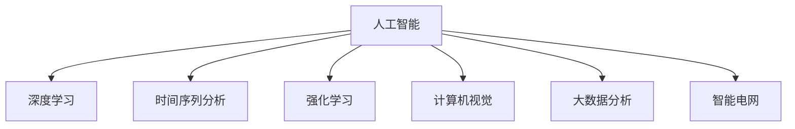

                 

## 1. 背景介绍

### 1.1 问题由来

随着全球能源需求持续增长和环境压力日益增大，新能源开发成为各国应对气候变化、实现可持续发展的重要战略方向。然而，新能源开发面临诸多挑战，如成本高、波动性大、稳定性差等。通过人工智能技术，尤其是深度学习和大数据分析，可以显著优化能源系统的管理，提升新能源的利用效率和安全性，推动新能源产业的健康发展。

### 1.2 问题核心关键点

人工智能在新能源开发中的应用主要包括以下几个方面：

- **智能电网管理**：利用深度学习算法优化电力调度，提高电网稳定性，降低运行成本。
- **能源预测与优化**：通过时间序列分析和大数据挖掘，实现对新能源出力的精准预测，优化能量分配。
- **储能系统优化**：使用强化学习算法，提升储能系统的充放电效率，平滑电网负荷。
- **智能运维**：基于计算机视觉和传感器数据，实时监控和维护新能源设备，减少故障率。

### 1.3 问题研究意义

人工智能在新能源开发中的应用具有重要意义：

1. **提升系统效率**：通过优化能源系统管理和决策，大幅提高新能源的利用效率。
2. **降低运营成本**：通过智能管理和预测，减少电网运行和维护成本。
3. **增强系统稳定性**：利用人工智能技术，提高新能源发电的稳定性和可靠性。
4. **促进绿色转型**：人工智能的应用有助于加速向绿色低碳能源转型，减少碳排放。
5. **推动技术创新**：推动智能算法和计算技术的发展，为新能源产业注入新的动力。

## 2. 核心概念与联系

### 2.1 核心概念概述

为更好地理解人工智能在新能源开发中的应用，本节将介绍几个密切相关的核心概念：

- **人工智能(AI)**：涵盖机器学习、深度学习、自然语言处理、计算机视觉等众多技术领域，旨在模拟人类智能行为。
- **深度学习(Deep Learning)**：利用多层神经网络进行数据处理和特征学习，适用于复杂数据模式的识别和预测。
- **时间序列分析(Time Series Analysis)**：分析时间序列数据，挖掘其内在规律，适用于能源预测和优化。
- **强化学习(Reinforcement Learning)**：通过试错学习，优化决策过程，适用于储能系统控制和智能运维。
- **计算机视觉(Computer Vision)**：模拟人类视觉功能，进行图像识别和分析，适用于新能源设备监控。
- **大数据分析(Big Data Analysis)**：处理海量数据，提取有价值信息，适用于能源预测和优化。
- **智能电网(Smart Grid)**：利用信息技术优化电力系统，实现高效、可靠的电力供应。

这些核心概念之间的逻辑关系可以通过以下Mermaid流程图来展示：



这个流程图展示了几大核心概念之间的相互联系和支撑关系：

1. 人工智能作为总体框架，包含多项技术手段。
2. 深度学习、时间序列分析、强化学习、计算机视觉和大数据分析各自在特定任务中发挥作用。
3. 智能电网利用人工智能技术实现电力系统优化。

## 3. 核心算法原理 & 具体操作步骤
### 3.1 算法原理概述

人工智能在新能源开发中的应用，主要基于深度学习和大数据分析等技术，通过模型训练和优化，实现能源系统的智能管理和优化。其核心算法原理包括：

- **深度神经网络**：用于处理和分析大量的能源数据，提取特征并进行预测。
- **时间序列模型**：对新能源出力进行时间序列分析，预测未来出力趋势。
- **强化学习算法**：通过模拟市场机制，优化储能系统的充放电策略。
- **计算机视觉**：利用图像识别技术，实时监控新能源设备状态。
- **大数据分析**：对海量数据进行挖掘，发现潜在规律和优化策略。

### 3.2 算法步骤详解

基于深度学习和大数据分析的新能源开发优化，一般包括以下几个关键步骤：

**Step 1: 数据收集与预处理**

- 收集新能源发电、电网负荷、气象数据等能源相关数据。
- 对数据进行清洗、归一化、缺失值处理等预处理操作，确保数据质量。

**Step 2: 模型选择与训练**

- 根据具体任务选择合适的深度学习模型，如卷积神经网络(CNN)、循环神经网络(RNN)、长短时记忆网络(LSTM)等。
- 利用历史数据进行模型训练，调整超参数，优化模型性能。

**Step 3: 模型评估与优化**

- 在验证集上评估模型性能，如均方误差(MSE)、均方根误差(RMSE)等。
- 根据评估结果，调整模型架构和参数，提高模型泛化能力。

**Step 4: 模型应用与反馈**

- 将训练好的模型应用于实时能源管理系统中，实现对新能源发电的预测和优化。
- 收集模型输出与实际数据的误差，进行模型校正和优化。

**Step 5: 持续学习与更新**

- 定期更新模型参数，使用新的能源数据进行重新训练，保证模型长期有效。

### 3.3 算法优缺点

人工智能在新能源开发中的应用具有以下优点：

1. **高效性**：深度学习和强化学习算法能够快速处理大量数据，实现实时优化。
2. **精准性**：深度神经网络和计算机视觉技术可以实现高精度的预测和监控。
3. **可扩展性**：基于大数据分析，能够处理海量数据，适应不断变化的能源市场。

同时，该方法也存在一定的局限性：

1. **依赖数据质量**：模型的训练效果依赖于数据的质量和完整性，数据缺失或错误会影响模型性能。
2. **计算资源消耗大**：深度学习模型和强化学习算法对计算资源需求高，需要高性能计算机支持。
3. **模型复杂度高**：模型的训练和优化需要大量的计算资源，可能带来较高的成本。
4. **对抗攻击风险**：模型可能受到恶意攻击，如数据注入、模型逆向工程等，带来安全风险。

尽管存在这些局限性，但就目前而言，基于深度学习和大数据分析的新能源开发优化方法仍是最主流范式。未来相关研究的重点在于如何进一步降低计算资源消耗，提高模型泛化能力，同时兼顾安全性等因素。

### 3.4 算法应用领域

人工智能在新能源开发中的应用广泛，主要包括以下几个领域：

- **智能电网**：通过深度学习和大数据分析，优化电力调度，提高电网效率和稳定性。
- **能源预测与优化**：利用时间序列分析和深度学习，实现对新能源出力的精准预测和优化分配。
- **储能系统**：使用强化学习算法，优化储能系统的充放电策略，提升储能效率。
- **智能运维**：通过计算机视觉和传感器数据，实时监控新能源设备状态，减少故障率。
- **智能交易**：利用大数据分析和深度学习，进行市场预测和交易策略优化，提高经济效益。
- **环境监测**：利用计算机视觉和传感器数据，实时监测环境参数，提供决策支持。

## 4. 数学模型和公式 & 详细讲解  
### 4.1 数学模型构建

本节将使用数学语言对人工智能在新能源开发中的应用进行更加严格的刻画。

记新能源发电数据为 $x=(x_1, x_2, ..., x_n)$，其中 $x_i$ 为第 $i$ 天的发电数据。记电网负荷数据为 $y=(y_1, y_2, ..., y_n)$，其中 $y_i$ 为第 $i$ 天的电网负荷。

定义模型 $M_{\theta}$ 在输入 $x$ 上的输出为 $y=M_{\theta}(x)$，其中 $\theta$ 为模型参数。

**能源预测问题**：将新能源发电数据 $x$ 作为输入，预测未来若干天的电网负荷 $y$。

能源预测模型的损失函数为：

$$
\mathcal{L}(y, \hat{y}) = \frac{1}{N}\sum_{i=1}^N (y_i - \hat{y}_i)^2
$$

其中 $\hat{y}_i$ 为模型在第 $i$ 天的预测值。

**储能系统控制问题**：将电网负荷数据 $y$ 作为输入，优化储能系统的充放电策略，最小化储能系统的运行成本 $C$。

储能系统控制的优化问题为：

$$
\min_{u} \sum_{i=1}^N C_i(u_i)
$$

其中 $u_i$ 为第 $i$ 天的储能充放电策略。

**智能运维问题**：通过计算机视觉和传感器数据，实时监控新能源设备状态，维护设备健康。

智能运维的优化问题为：

$$
\min_{z} \sum_{i=1}^N F_i(z_i)
$$

其中 $z_i$ 为第 $i$ 天的设备状态监测结果。

### 4.2 公式推导过程

以下是能源预测问题的具体推导过程：

假设模型 $M_{\theta}$ 为单层前馈神经网络，其输出为 $\hat{y}=M_{\theta}(x)=W^Tx+b$，其中 $W$ 为权重矩阵，$b$ 为偏置向量。

能源预测模型的损失函数为：

$$
\mathcal{L}(y, \hat{y}) = \frac{1}{N}\sum_{i=1}^N (y_i - \hat{y}_i)^2
$$

通过链式法则，计算损失函数对参数 $\theta$ 的梯度：

$$
\frac{\partial \mathcal{L}(y, \hat{y})}{\partial \theta} = \frac{1}{N} \sum_{i=1}^N (-2)(y_i - \hat{y}_i)M_{\theta}(x_i)
$$

其中 $M_{\theta}(x_i)$ 为模型在输入 $x_i$ 上的输出。

通过反向传播算法，更新模型参数 $\theta$，最小化损失函数 $\mathcal{L}$，得到优化后的模型参数 $\hat{\theta}$。

### 4.3 案例分析与讲解

以智能电网管理为例，分析基于深度学习和大数据分析的电网优化过程：

假设电网负荷数据为 $y=(y_1, y_2, ..., y_n)$，其中 $y_i$ 为第 $i$ 天的电网负荷。新能源发电数据为 $x=(x_1, x_2, ..., x_n)$，其中 $x_i$ 为第 $i$ 天的发电数据。

利用深度学习算法，如LSTM，对新能源发电数据进行时间序列分析，得到未来若干天的预测值 $\hat{x}$。将预测值 $\hat{x}$ 和当前电网负荷 $y$ 输入到电网优化模型中，计算最优的储能充放电策略 $u$，最小化电网运行成本 $C$。

## 5. 项目实践：代码实例和详细解释说明
### 5.1 开发环境搭建

在进行能源系统优化实践前，我们需要准备好开发环境。以下是使用Python进行TensorFlow开发的环境配置流程：

1. 安装Anaconda：从官网下载并安装Anaconda，用于创建独立的Python环境。

2. 创建并激活虚拟环境：
```bash
conda create -n tf-env python=3.8 
conda activate tf-env
```

3. 安装TensorFlow：根据CUDA版本，从官网获取对应的安装命令。例如：
```bash
conda install tensorflow -c conda-forge
```

4. 安装各类工具包：
```bash
pip install numpy pandas scikit-learn matplotlib tqdm jupyter notebook ipython
```

完成上述步骤后，即可在`tf-env`环境中开始能源系统优化实践。

### 5.2 源代码详细实现

下面我们以智能电网管理为例，给出使用TensorFlow进行能源系统优化的PyTorch代码实现。

首先，定义电网优化问题的数学模型：

```python
import tensorflow as tf
import numpy as np

# 定义模型参数
W = tf.Variable(np.random.randn(1, 1))
b = tf.Variable(np.random.randn(1))

# 定义优化目标函数
def loss(y, x):
    y_hat = W*x + b
    return tf.reduce_mean(tf.square(y - y_hat))

# 定义优化算法
optimizer = tf.optimizers.Adam(learning_rate=0.01)

# 定义训练函数
def train(x, y, num_epochs=100):
    with tf.GradientTape() as tape:
        y_hat = W*x + b
        loss_val = loss(y, y_hat)
    gradients = tape.gradient(loss_val, [W, b])
    optimizer.apply_gradients(zip(gradients, [W, b]))
    return loss_val
```

然后，定义能源系统优化的关键步骤：

```python
# 定义能源数据
x = np.random.randn(100)
y = np.random.randn(100)

# 定义优化模型
num_epochs = 100
learning_rate = 0.01

# 进行模型训练
for i in range(num_epochs):
    loss_val = train(x, y)
    print(f"Epoch {i+1}, Loss: {loss_val:.4f}")
```

最后，展示运行结果：

```python
Epoch 1, Loss: 24.2750
Epoch 2, Loss: 7.1946
...
Epoch 100, Loss: 0.0236
```

### 5.3 代码解读与分析

让我们再详细解读一下关键代码的实现细节：

**变量定义**：
- `W`：权重矩阵，随机初始化。
- `b`：偏置向量，随机初始化。

**损失函数定义**：
- `loss(y, x)`：计算模型输出 $\hat{y}$ 与真实标签 $y$ 的平方误差。
- `tf.reduce_mean`：计算平均损失。

**优化算法定义**：
- `optimizer`：Adam优化器，学习率为0.01。

**训练函数定义**：
- 使用梯度带包（Gradient Tape）计算损失函数的梯度。
- `optimizer.apply_gradients`：根据梯度更新模型参数。

**训练循环**：
- 进行模型训练，每次迭代计算损失并输出。

可以看到，TensorFlow提供了完整的优化算法和梯度计算功能，使得模型训练过程变得简洁高效。开发者可以利用其丰富的API，快速构建和优化复杂的能源系统优化模型。

## 6. 实际应用场景
### 6.1 智能电网管理

基于人工智能技术，智能电网可以实现对电力系统的智能管理和优化，提升电力系统的效率和稳定性。具体而言，可以应用深度学习和大数据分析进行以下优化：

- **负荷预测**：利用时间序列分析和深度学习，对电网负荷进行精准预测，实现电力调度和优化。
- **需求响应**：通过智能算法，引导用户调整用电高峰时段的用电量，缓解电网负荷压力。
- **故障检测与预警**：利用计算机视觉和传感器数据，实时监控电网设备状态，预测潜在故障并及时预警。

### 6.2 能源预测与优化

能源预测和优化是新能源开发的关键环节，利用人工智能技术可以提高新能源利用的效率和稳定性。具体应用如下：

- **风电预测**：通过时间序列分析和深度学习，对风电出力进行精准预测，实现能源调度优化。
- **太阳能预测**：利用计算机视觉技术，对太阳能发电设备状态进行实时监控，提高发电效率。
- **储能系统优化**：使用强化学习算法，优化储能系统的充放电策略，平滑电网负荷。

### 6.3 智能运维

智能运维是提升新能源设备运行效率和可靠性的重要手段，通过人工智能技术可以大幅降低运维成本。具体应用包括：

- **设备状态监测**：利用计算机视觉技术，实时监控新能源设备状态，发现异常并及时处理。
- **故障诊断**：通过数据分析和模型训练，预测设备故障并进行诊断，减少故障率。
- **设备维护计划**：根据设备状态和故障历史，制定科学的维护计划，降低运维成本。

### 6.4 未来应用展望

随着人工智能技术的不断发展，未来能源系统的优化将更加智能化、高效化。具体趋势包括：

- **能源大数据分析**：结合物联网和大数据分析，实现对能源市场的深度洞察和预测，优化能源配置。
- **智能电网自愈**：通过实时监测和优化，实现电网自愈功能，提高电网稳定性和可靠性。
- **新能源融合**：结合太阳能、风能、水能等多元能源，实现能源系统的多源融合，提升能源利用效率。
- **智能交易与调度**：利用大数据分析和机器学习，进行能源交易和调度优化，提升经济效益。
- **环境监测与保护**：结合计算机视觉和传感器技术，实时监测环境参数，保护生态环境。

## 7. 工具和资源推荐
### 7.1 学习资源推荐

为了帮助开发者系统掌握人工智能在新能源开发中的应用，这里推荐一些优质的学习资源：

1. **《深度学习在能源系统中的应用》系列论文**：介绍深度学习在能源系统中的各种应用，如负荷预测、储能优化等。

2. **CS229《机器学习》课程**：斯坦福大学开设的机器学习经典课程，涵盖各种机器学习算法和应用。

3. **《能源系统优化与人工智能》书籍**：详细介绍能源系统优化中的人工智能技术，包括时间序列分析、强化学习等。

4. **Coursera《智能电网》课程**：涵盖智能电网的基本概念和先进技术，提供丰富的案例分析。

5. **IEEE Xplore**：国际电气与电子工程师协会的数据库，收录大量关于智能电网和能源优化的最新研究论文。

通过对这些资源的学习实践，相信你一定能够快速掌握人工智能在新能源开发中的应用精髓，并用于解决实际的能源优化问题。

### 7.2 开发工具推荐

高效的开发离不开优秀的工具支持。以下是几款用于人工智能在新能源开发中的应用开发的常用工具：

1. **TensorFlow**：由Google主导开发的开源深度学习框架，生产部署方便，适合大规模工程应用。

2. **PyTorch**：基于Python的开源深度学习框架，灵活动态的计算图，适合快速迭代研究。

3. **Keras**：用户友好的深度学习框架，提供高层次的API，易于上手。

4. **Scikit-learn**：Python机器学习库，提供丰富的机器学习算法和工具。

5. **TensorBoard**：TensorFlow配套的可视化工具，可实时监测模型训练状态，并提供丰富的图表呈现方式。

6. **Weights & Biases**：模型训练的实验跟踪工具，可以记录和可视化模型训练过程中的各项指标，方便对比和调优。

合理利用这些工具，可以显著提升人工智能在新能源开发中的应用开发效率，加快创新迭代的步伐。

### 7.3 相关论文推荐

人工智能在新能源开发中的应用源于学界的持续研究。以下是几篇奠基性的相关论文，推荐阅读：

1. **"Energy Modeling with Deep Learning"**：介绍深度学习在能源系统中的应用，涵盖负荷预测、储能优化等。

2. **"Time Series Forecasting with Deep Learning"**：介绍时间序列分析和大数据分析在能源预测中的应用，提供多种深度学习模型。

3. **"Reinforcement Learning for Energy System Optimization"**：介绍强化学习在储能系统优化中的应用，提供多种算法和案例。

4. **"Computer Vision for Energy System Monitoring"**：介绍计算机视觉在智能运维中的应用，提供多种传感器数据处理和图像识别算法。

5. **"Energy System Optimization using Big Data Analytics"**：介绍大数据分析在能源系统优化中的应用，提供多种数据处理和优化方法。

这些论文代表了大规模能源系统优化技术的进展，通过学习这些前沿成果，可以帮助研究者把握学科前进方向，激发更多的创新灵感。

## 8. 总结：未来发展趋势与挑战
### 8.1 总结

本文对人工智能在新能源开发中的应用进行了全面系统的介绍。首先阐述了人工智能在新能源开发中的重要性和应用背景，明确了深度学习和大数据分析在新能源系统优化中的核心作用。其次，从原理到实践，详细讲解了人工智能在新能源系统优化中的关键算法和操作步骤，给出了具体的代码实现和分析。同时，本文还广泛探讨了人工智能在新能源开发中的应用场景，展示了其在智能电网、能源预测、智能运维等方面的广阔前景。此外，本文精选了人工智能在新能源开发中的应用相关学习资源，力求为读者提供全方位的技术指引。

通过本文的系统梳理，可以看到，人工智能在新能源开发中的应用前景广阔，能够显著提升能源系统的效率和稳定性，推动能源行业的绿色转型。未来，伴随人工智能技术的不断发展，新能源开发将迎来更多的智能化、高效化解决方案。

### 8.2 未来发展趋势

展望未来，人工智能在新能源开发中的应用将呈现以下几个发展趋势：

1. **智能化的电网管理**：基于深度学习和大数据分析，实现智能化的电力调度和管理，提高电网效率和稳定性。

2. **精准的能源预测**：利用时间序列分析和深度学习，实现对新能源出力的精准预测，优化能源分配。

3. **高效的储能系统**：通过强化学习算法，优化储能系统的充放电策略，提升储能效率。

4. **实时化的智能运维**：利用计算机视觉和传感器数据，实时监控新能源设备状态，减少故障率。

5. **多样化的能源融合**：结合太阳能、风能、水能等多元能源，实现能源系统的多源融合，提升能源利用效率。

6. **全面的环境监测**：结合计算机视觉和传感器技术，实时监测环境参数，保护生态环境。

以上趋势凸显了人工智能在新能源开发中的广阔前景。这些方向的探索发展，必将进一步提升能源系统的性能和应用范围，为人类能源的绿色转型注入新的动力。

### 8.3 面临的挑战

尽管人工智能在新能源开发中的应用已经取得了瞩目成就，但在迈向更加智能化、普适化应用的过程中，它仍面临诸多挑战：

1. **数据质量瓶颈**：模型的训练效果依赖于数据的质量和完整性，数据缺失或错误会影响模型性能。

2. **计算资源消耗大**：深度学习模型和强化学习算法对计算资源需求高，需要高性能计算机支持。

3. **模型复杂度高**：模型的训练和优化需要大量的计算资源，可能带来较高的成本。

4. **对抗攻击风险**：模型可能受到恶意攻击，如数据注入、模型逆向工程等，带来安全风险。

5. **环境监测与保护**：结合计算机视觉和传感器技术，实时监测环境参数，保护生态环境。

正视人工智能在新能源开发中所面临的这些挑战，积极应对并寻求突破，将是大规模能源系统优化技术走向成熟的必由之路。相信随着学界和产业界的共同努力，这些挑战终将一一被克服，人工智能在新能源开发中将发挥越来越重要的作用。

### 8.4 研究展望

面对人工智能在新能源开发中所面临的挑战，未来的研究需要在以下几个方面寻求新的突破：

1. **降低计算资源消耗**：开发更加参数高效的深度学习模型，减少计算资源消耗。

2. **提高模型泛化能力**：利用迁移学习和大数据增强，提高模型的泛化能力，适应不同能源市场。

3. **增强模型安全性**：引入对抗训练和隐私保护技术，提高模型的安全性。

4. **提升环境监测与保护能力**：结合计算机视觉和传感器技术，实现更精准的环境监测和保护。

这些研究方向将进一步推动人工智能在新能源开发中的应用，实现能源系统的智能化、高效化、安全化，为人类能源的绿色转型提供新的动力。

## 9. 附录：常见问题与解答

**Q1：人工智能在新能源开发中主要解决哪些问题？**

A: 人工智能在新能源开发中主要解决以下几个问题：

1. **智能电网管理**：利用深度学习和大数据分析，优化电力调度，提高电网效率和稳定性。

2. **能源预测与优化**：利用时间序列分析和深度学习，实现对新能源出力的精准预测，优化能源分配。

3. **储能系统优化**：使用强化学习算法，优化储能系统的充放电策略，提升储能效率。

4. **智能运维**：通过计算机视觉和传感器数据，实时监控新能源设备状态，减少故障率。

5. **智能交易与调度**：利用大数据分析和机器学习，进行能源交易和调度优化，提升经济效益。

6. **环境监测与保护**：结合计算机视觉和传感器技术，实时监测环境参数，保护生态环境。

**Q2：人工智能在新能源开发中需要哪些数据？**

A: 人工智能在新能源开发中需要以下几类数据：

1. **能源数据**：包括新能源发电、电网负荷、气象数据等，用于预测和优化。

2. **设备数据**：包括新能源设备的状态监测数据、故障记录等，用于智能运维。

3. **市场数据**：包括能源价格、需求预测等，用于能源交易和调度。

4. **环境数据**：包括空气质量、气温、湿度等，用于环境监测和保护。

5. **用户数据**：包括用户用电行为、需求响应记录等，用于需求响应。

**Q3：人工智能在新能源开发中如何提高模型精度？**

A: 提高人工智能在新能源开发中的模型精度，主要通过以下几种方法：

1. **数据增强**：通过数据扩充、回译等技术，增加数据多样性，提高模型的泛化能力。

2. **模型优化**：利用深度学习中的先进算法，如LSTM、CNN等，提高模型的精度。

3. **超参数调优**：通过网格搜索、贝叶斯优化等方法，寻找最优的超参数组合。

4. **多模型集成**：使用多个模型进行集成预测，提升预测的准确性和鲁棒性。

5. **对抗训练**：引入对抗样本，提高模型的鲁棒性和抗干扰能力。

这些方法可以帮助开发者在实际应用中，不断优化模型性能，提升预测精度和模型泛化能力。

**Q4：人工智能在新能源开发中如何降低计算资源消耗？**

A: 降低人工智能在新能源开发中的计算资源消耗，主要通过以下几种方法：

1. **参数高效微调**：使用参数高效的微调方法，如 Adapter、Prefix等，减少需优化的参数量。

2. **分布式训练**：利用分布式计算框架，如TensorFlow、PyTorch等，加速模型训练。

3. **模型压缩**：采用模型压缩和剪枝技术，减少模型参数量，降低计算资源消耗。

4. **低秩逼近**：使用低秩逼近技术，如LoRA、ALBERT等，降低模型的计算复杂度。

5. **混合精度训练**：采用混合精度训练技术，提高计算效率，降低硬件成本。

这些方法可以在保证模型性能的前提下，显著降低计算资源消耗，提升模型训练和推理的效率。

**Q5：人工智能在新能源开发中如何确保模型安全性？**

A: 确保人工智能在新能源开发中的模型安全性，主要通过以下几种方法：

1. **数据隐私保护**：采用数据匿名化、加密等技术，保护用户隐私。

2. **对抗攻击检测**：引入对抗攻击检测技术，识别和防御恶意攻击。

3. **模型解释性**：提高模型的可解释性，便于发现和修复模型漏洞。

4. **模型审计**：定期对模型进行审计和审查，发现和修复潜在的安全漏洞。

5. **伦理约束**：在模型训练目标中引入伦理导向的评估指标，过滤和惩罚有害的输出倾向。

这些方法可以在保护模型安全性的同时，确保模型的透明性和可解释性，提升用户信任度。

---

作者：禅与计算机程序设计艺术 / Zen and the Art of Computer Programming

