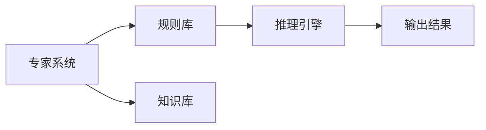

                 

# 人工智能领域的早期探索

人工智能（AI）作为21世纪最具革命性的技术之一，其发展历程历经数十年，跨越了早期的象征性人工智能、知识工程、到机器学习、深度学习、以及当前的热点：大模型和大语言模型。本文将回顾人工智能的发展历程，揭示早期探索背后的思想和原理，探讨不同阶段技术的成就与局限，为人工智能的未来发展提供洞见。

## 1. 背景介绍

### 1.1 人工智能的起源

人工智能的起源可以追溯到20世纪中叶。1950年，Alan Turing在《计算机器与智能》一文中提出，若计算机能展现出智能行为，则可视为实现了人工智能。这个定义催生了后续几代的研究方向。

1956年，“人工智能”一词首次出现于达特茅斯会议，标志着AI作为一个正式研究领域的诞生。这次会议汇集了包括John McCarthy、Marvin Minsky在内的数十位世界顶尖计算机科学家，为AI的发展奠定基础。

### 1.2 早期研究热点

早期AI研究集中在解决特定问题，如自动证明、游戏AI、语音识别等。这些应用问题的解决往往依赖于符号逻辑和规则系统。例如，1966年，Shakey机器人在麻省理工学院首次成功执行了导航任务。

1967年，Edward Feigenbaum和Cliff Shaw开发了DENDRAL，一个用于有机化学的专家系统，展示了知识工程方法在实际应用中的潜力。

## 2. 核心概念与联系

### 2.1 核心概念概述

- **专家系统**：一种基于规则的推理系统，通过存储专家知识，解决特定领域问题。
- **符号推理**：使用符号逻辑表达问题，并根据预定义的规则进行推理。
- **知识表示**：如何形式化地表示和存储知识，以便于推理和处理。

这些早期概念为后续的AI发展奠定了基础。

### 2.2 核心概念原理和架构的 Mermaid 流程图



此流程图展示了专家系统的基本架构：通过规则库和知识库，由推理引擎执行推理，最终输出结果。

## 3. 核心算法原理 & 具体操作步骤

### 3.1 算法原理概述

早期AI研究主要集中在符号推理和专家系统上。以下是对这两个核心的算法原理概述：

- **符号推理**：使用符号逻辑进行问题表达和推理。常见的符号推理算法包括Prolog和Expert。

- **专家系统**：基于规则的推理系统。专家系统由知识库、规则库和推理引擎三部分组成。知识库存储专家知识，规则库定义推理规则，推理引擎根据规则库执行推理。

### 3.2 算法步骤详解

**专家系统**：

1. **知识获取**：专家系统的构建需通过与领域专家的交流，获取专家知识，并整理成可用的形式存储在知识库中。
2. **知识表示**：将知识库中的知识用符号逻辑语言表达，形成知识表示框架。
3. **规则定义**：专家系统的核心在于规则库，规则定义了知识库中的知识如何用于推理。
4. **推理引擎**：根据规则库和知识库，推理引擎执行推理，得到输出结果。

**符号推理**：

1. **问题表达**：将问题形式化地表达为符号逻辑公式。
2. **知识库查询**：在知识库中查找与问题相关的规则。
3. **推理计算**：使用规则库中的规则，对知识库进行推理计算。
4. **输出结果**：得到推理结果，解决原始问题。

### 3.3 算法优缺点

**专家系统**：

优点：
- 适用于具有明确知识表示的问题。
- 能够处理基于规则的推理问题，推理过程可解释性强。

缺点：
- 知识库和规则库的构建依赖专家，难度大。
- 难以处理复杂的现实问题，缺乏灵活性。

**符号推理**：

优点：
- 逻辑清晰，推理过程可解释性强。
- 适用于符号逻辑可表达的问题。

缺点：
- 需要复杂的形式化知识表示，构建难度大。
- 难以处理非结构化数据。

### 3.4 算法应用领域

**专家系统**：
- 医疗诊断：存储和推理医学知识，辅助医生诊断。
- 财务分析：基于历史数据和规则，进行财务预测和分析。
- 制造业：利用规则和知识，进行质量控制和生产调度。

**符号推理**：
- 自动定理证明：利用符号逻辑，自动证明数学定理。
- 自然语言处理：使用符号逻辑处理自然语言查询，如LISP。
- 人工智能游戏：基于符号逻辑，解决棋类游戏问题。

## 4. 数学模型和公式 & 详细讲解 & 举例说明

### 4.1 数学模型构建

在早期的AI研究中，数学模型主要集中在符号逻辑和专家系统的知识表示上。符号逻辑是一种形式化的表达方式，用于精确描述知识和推理规则。

知识表示形式化方法包括Prolog语言和谓词演算。在Prolog中，知识以事实和规则的形式存储，推理引擎根据规则执行推理。

### 4.2 公式推导过程

在Prolog中，知识表示为事实和规则：

- 事实：代表已知真值的事实，例如`man(mike)`表示“Mike是一个人”。
- 规则：表示推理过程，例如`parent(john, mike)`表示“John是Mike的父亲”。

推理引擎通过规则对事实进行推理，求解问题。例如，输入`?- parent(john, mike).`，输出`true`，表示“John是Mike的父亲”。

### 4.3 案例分析与讲解

**案例1：天气预测**

在气象学中，预测天气需要考虑多种因素，如气压、湿度、风速等。专家系统可以通过存储和推理气象知识，进行天气预测。例如，可以定义以下规则：

- `rain(R) <=> hum > 60` 表示“雨R，当湿度大于60%”。
- `sunny(R) <=> wind > 10` 表示“晴天R，当风速大于10 m/s”。

通过推理引擎，根据当前的气压、湿度等数据，可以推理出天气预测结果。

## 5. 项目实践：代码实例和详细解释说明

### 5.1 开发环境搭建

为了实现专家系统和符号推理系统，我们需要安装Prolog编程语言和相应的开发环境。

1. **安装Prolog**：下载并安装Prolog解释器，如SWI-Prolog。
2. **开发环境**：配置开发环境，包括IDE、调试工具等。

### 5.2 源代码详细实现

以下是一个简单的Prolog程序，用于推理“是否为鸡”的问题：

```prolog
% 定义事实
animal(jimmy, dog).
animal(joe, chicken).

% 定义规则
chicken(J) <=> has_four_legs(J) ; has_feathers(J).

% 推理
?- chicken(Jimmy).
```

解释：
- `animal(jimmy, dog)`表示“Jimmy是一只狗”。
- `animal(joe, chicken)`表示“Joe是一只鸡”。
- `chicken(J) <=> has_four_legs(J) ; has_feathers(J)`表示“J是一只鸡当且仅当J有四条腿或J有羽毛”。

通过运行程序，可以得到输出`true`，表示“Joe是一只鸡”。

### 5.3 代码解读与分析

代码中的事实和规则是基于Prolog语言定义的。事实代表已知的事实，规则定义了推理过程。

在Prolog中，规则使用`<=>`表示等价关系，`;`表示选择。推理引擎根据规则对已知事实进行推理，得到输出结果。

### 5.4 运行结果展示

运行上述代码，输出为`true`，表示推理成功，“Joe是一只鸡”。

## 6. 实际应用场景

### 6.1 医疗诊断

早期AI在医疗诊断中得到了广泛应用。例如，MYCIN系统通过专家系统存储医学知识，辅助医生诊断和治疗。MYCIN系统包含知识库和推理引擎，医生通过输入症状，系统自动生成诊断结果。

### 6.2 自然语言处理

自然语言处理是早期AI的重要应用领域。例如，Cyc是一个庞大的知识库，包含超过一百万条规则和事实，用于回答自然语言问题。Cyc系统基于符号逻辑，能够理解自然语言，并解答特定领域问题。

## 7. 工具和资源推荐

### 7.1 学习资源推荐

- **书籍**：《人工智能：一种现代方法》（Artificial Intelligence: A Modern Approach）是AI领域的经典教材，详细介绍了早期AI的研究方法和应用案例。
- **课程**：MIT的6.S069课程，介绍了专家系统、符号推理等基础知识。
- **网站**：AI和符号逻辑的维基百科，提供全面的知识库和参考资料。

### 7.2 开发工具推荐

- **IDE**：Prolog IDE，如Cyc Studio，支持调试和代码编写。
- **调试工具**：Prolog的调试器，如SWI-Prolog的调试器，支持断点和代码跟踪。

### 7.3 相关论文推荐

- **知识表示**：Richard M. Shoham的《知识表示与推理》（Knowledge Representation and Reasoning），详细介绍了知识表示的基本方法和应用。
- **专家系统**：Brent Hayes的《专家系统与知识工程》（Expert Systems and Knowledge Engineering），介绍了专家系统的设计和实现。

## 8. 总结：未来发展趋势与挑战

### 8.1 研究成果总结

早期的AI研究在知识表示、符号推理和专家系统方面取得了显著成果，推动了AI技术的初步发展。这些技术为后续的机器学习、深度学习等技术奠定了基础。

### 8.2 未来发展趋势

- **机器学习和深度学习**：后续的AI研究集中在机器学习和深度学习上。这些技术通过数据驱动的方式，提升了AI系统的性能和应用范围。
- **自然语言处理**：基于深度学习的NLP技术在翻译、问答、文本生成等任务上取得了突破。
- **计算机视觉**：基于深度学习的CV技术在图像分类、物体检测、生成对抗网络（GAN）等方面取得了巨大进展。
- **强化学习**：基于强化学习的AI系统能够自主学习和优化，应用于游戏AI、机器人控制等领域。

### 8.3 面临的挑战

- **可解释性**：深度学习模型的黑盒特性，难以解释决策过程，成为AI系统面临的一大挑战。
- **数据依赖**：深度学习模型需要大量标注数据，获取和处理数据成为技术瓶颈。
- **鲁棒性和泛化性**：模型在特定领域数据上的表现往往不如专家系统。
- **计算资源**：深度学习模型对计算资源要求高，难以在低计算能力的环境中部署。

### 8.4 研究展望

未来AI研究需要关注以下几个方向：

- **可解释性**：开发可解释性强的AI模型，如符号逻辑与深度学习的结合，增强模型的透明度和可解释性。
- **跨领域迁移**：研究跨领域迁移学习，增强模型在不同领域上的泛化能力。
- **对抗学习**：研究对抗学习和鲁棒性优化，增强模型的鲁棒性和泛化性。
- **知识图谱**：利用知识图谱，增强模型对领域知识的理解和推理。

## 9. 附录：常见问题与解答

**Q1：早期AI与现代AI的区别是什么？**

A: 早期AI主要依赖规则和知识库进行推理和决策，适用于具有明确规则和知识表示的问题。现代AI则主要依赖数据驱动的机器学习和深度学习技术，能够自动学习特征，处理复杂现实问题。

**Q2：为什么早期AI难以处理复杂现实问题？**

A: 早期AI依赖符号逻辑和专家知识，对于复杂非结构化数据难以建模。此外，知识库和规则库的构建依赖专家，难度大，难以覆盖所有现实情况。

**Q3：早期AI与现代AI的主要区别是什么？**

A: 早期AI主要依赖符号逻辑和专家系统，适用于具有明确知识表示和规则的问题。现代AI则主要依赖机器学习和深度学习，能够自动学习特征，处理复杂现实问题。

总之，早期AI为现代AI的发展奠定了基础，推动了符号逻辑、专家系统、知识工程等技术的发展。未来AI需要结合符号逻辑和数据驱动技术，实现更加智能和灵活的解决方案。

