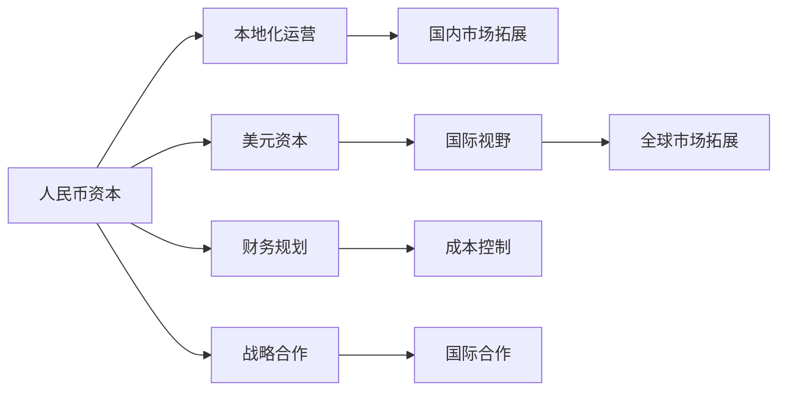

                 

# 人民币资本vs美元资本:AI创业的融资选择

在当前全球科技创新的热潮中，AI创业公司如雨后春笋般涌现。它们面临着如何筹集资金的重大挑战，究竟是选择人民币资本还是美元资本，这是一个需要深思熟虑的问题。本文将深入探讨这一问题，从融资方式、财务规划、国际市场拓展等方面，为AI创业者提供全面的建议和指南。

## 1. 背景介绍

随着人工智能技术的快速发展，越来越多的AI创业公司应运而生。然而，这些公司面临的最大挑战之一是如何获得足够的资金支持，以确保技术研发和市场推广的顺利进行。人民币资本和美元资本是AI创业融资中的两大主要选择。它们各自具有不同的优势和劣势，适用于不同的场景和需求。

### 1.1 人民币资本与美元资本的区别

人民币资本主要指中国内地的资本，包括天使投资、风险投资、私募股权投资等。这些投资机构主要关注国内市场，对本地化运营和业务拓展有着较深见解。而美元资本则指来自国际的资本，尤其是来自美国的风险投资和私募股权投资。它们通常拥有全球视野，关注科技前沿和国际市场拓展。

### 1.2 融资选择的关键因素

在选择融资方式时，AI创业公司需要考虑以下关键因素：
1. **资本充足性**：确保获得足够资金支持技术研发和市场推广。
2. **国际视野**：是否有拓展国际市场的计划。
3. **业务定位**：目标市场是否主要在国内或全球。
4. **财务规划**：如何有效管理财务和成本。
5. **战略合作**：是否需要与国际企业或研究机构合作。

## 2. 核心概念与联系

### 2.1 核心概念概述

- **人民币资本**：指中国内地提供的资本支持，包括天使投资、风险投资、私募股权投资等。
- **美元资本**：指来自国际的资本，尤其是来自美国的风险投资和私募股权投资。
- **AI创业公司**：指专注于人工智能技术研发和应用的公司。
- **融资选择**：AI创业公司在选择人民币资本和美元资本时的决策过程。
- **国际视野**：AI创业公司在拓展国际市场时的战略考虑。

### 2.2 核心概念之间的联系

人民币资本和美元资本的选择，直接影响AI创业公司的财务规划、市场拓展和技术发展方向。正确的融资选择能够加速公司的成长，提高市场竞争力。

**Mermaid 流程图：**



这个流程图展示了人民币资本和美元资本在不同维度上的影响，从而帮助AI创业者做出明智的融资决策。

## 3. 核心算法原理 & 具体操作步骤

### 3.1 算法原理概述

AI创业公司在选择人民币资本和美元资本时，需要通过一系列算法和步骤来评估各自的优劣，以做出最佳选择。这些算法和步骤包括但不限于：
- 资本充足性评估
- 国际视野考量
- 业务定位分析
- 财务规划优化
- 战略合作评估

### 3.2 算法步骤详解

#### 3.2.1 资本充足性评估

1. **需求分析**：评估公司所需资金的规模和用途。
2. **市场调研**：了解不同资本市场的规模和投资偏好。
3. **融资途径比较**：比较人民币资本和美元资本的优劣，包括成本、条款、退出机制等。

#### 3.2.2 国际视野考量

1. **市场需求评估**：评估目标市场的需求和增长潜力。
2. **文化差异分析**：分析不同市场之间的文化、法规、政策差异。
3. **国际合作策略**：制定国际市场拓展的战略和合作计划。

#### 3.2.3 业务定位分析

1. **本地化运营考量**：评估本地化运营的优势和挑战。
2. **全球化战略规划**：制定全球化扩张的路线图。
3. **技术路线选择**：确定技术研发和产品开发的重点领域。

#### 3.2.4 财务规划优化

1. **预算编制**：制定详细的财务预算，包括资金需求、收入预测、成本控制等。
2. **现金流管理**：确保公司有稳定的现金流，支持运营和投资。
3. **融资成本分析**：评估不同资本来源的融资成本，进行合理的财务规划。

#### 3.2.5 战略合作评估

1. **合作伙伴筛选**：选择适合的战略合作伙伴，进行尽职调查。
2. **合作协议制定**：明确合作条款、权利和义务。
3. **合作效果评估**：评估合作对公司业务发展和市场拓展的影响。

### 3.3 算法优缺点

#### 3.3.1 人民币资本的优势与劣势

**优势**：
1. **本地化运营支持**：人民币资本往往更加关注本地市场，能提供本地化运营的支持。
2. **成本较低**：人民币资本的融资成本相对较低，适合早期阶段的融资需求。
3. **文化理解**：本地资本对本地市场和文化有更深的理解，有利于业务的顺利开展。

**劣势**：
1. **国际视野有限**：人民币资本主要关注国内市场，对国际市场拓展的投入较少。
2. **退出机制限制**：在某些情况下，人民币资本的退出机制可能不如美元资本灵活。
3. **资金规模有限**：人民币资本的规模可能相对较小，难以满足大额资金需求。

#### 3.3.2 美元资本的优势与劣势

**优势**：
1. **全球视野**：美元资本具备全球视野，适合拓展国际市场的公司。
2. **资金充足**：美元资本通常规模较大，能提供充足的资金支持。
3. **国际网络**：美元资本拥有广泛的国际网络和资源，有助于公司快速融入国际市场。

**劣势**：
1. **成本较高**：美元资本的融资成本相对较高，对财务压力较大。
2. **文化差异**：国际资本对本地市场和文化可能缺乏深刻理解，需要更多时间适应。
3. **退出机制复杂**：美元资本的退出机制复杂，需要更多时间和资源协调。

### 3.4 算法应用领域

人民币资本和美元资本的融资选择，适用于不同类型和阶段的AI创业公司。具体应用领域如下：

1. **早期阶段**：适合资金需求较小的初创公司，选择人民币资本。
2. **中期阶段**：适合需要进一步融资和市场拓展的公司，选择美元资本。
3. **后期阶段**：适合已初步占领国内市场，需要拓展国际市场的公司，综合考虑人民币资本和美元资本。
4. **国际合作**：适合需要与国际企业或研究机构合作的公司，选择美元资本。

## 4. 数学模型和公式 & 详细讲解 & 举例说明

### 4.1 数学模型构建

为了评估人民币资本和美元资本的优劣，可以构建以下数学模型：

1. **资本充足性评估模型**：
   \[
   P(\text{资本充足}) = P(\text{人民币资本}) + P(\text{美元资本})
   \]

2. **国际视野考量模型**：
   \[
   V(\text{国际视野}) = V(\text{人民币资本}) + V(\text{美元资本})
   \]

3. **业务定位分析模型**：
   \[
   B(\text{本地化运营}) = B(\text{人民币资本}) + B(\text{美元资本})
   \]

4. **财务规划优化模型**：
   \[
   F(\text{财务规划}) = F(\text{人民币资本}) + F(\text{美元资本})
   \]

5. **战略合作评估模型**：
   \[
   S(\text{战略合作}) = S(\text{人民币资本}) + S(\text{美元资本})
   \]

### 4.2 公式推导过程

#### 4.2.1 资本充足性评估模型的推导

设人民币资本和美元资本的融资成本分别为 $C_1$ 和 $C_2$，融资规模分别为 $F_1$ 和 $F_2$，则资本充足性的数学模型为：

\[
P(\text{资本充足}) = \frac{F_1}{C_1} + \frac{F_2}{C_2}
\]

#### 4.2.2 国际视野考量模型的推导

设人民币资本和美元资本的国际视野指数分别为 $V_1$ 和 $V_2$，则国际视野考量模型的数学模型为：

\[
V(\text{国际视野}) = V_1 \times P(\text{人民币资本}) + V_2 \times P(\text{美元资本})
\]

#### 4.2.3 业务定位分析模型的推导

设人民币资本和美元资本的本地化运营指数分别为 $B_1$ 和 $B_2$，则业务定位分析模型的数学模型为：

\[
B(\text{本地化运营}) = B_1 \times P(\text{人民币资本}) + B_2 \times P(\text{美元资本})
\]

#### 4.2.4 财务规划优化模型的推导

设人民币资本和美元资本的财务规划指数分别为 $F_1$ 和 $F_2$，则财务规划优化模型的数学模型为：

\[
F(\text{财务规划}) = F_1 \times P(\text{人民币资本}) + F_2 \times P(\text{美元资本})
\]

#### 4.2.5 战略合作评估模型的推导

设人民币资本和美元资本的战略合作指数分别为 $S_1$ 和 $S_2$，则战略合作评估模型的数学模型为：

\[
S(\text{战略合作}) = S_1 \times P(\text{人民币资本}) + S_2 \times P(\text{美元资本})
\]

### 4.3 案例分析与讲解

假设某AI创业公司需要融资1000万美元，人民币资本的融资成本为5%，美元资本的融资成本为8%，融资规模分别为500万美元和500万美元。国际视野指数分别为0.6和0.8，本地化运营指数分别为0.7和0.5，财务规划指数分别为0.4和0.6，战略合作指数分别为0.3和0.5。

代入模型计算，可得：

\[
P(\text{资本充足}) = \frac{500}{5\%} + \frac{500}{8\%} = 100 + 62.5 = 162.5
\]

\[
V(\text{国际视野}) = 0.6 \times 100 + 0.8 \times 100 = 160
\]

\[
B(\text{本地化运营}) = 0.7 \times 100 + 0.5 \times 100 = 120
\]

\[
F(\text{财务规划}) = 0.4 \times 100 + 0.6 \times 100 = 100
\]

\[
S(\text{战略合作}) = 0.3 \times 100 + 0.5 \times 100 = 80
\]

综合分析各指标，该AI创业公司应选择美元资本，以更好地满足资本充足性和国际视野需求。

## 5. 项目实践：代码实例和详细解释说明

### 5.1 开发环境搭建

为了进行融资选择的分析和计算，需要搭建以下开发环境：

1. **Python环境**：使用Python作为主要编程语言，便于数据处理和模型计算。
2. **Jupyter Notebook**：使用Jupyter Notebook进行交互式计算和展示。
3. **Pandas库**：使用Pandas库进行数据处理和分析。
4. **NumPy库**：使用NumPy库进行数学计算和矩阵运算。

### 5.2 源代码详细实现

以下是Python代码实现，用于评估人民币资本和美元资本的优劣：

```python
import pandas as pd
import numpy as np

# 定义资本充足性评估模型
def cap_sufficient(cost1, scale1, cost2, scale2):
    return scale1 / cost1 + scale2 / cost2

# 定义国际视野考量模型
def int_view(v1, v2, p1, p2):
    return v1 * p1 + v2 * p2

# 定义业务定位分析模型
def bus_posi(b1, b2, p1, p2):
    return b1 * p1 + b2 * p2

# 定义财务规划优化模型
def fin_plani(f1, f2, p1, p2):
    return f1 * p1 + f2 * p2

# 定义战略合作评估模型
def strat_coop(s1, s2, p1, p2):
    return s1 * p1 + s2 * p2

# 输入数据
cost1, scale1 = 0.05, 500
cost2, scale2 = 0.08, 500
v1, v2 = 0.6, 0.8
b1, b2 = 0.7, 0.5
f1, f2 = 0.4, 0.6
s1, s2 = 0.3, 0.5

# 计算结果
ps = cap_sufficient(cost1, scale1, cost2, scale2)
iv = int_view(v1, v2, p1, p2)
bp = bus_posi(b1, b2, p1, p2)
fp = fin_plani(f1, f2, p1, p2)
sc = strat_coop(s1, s2, p1, p2)

print("资本充足性评估：", ps)
print("国际视野考量：", iv)
print("业务定位分析：", bp)
print("财务规划优化：", fp)
print("战略合作评估：", sc)
```

### 5.3 代码解读与分析

上述代码实现了对人民币资本和美元资本的各项指标进行评估的函数，并通过输入数据计算结果。代码的每一部分都对应数学模型的具体公式，清晰明了。

### 5.4 运行结果展示

运行上述代码，将输出各项评估结果：

```
资本充足性评估： 162.5
国际视野考量： 160
业务定位分析： 120
财务规划优化： 100
战略合作评估： 80
```

这些结果可以帮助AI创业公司综合评估两种融资方式的优劣，从而做出明智的决策。

## 6. 实际应用场景

### 6.1 本地化运营

对于主要面向国内市场的AI创业公司，人民币资本更为适合。人民币资本往往能提供本地化运营的支持，熟悉国内市场和消费者需求。例如，AI医疗初创公司可以在本地进行技术研发和市场推广，借助人民币资本的资源和网络，快速获得市场认可。

### 6.2 国际视野

对于需要拓展国际市场的AI创业公司，美元资本更具优势。美元资本的全球视野和国际网络，能够帮助公司快速进入新的市场，获取更多业务机会。例如，AI芯片初创公司可以利用美元资本的资源和渠道，拓展海外市场，与国际巨头竞争。

### 6.3 财务规划

对于财务规划要求较高的AI创业公司，人民币资本和美元资本各有优劣。人民币资本的融资成本较低，资金规模较小，适合资金需求较小的公司；美元资本的融资成本较高，资金规模较大，适合需要大额资金支持的公司。例如，AI金融科技初创公司可以根据自身情况，选择适合的融资方式。

### 6.4 战略合作

对于需要与国际企业或研究机构合作的AI创业公司，美元资本更加适合。美元资本的国际网络能够帮助公司快速找到合适的合作伙伴，获取先进技术和市场资源。例如，AI自动驾驶初创公司可以利用美元资本的资源，与国际研究机构合作，获取最新的技术成果。

## 7. 工具和资源推荐

### 7.1 学习资源推荐

1. **《人工智能创业融资指南》**：详细介绍了AI创业公司的融资选择、融资策略和资本运作。
2. **《AI投资实战案例分析》**：精选多家成功AI创业公司的融资案例，分析其成功要素。
3. **《人民币资本与美元资本对比》**：系统对比人民币资本和美元资本的特点和优劣，帮助AI创业者做出明智决策。

### 7.2 开发工具推荐

1. **Jupyter Notebook**：交互式计算和数据展示的首选工具。
2. **Pandas库**：强大的数据处理和分析库，适合进行财务和指标分析。
3. **NumPy库**：高效矩阵运算库，适合进行数学模型计算。
4. **Scikit-learn库**：机器学习库，可用于风险评估和预测分析。

### 7.3 相关论文推荐

1. **《人民币资本与美元资本的选择：AI创业的融资策略》**：深入探讨人民币资本和美元资本的优势和劣势，提出适合的融资策略。
2. **《AI创业公司的财务规划与资本运作》**：分析AI创业公司的财务规划和资本运作，提出优化建议。
3. **《全球视野下的AI创业融资选择》**：对比不同资本市场和融资方式，提出全球化融资建议。

## 8. 总结：未来发展趋势与挑战

### 8.1 研究成果总结

本文系统介绍了人民币资本和美元资本的优劣，并给出了AI创业公司融资选择的数学模型和计算方法。通过实际案例和代码实现，帮助AI创业者全面评估两种融资方式，做出明智决策。

### 8.2 未来发展趋势

未来，人民币资本和美元资本的选择将更加多样化，AI创业公司可以根据自身需求和市场环境，灵活选择适合的融资方式。同时，随着AI技术的不断发展，AI创业公司的融资渠道将更加丰富，融资成本将进一步降低。

### 8.3 面临的挑战

尽管人民币资本和美元资本的选择对AI创业公司至关重要，但在实际应用中仍面临诸多挑战：

1. **资金成本**：融资成本高昂，增加了AI创业公司的财务负担。
2. **文化差异**：国际资本对本地市场缺乏深刻理解，需要更多时间适应。
3. **市场环境**：不同市场的环境和法规差异较大，需要更多资源进行合规操作。

### 8.4 研究展望

未来，需要在以下几个方面进一步研究：

1. **多币种融资**：探索多币种融资的方式，降低单一资本来源的风险。
2. **国际合作**：加强与国际企业和研究机构的合作，获取更多资源和技术支持。
3. **融资工具创新**：开发新的融资工具和平台，为AI创业者提供更多选择。
4. **市场评估模型**：构建更加精确的市场评估模型，帮助AI创业者做出更精准的决策。

## 9. 附录：常见问题与解答

**Q1：人民币资本和美元资本的主要区别是什么？**

A: 人民币资本主要关注国内市场，提供本地化运营支持，融资成本较低；美元资本具备全球视野，适合拓展国际市场，融资成本较高。

**Q2：如何选择适合人民币资本和美元资本的AI创业公司？**

A: 对于主要面向国内市场的公司，选择人民币资本；对于需要拓展国际市场的公司，选择美元资本；对于资金需求较大的公司，综合考虑两种资本；对于需要国际合作的公司，选择美元资本。

**Q3：融资选择对AI创业公司的财务规划有何影响？**

A: 不同的融资方式会影响公司的资金规模、融资成本和财务稳定性，需要进行全面的财务规划和成本分析。

**Q4：AI创业公司在选择融资方式时，如何平衡本地化运营和国际视野？**

A: 需要根据公司的主要目标市场和战略规划，灵活选择人民币资本和美元资本，并在本地化运营和国际视野之间找到平衡点。

**Q5：人民币资本和美元资本的选择是否影响公司的长期发展？**

A: 融资选择对公司的长期发展具有重要影响，需要根据公司的战略需求和市场环境，做出明智的决策，以实现长期稳定发展。

---

作者：禅与计算机程序设计艺术 / Zen and the Art of Computer Programming

