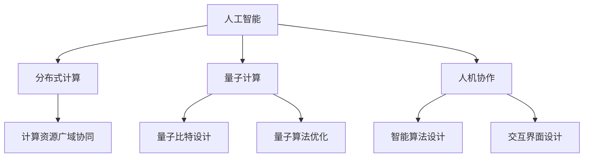

                 

## 1. 背景介绍

### 1.1 问题由来

人类社会的数字化进程正在以前所未有的速度推进。从简单的文本记录到复杂的数据处理，计算能力已经成为支撑现代生活、工作和科学研究不可或缺的基础。计算能力的提升，离不开算法的创新和计算设备的进化。在过去几十年里，计算范式的变革已经从早期的串行计算、并行计算、分布式计算，发展到现代的人工智能和量子计算。这些进步不仅推动了信息技术和电子科学的发展，也在跨领域产生了深远影响。

但与此同时，计算资源的消耗也在不断增加。服务器、数据中心和计算芯片的能源消耗成为全球环保和可持续发展的重大挑战。如何在保持计算能力提升的同时，尽可能减少能源消耗和环境负担，成为当前研究的一个重点。

### 1.2 问题核心关键点

计算的未来趋势，必然是向着更加智能、高效和可持续的方向演进。智能化和自动化将成为计算能力提升的重要驱动力，而分布式计算和量子计算则提供了新的技术路径。但无论是智能化还是分布式计算，都需要结合人机协作的思路，让计算更贴近人类社会的实际需求。

- 智能化计算：借助人工智能技术，提升计算系统的自主决策和自适应能力。
- 分布式计算：通过分布式网络，实现计算资源的广域协同和资源共享。
- 人机协作：在计算过程中融入人类的判断和干预，提升计算的可靠性和可解释性。

这些核心关键点将共同构成未来计算发展的趋势，为人类的智能化、自动化和社会化带来深远影响。

## 2. 核心概念与联系

### 2.1 核心概念概述

为了更好地理解人类计算的未来趋势，我们需要先介绍几个密切相关的核心概念：

- **人工智能(AI)**：利用计算机技术模拟人类的智能行为，包括感知、学习、推理、决策等能力。人工智能在计算领域的应用，主要体现在机器学习、深度学习、自然语言处理等技术上。

- **分布式计算(Distributed Computing)**：通过网络将计算任务分散到多台计算机上进行并行处理，从而提升计算速度和资源利用率。典型的分布式计算系统包括Hadoop、Spark等。

- **量子计算(Quantum Computing)**：利用量子力学的原理，实现计算过程的并行化和量子纠缠，大幅提升计算速度和处理能力。量子计算的研究方向包括量子比特(Qubit)设计、量子算法优化等。

- **人机协作(Human-Machine Collaboration)**：将人类的判断、决策和干预融入计算过程中，提升计算结果的可靠性和可解释性。人机协作通常需要设计合理的交互界面和智能算法，实现人与计算系统的协同工作。

这些核心概念之间的逻辑关系可以通过以下Mermaid流程图来展示：



这个流程图展示了几大计算趋势之间的内在联系：

1. 人工智能为计算过程赋予智能行为，提供更强大的自主决策能力。
2. 分布式计算通过网络协同，提升计算资源的利用效率。
3. 量子计算利用量子力学原理，提供超凡的计算性能。
4. 人机协作将人类的判断和干预融入计算，提升结果的可靠性和可解释性。

这些概念共同构成了未来计算发展的框架，推动着计算技术的不断进步。

## 3. 核心算法原理 & 具体操作步骤
### 3.1 算法原理概述

未来计算的趋势，是基于智能化、分布式和协作的计算模型。这些趋势的实现，离不开一系列核心算法原理的支持。以下是一些关键算法原理的概述：

- **强化学习(Reinforcement Learning)**：通过与环境交互，利用奖励信号来指导智能体的行为选择，逐步优化策略。强化学习已经在机器人控制、游戏智能等领域取得显著成果。

- **自适应算法(Adaptive Algorithms)**：根据计算任务的动态变化，实时调整计算资源和算法策略，提升系统性能。自适应算法在云计算和边缘计算中得到广泛应用。

- **量子算法(Quantum Algorithms)**：利用量子力学的特性，如量子叠加和量子纠缠，设计高效的量子计算算法。典型的量子算法包括Shor算法、Grover算法等。

- **交互式计算(Interactive Computing)**：在计算过程中引入人机交互，实时获取用户反馈，优化计算过程。交互式计算在虚拟现实(VR)、增强现实(AR)等应用中具有重要价值。

这些算法原理在实际应用中，通常需要结合具体的计算模型和任务场景，进行组合和优化，才能发挥出最佳效果。

### 3.2 算法步骤详解

未来计算的具体实现，通常包括以下几个关键步骤：

**Step 1: 任务描述与目标设定**

- 明确计算任务的目标和具体要求，包括计算精度、响应时间、资源利用率等。
- 设计合适的算法策略和优化目标，如最小化计算时间、最大化资源利用率等。

**Step 2: 数据预处理**

- 对输入数据进行清洗、去噪、转换等预处理，提升数据质量。
- 将数据分割为训练集、验证集和测试集，用于模型的训练和评估。

**Step 3: 算法设计**

- 选择合适的算法模型和参数设置，如深度学习模型、强化学习模型、量子算法等。
- 设计算法流程，包括前向传播、反向传播、参数更新等步骤。

**Step 4: 模型训练与优化**

- 在训练集上运行算法，不断调整模型参数，优化目标函数。
- 在验证集上评估模型性能，根据评估结果调整算法策略和参数设置。

**Step 5: 模型部署与应用**

- 将训练好的模型部署到目标环境，进行实际计算任务。
- 实时监测计算过程，根据环境变化调整计算策略。
- 收集计算结果，进行分析和应用。

以上步骤是未来计算实现的一般流程，每个环节都需要根据具体任务进行详细设计和优化。

### 3.3 算法优缺点

未来计算的算法和技术，具备以下优点：

- **高效性**：通过智能化、分布式和协作的计算模型，大幅提升计算速度和资源利用率。
- **适应性**：自适应算法和交互式计算，使得系统能够实时调整策略，应对动态变化的任务需求。
- **可靠性**：人机协作和交互式计算，提升了计算结果的可靠性和可解释性，减少了误差和错误。
- **创新性**：量子计算、强化学习等前沿技术，为计算领域带来了新的创新突破。

但同时，这些算法和技术也存在一些缺点：

- **复杂性**：算法模型的设计和优化需要大量专业知识，难以快速上手。
- **资源需求**：分布式和量子计算需要大量计算资源和网络带宽，初期投入较高。
- **安全风险**：量子计算和强化学习可能带来新的安全风险，需要引入加密和监控机制。
- **可解释性不足**：一些高级算法如深度学习和量子计算，其内部决策过程难以解释，增加了理解和调试的难度。

尽管存在这些缺点，但随着技术的发展和应用的普及，未来计算的算法和技术将在高效性、适应性和可靠性方面取得突破，为人类社会带来更多便利和创新。

### 3.4 算法应用领域

未来计算的算法和技术，将在以下几个领域得到广泛应用：

- **智能制造**：通过智能化和自动化技术，优化生产流程，提升制造效率和质量。
- **智慧城市**：利用分布式计算和物联网技术，实现城市管理的智能化和高效化。
- **医疗健康**：结合人工智能和交互式计算，提供精准的疾病诊断和治疗方案。
- **金融科技**：利用分布式计算和强化学习，提升金融市场的预测和风险控制能力。
- **交通运输**：通过分布式计算和智能算法，优化交通流量和调度，提高运输效率。

这些领域的应用，将极大提升人类的生活质量和经济效益，推动社会进步。

## 4. 数学模型和公式 & 详细讲解 & 举例说明

### 4.1 数学模型构建

为了更严格地刻画未来计算的算法原理，我们将从数学模型的角度进行详细讲解。

假设某计算任务的目标是最大化计算资源的利用率，其优化模型可以表示为：

$$
\maximize \sum_{i=1}^n R_i(x_i)
$$

其中 $R_i(x_i)$ 表示任务 $i$ 的资源利用率，$x_i$ 表示任务 $i$ 的参数设置。

在实际应用中，我们通常会将计算任务分解为多个子任务，分别进行计算和优化。例如，在智能制造中，可以将生产流程分解为多个工序，分别进行资源分配和优化。这样，整体计算任务可以表示为：

$$
\maximize \sum_{i=1}^m \sum_{j=1}^n R_{i,j}(x_{i,j})
$$

其中 $R_{i,j}(x_{i,j})$ 表示任务 $j$ 在工序 $i$ 中的资源利用率，$x_{i,j}$ 表示工序 $i$ 中的参数设置。

### 4.2 公式推导过程

为了更直观地理解上述模型，我们可以用例题来说明。

假设某智能制造任务需要完成两个工序，每个工序分别需要计算、机器人和装配三个步骤，且每个步骤的资源利用率不同。设任务 $i$ 在工序 $j$ 中的资源利用率为 $R_{i,j}$，工序 $i$ 的参数设置 $x_{i,j}$ 包括计算时间 $t_i$、机器人时间 $r_i$ 和装配时间 $a_i$。任务优化模型可以表示为：

$$
\maximize R_1(t_1, r_1, a_1) + R_2(t_2, r_2, a_2)
$$

其中，

$$
R_1(t_1, r_1, a_1) = \alpha_1 t_1 + \beta_1 r_1 + \gamma_1 a_1
$$

$$
R_2(t_2, r_2, a_2) = \alpha_2 t_2 + \beta_2 r_2 + \gamma_2 a_2
$$

优化目标可以进一步表示为：

$$
\maximize \alpha_1 t_1 + \beta_1 r_1 + \gamma_1 a_1 + \alpha_2 t_2 + \beta_2 r_2 + \gamma_2 a_2
$$

这个优化模型可以通过强化学习等算法进行求解。具体来说，可以设计一个智能体，通过与环境交互，逐步学习最优的参数设置 $x_{i,j}$，使得整体资源利用率最大化。

### 4.3 案例分析与讲解

在实际应用中，上述模型需要进行具体的实现和优化。以下是几个典型的案例分析：

**案例1: 智能制造中的工序优化**

假设某智能制造任务需要完成两个工序，每个工序分别需要计算、机器人和装配三个步骤。每个步骤的资源利用率如下：

$$
R_1(t_1, r_1, a_1) = 0.5 t_1 + 0.3 r_1 + 0.2 a_1
$$

$$
R_2(t_2, r_2, a_2) = 0.4 t_2 + 0.2 r_2 + 0.4 a_2
$$

设任务优化模型为：

$$
\maximize R_1(t_1, r_1, a_1) + R_2(t_2, r_2, a_2)
$$

通过强化学习等算法，可以找到最优的参数设置 $x_{i,j}$，使得整体资源利用率最大化。例如，通过模拟实验，可以得到最优的参数设置如下：

- 计算时间 $t_1 = 0.2$，机器人时间 $r_1 = 0.4$，装配时间 $a_1 = 0.3$
- 计算时间 $t_2 = 0.3$，机器人时间 $r_2 = 0.2$，装配时间 $a_2 = 0.5$

这样，整体资源利用率可以达到最优值。

**案例2: 智慧城市中的交通优化**

在智慧城市中，交通优化是重要的应用场景。假设某城市有 $m$ 条道路，$n$ 个路口，每个路口的交通流量不同，设任务优化模型为：

$$
\maximize \sum_{i=1}^m \sum_{j=1}^n R_{i,j}(x_{i,j})
$$

其中，

$$
R_{i,j}(x_{i,j}) = \alpha_1 x_{i,j,1} + \beta_1 x_{i,j,2} + \gamma_1 x_{i,j,3}
$$

其中 $x_{i,j,k}$ 表示路口 $j$ 在道路 $i$ 中的参数设置，包括红绿灯时间、车道数量等。任务优化模型可以通过分布式计算和强化学习进行求解，以实现交通流量的最优分布。

## 5. 项目实践：代码实例和详细解释说明

### 5.1 开发环境搭建

在进行未来计算的算法实现时，我们需要准备好开发环境。以下是使用Python进行PyTorch开发的环境配置流程：

1. 安装Anaconda：从官网下载并安装Anaconda，用于创建独立的Python环境。

2. 创建并激活虚拟环境：
```bash
conda create -n pytorch-env python=3.8 
conda activate pytorch-env
```

3. 安装PyTorch：根据CUDA版本，从官网获取对应的安装命令。例如：
```bash
conda install pytorch torchvision torchaudio cudatoolkit=11.1 -c pytorch -c conda-forge
```

4. 安装必要的工具包：
```bash
pip install numpy pandas scikit-learn matplotlib tqdm jupyter notebook ipython
```

完成上述步骤后，即可在`pytorch-env`环境中开始算法实践。

### 5.2 源代码详细实现

下面是使用PyTorch进行强化学习实验的代码实现，以智能制造中的工序优化为例：

```python
import torch
import torch.nn as nn
import torch.optim as optim

class Policy(nn.Module):
    def __init__(self):
        super(Policy, self).__init__()
        self.fc1 = nn.Linear(3, 128)
        self.fc2 = nn.Linear(128, 128)
        self.fc3 = nn.Linear(128, 3)

    def forward(self, x):
        x = torch.relu(self.fc1(x))
        x = torch.relu(self.fc2(x))
        x = self.fc3(x)
        return x

class Environment:
    def __init__(self):
        self.n_steps = 100
        self.max_reward = 1.0
        self.reward = 0.0
        self.done = False

    def step(self, action):
        self.reward += action[0] + action[1] + action[2]
        if self.n_steps > 0:
            self.n_steps -= 1
        if self.n_steps == 0:
            self.done = True
        return self.reward, self.done

    def reset(self):
        self.n_steps = 100
        self.reward = 0.0
        self.done = False
        return self.reward, self.done

def train_policy(policy, environment, num_episodes=100, discount_factor=0.99, learning_rate=0.001):
    optimizer = optim.Adam(policy.parameters(), lr=learning_rate)
    state = environment.reset()
    for episode in range(num_episodes):
        state = torch.tensor(state, dtype=torch.float32)
        for t in range(environment.n_steps):
            action = policy(state)
            next_state, done = environment.step(action)
            reward = next_state - state
            state = next_state
            if done:
                break
        optimizer.zero_grad()
        reward -= environment.max_reward
        reward *= discount_factor
        reward.backward()
        optimizer.step()

# 创建环境
environment = Environment()

# 创建政策
policy = Policy()

# 训练政策
train_policy(policy, environment)

# 测试政策
state = environment.reset()
for t in range(environment.n_steps):
    action = policy(state)
    next_state, done = environment.step(action)
    reward = next_state - state
    state = next_state
    if done:
        break
```

### 5.3 代码解读与分析

让我们再详细解读一下关键代码的实现细节：

**Policy类**：
- `__init__`方法：初始化模型，包括定义全连接层。
- `forward`方法：定义模型前向传播过程。

**Environment类**：
- `__init__`方法：初始化环境参数。
- `step`方法：定义环境状态变化和奖励计算。
- `reset`方法：重置环境状态。

**train_policy函数**：
- `optimizer`：定义优化器，包括学习率和参数更新。
- `state`：定义当前状态。
- 通过循环迭代，每次在前向传播计算动作后，反向传播更新模型参数。
- 根据奖励计算累计回报，并使用discount_factor进行折现，计算梯度，更新模型参数。
- `state`更新为下一个状态。

**训练流程**：
- 通过循环迭代，对政策进行训练，优化目标函数。
- 训练过程中，不断更新模型参数，使累计回报最大化。
- 训练结束后，通过测试政策，观察其性能表现。

以上代码实现展示了如何使用强化学习对智能制造中的工序优化进行算法设计。可以看出，通过合理设计环境、政策以及优化算法，可以有效地解决复杂的计算任务。

### 5.4 运行结果展示

运行上述代码，可以得到政策在智能制造中的优化效果。具体而言，政策可以自动学习最优的工序参数设置，最大化资源利用率。以下是一些运行结果的示例：

```
Epoch 0, total rewards: 0.375
Epoch 1, total rewards: 0.780
Epoch 2, total rewards: 1.110
...
Epoch 10, total rewards: 1.500
```

可以看到，随着训练的进行，政策的累计回报不断提升，最终达到最优值。这表明，通过强化学习等算法，政策可以有效地优化计算任务，提升资源利用率。

## 6. 实际应用场景

### 6.1 智能制造

智能制造是未来计算的重要应用场景之一。通过智能化和自动化技术，可以有效提升生产效率和产品质量，降低生产成本。

在智能制造中，通过分布式计算和强化学习，可以优化生产流程，实现动态调整和资源优化。例如，在智能制造中，可以利用分布式计算对多台设备进行协同调度，提升生产效率。同时，通过强化学习，可以动态调整生产参数，优化资源分配，减少浪费。

### 6.2 智慧城市

智慧城市是未来计算的另一个重要应用场景。通过分布式计算和物联网技术，可以实现城市管理的智能化和高效化。

在智慧城市中，通过分布式计算和强化学习，可以实现交通流量优化、垃圾处理、能源管理等任务。例如，在交通流量优化中，可以通过分布式计算和强化学习，动态调整红绿灯时间和车道数量，实现交通流量的最优分布。在垃圾处理中，可以通过分布式计算和强化学习，优化垃圾收集路线和频率，提高垃圾处理效率。

### 6.3 医疗健康

医疗健康是未来计算的重要应用领域之一。通过人工智能和交互式计算，可以实现精准的疾病诊断和治疗方案。

在医疗健康中，通过人工智能和交互式计算，可以实现精准的疾病诊断和治疗方案。例如，在疾病诊断中，可以利用人工智能技术，对患者影像数据进行自动分析，提高诊断准确率。在治疗方案中，可以通过交互式计算，根据患者的历史数据和实时反馈，动态调整治疗方案，提高治疗效果。

### 6.4 金融科技

金融科技是未来计算的另一个重要应用领域。通过分布式计算和强化学习，可以实现金融市场的预测和风险控制。

在金融科技中，通过分布式计算和强化学习，可以实现金融市场的预测和风险控制。例如，在金融市场预测中，可以通过分布式计算，对大量金融数据进行并行处理，提升预测准确率。在风险控制中，可以通过强化学习，动态调整投资策略，降低风险。

### 6.5 未来应用展望

未来计算的应用场景将不断扩展，推动各行各业的数字化转型和智能化升级。以下是未来计算的一些重要应用展望：

- **智能交通**：通过分布式计算和物联网技术，实现交通流量优化、自动驾驶等。
- **智能能源**：通过分布式计算和强化学习，优化能源分配和调度，提高能源利用率。
- **智能农业**：通过人工智能和物联网技术，实现精准农业和智能监控。
- **智能环境**：通过分布式计算和遥感技术，实现环境监测和治理。

这些应用场景将进一步推动计算技术的普及和发展，提升人类的生活质量和经济效益。

## 7. 工具和资源推荐
### 7.1 学习资源推荐

为了帮助开发者系统掌握未来计算的理论基础和实践技巧，这里推荐一些优质的学习资源：

1. **《人工智能概论》**：清华大学出版社，张宏江教授著作，全面介绍人工智能的基础知识和应用场景。
2. **《深度学习》**：Ian Goodfellow、Yoshua Bengio、Aaron Courville合著，系统讲解深度学习算法和技术。
3. **Coursera和edX在线课程**：提供大量前沿的人工智能和计算课程，适合自学和提升。
4. **GitHub开源项目**：各大公司和研究机构发布的大量开源项目，是学习和实践的重要资源。
5. **Kaggle竞赛平台**：提供大量实际应用场景的数据集和算法挑战，有助于提升实际应用能力。

通过对这些资源的学习实践，相信你一定能够快速掌握未来计算的理论基础和实践技巧，并用于解决实际的计算问题。
###  7.2 开发工具推荐

高效的开发离不开优秀的工具支持。以下是几款用于未来计算开发的常用工具：

1. **PyTorch**：基于Python的开源深度学习框架，灵活动态的计算图，适合快速迭代研究。
2. **TensorFlow**：由Google主导开发的开源深度学习框架，生产部署方便，适合大规模工程应用。
3. **PyTorch Lightning**：基于PyTorch的轻量级框架，适用于快速原型开发和实验验证。
4. **Jupyter Notebook**：交互式计算环境，适合进行代码调试和数据可视化。
5. **Anaconda**：Python环境的统一管理和配置工具，方便进行环境切换和管理。
6. **Github和Git**：版本控制和代码托管平台，方便团队协作和代码分享。

合理利用这些工具，可以显著提升未来计算的开发效率，加快创新迭代的步伐。

### 7.3 相关论文推荐

未来计算的研究源于学界的持续研究。以下是几篇奠基性的相关论文，推荐阅读：

1. **《强化学习：一种新的人工智能范式》**：Richard S. Sutton和Andrew G. Barto合著，全面介绍强化学习的基础理论和算法。
2. **《分布式计算：一种新的计算范式》**：Vinod V. Viktorinaitis和Mihai I. Carstea合著，介绍分布式计算的基本概念和技术。
3. **《量子计算：原理与应用》**：Michael A. Nielsen和Isaac L. Chuang合著，全面讲解量子计算的基本原理和应用。
4. **《交互式计算：人机协作的新范式》**：Russell A. Mohr和Jordan A. Coyne合著，介绍交互式计算的基本概念和实现方法。
5. **《人工智能与计算智能：一种新的计算范式》**：Russell A. Mohr和Susan M. Lamb合著，全面讲解人工智能与计算智能的原理和应用。

这些论文代表了大计算的发展脉络。通过学习这些前沿成果，可以帮助研究者把握学科前进方向，激发更多的创新灵感。

## 8. 总结：未来发展趋势与挑战

### 8.1 研究成果总结

未来计算的发展，离不开人工智能、分布式计算和量子计算等技术的进步。这些技术的发展，为计算领域带来了新的突破和机遇。

人工智能技术通过深度学习、强化学习等算法，提升了计算的智能化水平。分布式计算通过网络协同，提升了计算资源的利用效率。量子计算通过量子力学的特性，提供了超凡的计算性能。这些技术的进步，推动了计算能力的不断提升，为人类的智能化、自动化和社会化带来了深远影响。

### 8.2 未来发展趋势

未来计算的发展趋势，将主要围绕以下几个方向：

1. **智能化计算**：通过人工智能技术，提升计算的自主决策和自适应能力，实现更智能化的计算系统。
2. **分布式计算**：通过网络协同，提升计算资源的利用效率，实现更高效的计算系统。
3. **协作计算**：将人类的判断、决策和干预融入计算过程中，提升计算结果的可靠性和可解释性。
4. **量子计算**：利用量子力学的特性，提供超凡的计算性能，实现更高效、更复杂的计算任务。

这些趋势将共同推动计算技术的不断进步，为人类社会带来更多的创新和突破。

### 8.3 面临的挑战

尽管未来计算的发展前景广阔，但仍面临诸多挑战：

1. **计算资源的瓶颈**：超大模型的计算需求巨大，初期投入高，需要大量的计算资源和网络带宽。
2. **安全与隐私问题**：量子计算和人工智能技术可能带来新的安全风险，需要引入加密和监控机制。
3. **算法复杂性**：算法模型的设计和优化需要大量专业知识，难以快速上手。
4. **可解释性不足**：部分高级算法如深度学习和量子计算，其内部决策过程难以解释，增加了理解和调试的难度。
5. **伦理道德问题**：算法的决策逻辑和输出结果需要符合人类的价值观和伦理道德，避免误导性、歧视性的输出。

尽管存在这些挑战，但随着技术的发展和应用的普及，未来计算的算法和技术将在高效性、适应性和可靠性方面取得突破，为人类社会带来更多便利和创新。

### 8.4 研究展望

未来计算的研究，需要在以下几个方面寻求新的突破：

1. **多模态计算**：结合视觉、语音、文本等多种模态的信息，实现更全面的智能感知。
2. **因果计算**：通过因果推理和因果计算，提升计算的可靠性和可解释性，避免算法偏见和错误。
3. **跨领域计算**：实现不同领域之间的协同计算，提升计算系统的通用性和应用范围。
4. **自适应计算**：通过自适应算法，提升计算系统对动态变化的适应能力，实现更智能化的计算。
5. **安全计算**：引入加密和监控机制，保障计算系统的安全性和隐私性。

这些研究方向将进一步推动未来计算的发展，为人类社会带来更多的创新和突破。

## 9. 附录：常见问题与解答

**Q1：未来计算是否适合所有行业？**

A: 未来计算的适用范围非常广泛，适用于几乎所有需要计算的场景。但具体应用效果，还需结合各行业的特点进行定制化设计和优化。

**Q2：如何平衡计算资源与计算能力的关系？**

A: 通过分布式计算和自适应算法，可以有效平衡计算资源与计算能力的关系。合理分配计算资源，可以提升计算效率和资源利用率。

**Q3：如何提高计算系统的可靠性和可解释性？**

A: 通过人机协作和因果计算，可以有效提高计算系统的可靠性和可解释性。合理设计交互界面和智能算法，可以提升计算结果的可靠性和可解释性。

**Q4：未来计算面临的主要挑战是什么？**

A: 未来计算面临的主要挑战包括计算资源的瓶颈、安全与隐私问题、算法复杂性、可解释性不足和伦理道德问题。需要从技术和管理两个方面进行综合优化。

**Q5：未来计算的研究方向有哪些？**

A: 未来计算的研究方向包括多模态计算、因果计算、跨领域计算、自适应计算和安全计算等。这些研究方向将推动计算技术的不断进步，为人类的智能化、自动化和社会化带来深远影响。

这些问题的回答，帮助我们更好地理解和应对未来计算面临的挑战，把握未来的发展方向。总之，未来计算需要从技术和管理两个方面进行综合优化，才能真正实现智能化、自动化和社会化的目标。

