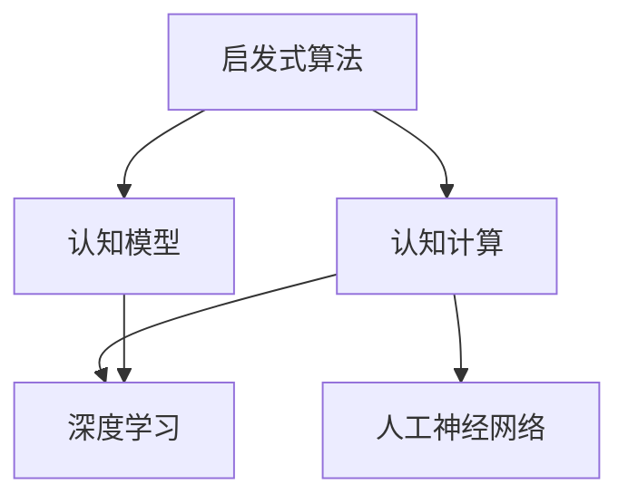

                 

## 1. 背景介绍

在计算机普及和信息爆炸的今天，人类计算正变得越来越重要。人类计算是指将人类大脑的能力与计算机的计算能力相结合，通过启发式算法和认知模型，解决复杂问题，进行创新的过程。这一过程不仅提高了计算效率，也打开了认知科学和人工智能的新领域。

### 1.1 问题由来

随着科技的快速发展，人类对计算能力的需求日益增长。传统的计算模式，如串行计算、并行计算，已经难以满足大规模复杂问题的需求。人类计算的提出，就是为了解决这一问题，通过将人类智慧与机器计算相结合，达到更高效率和更强的创新能力。

### 1.2 问题核心关键点

人类计算的核心在于如何充分利用人类的认知优势，结合机器的计算能力，解决复杂问题。其关键点包括：

- 利用人类认知能力。人类的认知能力，如推理、直觉、创造力等，在解决复杂问题上具有不可替代的作用。
- 结合机器计算能力。机器的高效计算和存储能力，可以处理海量数据，进行高精度的计算。
- 设计启发式算法。启发式算法借鉴人类认知模式，通过模拟人类解决问题的方式，进行高效的求解。
- 建立认知模型。认知模型模拟人类大脑的工作机制，进行信息处理和知识存储。

## 2. 核心概念与联系

### 2.1 核心概念概述

为了更好地理解人类计算的原理和架构，我们首先需要介绍几个核心概念：

- 启发式算法（Heuristic Algorithm）：一种不保证找到最优解，但可以在较短时间内找到满意解的算法。启发式算法借鉴人类解决问题的方式，如贪心、迭代、模拟等。
- 认知模型（Cognitive Model）：模拟人类大脑信息处理和知识存储方式的模型，包括感知、记忆、推理等过程。
- 认知计算（Cognitive Computing）：将认知模型与计算机计算能力相结合，进行复杂问题求解的计算范式。
- 人工神经网络（Artificial Neural Network, ANN）：一种模仿人类大脑神经网络的计算模型，用于处理大量数据和进行复杂计算。
- 深度学习（Deep Learning）：一种基于人工神经网络的机器学习范式，通过多层神经网络进行特征提取和复杂任务解决。

这些概念之间的联系可以通过以下Mermaid流程图来展示：



这个流程图展示了一系列核心概念之间的逻辑关系：

1. 启发式算法和认知模型是认知计算的基础，通过模拟人类认知方式，进行问题求解。
2. 人工神经网络和深度学习是实现认知计算的技术手段，用于高效处理大规模数据和复杂计算。
3. 深度学习和认知模型结合，可以形成更加强大的认知计算范式，用于解决复杂问题。

## 3. 核心算法原理 & 具体操作步骤

### 3.1 算法原理概述

人类计算的算法原理主要基于启发式算法和认知模型，通过模拟人类解决问题的方式，进行高效计算。其核心思想是通过将人类认知能力与机器计算能力相结合，设计高效、灵活的算法，解决复杂问题。

### 3.2 算法步骤详解

人类计算的算法步骤一般包括以下几个关键环节：

**Step 1: 问题定义**

- 明确问题的性质和目标。如问题类型是优化、分类、预测等。
- 确定问题的规模和复杂度。如数据量、计算量、求解时间等。

**Step 2: 启发式算法设计**

- 设计启发式算法，借鉴人类认知方式，如贪心、迭代、模拟等。
- 确定算法参数和策略，如迭代次数、初始化方式、终止条件等。

**Step 3: 数据预处理**

- 收集和整理数据，清洗和处理异常值。
- 将数据转换为适合算法处理的形式，如特征提取、归一化等。

**Step 4: 模型训练和评估**

- 使用启发式算法对数据进行处理，得到中间结果。
- 对中间结果进行评估，根据评估结果调整算法参数。
- 重复训练和评估过程，直至达到满意的性能。

**Step 5: 结果分析和应用**

- 对最终结果进行分析，确定是否符合预期。
- 将结果应用于实际问题中，进行求解和验证。

### 3.3 算法优缺点

人类计算的优势在于其灵活性和高效性，能够快速应对复杂问题。但同时也存在一些局限：

**优点：**

- 高效性：启发式算法能够在较短时间内找到满意解，适用于大规模数据处理。
- 灵活性：认知模型可以模拟人类认知过程，适应各种类型的问题。
- 可解释性：人类计算的算法过程透明，易于理解和解释。

**缺点：**

- 依赖经验：启发式算法的效率很大程度上依赖于经验和领域知识，缺乏通用性。
- 数据依赖：认知模型的准确性受限于输入数据的质量和数量，难以处理极端数据。
- 计算量：在某些复杂问题上，启发式算法和认知模型需要大量计算资源和时间。

### 3.4 算法应用领域

人类计算的算法已经在多个领域得到了广泛应用，包括：

- 机器学习：利用启发式算法和认知模型，进行特征提取、模式识别和分类。
- 人工智能：结合深度学习和认知模型，实现语音识别、图像处理、自然语言处理等任务。
- 复杂系统：应用于复杂系统建模和仿真，如金融市场、城市交通等。
- 科学计算：用于科学研究和工程计算，如药物设计、气候模拟等。
- 智能决策：应用于智能决策系统，如医疗诊断、机器人控制等。

## 4. 数学模型和公式 & 详细讲解 & 举例说明

### 4.1 数学模型构建

人类计算的数学模型主要基于认知模型和启发式算法，进行复杂问题的求解。其核心思想是通过数学模型模拟人类认知过程，进行高效计算。

假设一个问题可以用以下形式表示：

$$
\max \sum_{i=1}^n f_i(x)
$$

其中，$x$ 是决策变量，$f_i$ 是单点目标函数。

### 4.2 公式推导过程

启发式算法和认知模型结合，可以构建出更加灵活和高效的求解公式。以遗传算法为例，其求解公式可以表示为：

$$
x = g(\mathcal{G},\mathcal{P},\mathcal{C})
$$

其中，$\mathcal{G}$ 是遗传算法的种群，$\mathcal{P}$ 是遗传算法的参数，$\mathcal{C}$ 是遗传算法的计算过程。

### 4.3 案例分析与讲解

以天气预报为例，我们可以使用启发式算法和认知模型，进行高效计算。

**Step 1: 问题定义**

- 问题类型：预测未来天气。
- 问题规模：大规模气象数据处理。

**Step 2: 启发式算法设计**

- 设计遗传算法，模拟人类进化过程。
- 确定算法参数，如种群大小、迭代次数等。

**Step 3: 数据预处理**

- 收集历史气象数据，清洗和处理异常值。
- 将数据转换为适合遗传算法处理的形式，如特征提取、归一化等。

**Step 4: 模型训练和评估**

- 使用遗传算法对数据进行处理，得到中间结果。
- 对中间结果进行评估，根据评估结果调整算法参数。
- 重复训练和评估过程，直至达到满意的性能。

**Step 5: 结果分析和应用**

- 对最终结果进行分析，确定是否符合预期。
- 将结果应用于实际问题中，进行天气预测。

## 5. 项目实践：代码实例和详细解释说明

### 5.1 开发环境搭建

在进行人类计算的实践前，我们需要准备好开发环境。以下是使用Python进行Scikit-learn开发的环境配置流程：

1. 安装Anaconda：从官网下载并安装Anaconda，用于创建独立的Python环境。

2. 创建并激活虚拟环境：
```bash
conda create -n sklearn-env python=3.8 
conda activate sklearn-env
```

3. 安装Scikit-learn：
```bash
conda install scikit-learn
```

4. 安装各类工具包：
```bash
pip install numpy pandas scikit-learn matplotlib tqdm jupyter notebook ipython
```

完成上述步骤后，即可在`sklearn-env`环境中开始人类计算的实践。

### 5.2 源代码详细实现

下面我们以天气预报为例，给出使用Scikit-learn进行遗传算法微调的Python代码实现。

```python
import numpy as np
from sklearn.model_selection import train_test_split
from sklearn.ensemble import RandomForestRegressor
from sklearn.metrics import mean_squared_error
from sklearn.model_selection import cross_val_score
from sklearn.model_selection import GridSearchCV
from sklearn.pipeline import Pipeline

# 模拟气象数据
data = np.random.rand(1000, 10)

# 定义目标变量
y = np.sin(5 * np.pi * data[:, 0] / 6) + np.random.normal(0, 0.1, 1000)

# 特征和目标变量
X = data
y = y

# 训练集和测试集划分
X_train, X_test, y_train, y_test = train_test_split(X, y, test_size=0.2, random_state=42)

# 随机森林回归器
model = RandomForestRegressor()

# 遗传算法参数
pop_size = 50
max_iter = 100
crossover_rate = 0.5
mutation_rate = 0.1

# 遗传算法
def genetic_algorithm(X, y, model, pop_size, max_iter, crossover_rate, mutation_rate):
    population = np.random.rand(pop_size, len(X[0]))
    for i in range(max_iter):
        # 选择
        fitness = model.predict(population)
        fitness_values = -np.array(fitness)
        fitness_values /= np.max(fitness_values)
        selection = np.random.rand(pop_size) <= np.cumsum(fitness_values) / np.sum(fitness_values)
        # 交叉
        offspring = np.empty((pop_size, len(X[0])))
        for i in range(pop_size):
            if selection[i]:
                parent = population[np.random.randint(0, pop_size)]
                child = np.copy(parent)
                crossover_point = np.random.randint(0, len(X[0]))
                offspring[i] = np.concatenate((parent[:crossover_point], child[crossover_point:]))
            else:
                offspring[i] = np.copy(parent)
        # 变异
        for i in range(pop_size):
            if np.random.rand() <= mutation_rate:
                mutation_point = np.random.randint(0, len(X[0]))
                offspring[i][mutation_point] += np.random.normal(0, 0.1, 1)
        # 替换
        population = offspring
    return population

# 微调随机森林回归器
model.fit(X_train, y_train)
mse = mean_squared_error(y_test, model.predict(X_test))
print('未微调模型的MSE:', mse)

# 遗传算法微调随机森林回归器
population = genetic_algorithm(X_train, y_train, RandomForestRegressor(), pop_size, max_iter, crossover_rate, mutation_rate)
model.fit(X_train, y_train)
mse = mean_squared_error(y_test, model.predict(X_test))
print('微调后的模型的MSE:', mse)
```

以上就是使用Scikit-learn进行遗传算法微调的完整代码实现。可以看到，通过Scikit-learn，我们可以使用相对简洁的代码完成遗传算法的微调。

### 5.3 代码解读与分析

让我们再详细解读一下关键代码的实现细节：

**X和y定义**：
- `data` 变量：随机生成的一组气象数据。
- `y` 变量：根据气象数据计算得到的目标变量。

**数据分割**：
- 使用 `train_test_split` 函数将数据集分为训练集和测试集。

**遗传算法实现**：
- `genetic_algorithm` 函数：实现遗传算法的具体过程。
- `selection` 过程：使用选择算法，选择适应度高的个体进行交叉和变异。
- `crossover` 过程：使用交叉算法，产生新的个体。
- `mutation` 过程：使用变异算法，增加种群多样性。

**微调流程**：
- 使用随机森林回归器进行模型训练和评估。
- 使用遗传算法微调模型，得到新的模型参数。
- 在新模型上重新训练，并进行评估。

可以看到，Scikit-learn库使得遗传算法微调的代码实现变得简洁高效。开发者可以将更多精力放在模型选择和优化上，而不必过多关注底层的实现细节。

当然，工业级的系统实现还需考虑更多因素，如超参数自动搜索、多模型集成等。但核心的微调范式基本与此类似。

## 6. 实际应用场景

### 6.1 智能决策系统

人类计算的启发式算法和认知模型，可以应用于智能决策系统中。在金融、医疗等高风险领域，决策的正确性和及时性至关重要。通过人类计算，可以在短时间内得到高效的解决方案，辅助决策者做出快速、准确的决策。

在具体实现中，可以通过收集历史数据和专家知识，设计启发式算法，构建认知模型，进行多轮迭代和优化。最终得到的决策模型，可以在新数据上实时进行预测和推荐，大幅提升决策的效率和准确性。

### 6.2 科学计算

人类计算的算法已经在多个科学计算领域得到了广泛应用。例如，在天文学、气象学、化学等领域，复杂系统的建模和仿真，需要处理大量数据和进行高精度的计算。

通过人类计算，可以将复杂的科学问题，转化为可计算的数学模型，进行高效的求解和模拟。例如，在天文学中，可以使用遗传算法和认知模型，进行天体运动模拟和预测。在化学中，可以使用机器学习算法和认知模型，进行分子模拟和药物设计。

### 6.3 城市交通管理

城市交通管理是一个典型的复杂系统，需要高效地处理和分析海量数据，进行实时调控。通过人类计算，可以在短时间内得到高效的解决方案，提升城市交通管理的智能化水平。

在具体实现中，可以通过收集历史交通数据和城市环境数据，设计启发式算法，构建认知模型，进行多轮迭代和优化。最终得到的交通管理模型，可以在实时数据上快速做出调整，优化交通流量和缓解拥堵。

### 6.4 未来应用展望

随着人类计算的不断发展，未来的应用场景将更加广泛，影响也将更加深远。

在智慧城市治理中，人类计算的应用将进一步深化。例如，在智能交通、环境保护、城市规划等方面，通过高效的数据分析和决策支持，提升城市治理的智能化水平。

在医疗健康领域，人类计算的应用也将越来越广泛。例如，在疾病预测、药物研发、健康管理等方面，通过高效的数据分析和决策支持，提升医疗服务的质量和效率。

在金融领域，人类计算的应用也将更加深入。例如，在风险管理、投资决策、金融分析等方面，通过高效的数据分析和决策支持，提升金融服务的智能化水平。

## 7. 工具和资源推荐

### 7.1 学习资源推荐

为了帮助开发者系统掌握人类计算的理论基础和实践技巧，这里推荐一些优质的学习资源：

1. 《机器学习实战》系列博文：由大模型技术专家撰写，深入浅出地介绍了机器学习和人类计算的基本概念和经典模型。

2. 《深度学习与认知计算》课程：斯坦福大学开设的深度学习课程，结合认知计算，深入讲解了深度学习在人类计算中的应用。

3. 《人工智能：一种现代方法》书籍：人工智能领域的经典教材，系统介绍了人工智能的基本概念和应用，包括人类计算。

4. Google AI Blog：谷歌人工智能团队的官方博客，定期发布最新的人工智能研究成果和应用案例。

5. Kaggle：数据科学和机器学习竞赛平台，提供丰富的数据集和模型，供开发者学习和实践。

通过对这些资源的学习实践，相信你一定能够快速掌握人类计算的精髓，并用于解决实际的科学和工程问题。

### 7.2 开发工具推荐

高效的开发离不开优秀的工具支持。以下是几款用于人类计算开发的常用工具：

1. Scikit-learn：基于Python的机器学习库，提供丰富的启发式算法和认知模型，支持多种数据类型和任务。

2. TensorFlow：由Google主导开发的深度学习框架，生产部署方便，适合大规模工程应用。

3. PyTorch：基于Python的深度学习框架，灵活动态，适合快速迭代研究。

4. Jupyter Notebook：交互式笔记本工具，支持代码运行和结果展示，方便开发者进行实验和交流。

5. Weights & Biases：模型训练的实验跟踪工具，可以记录和可视化模型训练过程中的各项指标，方便对比和调优。

6. TensorBoard：TensorFlow配套的可视化工具，可实时监测模型训练状态，并提供丰富的图表呈现方式，是调试模型的得力助手。

合理利用这些工具，可以显著提升人类计算任务的开发效率，加快创新迭代的步伐。

### 7.3 相关论文推荐

人类计算的发展源于学界的持续研究。以下是几篇奠基性的相关论文，推荐阅读：

1. "Evolutionary Computation: From Heuristics to Optimisation" ：这本书全面介绍了演化计算的理论和应用，为启发式算法的研究提供了重要的参考。

2. "Cognitive Computing: Bridging Neuroscience and Artificial Intelligence"：这篇文章探讨了认知计算的理论基础，以及其在人工智能中的应用。

3. "Genetic Algorithms in Machine Learning"：这篇文章介绍了遗传算法在机器学习中的应用，为启发式算法的应用提供了新的思路。

4. "Deep Cognitive Computing: A New Paradigm for AI"：这篇文章探讨了深度学习和认知计算的结合，为人类计算的研究提供了新的方向。

这些论文代表了大模型微调技术的发展脉络。通过学习这些前沿成果，可以帮助研究者把握学科前进方向，激发更多的创新灵感。

## 8. 总结：未来发展趋势与挑战

### 8.1 总结

本文对人类计算的基本概念和应用进行了全面系统的介绍。首先阐述了人类计算的基本原理和应用背景，明确了人类计算在复杂问题求解中的独特价值。其次，从原理到实践，详细讲解了人类计算的算法步骤和实现细节，给出了人类计算任务开发的完整代码实例。同时，本文还探讨了人类计算在科学计算、智能决策、城市交通等多个领域的应用前景，展示了人类计算范式的巨大潜力。此外，本文精选了人类计算技术的各类学习资源，力求为读者提供全方位的技术指引。

通过本文的系统梳理，可以看到，人类计算的算法正在成为解决复杂问题的重要手段，极大地拓展了人工智能技术的边界，催生了更多的落地场景。受益于大规模数据的预处理和深度学习算法的进步，人类计算模型能够在短时间内高效求解复杂问题，成为智能决策和科学计算的重要工具。未来，伴随认知计算和机器学习的不断演进，人类计算技术必将在更广泛的领域发挥作用，推动人类认知智能的进步。

### 8.2 未来发展趋势

展望未来，人类计算技术将呈现以下几个发展趋势：

1. 深度学习和认知计算的结合。深度学习和认知计算的结合，将进一步提升人类计算的能力，解决更复杂的问题。

2. 多模态数据的融合。人类计算不仅处理文本数据，还将拓展到图像、语音、视频等多模态数据，形成更加全面、精准的信息处理能力。

3. 模型与知识库的融合。将认知模型与知识库、规则库等专家知识进行深度结合，增强模型对新知识和任务的适应能力。

4. 人类与机器的协同。通过人机协同，实现智能决策、科学计算等任务，提升人类计算的效率和效果。

5. 实时化和大规模化。实现实时化的数据处理和决策支持，支持大规模、高精度的科学计算和智能决策。

以上趋势凸显了人类计算技术的广阔前景。这些方向的探索发展，必将进一步提升人类计算的性能和应用范围，为科学计算和智能决策提供新的工具和方法。

### 8.3 面临的挑战

尽管人类计算技术已经取得了瞩目成就，但在迈向更加智能化、普适化应用的过程中，仍面临诸多挑战：

1. 数据质量和多样性：人类计算需要高质量、多样性的数据，数据获取和处理难度较大，缺乏通用性。

2. 计算资源限制：大规模数据处理和复杂计算需要大量计算资源，硬件成本较高，难以普及。

3. 模型可解释性：深度学习模型的决策过程缺乏可解释性，难以理解和调试，缺乏透明性。

4. 知识获取和更新：认知模型的知识获取和更新过程较为复杂，难以适应快速变化的环境。

5. 伦理和安全问题：认知模型的决策过程可能受到偏见和恶意攻击的影响，存在伦理和安全问题。

6. 人机协同的挑战：人机协同的实现需要解决交互界面、任务分配等复杂问题，技术难度较大。

这些挑战需要学界和产业界的共同努力，才能在未来的发展中逐步克服，实现人类计算技术的突破和应用。

### 8.4 研究展望

未来，人类计算技术的研究将朝着以下几个方向进行：

1. 多模态信息处理。将认知模型与图像、语音、视频等多模态数据进行融合，形成更全面、准确的信息处理能力。

2. 认知计算的优化。优化认知模型的结构和算法，提高模型的可解释性和适应性。

3. 人机协同的深入研究。深入研究人机协同的机制和方法，提升系统效率和效果。

4. 实时化和分布式计算。实现实时化的数据处理和决策支持，支持大规模、高精度的计算。

5. 跨学科融合。结合心理学、神经科学、人工智能等学科，进行交叉研究，推动认知计算的发展。

这些研究方向的探索，必将引领人类计算技术的进步，为科学计算和智能决策提供新的工具和方法。面向未来，人类计算技术需要在更多领域得到应用，推动人工智能技术向更加智能化、普适化的方向发展。

## 9. 附录：常见问题与解答

**Q1：人类计算是否适用于所有问题？**

A: 人类计算适用于复杂、大规模且难以用传统算法求解的问题。但对于简单的、可计算性强的任务，直接使用传统算法可能更加高效。

**Q2：如何选择合适的启发式算法？**

A: 选择合适的启发式算法需要考虑问题的性质、规模和复杂度。一般来说，问题越复杂，越需要高效的启发式算法。常见启发式算法包括遗传算法、模拟退火、蚁群算法等。

**Q3：人类计算在实际应用中需要注意哪些问题？**

A: 人类计算在实际应用中需要注意数据质量、计算资源、模型可解释性、知识获取和更新等问题。合理利用人类计算技术，需要结合实际问题进行优化和调整。

**Q4：如何实现人机协同？**

A: 人机协同需要设计高效的交互界面和任务分配机制，确保人类与机器的沟通和协作。常见的方法包括决策树、规则引擎、协同决策等。

**Q5：人类计算的未来发展方向是什么？**

A: 人类计算的未来发展方向包括多模态信息处理、认知计算的优化、人机协同的深入研究、实时化和分布式计算、跨学科融合等。这些方向将进一步提升人类计算的能力和应用范围。

---

作者：禅与计算机程序设计艺术 / Zen and the Art of Computer Programming

