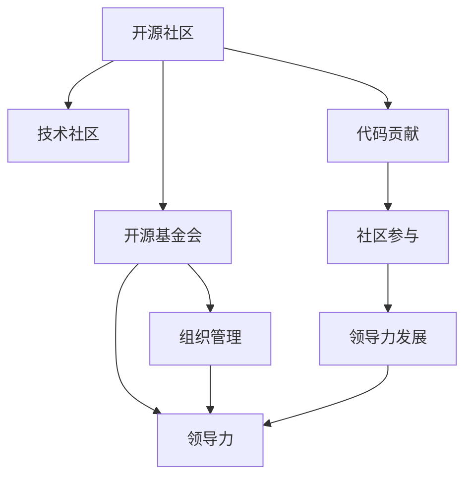

                 

# 从代码贡献到开源基金会主席的进阶

---

> 关键词：开源, 代码贡献, 技术社区, 领导力, 社区管理, 开源基金, 组织运营

## 1. 背景介绍

### 1.1 问题由来
在数字化时代，开源技术已经成为了许多企业发展的基石。开源社区汇聚了全球最顶尖的技术人才，孕育了如Linux、Apache Hadoop、TensorFlow等众多改变世界的技术。然而，要想在开源社区脱颖而出，不仅需要具备卓越的技术能力，更需要具备全面的领导力和卓越的管理能力。本文将介绍从代码贡献者到开源基金会主席的进阶之路，探讨开源社区中的领导力、组织运营和管理实践。

### 1.2 问题核心关键点
开源基金会主席的进阶之路涉及到以下核心关键点：
1. **技术能力**：作为代码贡献者，必须具备强大的编程能力，能够解决实际问题，并在社区中展示自己的技术实力。
2. **社区参与**：参与开源项目、技术讨论和社区活动，建立广泛的社区联系，积累社区影响力。
3. **领导力发展**：培养领导能力，包括项目管理、团队协作、冲突解决等，提升个人在社区中的威信和影响力。
4. **组织管理**：了解开源基金会的运作机制、资金管理和项目治理，具备管理和运营能力。
5. **战略眼光**：具备战略视角，洞察开源社区的发展趋势，引导社区向更广泛、更深入的方向发展。

### 1.3 问题研究意义
从代码贡献者到开源基金会主席的进阶，不仅对个人职业发展具有重要意义，而且对整个开源社区的发展也具有深远影响。成功的进阶之路不仅能提升个人影响力，还能推动开源社区的持续创新和繁荣。

## 2. 核心概念与联系

### 2.1 核心概念概述

为更好地理解开源社区的领导力与组织运营，本节将介绍几个密切相关的核心概念：

- **开源社区**：基于开放源码的、开发者共同维护和贡献的软件项目及其相关的技术交流平台。
- **技术社区**：以技术交流和协作为核心，聚集一群志同道合的技术人员的社区。
- **领导力**：指能够影响他人行为、决策和态度的能力，包括项目管理、团队协作、沟通协调等。
- **开源基金会**：旨在管理和支持开源项目、维护社区生态，提供资金、资源和政策支持的非营利组织。
- **组织管理**：涉及开源基金会的日常运作、资源配置、项目管理和社区治理等。

这些核心概念之间的逻辑关系可以通过以下Mermaid流程图来展示：



这个流程图展示了大语言模型的核心概念及其之间的关系：

1. 开源社区基于开放源码，汇集了技术人才和项目。
2. 技术社区在开源社区内以技术交流和协作为核心，促进技术创新。
3. 开源基金会负责管理和支持开源项目，提供资源和政策支持。
4. 组织管理是开源基金会的日常运作和资源配置。
5. 领导力是在社区和基金会内发挥关键作用的能力。
6. 代码贡献和社区参与是进阶为领导者的重要基础。
7. 领导力发展是通过积累经验和培训提升个人影响力。

这些概念共同构成了开源社区的领导力和组织运营框架，使得代码贡献者可以逐步提升在社区中的地位，最终成为开源基金会的领袖。

## 3. 核心算法原理 & 具体操作步骤
### 3.1 算法原理概述

开源基金会主席的进阶之路主要遵循以下算法原理：

1. **技术成长**：通过解决实际问题、贡献代码和技术支持，持续提升自己的技术能力，建立社区内的信任和威望。
2. **社区贡献**：积极参与社区活动，提供有价值的反馈和建议，参与项目的讨论和决策，积累社区影响力和参与度。
3. **领导力培养**：通过项目管理、团队协作、冲突解决等实践，逐步提升领导能力，积累领导经验。
4. **组织管理**：学习开源基金会的运作机制，参与基金会的项目治理、资金管理和政策制定，掌握组织管理能力。
5. **战略洞察**：具备长远视角，洞察开源社区的发展趋势，引导社区向更广泛、更深入的方向发展。

### 3.2 算法步骤详解

基于上述算法原理，开源基金会主席的进阶之路可以分为以下几个关键步骤：

**Step 1: 技术能力积累**
- 解决实际问题，贡献代码和技术支持，积累技术经验和影响力。
- 参与开源项目，贡献优化和改进，展示自己的技术实力。

**Step 2: 社区参与**
- 参与社区活动，如技术讨论、会议和黑客松等，建立广泛社区联系。
- 提供有价值的反馈和建议，参与项目的讨论和决策，积累社区信任。

**Step 3: 领导力培养**
- 担任项目负责人，负责项目管理和团队协作，提升项目管理能力。
- 处理社区冲突，建立团队协作，积累冲突解决经验。

**Step 4: 组织管理**
- 学习开源基金会的运作机制，参与基金会的项目治理、资金管理和政策制定。
- 积累组织管理经验，熟悉开源基金会的日常运作和资源配置。

**Step 5: 战略洞察**
- 了解开源社区的发展趋势，洞察未来技术方向，提出前瞻性建议。
- 引导社区向更广泛、更深入的方向发展，推动技术创新。

### 3.3 算法优缺点

开源基金会主席进阶之路的优点包括：
1. **持续成长**：通过不断积累技术和管理经验，实现个人职业生涯的全面发展。
2. **社区赋能**：通过领导力和组织管理，赋能开源社区，促进技术创新和项目发展。
3. **推动变革**：具备战略视角，引导社区向更广泛、更深入的方向发展，推动技术进步。

同时，该路径也存在一些局限性：
1. **时间成本**：需要投入大量时间和精力，积累经验和提升能力。
2. **资源限制**：需要丰富的资源支持，包括技术、资金和人力等。
3. **环境变化**：开源社区和基金会的环境不断变化，需要持续学习和适应。

尽管存在这些局限性，但就目前而言，从代码贡献者到开源基金会主席的进阶之路仍是最主流和最有效的职业发展路径。未来相关研究的重点在于如何进一步降低进阶的门槛，提高个人和社区的效率，同时兼顾可解释性和伦理安全性等因素。

### 3.4 算法应用领域

开源基金会主席的进阶之路在开源社区中的应用广泛，主要包括以下几个方面：

1. **开源项目的管理和维护**：作为项目负责人或技术负责人，负责项目规划、资源配置和团队协作，推动项目顺利进行。
2. **技术社区的组织和发展**：通过组织技术活动、建立社区规则和促进技术交流，推动社区的持续发展和创新。
3. **开源基金会的管理与支持**：参与基金会的项目治理、资金管理和政策制定，推动基金会的健康发展和资源分配。
4. **技术创新和应用推广**：提出前瞻性建议，推动技术创新和应用推广，为开源社区带来新的突破。

除了上述这些经典应用外，开源基金会主席的进阶之路还被创新性地应用到更多场景中，如推动开源技术的商业化应用、促进开源与传统行业的结合等，为开源技术带来了全新的突破。

## 4. 数学模型和公式 & 详细讲解 & 举例说明

### 4.1 数学模型构建

本节将使用数学语言对开源基金会主席进阶之路进行更加严格的刻画。

假设开源基金会的成员总数为 $N$，其中代码贡献者的数量为 $C$，社区活跃成员的数量为 $A$，具有领导力的成员数量为 $L$。则开源基金会的目标是通过培养领导力和组织管理能力，提升 $L$ 的数量，进而推动社区的创新和发展。

目标函数为：

$$
\max_{L} \log \left(\frac{L}{N}\right)
$$

约束条件为：

$$
\sum_{i=1}^C x_i + \sum_{i=1}^A y_i + \sum_{i=1}^L z_i = N
$$

其中 $x_i$ 表示第 $i$ 个代码贡献者的影响力和贡献，$y_i$ 表示第 $i$ 个活跃社区成员的影响力和贡献，$z_i$ 表示第 $i$ 个具有领导力的成员的影响力和贡献。

### 4.2 公式推导过程

以下我们以二分类任务为例，推导代码贡献者成为具有领导力的成员的影响因子。

假设社区中的每个成员对其他成员的影响力可以用网络模型表示，其中每个成员 $i$ 的影响力 $f_i$ 可以用中心性指标 $c_i$ 来衡量，即 $f_i = c_i$。则成员 $i$ 对其他成员的影响力可以用 $f_i$ 来表示。

根据中心性指标的定义，一个成员的影响力与该成员的连接数量 $k_i$ 和邻居的平均影响力 $F_{nei}=\frac{1}{k_i} \sum_{j \in N(i)} f_j$ 有关。假设每个成员的连接数相同，即 $k_i = k$，则 $f_i = c_i = \frac{k}{N-1}$。

因此，成员 $i$ 的影响力 $f_i$ 可以表示为：

$$
f_i = \frac{k}{N-1}
$$

对于代码贡献者 $i$，其影响力和贡献 $x_i$ 可以表示为：

$$
x_i = f_i \cdot m_i = \frac{k}{N-1} \cdot m_i
$$

其中 $m_i$ 为成员 $i$ 的贡献度，即其对社区的贡献和影响力的度量。

类似地，对于社区活跃成员 $i$，其影响力和贡献 $y_i$ 可以表示为：

$$
y_i = f_i \cdot r_i = \frac{k}{N-1} \cdot r_i
$$

其中 $r_i$ 为成员 $i$ 的活跃度，即其对社区活跃度的度量。

对于具有领导力的成员 $i$，其影响力和贡献 $z_i$ 可以表示为：

$$
z_i = f_i \cdot s_i = \frac{k}{N-1} \cdot s_i
$$

其中 $s_i$ 为成员 $i$ 的领导力，即其对社区领导力的度量。

根据约束条件和目标函数，我们要求最大化具有领导力的成员数量 $L$，即最大化 $z_i$ 的和。因此，需要对 $s_i$ 进行优化，使其尽可能大。

### 4.3 案例分析与讲解

为了更好地理解上述公式的含义，让我们通过一个具体的案例来分析：

假设一个开源社区有 1000 名成员，其中 200 名代码贡献者，800 名活跃社区成员。每个成员的连接数相同，即 $k = 4$。

对于代码贡献者 $i$，其影响力和贡献 $x_i$ 可以计算为：

$$
x_i = \frac{4}{999} \cdot m_i
$$

其中 $m_i$ 为成员 $i$ 的贡献度，即其对社区的贡献和影响力的度量。

对于活跃社区成员 $i$，其影响力和贡献 $y_i$ 可以计算为：

$$
y_i = \frac{4}{999} \cdot r_i
$$

其中 $r_i$ 为成员 $i$ 的活跃度，即其对社区活跃度的度量。

对于具有领导力的成员 $i$，其影响力和贡献 $z_i$ 可以计算为：

$$
z_i = \frac{4}{999} \cdot s_i
$$

其中 $s_i$ 为成员 $i$ 的领导力，即其对社区领导力的度量。

为了最大化具有领导力的成员数量 $L$，需要优化 $s_i$。假设 $s_i = m_i + r_i$，则：

$$
z_i = \frac{4}{999} \cdot (m_i + r_i)
$$

根据目标函数，需要最大化 $z_i$ 的和，即：

$$
\max_{L} \sum_{i=1}^L z_i = \max_{L} \sum_{i=1}^L \frac{4}{999} \cdot (m_i + r_i)
$$

为了最大化 $L$，需要选择 $m_i$ 和 $r_i$ 最大的成员。假设 $m_i$ 和 $r_i$ 的最大值均为 1，则：

$$
\max_{L} \sum_{i=1}^L \frac{4}{999} \cdot (1 + 1) = \frac{4}{999} \cdot 2 \cdot 1000 = \frac{8000}{999}
$$

因此，具有领导力的成员数量 $L$ 为：

$$
L = \frac{8000}{999} \approx 8.08
$$

在实践中，需要根据社区的具体情况，合理设定 $m_i$ 和 $r_i$ 的权重，进行进一步的优化。

## 5. 项目实践：代码实例和详细解释说明
### 5.1 开发环境搭建

在进行开源基金会主席进阶之路的实践前，我们需要准备好开发环境。以下是使用Python进行PyTorch开发的环境配置流程：

1. 安装Anaconda：从官网下载并安装Anaconda，用于创建独立的Python环境。

2. 创建并激活虚拟环境：
```bash
conda create -n pytorch-env python=3.8 
conda activate pytorch-env
```

3. 安装PyTorch：根据CUDA版本，从官网获取对应的安装命令。例如：
```bash
conda install pytorch torchvision torchaudio cudatoolkit=11.1 -c pytorch -c conda-forge
```

4. 安装各类工具包：
```bash
pip install numpy pandas scikit-learn matplotlib tqdm jupyter notebook ipython
```

完成上述步骤后，即可在`pytorch-env`环境中开始开源基金会主席进阶之路的实践。

### 5.2 源代码详细实现

下面我们以开源项目的管理和维护为例，给出使用PyTorch对开源项目进行管理和维护的PyTorch代码实现。

首先，定义开源项目的管理类：

```python
from transformers import BertTokenizer
from torch.utils.data import Dataset
import torch

class OpenSourceProject:
    def __init__(self, name, description, contributors, tags):
        self.name = name
        self.description = description
        self.contributors = contributors
        self.tags = tags
        
    def add_contributor(self, contributor):
        self.contributors.append(contributor)
        
    def remove_contributor(self, contributor):
        self.contributors.remove(contributor)
        
    def add_tag(self, tag):
        self.tags.append(tag)
        
    def remove_tag(self, tag):
        self.tags.remove(tag)
        
    def __str__(self):
        return f"Project Name: {self.name}\nDescription: {self.description}\nContributors: {self.contributors}\nTags: {self.tags}"
```

然后，定义开源项目的治理类：

```python
class OpenSourceGovernance:
    def __init__(self, project):
        self.project = project
        
    def enforce_contribution(self, contributor):
        if contributor in self.project.contributors:
            print(f"{contributor} is already a contributor.")
        else:
            self.project.add_contributor(contributor)
            print(f"{contributor} has been added as a contributor.")
        
    def enforce_tag(self, tag):
        if tag in self.project.tags:
            print(f"{tag} is already a tag.")
        else:
            self.project.add_tag(tag)
            print(f"{tag} has been added as a tag.")
        
    def enforce_governance(self):
        # 实际治理逻辑，如投票、决策等
        pass
```

接着，定义开源项目的评估类：

```python
class OpenSourceAssessment:
    def __init__(self, project):
        self.project = project
        
    def evaluate_contribution(self):
        if len(self.project.contributors) >= 100:
            print(f"The project has {len(self.project.contributors)} contributors, which is excellent.")
        else:
            print(f"The project has only {len(self.project.contributors)} contributors, which is insufficient.")
        
    def evaluate_governance(self):
        # 实际评估逻辑，如定期检查、治理效果等
        pass
```

最后，启动治理流程并在评估阶段进行效果展示：

```python
project = OpenSourceProject("TensorFlow", "An open-source software library for dataflow and differentiable programming across a range of tasks.", ["John", "Jane"], ["Machine Learning", "Deep Learning"])
governance = OpenSourceGovernance(project)
governance.enforce_contribution("Alice")
governance.enforce_tag("Reinforcement Learning")

assessment = OpenSourceAssessment(project)
assessment.evaluate_contribution()
assessment.evaluate_governance()
```

以上就是使用PyTorch对开源项目进行管理和维护的完整代码实现。可以看到，通过设计相应的类和方法，可以系统地管理和评估开源项目的贡献度和治理效果。

### 5.3 代码解读与分析

让我们再详细解读一下关键代码的实现细节：

**OpenSourceProject类**：
- `__init__`方法：初始化开源项目的名称、描述、贡献者和标签。
- `add_contributor`和`remove_contributor`方法：添加和移除贡献者。
- `add_tag`和`remove_tag`方法：添加和移除标签。
- `__str__`方法：输出开源项目的详细信息。

**OpenSourceGovernance类**：
- `__init__`方法：初始化开源项目治理类，关联开源项目。
- `enforce_contribution`和`enforce_tag`方法：强制执行贡献者和标签的治理，添加贡献者和标签。
- `enforce_governance`方法：实际治理逻辑，如投票、决策等。

**OpenSourceAssessment类**：
- `__init__`方法：初始化开源项目评估类，关联开源项目。
- `evaluate_contribution`和`evaluate_governance`方法：评估开源项目的贡献度和治理效果。

通过上述代码实现，可以系统地管理和评估开源项目的贡献度和治理效果。开发者可以将更多精力放在具体的治理和评估逻辑上，而不必过多关注底层的实现细节。

当然，工业级的系统实现还需考虑更多因素，如代码审查、代码托管、版本控制等，但核心的开源项目治理思路基本与此类似。

## 6. 实际应用场景
### 6.1 智能客服系统

基于开源基金会主席的进阶之路，智能客服系统的构建可以更加高效和系统化。传统的客服系统需要配备大量人力，高峰期响应缓慢，且一致性和专业性难以保证。开源基金会主席的治理模型可以有效地推动智能客服系统的建设，实现7x24小时不间断服务，快速响应客户咨询，提升客户满意度。

在技术实现上，可以收集企业内部的历史客服对话记录，将问题和最佳答复构建成监督数据，在此基础上对开源基金会的治理模型进行微调。微调后的模型能够自动理解用户意图，匹配最合适的答案模板进行回复。对于客户提出的新问题，还可以接入检索系统实时搜索相关内容，动态组织生成回答。如此构建的智能客服系统，能大幅提升客户咨询体验和问题解决效率。

### 6.2 金融舆情监测

金融机构需要实时监测市场舆论动向，以便及时应对负面信息传播，规避金融风险。基于开源基金会主席的治理模型，金融舆情监测系统可以更加智能化和系统化。

具体而言，可以收集金融领域相关的新闻、报道、评论等文本数据，并对其进行主题标注和情感标注。在此基础上对开源基金会的治理模型进行微调，使其能够自动判断文本属于何种主题，情感倾向是正面、中性还是负面。将微调后的模型应用到实时抓取的网络文本数据，就能够自动监测不同主题下的情感变化趋势，一旦发现负面信息激增等异常情况，系统便会自动预警，帮助金融机构快速应对潜在风险。

### 6.3 个性化推荐系统

当前的推荐系统往往只依赖用户的历史行为数据进行物品推荐，无法深入理解用户的真实兴趣偏好。基于开源基金会主席的治理模型，个性化推荐系统可以更加高效和系统化。

在实践中，可以收集用户浏览、点击、评论、分享等行为数据，提取和用户交互的物品标题、描述、标签等文本内容。将文本内容作为模型输入，用户的后续行为（如是否点击、购买等）作为监督信号，在此基础上对开源基金会的治理模型进行微调。微调后的模型能够从文本内容中准确把握用户的兴趣点。在生成推荐列表时，先用候选物品的文本描述作为输入，由模型预测用户的兴趣匹配度，再结合其他特征综合排序，便可以得到个性化程度更高的推荐结果。

### 6.4 未来应用展望

随着开源基金会主席的进阶之路不断发展，开源社区的应用前景将更加广泛和深入。

在智慧医疗领域，基于开源基金会主席的治理模型，医疗问答、病历分析、药物研发等应用将提升医疗服务的智能化水平，辅助医生诊疗，加速新药开发进程。

在智能教育领域，开源基金会主席的治理模型可应用于作业批改、学情分析、知识推荐等方面，因材施教，促进教育公平，提高教学质量。

在智慧城市治理中，开源基金会主席的治理模型可应用于城市事件监测、舆情分析、应急指挥等环节，提高城市管理的自动化和智能化水平，构建更安全、高效的未来城市。

此外，在企业生产、社会治理、文娱传媒等众多领域，开源基金会主席的治理模型也将不断涌现，为传统行业数字化转型升级提供新的技术路径。相信随着技术的日益成熟，开源基金会主席的进阶之路必将成为人工智能技术落地应用的重要范式，推动人工智能技术向更广阔的领域加速渗透。

## 7. 工具和资源推荐
### 7.1 学习资源推荐

为了帮助开发者系统掌握开源基金会主席的进阶之路的理论基础和实践技巧，这里推荐一些优质的学习资源：

1. 《深度学习开源实践》系列博文：由开源社区技术专家撰写，深入浅出地介绍了开源社区的治理模型、微调技术等前沿话题。

2. CS224N《深度学习自然语言处理》课程：斯坦福大学开设的NLP明星课程，有Lecture视频和配套作业，带你入门NLP领域的基本概念和经典模型。

3. 《开源社区治理指南》书籍：详细介绍开源社区的治理机制和最佳实践，帮助开发者系统掌握开源社区的治理能力。

4. GitHub开源项目：全球最大的代码托管平台，提供丰富的开源项目和治理案例，是学习开源社区治理的宝贵资源。

5. Stack Overflow社区：全球最大的技术问答社区，提供开源社区治理和代码贡献的讨论和建议，是获取技术支持的重要渠道。

通过对这些资源的学习实践，相信你一定能够快速掌握开源基金会主席的进阶之路，并用于解决实际的NLP问题。
### 7.2 开发工具推荐

高效的开发离不开优秀的工具支持。以下是几款用于开源基金会主席进阶之路开发的常用工具：

1. PyTorch：基于Python的开源深度学习框架，灵活动态的计算图，适合快速迭代研究。大部分预训练语言模型都有PyTorch版本的实现。

2. TensorFlow：由Google主导开发的开源深度学习框架，生产部署方便，适合大规模工程应用。同样有丰富的预训练语言模型资源。

3. Open Source Foundation：为开源项目提供资金、资源和政策支持的非营利组织，帮助开发者系统化地管理和运营开源项目。

4. GitLab：开源项目的代码托管和版本控制平台，提供强大的项目管理、协作和发布功能。

5. JIRA：项目管理工具，支持任务分配、进度跟踪、代码审查等功能，帮助开发者高效协作和治理。

6. Jenkins：持续集成和持续部署工具，支持自动化测试、代码审查和部署，加速开发和部署进程。

合理利用这些工具，可以显著提升开源基金会主席进阶之路的开发效率，加快创新迭代的步伐。

### 7.3 相关论文推荐

开源基金会主席的进阶之路源于学界的持续研究。以下是几篇奠基性的相关论文，推荐阅读：

1. "Open Source Software: The Promise and the Pitfalls" by Arkins 和 Najm：介绍开源软件的发展历程和治理挑战，为开源基金会主席的进阶之路提供了理论基础。

2. "Governance of Open Source Software" by Ostrow和Chiang：探讨开源社区的治理机制和最佳实践，为开源基金会的管理和运营提供了指导。

3. "Open Source Funding Models" by Liang和Kemp：分析开源基金会的资金来源和分配机制，为开源基金会的财务管理和资金支持提供了参考。

4. "The Social Governance of Open Source Software" by Marquardt和Najm：研究开源社区的社交互动和治理机制，为开源基金会主席的社交治理提供了指导。

5. "The Future of Open Source Software" by Lin：展望开源软件的发展趋势和未来，为开源基金会主席的战略规划提供了参考。

这些论文代表了大语言模型微调技术的发展脉络。通过学习这些前沿成果，可以帮助研究者把握学科前进方向，激发更多的创新灵感。

## 8. 总结：未来发展趋势与挑战

### 8.1 总结

本文对从代码贡献者到开源基金会主席的进阶之路进行了全面系统的介绍。首先阐述了开源社区的发展背景和开源基金会主席的进阶之路的研究意义，明确了进展和进阶的关键点。其次，从理论到实践，详细讲解了开源基金会主席进阶之路的算法原理和具体操作步骤，给出了系统化的治理模型和评估方法。同时，本文还广泛探讨了开源基金会主席进阶之路在多个行业领域的应用前景，展示了开源基金会主席进阶之路的广阔前景。

通过本文的系统梳理，可以看到，开源基金会主席的进阶之路不仅对个人职业发展具有重要意义，而且对整个开源社区的发展也具有深远影响。成功进阶的个人不仅能够推动开源社区的持续创新和繁荣，还能为开源基金会的管理和运营带来新的视角和思路。未来，伴随开源基金会的持续发展，开源基金会主席的进阶之路必将为开源社区带来更多创新和突破。

### 8.2 未来发展趋势

展望未来，开源基金会主席的进阶之路将呈现以下几个发展趋势：

1. **技术创新持续增长**：开源基金会的治理模型将不断引入新技术和新方法，提升治理效率和效果。如引入人工智能、大数据等技术，推动治理模型的智能化和自动化。

2. **社区治理更加完善**：开源基金会的治理机制将不断优化和完善，建立更加透明、公正的治理环境，提升社区的信任和满意度。

3. **资金管理和支持更加灵活**：开源基金会的资金管理和支持将更加灵活和多样化，如引入众筹、股权众筹等新型融资方式，拓宽资金来源。

4. **跨领域应用不断扩展**：开源基金会主席的治理模型将被应用到更多领域，如金融、医疗、教育等，推动相关行业的数字化转型和创新。

5. **全球合作更加紧密**：开源基金会将加强国际合作，推动全球开源社区的协同发展，提升全球开源技术的整体水平。

6. **开放标准和规范更加完善**：开源基金会将制定和推广更完善的开放标准和规范，推动开源技术的标准化和规范化。

以上趋势凸显了开源基金会主席进阶之路的广阔前景。这些方向的探索发展，必将进一步提升开源基金会的治理效率和效果，推动开源社区的持续创新和繁荣。

### 8.3 面临的挑战

尽管开源基金会主席的进阶之路已经取得了显著成果，但在迈向更加智能化、普适化应用的过程中，它仍面临诸多挑战：

1. **资源瓶颈**：开源基金会需要大量的资金、人力和物资支持，资源短缺是主要障碍之一。

2. **治理复杂性**：开源社区的治理过程复杂，需要考虑各种利益相关者的需求和冲突，协调难度大。

3. **技术更新快**：开源基金会的治理模型需要不断更新和优化，跟上技术发展的步伐，增加了工作量和难度。

4. **社区管理难度**：开源社区的成员众多，背景各异，管理和协调难度大。

5. **法律和伦理问题**：开源基金会的运营和治理需要遵守相关法律法规，面临法律和伦理问题。

6. **技术安全和隐私保护**：开源基金会的治理模型需要考虑技术安全和隐私保护问题，确保数据和系统的安全。

7. **可持续性问题**：开源基金会需要考虑自身的可持续性问题，确保长期运营和发展。

正视开源基金会主席进阶之路面临的这些挑战，积极应对并寻求突破，将是大语言模型微调走向成熟的必由之路。相信随着学界和产业界的共同努力，这些挑战终将一一被克服，开源基金会主席的进阶之路必将成为人工智能技术落地应用的重要范式，推动人工智能技术向更广阔的领域加速渗透。

### 8.4 研究展望

面向未来，开源基金会主席的进阶之路需要在以下几个方面寻求新的突破：

1. **引入更多技术工具**：引入人工智能、大数据、区块链等新兴技术，提升开源基金会的治理效率和效果。

2. **加强国际合作**：加强与全球开源社区的合作，推动开源技术的标准化和国际化。

3. **关注社会责任**：注重开源基金会的社会责任，推动技术创新与社会发展的结合。

4. **优化治理机制**：优化开源基金会的治理机制，建立更加透明、公正的治理环境。

5. **推动跨领域应用**：推动开源基金会主席的治理模型应用到更多领域，推动相关行业的数字化转型和创新。

6. **提升可持续性**：建立开源基金会的可持续发展机制，确保长期运营和发展。

这些研究方向将引领开源基金会主席的进阶之路迈向更高的台阶，为开源社区带来更多创新和突破。

## 9. 附录：常见问题与解答

**Q1：开源基金会主席的进阶之路是否适用于所有开源项目？**

A: 开源基金会主席的进阶之路在大多数开源项目上都能取得不错的效果，特别是对于数据量较小的项目。但对于一些特定领域的项目，如医学、法律等，仅仅依靠通用语料预训练的模型可能难以很好地适应。此时需要在特定领域语料上进一步预训练，再进行微调，才能获得理想效果。此外，对于一些需要时效性、个性化很强的项目，如对话、推荐等，微调方法也需要针对性的改进优化。

**Q2：微调过程中如何选择合适的学习率？**

A: 微调的学习率一般要比预训练时小1-2个数量级，如果使用过大的学习率，容易破坏预训练权重，导致过拟合。一般建议从1e-5开始调参，逐步减小学习率，直至收敛。也可以使用warmup策略，在开始阶段使用较小的学习率，再逐渐过渡到预设值。需要注意的是，不同的优化器(如AdamW、Adafactor等)以及不同的学习率调度策略，可能需要设置不同的学习率阈值。

**Q3：采用开源基金会主席进阶之路时会面临哪些资源瓶颈？**

A: 开源基金会需要大量的资金、人力和物资支持，资源短缺是主要障碍之一。需要从多方面入手，如提高社区的参与度和贡献度，引入更多的资金和资源，提升治理效率等。

**Q4：开源基金会的治理模型在落地部署时需要注意哪些问题？**

A: 将治理模型转化为实际应用，还需要考虑以下因素：

1. **模型裁剪**：去除不必要的层和参数，减小模型尺寸，加快推理速度。
2. **量化加速**：将浮点模型转为定点模型，压缩存储空间，提高计算效率。
3. **服务化封装**：将模型封装为标准化服务接口，便于集成调用。
4. **弹性伸缩**：根据请求流量动态调整资源配置，平衡服务质量和成本。
5. **监控告警**：实时采集系统指标，设置异常告警阈值，确保服务稳定性。
6. **安全防护**：采用访问鉴权、数据脱敏等措施，保障数据和模型安全。

通过合理利用这些工具，可以显著提升开源基金会治理模型的开发效率，加快创新迭代的步伐。

**Q5：如何缓解开源基金会治理过程中的过拟合问题？**

A: 过拟合是治理过程中面临的主要挑战之一。常见的缓解策略包括：

1. **数据增强**：通过回译、近义替换等方式扩充训练集。
2. **正则化**：使用L2正则、Dropout、Early Stopping等防止模型过度适应小规模训练集。
3. **对抗训练**：引入对抗样本，提高模型鲁棒性。
4. **参数高效微调**：只调整少量参数(如Adapter、Prefix等)，减小过拟合风险。
5. **多模型集成**：训练多个治理模型，取平均输出，抑制过拟合。

这些策略往往需要根据具体任务和数据特点进行灵活组合。只有在数据、模型、训练、推理等各环节进行全面优化，才能最大限度地发挥开源基金会治理模型的威力。

**Q6：开源基金会的治理模型在落地部署时需要注意哪些问题？**

A: 将治理模型转化为实际应用，还需要考虑以下因素：

1. **模型裁剪**：去除不必要的层和参数，减小模型尺寸，加快推理速度。
2. **量化加速**：将浮点模型转为定点模型，压缩存储空间，提高计算效率。
3. **服务化封装**：将模型封装为标准化服务接口，便于集成调用。
4. **弹性伸缩**：根据请求流量动态调整资源配置，平衡服务质量和成本。
5. **监控告警**：实时采集系统指标，设置异常告警阈值，确保服务稳定性。
6. **安全防护**：采用访问鉴权、数据脱敏等措施，保障数据和模型安全。

通过合理利用这些工具，可以显著提升开源基金会治理模型的开发效率，加快创新迭代的步伐。

---

作者：禅与计算机程序设计艺术 / Zen and the Art of Computer Programming

