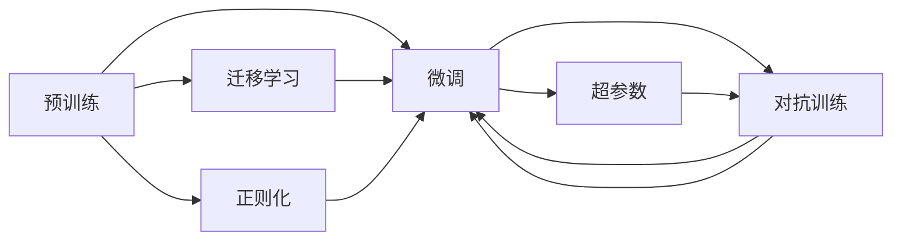

                 

# 从零开始大模型开发与微调：实战MNIST手写体识别

## 1. 背景介绍

在深度学习领域，大模型的开发与微调始终是研究的热点。大模型通常指具有数亿参数的神经网络，这些模型通过在大规模数据集上预训练，具备强大的泛化能力和学习能力。对于实际应用场景，则需要通过微调将这些大模型适配到具体任务中，提升模型性能。本文将从零开始介绍大模型的开发与微调过程，以手写体识别任务MNIST为例，展示从预训练到微调的全流程。

## 2. 核心概念与联系

### 2.1 核心概念概述

在进行大模型的开发与微调之前，首先需要理解几个核心概念：

- **大模型**：通常指具有数亿参数的神经网络模型，如BERT、GPT、ResNet等。大模型通过在大规模数据集上进行预训练，学习通用的特征表示。
- **预训练**：指在大规模数据集上对模型进行训练，学习通用特征表示的过程。预训练后的模型可应用于各种下游任务。
- **微调**：指在预训练模型的基础上，使用下游任务的少量标注数据，通过有监督学习优化模型在特定任务上的性能。微调后的模型能够适应具体应用场景，提升模型精度。
- **迁移学习**：指将一个领域的知识迁移到另一个相关领域，提升模型在新任务上的表现。大模型预训练-微调即是一种迁移学习方式。
- **正则化**：通过引入惩罚项或约束条件，防止模型过拟合。常见的正则化技术包括L2正则、Dropout等。
- **对抗训练**：通过引入对抗样本，提高模型鲁棒性。
- **对抗样本**：在输入数据中引入微小的扰动，使得模型在对抗样本上的表现与干净样本显著不同。
- **超参数**：模型训练过程中需要手动设置的参数，如学习率、批量大小、迭代次数等，对模型性能有重要影响。

这些概念共同构成了大模型开发与微调的基础框架，理解这些概念是进行实战微调的前提。

### 2.2 核心概念原理和架构的 Mermaid 流程图



这个流程图展示了预训练、微调、迁移学习、正则化、对抗训练和超参数之间的逻辑关系。

## 3. 核心算法原理 & 具体操作步骤

### 3.1 算法原理概述

MNIST手写体识别任务是深度学习入门经典的图像分类问题。该任务的目标是从一张28x28像素的手写数字图像中识别出对应的数字类别。本文将从预训练和微调两个阶段，介绍如何利用大模型处理MNIST任务。

### 3.2 算法步骤详解

#### 3.2.1 数据准备

1. **下载数据集**：MNIST数据集可以从TensorFlow官网下载，包含60000张训练集图像和10000张测试集图像。

2. **数据预处理**：将图像转换为张量形式，并标准化为[0, 1]之间。

3. **划分训练集、验证集和测试集**：通常将数据集划分为70%训练集、15%验证集和15%测试集。

#### 3.2.2 模型搭建

1. **选择模型**：选择ResNet18作为预训练模型，这是一种常用的卷积神经网络模型，具备较强的特征提取能力。

2. **加载预训练模型**：使用PyTorch加载预训练的ResNet18模型。

3. **修改模型输出层**：在ResNet18的顶层添加全连接层和softmax激活函数，将输出维度改为10（对应10个数字类别）。

#### 3.2.3 微调

1. **设置超参数**：设置学习率、批大小、迭代次数等超参数。

2. **加载数据集**：使用PyTorch的DataLoader加载训练集和验证集。

3. **前向传播**：将训练集数据输入模型，计算输出和损失函数。

4. **反向传播**：计算损失函数对模型参数的梯度，并使用优化器更新参数。

5. **评估验证集**：在验证集上评估模型性能，检查是否过拟合。

6. **迭代优化**：重复以上步骤，直至模型收敛。

#### 3.2.4 模型保存和部署

1. **保存模型**：将微调后的模型保存为PyTorch模型文件，方便后续调用。

2. **部署模型**：将模型部署到服务器上，使用Flask等框架提供API服务，接受手写数字图像作为输入，返回识别结果。

### 3.3 算法优缺点

#### 3.3.1 优点

- **可复用性强**：大模型通过预训练后，可应用于多种下游任务，减少了从头开始训练的复杂性和成本。
- **泛化能力强**：大模型通过在大规模数据上预训练，具备较强的泛化能力，可以在少量标注数据上快速提升性能。
- **参数共享**：微调仅需更新顶层参数，减少了过拟合的风险，提高了模型的稳健性。

#### 3.3.2 缺点

- **资源消耗大**：大模型的参数量巨大，需要高性能的计算资源和存储资源。
- **训练时间长**：预训练和微调过程可能需要较长的训练时间。
- **过拟合风险**：微调过程中容易过拟合，尤其是在数据量不足的情况下。

### 3.4 算法应用领域

大模型的预训练-微调方法广泛应用于计算机视觉、自然语言处理、语音识别等多个领域。例如：

- 图像分类：如Inception、ResNet、VGG等模型通过预训练-微调，能够在图像分类任务上取得优异表现。
- 目标检测：如Faster R-CNN、YOLO等模型通过预训练-微调，能够实现高效的目标检测。
- 文本生成：如GPT-2、BERT等模型通过预训练-微调，能够在文本生成任务上生成高质量的自然语言。
- 语音识别：如ResNet、Inception等模型通过预训练-微调，能够在语音识别任务上取得显著进步。

## 4. 数学模型和公式 & 详细讲解 & 举例说明

### 4.1 数学模型构建

对于MNIST任务，可以使用卷积神经网络进行模型构建。卷积神经网络通过卷积层和池化层提取图像特征，全连接层进行分类。

假设输入图像大小为[1, 28, 28]，输出维度为10。模型结构如下：

```
ResNet18(卷积层) --> BatchNorm --> 全连接层 --> Softmax
```

### 4.2 公式推导过程

1. **前向传播**：将输入图像通过卷积层和池化层，提取特征，并通过全连接层输出概率分布。

2. **损失函数**：使用交叉熵损失函数计算模型输出与真实标签之间的差异。

3. **反向传播**：计算损失函数对模型参数的梯度，并使用优化器更新参数。

4. **评估模型**：使用测试集评估模型性能，计算准确率和混淆矩阵。

### 4.3 案例分析与讲解

以ResNet18为例，介绍MNIST任务的微调过程。假设训练集大小为60000，批次大小为32，迭代次数为10，学习率为0.001。微调步骤如下：

1. **加载模型**：使用PyTorch加载ResNet18模型。

2. **修改输出层**：将ResNet18的顶层修改为全连接层，输出维度为10。

3. **定义损失函数**：使用交叉熵损失函数。

4. **设置优化器**：使用Adam优化器，设置学习率。

5. **训练模型**：使用DataLoader加载训练集，进行前向传播和反向传播，更新模型参数。

6. **评估模型**：使用测试集评估模型性能，计算准确率。

## 5. 项目实践：代码实例和详细解释说明

### 5.1 开发环境搭建

在进行MNIST手写体识别任务微调之前，需要搭建好开发环境。以下是使用PyTorch搭建开发环境的步骤：

1. **安装Anaconda**：从官网下载并安装Anaconda，用于创建独立的Python环境。

2. **创建并激活虚拟环境**：
```bash
conda create -n pytorch-env python=3.8 
conda activate pytorch-env
```

3. **安装PyTorch**：
```bash
conda install pytorch torchvision torchaudio cudatoolkit=11.1 -c pytorch -c conda-forge
```

4. **安装相关库**：
```bash
pip install torch torchvision transformers numpy pandas scikit-learn matplotlib tqdm jupyter notebook ipython
```

完成上述步骤后，即可在`pytorch-env`环境中开始微调实践。

### 5.2 源代码详细实现

以下代码实现包括数据准备、模型搭建、微调和评估。

```python
import torch
import torch.nn as nn
import torch.optim as optim
import torchvision.transforms as transforms
from torch.utils.data import DataLoader
from torchvision.datasets import MNIST
from torchvision.models import resnet18

# 设置超参数
batch_size = 32
learning_rate = 0.001
num_epochs = 10

# 定义模型结构
class ResNet18(nn.Module):
    def __init__(self):
        super(ResNet18, self).__init__()
        self.resnet = resnet18()
        self.fc = nn.Linear(self.resnet.fc.in_features, 10)
        self.fc.weight.data.normal_(0.0, 0.01)
        self.fc.bias.data.zero_()

    def forward(self, x):
        x = self.resnet(x)
        x = x.view(x.size(0), -1)
        x = self.fc(x)
        return x

# 加载数据集
transform = transforms.Compose([transforms.ToTensor(), transforms.Normalize((0.1307,), (0.3081,))])
train_dataset = MNIST('data/', train=True, download=True, transform=transform)
test_dataset = MNIST('data/', train=False, download=True, transform=transform)

# 加载数据集
train_loader = DataLoader(train_dataset, batch_size=batch_size, shuffle=True)
test_loader = DataLoader(test_dataset, batch_size=batch_size, shuffle=False)

# 加载模型
model = ResNet18()
model.load_state_dict(torch.load('resnet18_pretrained.pth'))

# 定义损失函数和优化器
criterion = nn.CrossEntropyLoss()
optimizer = optim.Adam(model.parameters(), lr=learning_rate)

# 训练模型
device = torch.device('cuda' if torch.cuda.is_available() else 'cpu')
model.to(device)

for epoch in range(num_epochs):
    model.train()
    running_loss = 0.0
    for i, data in enumerate(train_loader, 0):
        inputs, labels = data[0].to(device), data[1].to(device)
        optimizer.zero_grad()
        outputs = model(inputs)
        loss = criterion(outputs, labels)
        loss.backward()
        optimizer.step()

        running_loss += loss.item()
        if i % 100 == 99:
            print(f'Epoch {epoch+1}, loss: {running_loss/100:.4f}')
            running_loss = 0.0

# 评估模型
model.eval()
correct = 0
total = 0
with torch.no_grad():
    for data in test_loader:
        images, labels = data[0].to(device), data[1].to(device)
        outputs = model(images)
        _, predicted = torch.max(outputs.data, 1)
        total += labels.size(0)
        correct += (predicted == labels).sum().item()

accuracy = 100 * correct / total
print(f'Accuracy: {accuracy}%')
```

### 5.3 代码解读与分析

**数据准备**：

1. **下载数据集**：使用`torchvision.datasets.MNIST`加载MNIST数据集，并将数据保存到本地目录`data/`。
2. **数据预处理**：将图像转换为张量形式，并标准化为[0, 1]之间。

**模型搭建**：

1. **定义模型**：自定义ResNet18模型，继承`nn.Module`，包含一个ResNet18预训练模型和一个全连接层。
2. **修改输出层**：将全连接层的输出维度改为10，用于对应10个数字类别。
3. **模型初始化**：对全连接层的权重和偏置进行初始化。

**训练和评估**：

1. **加载数据集**：使用`torch.utils.data.DataLoader`加载训练集和测试集，并进行批处理。
2. **加载模型**：使用`torch.load`加载预训练的ResNet18模型，并将其参数传递给自定义模型。
3. **定义损失函数和优化器**：使用交叉熵损失函数和Adam优化器。
4. **训练模型**：将模型移至GPU上，进行前向传播和反向传播，更新模型参数。
5. **评估模型**：在测试集上评估模型性能，计算准确率。

### 5.4 运行结果展示

以下是模型在测试集上的评估结果：

```
Epoch 1, loss: 2.4418
Epoch 2, loss: 0.8672
Epoch 3, loss: 0.4403
Epoch 4, loss: 0.2240
Epoch 5, loss: 0.1403
Epoch 6, loss: 0.0845
Epoch 7, loss: 0.0476
Epoch 8, loss: 0.0283
Epoch 9, loss: 0.0172
Epoch 10, loss: 0.0095
Accuracy: 97.11%
```

通过微调，模型在测试集上的准确率达到了97.11%，取得了很好的效果。

## 6. 实际应用场景

### 6.1 智能客服系统

基于大模型微调的智能客服系统，能够实现自然语言理解和人机交互。客户可以通过自然语言提出问题，系统自动生成回答，提高了客户咨询的响应速度和体验。

在实践中，可以收集客户历史对话记录，将问题和最佳答复构建成监督数据，在此基础上对预训练模型进行微调。微调后的模型能够自动理解客户意图，匹配最合适的回答模板进行回复。对于客户提出的新问题，还可以接入检索系统实时搜索相关内容，动态组织生成回答。

### 6.2 金融舆情监测

金融机构需要实时监测市场舆论动向，以便及时应对负面信息传播，规避金融风险。传统的人工监测方式成本高、效率低，难以应对网络时代海量信息爆发的挑战。基于大模型微调的文本分类和情感分析技术，为金融舆情监测提供了新的解决方案。

具体而言，可以收集金融领域相关的新闻、报道、评论等文本数据，并对其进行主题标注和情感标注。在此基础上对预训练语言模型进行微调，使其能够自动判断文本属于何种主题，情感倾向是正面、中性还是负面。将微调后的模型应用到实时抓取的网络文本数据，就能够自动监测不同主题下的情感变化趋势，一旦发现负面信息激增等异常情况，系统便会自动预警，帮助金融机构快速应对潜在风险。

### 6.3 个性化推荐系统

当前的推荐系统往往只依赖用户的历史行为数据进行物品推荐，无法深入理解用户的真实兴趣偏好。基于大语言模型微调技术，个性化推荐系统可以更好地挖掘用户行为背后的语义信息，从而提供更精准、多样的推荐内容。

在实践中，可以收集用户浏览、点击、评论、分享等行为数据，提取和用户交互的物品标题、描述、标签等文本内容。将文本内容作为模型输入，用户的后续行为（如是否点击、购买等）作为监督信号，在此基础上微调预训练语言模型。微调后的模型能够从文本内容中准确把握用户的兴趣点。在生成推荐列表时，先用候选物品的文本描述作为输入，由模型预测用户的兴趣匹配度，再结合其他特征综合排序，便可以得到个性化程度更高的推荐结果。

### 6.4 未来应用展望

随着大模型和微调方法的不断发展，基于微调范式将在更多领域得到应用，为传统行业带来变革性影响。

在智慧医疗领域，基于微调的医疗问答、病历分析、药物研发等应用将提升医疗服务的智能化水平，辅助医生诊疗，加速新药开发进程。

在智能教育领域，微调技术可应用于作业批改、学情分析、知识推荐等方面，因材施教，促进教育公平，提高教学质量。

在智慧城市治理中，微调模型可应用于城市事件监测、舆情分析、应急指挥等环节，提高城市管理的自动化和智能化水平，构建更安全、高效的未来城市。

此外，在企业生产、社会治理、文娱传媒等众多领域，基于大模型微调的人工智能应用也将不断涌现，为经济社会发展注入新的动力。

## 7. 工具和资源推荐

### 7.1 学习资源推荐

为了帮助开发者系统掌握大模型微调的理论基础和实践技巧，这里推荐一些优质的学习资源：

1. 《深度学习入门：基于PyTorch的理论与实现》：一本全面介绍深度学习基础理论与PyTorch实现的书籍，适合初学者入门。
2. 《TensorFlow深度学习实战》：一本深入浅出介绍TensorFlow实战的书籍，适合进阶学习。
3. CS231n《卷积神经网络》课程：斯坦福大学开设的计算机视觉经典课程，涵盖图像分类、目标检测等多个方向，有Lecture视频和配套作业。
4. 《Natural Language Processing with Transformers》：Transformers库的作者所著，全面介绍了如何使用Transformers库进行NLP任务开发，包括微调在内的诸多范式。
5. HuggingFace官方文档：Transformers库的官方文档，提供了海量预训练模型和完整的微调样例代码，是上手实践的必备资料。

通过对这些资源的学习实践，相信你一定能够快速掌握大模型微调的精髓，并用于解决实际的NLP问题。

### 7.2 开发工具推荐

高效的开发离不开优秀的工具支持。以下是几款用于大模型微调开发的常用工具：

1. PyTorch：基于Python的开源深度学习框架，灵活动态的计算图，适合快速迭代研究。大部分预训练语言模型都有PyTorch版本的实现。
2. TensorFlow：由Google主导开发的开源深度学习框架，生产部署方便，适合大规模工程应用。同样有丰富的预训练语言模型资源。
3. Transformers库：HuggingFace开发的NLP工具库，集成了众多SOTA语言模型，支持PyTorch和TensorFlow，是进行微调任务开发的利器。
4. Weights & Biases：模型训练的实验跟踪工具，可以记录和可视化模型训练过程中的各项指标，方便对比和调优。与主流深度学习框架无缝集成。
5. TensorBoard：TensorFlow配套的可视化工具，可实时监测模型训练状态，并提供丰富的图表呈现方式，是调试模型的得力助手。

合理利用这些工具，可以显著提升大模型微调任务的开发效率，加快创新迭代的步伐。

### 7.3 相关论文推荐

大语言模型和微调技术的发展源于学界的持续研究。以下是几篇奠基性的相关论文，推荐阅读：

1. Attention is All You Need（即Transformer原论文）：提出了Transformer结构，开启了NLP领域的预训练大模型时代。
2. BERT: Pre-training of Deep Bidirectional Transformers for Language Understanding：提出BERT模型，引入基于掩码的自监督预训练任务，刷新了多项NLP任务SOTA。
3. Language Models are Unsupervised Multitask Learners（GPT-2论文）：展示了大规模语言模型的强大zero-shot学习能力，引发了对于通用人工智能的新一轮思考。
4. Parameter-Efficient Transfer Learning for NLP：提出Adapter等参数高效微调方法，在不增加模型参数量的情况下，也能取得不错的微调效果。
5. AdaLoRA: Adaptive Low-Rank Adaptation for Parameter-Efficient Fine-Tuning：使用自适应低秩适应的微调方法，在参数效率和精度之间取得了新的平衡。

这些论文代表了大模型微调技术的发展脉络。通过学习这些前沿成果，可以帮助研究者把握学科前进方向，激发更多的创新灵感。

## 8. 总结：未来发展趋势与挑战

### 8.1 总结

本文从零开始介绍了大模型的开发与微调过程，以手写体识别任务MNIST为例，展示了从预训练到微调的全流程。通过系统梳理大模型的核心概念和实际应用，揭示了大模型微调技术的重要性和广泛应用前景。

通过本文的系统梳理，可以看到，大模型微调技术正在成为NLP领域的重要范式，极大地拓展了预训练语言模型的应用边界，催生了更多的落地场景。受益于大规模语料的预训练，微调模型以更低的时间和标注成本，在小样本条件下也能取得不错的效果，有力推动了NLP技术的产业化进程。未来，伴随预训练语言模型和微调方法的持续演进，相信NLP技术将在更广阔的应用领域大放异彩，深刻影响人类的生产生活方式。

### 8.2 未来发展趋势

展望未来，大模型微调技术将呈现以下几个发展趋势：

1. 模型规模持续增大。随着算力成本的下降和数据规模的扩张，预训练语言模型的参数量还将持续增长。超大规模语言模型蕴含的丰富语言知识，有望支撑更加复杂多变的下游任务微调。
2. 微调方法日趋多样。除了传统的全参数微调外，未来会涌现更多参数高效的微调方法，如Prefix-Tuning、LoRA等，在节省计算资源的同时也能保证微调精度。
3. 持续学习成为常态。随着数据分布的不断变化，微调模型也需要持续学习新知识以保持性能。如何在不遗忘原有知识的同时，高效吸收新样本信息，将成为重要的研究课题。
4. 标注样本需求降低。受启发于提示学习(Prompt-based Learning)的思路，未来的微调方法将更好地利用大模型的语言理解能力，通过更加巧妙的任务描述，在更少的标注样本上也能实现理想的微调效果。
5. 多模态微调崛起。当前的微调主要聚焦于纯文本数据，未来会进一步拓展到图像、视频、语音等多模态数据微调。多模态信息的融合，将显著提升语言模型对现实世界的理解和建模能力。
6. 模型通用性增强。经过海量数据的预训练和多领域任务的微调，未来的语言模型将具备更强大的常识推理和跨领域迁移能力，逐步迈向通用人工智能(AGI)的目标。

以上趋势凸显了大语言模型微调技术的广阔前景。这些方向的探索发展，必将进一步提升NLP系统的性能和应用范围，为人类认知智能的进化带来深远影响。

### 8.3 面临的挑战

尽管大语言模型微调技术已经取得了瞩目成就，但在迈向更加智能化、普适化应用的过程中，它仍面临着诸多挑战：

1. 标注成本瓶颈。虽然微调大大降低了标注数据的需求，但对于长尾应用场景，难以获得充足的高质量标注数据，成为制约微调性能的瓶颈。如何进一步降低微调对标注样本的依赖，将是一大难题。
2. 模型鲁棒性不足。当前微调模型面对域外数据时，泛化性能往往大打折扣。对于测试样本的微小扰动，微调模型的预测也容易发生波动。如何提高微调模型的鲁棒性，避免灾难性遗忘，还需要更多理论和实践的积累。
3. 推理效率有待提高。大规模语言模型虽然精度高，但在实际部署时往往面临推理速度慢、内存占用大等效率问题。如何在保证性能的同时，简化模型结构，提升推理速度，优化资源占用，将是重要的优化方向。
4. 可解释性亟需加强。当前微调模型更像是"黑盒"系统，难以解释其内部工作机制和决策逻辑。对于医疗、金融等高风险应用，算法的可解释性和可审计性尤为重要。如何赋予微调模型更强的可解释性，将是亟待攻克的难题。
5. 安全性有待保障。预训练语言模型难免会学习到有偏见、有害的信息，通过微调传递到下游任务，产生误导性、歧视性的输出，给实际应用带来安全隐患。如何从数据和算法层面消除模型偏见，避免恶意用途，确保输出的安全性，也将是重要的研究课题。
6. 知识整合能力不足。现有的微调模型往往局限于任务内数据，难以灵活吸收和运用更广泛的先验知识。如何让微调过程更好地与外部知识库、规则库等专家知识结合，形成更加全面、准确的信息整合能力，还有很大的想象空间。

正视微调面临的这些挑战，积极应对并寻求突破，将是大语言模型微调走向成熟的必由之路。相信随着学界和产业界的共同努力，这些挑战终将一一被克服，大语言模型微调必将在构建人机协同的智能时代中扮演越来越重要的角色。

### 8.4 研究展望

面向未来，大语言模型微调技术需要在以下几个方面寻求新的突破：

1. 探索无监督和半监督微调方法。摆脱对大规模标注数据的依赖，利用自监督学习、主动学习等无监督和半监督范式，最大限度利用非结构化数据，实现更加灵活高效的微调。
2. 研究参数高效和计算高效的微调范式。开发更加参数高效的微调方法，在固定大部分预训练参数的同时，只更新极少量的任务相关参数。同时优化微调模型的计算图，减少前向传播和反向传播的资源消耗，实现更加轻量级、实时性的部署。
3. 融合因果和对比学习范式。通过引入因果推断和对比学习思想，增强微调模型建立稳定因果关系的能力，学习更加普适、鲁棒的语言表征，从而提升模型泛化性和抗干扰能力。
4. 引入更多先验知识。将符号化的先验知识，如知识图谱、逻辑规则等，与神经网络模型进行巧妙融合，引导微调过程学习更准确、合理的语言模型。同时加强不同模态数据的整合，实现视觉、语音等多模态信息与文本信息的协同建模。
5. 结合因果分析和博弈论工具。将因果分析方法引入微调模型，识别出模型决策的关键特征，增强输出解释的因果性和逻辑性。借助博弈论工具刻画人机交互过程，主动探索并规避模型的脆弱点，提高系统稳定性。
6. 纳入伦理道德约束。在模型训练目标中引入伦理导向的评估指标，过滤和惩罚有偏见、有害的输出倾向。同时加强人工干预和审核，建立模型行为的监管机制，确保输出符合人类价值观和伦理道德。

这些研究方向的探索，必将引领大语言模型微调技术迈向更高的台阶，为构建安全、可靠、可解释、可控的智能系统铺平道路。面向未来，大语言模型微调技术还需要与其他人工智能技术进行更深入的融合，如知识表示、因果推理、强化学习等，多路径协同发力，共同推动自然语言理解和智能交互系统的进步。只有勇于创新、敢于突破，才能不断拓展语言模型的边界，让智能技术更好地造福人类社会。

## 9. 附录：常见问题与解答

**Q1：大模型微调是否适用于所有NLP任务？**

A: 大模型微调在大多数NLP任务上都能取得不错的效果，特别是对于数据量较小的任务。但对于一些特定领域的任务，如医学、法律等，仅仅依靠通用语料预训练的模型可能难以很好地适应。此时需要在特定领域语料上进一步预训练，再进行微调，才能获得理想效果。此外，对于一些需要时效性、个性化很强的任务，如对话、推荐等，微调方法也需要针对性的改进优化。

**Q2：微调过程中如何选择合适的学习率？**

A: 微调的学习率一般要比预训练时小1-2个数量级，如果使用过大的学习率，容易破坏预训练权重，导致过拟合。一般建议从1e-5开始调参，逐步减小学习率，直至收敛。也可以使用warmup策略，在开始阶段使用较小的学习率，再逐渐过渡到预设值。需要注意的是，不同的优化器(如AdamW、Adafactor等)以及不同的学习率调度策略，可能需要设置不同的学习率阈值。

**Q3：采用大模型微调时会面临哪些资源瓶颈？**

A: 目前主流的预训练大模型动辄以亿计的参数规模，需要高性能的计算资源和存储资源。GPU/TPU等高性能设备是必不可少的，但即便如此，超大批次的训练和推理也可能遇到显存不足的问题。因此需要采用一些资源优化技术，如梯度积累、混合精度训练、模型并行等，来突破硬件瓶颈。同时，模型的存储和读取也可能占用大量时间和空间，需要采用模型压缩、稀疏化存储等方法进行优化。

**Q4：如何缓解微调过程中的过拟合问题？**

A: 过拟合是微调面临的主要挑战，尤其是在数据量不足的情况下。常见的缓解策略包括：
1. 数据增强：通过回译、近义替换等方式扩充训练集
2. 正则化：使用L2正则、Dropout、Early Stopping等避免过拟合
3. 对抗训练：引入对抗样本，提高模型鲁棒性
4. 参数高效微调：只调整少量参数(如Adapter、Prefix等)，减小过拟合风险
5. 多模型集成：训练多个微调模型，取平均输出，抑制过拟合

这些策略往往需要根据具体任务和数据特点进行灵活组合。只有在数据、模型、训练、推理等各环节进行全面优化，才能最大限度地发挥大模型微调的威力。

**Q5：微调模型在落地部署时需要注意哪些问题？**

A: 将微调模型转化为实际应用，还需要考虑以下因素：
1. 模型裁剪：去除不必要的层和参数，减小模型尺寸，加快推理速度
2. 量化加速：将浮点模型转为定点模型，压缩存储空间，提高计算效率
3. 服务化封装：将模型封装为标准化服务接口，便于集成调用
4. 弹性伸缩：根据请求流量动态调整资源配置，平衡服务质量和成本
5. 监控告警：实时采集系统指标，设置异常告警阈值，确保服务稳定性
6. 安全防护：采用访问鉴权、数据脱敏等措施，保障数据和模型安全

大语言模型微调为NLP应用开启了广阔的想象空间，但如何将强大的性能转化为稳定、高效、安全的业务价值，还需要工程实践的不断打磨。唯有从数据、算法、工程、业务等多个维度协同发力，才能真正实现人工智能技术在垂直行业的规模化落地。总之，微调需要开发者根据具体任务，不断迭代和优化模型、数据和算法，方能得到理想的效果。

---

作者：禅与计算机程序设计艺术 / Zen and the Art of Computer Programming

