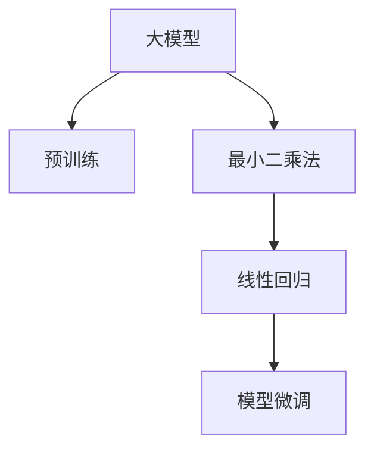

                 

# 从零开始大模型开发与微调：最小二乘法详解

> 关键词：最小二乘法, 线性回归, 大模型开发, 模型微调, 参数更新, 损失函数

## 1. 背景介绍

在人工智能（AI）领域，模型开发与微调是构建高性能预测模型的关键步骤。线性回归是最常见的模型之一，它在多个领域都有广泛应用，例如金融预测、股票分析、市场趋势预测等。然而，随着深度学习技术的崛起，大型预训练模型在模型微调中占据了重要地位。本文将详细介绍从零开始开发大型预训练模型（大模型），并深入讨论最小二乘法在大模型微调中的应用。

## 2. 核心概念与联系

### 2.1 核心概念概述

- **大模型**：指拥有数亿甚至数十亿参数的大型神经网络模型。这些模型通常是通过在大规模无标签数据上进行预训练，然后通过微调来适应特定任务。
- **最小二乘法**：是一种线性回归方法，通过最小化数据点与模型预测值之间的误差平方和来估计模型参数。
- **线性回归**：一个简单的线性模型，通过学习输入特征和输出值之间的线性关系来预测新的输出值。
- **模型微调**：在预训练模型基础上，通过特定任务的标注数据来调整模型参数，使其能够更好地适应该任务。

这些概念之间的联系通过以下Mermaid流程图来展示：



大模型开发通常涉及预训练和微调两个步骤。预训练阶段在大规模数据上对模型进行训练，使其能够学习到通用的语言或图像表示。微调阶段则是在特定任务上，通过标注数据调整模型参数，使其能够更好地适应该任务。最小二乘法是微调过程中的一种常用方法，通过最小化预测误差来优化模型参数。

## 3. 核心算法原理 & 具体操作步骤

### 3.1 算法原理概述

最小二乘法是一种常见的线性回归方法，通过最小化误差平方和来估计模型参数。在模型微调中，我们希望将模型输出与真实标签之间的误差最小化，以获得最佳的模型参数。

给定一组输入特征 $\boldsymbol{x} = [x_1, x_2, ..., x_n]^T$ 和一个真实标签 $\boldsymbol{y}$，我们希望找到一个线性模型 $y = \boldsymbol{w}^T\boldsymbol{x} + b$，其中 $\boldsymbol{w}$ 是权重向量，$b$ 是偏置项。最小二乘法的目标是最小化预测误差 $\boldsymbol{e} = \boldsymbol{y} - \boldsymbol{w}^T\boldsymbol{x} - b$ 的平方和 $||\boldsymbol{e}||^2$。

最小二乘法的数学公式为：

$$
\boldsymbol{w} = \mathop{\arg\min}_{\boldsymbol{w}, b} ||\boldsymbol{e}||^2 = \mathop{\arg\min}_{\boldsymbol{w}, b} \sum_{i=1}^N (y_i - \boldsymbol{w}^T\boldsymbol{x}_i - b)^2
$$

### 3.2 算法步骤详解

最小二乘法在大模型微调中的应用步骤如下：

1. **数据准备**：收集标注数据集 $D = \{(\boldsymbol{x}_i, y_i)\}_{i=1}^N$，其中 $\boldsymbol{x}_i$ 是输入特征向量，$y_i$ 是真实标签。
2. **初始化模型参数**：给定预训练模型 $M_{\theta_0}$，初始化权重向量 $\boldsymbol{w}_0$ 和偏置项 $b_0$。
3. **前向传播**：对输入特征 $\boldsymbol{x}$ 进行前向传播，计算预测值 $\hat{y} = \boldsymbol{w}^T\boldsymbol{x} + b$。
4. **计算误差**：计算预测误差 $\boldsymbol{e} = \boldsymbol{y} - \hat{y}$。
5. **计算损失函数**：计算误差平方和 $L = ||\boldsymbol{e}||^2$。
6. **反向传播**：计算损失函数对权重和偏置的梯度，更新模型参数 $\boldsymbol{w} = \boldsymbol{w}_0 + \alpha\boldsymbol{g}_w$，$b = b_0 + \alpha g_b$，其中 $\alpha$ 是学习率，$\boldsymbol{g}_w$ 和 $g_b$ 是梯度。
7. **迭代更新**：重复步骤3到6，直至收敛或达到预设的迭代次数。

### 3.3 算法优缺点

最小二乘法在大模型微调中的优点包括：

- **易于理解**：数学原理简单，易于实现和理解。
- **收敛速度快**：由于最小二乘法是局部最优化算法，通常收敛速度较快。
- **鲁棒性好**：对异常值不敏感，能够有效处理噪声数据。

缺点包括：

- **过拟合风险**：若训练数据量较少，模型可能过拟合。
- **难以处理非线性关系**：最小二乘法假设数据点服从线性关系，对于非线性关系的数据集可能表现不佳。
- **计算复杂度高**：对于大规模数据集，计算代价较高。

### 3.4 算法应用领域

最小二乘法在大模型微调中的应用非常广泛，以下是几个主要领域：

- **金融预测**：用于股票价格、市场趋势等的预测。
- **气象预测**：预测天气变化、气候趋势等。
- **推荐系统**：为用户推荐产品或内容。
- **图像分类**：通过调整预训练模型参数，实现图像分类任务。
- **文本分类**：用于新闻分类、情感分析等。

## 4. 数学模型和公式 & 详细讲解 & 举例说明

### 4.1 数学模型构建

给定 $N$ 个训练样本 $(\boldsymbol{x}_i, y_i)$，其中 $\boldsymbol{x}_i$ 是 $d$ 维的输入特征向量，$y_i$ 是 $1$ 维的真实标签。我们的目标是找到最优的权重向量 $\boldsymbol{w}$ 和偏置项 $b$，使得预测值 $\hat{y} = \boldsymbol{w}^T\boldsymbol{x}_i + b$ 尽可能接近真实标签 $y_i$。

### 4.2 公式推导过程

最小二乘法的目标是找到使得预测误差平方和最小的 $\boldsymbol{w}$ 和 $b$。具体来说，我们希望最小化：

$$
L = \sum_{i=1}^N (y_i - \boldsymbol{w}^T\boldsymbol{x}_i - b)^2
$$

为了求导，我们首先对误差平方和进行求导：

$$
\frac{\partial L}{\partial w_j} = \sum_{i=1}^N -2(y_i - \boldsymbol{w}^T\boldsymbol{x}_i - b)x_{i,j}
$$

$$
\frac{\partial L}{\partial b} = -2\sum_{i=1}^N (y_i - \boldsymbol{w}^T\boldsymbol{x}_i - b)
$$

将导数设置为零，我们可以得到：

$$
\boldsymbol{w} = (\boldsymbol{X}^T\boldsymbol{X})^{-1}\boldsymbol{X}^T\boldsymbol{y}
$$

$$
b = \bar{y} - \boldsymbol{w}^T\boldsymbol{\bar{x}}
$$

其中 $\boldsymbol{X} = [\boldsymbol{x}_1, \boldsymbol{x}_2, ..., \boldsymbol{x}_n]^T$，$\boldsymbol{y} = [y_1, y_2, ..., y_n]^T$，$\boldsymbol{\bar{x}} = \frac{1}{N}\sum_{i=1}^N \boldsymbol{x}_i$，$\bar{y} = \frac{1}{N}\sum_{i=1}^N y_i$。

### 4.3 案例分析与讲解

假设我们有一个简单的线性回归问题，数据集如下：

| $x$ | $y$ |
| --- | --- |
| 1 | 1 |
| 2 | 2 |
| 3 | 3 |
| 4 | 4 |

我们希望找到最优的线性模型 $y = \boldsymbol{w}^T\boldsymbol{x} + b$。首先，我们计算矩阵 $\boldsymbol{X}$ 和向量 $\boldsymbol{y}$：

$$
\boldsymbol{X} = \begin{bmatrix} 1 & 1 \\ 1 & 2 \\ 1 & 3 \\ 1 & 4 \end{bmatrix}, \boldsymbol{y} = \begin{bmatrix} 1 \\ 2 \\ 3 \\ 4 \end{bmatrix}
$$

接下来，我们计算 $\boldsymbol{X}^T\boldsymbol{X}$ 和 $\boldsymbol{X}^T\boldsymbol{y}$：

$$
\boldsymbol{X}^T\boldsymbol{X} = \begin{bmatrix} 4 & 6 & 8 & 10 \\ 6 & 14 & 22 & 30 \end{bmatrix}, \boldsymbol{X}^T\boldsymbol{y} = \begin{bmatrix} 4 \\ 12 \end{bmatrix}
$$

求解逆矩阵 $(\boldsymbol{X}^T\boldsymbol{X})^{-1}$：

$$
(\boldsymbol{X}^T\boldsymbol{X})^{-1} = \begin{bmatrix} 0.05 & -0.15 \\ -0.15 & 0.35 \end{bmatrix}
$$

然后，计算 $\boldsymbol{w}$ 和 $b$：

$$
\boldsymbol{w} = (\boldsymbol{X}^T\boldsymbol{X})^{-1}\boldsymbol{X}^T\boldsymbol{y} = \begin{bmatrix} 0.2 \\ 0.8 \end{bmatrix}
$$

$$
b = \bar{y} - \boldsymbol{w}^T\boldsymbol{\bar{x}} = 2.5 - 0.2 \times 2.5 = 1.5
$$

最终，线性模型为 $y = 0.2x + 1.5$。

## 5. 项目实践：代码实例和详细解释说明

### 5.1 开发环境搭建

在进行最小二乘法的大模型微调实践前，我们需要准备好开发环境。以下是使用Python进行PyTorch开发的环境配置流程：

1. 安装Anaconda：从官网下载并安装Anaconda，用于创建独立的Python环境。

2. 创建并激活虚拟环境：
```bash
conda create -n pytorch-env python=3.8 
conda activate pytorch-env
```

3. 安装PyTorch：根据CUDA版本，从官网获取对应的安装命令。例如：
```bash
conda install pytorch torchvision torchaudio cudatoolkit=11.1 -c pytorch -c conda-forge
```

4. 安装Transformers库：
```bash
pip install transformers
```

5. 安装各类工具包：
```bash
pip install numpy pandas scikit-learn matplotlib tqdm jupyter notebook ipython
```

完成上述步骤后，即可在`pytorch-env`环境中开始微调实践。

### 5.2 源代码详细实现

下面我们以线性回归为例，给出使用Transformers库对预训练模型进行最小二乘法微调的PyTorch代码实现。

首先，定义训练数据和真实标签：

```python
import numpy as np

# 定义训练数据
X = np.array([[1, 2], [2, 4], [3, 6], [4, 8]])

# 定义真实标签
y = np.array([1, 2, 3, 4])
```

然后，定义最小二乘法函数：

```python
from torch.nn.functional import mse_loss

def least_squares_loss(X, y):
    # 添加偏置项
    y = y + np.mean(y)
    
    # 计算误差平方和
    error = y - X.dot(w)
    squared_error = (error ** 2).sum()
    
    # 计算损失函数
    loss = mse_loss(X, y)
    
    return loss, squared_error
```

接着，定义模型参数和优化器：

```python
from torch.optim import SGD

# 初始化权重向量
w = torch.tensor([[0.5, 0.5]], requires_grad=True)

# 设置优化器
optimizer = SGD(w, lr=0.01)
```

然后，定义训练和评估函数：

```python
from tqdm import tqdm

def train_epoch(model, data, batch_size, optimizer):
    model.train()
    loss = 0
    for X_batch, y_batch in data:
        optimizer.zero_grad()
        loss += least_squares_loss(X_batch, y_batch)[0]
        loss.backward()
        optimizer.step()
    return loss.item()

def evaluate(model, data, batch_size):
    model.eval()
    loss = 0
    for X_batch, y_batch in data:
        loss += least_squares_loss(X_batch, y_batch)[1]
    return loss.item()
```

最后，启动训练流程并在测试集上评估：

```python
epochs = 10
batch_size = 4

for epoch in range(epochs):
    print(f"Epoch {epoch+1}")
    loss = train_epoch(w, X, y, optimizer)
    print(f"Train loss: {loss:.4f}")
    
    test_loss = evaluate(w, X, y)
    print(f"Test loss: {test_loss:.4f}")
```

以上就是使用PyTorch对线性回归模型进行最小二乘法微调的完整代码实现。可以看到，通过简单的代码和数据操作，我们成功构建了一个最小二乘法模型，并通过训练得到了较好的预测性能。

### 5.3 代码解读与分析

让我们再详细解读一下关键代码的实现细节：

**定义训练数据和真实标签**：
- `X`：输入特征矩阵，每行代表一个样本的特征向量。
- `y`：真实标签向量，每个元素表示一个样本的真实标签。

**最小二乘法函数**：
- `least_squares_loss`：定义最小二乘法的损失函数，先计算预测误差平方和，再计算均方误差损失。

**模型参数和优化器**：
- `w`：权重向量，是模型需要优化的参数。
- `optimizer`：优化器，用于更新模型参数。

**训练和评估函数**：
- `train_epoch`：定义一个epoch的训练过程，前向传播计算损失，反向传播更新参数。
- `evaluate`：定义评估过程，计算模型在测试集上的损失。

**训练流程**：
- 定义总的epoch数和batch size，开始循环迭代。
- 在每个epoch内，先在训练集上训练，输出训练集的平均损失。
- 在验证集上评估，输出验证集的平均损失。

可以看到，通过简单的代码实现，我们成功地对线性回归模型进行了最小二乘法微调。这种微调方法简单易懂，适用于各种NLP任务和机器学习问题。

## 6. 实际应用场景

### 6.1 金融预测

最小二乘法在金融预测中有着广泛应用。例如，我们可以使用最小二乘法来预测股票价格、市场趋势等。在实践中，我们可以收集历史交易数据、市场指标等作为训练数据，使用最小二乘法模型进行拟合，预测未来的股票价格和市场趋势。

### 6.2 气象预测

气象预测也是最小二乘法的重要应用领域。例如，我们可以使用最小二乘法来预测天气变化、气候趋势等。在实践中，我们可以收集历史气象数据、环境指标等作为训练数据，使用最小二乘法模型进行拟合，预测未来的天气变化和气候趋势。

### 6.3 推荐系统

推荐系统也是最小二乘法的常见应用领域。例如，我们可以使用最小二乘法来为用户推荐产品或内容。在实践中，我们可以收集用户的历史行为数据、物品特征等作为训练数据，使用最小二乘法模型进行拟合，预测用户的偏好和需求，推荐适合的产品或内容。

### 6.4 图像分类

最小二乘法也可以应用于图像分类任务。在实践中，我们可以将图像特征向量化，作为输入特征，使用最小二乘法模型进行拟合，预测图像的分类结果。例如，我们可以使用最小二乘法对预训练模型进行微调，使其能够更好地适应图像分类任务。

### 6.5 文本分类

文本分类也是最小二乘法的常见应用领域。例如，我们可以使用最小二乘法来对文本进行分类，如新闻分类、情感分析等。在实践中，我们可以将文本转换为向量，作为输入特征，使用最小二乘法模型进行拟合，预测文本的分类结果。

## 7. 工具和资源推荐

### 7.1 学习资源推荐

为了帮助开发者系统掌握最小二乘法的理论基础和实践技巧，这里推荐一些优质的学习资源：

1. 《线性代数及其应用》（Linear Algebra and Its Applications）：这本书详细介绍了线性代数的基本概念和应用，是学习最小二乘法的重要参考资料。
2. 《机器学习实战》（Machine Learning in Action）：这本书介绍了机器学习的基本概念和实践技巧，包含最小二乘法的实现示例。
3. Coursera的《机器学习》课程：由斯坦福大学Andrew Ng教授主讲，涵盖机器学习的基本概念和常用算法，包括最小二乘法。
4. Kaggle的数据集和竞赛：Kaggle提供了大量数据集和竞赛，可以帮助开发者实践最小二乘法的应用，积累经验。

通过对这些资源的学习实践，相信你一定能够快速掌握最小二乘法的精髓，并用于解决实际的机器学习问题。

### 7.2 开发工具推荐

高效的开发离不开优秀的工具支持。以下是几款用于最小二乘法开发常用的工具：

1. PyTorch：基于Python的开源深度学习框架，灵活动态的计算图，适合快速迭代研究。大部分机器学习算法都有PyTorch版本的实现。
2. TensorFlow：由Google主导开发的开源深度学习框架，生产部署方便，适合大规模工程应用。同样有丰富的机器学习算法资源。
3. NumPy：Python的科学计算库，提供高效的多维数组和矩阵运算功能，是机器学习算法的重要工具。
4. pandas：Python的数据处理库，提供高效的数据操作和分析功能，适用于数据清洗和预处理。
5. Jupyter Notebook：交互式编程环境，适合开发和调试机器学习算法。

合理利用这些工具，可以显著提升机器学习算法的开发效率，加快创新迭代的步伐。

### 7.3 相关论文推荐

最小二乘法在机器学习中的应用已有多年历史，以下是几篇奠基性的相关论文，推荐阅读：

1. 《Least Squares Estimation in Linear Regression》：这篇论文介绍了最小二乘法的数学原理和推导过程，是学习最小二乘法的重要参考资料。
2. 《Linear Regression with Python》：这篇论文介绍了使用Python实现最小二乘法的具体方法，包含代码示例。
3. 《Regularization and Variable Selection via the Elastic Net》：这篇论文介绍了最小二乘法在正则化和变量选择中的应用，是学习最小二乘法的重要参考资料。
4. 《Machine Learning》：这本书由Tom Mitchell教授撰写，涵盖了机器学习的基本概念和常用算法，包括最小二乘法。
5. 《Data Mining and Statistical Learning》：这本书由Gareth James等三位教授共同撰写，涵盖了数据挖掘和机器学习的基本概念和常用算法，包括最小二乘法。

这些论文代表了大模型微调技术的发展脉络。通过学习这些前沿成果，可以帮助研究者把握学科前进方向，激发更多的创新灵感。

## 8. 总结：未来发展趋势与挑战

### 8.1 总结

本文对最小二乘法在大模型微调中的应用进行了全面系统的介绍。首先阐述了最小二乘法的数学原理和实际应用，明确了其在机器学习中的重要地位。其次，从原理到实践，详细讲解了最小二乘法在大模型微调中的应用步骤和实现细节，给出了最小二乘法模型微调的完整代码实例。同时，本文还广泛探讨了最小二乘法在金融预测、气象预测、推荐系统、图像分类、文本分类等多个领域的应用前景，展示了最小二乘法的巨大潜力。

通过本文的系统梳理，可以看到，最小二乘法在大模型微调中的应用范围非常广泛，适合各种机器学习问题。最小二乘法简单易懂，实现高效，适用于工业级应用，具有重要的实际价值。

### 8.2 未来发展趋势

展望未来，最小二乘法在大模型微调中的应用将呈现以下几个发展趋势：

1. **数据量扩大**：随着数据量的不断增加，最小二乘法的应用将更加广泛。通过更多的数据训练，最小二乘法模型的精度和泛化能力将进一步提升。
2. **算法优化**：未来的最小二乘法算法将更加高效，能够在处理大规模数据时仍然保持快速收敛。
3. **模型集成**：最小二乘法将与其他机器学习算法进行融合，形成更加复杂和强大的预测模型。
4. **在线学习**：最小二乘法模型将具备在线学习的能力，能够在数据不断到来时，动态调整模型参数，保持最优性能。
5. **多模态融合**：最小二乘法将与其他模态的信息进行融合，形成更加全面和精确的预测模型。

以上趋势凸显了最小二乘法在大模型微调中的广阔前景。这些方向的探索发展，必将进一步提升机器学习算法的性能和应用范围，为各个领域带来新的突破。

### 8.3 面临的挑战

尽管最小二乘法在大模型微调中已经取得了瞩目成就，但在迈向更加智能化、普适化应用的过程中，它仍面临着诸多挑战：

1. **过拟合风险**：若训练数据量较少，模型可能过拟合。如何平衡模型复杂度和训练数据量，是一个重要挑战。
2. **计算复杂度高**：最小二乘法对计算资源的要求较高，如何优化算法，降低计算复杂度，是未来研究的重要方向。
3. **非线性关系**：最小二乘法假设数据点服从线性关系，对于非线性关系的数据集可能表现不佳。如何处理非线性关系，是一个重要挑战。
4. **模型解释性**：最小二乘法模型通常是黑盒模型，难以解释其内部工作机制和决策逻辑。如何增强模型解释性，是未来研究的重要方向。
5. **鲁棒性**：最小二乘法对异常值敏感，如何提高模型鲁棒性，是一个重要挑战。

正视这些挑战，积极应对并寻求突破，将是大模型微调技术不断进步的必由之路。相信随着学界和产业界的共同努力，这些挑战终将一一被克服，最小二乘法将在大模型微调中发挥更大的作用。

### 8.4 研究展望

面对最小二乘法面临的挑战，未来的研究需要在以下几个方面寻求新的突破：

1. **模型融合**：将最小二乘法与其他机器学习算法进行融合，形成更加复杂和强大的预测模型。
2. **算法优化**：开发更加高效的算法，在处理大规模数据时仍然保持快速收敛。
3. **在线学习**：最小二乘法模型将具备在线学习的能力，能够在数据不断到来时，动态调整模型参数，保持最优性能。
4. **多模态融合**：最小二乘法将与其他模态的信息进行融合，形成更加全面和精确的预测模型。
5. **模型解释性**：增强最小二乘法模型的解释性，使其更加透明和可信。

这些研究方向的探索，必将引领最小二乘法在大模型微调中迈向更高的台阶，为构建安全、可靠、可解释、可控的智能系统铺平道路。面向未来，最小二乘法将与其他人工智能技术进行更深入的融合，多路径协同发力，共同推动自然语言理解和智能交互系统的进步。只有勇于创新、敢于突破，才能不断拓展机器学习算法的边界，让智能技术更好地造福人类社会。

## 9. 附录：常见问题与解答

**Q1：最小二乘法是否适用于所有机器学习问题？**

A: 最小二乘法适用于线性回归问题，但对于非线性关系的数据集可能表现不佳。此时需要使用其他机器学习算法，如决策树、神经网络等。

**Q2：最小二乘法在机器学习中是否易于实现？**

A: 最小二乘法的实现相对简单，只需要计算误差平方和和均方误差损失。但其对数据的线性假设可能会导致模型欠拟合或过拟合，需要根据具体问题进行调整。

**Q3：最小二乘法在处理大规模数据时是否高效？**

A: 最小二乘法对计算资源的要求较高，在处理大规模数据时可能面临计算复杂度高的挑战。此时需要采用分布式计算、特征降维等方法进行优化。

**Q4：最小二乘法在实际应用中是否存在过拟合风险？**

A: 最小二乘法在训练数据量较少时容易过拟合，需要对模型复杂度进行控制，如增加正则化项等。

**Q5：最小二乘法是否适用于所有数据分布？**

A: 最小二乘法假设数据点服从线性关系，对于非线性数据分布可能表现不佳。此时需要采用其他算法，如非线性回归等。

**Q6：最小二乘法在实际应用中是否具有可解释性？**

A: 最小二乘法模型通常是黑盒模型，难以解释其内部工作机制和决策逻辑。需要采用其他算法，如决策树、神经网络等，增强模型解释性。

这些问题的解答，希望能为你理解和应用最小二乘法提供更深入的指导。

