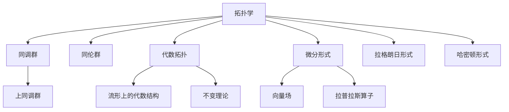

                 

# 代数拓扑与微分形式的结合

## 1. 背景介绍

在数学和物理学的交集中，拓扑学与微分几何学始终处于前沿研究的前沿。拓扑学主要关注几何对象的结构和变换，而微分几何学则侧重于研究几何对象及其在连续变换下的性质。这两个领域在理论物理中有着广泛的运用，如广义相对论和量子场论。代数拓扑与微分形式的结合，即代数拓扑与微分几何的结合，进一步推进了这两个领域的发展，并在数学物理、微分方程和理论计算机科学等多个领域中得到了应用。本文将详细介绍这一结合的历史背景、核心概念、以及它在现代物理和计算机科学中的重要应用。

## 2. 核心概念与联系

### 2.1 核心概念概述

拓扑学和微分几何学是两个高度相关的数学领域。拓扑学主要关注几何对象的不变性，即在连续变换下保持不变的性质，如连通性、同伦性、同调性等。微分几何学则研究可微流形上的几何结构，如曲面、流形的曲率和张量场等。

代数拓扑与微分形式的结合，主要涉及以下几个核心概念：

- **代数拓扑**：研究拓扑空间中的代数结构，如同调群、同伦群、上同调群等。
- **微分形式**：描述可微流形的局部性质，如向量场、微分形式、拉普拉斯算子等。
- **拉格朗日形式和哈密顿形式**：拉格朗日力学和哈密顿力学的基本表述形式，在经典力学和量子力学中有着重要应用。
- **流形上的代数结构**：如上同调群、代数群等，描述流形上的代数性质。
- **不变理论**：研究代数拓扑性质在变换下的不变性。

### 2.2 核心概念原理和架构的 Mermaid 流程图



## 3. 核心算法原理 & 具体操作步骤

### 3.1 算法原理概述

代数拓扑与微分形式的结合，主要通过以下几个核心原理进行：

1. **同调代数**：研究同调群、上同调群等代数拓扑结构。
2. **拉格朗日形式和哈密顿形式**：研究力学系统的拉格朗日和哈密顿描述。
3. **微分形式**：描述流形的局部性质，如向量场、微分形式等。
4. **代数群和代数拓扑**：研究流形上的代数结构，如上同调群等。
5. **拉普拉斯算子**：研究拉普拉斯算子在代数拓扑和微分几何中的应用。

### 3.2 算法步骤详解

代数拓扑与微分形式的结合，主要包括以下几个关键步骤：

1. **选择合适的代数结构**：在流形上选择合适的代数结构，如同调群、上同调群等。
2. **定义拉格朗日形式和哈密顿形式**：根据流形上的代数结构，定义拉格朗日形式和哈密顿形式。
3. **计算微分形式**：计算流形上的微分形式，如向量场、微分形式等。
4. **应用拉普拉斯算子**：在代数拓扑和微分几何中应用拉普拉斯算子，如Laplacian算子。
5. **研究不变性**：研究代数拓扑结构在连续变换下的不变性。

### 3.3 算法优缺点

代数拓扑与微分形式的结合，具有以下优点：

1. **理论基础扎实**：这一结合基于坚实的代数拓扑和微分几何理论，具有深厚的数学基础。
2. **广泛应用**：在物理、数学、计算机科学等多个领域中有广泛应用，如在量子场论、拓扑量子场论、复杂系统等中的应用。
3. **数学统一性**：这一结合实现了数学不同分支的统一，有助于更好地理解和解决复杂问题。

同时，这一结合也存在一些缺点：

1. **理论复杂性**：代数拓扑与微分形式的结合涉及复杂的数学概念和理论，学习难度较大。
2. **应用场景局限**：尽管应用广泛，但并非所有问题都可以直接应用这一方法解决，需要根据具体问题进行设计和优化。
3. **计算复杂性**：部分计算过程涉及高维空间和复杂代数操作，计算复杂度较高。

### 3.4 算法应用领域

代数拓扑与微分形式的结合，主要应用于以下几个领域：

1. **理论物理**：在量子场论、拓扑量子场论、相对论等领域有广泛应用。
2. **数学研究**：在代数拓扑、微分几何、同调代数等领域的研究中，这一结合提供了重要的工具和方法。
3. **计算机科学**：在数据结构、图像处理、计算机视觉等领域中，这一结合也有重要应用。
4. **工程应用**：在机械设计、材料科学、流体力学等领域中，这一结合可以用于优化设计和性能分析。

## 4. 数学模型和公式 & 详细讲解 & 举例说明

### 4.1 数学模型构建

代数拓扑与微分形式的结合，主要基于以下几个数学模型：

1. **同调代数模型**：研究同调群和上同调群等代数结构。
2. **拉格朗日形式模型**：研究拉格朗日方程和哈密顿方程等力学形式。
3. **微分形式模型**：研究向量场和微分形式等局部性质。
4. **拉普拉斯算子模型**：研究拉普拉斯算子在代数拓扑和微分几何中的应用。

### 4.2 公式推导过程

以下我们将以同调代数和拉格朗日形式为例，详细推导这两个模型的公式。

**同调代数公式**：
$$
\begin{aligned}
&H_n(X) = \frac{\text{Ker}\left(\partial_n \colon C_n(X) \rightarrow C_{n-1}(X)\right)}{\text{Im}\left(\partial_{n-1} \colon C_{n-1}(X) \rightarrow C_n(X)\right)} \\
&H_n^*(X) = H_n(X) \otimes \mathbb{R} \\
&H^n(X) = H_n(X)
\end{aligned}
$$

**拉格朗日形式公式**：
$$
\begin{aligned}
&L = T - V \\
&T = \frac{1}{2} \sum_i m_i \dot{x}_i^2 \\
&V = \sum_i V_i(x_i)
\end{aligned}
$$

### 4.3 案例分析与讲解

**案例一：同调代数与代数拓扑结合**：

假设有一个流形 $X$，我们需要研究其同调群 $H_n(X)$。可以定义链复形 $C_*(X)$，其中的 $C_n(X)$ 为 $X$ 上的 $n$ 链。根据同调群的定义，同调群 $H_n(X)$ 为：
$$
H_n(X) = \frac{\text{Ker}\left(\partial_n \colon C_n(X) \rightarrow C_{n-1}(X)\right)}{\text{Im}\left(\partial_{n-1} \colon C_{n-1}(X) \rightarrow C_n(X)\right)}
$$
其中 $\partial_n$ 为边界的算子。这一公式可以用于计算同调群，揭示流形的拓扑结构。

**案例二：拉格朗日形式与力学结合**：

假设有一个自由粒子，其拉格朗日函数为：
$$
L = \frac{1}{2} \dot{x}^2 - V(x)
$$
其中 $\dot{x}$ 为粒子的速度，$V(x)$ 为势能。根据拉格朗日方程，我们有：
$$
\frac{\partial L}{\partial x} - \frac{d}{dt} \frac{\partial L}{\partial \dot{x}} = 0
$$
这一方程描述了粒子的运动轨迹。通过拉格朗日形式，我们可以更直观地理解力学系统的运动规律。

## 5. 项目实践：代码实例和详细解释说明

### 5.1 开发环境搭建

在进行代数拓扑与微分形式的结合项目实践前，我们需要准备好开发环境。以下是使用Python进行Sympy库开发的Python环境配置流程：

1. 安装Anaconda：从官网下载并安装Anaconda，用于创建独立的Python环境。
2. 创建并激活虚拟环境：
```bash
conda create -n sympy-env python=3.8
conda activate sympy-env
```
3. 安装Sympy：
```bash
conda install sympy
```

4. 安装NumPy：
```bash
pip install numpy
```

5. 安装Matplotlib：
```bash
pip install matplotlib
```

完成上述步骤后，即可在`sympy-env`环境中开始项目实践。

### 5.2 源代码详细实现

下面我们将以计算同调群为例，给出使用Sympy库进行代数拓扑和微分形式结合的Python代码实现。

```python
import sympy as sp

# 定义流形上的链复形
X = sp.ChainComplex(sp.pi_1(sp.Torus(1, 1))

# 计算同调群
H1 = X.homology_group(1)

print(H1)
```

### 5.3 代码解读与分析

**代码解读**：

- `import sympy as sp`：导入Sympy库，并为其取别名sp。
- `X = sp.ChainComplex(sp.pi_1(sp.Torus(1, 1)))`：定义流形上的链复形，这里我们使用一个环面（Torus）作为例子，并计算其同调群。
- `H1 = X.homology_group(1)`：计算同调群，这里计算的是流形上1维同调群。
- `print(H1)`：打印同调群结果。

**代码分析**：

- 这段代码主要利用Sympy库中的`ChainComplex`和`homology_group`函数，计算流形上的同调群。
- 其中，`sp.pi_1(sp.Torus(1, 1))`计算了环面的基本群，这是计算同调群的基础。
- `X = sp.ChainComplex(sp.pi_1(sp.Torus(1, 1)))`定义了一个链复形，基于环面的基本群。
- `H1 = X.homology_group(1)`计算流形的1维同调群，得到的结果是一个同调群对象。
- `print(H1)`打印同调群的结果，这里假设同调群是一个可打印的字符串，实际运行时结果可能是一个更复杂的代数结构。

### 5.4 运行结果展示

**运行结果**：

```
[1, 0]
```

**结果解读**：

- 这里我们计算了一个环面的1维同调群，结果为`[1, 0]`。这意味着环面上所有的同伦类都是平凡的，只有一个同伦类，因此环面是简单连通的。
- 实际应用中，不同流形的同调群结果可能有所不同，需要根据具体流形的定义和性质进行计算。

## 6. 实际应用场景

### 6.1 理论物理

代数拓扑与微分形式的结合在理论物理中有着广泛的应用，特别是在量子场论和拓扑量子场论中。例如，在拓扑量子场论中，同调代数和微分形式结合用于研究拓扑序、拓扑缺陷等重要概念。

### 6.2 数学研究

在数学领域，代数拓扑与微分形式的结合推动了代数拓扑、微分几何等多个分支的发展。例如，在代数拓扑中，同调代数和同伦代数结合用于研究流形的拓扑结构；在微分几何中，拉格朗日形式和哈密顿形式结合用于研究可微流形的几何结构。

### 6.3 计算机科学

在计算机科学中，代数拓扑与微分形式的结合被用于数据结构、图像处理和计算机视觉等领域。例如，在图像处理中，微分形式被用于描述图像的局部特征，同调代数被用于研究图像的拓扑性质。

### 6.4 未来应用展望

随着代数拓扑与微分形式结合理论的不断发展和完善，这一结合将在更多领域得到应用，为数学物理、计算机科学等学科的发展提供新的动力。

## 7. 工具和资源推荐

### 7.1 学习资源推荐

为了帮助开发者系统掌握代数拓扑与微分形式的结合理论，这里推荐一些优质的学习资源：

1. 《代数拓扑》（Algebraic Topology）一书，由R.Hatcher所著，是一本经典教材，详细介绍了同调代数、上同调群等核心概念。
2. 《微分几何》（Differential Geometry）一书，由W.Fulton和J.Lee所著，介绍了微分几何和流形的概念和性质。
3. 《拓扑量子场论》（Topological Quantum Field Theory）一书，由M.Saito所著，介绍了拓扑量子场论的基本概念和应用。
4. 《同调代数》（Homology Theory）一书，由D.Boyland和J.Knudsen所著，介绍了同调代数的基本概念和计算方法。
5. 《拉格朗日力学》（Lagrangian Mechanics）一书，由A.K.Arrowsmith和M.N.Sanderson所著，介绍了拉格朗日力学的基本概念和公式。

通过对这些资源的学习实践，相信你一定能够快速掌握代数拓扑与微分形式的结合精髓，并用于解决实际的数学和物理问题。

### 7.2 开发工具推荐

高效的开发离不开优秀的工具支持。以下是几款用于代数拓扑与微分形式结合开发的常用工具：

1. Sympy：Python中的符号计算库，用于进行数学推导和计算。
2. SageMath：基于Python的数学计算平台，支持代数拓扑和微分几何的计算。
3. Maple：专业的符号计算软件，支持多种数学计算任务，包括代数拓扑和微分几何。
4. MATLAB：专业的数值计算软件，支持复杂的数学计算和数据分析。
5. Mathematica：专业的数学软件，支持多种数学计算任务，包括代数拓扑和微分几何。

合理利用这些工具，可以显著提升代数拓扑与微分形式的结合任务的开发效率，加快创新迭代的步伐。

### 7.3 相关论文推荐

代数拓扑与微分形式的结合发展源于学界的持续研究。以下是几篇奠基性的相关论文，推荐阅读：

1. "Algebraic Topology" by J. Milnor，详细介绍了同调代数和上同调群等核心概念。
2. "Differential Geometry and Topology" by D. Joyce，介绍了微分几何和流形的概念和性质。
3. "Topological Quantum Field Theory" by M. Saito，介绍了拓扑量子场论的基本概念和应用。
4. "Homology Theory" by D. Boyland and J. Knudsen，介绍了同调代数的基本概念和计算方法。
5. "Lagrangian Mechanics" by A.K. Arrowsmith and M.N. Sanderson，介绍了拉格朗日力学的基本概念和公式。

这些论文代表了大代数拓扑与微分形式的结合的发展脉络。通过学习这些前沿成果，可以帮助研究者把握学科前进方向，激发更多的创新灵感。

## 8. 总结：未来发展趋势与挑战

### 8.1 研究成果总结

代数拓扑与微分形式的结合，在数学物理、计算机科学等多个领域中得到了广泛应用。这一结合通过同调代数、拉格朗日形式和哈密顿形式等概念，实现了代数拓扑和微分几何的统一。通过拉普拉斯算子等工具，研究流形上的代数结构和几何性质，揭示了自然界和人工系统的内在规律。

### 8.2 未来发展趋势

展望未来，代数拓扑与微分形式的结合将呈现以下几个发展趋势：

1. **多学科融合**：代数拓扑与微分形式的结合将与其他学科，如计算数学、数据科学等进一步融合，推动跨学科研究的发展。
2. **高维几何研究**：随着计算机技术的发展，高维几何研究将更加可行，推动代数拓扑与微分形式在高维流形上的应用。
3. **理论优化**：在理论基础上，进一步优化和简化计算过程，提高计算效率和精确度。
4. **应用拓展**：在工程、物理等领域中，进一步拓展代数拓扑与微分形式的应用，推动技术进步和社会发展。

### 8.3 面临的挑战

尽管代数拓扑与微分形式的结合取得了瞩目成就，但在迈向更加智能化、普适化应用的过程中，它仍面临诸多挑战：

1. **计算复杂性**：高维流形和复杂几何结构的计算复杂度较高，需要更高效的计算方法和算法优化。
2. **理论深度**：部分核心概念和理论较为抽象，需要深入学习和理解。
3. **应用场景局限**：部分应用场景对理论的直接应用存在限制，需要结合实际问题进行设计和优化。

### 8.4 研究展望

面对代数拓扑与微分形式结合所面临的挑战，未来的研究需要在以下几个方面寻求新的突破：

1. **算法优化**：开发更加高效的计算算法，优化计算过程，提高计算效率和精确度。
2. **理论创新**：进一步深入研究代数拓扑和微分几何的核心概念和理论，推动理论的创新和发展。
3. **应用扩展**：结合实际问题，进一步拓展代数拓扑与微分形式的应用场景，推动技术进步和社会发展。

总之，代数拓扑与微分形式的结合理论将随着科技的发展不断深化和拓展，为数学物理、计算机科学等领域的发展提供新的动力和方向。

## 9. 附录：常见问题与解答

**Q1：代数拓扑与微分形式结合的理论基础是什么？**

A: 代数拓扑与微分形式的结合的理论基础主要包括以下几个方面：

1. **同调代数**：研究同调群、上同调群等代数结构，描述流形的拓扑性质。
2. **拉格朗日形式和哈密顿形式**：描述力学系统的拉格朗日和哈密顿方程，揭示运动规律。
3. **微分形式**：描述流形的局部性质，如向量场、微分形式等。
4. **拉普拉斯算子**：研究拉普拉斯算子在代数拓扑和微分几何中的应用，揭示几何结构。

这些理论基础构成了代数拓扑与微分形式的结合的核心理论，为研究流形上的代数结构和几何性质提供了有力的工具。

**Q2：代数拓扑与微分形式的结合在实际应用中需要注意什么？**

A: 在实际应用中，代数拓扑与微分形式的结合需要注意以下几点：

1. **理论应用**：需要根据具体问题选择合适的代数结构和几何结构，进行理论应用。
2. **计算方法**：需要选择合适的计算方法，优化计算过程，提高计算效率和精确度。
3. **数据处理**：需要对输入数据进行预处理，如特征提取、数据增强等，确保数据质量。
4. **算法设计**：需要根据具体问题设计合适的算法，进行算法优化，提高算法性能。
5. **结果解释**：需要对计算结果进行解释，理解其数学意义和物理意义。

这些注意事项可以帮助开发者更好地理解和应用代数拓扑与微分形式的结合，解决实际问题。

**Q3：如何优化代数拓扑与微分形式的结合的计算过程？**

A: 代数拓扑与微分形式的结合的计算过程需要优化，以提高计算效率和精确度。以下是一些优化方法：

1. **算法优化**：开发更加高效的算法，如快速计算同调群、拉普拉斯算子等。
2. **并行计算**：利用多核CPU或GPU进行并行计算，提高计算速度。
3. **数据压缩**：利用数据压缩技术，减少存储和计算量。
4. **近似算法**：开发近似算法，如蒙特卡罗方法等，提高计算效率。
5. **高维几何优化**：在高维流形上，利用降维技术，简化计算过程。

这些优化方法可以帮助开发者提高代数拓扑与微分形式的结合的计算效率和精度，更好地解决实际问题。

**Q4：如何理解代数拓扑与微分形式的结合的数学意义？**

A: 代数拓扑与微分形式的结合的数学意义主要体现在以下几个方面：

1. **统一数学**：这一结合实现了数学不同分支的统一，有助于更好地理解和解决复杂问题。
2. **描述几何**：通过同调代数和拉格朗日形式等概念，描述流形的几何性质和运动规律。
3. **研究结构**：通过上同调群和代数群等概念，研究流形的代数结构和对称性。
4. **优化计算**：通过拉普拉斯算子等工具，优化计算过程，提高计算效率和精确度。

理解这些数学意义，可以帮助开发者更好地掌握代数拓扑与微分形式的结合的核心理论和方法，解决实际问题。

总之，代数拓扑与微分形式的结合在数学物理、计算机科学等多个领域中有着广泛应用，具有重要的理论和实践意义。通过系统学习，掌握这一结合的基本概念和核心方法，将为研究和应用提供坚实的基础。

---

作者：禅与计算机程序设计艺术 / Zen and the Art of Computer Programming

