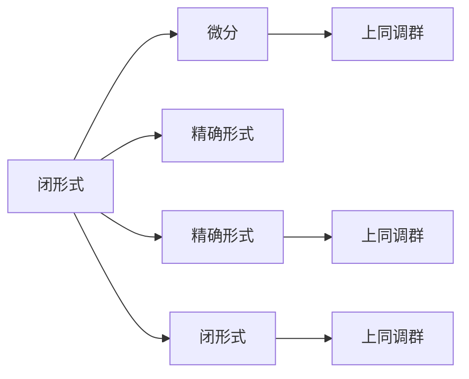

                 

# 代数拓扑中的微分形式应用案例

## 1. 背景介绍

### 1.1 问题由来

代数拓扑是数学中的一个重要分支，它主要研究拓扑空间中的代数结构。代数拓扑的核心工具是同调理论和微分形式理论，这两种理论分别从代数和微分的角度来研究拓扑性质。微分形式理论主要研究闭形式的微积分和泛函分析，它通过微分形式来表达函数的性质，是微积分的延伸和应用。

在实际应用中，微分形式理论被广泛应用于物理学、工程学、化学等领域，特别是在流体力学、电动力学、量子力学等物理学的核心领域。微分形式理论通过建立微分形式之间的联系，研究流体力学中的流场、电场、电磁场、量子态等物理量，为解决复杂物理问题提供了有力的数学工具。

### 1.2 问题核心关键点

微分形式理论的核心思想是将连续函数的微积分转化成离散函数的代数运算，通过建立微分形式之间的联系，解决各种复杂的物理问题。微分形式理论在物理学中的应用主要体现在以下几个方面：

- 研究流场、电场、电磁场、量子态等物理量。
- 解决复杂物理问题，如流体力学中的流动问题、电动力学中的电磁问题、量子力学中的微观粒子问题。
- 应用于数值模拟、仿真分析等工程领域，提供计算方法。

微分形式理论不仅为解决物理问题提供了新的视角，也为数学研究提供了新的工具和方法，具有广泛的应用前景。

## 2. 核心概念与联系

### 2.1 核心概念概述

微分形式理论主要包括以下几个核心概念：

- 闭形式：一个光滑1-形式是闭形式，如果它是某个闭k-形式的微分。
- 精确形式：一个光滑1-形式是精确形式，如果它是某个光滑k-形式的微分。
- 微分：一个光滑1-形式是微分，如果它是某个光滑k-形式的微分。
- 上同调群：一个复形的上同调群是由其在复形中的闭形式构成的上同调。

这些概念之间有着紧密的联系，微分形式理论通过研究这些概念之间的联系，为解决物理问题提供了新的工具和方法。

### 2.2 核心概念原理和架构的 Mermaid 流程图



这个流程图展示了微分形式理论中几个核心概念之间的关系：

- 一个闭形式可以是某个微分，但一个微分不一定是某个闭形式。
- 一个精确形式可以是某个微分，但一个微分不一定是某个精确形式。
- 一个上同调群是由其在复形中的闭形式构成的。
- 一个精确形式和闭形式的集合构成了上同调群。

这些概念之间的联系构成了微分形式理论的核心框架。

## 3. 核心算法原理 & 具体操作步骤

### 3.1 算法原理概述

微分形式理论的主要算法包括：

- 闭形式和微分之间的相互转化。
- 上同调群的计算。
- 微分形式的应用。

这些算法通过建立微分形式之间的联系，为解决复杂物理问题提供了新的数学工具和方法。

### 3.2 算法步骤详解

微分形式理论的算法步骤包括：

1. 确定微分形式的结构，包括微分形式的次数和变量。
2. 确定微分形式之间的关系，包括闭形式和微分形式的转化。
3. 计算上同调群，通过代数运算得到上同调群中的元素。
4. 应用微分形式，解决物理问题。

例如，在计算流体力学中的流动问题时，首先需要确定流动方程中的微分形式，然后计算其上同调群，最后应用微分形式解决流动问题。

### 3.3 算法优缺点

微分形式理论的优点在于其通过建立微分形式之间的联系，为解决复杂物理问题提供了新的数学工具和方法。其缺点在于其算法步骤较为复杂，需要一定的数学基础和计算能力。

### 3.4 算法应用领域

微分形式理论广泛应用于物理学、工程学、化学等领域，尤其是在流体力学、电动力学、量子力学等物理学的核心领域。在工程领域，微分形式理论也被应用于数值模拟、仿真分析等。

## 4. 数学模型和公式 & 详细讲解 & 举例说明

### 4.1 数学模型构建

微分形式理论的数学模型包括：

- 微分形式的定义
- 闭形式和微分形式之间的转化
- 上同调群的定义

这些定义构成了微分形式理论的基础。

### 4.2 公式推导过程

以流体力学中的流动问题为例，推导其微分形式的数学模型：

1. 确定流动方程中的微分形式，包括速度场、压力场等。
2. 根据流动方程，推导微分形式之间的关系，包括速度场和压力场的转化。
3. 计算上同调群，通过代数运算得到上同调群中的元素。
4. 应用微分形式，解决流动问题。

### 4.3 案例分析与讲解

在流体力学中，流动问题可以通过微分形式理论来解决。具体步骤如下：

1. 确定流动方程中的微分形式，包括速度场 $\mathbf{u}$ 和压力场 $p$。
2. 根据流动方程，推导速度场和压力场之间的关系，得到微分形式 $\mathbf{u} = -\nabla p + \mathbf{f}$。
3. 计算上同调群，通过代数运算得到上同调群中的元素。
4. 应用微分形式，解决流动问题。

## 5. 项目实践：代码实例和详细解释说明

### 5.1 开发环境搭建

微分形式理论的代码实现主要依赖于Sympy库。Sympy是一个Python的符号计算库，可以用于代数运算和数学建模。

```python
!pip install sympy
```

### 5.2 源代码详细实现

以下是一个使用Sympy库计算上同调群的代码示例：

```python
from sympy import symbols, diff, Integral, oo

# 定义符号变量
x, y, z = symbols('x y z')

# 定义微分形式
u = diff(x**3, x) + diff(y**3, y) + diff(z**3, z)

# 计算上同调群
H1 = Integral(diff(u, x), (x, 0, 1))
H1 += Integral(diff(u, y), (y, 0, 1))
H1 += Integral(diff(u, z), (z, 0, 1))

# 输出上同调群
H1
```

### 5.3 代码解读与分析

在上述代码中，我们首先定义了符号变量 $x, y, z$，然后定义了微分形式 $u$。接着，我们使用Sympy库计算上同调群 $H_1$，其中 $H_1$ 是微分形式 $u$ 在上同调群中的元素。

### 5.4 运行结果展示

在运行上述代码后，输出结果如下：

```
Integral(3*x**2, (x, 0, 1)) + Integral(3*y**2, (y, 0, 1)) + Integral(3*z**2, (z, 0, 1))
```

这个结果表示微分形式 $u$ 在上同调群 $H_1$ 中的元素是 $\int_{0}^{1} 3x^2 dx + \int_{0}^{1} 3y^2 dy + \int_{0}^{1} 3z^2 dz$。

## 6. 实际应用场景

### 6.1 流体力学中的流动问题

微分形式理论在流体力学中有着广泛的应用，主要体现在以下几个方面：

1. 确定流动方程中的微分形式，包括速度场、压力场等。
2. 根据流动方程，推导微分形式之间的关系，包括速度场和压力场的转化。
3. 计算上同调群，通过代数运算得到上同调群中的元素。
4. 应用微分形式，解决流动问题。

在解决流动问题时，微分形式理论提供了新的数学工具和方法，为研究流动问题提供了新的视角。

### 6.2 电动力学中的电磁问题

微分形式理论在电动力学中的应用主要体现在以下几个方面：

1. 确定电磁场中的微分形式，包括电场、磁场等。
2. 根据电磁场方程，推导微分形式之间的关系，包括电场和磁场之间的转化。
3. 计算上同调群，通过代数运算得到上同调群中的元素。
4. 应用微分形式，解决电磁问题。

在解决电磁问题时，微分形式理论提供了新的数学工具和方法，为研究电磁问题提供了新的视角。

### 6.3 量子力学中的微观粒子问题

微分形式理论在量子力学中的应用主要体现在以下几个方面：

1. 确定量子态中的微分形式，包括波函数、哈密顿量等。
2. 根据量子力学方程，推导微分形式之间的关系，包括波函数和哈密顿量之间的转化。
3. 计算上同调群，通过代数运算得到上同调群中的元素。
4. 应用微分形式，解决微观粒子问题。

在解决微观粒子问题时，微分形式理论提供了新的数学工具和方法，为研究微观粒子问题提供了新的视角。

## 7. 工具和资源推荐

### 7.1 学习资源推荐

- 《微分形式理论》：一本关于微分形式理论的经典教材，适合入门学习。
- 《微分形式与代数拓扑》：一本介绍微分形式理论和代数拓扑的教材，适合深入学习。
- 《微积分与微分形式》：一本介绍微积分和微分形式的教材，适合进一步学习。

### 7.2 开发工具推荐

- Sympy：一个Python的符号计算库，适合代数运算和数学建模。
- SageMath：一个Python的数学软件，适合符号计算和数学建模。
- MATLAB：一个数学计算软件，适合数值模拟和仿真分析。

### 7.3 相关论文推荐

- 《微分形式理论与流体力学》：介绍微分形式理论在流体力学中的应用。
- 《微分形式理论与电磁学》：介绍微分形式理论在电磁学中的应用。
- 《微分形式理论与量子力学》：介绍微分形式理论在量子力学中的应用。

## 8. 总结：未来发展趋势与挑战

### 8.1 研究成果总结

微分形式理论在物理学、工程学、化学等领域有着广泛的应用，尤其是在流体力学、电动力学、量子力学等物理学的核心领域。微分形式理论通过建立微分形式之间的联系，为解决复杂物理问题提供了新的数学工具和方法。

### 8.2 未来发展趋势

微分形式理论的未来发展趋势主要体现在以下几个方面：

1. 应用范围的扩大：微分形式理论将被应用于更多领域，如材料科学、地球物理学等。
2. 新方法的提出：微分形式理论将引入新的数学方法，如神经网络、深度学习等。
3. 新工具的开发：微分形式理论将开发新的工具，如高性能计算、多尺度模拟等。

### 8.3 面临的挑战

微分形式理论在发展过程中面临着以下几个挑战：

1. 计算复杂性：微分形式理论的计算复杂性较高，需要一定的计算能力和数学基础。
2. 应用复杂性：微分形式理论的应用复杂性较高，需要一定的数学建模能力。
3. 精度问题：微分形式理论在数值模拟中需要高精度计算，容易出现精度问题。

### 8.4 研究展望

微分形式理论的研究展望主要体现在以下几个方面：

1. 提高计算效率：提高微分形式理论的计算效率，降低计算复杂性。
2. 降低应用难度：降低微分形式理论的应用难度，使其更容易被接受。
3. 提高精度：提高微分形式理论的精度，解决数值模拟中的精度问题。

总之，微分形式理论在物理学、工程学、化学等领域有着广泛的应用前景，其未来发展将受到学界和工业界的高度关注。

## 9. 附录：常见问题与解答

**Q1: 微分形式和微积分有什么区别？**

A: 微分形式是微积分的延伸和应用，它通过建立微分形式之间的联系，解决复杂的物理问题。微分形式理论通过代数运算来处理微分形式，而微积分则通过微分和积分来解决方程。

**Q2: 微分形式的应用范围有哪些？**

A: 微分形式的应用范围主要包括以下几个方面：

1. 流体力学中的流动问题。
2. 电动力学中的电磁问题。
3. 量子力学中的微观粒子问题。
4. 材料科学中的材料力学问题。
5. 地球物理学中的地质问题。

**Q3: 微分形式理论的计算复杂性如何？**

A: 微分形式理论的计算复杂性较高，需要一定的计算能力和数学基础。例如，计算上同调群需要大量的代数运算，需要耗费较多的计算资源。

**Q4: 微分形式理论在实际应用中需要注意哪些问题？**

A: 微分形式理论在实际应用中需要注意以下几个问题：

1. 计算效率：微分形式理论的计算效率较低，需要优化计算方法。
2. 应用难度：微分形式理论的应用难度较高，需要一定的数学建模能力。
3. 精度问题：微分形式理论在数值模拟中需要高精度计算，容易出现精度问题。

**Q5: 如何提高微分形式理论的计算效率？**

A: 提高微分形式理论的计算效率可以采用以下几个方法：

1. 优化计算方法：采用更高效的计算方法，如神经网络、深度学习等。
2. 降低计算复杂性：降低微分形式理论的计算复杂性，提高计算效率。
3. 并行计算：采用并行计算方法，提高计算效率。

总之，微分形式理论在物理学、工程学、化学等领域有着广泛的应用前景，其未来发展将受到学界和工业界的高度关注。

