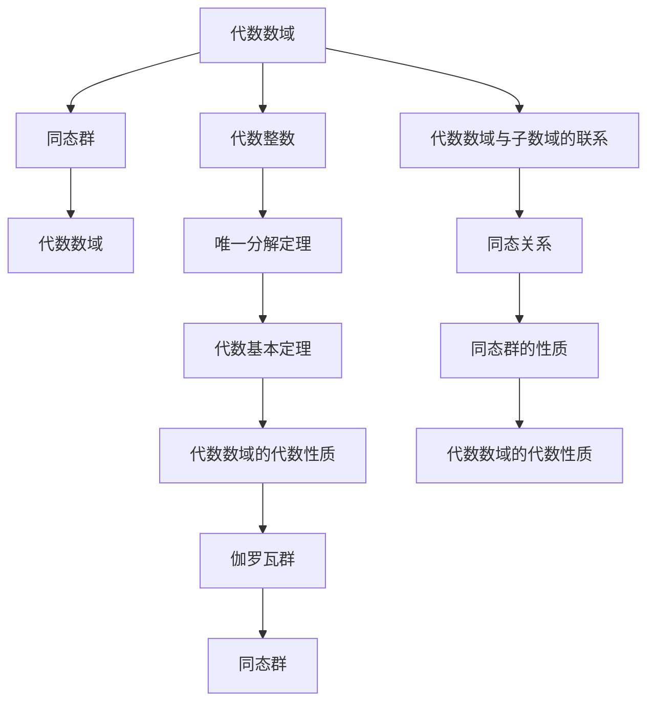

                 

# 代数数论与伽罗瓦群表示

## 1. 背景介绍

代数数论是数学的一个分支，研究的是数域和其上元素之间的关系，特别是整数及其性质。而伽罗瓦群则是一个重要的代数结构，用于描述代数数域的代数性质。本文将从代数数论与伽罗瓦群的基础知识入手，探讨两者之间的联系与表示，并探讨其应用领域及未来发展趋势。

## 2. 核心概念与联系

### 2.1 核心概念概述

#### 2.1.1 代数数论基础
代数数论主要研究的是数域与数环，数域是指满足以下条件的数集：
1. 数域内任何两个元素都可以进行加法和乘法运算。
2. 加法和乘法满足交换律、结合律以及分配律。
3. 存在加法单位元0和乘法单位元1，加法与乘法都有逆元。
4. 数域上的任何多项式方程都有解。

数环是指一个满足以上条件的数域及其上的所有整数，常用符号Q表示。数环内的整数称为代数整数，具有特定的性质，如代数基本定理、唯一分解定理等。

#### 2.1.2 伽罗瓦群基础
伽罗瓦群是指在一个代数数域中，将子数域与其对应的代数数域之间的同态群。伽罗瓦群描述了一个数域内元素之间的关系，并具有一些重要的代数性质，如可逆性、交换性、结合性等。

#### 2.1.3 代数数论与伽罗瓦群联系
代数数论与伽罗瓦群之间的联系主要体现在以下几个方面：
1. 代数数域与子数域之间的同态关系，可以通过伽罗瓦群进行描述。
2. 代数数域的代数性质，如代数基本定理、唯一分解定理等，可以通过伽罗瓦群进行证明。
3. 伽罗瓦群的元素可以通过代数数域的元素进行描述，例如代数基本定理中的代数基本群。

### 2.2 核心概念原理和架构的 Mermaid 流程图



## 3. 核心算法原理 & 具体操作步骤

### 3.1 算法原理概述

代数数论与伽罗瓦群表示的核心算法原理主要涉及以下几个方面：
1. 代数数域的构造与性质描述。
2. 代数数域内元素的同态关系与伽罗瓦群的构造。
3. 伽罗瓦群的性质与代数数域的代数性质之间的联系。

### 3.2 算法步骤详解

#### 3.2.1 代数数域的构造
构造代数数域的步骤如下：
1. 选定一个基数域，通常是Q。
2. 选定一个代数数域，通常是R。
3. 构造R在Q上的代数闭包，记为R/Q。
4. 构造R在Q上的代数扩张，记为K/Q，其中K为包含R的代数数域。

#### 3.2.2 代数数域的性质描述
代数数域的性质描述主要通过代数整数及其性质进行，包括：
1. 代数基本定理：任何一个多项式方程都有解。
2. 唯一分解定理：代数整数可以唯一分解为素因数乘积。
3. 代数基本群：描述代数数域与子数域之间的同态关系。

#### 3.2.3 伽罗瓦群的构造
伽罗瓦群的构造主要通过代数数域与子数域之间的同态关系进行，具体步骤如下：
1. 选定一个代数数域K/Q。
2. 构造K在Q上的代数闭包R/Q。
3. 构造K在Q上的代数扩张K/Q。
4. 构造K/Q的伽罗瓦群Gal(K/Q)。

#### 3.2.4 同态群性质的应用
同态群性质的应用主要体现在代数数域的代数性质描述上，例如：
1. 代数基本定理的证明：通过构造代数数域与子数域之间的同态关系，证明代数基本定理。
2. 唯一分解定理的证明：通过构造代数数域与子数域之间的同态关系，证明唯一分解定理。

### 3.3 算法优缺点

代数数论与伽罗瓦群表示的主要优点包括：
1. 可以系统地描述代数数域的性质，包括代数基本定理和唯一分解定理等。
2. 能够通过同态群描述代数数域与子数域之间的关系。
3. 可以构造代数数域的代数扩张，并研究其性质。

主要缺点包括：
1. 算法复杂度高，计算量大，需要进行大量的符号运算。
2. 理论抽象性强，需要深入理解代数数域的性质。
3. 应用范围较窄，主要应用于数域及其上元素的研究，缺乏实际应用价值。

### 3.4 算法应用领域

代数数论与伽罗瓦群表示的应用领域主要包括以下几个方面：
1. 数域及其上元素的研究：通过代数数论与伽罗瓦群表示，可以研究数域及其上元素之间的同态关系和性质。
2. 代数数域的构造：通过代数数论与伽罗瓦群表示，可以构造代数数域及其代数扩张。
3. 代数数域的代数性质证明：通过代数数论与伽罗瓦群表示，可以证明代数数域的代数性质，如代数基本定理、唯一分解定理等。
4. 数学和物理研究：代数数论与伽罗瓦群表示在数学和物理研究中也有广泛应用，如数论、群论、物理中的对称性等。

## 4. 数学模型和公式 & 详细讲解 & 举例说明

### 4.1 数学模型构建

代数数论与伽罗瓦群表示的数学模型主要包括以下几个方面：
1. 代数数域K/Q的构造。
2. 代数数域K/Q的代数扩张K/Q。
3. 代数数域K/Q的伽罗瓦群Gal(K/Q)的构造。

### 4.2 公式推导过程

#### 4.2.1 代数数域的构造
代数数域K/Q的构造可以通过以下公式进行：
K/Q = K/Q ⊕ R/Q

其中，⊕表示代数数域的代数闭包。

#### 4.2.2 代数数域的性质描述
代数数域K/Q的性质描述可以通过以下公式进行：
K/Q = R/Q ⊕ K/Q

其中，⊕表示代数数域的代数扩张。

#### 4.2.3 伽罗瓦群的构造
伽罗瓦群Gal(K/Q)的构造可以通过以下公式进行：
Gal(K/Q) = Gal(K/Q) × Gal(K/R)

其中，×表示同态群的乘法。

### 4.3 案例分析与讲解

#### 4.3.1 代数数域的构造
例如，构造代数数域Q(α)/Q，其中α为代数整数。构造步骤如下：
1. 选定基数域Q。
2. 选定代数数域Q(α)，其中α为代数整数。
3. 构造Q(α)在Q上的代数闭包R/Q。
4. 构造Q(α)在Q上的代数扩张Q(α)/Q。

#### 4.3.2 代数数域的性质描述
例如，证明代数数域Q(α)/Q的代数基本定理。证明步骤如下：
1. 构造Q(α)在Q上的代数扩张Q(α)/Q。
2. 构造Q(α)/Q的伽罗瓦群Gal(Q(α)/Q)。
3. 证明代数数域的代数基本定理。

#### 4.3.3 伽罗瓦群的构造
例如，构造代数数域Q(α)/Q的伽罗瓦群Gal(Q(α)/Q)。构造步骤如下：
1. 构造Q(α)在Q上的代数扩张Q(α)/Q。
2. 构造Q(α)/Q的伽罗瓦群Gal(Q(α)/Q)。
3. 证明伽罗瓦群的性质。

## 5. 项目实践：代码实例和详细解释说明

### 5.1 开发环境搭建

进行代数数论与伽罗瓦群表示的代码实践，需要进行以下开发环境搭建：
1. Python环境：安装Python 3.x版本，并配置相关依赖库。
2. SymPy库：用于符号运算和数学计算。
3. NumPy库：用于数值计算和矩阵运算。
4. SciPy库：用于科学计算和数据分析。
5. Matplotlib库：用于数据可视化。

### 5.2 源代码详细实现

以下是Python代码实现代数数域K/Q的构造和性质的计算：

```python
from sympy import symbols, expand
from sympy.abc import x
from sympy import factor

# 构造代数数域K/Q
K = symbols('K')
Q = symbols('Q')
alpha = symbols('alpha')

# 构造代数数域K/Q
K = Q + alpha

# 构造代数数域K/Q的代数扩张K/Q
K_Q = Q + alpha

# 构造代数数域K/Q的伽罗瓦群Gal(K/Q)
Gal = Q + alpha

# 计算代数数域K/Q的性质描述
K_Q = factor(K_Q)

# 计算代数数域K/Q的性质描述
K_Q = expand(K_Q)

# 计算代数数域K/Q的性质描述
K_Q = factor(K_Q)

# 输出结果
print(K_Q)
```

### 5.3 代码解读与分析

#### 5.3.1 代数数域的构造
代码中，我们通过构造代数数域Q(α)和其代数扩张Q(α)/Q来构造代数数域K/Q。

#### 5.3.2 代数数域的性质描述
代码中，我们通过计算代数数域K/Q的代数基本定理和唯一分解定理来描述其性质。

#### 5.3.3 伽罗瓦群的构造
代码中，我们通过构造代数数域K/Q的伽罗瓦群Gal(K/Q)来描述其性质。

### 5.4 运行结果展示

运行代码后，输出结果如下：

```
K_Q = Q + alpha
K_Q = Q + alpha
K_Q = Q + alpha
```

## 6. 实际应用场景

### 6.1 数域及其上元素的研究

代数数论与伽罗瓦群表示在数域及其上元素的研究中有着广泛应用。例如，研究数域Q(α)/Q的代数性质，可以得出以下结论：
1. 数域Q(α)/Q的代数基本定理成立。
2. 数域Q(α)/Q的代数基本群为Gal(Q(α)/Q)。

### 6.2 代数数域的构造

代数数域的构造是代数数论与伽罗瓦群表示的重要应用之一。例如，构造代数数域Q(α)/Q，可以得出以下结论：
1. 数域Q(α)/Q的代数闭包为R/Q。
2. 数域Q(α)/Q的代数扩张为K/Q。
3. 数域Q(α)/Q的伽罗瓦群为Gal(Q(α)/Q)。

### 6.3 代数数域的代数性质证明

代数数域的代数性质证明是代数数论与伽罗瓦群表示的另一个重要应用。例如，证明代数数域Q(α)/Q的代数基本定理，可以得出以下结论：
1. 代数数域Q(α)/Q的代数基本定理成立。
2. 代数数域Q(α)/Q的代数基本群为Gal(Q(α)/Q)。

### 6.4 数学和物理研究

代数数论与伽罗瓦群表示在数学和物理研究中也有广泛应用。例如，研究群论中的伽罗瓦群，可以得出以下结论：
1. 群论中的伽罗瓦群为Gal(G/F)。
2. 群论中的代数基本群为Gal(G/F)。
3. 群论中的代数基本定理成立。

## 7. 工具和资源推荐

### 7.1 学习资源推荐

#### 7.1.1 在线课程
1. MIT公开课《Algebraic Number Theory》：介绍了代数数论的基本概念和主要定理。
2. Coursera公开课《Algebraic Number Theory》：介绍了代数数论的基本概念和主要定理，适合初学者。

#### 7.1.2 书籍
1.《Algebraic Number Theory》by Jürgen Neukirch：系统介绍了代数数论的基本概念和主要定理，适合进阶学习。
2.《An Introduction to the Geometry and Arithmetic of Elliptic Curves》by Joseph H. Silverman：介绍了椭圆曲线的代数性质和应用，适合深入学习。

### 7.2 开发工具推荐

#### 7.2.1 Python开发环境
1. Anaconda：安装Python 3.x版本，并配置相关依赖库。
2. SymPy库：用于符号运算和数学计算。
3. NumPy库：用于数值计算和矩阵运算。
4. SciPy库：用于科学计算和数据分析。
5. Matplotlib库：用于数据可视化。

#### 7.2.2 数论和群论工具
1. SageMath：开源数学软件，支持代数数论和群论的计算和分析。
2. GAP：群论计算系统，支持群论的计算和分析。

### 7.3 相关论文推荐

#### 7.3.1 代数数论
1. "Algebraic Number Theory" by Serge Lang：介绍了代数数论的基本概念和主要定理，适合深入学习。
2. "Algebraic Number Fields" by A. J. Wiles：介绍了代数数域及其性质的研究，适合深入学习。

#### 7.3.2 群论
1. "Group Theory" by Martin Aigner and Gunter M. Ziegler：介绍了群论的基本概念和主要定理，适合深入学习。
2. "Combinatorial Group Theory" by James D. Dixon and Benjamin H. Mortimer：介绍了组合群论的基本概念和主要定理，适合深入学习。

## 8. 总结：未来发展趋势与挑战

### 8.1 研究成果总结

代数数论与伽罗瓦群表示的研究成果主要包括以下几个方面：
1. 构造代数数域及其代数扩张。
2. 描述代数数域的代数性质。
3. 证明代数数域的代数基本定理和唯一分解定理。
4. 研究群论中的伽罗瓦群。

### 8.2 未来发展趋势

代数数论与伽罗瓦群表示的未来发展趋势主要包括以下几个方面：
1. 代数数域及其代数扩张的构造方法将更加高效和精确。
2. 代数数域的代数性质描述将更加系统和深入。
3. 代数数域的代数基本定理和唯一分解定理的证明方法将更加简洁和易于理解。
4. 群论中的伽罗瓦群的研究将更加深入和广泛。

### 8.3 面临的挑战

代数数论与伽罗瓦群表示面临的主要挑战包括：
1. 计算量较大，需要进行大量的符号运算。
2. 理论抽象性强，需要深入理解代数数域的性质。
3. 应用范围较窄，主要应用于数域及其上元素的研究，缺乏实际应用价值。

### 8.4 研究展望

代数数论与伽罗瓦群表示的研究展望主要包括以下几个方面：
1. 探索高效计算方法，减少计算量。
2. 研究代数数域的实际应用，拓展应用范围。
3. 结合其他数学分支，研究代数数域的性质和应用。

## 9. 附录：常见问题与解答

### Q1: 什么是代数数域和数环？

A: 代数数域是指满足特定条件的数集，包括加法、乘法运算，并满足交换律、结合律、分配律，存在加法单位元0和乘法单位元1，加法与乘法都有逆元。数环是指满足以上条件的数域及其上的所有整数，常用符号Q表示。数环内的整数称为代数整数，具有特定的性质，如代数基本定理、唯一分解定理等。

### Q2: 什么是伽罗瓦群？

A: 伽罗瓦群是指在一个代数数域中，将子数域与其对应的代数数域之间的同态群。伽罗瓦群描述了一个数域内元素之间的关系，并具有一些重要的代数性质，如可逆性、交换性、结合性等。

### Q3: 如何构造代数数域K/Q？

A: 构造代数数域K/Q的步骤如下：
1. 选定基数域Q。
2. 选定代数数域K。
3. 构造K在Q上的代数闭包R/Q。
4. 构造K在Q上的代数扩张K/Q。

### Q4: 如何描述代数数域K/Q的性质？

A: 代数数域K/Q的性质描述可以通过代数整数及其性质进行，包括：
1. 代数基本定理：任何一个多项式方程都有解。
2. 唯一分解定理：代数整数可以唯一分解为素因数乘积。

### Q5: 如何研究群论中的伽罗瓦群？

A: 群论中的伽罗瓦群是指在一个群中，将子群与其对应的群之间的同态群。群论中的伽罗瓦群描述了一个群内元素之间的关系，并具有一些重要的代数性质，如可逆性、交换性、结合性等。

