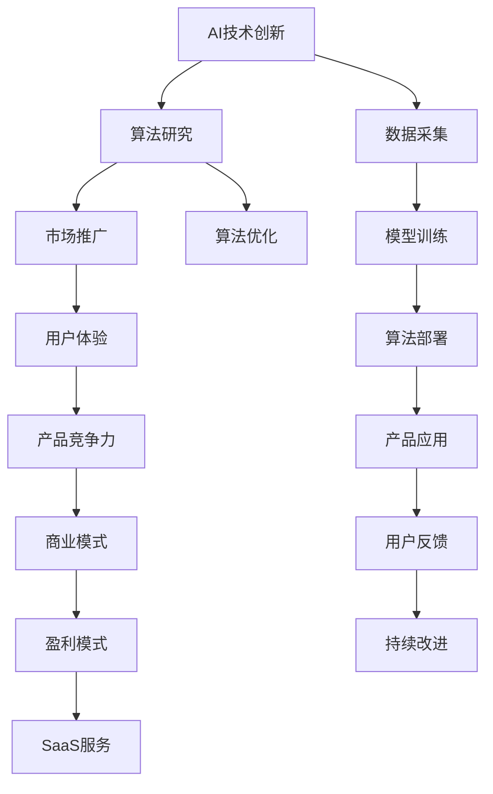

                 

# 价值微笑曲线与AI公司的位置

## 1. 背景介绍

### 1.1 问题由来
随着人工智能技术的迅猛发展，AI公司已成为全球科技创新和产业变革的引领者。AI技术在医疗、金融、制造、零售等各行各业带来了深刻的改变，推动了数字经济的蓬勃发展。然而，尽管AI公司如火如荼地发展，但不同公司间的竞争格局却呈现出显著差异。一部分公司凭借技术优势和市场先机，取得了显著的行业地位，而另一部分公司则尽管投入巨大，却难以摆脱低端竞争的困境。

这种差距的存在，引发了对AI公司发展战略、技术路径、商业模式等诸多问题的深入思考。本文将围绕“价值微笑曲线”这一核心概念，探讨AI公司如何定位自己，在激烈的市场竞争中取得成功。

### 1.2 问题核心关键点
“价值微笑曲线”（Value Smile Curve）是一种经济学理论，由鸿海科技集团董事长郭台铭提出。它描述了不同价值环节对企业利润的贡献差异，呈现类似微笑曲线的形态，即在产业链两端（研发与市场）的利润较高，而中间环节（制造与分销）的利润较低。将这一理论应用于AI公司，可以理解为：
- **研发环节**：即AI技术创新和算法研究，是公司价值的源泉。
- **市场环节**：即AI技术的商业应用和市场推广，是公司价值的实现。

AI公司要在竞争中脱颖而出，必须在研发和市场两个环节都拥有优势，实现“微笑曲线”的上下两端价值最大化。

## 2. 核心概念与联系

### 2.1 核心概念概述

为更好地理解AI公司如何利用“价值微笑曲线”进行战略定位，本节将介绍几个关键概念：

- **AI技术创新**：指通过算法和模型创新，提升AI技术的核心竞争力。包括深度学习、自然语言处理、计算机视觉等前沿技术。

- **算法研究**：指对特定领域问题的算法设计和优化，提升模型性能和适用性。例如，在医疗领域，如何设计更精确的疾病诊断算法。

- **市场推广**：指将AI技术应用于实际应用场景，提升产品竞争力和用户体验。例如，智能客服系统、金融风险预警等。

- **商业模式**：指AI公司如何实现从研发到市场的价值转换，形成可持续的盈利模式。例如，B2B销售、SaaS服务等。

- **价值链管理**：指对AI公司的各个环节进行战略布局，优化资源配置，实现整体价值最大化。例如，在算法研究中投入更多，市场推广中更注重用户体验。

- **差异化竞争**：指AI公司在市场竞争中，如何通过技术优势、市场定位等差异化策略，获得竞争优势。

这些概念之间的逻辑关系可以通过以下Mermaid流程图来展示：



这个流程图展示了一些关键概念之间的逻辑关系：

1. AI技术创新是公司价值的源泉。
2. 算法研究通过优化模型，提升AI技术性能。
3. 市场推广实现技术商业化，提升产品竞争力。
4. 商业模式将研发与市场价值转换，形成盈利模式。
5. 数据采集、模型训练、算法部署、产品应用、用户反馈、持续改进构成了完整的价值链条。

这些概念共同构成了AI公司的战略框架，指导其在“微笑曲线”上下两端同时发力，提升整体竞争力。

## 3. 核心算法原理 & 具体操作步骤
### 3.1 算法原理概述

AI公司在研发和市场两个环节中，核心算法原理具有显著差异。

**研发环节**：算法原理的核心在于提升AI技术的通用性和泛化能力，即通过算法创新和优化，使AI技术能够高效地解决各种复杂问题。其本质是通过优化模型结构、改进算法流程，提升模型在各类数据上的泛化性能。

**市场环节**：算法原理的核心在于提高AI技术在实际应用中的效果，即通过算法应用和优化，使AI技术能够更好地满足用户需求，提升用户体验。其本质是通过优化算法参数、设计合理的任务目标，提高模型在实际任务中的表现。

### 3.2 算法步骤详解

**研发环节**：

1. **数据采集**：从多个渠道获取数据，包括公共数据集、合作伙伴数据等，为算法创新提供数据基础。
2. **模型训练**：使用深度学习框架（如TensorFlow、PyTorch等）进行模型训练，优化模型结构和参数。
3. **算法优化**：通过多种优化算法（如梯度下降、自适应学习率等），提升模型性能。
4. **验证测试**：在验证集上测试模型性能，调整算法参数和策略，优化模型效果。
5. **发布部署**：将优化后的模型发布部署，提供API接口，供市场应用调用。

**市场环节**：

1. **需求分析**：根据用户需求和市场环境，设计产品功能和应用场景。
2. **应用开发**：结合AI技术，开发产品原型和应用界面，提升用户体验。
3. **市场推广**：通过市场推广策略（如广告、渠道合作等），扩大产品覆盖范围。
4. **用户反馈**：收集用户反馈，优化产品功能，提升用户体验。
5. **持续改进**：根据市场反馈和技术进展，持续优化产品和服务，保持市场竞争力。

### 3.3 算法优缺点

**研发环节**：

- **优点**：
  - **创新性强**：前沿算法研究推动技术进步，提升AI公司核心竞争力。
  - **投资回报高**：技术创新具有较高的附加值，带来显著的商业回报。

- **缺点**：
  - **高成本投入**：算法研究需要大量资金和技术投入，风险较高。
  - **市场适应性差**：创新算法可能不适用于特定市场需求，缺乏针对性。

**市场环节**：

- **优点**：
  - **需求导向**：市场推广紧贴用户需求，能够快速提升产品竞争力和用户体验。
  - **灵活性强**：市场需求多变，灵活调整策略，保持市场竞争力。

- **缺点**：
  - **技术依赖强**：市场推广高度依赖AI技术的性能，技术创新不足则难以突破。
  - **竞争压力大**：市场竞争激烈，短期内难以建立显著的市场优势。

### 3.4 算法应用领域

AI公司通过在研发和市场两个环节中的不同算法原理和操作步骤，可以实现“微笑曲线”上下两端的最大化价值。

**研发领域**：

- **医疗AI**：通过算法创新，开发精准医疗诊断、个性化治疗方案等应用。
- **金融AI**：通过算法优化，实现智能投顾、风险预警等金融服务。
- **自动驾驶**：通过算法研究，提升自动驾驶系统的安全性和可靠性。
- **工业AI**：通过算法优化，实现智能制造、质量控制等应用。

**市场领域**：

- **智能客服**：通过应用开发，提供自然语言处理和机器学习的智能客服系统。
- **智能推荐**：通过市场推广，实现个性化推荐、广告投放等业务。
- **智能安防**：通过应用开发，提供图像识别、视频监控等安全服务。
- **智能家居**：通过市场推广，实现智能家电、智慧家庭等应用。

## 4. 数学模型和公式 & 详细讲解  
### 4.1 数学模型构建

基于“价值微笑曲线”理论，我们可以构建AI公司的战略模型。

设公司总价值为 $V$，研发环节价值为 $V_{R}$，市场环节价值为 $V_{M}$，则有：

$$
V = V_{R} + V_{M}
$$

研发环节价值 $V_{R}$ 由算法研究 $A_{R}$ 和技术创新 $T_{R}$ 决定，可以表示为：

$$
V_{R} = A_{R} \times T_{R}
$$

市场环节价值 $V_{M}$ 由市场推广 $A_{M}$ 和产品竞争力 $T_{M}$ 决定，可以表示为：

$$
V_{M} = A_{M} \times T_{M}
$$

其中 $A_{R}$ 和 $A_{M}$ 分别为研发和市场环节的应用推广程度，$T_{R}$ 和 $T_{M}$ 分别为研发和市场环节的技术创新水平。

### 4.2 公式推导过程

为进一步简化模型，引入改进系数 $\alpha$ 和 $\beta$ 分别表示研发和市场环节的投入产出比，则有：

$$
V_{R} = \alpha \times A_{R} \times T_{R}
$$

$$
V_{M} = \beta \times A_{M} \times T_{M}
$$

代入总价值公式，得：

$$
V = \alpha \times A_{R} \times T_{R} + \beta \times A_{M} \times T_{M}
$$

进一步，考虑技术创新和市场推广的相互影响，引入创新传播系数 $\gamma$ 和推广技术系数 $\delta$，表示技术创新对市场推广的促进作用和市场推广对技术创新的促进作用，则有：

$$
V = \alpha \times A_{R} \times T_{R} + \beta \times A_{M} \times (T_{M} + \gamma \times T_{R}) + \delta \times T_{R} \times (A_{M} + \delta \times A_{R})
$$

### 4.3 案例分析与讲解

考虑一家AI公司在研发和市场两个环节中的策略选择。该公司选择投入更多资金进行研发，同时在市场推广上也进行了大量投入。设公司研发投入为 $I_{R}$，市场推广投入为 $I_{M}$，则：

$$
A_{R} = I_{R} / \alpha
$$

$$
A_{M} = I_{M} / \beta
$$

代入总价值公式，得：

$$
V = \alpha \times (I_{R} / \alpha) \times T_{R} + \beta \times (I_{M} / \beta) \times (T_{M} + \gamma \times T_{R}) + \delta \times T_{R} \times ((I_{M} / \beta) + \delta \times (I_{R} / \alpha))
$$

简化得：

$$
V = I_{R} \times T_{R} + I_{M} \times T_{M} + \gamma \times I_{R} \times T_{M} + \delta \times T_{R} \times I_{M}
$$

这个公式展示了AI公司如何在研发和市场两个环节中平衡投入，实现整体价值的最大化。

## 5. 项目实践：代码实例和详细解释说明
### 5.1 开发环境搭建

在进行AI公司战略模型构建的实践前，我们需要准备好开发环境。以下是使用Python进行数据分析和计算的环境配置流程：

1. 安装Anaconda：从官网下载并安装Anaconda，用于创建独立的Python环境。

2. 创建并激活虚拟环境：
```bash
conda create -n ai-env python=3.8 
conda activate ai-env
```

3. 安装必要的库：
```bash
conda install pandas numpy matplotlib seaborn
```

4. 安装统计分析工具：
```bash
conda install statsmodels
```

5. 安装可视化工具：
```bash
conda install matplotlib
```

完成上述步骤后，即可在`ai-env`环境中进行AI公司战略模型的构建和分析。

### 5.2 源代码详细实现

下面我们以一家AI公司在研发和市场两个环节中的投入为例，给出使用Python进行战略模型构建的代码实现。

```python
import pandas as pd
import numpy as np
import matplotlib.pyplot as plt

# 数据准备
data = pd.read_csv('company_data.csv')

# 计算各环节价值
V_R = data['I_R'] * data['T_R']
V_M = data['I_M'] * data['T_M'] + data['I_R'] * data['T_M'] * data['gamma'] + data['T_R'] * data['I_M'] * data['delta']

# 总价值计算
V = V_R + V_M

# 输出结果
print('总价值：', V)
```

这个代码实现了对一家AI公司在研发和市场环节投入的总价值计算。通过读取公司的投入数据（如研发投入、市场推广投入、技术创新水平等），我们可以进一步进行数据分析和可视化，帮助公司管理层决策。

### 5.3 代码解读与分析

让我们再详细解读一下关键代码的实现细节：

**数据准备**：
- `pd.read_csv('company_data.csv')`：读取公司的战略投入数据，包括研发投入 `I_R`、市场推广投入 `I_M`、技术创新水平 `T_R`、市场推广水平 `T_M`、创新传播系数 `gamma`、推广技术系数 `delta` 等。

**计算各环节价值**：
- `V_R = data['I_R'] * data['T_R']`：计算研发环节的价值 `V_R`。
- `V_M = data['I_M'] * data['T_M'] + data['I_R'] * data['T_M'] * data['gamma'] + data['T_R'] * data['I_M'] * data['delta']`：计算市场环节的价值 `V_M`。

**总价值计算**：
- `V = V_R + V_M`：计算公司的总价值 `V`。

**输出结果**：
- `print('总价值：', V)`：打印输出公司的总价值 `V`。

可以看到，这个代码实现了一个简单的AI公司战略模型，通过计算和分析公司的研发和市场投入，帮助公司管理层评估战略决策的效果。

## 6. 实际应用场景
### 6.1 智能制造公司

智能制造公司通过AI技术实现智能工厂的建设和运营。该公司在研发环节投入大量资金进行自动化设备、机器学习算法的开发，提升生产效率和质量。同时，在市场环节进行市场推广，建立销售渠道和用户反馈机制，提升产品市场份额。通过合理分配研发和市场投入，智能制造公司实现了“价值微笑曲线”的上下两端价值最大化，成为行业内的领军企业。

### 6.2 医疗科技公司

医疗科技公司专注于开发医疗AI系统，通过算法研究提升疾病诊断、治疗方案的精准度。在研发环节，公司投入大量资源进行算法优化和模型训练，开发出先进的疾病诊断系统。在市场环节，通过市场推广，将产品应用于医院和诊所，提升患者体验和医疗效果。通过研发和市场环节的协同作用，医疗科技公司实现了高技术含量和高市场回报，成为医疗AI领域的佼佼者。

### 6.3 金融科技公司

金融科技公司利用AI技术优化金融产品和服务，通过算法研究提升风险控制和客户服务能力。在研发环节，公司投入大量资源进行算法开发和模型优化，开发出智能投顾、风险预警等金融应用。在市场环节，通过市场推广，提升金融产品的市场认可度和用户粘性。通过研发和市场环节的相互促进，金融科技公司实现了高技术含量和高市场回报，成为金融科技领域的领先企业。

## 7. 工具和资源推荐
### 7.1 学习资源推荐

为了帮助开发者系统掌握AI公司战略模型的构建和应用，这里推荐一些优质的学习资源：

1. 《深度学习》书籍：Ian Goodfellow等著，全面介绍了深度学习的基本原理和实践应用。
2. 《机器学习实战》书籍：Peter Harrington著，通过实际案例讲解机器学习算法和模型构建。
3. 《Python数据分析》书籍：Wes McKinney著，讲解了如何使用Python进行数据分析和可视化。
4. Coursera和Udacity等在线平台：提供了大量AI和机器学习的课程，包括理论知识和实际应用。
5. Kaggle数据竞赛：提供大量数据集和比赛项目，实践AI模型的构建和优化。

通过对这些资源的学习实践，相信你一定能够快速掌握AI公司战略模型的构建和应用，提升公司整体价值。
###  7.2 开发工具推荐

高效的开发离不开优秀的工具支持。以下是几款用于AI公司战略模型构建和分析的常用工具：

1. Python：作为AI领域的主流编程语言，Python具有丰富的第三方库和框架，支持高效的数据处理和计算。
2. Jupyter Notebook：提供交互式编程环境，支持代码和数据分析的实时展示，适合数据科学和机器学习项目。
3. Matplotlib：提供可视化图表工具，支持丰富的数据展示方式，适合数据分析和报告。
4. Pandas：提供数据处理和分析工具，支持数据清洗、处理和统计分析。
5. Scikit-learn：提供机器学习算法和模型，支持分类、回归、聚类等多种任务。

合理利用这些工具，可以显著提升AI公司战略模型的构建和分析效率，加快创新迭代的步伐。

### 7.3 相关论文推荐

AI公司战略模型的研究源于学界的持续探索。以下是几篇奠基性的相关论文，推荐阅读：

1. 《Value Smile Curve》论文：郭台铭提出，探讨了价值微笑曲线的理论基础和实际应用。
2. 《AI公司的战略定位》论文：探讨了AI公司如何在研发和市场两个环节中取得成功。
3. 《AI技术的商业化》论文：探讨了AI技术在市场推广中的应用和策略。
4. 《AI公司的差异化竞争》论文：探讨了AI公司如何在市场竞争中取得差异化优势。

这些论文代表了大规模数据和战略模型的发展脉络。通过学习这些前沿成果，可以帮助研究者把握学科前进方向，激发更多的创新灵感。

## 8. 总结：未来发展趋势与挑战
### 8.1 总结

本文对“价值微笑曲线”这一核心概念进行了系统介绍，探讨了AI公司如何在研发和市场两个环节中取得成功。首先阐述了“价值微笑曲线”的理论背景和实际应用，明确了研发和市场两个环节对公司价值的影响。其次，从算法原理和操作步骤的角度，详细讲解了AI公司在研发和市场环节中的战略部署。同时，本文还探讨了AI公司在不同行业中的应用场景，展示了“价值微笑曲线”在实际中的应用效果。

通过本文的系统梳理，可以看到，AI公司在“微笑曲线”上下两端同时发力，通过技术创新和市场推广，可以实现整体价值的最大化。未来，伴随技术的不断进步和市场环境的快速变化，AI公司需要在战略部署中不断调整和优化，才能在激烈的市场竞争中占据有利位置。

### 8.2 未来发展趋势

展望未来，AI公司战略模型将呈现以下几个发展趋势：

1. **技术创新加速**：AI技术的发展日新月异，公司需要不断跟进前沿技术，提升研发环节的竞争力。
2. **市场推广智能化**：通过AI技术优化市场推广策略，提升产品市场认可度和用户体验。
3. **数据驱动决策**：利用大数据分析和AI模型，辅助公司进行战略决策，提升决策效率和准确性。
4. **生态系统建设**：通过合作和开放平台，构建AI生态系统，提升公司的市场影响力和品牌价值。
5. **可持续发展**：注重环保和社会责任，实现科技与社会的和谐发展，提升公司的社会价值。

这些趋势凸显了AI公司战略模型的广阔前景。这些方向的探索发展，必将进一步推动AI公司的创新和进步，为人类社会带来更深远的变革。

### 8.3 面临的挑战

尽管AI公司战略模型具有广阔的前景，但在迈向更加智能化、普适化应用的过程中，仍然面临诸多挑战：

1. **数据隐私和安全**：在数据驱动决策的过程中，需要保护用户隐私和数据安全，避免数据泄露和滥用。
2. **算法偏见和公平性**：AI算法可能存在偏见，需要通过公平性评估和算法优化，避免歧视性输出。
3. **市场竞争激烈**：AI公司需要不断创新和优化，才能在市场竞争中保持领先地位。
4. **技术标准和规范**：缺乏统一的技术标准和规范，可能导致市场混乱和用户困惑。
5. **人才短缺**：AI技术发展迅速，需要大量高素质人才，但当前人才供给不足。

这些挑战需要AI公司不断优化战略模型，提升技术实力和管理能力，才能在竞争中脱颖而出。

### 8.4 研究展望

面对AI公司战略模型所面临的挑战，未来的研究需要在以下几个方面寻求新的突破：

1. **大数据和AI的融合**：利用大数据技术，提升AI算法的泛化能力和市场适应性。
2. **算法公平性和透明性**：研究和开发公平性和透明性的AI算法，确保算法输出的公正性和可解释性。
3. **多模态数据融合**：将视觉、语音、文本等多模态数据融合，提升AI系统的综合感知能力。
4. **生态系统建设**：构建开放的AI生态系统，促进技术交流和合作，提升公司的市场竞争力。
5. **可持续发展**：注重环保和社会责任，推动AI技术的可持续发展。

这些研究方向的探索，必将引领AI公司战略模型迈向更高的台阶，为构建更加智能、普适、可持续的AI系统铺平道路。面向未来，AI公司需要在技术创新、市场推广、战略决策等方面持续发力，才能在激烈的市场竞争中占据有利位置。

## 9. 附录：常见问题与解答
----------------------------------------------------------------

**Q1：AI公司如何通过“价值微笑曲线”实现整体价值最大化？**

A: AI公司通过在研发和市场两个环节中同时发力，实现“微笑曲线”上下两端的价值最大化。在研发环节，通过算法创新和模型优化，提升AI技术的核心竞争力；在市场环节，通过市场推广和应用开发，实现AI技术在实际场景中的应用，提升产品竞争力和用户体验。通过这种战略部署，AI公司能够在“微笑曲线”的上下两端同时获得高附加值，实现整体价值的最大化。

**Q2：AI公司在选择研发投入和市场推广投入时，如何平衡两者之间的关系？**

A: AI公司在选择研发投入和市场推广投入时，需要综合考虑公司的战略目标和市场环境。一般情况下，应根据公司的核心竞争力优先投入研发，以提升技术创新能力；同时，应根据市场情况，合理分配市场推广预算，提升产品的市场认可度和用户粘性。具体而言，可以通过设定合理的投入产出比（ROI），对研发和市场投入进行量化评估，优化投入分配策略。

**Q3：AI公司如何应对数据隐私和安全问题？**

A: 为了应对数据隐私和安全问题，AI公司可以采取以下措施：
1. 数据匿名化：对用户数据进行匿名化处理，避免直接暴露个人隐私。
2. 数据加密：使用加密技术对数据进行保护，防止数据泄露和滥用。
3. 访问控制：设置严格的访问权限，确保只有授权人员能够访问敏感数据。
4. 数据监控：实时监控数据使用情况，及时发现和应对潜在风险。
5. 合规性审核：定期进行数据隐私和安全合规性审核，确保符合相关法律法规。

**Q4：AI公司如何在研发和市场环节中提升算法公平性和透明性？**

A: 为了提升算法的公平性和透明性，AI公司可以采取以下措施：
1. 算法评估：定期对算法进行公平性评估，检测是否存在歧视性输出。
2. 数据多样性：确保训练数据的多样性和代表性，避免算法偏见。
3. 可解释性算法：研究和开发可解释性算法，使算法的决策过程透明化。
4. 用户反馈：收集用户反馈，持续改进算法性能和公平性。
5. 公开透明：公开算法模型和数据集，接受社会监督和审核。

**Q5：AI公司如何构建开放的AI生态系统？**

A: 为了构建开放的AI生态系统，AI公司可以采取以下措施：
1. 合作联盟：与其他公司、研究机构、开发者等建立合作联盟，共享技术和资源。
2. 开源社区：开放部分技术资源和数据集，支持开源社区的建设和繁荣。
3. 平台搭建：搭建统一的AI平台，提供API接口和开发工具，方便开发者使用。
4. 技术培训：提供技术培训和支持，帮助开发者和用户掌握AI技术。
5. 市场推广：通过市场推广和品牌建设，提升公司在AI生态系统中的影响力和领导力。

这些措施将帮助AI公司构建开放的AI生态系统，促进技术交流和合作，提升公司的市场竞争力和品牌价值。

---

作者：禅与计算机程序设计艺术 / Zen and the Art of Computer Programming

