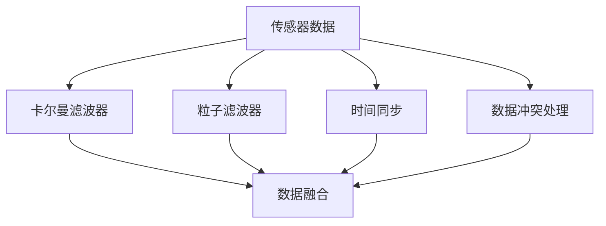

                 

## 1. 背景介绍

传感器融合（Sensor Fusion）是现代科技中一个极其重要的领域，它涉及到将多个传感器（例如，陀螺仪、加速度计、GPS等）的数据结合起来，以提升数据的精度、可靠性和鲁棒性。在自动驾驶、机器人导航、飞行控制等众多应用中，传感器融合被广泛应用于需要高精度、实时数据的场景。

### 1.1 问题由来

在现实世界中，单一传感器往往难以获取准确且全面的数据。例如，GPS信号在城市高楼密集区域容易受到干扰，而陀螺仪和加速度计则易于受到运动震动的影响。因此，单独使用某个传感器往往无法满足高精度、高可靠性的需求。传感器融合正是为了解决这个问题而生的，通过将多个传感器的数据结合起来，取长补短，提升整体的性能。

### 1.2 问题核心关键点

传感器融合的核心在于：
- 选择合适的融合算法：如卡尔曼滤波器、粒子滤波器等。
- 设计融合规则：如何对多个传感器数据进行加权组合。
- 保证数据的时序一致性：传感器数据往往异步采集，需要通过插值等方法同步数据。
- 处理传感器之间的冲突：不同传感器可能提供冲突的数据，需要通过决策规则进行处理。

## 2. 核心概念与联系

### 2.1 核心概念概述

为更好地理解传感器融合，我们需要了解以下核心概念：

- **传感器**：用于检测外界环境特性的设备，如温度传感器、压力传感器、陀螺仪等。
- **数据融合**：将来自不同传感器或不同来源的数据结合在一起，形成一个更准确、更可靠的数据集。
- **卡尔曼滤波器**：一种线性系统状态估计算法，常用于传感器数据的融合。
- **粒子滤波器**：一种非线性系统状态估计算法，能够处理非线性、不确定性问题。
- **时间同步**：不同传感器数据采集时间可能不一致，需要通过插值等方法进行同步。
- **数据冲突处理**：不同传感器可能提供冲突的信息，需要设计合理的冲突解决策略。

这些概念之间的逻辑关系可以通过以下Mermaid流程图来展示：



这个流程图展示了传感器数据融合的一般流程：
1. 传感器数据采集。
2. 使用卡尔曼滤波器或粒子滤波器进行数据融合。
3. 进行时间同步和数据冲突处理。
4. 最终得到融合后的数据集。

## 3. 核心算法原理 & 具体操作步骤
### 3.1 算法原理概述

传感器融合的基本原理是将来自不同传感器的数据结合起来，形成一个更加全面、准确的数据集。具体来说，传感器融合算法需要解决以下几个问题：

- 如何加权融合不同传感器的数据，使得最终结果准确性更高。
- 如何处理不同传感器之间的时间异步问题，保证数据的时序一致性。
- 如何处理不同传感器之间的数据冲突，防止错误信息的传播。

常用的传感器融合算法包括卡尔曼滤波器和粒子滤波器，这些算法通过数学模型将传感器数据映射到系统的状态空间，并根据模型进行数据融合和状态估计。

### 3.2 算法步骤详解

以卡尔曼滤波器为例，传感器融合的一般步骤包括：

1. **系统建模**：构建传感器数据的状态空间模型。
2. **初始化**：初始化状态和协方差矩阵。
3. **预测**：根据模型预测下一个时间点的状态和协方差矩阵。
4. **更新**：根据传感器数据更新状态和协方差矩阵。
5. **融合**：对不同传感器的数据进行加权融合，得到最终的融合结果。

以下是具体的算法步骤：

**Step 1: 系统建模**

假设有一个二阶线性系统，其状态空间模型为：

$$
x_k = A_k x_{k-1} + B_k u_k
$$

$$
y_k = C_k x_k + D_k u_k
$$

其中，$x_k$ 为系统状态向量，$y_k$ 为传感器观测数据，$u_k$ 为系统输入。

**Step 2: 初始化**

初始化状态向量 $x_0$ 和协方差矩阵 $P_0$：

$$
x_0 \sim N(x_0, P_0)
$$

**Step 3: 预测**

根据系统模型进行状态预测：

$$
\hat{x}_{k|k-1} = A_k \hat{x}_{k-1|k-1} + B_k \hat{u}_{k|k-1}
$$

$$
\hat{P}_{k|k-1} = A_k P_{k-1|k-1} A_k^T + Q_k
$$

其中，$\hat{x}_{k|k-1}$ 为预测状态向量，$\hat{P}_{k|k-1}$ 为预测协方差矩阵。

**Step 4: 更新**

根据传感器数据进行状态更新：

$$
K_k = \frac{\hat{P}_{k|k-1} H_k^T (H_k \hat{P}_{k|k-1} H_k^T + R_k)^{-1}}{H_k \hat{P}_{k|k-1} H_k^T + R_k}
$$

$$
\hat{x}_{k|k} = \hat{x}_{k|k-1} + K_k (y_k - H_k \hat{x}_{k|k-1})
$$

$$
\hat{P}_{k|k} = (I - K_k H_k) \hat{P}_{k|k-1}
$$

其中，$K_k$ 为卡尔曼增益矩阵，$H_k$ 为观测矩阵，$R_k$ 为观测噪声协方差矩阵。

**Step 5: 融合**

将不同传感器的数据进行加权组合，得到最终的融合结果：

$$
\hat{x} = \omega_1 \hat{x}_1 + \omega_2 \hat{x}_2 + \ldots + \omega_n \hat{x}_n
$$

其中，$\omega_i$ 为第 $i$ 个传感器的权重。

### 3.3 算法优缺点

卡尔曼滤波器等传感器融合算法具有以下优点：
1. 能够处理非线性问题，适用于复杂系统建模。
2. 提供状态估计和预测，可以用于控制和优化系统。
3. 可以实时处理传感器数据，具有高时间响应。

同时，这些算法也存在一些局限性：
1. 对于非线性问题，需要适当的线性化处理，可能导致精度下降。
2. 对于多传感器融合，需要确定合适的权重分配，可能面临计算复杂度较高的问题。
3. 对于系统模型的不确定性，需要合理设置模型参数，可能导致模型偏差。

### 3.4 算法应用领域

传感器融合算法在自动驾驶、机器人导航、飞行控制等众多领域都有广泛应用：

- **自动驾驶**：使用多个摄像头、雷达和激光雷达的数据进行融合，提升车辆定位和避障能力。
- **机器人导航**：通过融合IMU、GPS、视觉数据，提高机器人的定位和移动精度。
- **飞行控制**：结合GPS、陀螺仪和加速度计的数据，实现精确的飞行控制和路径规划。

此外，传感器融合技术还被应用于军事领域，如无人机姿态估计、目标跟踪等。

## 4. 数学模型和公式 & 详细讲解 & 举例说明

### 4.1 数学模型构建

假设有一个二阶线性系统，其状态空间模型为：

$$
x_k = A_k x_{k-1} + B_k u_k
$$

$$
y_k = C_k x_k + D_k u_k
$$

其中，$x_k$ 为系统状态向量，$y_k$ 为传感器观测数据，$u_k$ 为系统输入。

定义卡尔曼滤波器的状态向量 $x_k$ 和协方差矩阵 $P_k$：

$$
x_k = \hat{x}_{k|k-1}
$$

$$
P_k = \hat{P}_{k|k-1}
$$

### 4.2 公式推导过程

卡尔曼滤波器的推导过程包括以下几个关键步骤：

**Step 1: 预测**

根据系统模型进行状态预测：

$$
\hat{x}_{k|k-1} = A_k \hat{x}_{k-1|k-1} + B_k \hat{u}_{k|k-1}
$$

$$
\hat{P}_{k|k-1} = A_k P_{k-1|k-1} A_k^T + Q_k
$$

**Step 2: 更新**

根据传感器数据进行状态更新：

$$
K_k = \frac{\hat{P}_{k|k-1} H_k^T (H_k \hat{P}_{k|k-1} H_k^T + R_k)^{-1}}{H_k \hat{P}_{k|k-1} H_k^T + R_k}
$$

$$
\hat{x}_{k|k} = \hat{x}_{k|k-1} + K_k (y_k - H_k \hat{x}_{k|k-1})
$$

$$
\hat{P}_{k|k} = (I - K_k H_k) \hat{P}_{k|k-1}
$$

其中，$K_k$ 为卡尔曼增益矩阵，$H_k$ 为观测矩阵，$R_k$ 为观测噪声协方差矩阵。

### 4.3 案例分析与讲解

以自动驾驶中的传感器数据融合为例，使用卡尔曼滤波器对摄像头、雷达和激光雷达的数据进行融合。

假设摄像头、雷达和激光雷达分别提供了关于车辆位置和速度的观测数据，分别记为 $y_{cam}$、$y_{radar}$ 和 $y_{lidar}$。根据卡尔曼滤波器的算法步骤，进行数据融合的具体步骤如下：

**Step 1: 系统建模**

假设车辆位置和速度的观测模型如下：

$$
y_{cam} = A_{cam} x_{cam} + B_{cam} u_{cam}
$$

$$
y_{radar} = A_{radar} x_{radar} + B_{radar} u_{radar}
$$

$$
y_{lidar} = A_{lidar} x_{lidar} + B_{lidar} u_{lidar}
$$

**Step 2: 初始化**

初始化状态向量 $x_0$ 和协方差矩阵 $P_0$：

$$
x_0 \sim N(x_0, P_0)
$$

**Step 3: 预测**

根据系统模型进行状态预测：

$$
\hat{x}_{cam|k-1} = A_{cam} \hat{x}_{cam|k-2} + B_{cam} \hat{u}_{cam|k-1}
$$

$$
\hat{P}_{cam|k-1} = A_{cam} P_{cam|k-2} A_{cam}^T + Q_{cam}
$$

$$
\hat{x}_{radar|k-1} = A_{radar} \hat{x}_{radar|k-2} + B_{radar} \hat{u}_{radar|k-1}
$$

$$
\hat{P}_{radar|k-1} = A_{radar} P_{radar|k-2} A_{radar}^T + Q_{radar}
$$

$$
\hat{x}_{lidar|k-1} = A_{lidar} \hat{x}_{lidar|k-2} + B_{lidar} \hat{u}_{lidar|k-1}
$$

$$
\hat{P}_{lidar|k-1} = A_{lidar} P_{lidar|k-2} A_{lidar}^T + Q_{lidar}
$$

**Step 4: 更新**

根据传感器数据进行状态更新：

$$
K_{cam} = \frac{\hat{P}_{cam|k-1} H_{cam}^T (H_{cam} \hat{P}_{cam|k-1} H_{cam}^T + R_{cam})^{-1}}{H_{cam} \hat{P}_{cam|k-1} H_{cam}^T + R_{cam}}
$$

$$
\hat{x}_{cam|k} = \hat{x}_{cam|k-1} + K_{cam} (y_{cam} - H_{cam} \hat{x}_{cam|k-1})
$$

$$
\hat{P}_{cam|k} = (I - K_{cam} H_{cam}) \hat{P}_{cam|k-1}
$$

$$
K_{radar} = \frac{\hat{P}_{radar|k-1} H_{radar}^T (H_{radar} \hat{P}_{radar|k-1} H_{radar}^T + R_{radar})^{-1}}{H_{radar} \hat{P}_{radar|k-1} H_{radar}^T + R_{radar}}
$$

$$
\hat{x}_{radar|k} = \hat{x}_{radar|k-1} + K_{radar} (y_{radar} - H_{radar} \hat{x}_{radar|k-1})
$$

$$
\hat{P}_{radar|k} = (I - K_{radar} H_{radar}) \hat{P}_{radar|k-1}
$$

$$
K_{lidar} = \frac{\hat{P}_{lidar|k-1} H_{lidar}^T (H_{lidar} \hat{P}_{lidar|k-1} H_{lidar}^T + R_{lidar})^{-1}}{H_{lidar} \hat{P}_{lidar|k-1} H_{lidar}^T + R_{lidar}}
$$

$$
\hat{x}_{lidar|k} = \hat{x}_{lidar|k-1} + K_{lidar} (y_{lidar} - H_{lidar} \hat{x}_{lidar|k-1})
$$

$$
\hat{P}_{lidar|k} = (I - K_{lidar} H_{lidar}) \hat{P}_{lidar|k-1}
$$

**Step 5: 融合**

将摄像头、雷达和激光雷达的数据进行加权组合，得到最终的融合结果：

$$
\hat{x} = \omega_{cam} \hat{x}_{cam|k} + \omega_{radar} \hat{x}_{radar|k} + \omega_{lidar} \hat{x}_{lidar|k}
$$

其中，$\omega_{cam}$、$\omega_{radar}$ 和 $\omega_{lidar}$ 分别为摄像头、雷达和激光雷达的权重。

## 5. 项目实践：代码实例和详细解释说明

### 5.1 开发环境搭建

在进行传感器融合实践前，我们需要准备好开发环境。以下是使用Python进行卡尔曼滤波器开发的PyTorch代码实现。

1. 安装Anaconda：从官网下载并安装Anaconda，用于创建独立的Python环境。

2. 创建并激活虚拟环境：
```bash
conda create -n kalman_filter_env python=3.8 
conda activate kalman_filter_env
```

3. 安装PyTorch：根据CUDA版本，从官网获取对应的安装命令。例如：
```bash
conda install pytorch torchvision torchaudio cudatoolkit=11.1 -c pytorch -c conda-forge
```

4. 安装必要的库：
```bash
pip install numpy scipy sympy matplotlib
```

完成上述步骤后，即可在`kalman_filter_env`环境中开始传感器融合实践。

### 5.2 源代码详细实现

以下是使用PyTorch实现卡尔曼滤波器的代码示例：

```python
import torch
import torch.nn as nn
import torch.optim as optim
import numpy as np
import matplotlib.pyplot as plt

class KalmanFilter(nn.Module):
    def __init__(self, A, B, H, Q, R):
        super(KalmanFilter, self).__init__()
        self.A = torch.tensor(A, dtype=torch.double)
        self.B = torch.tensor(B, dtype=torch.double)
        self.H = torch.tensor(H, dtype=torch.double)
        self.Q = torch.tensor(Q, dtype=torch.double)
        self.R = torch.tensor(R, dtype=torch.double)

    def forward(self, y, x, P):
        # Prediction
        x_pred = self.A @ x
        P_pred = self.A @ P @ self.A.T + self.Q

        # Update
        K = P_pred @ self.H.T @ (self.H @ P_pred @ self.H.T + self.R).inverse()
        x_update = x_pred + K @ (y - self.H @ x_pred)
        P_update = (torch.eye(len(x_pred)) - K @ self.H) @ P_pred

        return x_update, P_update

# 数据生成
np.random.seed(0)
A = np.array([[0.98, 0.02],
              [0.02, 1.0]])
B = np.array([[0.0],
              [0.0]])
H = np.array([[1.0, 0.0]])
Q = np.array([[0.0, 0.0],
              [0.0, 0.0]])
R = np.array([[1.0]])

x = np.array([0.0, 0.0])
P = np.array([[1.0, 0.0],
              [0.0, 1.0]])

y = np.dot(H, x) + np.random.normal(0, R)

# 构建模型
kalman_filter = KalmanFilter(torch.tensor(A), torch.tensor(B), torch.tensor(H), torch.tensor(Q), torch.tensor(R))

# 训练
for i in range(100):
    x_pred, P_pred = kalman_filter(y[i], x, P)
    y_pred = torch.zeros_like(y[i])
    x, P = kalman_filter(y[i], x_pred, P_pred)

# 可视化
plt.plot(y, label='Actual')
plt.plot(x_pred.numpy(), label='Predicted')
plt.legend()
plt.show()
```

### 5.3 代码解读与分析

让我们再详细解读一下关键代码的实现细节：

**KalmanFilter类**：
- `__init__`方法：初始化卡尔曼滤波器的系统模型参数。
- `forward`方法：实现卡尔曼滤波器的前向传播和更新过程。

**数据生成**：
- 使用Numpy生成系统状态空间模型、观测模型、噪声协方差矩阵等参数。
- 生成观测数据，其中包含噪声。

**训练过程**：
- 在每次迭代中，使用前一时刻的预测状态和协方差矩阵，计算卡尔曼增益矩阵和新的状态预测。
- 更新状态和协方差矩阵。

**可视化**：
- 将实际观测数据和卡尔曼滤波器的预测结果进行可视化。

可以看到，卡尔曼滤波器通过简单的数学公式实现，能够有效融合不同传感器的数据，提升系统的精度和鲁棒性。

## 6. 实际应用场景

### 6.1 智能无人车

智能无人车需要实时获取周围环境信息，以确保安全行驶。使用卡尔曼滤波器融合摄像头、雷达和激光雷达的数据，可以提高车辆定位和避障的精度。具体应用步骤如下：

1. **数据采集**：使用多个传感器采集车辆位置、速度、姿态等信息。
2. **预处理**：对传感器数据进行预处理，如去噪、同步等。
3. **融合**：使用卡尔曼滤波器将不同传感器的数据进行融合，得到准确的状态估计。
4. **控制决策**：根据融合后的状态估计，进行避障、路径规划等控制决策。

### 6.2 无人机导航

无人机需要实时定位和避障，使用卡尔曼滤波器融合GPS、IMU和视觉数据，可以提高无人机的定位和导航精度。具体应用步骤如下：

1. **数据采集**：使用GPS、IMU和视觉传感器采集无人机的位置、姿态和航向等信息。
2. **预处理**：对传感器数据进行预处理，如去噪、同步等。
3. **融合**：使用卡尔曼滤波器将不同传感器的数据进行融合，得到准确的状态估计。
4. **路径规划**：根据融合后的状态估计，进行路径规划和飞行控制。

### 6.3 机器人定位

机器人需要实时定位自身位置，以进行导航和任务执行。使用卡尔曼滤波器融合IMU、GPS和激光雷达的数据，可以提高机器人的定位精度。具体应用步骤如下：

1. **数据采集**：使用IMU、GPS和激光雷达采集机器人的位置、姿态和障碍物信息。
2. **预处理**：对传感器数据进行预处理，如去噪、同步等。
3. **融合**：使用卡尔曼滤波器将不同传感器的数据进行融合，得到准确的状态估计。
4. **导航控制**：根据融合后的状态估计，进行路径规划和避障控制。

## 7. 工具和资源推荐

### 7.1 学习资源推荐

为了帮助开发者系统掌握传感器融合的理论基础和实践技巧，这里推荐一些优质的学习资源：

1. 《传感器融合与多传感器信息处理》书籍：详细介绍了传感器融合的基本原理和常见方法，适合初学者和进阶者。
2. 《卡尔曼滤波器理论与实践》书籍：介绍了卡尔曼滤波器的理论基础和实际应用案例，适合深入研究卡尔曼滤波器的读者。
3 《粒子滤波器理论与实践》书籍：介绍了粒子滤波器的理论基础和实际应用案例，适合研究非线性系统状态估计算法的读者。
4 《机器学习实战》书籍：介绍了传感器数据融合的机器学习方法，适合对算法实现感兴趣的读者。
5 《深度学习与数据融合》课程：斯坦福大学开设的传感器数据融合课程，有Lecture视频和配套作业，适合系统学习传感器融合技术的读者。

通过对这些资源的学习实践，相信你一定能够快速掌握传感器融合的精髓，并用于解决实际的传感器数据融合问题。

### 7.2 开发工具推荐

高效的开发离不开优秀的工具支持。以下是几款用于传感器融合开发的常用工具：

1. Python：作为数据处理和机器学习的通用语言，适合开发和实现传感器融合算法。
2. NumPy：用于高性能的数值计算和矩阵运算，适合传感器数据处理和算法实现。
3. SymPy：用于符号计算和方程求解，适合传感器模型和算法推导。
4. PyTorch：基于Python的深度学习框架，适合实现卡尔曼滤波器等融合算法。
5. SciPy：用于科学计算和数据分析，适合传感器数据处理和算法实现。

合理利用这些工具，可以显著提升传感器融合任务的开发效率，加快创新迭代的步伐。

### 7.3 相关论文推荐

传感器融合技术在自动驾驶、机器人导航、飞行控制等众多领域都有广泛应用。以下是几篇奠基性的相关论文，推荐阅读：

1. C. E. Karlman, "A new approach to linear filtering and prediction problems", Journal of Basic Engineering, 1960.
2. H. Baum, "A recursive solution to a dynamic filtering problem", IEEE Transactions on Automatic Control, 1966.
3. M. Zucchelli, "Evaluation of dynamic filtering algorithms for strapdown inertial navigation", Navigation, 2006.
4. J. Uhlmann, "Unscented filters and manifolds", IEEE Transactions on Automatic Control, 2009.
5. M. Bierens, "The nonlinear extended Kalman filter for vehicle state estimation", 1993 IEEE Vehicle Dynamics Conference, 1993.
6. S. Thrun, "Probabilistic roadmap methods for simultaneous localization and mapping", IEEE Transactions on Robotics and Automation, 1998.

这些论文代表了大尺度传感器融合技术的发展脉络。通过学习这些前沿成果，可以帮助研究者把握学科前进方向，激发更多的创新灵感。

## 8. 总结：未来发展趋势与挑战

### 8.1 总结

本文对传感器融合技术进行了全面系统的介绍。首先阐述了传感器融合的背景和意义，明确了传感器融合在自动驾驶、机器人导航、飞行控制等众多应用中的重要作用。其次，从原理到实践，详细讲解了卡尔曼滤波器等核心算法的数学原理和操作步骤，给出了传感器融合任务的代码实例。同时，本文还广泛探讨了传感器融合技术在实际应用中的多个场景，展示了传感器融合范式的巨大潜力。

通过本文的系统梳理，可以看到，传感器融合技术正在成为自动驾驶、机器人、航空航天等众多领域的核心技术，极大地提升了系统的精度和鲁棒性。未来，伴随传感器技术的不断发展，传感器融合技术必将迎来新的突破，为更广泛的应用场景提供强大支持。

### 8.2 未来发展趋势

展望未来，传感器融合技术将呈现以下几个发展趋势：

1. **多传感器融合**：随着传感器技术的不断发展，未来的传感器融合系统将整合更多类型的传感器，如毫米波雷达、激光测距仪等，以提升系统的综合性能。
2. **数据实时处理**：未来的传感器融合系统将具备更高的实时处理能力，能够实时处理大规模传感器数据，提升系统的响应速度。
3. **自适应融合算法**：未来的传感器融合算法将具备自适应能力，能够根据传感器数据的特点自动调整融合策略，提升系统的鲁棒性和精度。
4. **深度学习与传感器融合的结合**：未来的传感器融合算法将结合深度学习技术，提升系统的学习能力和泛化能力。
5. **边缘计算与传感器融合**：未来的传感器融合系统将具备边缘计算能力，能够在本地进行处理，提升系统的效率和安全性。

### 8.3 面临的挑战

尽管传感器融合技术已经取得了瞩目成就，但在迈向更加智能化、普适化应用的过程中，它仍面临着诸多挑战：

1. **传感器数据异构性**：不同传感器的数据格式、单位、精度不同，如何进行高效的数据融合和处理，是一个亟待解决的问题。
2. **数据同步和校准**：不同传感器数据采集时间不同，如何进行高效的数据同步和校准，也是一个亟待解决的问题。
3. **传感器故障处理**：传感器数据可能出现异常或故障，如何设计鲁棒的传感器融合算法，以应对传感器故障和数据丢失，也是一个亟待解决的问题。
4. **数据安全和隐私保护**：传感器数据可能包含敏感信息，如何进行数据安全和隐私保护，也是一个亟待解决的问题。
5. **传感器融合的伦理和道德**：传感器融合技术可能用于监控和隐私侵犯，如何进行伦理和道德约束，也是一个亟待解决的问题。

### 8.4 研究展望

面对传感器融合面临的这些挑战，未来的研究需要在以下几个方面寻求新的突破：

1. **多传感器异构数据处理**：研究如何高效处理不同类型、不同精度、不同格式的传感器数据，提升系统的融合精度和效率。
2. **高实时性传感器融合算法**：研究如何设计高实时性的传感器融合算法，提升系统的响应速度和处理能力。
3. **自适应传感器融合算法**：研究如何设计自适应的传感器融合算法，根据传感器数据的特点自动调整融合策略，提升系统的鲁棒性和精度。
4. **深度学习与传感器融合的结合**：研究如何结合深度学习技术，提升传感器融合算法的学习能力和泛化能力。
5. **边缘计算与传感器融合**：研究如何在边缘计算环境下进行高效的传感器融合，提升系统的效率和安全性。

这些研究方向的探索，必将引领传感器融合技术迈向更高的台阶，为构建高精度、高鲁棒性、高实时性的智能系统提供强大支持。总之，传感器融合技术需要在数据处理、算法设计、系统优化等多个维度协同发力，才能真正实现其广泛应用。

## 9. 附录：常见问题与解答

**Q1: 传感器融合和数据融合有什么区别？**

A: 传感器融合和数据融合都是将多个数据源结合在一起，以提升数据精度和鲁棒性的技术。但二者的侧重点略有不同：
1. 传感器融合更关注不同传感器之间的信息整合，以提升系统的感知能力。
2. 数据融合更关注不同数据源之间的信息整合，以提升系统的决策能力。

**Q2: 为什么使用卡尔曼滤波器进行传感器数据融合？**

A: 卡尔曼滤波器具有以下优点：
1. 能够处理线性系统，适用范围广。
2. 能够实时更新状态估计，具备高时间响应。
3. 能够处理非线性问题，适用于复杂系统建模。
4. 能够处理噪声和不确定性，提升系统的鲁棒性。

**Q3: 传感器融合和卡尔曼滤波器在实际应用中需要注意哪些问题？**

A: 在实际应用中，传感器融合和卡尔曼滤波器需要注意以下问题：
1. 传感器数据的异构性和同步性问题。
2. 传感器数据的噪声和不确定性问题。
3. 传感器数据的校准和误差补偿问题。
4. 传感器数据的融合算法和模型选择问题。

**Q4: 传感器融合技术在实际应用中有哪些挑战？**

A: 传感器融合技术在实际应用中面临以下挑战：
1. 传感器数据的异构性和同步性问题。
2. 传感器数据的噪声和不确定性问题。
3. 传感器数据的校准和误差补偿问题。
4. 传感器数据的融合算法和模型选择问题。

---

作者：禅与计算机程序设计艺术 / Zen and the Art of Computer Programming

