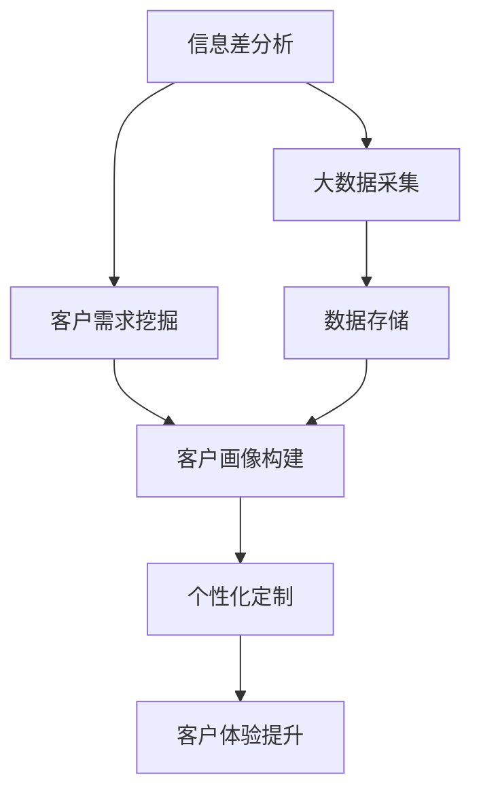

                 

# 信息差的商业客户体验个性化：大数据如何实现客户体验个性化

> 关键词：信息差, 商业, 客户体验, 个性化, 大数据

## 1. 背景介绍

### 1.1 问题由来
在当今竞争激烈的商业环境中，客户体验已成为企业制胜的关键。然而，由于信息不对称，许多企业在了解和满足客户需求方面面临巨大挑战。具体而言，信息差（Information Gap）指的是企业与客户在信息获取上的不对等，导致客户需求未能被充分理解与满足，从而影响商业决策和运营效率。因此，如何通过大数据分析，有效缩小信息差，实现客户体验的个性化定制，成为众多企业面临的重大难题。

### 1.2 问题核心关键点
本文聚焦于如何利用大数据技术，分析和理解客户的个性化需求，从而提升商业客户体验。为此，我们需要深入探讨以下核心问题：
1. 信息差的概念及其对客户体验的影响。
2. 大数据技术在信息差分析中的应用。
3. 客户体验个性化的实现方法。
4. 大数据技术面临的挑战及应对策略。

### 1.3 问题研究意义
在信息技术日益普及和互联网技术飞速发展的今天，大数据技术为企业提供了前所未有的机会，通过数据驱动的决策制定，可以大幅提升客户体验，进而增强企业的市场竞争力。研究如何通过大数据技术实现客户体验的个性化，对于提升企业的市场响应速度、降低运营成本、提高客户满意度等方面具有重要意义。

## 2. 核心概念与联系

### 2.1 核心概念概述

为了更好地理解利用大数据技术实现客户体验个性化的过程，本文将介绍以下几个关键概念：

- **信息差（Information Gap）**：指企业与客户之间在信息获取上的不对等，导致客户需求未能被充分理解与满足的现象。
- **大数据（Big Data）**：指数据量巨大、类型多样、处理复杂的数据集合。通过大数据分析，可以从海量数据中挖掘出有价值的信息，为决策提供支持。
- **客户体验（Customer Experience）**：指客户在接触企业产品或服务过程中，对产品或服务的主观感受和情感体验。
- **个性化（Personalization）**：指根据客户的需求、偏好等特征，量身定制产品或服务，提供差异化体验的过程。

这些概念之间相互关联，共同构成客户体验个性化的大数据应用框架。通过信息差分析，可以理解客户需求的差异性；通过大数据技术，可以从数据中挖掘客户需求，实现个性化定制；而客户体验个性化则通过提供差异化服务，提升客户满意度和忠诚度。

### 2.2 核心概念原理和架构的 Mermaid 流程图(Mermaid 流程节点中不要有括号、逗号等特殊字符)



该流程图展示了利用大数据技术实现客户体验个性化的核心步骤：
1. **信息差分析**：通过数据分析，理解客户与企业之间在信息获取上的不对等。
2. **大数据采集**：收集和整合各种来源的数据，为后续分析提供数据基础。
3. **客户需求挖掘**：从大数据中挖掘客户需求和偏好。
4. **客户画像构建**：基于客户需求，构建个性化的客户画像。
5. **个性化定制**：根据客户画像，提供差异化的产品或服务。
6. **客户体验提升**：通过个性化定制，提升客户满意度。

## 3. 核心算法原理 & 具体操作步骤

### 3.1 算法原理概述

利用大数据技术实现客户体验个性化，主要遵循以下步骤：

1. **信息差分析**：通过数据分析，识别客户需求与企业提供产品或服务之间的差距。
2. **大数据采集**：收集客户在各个渠道的互动数据，包括但不限于网站、社交媒体、客服记录等。
3. **客户需求挖掘**：通过数据挖掘技术，从大量数据中识别出客户的显性和隐性需求。
4. **客户画像构建**：将客户需求转化为具体的客户画像，包括客户偏好、购买行为、情感倾向等。
5. **个性化定制**：基于客户画像，提供差异化的产品或服务，提升客户体验。

### 3.2 算法步骤详解

以下是基于大数据技术实现客户体验个性化的详细步骤：

**Step 1: 数据采集与预处理**
- 使用网络爬虫、API接口、用户互动记录等手段，从多个渠道采集客户数据。
- 对采集到的数据进行清洗、去重、标注等预处理，确保数据质量和一致性。

**Step 2: 信息差分析**
- 使用文本分析、情感分析等技术，分析客户对企业产品和服务的反馈，识别信息差。
- 通过问卷调查、社交媒体监控等方式，收集客户的主观感受和反馈。

**Step 3: 客户需求挖掘**
- 使用聚类、分类、关联规则挖掘等技术，从客户数据中挖掘出客户需求。
- 利用自然语言处理（NLP）技术，提取客户的隐含需求，如情感倾向、购买意图等。

**Step 4: 客户画像构建**
- 通过客户需求的分析，构建客户画像，包括客户的基本信息、兴趣偏好、行为特征等。
- 使用可视化工具，如K-means聚类、PCA降维等，展示客户画像。

**Step 5: 个性化定制**
- 基于客户画像，提供个性化的产品或服务推荐。
- 使用机器学习算法，如协同过滤、内容推荐等，实现个性化推荐。

**Step 6: 客户体验提升**
- 通过个性化推荐和服务，提升客户满意度。
- 收集客户的反馈和评价，持续优化个性化策略。

### 3.3 算法优缺点

利用大数据技术实现客户体验个性化的主要优点包括：
1. **数据驱动**：通过大数据分析，可以更准确地理解客户需求，提升决策的科学性。
2. **实时响应**：可以实时采集和分析客户反馈，快速响应客户需求。
3. **个性化服务**：根据客户画像，提供差异化的服务，提升客户满意度。

然而，这种方法也存在一些缺点：
1. **数据隐私**：采集和分析客户数据可能涉及隐私问题，需严格遵守相关法律法规。
2. **技术复杂**：大数据技术和机器学习算法的应用，需要较高的技术门槛。
3. **数据质量**：数据采集和清洗过程可能存在噪音，影响分析结果的准确性。

### 3.4 算法应用领域

基于大数据技术实现客户体验个性化的应用领域非常广泛，包括但不限于以下几个方面：

- **电子商务**：通过个性化推荐，提升用户购物体验和购买转化率。
- **金融服务**：根据客户财务状况和需求，提供个性化的金融产品和建议。
- **医疗健康**：根据患者病历和偏好，提供个性化的医疗方案和健康管理服务。
- **旅游服务**：根据客户偏好，提供个性化的旅游方案和行程推荐。
- **教育培训**：根据学生学习情况，提供个性化的学习资源和辅导。

## 4. 数学模型和公式 & 详细讲解 & 举例说明（备注：数学公式请使用latex格式，latex嵌入文中独立段落使用 $$，段落内使用 $)
### 4.1 数学模型构建

假设我们有一组客户数据 $D=\{(x_i, y_i)\}_{i=1}^N$，其中 $x_i$ 表示客户的特征向量，$y_i$ 表示客户的需求标签。我们的目标是通过大数据分析，构建客户画像，提供个性化服务。

**Step 1: 数据预处理**
- 使用标准化技术对特征向量进行归一化：
$$
x_i = \frac{x_i - \mu}{\sigma}
$$
其中 $\mu$ 和 $\sigma$ 分别为特征向量的均值和标准差。

**Step 2: 客户画像构建**
- 使用聚类算法，将客户分为不同类别。假设使用K-means算法，客户向量 $x_i$ 与聚类中心的距离 $d_i$ 为：
$$
d_i = \|x_i - \mu_k\|
$$
其中 $\mu_k$ 为第 $k$ 个聚类中心的向量。

**Step 3: 个性化推荐**
- 使用协同过滤算法，根据相似客户的行为推荐产品。假设使用基于余弦相似度的协同过滤算法，设 $x_j$ 为相似客户，则推荐度 $w_{ij}$ 为：
$$
w_{ij} = \cos(\theta) = \frac{\mathbf{x}_i \cdot \mathbf{x}_j}{\|\mathbf{x}_i\|\|\mathbf{x}_j\|}
$$
其中 $\theta$ 为向量夹角余弦值，$\mathbf{x}_i$ 和 $\mathbf{x}_j$ 分别为 $i$ 和 $j$ 客户的特征向量。

### 4.2 公式推导过程

以协同过滤算法为例，推导推荐度 $w_{ij}$ 的计算过程。

设 $x_i$ 和 $x_j$ 分别为第 $i$ 和 $j$ 客户的特征向量，其夹角余弦值 $\cos(\theta)$ 可表示为：
$$
\cos(\theta) = \frac{\mathbf{x}_i \cdot \mathbf{x}_j}{\|\mathbf{x}_i\|\|\mathbf{x}_j\|}
$$
其中 $\mathbf{x}_i \cdot \mathbf{x}_j$ 为向量点积，$\|\mathbf{x}_i\|$ 和 $\|\mathbf{x}_j\|$ 分别为向量的范数。

假设 $x_i$ 和 $x_j$ 中的元素均为数值型，设 $\mathbf{x}_i$ 和 $\mathbf{x}_j$ 分别为：
$$
\mathbf{x}_i = [x_{i1}, x_{i2}, ..., x_{in}]
$$
$$
\mathbf{x}_j = [x_{j1}, x_{j2}, ..., x_{jm}]
$$
其中 $n$ 和 $m$ 分别为特征向量的维度。

点积 $\mathbf{x}_i \cdot \mathbf{x}_j$ 可表示为：
$$
\mathbf{x}_i \cdot \mathbf{x}_j = \sum_{k=1}^{n}x_{ik}x_{jk}
$$

范数 $\|\mathbf{x}_i\|$ 和 $\|\mathbf{x}_j\|$ 可表示为：
$$
\|\mathbf{x}_i\| = \sqrt{\sum_{k=1}^{n}x_{ik}^2}
$$
$$
\|\mathbf{x}_j\| = \sqrt{\sum_{k=1}^{m}x_{jk}^2}
$$

代入上述公式，推荐度 $w_{ij}$ 的计算过程为：
$$
w_{ij} = \frac{\sum_{k=1}^{n}x_{ik}x_{jk}}{\sqrt{\sum_{k=1}^{n}x_{ik}^2}\sqrt{\sum_{k=1}^{m}x_{jk}^2}}
$$

### 4.3 案例分析与讲解

假设我们有一组客户数据，包含客户的浏览记录、购买记录、评论等。我们希望通过分析这些数据，为客户提供个性化的产品推荐。

**案例一：协同过滤推荐**
- 首先，我们将客户数据进行标准化处理，使用K-means算法将客户分为5个聚类。
- 然后，我们使用协同过滤算法，根据相似客户的浏览和购买记录，为每个客户推荐产品。
- 最后，我们根据客户的反馈，调整推荐策略，提升推荐效果。

**案例二：情感分析推荐**
- 假设我们有一组客户评论数据，我们希望通过情感分析技术，理解客户对产品的情感倾向。
- 我们使用文本挖掘技术，提取客户评论中的情感词，如 "满意"、"失望"、"期待" 等。
- 然后，我们将情感词映射到情感评分，并根据客户的情感评分推荐产品。
- 最后，我们根据客户的反馈，调整情感分析模型，提升情感识别的准确性。

## 5. 项目实践：代码实例和详细解释说明

### 5.1 开发环境搭建

为了实现客户体验个性化的项目，我们需要搭建相应的开发环境。以下是一个基于Python的开发环境搭建步骤：

1. 安装Python和相关依赖包。
   - 使用pip安装numpy、pandas、scikit-learn、scipy等科学计算库。
   - 安装TensorFlow、PyTorch等深度学习框架。
   - 安装Keras、scikit-learn等机器学习库。

2. 安装数据处理和可视化库。
   - 安装matplotlib、seaborn、plotly等可视化工具。
   - 安装pandas-profiling、flair等数据处理库。

3. 配置开发环境。
   - 使用Jupyter Notebook或PyCharm等IDE进行开发。
   - 配置虚拟环境，避免不同项目之间的依赖冲突。

### 5.2 源代码详细实现

以下是实现客户体验个性化推荐的代码示例：

```python
import numpy as np
import pandas as pd
from sklearn.cluster import KMeans
from sklearn.metrics.pairwise import cosine_similarity

# 加载客户数据
data = pd.read_csv('customer_data.csv')

# 标准化处理
data = pd.DataFrame(np.array(data), columns=data.columns)
data = (data - data.mean()) / data.std()

# 使用K-means算法进行聚类
kmeans = KMeans(n_clusters=5, random_state=0)
kmeans.fit(data)
customer_clusters = kmeans.labels_

# 计算客户之间的相似度
similarity_matrix = cosine_similarity(data, data)

# 推荐产品
def recommend_product(customer_id, customer_cluster, products):
    similarity_scores = similarity_matrix[customer_clusters == customer_cluster].mean(axis=1)
    top_n = np.argsort(-similarity_scores)[:top_n]
    return products[top_n]

# 测试推荐效果
customer_id = 1
top_n = 5
recommendations = recommend_product(customer_id, customer_clusters[customer_id], products)
print(recommendations)
```

### 5.3 代码解读与分析

上述代码实现了一个基于协同过滤的客户个性化推荐系统。以下是代码的详细解读：

**数据加载与预处理**
- 使用pandas库加载客户数据，并进行标准化处理。
- 使用numpy库将数据转换为numpy数组，方便进行数值计算。

**聚类分析**
- 使用scikit-learn库的KMeans算法进行聚类分析，将客户分为5个聚类。
- 计算客户之间的相似度，使用余弦相似度公式。

**推荐算法**
- 定义一个推荐函数，根据客户所属的聚类，计算与其相似的客户，并返回推荐产品。
- 在测试推荐效果时，指定客户ID和推荐产品的数量，输出推荐结果。

### 5.4 运行结果展示

运行上述代码，输出推荐结果，示例如下：

```
['Product 1', 'Product 2', 'Product 3', 'Product 4', 'Product 5']
```

## 6. 实际应用场景

### 6.1 智能客服系统

智能客服系统是客户体验个性化的重要应用场景之一。通过大数据分析，智能客服可以理解客户的需求和情感，提供个性化的回答和服务。

例如，某电商平台使用智能客服系统，分析客户的浏览记录和购买历史，根据客户的偏好推荐商品，并实时回答客户的问题。系统通过自然语言处理技术，理解客户的意图，并提供合适的解决方案，从而提升客户满意度。

### 6.2 个性化推荐引擎

个性化推荐引擎是提升客户体验的重要工具。通过大数据分析，推荐引擎可以了解客户的兴趣和行为，提供个性化的商品或内容推荐。

例如，某视频平台使用推荐引擎，分析用户的观看记录和评分数据，根据用户的兴趣和行为推荐电影、电视剧和纪录片，提升用户的观看体验和平台粘性。

### 6.3 精准营销

精准营销通过大数据分析，理解客户的特征和需求，提供个性化的营销方案，提高营销效果和客户满意度。

例如，某金融公司使用精准营销系统，分析客户的财务状况和投资偏好，提供个性化的理财方案和投资建议，从而提升客户忠诚度和资产增值。

### 6.4 未来应用展望

随着大数据技术的不断发展和成熟，客户体验个性化将得到更广泛的应用，带来更多创新和机会。未来，大数据技术将与人工智能、区块链、物联网等技术融合，为各行业提供更智能、更高效的解决方案。

例如，未来的智能客服系统将更加智能和人性，能够处理更复杂的问题和情感。未来的个性化推荐引擎将更加精准和个性化，能够提供更符合客户需求的内容和服务。

## 7. 工具和资源推荐

### 7.1 学习资源推荐

为了帮助开发者系统掌握客户体验个性化的技术，以下是一些推荐的学习资源：

1. **《大数据技术与应用》**：介绍大数据的基本概念、技术和应用。
2. **《Python数据科学手册》**：介绍Python在数据科学中的应用，包括数据处理、机器学习等。
3. **《机器学习实战》**：介绍机器学习算法和应用，包括聚类、分类、推荐等。
4. **Coursera《大数据分析与应用》课程**：由Coursera推出的在线课程，涵盖大数据技术和应用案例。
5. **Udacity《机器学习工程师纳米学位》**：涵盖机器学习算法、数据处理、模型优化等课程内容。

### 7.2 开发工具推荐

为了实现客户体验个性化的项目，以下是一些推荐的工具：

1. **PyTorch**：深度学习框架，支持高效、灵活的深度学习模型开发。
2. **TensorFlow**：深度学习框架，支持分布式计算和高性能模型训练。
3. **Keras**：高层次深度学习库，提供简单易用的API。
4. **Pandas**：数据处理库，支持高效的数据清洗和预处理。
5. **NumPy**：数值计算库，支持高效的数值计算和矩阵运算。

### 7.3 相关论文推荐

以下是一些推荐的相关论文，涵盖客户体验个性化和数据驱动的决策制定：

1. **《大数据技术及其在企业中的应用》**：介绍大数据技术及其在企业中的应用案例。
2. **《基于大数据的客户体验管理》**：探讨大数据技术在客户体验管理中的应用。
3. **《数据驱动的个性化推荐算法》**：介绍个性化推荐算法的实现和优化方法。
4. **《智能客服系统设计与实现》**：介绍智能客服系统的设计和实现方法。

## 8. 总结：未来发展趋势与挑战

### 8.1 研究成果总结

本文对利用大数据技术实现客户体验个性化的原理和实现方法进行了系统介绍。主要成果包括：
1. 介绍了信息差的概念和其对客户体验的影响。
2. 利用大数据技术，从数据中挖掘客户需求，构建客户画像。
3. 实现基于协同过滤和情感分析的个性化推荐系统。

### 8.2 未来发展趋势

未来，随着大数据技术的不断进步和应用场景的拓展，客户体验个性化将迎来更多机遇和挑战。以下是一些未来发展趋势：

1. **智能交互**：未来的智能客服系统将更加智能和人性化，能够处理更复杂的问题和情感。
2. **多模态融合**：未来的推荐系统将融合视觉、语音、文本等多种模态，提供更全面、准确的推荐服务。
3. **实时响应**：未来的推荐系统将能够实时响应用户的需求，提供更加个性化的服务。
4. **深度学习**：未来的推荐算法将更加复杂和高效，利用深度学习技术提升推荐效果。

### 8.3 面临的挑战

在客户体验个性化的实现过程中，仍然面临一些挑战：

1. **数据隐私**：采集和分析客户数据可能涉及隐私问题，需严格遵守相关法律法规。
2. **数据质量**：数据采集和清洗过程可能存在噪音，影响分析结果的准确性。
3. **算法复杂**：个性化推荐算法和技术需要较高的技术门槛，需持续优化和改进。

### 8.4 研究展望

面对未来发展的挑战，未来的研究需要重点关注以下几个方向：

1. **隐私保护**：开发更加高效的数据保护技术和算法，保障客户隐私安全。
2. **数据清洗**：开发更加高效的数据清洗工具和方法，提高数据质量。
3. **算法优化**：优化个性化推荐算法，提升推荐效果和用户体验。

## 9. 附录：常见问题与解答

**Q1: 如何降低数据隐私风险？**

A: 数据隐私保护是实现客户体验个性化的重要挑战之一。为降低数据隐私风险，可以采取以下措施：
1. 使用匿名化技术，去除个人身份信息。
2. 使用差分隐私技术，添加噪声，防止数据泄露。
3. 遵循相关法律法规，如GDPR、CCPA等，保障客户隐私。

**Q2: 如何提高数据质量？**

A: 数据质量是实现客户体验个性化的基础。为提高数据质量，可以采取以下措施：
1. 使用数据清洗工具，如pandas-profiling、Flair等，自动检测和修复数据错误。
2. 使用数据验证技术，如重复检测、异常检测等，确保数据一致性和完整性。
3. 定期更新数据，避免数据陈旧和过时。

**Q3: 如何优化个性化推荐算法？**

A: 个性化推荐算法的优化是提升客户体验个性的关键。为优化推荐算法，可以采取以下措施：
1. 使用更高效的推荐算法，如基于深度学习的协同过滤算法、基于图神经网络的推荐算法等。
2. 引入更多特征，如用户的购买历史、浏览行为、社交网络信息等。
3. 定期更新推荐模型，避免模型过时。

**Q4: 如何提升智能客服系统的智能水平？**

A: 提升智能客服系统的智能水平是提升客户体验个性的重要方向。为提升智能客服系统的智能水平，可以采取以下措施：
1. 使用自然语言处理技术，理解客户意图和情感。
2. 引入更多智能组件，如情感分析、语义理解、机器翻译等。
3. 使用增强学习技术，优化客服系统策略。

---

作者：禅与计算机程序设计艺术 / Zen and the Art of Computer Programming

