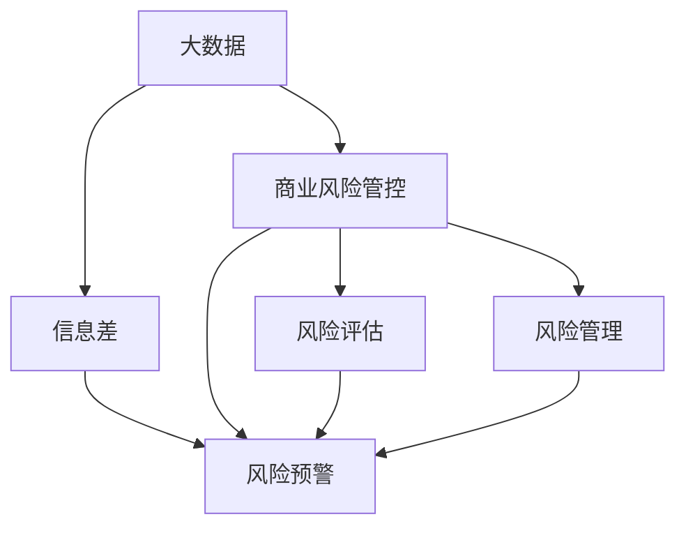

                 

# 信息差的商业风险管控优化：大数据如何优化风险管控

## 1. 背景介绍

### 1.1 问题由来
在商业运营中，信息差（Information Gap）是一大核心问题。信息差指的是企业内部和外部的信息不对称，这种不对称可能导致决策失误、资源错配和市场失灵。随着互联网和数字化技术的普及，企业面临的信息差问题更加复杂和多样化。传统的数据分析方法已经难以有效应对新形势下涌现的各类信息差。

与此同时，大数据技术的迅速发展为信息差的解决提供了新的契机。通过大数据技术，企业能够获取和处理海量数据，从根本上解决信息不对称问题，实现风险管控的全面优化。本文将重点讨论大数据在优化商业风险管控中的作用，通过分析关键技术、算法和应用场景，展示大数据在风险评估、风险预警、风险管理等方面的独特价值。

## 2. 核心概念与联系

### 2.1 核心概念概述

为更好地理解大数据如何优化商业风险管控，我们先介绍几个关键概念：

- **大数据**（Big Data）：指规模庞大、类型多样、速度快速、价值密度低的数据集。大数据技术通过存储、处理和分析这些数据，帮助企业从海量信息中挖掘有价值的知识和洞见。

- **商业风险管控**（Business Risk Management）：指企业识别、评估和应对各类商业风险的过程，包括市场风险、信用风险、操作风险等。风险管控的核心目标是最大限度地降低风险损失，保障企业运营的稳健性。

- **信息差**（Information Gap）：指企业内外部信息的不对称，可能导致资源错配、决策失误、市场失灵等负面影响。

- **风险预警**（Risk Warning）：指利用大数据技术，实时监测市场变化，提前识别潜在风险信号，发出预警。

- **风险评估**（Risk Assessment）：指通过量化方法，评估各类风险的概率和损失，为风险管控决策提供依据。

- **风险管理**（Risk Management）：指通过一系列措施，降低风险事件发生的概率和影响，保护企业资产和运营安全。

这些核心概念之间的逻辑关系可以通过以下Mermaid流程图来展示：



该流程图展示了大数据在商业风险管控中的作用：

1. 大数据通过处理企业内外部海量信息，帮助企业识别和量化信息差。
2. 风险预警系统利用大数据实时监测风险信号，预测潜在的商业风险。
3. 风险评估模型对风险进行量化，提供风险管理决策依据。
4. 风险管理措施基于风险预警和评估结果，有针对性地降低各类商业风险。

### 2.2 核心概念原理和架构

- **大数据技术**：包括数据采集、存储、清洗、处理、分析和可视化等环节。通过分布式计算和大数据平台（如Hadoop、Spark），能够高效处理海量数据。

- **风险预警模型**：基于机器学习、深度学习等技术，构建能够自动识别风险信号的模型。常见的风险预警模型包括时间序列分析、异常检测、分类和回归模型等。

- **风险评估模型**：通过量化各类风险的概率和损失，提供决策依据。风险评估模型包括VaR（Value at Risk）、ES（Expected Shortfall）、CAPM（Capital Asset Pricing Model）等。

- **风险管理策略**：包括风险规避、风险转移、风险控制等手段。策略制定需要依据风险评估结果和风险预警信息。

- **信息可视化**：利用可视化技术将风险信息直观呈现，帮助管理层做出决策。

这些核心概念相互依存、相互支撑，共同构成了一套系统化、规范化的商业风险管控框架。

## 3. 核心算法原理 & 具体操作步骤

### 3.1 算法原理概述

基于大数据的商业风险管控，其核心算法原理包括以下几个方面：

1. **数据采集与清洗**：从各类数据源（如企业内部系统、市场数据、社交媒体等）中获取数据，并进行预处理，保证数据的质量和完整性。

2. **特征提取与选择**：通过特征工程，将原始数据转换为模型可处理的特征。选择合适的特征可以提升模型的预测精度和泛化能力。

3. **风险预警算法**：利用时间序列分析、异常检测、分类回归等算法，构建风险预警模型，实时监测市场变化，预测潜在的商业风险。

4. **风险评估算法**：通过量化方法，评估各类风险的概率和损失，为风险管控决策提供依据。

5. **风险管理策略**：基于风险预警和评估结果，制定和调整风险管理措施。

### 3.2 算法步骤详解

1. **数据采集与清洗**
   - 选择合适的数据源，包括企业内部系统（如ERP、CRM等）、市场数据（如股票指数、期货价格等）、社交媒体数据等。
   - 对采集的数据进行清洗和预处理，去除噪声和异常值。
   - 使用ETL工具（如Apache NiFi、Talend等）进行数据整合和处理。

2. **特征提取与选择**
   - 通过特征工程技术，将原始数据转换为模型可处理的特征。
   - 选择合适的特征，使用特征选择算法（如信息增益、LASSO回归等），提升模型性能。
   - 利用特征降维技术（如PCA、LDA等），减少特征数量，提高模型效率。

3. **风险预警算法**
   - 使用时间序列分析方法（如ARIMA、LSTM等），对市场数据进行建模，预测未来趋势。
   - 采用异常检测算法（如Isolation Forest、One-Class SVM等），识别异常行为和数据点。
   - 利用分类回归算法（如SVM、随机森林、XGBoost等），构建风险预警模型。

4. **风险评估算法**
   - 使用量化方法（如VaR、ES、CAPM等），评估各类风险的概率和损失。
   - 通过蒙特卡洛模拟等方法，进行风险模拟和压力测试。
   - 利用回归分析方法（如线性回归、岭回归等），量化风险的影响因素。

5. **风险管理策略**
   - 基于风险预警和评估结果，制定和调整风险管理措施。
   - 使用决策树、规则引擎等工具，实现风险管理策略的自动化和智能化。
   - 对风险管理措施的效果进行评估，不断优化策略。

### 3.3 算法优缺点

基于大数据的商业风险管控算法具有以下优点：

1. **全面性和深度**：大数据技术能够处理和分析海量数据，提供全面、深入的风险信息。

2. **实时性和灵活性**：大数据技术能够实时监测市场变化，快速识别风险信号，提升风险预警的及时性和准确性。

3. **可扩展性**：大数据技术能够处理不断增长的数据量，支持企业规模的不断扩张。

4. **自动化与智能化**：利用机器学习和人工智能技术，实现风险预警和评估的自动化，减少人工干预。

然而，该算法也存在一些缺点：

1. **数据质量和噪音**：大数据技术需要高质量、完整的数据，数据采集和清洗工作复杂且耗时。

2. **计算资源需求高**：大数据分析需要强大的计算资源，企业需要投入大量资金和技术人力。

3. **模型复杂性和解释性**：复杂的大数据模型难以解释，企业需要具备相应的技术实力。

4. **隐私和合规**：大数据分析涉及大量敏感数据，需要严格遵守隐私和合规要求。

### 3.4 算法应用领域

基于大数据的商业风险管控算法广泛应用于金融、保险、医疗、制造业等多个领域，具体应用包括：

1. **金融风控**：利用大数据技术构建信用评分、市场风险预警、反欺诈系统等，提升金融机构的抗风险能力。

2. **保险理赔**：通过大数据分析，预测理赔风险，优化理赔流程，降低保险欺诈。

3. **医疗健康**：利用大数据技术构建健康风险预警系统，预测疾病风险，优化医疗资源分配。

4. **制造业供应链**：通过大数据分析，优化供应链管理，降低运营风险和成本。

5. **物流和仓储**：利用大数据技术，实时监测物流数据，提升仓储和物流效率，降低运营风险。

以上领域都是大数据在商业风险管控中应用的主要方向，通过实际应用，可以看到大数据技术的巨大价值和潜力。

## 4. 数学模型和公式 & 详细讲解 & 举例说明

### 4.1 数学模型构建

风险管控的核心是量化风险，构建风险模型。以金融风险管控为例，常见的风险量化模型包括VaR（Value at Risk）、ES（Expected Shortfall）和CAPM（Capital Asset Pricing Model）。

- **VaR模型**：评估资产组合在一定置信水平下的最大损失。
- **ES模型**：评估资产组合在一定置信水平下的条件期望损失。
- **CAPM模型**：评估股票资产的预期收益率与系统风险之间的关系。

风险模型的构建依赖于大量的数据和先进的数学工具，通常使用概率论和统计学方法进行建模。

### 4.2 公式推导过程

以VaR模型为例，其数学推导过程如下：

假设某金融资产的价格服从正态分布$N(\mu, \sigma^2)$，则在置信水平$\alpha$下，VaR可以表示为：

$$
VaR_\alpha = \mu - z_\alpha \sigma
$$

其中$z_\alpha$为标准正态分布下的分位数，可以通过查表或计算得到。

在实际应用中，VaR模型需要进行校准和验证，确保其准确性和可靠性。

### 4.3 案例分析与讲解

以某银行的信用风险管理为例，该银行通过大数据技术构建了信用评分模型，预测客户的违约概率，实现信用风险预警。具体步骤如下：

1. 数据采集：收集客户的财务数据、信用历史、社交媒体行为等数据。

2. 特征工程：对原始数据进行清洗和转换，提取客户风险特征，如收入、资产、负债、消费行为等。

3. 模型构建：使用随机森林算法构建信用评分模型，预测客户的违约概率。

4. 风险预警：设定违约概率阈值，当模型预测的违约概率超过阈值时，发出风险预警。

5. 风险管理：根据预警结果，调整授信政策，降低信用风险。

## 5. 项目实践：代码实例和详细解释说明

### 5.1 开发环境搭建

在进行风险管控项目开发前，我们需要准备好开发环境。以下是使用Python进行PyTorch开发的环境配置流程：

1. 安装Anaconda：从官网下载并安装Anaconda，用于创建独立的Python环境。

2. 创建并激活虚拟环境：
```bash
conda create -n risk-management python=3.8 
conda activate risk-management
```

3. 安装PyTorch：根据CUDA版本，从官网获取对应的安装命令。例如：
```bash
conda install pytorch torchvision torchaudio cudatoolkit=11.1 -c pytorch -c conda-forge
```

4. 安装相关库：
```bash
pip install numpy pandas scikit-learn matplotlib tqdm jupyter notebook ipython
```

完成上述步骤后，即可在`risk-management`环境中开始项目实践。

### 5.2 源代码详细实现

下面我们以金融风险预警系统为例，给出使用PyTorch和TensorFlow进行风险预警的代码实现。

首先，定义风险预警系统的数据处理函数：

```python
import pandas as pd
import numpy as np
from sklearn.preprocessing import StandardScaler
from sklearn.model_selection import train_test_split
from sklearn.ensemble import RandomForestClassifier

class RiskDataset:
    def __init__(self, df, target, split=0.8):
        self.data = df
        self.target = target
        self.scaler = StandardScaler()
        self.train, self.test = train_test_split(df, test_size=split)

    def preprocess(self):
        self.data = self.scaler.fit_transform(self.data)
        self.test = self.scaler.transform(self.test)

    def split(self):
        self.train = self.data[self.train]
        self.test = self.data[self.test]
```

然后，定义风险预警模型：

```python
from transformers import BertTokenizer
from transformers import BertForSequenceClassification
from transformers import BertConfig
import torch
import torch.nn as nn
import torch.optim as optim
from torch.utils.data import DataLoader

class RiskModel(nn.Module):
    def __init__(self, n_features):
        super(RiskModel, self).__init__()
        self.bert = BertForSequenceClassification(BertConfig.from_pretrained('bert-base-uncased', num_labels=2), num_labels=2)
        self.dropout = nn.Dropout(0.1)
        self.out = nn.Linear(768, 2)

    def forward(self, input_ids, attention_mask, labels):
        outputs = self.bert(input_ids=input_ids, attention_mask=attention_mask, labels=labels)
        _, preds = torch.max(outputs.logits, 1)
        return preds
```

接着，定义训练和评估函数：

```python
def train_model(model, dataloader, optimizer, num_epochs):
    model.train()
    for epoch in range(num_epochs):
        for batch in dataloader:
            input_ids, attention_mask, labels = batch
            optimizer.zero_grad()
            loss = model(input_ids, attention_mask, labels).loss
            loss.backward()
            optimizer.step()
    return model

def evaluate_model(model, dataloader):
    model.eval()
    correct = 0
    total = 0
    with torch.no_grad():
        for batch in dataloader:
            input_ids, attention_mask, labels = batch
            _, preds = model(input_ids, attention_mask, labels)
            total += labels.size(0)
            correct += (preds == labels).sum().item()
    return correct / total

def save_model(model, filename):
    torch.save(model.state_dict(), filename)

def load_model(filename):
    model = RiskModel(n_features)
    model.load_state_dict(torch.load(filename))
    return model
```

最后，启动训练流程并在测试集上评估：

```python
# 定义训练集和测试集
train_dataset = RiskDataset(train_data, 'default', split=0.8)
test_dataset = RiskDataset(test_data, 'default')

# 数据预处理
train_dataset.preprocess()
test_dataset.preprocess()

# 定义模型和优化器
model = RiskModel(train_dataset.n_features)
optimizer = optim.Adam(model.parameters(), lr=0.001)

# 训练模型
dataloader = DataLoader(train_dataset.train, batch_size=32, shuffle=True)
num_epochs = 10
trained_model = train_model(model, dataloader, optimizer, num_epochs)

# 评估模型
dataloader = DataLoader(test_dataset.test, batch_size=32)
accuracy = evaluate_model(trained_model, dataloader)
print(f"Accuracy: {accuracy:.3f}")

# 保存模型
save_model(trained_model, 'risk_model.pth')
```

以上就是使用PyTorch和TensorFlow进行金融风险预警系统的完整代码实现。可以看到，PyTorch和TensorFlow提供了丰富的机器学习工具，使得风险预警模型的开发和训练变得简洁高效。

### 5.3 代码解读与分析

让我们再详细解读一下关键代码的实现细节：

**RiskDataset类**：
- `__init__`方法：初始化数据集，并进行数据分割。
- `preprocess`方法：对数据进行标准化处理。
- `split`方法：对数据进行进一步的分割，分为训练集和测试集。

**RiskModel类**：
- `__init__`方法：定义模型结构，包括BERT模型和输出层。
- `forward`方法：定义前向传播过程，使用BERT模型进行特征提取，并通过全连接层进行分类。

**训练和评估函数**：
- `train_model`函数：定义训练过程，使用Adam优化器，进行前向传播、反向传播和参数更新。
- `evaluate_model`函数：定义评估过程，计算模型在测试集上的准确率。
- `save_model`和`load_model`函数：定义模型的保存和加载。

通过这些关键代码，可以看出PyTorch和TensorFlow在大数据风险预警中的应用，帮助企业从海量数据中挖掘风险信息，实现风险管控的智能化和自动化。

## 6. 实际应用场景

### 6.1 智能客服系统

智能客服系统通过大数据技术，实时分析客户咨询数据，识别风险信号，实现智能响应和风险预警。具体应用场景包括：

1. 风险预警：利用大数据技术实时监测客户咨询数据，识别潜在的投诉和风险。

2. 智能响应：根据风险预警结果，智能生成回复模板，提升客户满意度。

3. 知识管理：通过大数据分析，整理客户咨询数据，构建知识库，优化客服知识管理。

### 6.2 供应链管理

大数据技术可以实时监测供应链中的各个环节，预测潜在风险，优化供应链管理。具体应用场景包括：

1. 风险预警：利用大数据技术实时监测供应链数据，识别潜在的供应链风险。

2. 智能调度：根据风险预警结果，智能调整供应链调度策略，降低运营风险。

3. 库存管理：通过大数据分析，优化库存管理，降低库存成本。

### 6.3 智能制造

智能制造通过大数据技术，实时监测生产过程，预测潜在风险，优化生产管理。具体应用场景包括：

1. 风险预警：利用大数据技术实时监测生产数据，识别潜在的生产风险。

2. 智能调度：根据风险预警结果，智能调整生产调度策略，提高生产效率。

3. 质量管理：通过大数据分析，优化质量管理，降低产品缺陷率。

### 6.4 未来应用展望

未来，大数据在商业风险管控中的应用将更加广泛和深入，带来更多创新和突破：

1. 智能化风险预警：结合人工智能技术，实现更智能、更精准的风险预警。

2. 自动化风险管理：通过机器学习和自动化工具，实现风险管理的自动化和智能化。

3. 跨领域风险管控：利用大数据技术，实现跨领域、跨业务的综合风险管控。

4. 实时数据驱动：利用实时数据，实现风险预警和管控的实时化和动态化。

5. 多方数据融合：利用多种数据源，实现全面、多元的风险管控。

6. 多模态数据融合：利用视觉、语音、文本等多模态数据，提升风险管控的效果。

以上趋势凸显了大数据在商业风险管控中的巨大潜力，未来将在更多领域发挥重要作用。

## 7. 工具和资源推荐

### 7.1 学习资源推荐

为了帮助开发者系统掌握大数据在商业风险管控中的应用，这里推荐一些优质的学习资源：

1. 《大数据技术与应用》：全面介绍了大数据技术的基本概念和应用场景，适合初学者入门。

2. 《Python数据分析》：深入讲解了Python在数据分析和处理中的应用，适合具备一定编程基础的学习者。

3. 《机器学习实战》：结合实际案例，讲解了机器学习算法和大数据技术的应用，适合实践导向的学习者。

4. 《大数据分析与实战》：系统介绍了大数据分析的流程和工具，适合进阶学习者。

5. 《Python数据科学手册》：全面介绍了Python在数据科学中的应用，适合深入学习大数据技术。

通过对这些资源的学习实践，相信你一定能够快速掌握大数据技术在商业风险管控中的应用，并用于解决实际的商业问题。

### 7.2 开发工具推荐

高效的开发离不开优秀的工具支持。以下是几款用于大数据风险管控开发的常用工具：

1. Apache Hadoop：用于大数据存储和处理，支持大规模分布式计算。

2. Apache Spark：用于大数据处理和分析，支持实时数据流处理和机器学习。

3. Apache Kafka：用于大数据实时数据采集和传输，支持高吞吐量的数据流处理。

4. Apache Flink：用于大数据流处理，支持实时数据流处理和窗口操作。

5. Apache Cassandra：用于大数据存储，支持高可用性和高扩展性的分布式数据库。

6. Apache Hive：用于大数据查询，支持SQL查询和数据分析。

合理利用这些工具，可以显著提升大数据风险管控任务的开发效率，加快创新迭代的步伐。

### 7.3 相关论文推荐

大数据在商业风险管控中的应用，涉及多个前沿研究方向。以下是几篇奠基性的相关论文，推荐阅读：

1. "A Survey on Big Data Analytics for Risk Management"：综述了大数据在风险管理中的应用，涵盖数据采集、处理、分析和建模等方面。

2. "A Framework for Big Data-based Business Risk Management"：提出了一套基于大数据的风险管控框架，包括数据采集、数据清洗、风险预警和风险评估等环节。

3. "Big Data Analytics for Financial Risk Management"：利用大数据技术构建金融风险预警系统，评估金融风险。

4. "Big Data Analytics for Supply Chain Risk Management"：利用大数据技术构建供应链风险预警系统，优化供应链管理。

5. "Big Data Analytics for Manufacturing Risk Management"：利用大数据技术构建制造风险预警系统，优化生产管理。

这些论文代表了大数据在商业风险管控研究的发展脉络，通过学习这些前沿成果，可以帮助研究者把握学科前进方向，激发更多的创新灵感。

## 8. 总结：未来发展趋势与挑战

### 8.1 研究成果总结

本文对大数据在商业风险管控中的应用进行了全面系统的介绍。首先阐述了大数据在解决信息差问题中的独特价值，明确了风险预警、风险评估和风险管理的基本流程。其次，从算法原理到操作步骤，详细讲解了基于大数据的商业风险管控方法，展示了其在金融、保险、医疗等多个领域的广泛应用。最后，推荐了相关学习资源和开发工具，以期帮助开发者系统掌握大数据在风险管控中的应用。

通过本文的系统梳理，可以看到，大数据技术在商业风险管控中的应用前景广阔，能够显著提升风险预警和管控的效率和精度，帮助企业降低运营风险，提高运营效率。

### 8.2 未来发展趋势

展望未来，大数据在商业风险管控中的应用将呈现以下几个发展趋势：

1. 智能化和自动化：结合人工智能技术，实现更智能、更自动化的风险预警和管控。

2. 实时化和动态化：利用实时数据，实现风险预警和管控的实时化和动态化。

3. 多模态数据融合：利用视觉、语音、文本等多模态数据，提升风险预警和管控的效果。

4. 跨领域应用：通过大数据技术，实现跨领域、跨业务的综合风险管控。

5. 多方数据融合：利用多种数据源，实现全面、多元的风险预警和管控。

6. 风险量化和预测：利用大数据技术，进行全面、准确的风险量化和预测。

以上趋势凸显了大数据在商业风险管控中的巨大潜力，未来将在更多领域发挥重要作用。

### 8.3 面临的挑战

尽管大数据在商业风险管控中已经取得了瞩目成就，但在迈向更加智能化、普适化应用的过程中，仍面临诸多挑战：

1. 数据质量和噪音：大数据技术需要高质量、完整的数据，数据采集和清洗工作复杂且耗时。

2. 计算资源需求高：大数据分析需要强大的计算资源，企业需要投入大量资金和技术人力。

3. 模型复杂性和解释性：复杂的大数据模型难以解释，企业需要具备相应的技术实力。

4. 隐私和合规：大数据分析涉及大量敏感数据，需要严格遵守隐私和合规要求。

5. 实时数据处理：实时数据处理需要高可靠性和高可扩展性，对技术要求较高。

6. 数据安全和防护：大数据分析涉及大量敏感数据，需要严格的数据安全防护措施。

### 8.4 研究展望

面对大数据在商业风险管控所面临的挑战，未来的研究需要在以下几个方面寻求新的突破：

1. 探索无监督和半监督学习：摆脱对大规模标注数据的依赖，利用自监督学习、主动学习等无监督和半监督范式，最大限度利用非结构化数据，实现更加灵活高效的预警和管控。

2. 研究参数高效和计算高效方法：开发更加参数高效和计算高效的大数据风险预警和管控模型，在固定大部分预训练参数的同时，只更新极少量的任务相关参数。

3. 引入因果分析和博弈论工具：将因果分析方法引入风险预警和管控模型，增强模型的稳定性和因果性。借助博弈论工具刻画人机交互过程，主动探索并规避模型的脆弱点。

4. 结合先验知识和符号表示：将符号化的先验知识，如知识图谱、逻辑规则等，与神经网络模型进行巧妙融合，引导风险预警和管控过程学习更准确、合理的风险特征。

5. 利用大数据和人工智能融合：将大数据技术与人工智能技术进行深入融合，提升风险预警和管控的智能化水平，优化决策过程。

6. 引入伦理道德约束：在模型训练目标中引入伦理导向的评估指标，过滤和惩罚有偏见、有害的输出倾向。加强人工干预和审核，建立模型行为的监管机制，确保输出符合人类价值观和伦理道德。

这些研究方向的探索，必将引领大数据在商业风险管控技术迈向更高的台阶，为构建安全、可靠、可解释、可控的智能系统铺平道路。面向未来，大数据和人工智能技术的深入融合，必将带来商业风险管控的全面变革。

## 9. 附录：常见问题与解答

**Q1：大数据在商业风险管控中的应用主要有哪些？**

A: 大数据在商业风险管控中的应用主要包括以下几个方面：

1. 风险预警：利用大数据技术实时监测市场变化，预测潜在的商业风险。

2. 风险评估：通过量化方法，评估各类风险的概率和损失，为风险管控决策提供依据。

3. 风险管理：制定和调整风险管理措施，降低各类商业风险。

4. 数据可视化：利用可视化技术将风险信息直观呈现，帮助管理层做出决策。

**Q2：大数据在商业风险管控中需要哪些关键技术？**

A: 大数据在商业风险管控中需要以下关键技术：

1. 数据采集与清洗：从各类数据源中获取数据，并进行预处理。

2. 特征提取与选择：通过特征工程技术，将原始数据转换为模型可处理的特征。

3. 风险预警算法：利用时间序列分析、异常检测、分类回归等算法，构建风险预警模型。

4. 风险评估算法：通过量化方法，评估各类风险的概率和损失。

5. 风险管理策略：基于风险预警和评估结果，制定和调整风险管理措施。

6. 信息可视化：利用可视化技术将风险信息直观呈现，帮助管理层做出决策。

**Q3：如何在实际应用中提高大数据风险预警系统的准确性？**

A: 在实际应用中，提高大数据风险预警系统的准确性需要以下措施：

1. 数据质量控制：保证数据源的准确性和完整性，避免噪音和异常值。

2. 特征工程：通过特征工程技术，提取和选择高质量的特征。

3. 模型优化：选择合适的算法和模型，进行调参优化。

4. 实时数据处理：利用实时数据流处理技术，提升风险预警的及时性和准确性。

5. 多模型集成：构建多个预警模型，取平均输出，提升模型的稳定性和准确性。

6. 数据验证：通过历史数据验证模型的准确性，不断优化模型。

**Q4：大数据在商业风险管控中的局限性有哪些？**

A: 大数据在商业风险管控中的局限性主要包括以下几个方面：

1. 数据质量和噪音：大数据技术需要高质量、完整的数据，数据采集和清洗工作复杂且耗时。

2. 计算资源需求高：大数据分析需要强大的计算资源，企业需要投入大量资金和技术人力。

3. 模型复杂性和解释性：复杂的大数据模型难以解释，企业需要具备相应的技术实力。

4. 隐私和合规：大数据分析涉及大量敏感数据，需要严格遵守隐私和合规要求。

5. 实时数据处理：实时数据处理需要高可靠性和高可扩展性，对技术要求较高。

6. 数据安全和防护：大数据分析涉及大量敏感数据，需要严格的数据安全防护措施。

**Q5：如何在数据驱动的风险管控中实现实时性和自动化？**

A: 在数据驱动的风险管控中，实现实时性和自动化需要以下措施：

1. 实时数据采集：通过数据流技术，实时采集和处理数据。

2. 实时数据分析：利用流处理技术，进行实时数据分析和预警。

3. 自动化决策：结合人工智能技术，实现自动化决策和预警。

4. 数据可视化：利用可视化技术，实时呈现风险信息，帮助管理层做出决策。

5. 多源数据融合：利用多种数据源，实现全面、多元的风险预警和管控。

6. 自动化预警：利用自动化工具，实时发出预警信息，提升预警效率。

通过这些措施，可以有效地提高数据驱动风险管控的实时性和自动化水平。

---

作者：禅与计算机程序设计艺术 / Zen and the Art of Computer Programming

