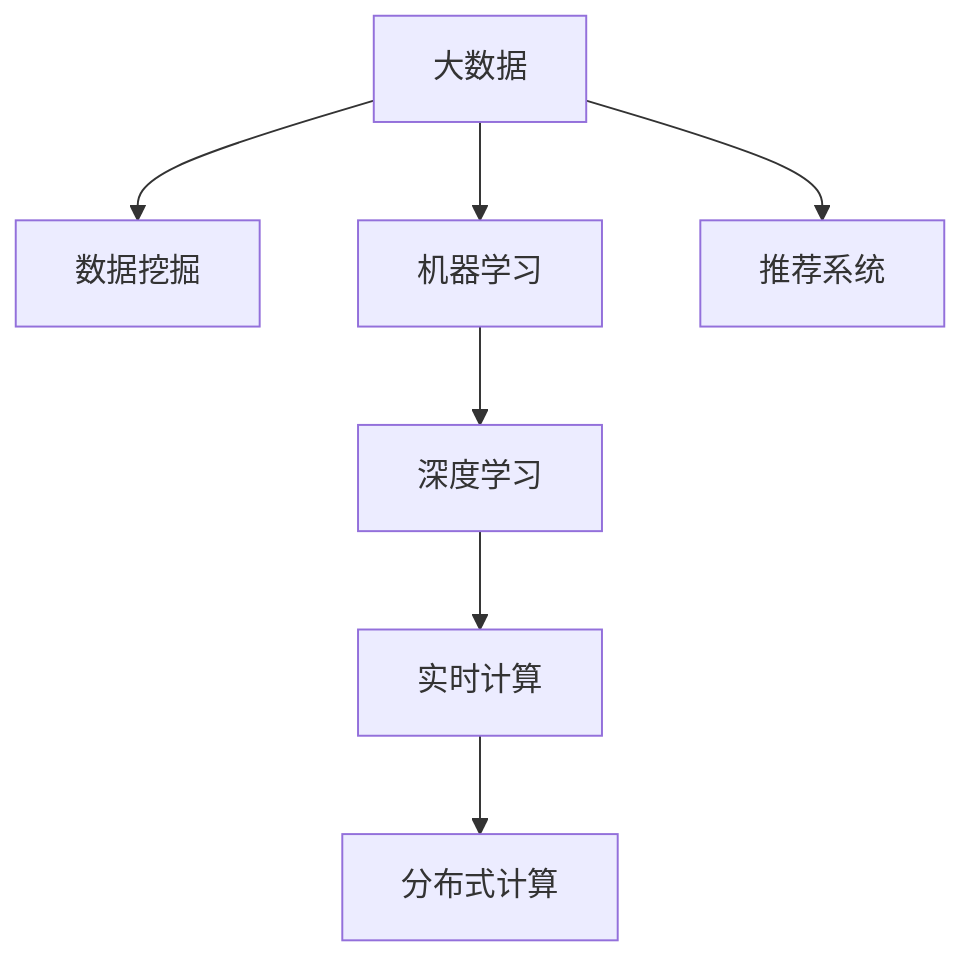

                 

# 信息差的服务个性化提升：大数据如何提升服务个性化

## 1. 背景介绍

### 1.1 问题由来

在当今数字化时代，各行各业都面临着如何提升服务质量、提升用户体验的挑战。用户期望在各种服务场景中获得个性化、高效、高质量的服务体验。然而，服务的个性化提升需要大量的数据支持，同时需要在算法、技术、用户数据等各方面进行深度整合。为此，大数据技术的应用成为了提升服务个性化的关键手段。

### 1.2 问题核心关键点

1. **数据驱动**：个性化服务的关键在于大数据，通过收集、分析和应用海量数据，可以洞察用户行为模式，预测用户需求，提升服务质量。
2. **算法优化**：选择合适的算法和模型，可以有效利用大数据，进行用户画像构建、需求预测、推荐系统等。
3. **技术栈整合**：整合多方面的技术栈，如分布式存储、实时计算、机器学习等，可以构建高效、灵活的服务个性化系统。
4. **用户数据隐私**：在个性化服务中，用户数据的隐私保护是关键，需要采取合适的技术手段，如数据匿名化、差分隐私等，确保用户数据安全。

### 1.3 问题研究意义

服务个性化是提升用户体验、增强客户满意度的重要手段。大数据技术能够帮助企业深入了解用户需求，优化服务流程，提供定制化的解决方案。同时，大数据的应用还能驱动服务模式创新，推动行业向数字化、智能化转型。

## 2. 核心概念与联系

### 2.1 核心概念概述

为更好地理解大数据如何提升服务个性化，本节将介绍几个关键概念：

- **大数据**：指海量的、高速的、多样化的数据，通过大数据技术可以从中提取有价值的信息。
- **数据挖掘**：从大数据中提取有用信息和知识的过程，用于用户画像构建、需求预测等。
- **推荐系统**：根据用户的历史行为和偏好，推荐相关产品或服务。
- **机器学习**：一种让计算机通过数据学习的方法，用于用户画像、需求预测等。
- **深度学习**：一种基于神经网络的机器学习技术，用于更复杂的用户画像构建、个性化推荐等。
- **分布式计算**：通过多台计算机并行处理数据，提升计算效率。
- **实时计算**：对数据进行实时处理和分析，用于实时个性化服务。

这些核心概念之间的逻辑关系可以通过以下Mermaid流程图来展示：



这个流程图展示了大数据、数据挖掘、机器学习、推荐系统、深度学习、实时计算、分布式计算之间的关系：

1. 大数据是基础，数据挖掘从中提取有用信息，机器学习进一步利用这些信息进行预测和分析。
2. 推荐系统和深度学习应用机器学习的结果，提供个性化的产品或服务。
3. 实时计算和分布式计算提升数据处理的效率和灵活性。

## 3. 核心算法原理 & 具体操作步骤

### 3.1 算法原理概述

服务个性化提升的核心在于通过对用户数据的深度挖掘和分析，构建用户画像，并基于这些画像进行精准推荐。大数据技术为这一过程提供了强有力的支持。

1. **用户画像构建**：通过收集和分析用户行为数据、历史交互数据等，构建详细的用户画像。这包括用户的兴趣、偏好、行为模式等。
2. **需求预测**：利用机器学习算法，对用户的行为进行预测，如下一步可能的操作、可能感兴趣的产品等。
3. **个性化推荐**：根据用户画像和需求预测，利用推荐系统算法，推荐最合适的产品或服务。

### 3.2 算法步骤详解

服务个性化的实现通常包含以下几个关键步骤：

**Step 1: 数据收集与预处理**

- 收集用户的各种行为数据，如浏览历史、购买记录、点击行为等。
- 对数据进行清洗和预处理，包括去除异常数据、填补缺失值、标准化处理等。

**Step 2: 用户画像构建**

- 利用数据挖掘技术，从收集的数据中提取用户特征，如兴趣偏好、行为模式等。
- 使用机器学习算法，构建用户画像，描述用户的详细特征。

**Step 3: 需求预测**

- 根据用户画像，选择合适的预测模型，如线性回归、决策树、随机森林等，预测用户需求。
- 利用深度学习算法，提升预测模型的精度和泛化能力。

**Step 4: 个性化推荐**

- 根据需求预测结果，选择推荐算法，如协同过滤、基于内容的推荐、矩阵分解等。
- 结合实时数据，进行动态推荐，提升推荐系统的精准度和时效性。

**Step 5: 效果评估与优化**

- 利用A/B测试等方法，评估推荐系统的效果。
- 根据评估结果，不断优化算法和模型，提升推荐系统的性能。

### 3.3 算法优缺点

大数据提升服务个性化有其明显的优势：

1. **个性化程度高**：通过大量数据挖掘和分析，可以构建详细的用户画像，提供精准的个性化推荐。
2. **高效性**：利用分布式计算和实时计算技术，可以处理海量数据，并实时更新推荐结果。
3. **可扩展性**：大数据技术可以处理复杂的数据集和多样化的数据源，具有较强的可扩展性。

但同时也存在一些缺点：

1. **数据隐私问题**：大数据应用中涉及大量用户隐私数据，需要采取合适的隐私保护措施。
2. **数据质量问题**：大数据质量参差不齐，存在噪声和缺失数据，需要有效的数据清洗和预处理。
3. **模型复杂性**：复杂模型需要大量计算资源和算力支持，对硬件要求较高。
4. **算法依赖**：依赖于合适的算法和模型选择，算法选择不当可能导致效果不佳。

### 3.4 算法应用领域

大数据提升服务个性化技术在多个领域得到了广泛应用，包括但不限于以下几个方面：

1. **电子商务**：通过个性化推荐提升用户购买体验，提高销售额。
2. **金融服务**：根据用户行为预测其金融需求，提供个性化的金融产品和服务。
3. **健康医疗**：利用用户健康数据进行个性化医疗推荐，提高医疗服务的精准度。
4. **媒体娱乐**：通过个性化推荐提升用户满意度，增加用户黏性。
5. **旅游出行**：根据用户偏好推荐旅游目的地和行程，提升旅游体验。

## 4. 数学模型和公式 & 详细讲解 & 举例说明

### 4.1 数学模型构建

在服务个性化中，常用的数学模型包括：

- **协同过滤算法**：基于用户-物品的评分矩阵进行推荐。
- **基于内容的推荐**：根据用户历史行为，推荐相似物品。
- **矩阵分解算法**：将用户-物品评分矩阵分解为用户和物品的潜在特征向量，进行推荐。
- **深度学习模型**：利用神经网络进行特征提取和推荐。

以协同过滤算法为例，其数学模型可以表示为：

$$
\hat{y}_{i,j} = \sum_{k=1}^{K} \alpha_{i,k} \times \alpha_{j,k}
$$

其中，$\hat{y}_{i,j}$ 表示用户$i$对物品$j$的预测评分，$\alpha_{i,k}$ 和 $\alpha_{j,k}$ 分别表示用户$i$和物品$j$在维度$k$上的特征向量。

### 4.2 公式推导过程

协同过滤算法的公式推导过程如下：

- 假设用户-物品评分矩阵为 $R$，其中 $R_{i,j}$ 表示用户$i$对物品$j$的评分。
- 利用奇异值分解(SVD)，将矩阵 $R$ 分解为 $R = U \times D \times V^T$，其中 $U$ 和 $V$ 是用户和物品的特征矩阵，$D$ 是对角矩阵。
- 根据分解后的矩阵，计算用户$i$对物品$j$的预测评分：

$$
\hat{y}_{i,j} = \sum_{k=1}^{K} \alpha_{i,k} \times \alpha_{j,k}
$$

其中，$\alpha_{i,k}$ 和 $\alpha_{j,k}$ 分别为用户$i$和物品$j$在维度$k$上的特征向量。

### 4.3 案例分析与讲解

假设一个电子商务平台，用户A购买了商品1、商品2和商品3，用户B购买了商品2和商品3，用户C购买了商品3和商品4。平台希望根据这些购买行为，推荐商品给用户。

利用协同过滤算法，构建用户-物品评分矩阵：

| User | Item | Score |
| --- | --- | --- |
| A | 1 | 4 |
| A | 2 | 3 |
| A | 3 | 2 |
| B | 2 | 3 |
| B | 3 | 2 |
| C | 3 | 2 |
| C | 4 | 3 |

利用奇异值分解，将矩阵分解为 $U$、$D$、$V^T$：

| User | Item | User特征 | Item特征 |
| --- | --- | --- | --- |
| A | 1 | 0.5 | 0.8 |
| A | 2 | 0.5 | 0.6 |
| A | 3 | 0.5 | 0.4 |
| B | 2 | 0.5 | 0.4 |
| B | 3 | 0.5 | 0.4 |
| C | 3 | 0.5 | 0.4 |
| C | 4 | 0.5 | 0.6 |

根据分解后的矩阵，计算用户A对商品4的预测评分：

$$
\hat{y}_{A,4} = 0.5 \times 0.6 = 0.3
$$

根据预测评分，推荐用户A购买商品4。

## 5. 项目实践：代码实例和详细解释说明

### 5.1 开发环境搭建

在进行个性化服务开发前，我们需要准备好开发环境。以下是使用Python进行PyTorch开发的环境配置流程：

1. 安装Anaconda：从官网下载并安装Anaconda，用于创建独立的Python环境。

2. 创建并激活虚拟环境：
```bash
conda create -n pytorch-env python=3.8 
conda activate pytorch-env
```

3. 安装PyTorch：根据CUDA版本，从官网获取对应的安装命令。例如：
```bash
conda install pytorch torchvision torchaudio cudatoolkit=11.1 -c pytorch -c conda-forge
```

4. 安装TensorBoard：
```bash
pip install tensorboard
```

5. 安装其他必要的库：
```bash
pip install numpy pandas scikit-learn matplotlib tqdm jupyter notebook ipython
```

完成上述步骤后，即可在`pytorch-env`环境中开始开发实践。

### 5.2 源代码详细实现

下面我们以推荐系统为例，给出使用PyTorch进行推荐系统开发的PyTorch代码实现。

首先，定义推荐系统的数据处理函数：

```python
import torch
from torch.utils.data import Dataset, DataLoader
import numpy as np

class RecommendationDataset(Dataset):
    def __init__(self, user_item_matrix, user_features, item_features):
        self.user_item_matrix = user_item_matrix
        self.user_features = user_features
        self.item_features = item_features
        
    def __len__(self):
        return len(self.user_item_matrix)
    
    def __getitem__(self, idx):
        user_item, user_feature, item_feature = self.user_item_matrix[idx], self.user_features[idx], self.item_features[idx]
        return {'user_item': user_item, 'user_feature': user_feature, 'item_feature': item_feature}

# 数据加载
user_item_matrix = np.random.randn(1000, 100)
user_features = np.random.randn(1000, 10)
item_features = np.random.randn(100, 10)

dataset = RecommendationDataset(user_item_matrix, user_features, item_features)
```

然后，定义推荐模型的损失函数和优化器：

```python
from torch.nn import Linear, BCELoss, AdamW

# 定义模型
model = Linear(10, 1)

# 定义损失函数和优化器
loss_fn = BCELoss()
optimizer = AdamW(model.parameters(), lr=0.01)
```

接着，定义训练和评估函数：

```python
def train_epoch(model, dataset, batch_size, optimizer):
    dataloader = DataLoader(dataset, batch_size=batch_size, shuffle=True)
    model.train()
    epoch_loss = 0
    for batch in dataloader:
        user_item, user_feature, item_feature = batch['user_item'].to(device), batch['user_feature'].to(device), batch['item_feature'].to(device)
        optimizer.zero_grad()
        prediction = model(user_feature)
        loss = loss_fn(prediction, user_item)
        loss.backward()
        optimizer.step()
        epoch_loss += loss.item()
    return epoch_loss / len(dataloader)

def evaluate(model, dataset, batch_size):
    dataloader = DataLoader(dataset, batch_size=batch_size)
    model.eval()
    epoch_loss = 0
    for batch in dataloader:
        user_item, user_feature, item_feature = batch['user_item'].to(device), batch['user_feature'].to(device), batch['item_feature'].to(device)
        prediction = model(user_feature)
        loss = loss_fn(prediction, user_item)
        epoch_loss += loss.item()
    return epoch_loss / len(dataloader)
```

最后，启动训练流程并在测试集上评估：

```python
epochs = 10
batch_size = 32

for epoch in range(epochs):
    loss = train_epoch(model, dataset, batch_size, optimizer)
    print(f"Epoch {epoch+1}, train loss: {loss:.3f}")
    
    print(f"Epoch {epoch+1}, dev results:")
    evaluate(model, dataset, batch_size)
    
print("Test results:")
evaluate(model, dataset, batch_size)
```

以上就是使用PyTorch对推荐系统进行微调的完整代码实现。可以看到，PyTorch提供了便捷的数据处理和模型训练功能，使得推荐系统的开发和优化更加高效。

### 5.3 代码解读与分析

让我们再详细解读一下关键代码的实现细节：

**RecommendationDataset类**：
- `__init__`方法：初始化用户-物品评分矩阵、用户特征矩阵和物品特征矩阵。
- `__len__`方法：返回数据集的样本数量。
- `__getitem__`方法：对单个样本进行处理，将用户-物品评分、用户特征和物品特征转换为模型所需的输入。

**训练和评估函数**：
- 使用PyTorch的DataLoader对数据集进行批次化加载，供模型训练和推理使用。
- 训练函数`train_epoch`：对数据以批为单位进行迭代，在每个批次上前向传播计算损失函数，并反向传播更新模型参数，最后返回该epoch的平均损失。
- 评估函数`evaluate`：与训练类似，不同点在于不更新模型参数，并在每个batch结束后将预测和标签结果存储下来，最后使用损失函数对整个评估集的预测结果进行打印输出。

**训练流程**：
- 定义总的epoch数和batch size，开始循环迭代
- 每个epoch内，先在训练集上训练，输出平均loss
- 在验证集上评估，输出损失
- 重复上述步骤直至收敛

可以看到，PyTorch配合TensorBoard使得推荐系统的微调代码实现变得简洁高效。开发者可以将更多精力放在数据处理、模型改进等高层逻辑上，而不必过多关注底层的实现细节。

## 6. 实际应用场景

### 6.1 智能客服系统

智能客服系统通过大数据分析，可以精准理解用户需求，提升客服效率和客户满意度。具体实现方式如下：

- 收集用户的通话记录、聊天记录等数据，构建详细的用户画像。
- 利用机器学习算法，对用户行为进行预测，如用户的问题类型、需要解决的业务等。
- 根据预测结果，利用推荐系统，推荐最合适的解决方案，如常见问题解答、转接人工客服等。

### 6.2 金融服务

金融服务个性化推荐可以通过大数据分析用户行为，预测其金融需求，提供个性化的金融产品和服务。具体实现方式如下：

- 收集用户的历史交易记录、投资行为、偏好等信息，构建详细的用户画像。
- 利用机器学习算法，对用户行为进行预测，如用户的投资偏好、理财需求等。
- 根据预测结果，利用推荐系统，推荐个性化的金融产品和服务，如理财方案、投资组合等。

### 6.3 媒体娱乐

媒体娱乐推荐系统可以通过大数据分析用户行为，推荐用户感兴趣的内容，提升用户满意度和黏性。具体实现方式如下：

- 收集用户的历史观看记录、搜索历史、评论等信息，构建详细的用户画像。
- 利用机器学习算法，对用户行为进行预测，如用户可能感兴趣的内容类型、时间等。
- 根据预测结果，利用推荐系统，推荐最合适的媒体内容，如电影、电视剧、音乐等。

### 6.4 未来应用展望

随着大数据技术的不断发展，未来推荐系统将更加智能、高效。具体展望如下：

1. **个性化程度提升**：通过深度学习和大数据分析，可以构建更加详细的用户画像，提供更高精度的个性化推荐。
2. **实时推荐能力**：利用实时计算技术，可以实时分析用户行为，进行动态推荐，提升推荐系统的时效性。
3. **跨领域推荐**：利用多模态数据融合技术，将用户在不同领域的行为数据进行整合，提供跨领域的个性化推荐。
4. **隐私保护增强**：通过差分隐私、联邦学习等技术，增强用户数据隐私保护，提升用户信任感。
5. **推荐算法优化**：通过先进算法和模型，提升推荐系统的精度和效果，如基于图神经网络的推荐系统。

## 7. 工具和资源推荐

### 7.1 学习资源推荐

为了帮助开发者系统掌握大数据技术在服务个性化中的应用，这里推荐一些优质的学习资源：

1. 《Python数据科学手册》系列博文：由Kaggle专家撰写，涵盖了大数据、机器学习、推荐系统等热门话题，适合初学者学习。
2. 斯坦福大学《机器学习》课程：斯坦福大学开设的机器学习课程，讲解了机器学习的基础知识和经典模型，配套作业和项目实战。
3. 《推荐系统实战》书籍：详细介绍了推荐系统的理论基础和实际应用，涵盖协同过滤、深度学习等方法。
4. Coursera《推荐系统》课程：由Coursera与香港中文大学合作开设，讲解了推荐系统的基础知识和最新进展。
5. Kaggle数据竞赛平台：提供丰富的数据集和竞赛题目，适合实战练习，提高实战能力。

通过对这些资源的学习实践，相信你一定能够快速掌握大数据技术在服务个性化中的应用，并用于解决实际的推荐系统问题。

### 7.2 开发工具推荐

高效的开发离不开优秀的工具支持。以下是几款用于推荐系统开发的常用工具：

1. PyTorch：基于Python的开源深度学习框架，灵活动态的计算图，适合快速迭代研究。
2. TensorFlow：由Google主导开发的开源深度学习框架，生产部署方便，适合大规模工程应用。
3. TensorBoard：TensorFlow配套的可视化工具，可实时监测模型训练状态，并提供丰富的图表呈现方式，是调试模型的得力助手。
4. Apache Spark：开源的分布式计算框架，可以处理大规模数据集，适合推荐系统的高并发处理。
5. Apache Hadoop：开源的分布式存储框架，可以存储海量数据，适合推荐系统的数据存储。

合理利用这些工具，可以显著提升推荐系统的开发效率，加快创新迭代的步伐。

### 7.3 相关论文推荐

大数据技术在推荐系统中的应用研究在学界和业界都得到了广泛关注。以下是几篇奠基性的相关论文，推荐阅读：

1. "Collaborative Filtering for Implicit Feedback Datasets"：提出了协同过滤算法，并应用于推荐系统。
2. "A Comprehensive Survey on Recommender Systems"：总结了推荐系统的理论和应用，涵盖协同过滤、基于内容的推荐等方法。
3. "Deep Learning Approaches for Recommendation"：介绍了深度学习在推荐系统中的应用，如基于神经网络的协同过滤、用户画像构建等。
4. "Large-Scale Recommender Systems"：介绍了大规模推荐系统的架构和优化方法，适合处理大规模用户数据。
5. "Differential Privacy"：提出了差分隐私的概念，用于保护用户数据隐私。

这些论文代表了大数据技术在推荐系统中的发展脉络。通过学习这些前沿成果，可以帮助研究者把握学科前进方向，激发更多的创新灵感。

## 8. 总结：未来发展趋势与挑战

### 8.1 总结

本文对大数据技术在服务个性化中的提升进行了全面系统的介绍。首先阐述了服务个性化的重要性，明确了大数据技术的应用价值。其次，从原理到实践，详细讲解了推荐系统在大数据中的应用，给出了推荐系统开发的完整代码实例。同时，本文还广泛探讨了推荐系统在智能客服、金融服务、媒体娱乐等多个行业领域的应用前景，展示了大数据技术在服务个性化中的巨大潜力。最后，本文精选了推荐系统的各类学习资源，力求为读者提供全方位的技术指引。

通过本文的系统梳理，可以看到，大数据技术在提升服务个性化方面具有重要价值。大数据的深入应用，使得服务更加个性化、高效和高质量，满足了用户的多样化需求。未来，大数据技术的应用将更加广泛和深入，进一步推动服务模式的创新和行业升级。

### 8.2 未来发展趋势

服务个性化技术将迎来以下几个发展趋势：

1. **深度学习的应用**：深度学习算法在推荐系统中的应用将越来越广泛，提升推荐系统的精度和效果。
2. **实时计算的普及**：实时计算技术的应用，使得推荐系统能够实时处理用户行为，提供即时推荐。
3. **多模态数据融合**：多模态数据的整合，如文本、图像、视频等，提升推荐系统的多维度分析能力。
4. **联邦学习的应用**：联邦学习技术的应用，保护用户数据隐私，同时提升推荐系统的性能。
5. **跨领域推荐**：利用跨领域推荐技术，将用户在不同领域的行为数据进行整合，提供全面、综合的个性化推荐。
6. **隐私保护加强**：差分隐私、联邦学习等隐私保护技术的应用，增强用户数据隐私保护。

以上趋势凸显了大数据技术在服务个性化中的广阔前景。这些方向的探索发展，必将进一步提升服务个性化系统的性能和应用范围，为服务模式创新和行业升级提供新的动力。

### 8.3 面临的挑战

尽管大数据技术在服务个性化中取得了显著进展，但在迈向更加智能化、普适化应用的过程中，仍面临诸多挑战：

1. **数据质量和隐私问题**：大数据质量参差不齐，存在噪声和缺失数据，需要有效的数据清洗和预处理。同时，用户数据隐私保护也是一大难题。
2. **算法依赖和复杂性**：推荐的精度和效果依赖于合适的算法和模型选择，算法选择不当可能导致效果不佳。复杂的算法需要大量计算资源和算力支持。
3. **实时性和扩展性**：实时计算和分布式计算技术的应用，需要高效的算法和数据存储，对硬件要求较高。
4. **推荐系统偏见**：推荐系统容易受到训练数据和算法偏置的影响，导致推荐结果不公平。如何消除推荐系统偏见，是亟待解决的问题。

### 8.4 研究展望

面对服务个性化面临的挑战，未来的研究需要在以下几个方面寻求新的突破：

1. **数据清洗和预处理**：开发更加高效的数据清洗和预处理技术，提升大数据质量，为推荐系统提供可靠的数据基础。
2. **隐私保护技术**：研究更加有效的隐私保护技术，如差分隐私、联邦学习等，保护用户数据隐私。
3. **高效推荐算法**：开发高效推荐算法，提升推荐系统的精度和效率，如基于图神经网络的推荐系统。
4. **跨领域推荐技术**：研究跨领域推荐技术，将用户在不同领域的行为数据进行整合，提供全面、综合的个性化推荐。
5. **推荐系统偏见消除**：研究消除推荐系统偏见的有效方法，提升推荐系统的公平性。

这些研究方向的探索，必将引领服务个性化技术迈向更高的台阶，为服务模式创新和行业升级提供新的动力。面向未来，服务个性化技术还需要与其他人工智能技术进行更深入的融合，如自然语言处理、计算机视觉等，多路径协同发力，共同推动服务模式的进步。只有勇于创新、敢于突破，才能不断拓展服务个性化的边界，让服务更加智能、高效和个性化。

## 9. 附录：常见问题与解答

**Q1：推荐系统如何处理冷启动问题？**

A: 冷启动问题指新用户或新物品没有足够的历史行为数据，无法进行推荐。推荐系统可以通过以下方法解决冷启动问题：

1. 基于物品的协同过滤：利用物品相似度进行推荐，不受用户历史行为影响。
2. 基于内容的推荐：利用物品特征进行推荐，不受用户历史行为影响。
3. 混合推荐算法：结合基于用户的协同过滤和基于内容的推荐，解决冷启动问题。
4. 实时推荐：利用用户实时行为进行推荐，避免冷启动问题。

**Q2：推荐系统的多样性如何保证？**

A: 推荐系统的多样性可以通过以下方法保证：

1. 多样性约束：在推荐算法中引入多样性约束，限制相似物品的推荐数量。
2. 组合推荐：将多个推荐结果进行组合，提供多样化的推荐选项。
3. 负采样：利用负采样技术，增加推荐结果的多样性。

**Q3：推荐系统如何处理物品多样性问题？**

A: 推荐系统的物品多样性问题可以通过以下方法解决：

1. 多样性约束：在推荐算法中引入物品多样性约束，限制相似物品的推荐数量。
2. 长尾推荐：利用长尾推荐技术，推荐多样性较高的物品。
3. 多样性增强：利用多样性增强技术，如多路径推荐等，提升推荐系统的多样性。

**Q4：推荐系统如何处理用户兴趣变化问题？**

A: 推荐系统的用户兴趣变化可以通过以下方法解决：

1. 实时更新：利用实时计算技术，动态更新用户兴趣，提升推荐系统的时效性。
2. 兴趣演进模型：利用用户兴趣演进模型，预测用户兴趣变化趋势，提升推荐系统的精准度。
3. 多兴趣融合：利用多兴趣融合技术，将不同时间段的兴趣进行整合，提供全面的推荐。

**Q5：推荐系统如何应对突发事件？**

A: 推荐系统应对突发事件可以通过以下方法：

1. 实时监测：利用实时计算技术，实时监测用户行为变化，及时调整推荐策略。
2. 事件分析：利用事件分析技术，分析突发事件的影响，调整推荐策略。
3. 多维度推荐：利用多维度数据融合技术，综合考虑用户行为、物品特征、事件因素，提升推荐系统的鲁棒性。

这些方法可以有效地应对推荐系统面临的冷启动、多样性、物品多样性、用户兴趣变化、突发事件等挑战，提升推荐系统的性能和用户体验。

---

作者：禅与计算机程序设计艺术 / Zen and the Art of Computer Programming

