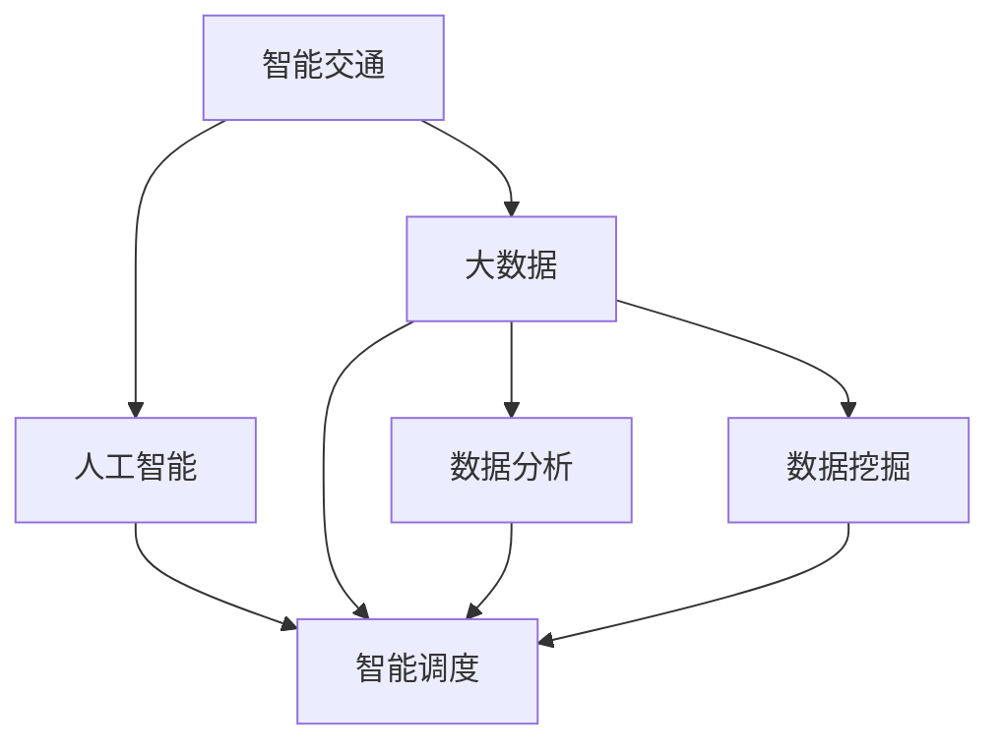

                 

# 信息差：大数据在智能交通中的应用

> 关键词：信息差、大数据、智能交通、人工智能、智能调度、数据分析、数据挖掘

## 1. 背景介绍

### 1.1 问题由来
随着城市化进程的加速和交通工具的普及，交通问题变得越来越严峻。传统的交通管理方式以经验为主，往往难以快速响应交通状况的变化，导致道路拥堵、事故频发、环境污染等问题的出现。如何通过智能手段高效管理交通，保障道路流畅，减少事故发生，成为当前城市交通管理的重点。

大数据技术的应用为智能交通的实现提供了新的可能性。通过对海量交通数据的实时分析，可以准确预测道路流量，进行交通调控，优化行驶路径，提升交通系统的整体效率。但大数据的应用并非万能，如何准确把握信息差异，科学制定交通策略，是智能交通成功实施的关键。

### 1.2 问题核心关键点
信息差是智能交通系统面临的核心挑战。一方面，大数据能够提供丰富的交通数据，但要从中准确提取有用信息，往往需要复杂的算法模型和经验判断。另一方面，信息的不对称、数据的真实性、隐私问题等，也会影响信息差的有效利用。因此，如何通过大数据技术，在信息差异中找寻最优解，是智能交通技术的关键。

## 2. 核心概念与联系

### 2.1 核心概念概述

为更好地理解大数据在智能交通中的应用，本节将介绍几个关键概念及其联系：

- 智能交通：通过现代信息技术，对交通基础设施、车辆、行人等交通要素进行监控、控制和调度，实现交通系统的智能化管理。
- 大数据：指规模巨大、类型复杂、速度极快的数据集合，可以从海量数据中挖掘出有用信息，为决策提供支持。
- 人工智能(AI)：通过机器学习和深度学习算法，让计算机具备自主学习、推理和决策能力。
- 智能调度：通过优化算法，对交通网络进行实时调控，实现交通流量的最优分配和路径规划。
- 数据分析：从原始数据中提取有用信息的过程，包括数据清洗、特征选择、模型训练等。
- 数据挖掘：从大量数据中发现隐藏的模式和规律，如关联规则、分类、聚类等。

这些概念之间的联系可以通过以下Mermaid流程图来展示：



这个流程图展示了智能交通系统的核心组成部分及其相互关系：

1. 智能交通通过大数据提供的数据，结合人工智能技术进行分析和决策，实现智能调度。
2. 数据分析和数据挖掘是从大数据中提取有用信息的重要环节，为智能调度提供数据支撑。
3. 人工智能不仅能够对数据进行精确分析，还能够对未来交通状况进行预测和优化。

## 3. 核心算法原理 & 具体操作步骤
### 3.1 算法原理概述

大数据在智能交通中的应用，本质上是一个数据驱动的决策优化过程。其核心思想是：通过对历史和实时交通数据的分析，提取交通流量的特征，构建交通流量预测模型，预测未来的交通状况，从而优化交通调度策略，减少交通拥堵和事故。

具体而言，智能交通系统通常包括以下几个步骤：

1. 数据采集：通过车载传感器、视频监控、交通信号等手段，获取交通流量、车辆位置、速度、拥堵情况等数据。
2. 数据清洗与预处理：对采集到的数据进行去重、过滤、归一化等处理，确保数据的准确性和一致性。
3. 特征提取：从清洗后的数据中提取有用的特征，如速度、方向、车流量等，用于模型训练。
4. 模型训练：使用机器学习或深度学习算法，对历史和实时交通数据进行训练，构建交通流量预测模型。
5. 预测与调度：利用训练好的模型，对未来的交通状况进行预测，优化交通调度策略，实现智能调控。

### 3.2 算法步骤详解

以下以智能调度的核心算法为例，介绍其详细步骤：

**Step 1: 数据采集与预处理**
- 通过车载GPS设备、车载摄像头、路口监控等手段，采集车辆位置、速度、行驶方向、车流量等数据。
- 对采集到的数据进行去重、清洗，去除异常值和噪声。

**Step 2: 特征提取**
- 从清洗后的数据中提取有用的特征，如车辆平均速度、车流量、拥堵指数等。
- 使用PCA等降维技术，对高维数据进行降维，简化模型输入。

**Step 3: 模型训练**
- 选择合适的算法，如随机森林、支持向量机、深度神经网络等，对训练集数据进行模型训练。
- 使用交叉验证等技术，评估模型性能，优化模型参数。

**Step 4: 预测与调度**
- 将实时采集到的交通数据，输入训练好的模型进行预测，得到未来交通状况。
- 根据预测结果，优化交通信号灯配时、车道分配、路线规划等，实现智能调控。

### 3.3 算法优缺点

大数据在智能交通中的应用，具有以下优点：
1. 实时性强：通过实时数据采集和分析，能够快速响应交通状况变化，优化交通调度。
2. 数据多样性：结合多种数据源，可以更全面地反映交通状况，提高预测精度。
3. 效率高：自动化数据处理和分析，减少了人工干预，提升了工作效率。
4. 预测准确：通过对海量数据的训练，构建高精度的预测模型，能够准确预测未来交通状况。

同时，该方法也存在一些局限性：
1. 数据质量问题：采集到的数据存在噪声、缺失等问题，影响模型预测的准确性。
2. 模型复杂度：高维数据的处理和模型训练，需要较高的计算资源和数据处理能力。
3. 隐私问题：交通数据的隐私保护，需要严格的数据访问控制和安全措施。
4. 模型适应性：模型对于新的交通场景和数据变化，需要不断更新和调整。

尽管存在这些局限性，但总体而言，大数据在智能交通中的应用，为交通管理提供了强大的技术支撑，极大地提高了交通系统的智能化水平。未来，随着技术不断进步和数据规模不断扩大，大数据在智能交通中的应用将更加广泛和深入。

### 3.4 算法应用领域

大数据在智能交通中的应用，已经在多个领域得到了实际应用，如：

- 智能路况预测：通过对历史和实时交通数据的分析，预测未来路况，提供出行建议。
- 交通信号控制：根据实时交通流量，动态调整交通信号灯配时，优化交通流。
- 路径规划与导航：结合实时交通数据，为用户提供最佳行驶路径和导航建议。
- 车辆调度与优化：对出租车、公交车等公共交通工具进行实时调度，减少等待时间。
- 事故预警与应急响应：通过监控视频和传感器数据，及时发现交通事故，进行预警和应急处理。

除了上述这些经典应用外，大数据在智能交通领域的应用还在不断扩展，如车联网、自动驾驶、智慧停车等，为智能交通的发展提供了新的动力。

## 4. 数学模型和公式 & 详细讲解 & 举例说明
### 4.1 数学模型构建

本节将使用数学语言对大数据在智能交通中的应用进行更加严格的刻画。

设交通流量数据为 $D=\{x_1,x_2,...,x_n\}$，其中 $x_i=(x_i^1,x_i^2,...,x_i^k)$ 为第 $i$ 个时间点采集到的 $k$ 个特征向量。

定义交通流量预测模型为 $f: \mathbb{R}^k \rightarrow \mathbb{R}$，其中 $f(x_i)$ 为时间点 $i$ 的预测交通流量。

预测模型的训练目标为最小化预测误差，即：

$$
\min_{f} \sum_{i=1}^n (f(x_i) - y_i)^2
$$

其中 $y_i$ 为时间点 $i$ 的真实交通流量，$f(x_i)$ 为模型对 $x_i$ 的预测值。

### 4.2 公式推导过程

以下是预测模型常用的几种算法，以随机森林算法为例进行公式推导：

**随机森林算法**
假设输入特征 $x_i=(x_i^1,x_i^2,...,x_i^k)$，输出预测值 $f(x_i)$，目标函数为最小化预测误差。

随机森林算法步骤如下：
1. 从数据集中随机抽取 $n$ 个样本，每个样本包含 $k$ 个特征。
2. 对每个样本 $x_i$，随机抽取 $m$ 个特征，并随机选择 $k$ 个特征，训练一个决策树。
3. 对于每个样本，将所有决策树的结果进行投票，得到最终预测结果。

预测模型的损失函数为：

$$
\mathcal{L}(f(x)) = \frac{1}{n} \sum_{i=1}^n (f(x_i) - y_i)^2
$$

其中 $y_i$ 为时间点 $i$ 的真实交通流量，$f(x_i)$ 为模型对 $x_i$ 的预测值。

### 4.3 案例分析与讲解

以下以智能路况预测为例，分析其具体实现过程：

**案例背景**
某城市交通局希望通过大数据技术，预测未来一小时内的路况，提供出行建议，减少拥堵。该城市交通局收集了过去一年的交通流量数据，并安装了车载GPS设备，实时采集车辆位置和速度。

**数据采集**
- 车载GPS设备：实时采集车辆位置、速度、行驶方向等数据。
- 路口监控摄像头：采集车流量、车辆类型、车牌信息等数据。
- 交通信号灯：采集信号灯配时、车辆通行时间等数据。

**数据清洗与预处理**
- 去除异常值和噪声，如车辆速度过快、方向突变等。
- 对车流量数据进行归一化处理，确保数据一致性。

**特征提取**
- 提取有用的特征，如车辆平均速度、车流量、拥堵指数等。
- 使用PCA等降维技术，简化模型输入。

**模型训练**
- 选择随机森林算法，对历史数据进行模型训练。
- 使用交叉验证等技术，评估模型性能，优化模型参数。

**预测与调度**
- 将实时采集到的交通数据，输入训练好的模型进行预测。
- 根据预测结果，优化交通信号灯配时，减少拥堵。

## 5. 项目实践：代码实例和详细解释说明
### 5.1 开发环境搭建

在进行智能交通项目开发前，我们需要准备好开发环境。以下是使用Python进行TensorFlow开发的环境配置流程：

1. 安装Anaconda：从官网下载并安装Anaconda，用于创建独立的Python环境。

2. 创建并激活虚拟环境：
```bash
conda create -n traffic-env python=3.8 
conda activate traffic-env
```

3. 安装TensorFlow：根据CUDA版本，从官网获取对应的安装命令。例如：
```bash
conda install tensorflow tensorflow-gpu=2.8 -c pytorch -c conda-forge
```

4. 安装TensorFlow Addons：补充TensorFlow缺少的功能，如实时处理库。
```bash
conda install tensorflow-addons=1.9.0
```

5. 安装各类工具包：
```bash
pip install numpy pandas scikit-learn matplotlib tqdm jupyter notebook ipython
```

完成上述步骤后，即可在`traffic-env`环境中开始智能交通项目的开发。

### 5.2 源代码详细实现

下面我们以智能路况预测为例，给出使用TensorFlow对交通流量进行预测的PyTorch代码实现。

首先，定义交通流量预测模型：

```python
import tensorflow as tf
from tensorflow.keras import layers

class TrafficFlowPredictor(tf.keras.Model):
    def __init__(self, input_dim):
        super().__init__()
        self.dense1 = layers.Dense(64, activation='relu', input_shape=(input_dim,))
        self.dense2 = layers.Dense(64, activation='relu')
        self.dense3 = layers.Dense(1)

    def call(self, x):
        x = self.dense1(x)
        x = self.dense2(x)
        return self.dense3(x)

# 输入特征维度
input_dim = 5

# 创建模型
model = TrafficFlowPredictor(input_dim)
```

然后，定义模型训练函数：

```python
from sklearn.model_selection import train_test_split
from sklearn.metrics import mean_squared_error

# 加载数据
data = pd.read_csv('traffic_data.csv')

# 将数据划分为训练集和测试集
X_train, X_test, y_train, y_test = train_test_split(data.drop(['traffic_flow'], axis=1), data['traffic_flow'], test_size=0.2, random_state=42)

# 标准化数据
scaler = StandardScaler()
X_train = scaler.fit_transform(X_train)
X_test = scaler.transform(X_test)

# 定义损失函数和优化器
loss_fn = tf.keras.losses.MeanSquaredError()
optimizer = tf.keras.optimizers.Adam(learning_rate=0.001)

# 定义模型训练函数
def train_model(model, X_train, y_train, epochs):
    for epoch in range(epochs):
        loss = tf.keras.losses.MeanSquaredError()
        with tf.GradientTape() as tape:
            predictions = model(X_train)
            loss = loss_fn(y_train, predictions)
        gradients = tape.gradient(loss, model.trainable_variables)
        optimizer.apply_gradients(zip(gradients, model.trainable_variables))
        print('Epoch', epoch, 'Loss:', loss.numpy())
    return model

# 训练模型
epochs = 100
model = train_model(model, X_train, y_train, epochs)
```

接着，定义模型评估函数：

```python
# 定义模型评估函数
def evaluate_model(model, X_test, y_test):
    predictions = model(X_test)
    mse = mean_squared_error(y_test, predictions)
    mae = mean_absolute_error(y_test, predictions)
    rmse = np.sqrt(mse)
    print('Mean Squared Error:', mse)
    print('Mean Absolute Error:', mae)
    print('Root Mean Squared Error:', rmse)
    return mse

# 评估模型
mse = evaluate_model(model, X_test, y_test)
```

最后，启动训练流程并在测试集上评估：

```python
# 训练模型
model = train_model(model, X_train, y_train, epochs)

# 评估模型
mse = evaluate_model(model, X_test, y_test)
```

以上就是使用TensorFlow对交通流量进行预测的完整代码实现。可以看到，通过TensorFlow，可以方便地构建、训练和评估预测模型，其高效性和灵活性为智能交通项目提供了强大的技术支持。

### 5.3 代码解读与分析

让我们再详细解读一下关键代码的实现细节：

**TrafficFlowPredictor类**
- `__init__`方法：初始化模型层。
- `call`方法：前向传播计算预测结果。

**train_model函数**
- `train_model`函数：实现模型的训练过程。
- 使用`StandardScaler`对数据进行标准化处理，确保数据一致性。
- 定义损失函数和优化器，进行模型训练。
- 输出每个epoch的训练损失。

**evaluate_model函数**
- `evaluate_model`函数：实现模型的评估过程。
- 计算预测值和真实值之间的均方误差、平均绝对误差和均方根误差。
- 输出评估结果。

**训练流程**
- 使用`train_model`函数进行模型训练。
- 在训练过程中，输出每个epoch的训练损失。
- 使用`evaluate_model`函数在测试集上评估模型性能。

可以看到，TensorFlow提供了强大的API支持，使得模型训练和评估的过程变得更加简单高效。开发者可以将更多精力放在数据处理、模型改进等高层逻辑上，而不必过多关注底层的实现细节。

当然，工业级的系统实现还需考虑更多因素，如模型的保存和部署、超参数的自动搜索、更灵活的任务适配层等。但核心的训练流程基本与此类似。

## 6. 实际应用场景
### 6.1 智能路况预测

智能路况预测是大数据在智能交通中的应用之一。通过对历史和实时交通数据的分析，可以预测未来路况，提供出行建议，减少拥堵。

具体而言，可以收集交通流量数据、车辆位置数据、信号灯配时数据等，通过大数据技术进行特征提取和模型训练。训练好的模型可以实时获取道路流量信息，预测未来交通状况，提供出行建议，如绕行路线、建议出行时间等。

### 6.2 交通信号控制

交通信号控制是智能交通的重要应用之一。通过对实时交通流量的分析，可以优化信号灯配时，实现智能调度，减少拥堵和事故。

具体而言，可以在路口安装传感器和摄像头，实时采集车流量、车辆类型、车牌信息等数据。将这些数据输入训练好的模型进行预测，得到未来车流量分布。根据预测结果，动态调整信号灯配时，实现交通流量的最优分配和路径规划。

### 6.3 路径规划与导航

路径规划与导航是大数据在智能交通中的另一重要应用。通过对实时交通数据的分析，可以为用户提供最佳行驶路径和导航建议，提升出行效率。

具体而言，可以实时采集车流量、道路状况、事故信息等数据，构建交通网络图。利用大数据技术进行路径规划，找到最优路径。同时结合实时交通数据，动态调整路径规划，提供导航建议，如避开拥堵路段、建议转弯路线等。

### 6.4 未来应用展望

随着大数据技术和大规模预训练模型的不断发展，智能交通的应用前景将更加广阔。未来，智能交通系统将朝着以下方向发展：

1. 车联网技术：通过车载传感器、车与车通信等技术，实现车辆与交通基础设施的互联互通，提升交通管理效率。
2. 智能调度系统：利用大数据技术，实现对交通流量的精准预测和智能调度，减少交通拥堵和事故。
3. 自动驾驶技术：通过智能交通系统，提供高精度的地图、路况信息和导航建议，辅助自动驾驶系统进行路径规划和决策。
4. 智慧停车系统：通过大数据技术，实现对停车场的实时监控和管理，提升停车场利用率，减少交通拥堵。
5. 智能交通系统集成：将智能交通的各个子系统进行集成，形成一个统一、智能化的交通管理体系，提高交通系统的整体效率和安全性。

总之，大数据在智能交通中的应用，将极大地提升交通管理的智能化水平，为人们提供更加便捷、安全、高效的出行体验。未来，随着技术的不断进步和数据的不断积累，智能交通系统将进一步深入人们的日常生活，带来更加美好的出行体验。

## 7. 工具和资源推荐
### 7.1 学习资源推荐

为了帮助开发者系统掌握大数据在智能交通中的应用，这里推荐一些优质的学习资源：

1. 《机器学习基础》：由机器学习专家撰写，详细介绍机器学习和深度学习的基本概念和经典算法。

2. 《Python数据科学手册》：全面介绍Python数据处理、分析、可视化等技术，适合数据驱动的各类项目开发。

3. TensorFlow官方文档：提供TensorFlow框架的详细API和教程，适合TensorFlow相关项目的开发。

4. 《智能交通系统》：系统介绍智能交通系统的发展历程、技术架构和应用场景，适合智能交通相关项目的学习。

5. Kaggle交通数据集：提供丰富的交通数据集，适合进行智能交通相关的数据分析和模型训练。

通过对这些资源的学习实践，相信你一定能够快速掌握大数据在智能交通中的应用，并用于解决实际的交通问题。

### 7.2 开发工具推荐

高效的开发离不开优秀的工具支持。以下是几款用于智能交通开发常用的工具：

1. TensorFlow：由Google主导开发的开源深度学习框架，生产部署方便，适合大规模工程应用。

2. PyTorch：基于Python的开源深度学习框架，灵活动态的计算图，适合快速迭代研究。

3. TensorFlow Addons：补充TensorFlow缺少的功能，如实时处理库，适合实时交通数据分析和预测。

4. Weights & Biases：模型训练的实验跟踪工具，可以记录和可视化模型训练过程中的各项指标，方便对比和调优。

5. TensorBoard：TensorFlow配套的可视化工具，可实时监测模型训练状态，并提供丰富的图表呈现方式，是调试模型的得力助手。

6. Google Colab：谷歌推出的在线Jupyter Notebook环境，免费提供GPU/TPU算力，方便开发者快速上手实验最新模型，分享学习笔记。

合理利用这些工具，可以显著提升智能交通开发效率，加快创新迭代的步伐。

### 7.3 相关论文推荐

大数据在智能交通中的应用源于学界的持续研究。以下是几篇奠基性的相关论文，推荐阅读：

1. Traffic Flow Prediction Using Machine Learning Algorithms：介绍基于机器学习模型的交通流量预测方法。

2. Autonomous Vehicles: A Survey：综述自动驾驶技术的研究进展，探讨智能交通系统的未来发展。

3. Intelligent Transportation Systems：系统介绍智能交通系统的研究现状和发展趋势，适合智能交通相关项目的参考。

4. Predictive Traffic Control Systems: Review and Trends：总结预测性交通控制系统的研究进展，为智能交通系统提供技术支持。

这些论文代表了大数据在智能交通领域的研究方向和进展，通过学习这些前沿成果，可以帮助研究者把握学科前进方向，激发更多的创新灵感。

## 8. 总结：未来发展趋势与挑战
### 8.1 总结

本文对大数据在智能交通中的应用进行了全面系统的介绍。首先阐述了智能交通系统面临的核心挑战和信息差的概念，明确了大数据在智能交通中的重要作用。其次，从原理到实践，详细讲解了智能交通的数学模型和核心算法，给出了智能交通项目开发的完整代码实例。同时，本文还广泛探讨了智能交通系统在大数据背景下的实际应用场景，展示了大数据技术的强大潜力。

通过本文的系统梳理，可以看到，大数据在智能交通中的应用已经取得显著成果，为交通管理提供了强大的技术支撑。未来，伴随技术的不断进步和数据的不断积累，大数据在智能交通中的应用将更加广泛和深入。

### 8.2 未来发展趋势

展望未来，大数据在智能交通中的应用将呈现以下几个发展趋势：

1. 多源数据融合：将多种数据源进行融合，提升交通数据的丰富性和准确性，如车联网、自动驾驶等技术。
2. 实时处理能力：提升实时数据处理和分析能力，实现对交通流量的精准预测和动态调整。
3. 数据隐私保护：加强数据隐私保护，确保交通数据的安全性和可控性。
4. 模型自动化：通过模型自动调参和优化技术，提升模型训练效率和性能。
5. 多模态融合：将视觉、语音、位置等多种数据进行融合，提升交通管理系统的智能化水平。

以上趋势凸显了大数据在智能交通系统中的重要性，这些方向的探索发展，必将进一步提升智能交通系统的智能化水平，为交通管理带来更加便捷、高效、安全的体验。

### 8.3 面临的挑战

尽管大数据在智能交通中的应用已经取得显著成果，但在迈向更加智能化、普适化应用的过程中，仍面临诸多挑战：

1. 数据质量问题：采集到的数据存在噪声、缺失等问题，影响模型预测的准确性。
2. 模型复杂度：高维数据的处理和模型训练，需要较高的计算资源和数据处理能力。
3. 隐私问题：交通数据的隐私保护，需要严格的数据访问控制和安全措施。
4. 模型适应性：模型对于新的交通场景和数据变化，需要不断更新和调整。
5. 技术成熟度：现有技术还不够成熟，一些关键技术仍有待突破。

尽管存在这些挑战，但总体而言，大数据在智能交通中的应用，为交通管理提供了强大的技术支撑，极大地提升了交通系统的智能化水平。未来，随着技术不断进步和数据不断积累，大数据在智能交通中的应用将更加广泛和深入。

### 8.4 研究展望

面对大数据在智能交通中所面临的种种挑战，未来的研究需要在以下几个方面寻求新的突破：

1. 探索无监督和半监督学习技术：摆脱对大规模标注数据的依赖，利用自监督学习、主动学习等无监督和半监督范式，最大限度利用非结构化数据，实现更加灵活高效的智能交通系统。
2. 开发参数高效和计算高效的模型：开发更加参数高效的模型，在固定大部分预训练参数的同时，只更新极少量的任务相关参数。同时优化模型计算图，减少前向传播和反向传播的资源消耗，实现更加轻量级、实时性的部署。
3. 引入更多先验知识：将符号化的先验知识，如知识图谱、逻辑规则等，与神经网络模型进行巧妙融合，引导智能交通系统学习更准确、合理的交通流量特征。
4. 引入因果分析和博弈论工具：将因果分析方法引入智能交通系统，识别出系统决策的关键特征，增强输出解释的因果性和逻辑性。借助博弈论工具刻画人机交互过程，主动探索并规避系统的脆弱点，提高系统稳定性。
5. 纳入伦理道德约束：在智能交通系统训练目标中引入伦理导向的评估指标，过滤和惩罚有偏见、有害的输出倾向。同时加强人工干预和审核，建立模型行为的监管机制，确保输出符合人类价值观和伦理道德。

这些研究方向的探索，必将引领智能交通技术迈向更高的台阶，为构建安全、可靠、可解释、可控的智能交通系统铺平道路。面向未来，大数据在智能交通中的应用还需与其他人工智能技术进行更深入的融合，如知识表示、因果推理、强化学习等，多路径协同发力，共同推动智能交通技术的发展。只有勇于创新、敢于突破，才能不断拓展交通管理的边界，让智能交通技术更好地造福人类社会。

## 9. 附录：常见问题与解答

**Q1：智能交通系统如何获取实时交通数据？**

A: 智能交通系统通过车载传感器、视频监控、交通信号灯等手段，实时采集车辆位置、速度、行驶方向、车流量等数据。这些数据经过传输和处理，送入系统进行实时分析和预测。

**Q2：大数据在智能交通中的应用是否存在数据隐私问题？**

A: 大数据在智能交通中的应用确实存在数据隐私问题。交通数据涉及车辆位置、行驶速度、车主信息等敏感数据，如果处理不当，可能导致隐私泄露。因此，系统设计中需要严格的数据访问控制和安全措施，确保数据隐私和安全。

**Q3：如何提高智能交通系统的实时处理能力？**

A: 提高智能交通系统的实时处理能力，需要从多个方面入手：
1. 优化数据采集设备：使用高性能传感器和摄像头，提升数据采集的速度和准确性。
2. 优化数据存储和传输：使用高效的数据压缩和传输协议，减少数据存储和传输的延迟。
3. 优化算法和模型：采用高效的数据处理和算法模型，减少数据处理和模型训练的计算量。
4. 优化硬件设备：使用高性能的GPU/TPU等设备，提升数据处理和模型训练的速度。

**Q4：智能交通系统的数据清洗与预处理需要注意哪些问题？**

A: 智能交通系统的数据清洗与预处理需要注意以下几个问题：
1. 去除异常值和噪声：数据采集过程中可能存在异常值和噪声，需要进行去除和处理。
2. 数据标准化：不同来源的数据可能存在单位和范围不一致的问题，需要进行标准化处理。
3. 数据归一化：将数据归一化到0-1范围内，确保数据的一致性和可比较性。
4. 数据去重：去除重复数据，避免数据冗余和误导。

这些清洗和预处理步骤，可以确保数据的准确性和一致性，提升模型的训练效果和预测精度。

**Q5：智能交通系统如何实现实时路径规划与导航？**

A: 智能交通系统通过实时交通数据的分析，构建交通网络图，实现路径规划与导航。具体而言，系统可以实时获取道路流量信息、事故信息等，计算最优路径。同时结合实时交通数据，动态调整路径规划，提供导航建议，如避开拥堵路段、建议转弯路线等。

通过本文的系统梳理，可以看到，大数据在智能交通中的应用已经取得显著成果，为交通管理提供了强大的技术支撑。未来，伴随技术的不断进步和数据的不断积累，大数据在智能交通中的应用将更加广泛和深入。通过不断优化智能交通系统，提升其智能化水平，必将为人们提供更加便捷、高效、安全的出行体验。

