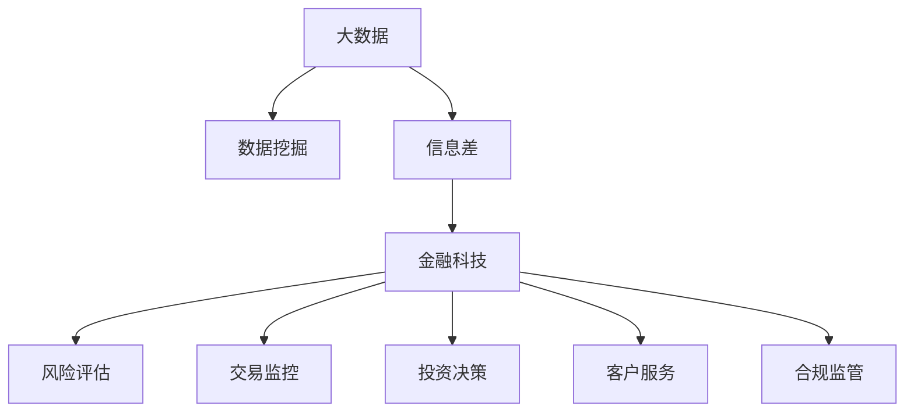

                 

## 1. 背景介绍

### 1.1 问题由来

金融行业是数据驱动的行业，从风险管理、投资决策到客户服务，都离不开数据的支撑。然而，金融数据的海量、复杂和多变特性，使得数据处理和分析面临巨大的挑战。传统的数据分析方法往往需要耗费大量的人力物力，且效果有限。

大数据技术的兴起，为金融行业提供了新的数据处理和分析工具。通过挖掘、清洗、分析、可视化等手段，大数据能够帮助金融机构发现潜在的风险和机会，优化业务流程，提升客户体验。但数据本身并不能带来价值，只有通过数据挖掘，揭示其中的"信息差"，才能真正发挥数据的效用。

### 1.2 问题核心关键点

数据信息差是指在数据集中隐藏着尚未被发现的信息和关系，这些信息通过合理的数据挖掘可以转化为有用的知识，进而转化为决策依据。金融领域的信息差可以来自多个方面，如客户行为、市场变化、欺诈检测、信用评估等。大数据技术通过分析海量数据，可以发现隐藏在其中的信息差，为金融机构提供决策支持。

在金融领域，大数据主要应用于以下方面：

- 风险评估：通过分析客户信用记录、交易行为等数据，评估客户的信用风险。
- 交易监控：监测异常交易行为，预防金融欺诈。
- 投资决策：分析市场数据，进行量化投资，提升投资收益。
- 客户服务：分析客户反馈，优化产品和服务，提升客户满意度。
- 合规监管：监测交易合规性，防范洗钱、逃税等非法行为。

## 2. 核心概念与联系

### 2.1 核心概念概述

为更好地理解大数据在金融领域的应用，本节将介绍几个关键的概念：

- **大数据（Big Data）**：指超大规模、多源、多类型的非结构化数据，包括互联网数据、社交媒体数据、金融交易数据等。通过大数据技术，能够高效地存储、管理和处理海量数据。

- **数据挖掘（Data Mining）**：指从大规模数据集中自动地发现有用知识和模式的过程。数据挖掘通过统计分析、机器学习、模式识别等方法，揭示数据中的潜在规律和关系。

- **信息差（Information Gap）**：指数据集中隐藏着尚未被发现的信息和关系。这些信息差通过合理的数据挖掘可以转化为有用的知识，进而转化为决策依据。

- **金融科技（FinTech）**：指应用大数据、人工智能、区块链等技术，提升金融行业的效率和创新能力，改善客户体验。

这些核心概念之间的逻辑关系可以通过以下Mermaid流程图来展示：



这个流程图展示了大数据、数据挖掘、信息差和金融科技之间的联系：

1. 大数据是数据挖掘的基础，为数据挖掘提供了素材。
2. 数据挖掘揭示了数据中的信息差，为金融科技提供了决策依据。
3. 金融科技将信息差转化为具体的业务应用，提升金融行业的效率和创新能力。

这些概念共同构成了大数据在金融领域应用的基本框架，使得大数据能够真正发挥其价值。

## 3. 核心算法原理 & 具体操作步骤

### 3.1 算法原理概述

大数据在金融领域的应用主要依赖于数据挖掘技术，通过分析海量数据，揭示数据中的信息差，为决策提供支持。

在金融领域，常用的数据挖掘算法包括：

- 关联规则挖掘：从交易数据中发现频繁出现的项集和关联规则，揭示交易模式。
- 聚类分析：将相似的交易记录归为一类，发现客户群体的消费特征。
- 分类与回归分析：利用历史数据训练分类或回归模型，预测客户行为或交易结果。
- 时间序列分析：分析时间序列数据，揭示市场趋势和季节性变化。
- 异常检测：监测交易数据中的异常行为，预防欺诈和违规。

这些算法通过不同的视角和方法，从海量金融数据中提取有价值的信息，为金融决策提供支持。

### 3.2 算法步骤详解

大数据在金融领域的应用流程主要包括以下几个步骤：

**Step 1: 数据收集与预处理**
- 收集金融领域的相关数据，如交易记录、客户信息、市场数据等。
- 对数据进行清洗和预处理，包括去除缺失值、异常值、重复值等，保证数据质量。
- 将数据进行标准化和归一化处理，统一数据格式。

**Step 2: 数据存储与管理**
- 选择合适的数据存储技术，如分布式文件系统（Hadoop、Spark）、NoSQL数据库等，高效存储和管理大数据。
- 采用数据仓库技术，如Apache Hive、Impala等，提供数据查询和分析功能。

**Step 3: 数据挖掘与分析**
- 选择合适的数据挖掘算法，如关联规则挖掘、聚类分析等。
- 对数据进行特征提取，如从交易记录中提取交易金额、交易时间、交易地点等信息。
- 利用机器学习模型，如决策树、随机森林、神经网络等，进行模式发现和预测。

**Step 4: 结果展示与解读**
- 将数据挖掘结果可视化展示，如图表、仪表盘等，方便决策者理解和分析。
- 对数据挖掘结果进行解读，揭示其中的信息差，如交易模式、客户偏好等，为金融决策提供支持。

**Step 5: 应用实施与优化**
- 根据数据挖掘结果，制定和优化金融业务流程，提升业务效率和客户体验。
- 定期更新数据和模型，跟踪市场变化，确保金融决策的时效性和准确性。

### 3.3 算法优缺点

大数据在金融领域的应用具有以下优点：

- **数据量大、覆盖面广**：大数据可以覆盖金融领域的各个方面，提供全面的数据支持。
- **实时性强**：通过实时数据流处理技术，能够及时反映市场变化，提升决策的时效性。
- **预测能力强**：大数据可以揭示潜在的市场趋势和客户行为，为预测提供支撑。

但同时也存在一些缺点：

- **数据复杂度高**：金融数据涉及多维度和多类型数据，处理复杂度较高。
- **数据隐私问题**：金融数据的隐私保护和合规要求较高，数据处理时需要严格遵守相关法规。
- **数据噪音多**：金融数据中存在噪音和不一致性，数据处理和分析需要较强的噪声过滤和异常检测能力。

尽管存在这些局限性，但大数据在金融领域的应用潜力巨大，能够为金融机构提供更加全面、深入、实时的决策支持。

### 3.4 算法应用领域

大数据在金融领域的应用涵盖了多个方面，如风险管理、投资决策、客户服务、合规监管等。具体来说，大数据在金融领域的应用主要包括以下几个领域：

- **风险管理**：利用客户信用记录、交易数据等，评估客户的信用风险。
- **投资决策**：分析市场数据，进行量化投资，提升投资收益。
- **客户服务**：分析客户反馈，优化产品和服务，提升客户满意度。
- **交易监控**：监测异常交易行为，预防金融欺诈。
- **合规监管**：监测交易合规性，防范洗钱、逃税等非法行为。

## 4. 数学模型和公式 & 详细讲解 & 举例说明

### 4.1 数学模型构建

为了更好地理解大数据在金融领域的应用，本节将介绍几个常用的数学模型：

- **关联规则挖掘**：Apriori算法。
- **聚类分析**：K-means算法。
- **分类与回归分析**：逻辑回归、决策树、随机森林等。
- **时间序列分析**：ARIMA模型、LSTM模型等。
- **异常检测**：孤立森林、局部离群因子等。

### 4.2 公式推导过程

以关联规则挖掘为例，介绍Apriori算法的公式推导过程。

关联规则挖掘的目标是从交易数据中发现频繁出现的项集和关联规则，揭示交易模式。Apriori算法是常用的关联规则挖掘算法之一，其核心思想是利用频繁项集递推生成。

设交易数据集为D={T1, T2, ..., Tn}，其中Ti={i1, i2, ..., ik}表示一个交易记录，每个元素ij表示一种商品。Apriori算法的步骤如下：

1. 扫描D，统计每个元素的频次，得到频繁1-项集L1。
2. 根据频繁1-项集L1，生成候选2-项集C2。
3. 扫描D，计算候选2-项集的频次，得到频繁2-项集L2。
4. 根据频繁2-项集L2，生成候选3-项集C3。
5. 重复以上步骤，直到没有新的频繁项集生成为止。

最终，得到的频繁项集即为关联规则的右端部分。通过连接左端部分，可得到所有关联规则。

### 4.3 案例分析与讲解

以一家银行为例，分析其客户消费模式。

1. **数据收集**：从银行系统中收集客户的交易记录，包括交易金额、交易时间、交易地点等信息。

2. **数据预处理**：对数据进行清洗和预处理，去除缺失值、异常值、重复值等，保证数据质量。

3. **数据存储与管理**：使用Hadoop和Hive存储和管理数据，提供高效的数据查询和分析功能。

4. **数据挖掘与分析**：使用Apriori算法进行关联规则挖掘，发现客户的消费模式。例如，发现客户购买牛奶和面包的频率较高，可推出牛奶和面包是客户的常见消费组合。

5. **结果展示与解读**：将挖掘结果可视化展示，如图表、仪表盘等，方便银行理解客户消费行为。例如，通过热力图展示客户的购买热点，为银行的促销活动提供数据支持。

## 5. 项目实践：代码实例和详细解释说明

### 5.1 开发环境搭建

在进行大数据在金融领域的应用开发前，我们需要准备好开发环境。以下是使用Python进行大数据开发的开发环境配置流程：

1. 安装Anaconda：从官网下载并安装Anaconda，用于创建独立的Python环境。

2. 创建并激活虚拟环境：
```bash
conda create -n bigdata-env python=3.8 
conda activate bigdata-env
```

3. 安装Python依赖包：
```bash
pip install pandas numpy scipy scikit-learn matplotlib seaborn dask
```

4. 安装大数据工具：
```bash
pip install pyspark
```

完成上述步骤后，即可在`bigdata-env`环境中开始大数据开发的实践。

### 5.2 源代码详细实现

下面我们以信用评分系统为例，给出使用Spark进行关联规则挖掘的PySpark代码实现。

首先，定义关联规则挖掘函数：

```python
from pyspark.sql import SparkSession
from pyspark.sql.functions import col, split, explode, collect_list, array_len

def association_rules(spark, data_path, min_support=0.1, min_confidence=0.5, min_lift=1.0):
    spark = SparkSession.builder.getOrCreate()
    df = spark.read.json(data_path)
    
    # 数据清洗
    df = df.drop_duplicates().filter(df["amount"] > 0).withColumn("date", df["date"].cast("date"))
    
    # 构建频繁项集
    frequent_items = df.groupBy("date").agg(array_len(col("items")))
    frequent_items = frequent_items.filter(frequent_items["items"] > 0)
    
    # 生成候选项集
    candidate_items = frequent_items.join(df, ["date"])
    candidate_items = candidate_items.select(col("date"), col("items"), split(col("items"), ' ')[0])
    
    # 计算候选项集的频次
    candidate_items = candidate_items.select(col("date"), explode(col("items")).alias("item"))
    candidate_items = candidate_items.join(df.select([col("date"), col("items")]), ["date", "item"])
    candidate_items = candidate_items.groupBy(col("date"), col("item")).count()
    candidate_items = candidate_items.filter(candidate_items["count"] >= min_support)
    
    # 生成关联规则
    rules = candidate_items.select(col("date"), col("item").alias("LHS"), array_col(candidate_items["count"].alias("count"))).join(frequent_items.select(col("date"), col("item").alias("RHS")), ["date", "item"])
    rules = rules.filter(rules["count"] == array_col(rules["count"]))
    rules = rules.filter(rules["LHS"].alias("LHS") + " " + rules["RHS"].alias("RHS") == "ALL")
    
    # 筛选符合条件的关联规则
    rules = rules.filter(rules["lift"] >= min_lift)
    
    return rules
```

然后，定义数据存储和处理函数：

```python
def store_rules(rules):
    # 将关联规则保存到文件
    with open("association_rules.txt", "w") as f:
        for rule in rules:
            f.write(f"{rule['LHS']} -> {rule['RHS']} | {rule['confidence']}\n")
```

最后，启动关联规则挖掘流程：

```python
# 启动Spark会话
spark = SparkSession.builder.getOrCreate()

# 指定数据路径
data_path = "data/sales.json"

# 进行关联规则挖掘
rules = association_rules(spark, data_path, min_support=0.1, min_confidence=0.5, min_lift=1.0)

# 保存挖掘结果
store_rules(rules)

# 停止Spark会话
spark.stop()
```

以上就是使用PySpark进行关联规则挖掘的完整代码实现。可以看到，通过Spark提供的分布式计算能力，大数据在金融领域的应用变得更加高效和便捷。

### 5.3 代码解读与分析

让我们再详细解读一下关键代码的实现细节：

**association_rules函数**：
- 对输入的数据进行清洗和预处理，去除缺失值、异常值、重复值等，保证数据质量。
- 利用频繁项集递推生成候选项集，计算候选项集的频次，生成关联规则。
- 根据预设的最小支持度、最小置信度和最小提升因子，筛选符合条件的关联规则。
- 返回挖掘结果，存储到文件中。

**store_rules函数**：
- 将挖掘结果保存到文件中，方便后续查看和使用。

**启动Spark会话和流程**：
- 使用SparkSession启动Spark会话。
- 指定数据路径。
- 进行关联规则挖掘。
- 保存挖掘结果。
- 停止Spark会话。

这些代码展示了大数据在金融领域应用的整体流程，通过Spark提供的分布式计算能力，能够高效地处理海量数据，揭示其中的信息差，为金融决策提供支持。

## 6. 实际应用场景

### 6.1 智能投顾

智能投顾是利用大数据和人工智能技术，为客户提供投资建议和组合管理的金融服务。通过大数据分析，智能投顾可以了解客户风险偏好、投资历史等，提供个性化的投资方案。

具体来说，智能投顾可以基于以下数据进行决策：

- 客户历史交易记录
- 市场行情数据
- 客户风险评估数据
- 市场新闻和舆情数据

利用大数据分析，智能投顾可以发现客户和市场之间的关联，预测市场趋势，推荐适合的投资组合。例如，如果发现客户的交易记录中大量购买科技股，可以推荐一些科技公司的股票，同时建议客户分散投资，降低风险。

### 6.2 欺诈检测

金融欺诈检测是大数据在金融领域的重要应用之一。通过大数据分析，可以发现异常交易行为，预防金融欺诈。

具体来说，欺诈检测可以基于以下数据进行：

- 客户交易记录
- 客户身份信息
- 市场数据
- 行为数据（如登录时间、交易时间等）

利用大数据分析，可以发现异常交易模式和行为特征，及时预警并防止欺诈行为的发生。例如，如果发现客户在短时间内频繁进行大额交易，且交易地点与平时的业务范围不符，可以怀疑该客户存在异常行为，进行进一步调查。

### 6.3 信用评分

信用评分是大数据在金融领域的重要应用之一，通过大数据分析，可以评估客户的信用风险，提供信用评分。

具体来说，信用评分可以基于以下数据进行：

- 客户历史交易记录
- 客户身份信息
- 市场数据
- 行为数据（如登录时间、交易时间等）

利用大数据分析，可以发现客户的信用行为和风险特征，预测其信用风险。例如，如果发现客户的交易记录中存在逾期还款记录，可以降低其信用评分，提示银行在后续的贷款审批中注意风险。

### 6.4 未来应用展望

随着大数据和人工智能技术的不断进步，基于大数据的金融应用将越来越广泛，为金融行业带来深刻的变革。

在智慧金融领域，大数据分析将进一步提升金融服务效率和客户体验。例如，通过大数据分析，可以发现客户的潜在需求，提供个性化的金融产品和服务，提高客户满意度。

在金融监管领域，大数据分析将进一步提高监管效率和合规性。例如，通过大数据分析，可以实时监测市场行为，预防洗钱、逃税等非法行为，保障金融市场的稳定运行。

在未来，大数据和人工智能技术将进一步融合，实现更加全面、深入、实时的金融决策支持。大数据在金融领域的应用，将成为金融行业的重要基础和核心竞争力。

## 7. 工具和资源推荐

### 7.1 学习资源推荐

为了帮助开发者系统掌握大数据在金融领域的应用，这里推荐一些优质的学习资源：

1. **《Python大数据分析》**：介绍Python在大数据分析中的应用，涵盖数据清洗、数据可视化、数据挖掘等方面。

2. **《大数据技术与应用》**：介绍大数据的基本概念、核心技术和应用场景，适合初学者入门。

3. **《金融科技：金融与技术的融合》**：介绍金融科技的基本概念、核心技术和应用场景，适合金融从业人员和技术人员学习。

4. **Kaggle金融数据分析竞赛**：通过实际比赛项目，掌握金融数据分析的基本技能和方法，提高数据处理和分析能力。

5. **Apache Hadoop官方文档**：Hadoop的官方文档，提供详细的大数据存储、处理和分析功能，适合深入学习。

通过学习这些资源，相信你一定能够快速掌握大数据在金融领域的应用技能，并用于解决实际的金融问题。

### 7.2 开发工具推荐

高效的工具是实现大数据在金融领域应用的重要保障。以下是几款常用的开发工具：

1. **Python**：常用的编程语言，提供丰富的数据处理和分析库，如Pandas、NumPy、Scikit-Learn等。

2. **Spark**：分布式计算框架，支持大规模数据处理和分析，适合大数据应用的开发。

3. **Hadoop**：分布式文件系统，支持海量数据存储和管理，适合大规模数据应用开发。

4. **Dask**：基于Python的分布式计算库，支持大规模数据处理和分析，适合大数据应用的开发。

5. **Tableau**：数据可视化工具，支持丰富的数据可视化功能，方便数据分析结果的展示。

这些工具提供了丰富的功能和灵活的接口，能够高效地支持大数据在金融领域的应用开发。

### 7.3 相关论文推荐

大数据在金融领域的应用研究已经取得了一些重要成果，以下是几篇奠基性的相关论文，推荐阅读：

1. **《大数据在金融风控中的应用》**：介绍大数据在金融风控中的基本概念、核心技术和应用场景，适合金融从业人员和技术人员学习。

2. **《利用大数据进行金融欺诈检测》**：介绍大数据在金融欺诈检测中的应用，涵盖数据预处理、数据挖掘、模型评估等方面。

3. **《基于大数据的金融信用评分系统》**：介绍大数据在金融信用评分中的应用，涵盖数据收集、数据处理、模型训练等方面。

4. **《大数据与人工智能在金融行业的融合》**：介绍大数据与人工智能在金融行业的融合，涵盖金融大数据分析、金融智能投顾等方面。

这些论文代表了大数据在金融领域应用的研究方向，通过学习这些前沿成果，可以帮助研究者把握学科前进方向，激发更多的创新灵感。

## 8. 总结：未来发展趋势与挑战

### 8.1 总结

本文对大数据在金融领域的应用进行了全面系统的介绍。首先阐述了金融行业的背景和需求，明确了大数据在金融领域应用的价值。其次，从原理到实践，详细讲解了大数据在金融领域的应用流程和关键技术。最后，通过实际应用场景，展示了大数据在金融领域的广阔前景和重要意义。

通过本文的系统梳理，可以看到，大数据在金融领域的应用已经取得了显著成果，能够为金融机构提供更加全面、深入、实时的决策支持。未来，随着大数据和人工智能技术的进一步发展，大数据在金融领域的应用将更加广泛，为金融行业带来更深层次的变革。

### 8.2 未来发展趋势

展望未来，大数据在金融领域的应用将呈现以下几个趋势：

1. **数据实时性增强**：随着数据源的不断拓展，金融数据将更加实时和多样，大数据分析将进一步提升金融决策的时效性。

2. **算法多样性提升**：随着算法的不断创新，大数据在金融领域的应用将更加多样和高效，涵盖风险评估、交易监控、客户服务等多个方面。

3. **数据隐私和安全保障**：随着数据隐私和安全要求的提高，大数据在金融领域的应用将更加注重隐私保护和合规性，确保数据安全和合规。

4. **跨领域融合增强**：随着金融科技的不断发展，大数据将与其他技术如人工智能、区块链、物联网等进行更深入的融合，提升金融服务的智能化水平。

5. **知识图谱和语义分析**：随着知识图谱和语义分析技术的成熟，大数据在金融领域的应用将更加深入和全面，提供更精准的知识服务和智能推理。

这些趋势凸显了大数据在金融领域应用的广阔前景，为金融行业带来了更多的创新机会和发展空间。

### 8.3 面临的挑战

尽管大数据在金融领域的应用已经取得了一些成果，但仍面临诸多挑战：

1. **数据质量问题**：金融数据涉及多维度和多类型数据，处理复杂度较高，数据质量难以保证。

2. **数据隐私和安全问题**：金融数据的隐私和安全保护要求较高，数据处理时需要严格遵守相关法规。

3. **计算资源问题**：大数据在金融领域的应用需要大量的计算资源，分布式计算和存储技术需要进一步优化。

4. **数据噪音问题**：金融数据中存在噪音和不一致性，数据处理和分析需要较强的噪声过滤和异常检测能力。

5. **跨领域融合问题**：大数据与其他技术如人工智能、区块链等的融合需要更高的技术要求和标准。

尽管存在这些挑战，但通过不断优化和改进，大数据在金融领域的应用前景仍然非常广阔，为金融行业带来了更多的创新机会和发展空间。

### 8.4 研究展望

面对大数据在金融领域应用所面临的诸多挑战，未来的研究需要在以下几个方面寻求新的突破：

1. **数据质量提升**：通过数据清洗、预处理和增强技术，提高数据质量，保证大数据分析的准确性和可靠性。

2. **数据隐私保护**：通过数据匿名化、加密等技术，保护数据的隐私安全，确保数据使用的合规性。

3. **计算资源优化**：通过分布式计算、云计算等技术，优化大数据的计算资源，降低计算成本，提高大数据处理的效率。

4. **数据噪音过滤**：通过数据清洗、异常检测等技术，提高数据的噪声过滤能力，保证大数据分析的准确性。

5. **跨领域融合**：通过知识图谱、语义分析等技术，实现大数据与其他技术的深度融合，提升金融服务的智能化水平。

这些研究方向的探索，必将引领大数据在金融领域应用的进一步发展，为金融行业带来更深层次的变革。

## 9. 附录：常见问题与解答

**Q1：大数据在金融领域有哪些应用？**

A: 大数据在金融领域的应用涵盖多个方面，如风险评估、投资决策、客户服务、欺诈检测、信用评分等。通过大数据分析，可以揭示数据中的信息差，为金融决策提供支持。

**Q2：大数据在金融领域应用时需要注意哪些问题？**

A: 大数据在金融领域应用时需要注意以下问题：
1. 数据质量问题：金融数据涉及多维度和多类型数据，处理复杂度较高，数据质量难以保证。
2. 数据隐私和安全问题：金融数据的隐私和安全保护要求较高，数据处理时需要严格遵守相关法规。
3. 计算资源问题：大数据在金融领域的应用需要大量的计算资源，分布式计算和存储技术需要进一步优化。
4. 数据噪音问题：金融数据中存在噪音和不一致性，数据处理和分析需要较强的噪声过滤和异常检测能力。
5. 跨领域融合问题：大数据与其他技术如人工智能、区块链等的融合需要更高的技术要求和标准。

**Q3：如何提高大数据在金融领域的应用效率？**

A: 提高大数据在金融领域的应用效率，需要从以下几个方面入手：
1. 选择合适的数据存储和处理技术，如Hadoop、Spark等。
2. 优化数据清洗和预处理流程，提高数据质量。
3. 采用高效的算法和模型，如关联规则挖掘、聚类分析等。
4. 利用分布式计算和存储技术，优化大数据的计算资源。
5. 引入人工智能和知识图谱等技术，提升大数据分析的智能化水平。

这些措施可以有效提高大数据在金融领域的应用效率，确保数据分析和应用的高效性和准确性。

**Q4：大数据在金融领域的应用有哪些未来发展方向？**

A: 大数据在金融领域的应用有以下未来发展方向：
1. 数据实时性增强：随着数据源的不断拓展，金融数据将更加实时和多样，大数据分析将进一步提升金融决策的时效性。
2. 算法多样性提升：随着算法的不断创新，大数据在金融领域的应用将更加多样和高效，涵盖风险评估、交易监控、客户服务等多个方面。
3. 数据隐私和安全保障：随着数据隐私和安全要求的提高，大数据在金融领域的应用将更加注重隐私保护和合规性，确保数据安全和合规。
4. 跨领域融合增强：随着金融科技的不断发展，大数据将与其他技术如人工智能、区块链、物联网等进行更深入的融合，提升金融服务的智能化水平。
5. 知识图谱和语义分析：随着知识图谱和语义分析技术的成熟，大数据在金融领域的应用将更加深入和全面，提供更精准的知识服务和智能推理。

这些发展方向将引领大数据在金融领域应用的进一步发展，为金融行业带来更多的创新机会和发展空间。

---

作者：禅与计算机程序设计艺术 / Zen and the Art of Computer Programming

