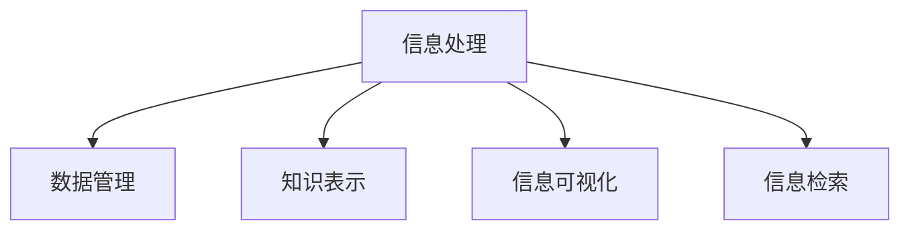

                 

# 信息简化的原则与艺术：在混乱中建立秩序与简化

在当今信息爆炸的时代，有效管理、处理和简化信息变得至关重要。无论是在个人生活还是企业运营中，信息过载和复杂性都是不可避免的挑战。本文将深入探讨信息简化的原则与艺术，介绍如何在混乱中找到秩序与简化，帮助读者在信息海洋中游刃有余。

## 1. 背景介绍

### 1.1 问题由来
随着信息技术的发展，信息的获取、处理和传播变得更加便捷，但同时也带来了前所未有的复杂性和混乱。用户在日常工作、学习和生活中，面临着大量的信息来源和格式多样的信息内容。信息过载不仅导致决策困难，还可能影响个人的注意力和效率。在企业层面，信息管理不善同样会导致资源浪费和决策失误。因此，如何在混乱中找到秩序与简化，成为了一个迫切需要解决的问题。

### 1.2 问题核心关键点
信息简化的核心在于将复杂、无序的信息转化为有序、易于处理的形式。核心问题包括：
- 如何高效识别、过滤、整理和利用信息。
- 如何设计简单、直观的界面和流程，使用户能够轻松获取和理解信息。
- 如何整合多源、异构的信息，形成统一的、可操作的视图。
- 如何利用算法和技术手段，自动化地进行信息抽取、处理和呈现。

## 2. 核心概念与联系

### 2.1 核心概念概述

为更好地理解信息简化的原则与艺术，本节将介绍几个密切相关的核心概念：

- **信息处理(Information Processing)**：将原始数据转换为有用、有意义的信息的过程，包括数据收集、清洗、提取、整合、呈现等环节。
- **数据管理(Data Management)**：对数据进行有效存储、访问、更新和保护，确保数据的质量和安全。
- **知识表示(Knowledge Representation)**：将知识以结构化的形式存储和表达，便于理解和推理。
- **信息可视化(Information Visualization)**：使用图形、图表等可视化手段，直观展示数据和信息，便于发现规律和洞察趋势。
- **信息检索(Information Retrieval)**：从大量数据中快速检索出符合用户需求的信息，提高信息获取效率。

这些概念之间的逻辑关系可以通过以下Mermaid流程图来展示：



这个流程图展示出信息处理的各个环节，及其与其他核心概念之间的联系。

## 3. 核心算法原理 & 具体操作步骤

### 3.1 算法原理概述

信息简化和处理的核心算法原理基于计算机科学的多个分支，包括数据结构、算法、人工智能等。其核心思想是通过算法和工具，将复杂的信息转化为结构化的数据和易于理解的视图。常见的算法和工具包括：

- 数据结构（如数组、链表、树、图等）用于组织和管理数据。
- 算法（如排序、查找、匹配、分类等）用于对数据进行处理和操作。
- 数据库管理系统（如关系型数据库、NoSQL数据库等）用于存储和检索数据。
- 数据挖掘和机器学习算法（如分类、聚类、回归等）用于从数据中发现模式和规律。
- 信息检索和推荐系统算法（如倒排索引、协同过滤等）用于快速检索和推荐信息。

### 3.2 算法步骤详解

信息简化的具体操作步骤包括以下几个关键步骤：

**Step 1: 数据收集与清洗**
- 收集来源多样、格式不同的原始数据，如文本、图片、视频、音频等。
- 对数据进行初步清洗，去除噪声、重复和错误数据。

**Step 2: 数据标准化与归一化**
- 对不同来源和格式的数据进行标准化处理，确保数据的一致性和可用性。
- 对数据进行归一化处理，使数据在相同尺度下进行比较和操作。

**Step 3: 数据抽取与整合**
- 使用NLP技术（如实体抽取、关系抽取、事件抽取等）从文本中抽取结构化数据。
- 将多源异构的数据进行整合，形成统一的数据视图。

**Step 4: 数据存储与索引**
- 选择合适的数据库系统，将处理后的数据进行存储。
- 建立数据索引，便于快速检索和访问。

**Step 5: 数据可视化与呈现**
- 使用可视化工具（如Tableau、Power BI、D3.js等）将数据转化为图形、图表等可视化形式。
- 设计简洁、直观的界面，便于用户获取和理解信息。

**Step 6: 信息检索与推荐**
- 使用信息检索算法（如倒排索引、向量空间模型等）构建信息检索系统。
- 使用推荐算法（如协同过滤、基于内容的推荐等）提供个性化的信息推荐。

### 3.3 算法优缺点

信息简化和处理的算法具有以下优点：
1. 高效性：通过自动化处理和算法优化，可以大大提高数据处理和信息检索的效率。
2. 准确性：算法能够精准地处理和分析数据，发现数据的规律和模式。
3. 可扩展性：通过算法和工具的灵活组合，可以应对不同类型的信息处理需求。

同时，这些算法也存在一定的局限性：
1. 复杂性：算法设计和实现往往较为复杂，需要较高的技术门槛。
2. 数据依赖：算法的性能很大程度上依赖于数据的质量和多样性。
3. 鲁棒性：算法可能对噪声和异常值敏感，导致处理结果不准确。
4. 可解释性：部分复杂算法难以解释其内部工作机制，使用户难以理解。

尽管存在这些局限性，但就目前而言，信息简化和处理仍是信息管理中最先进、最有效的技术手段。未来相关研究的重点在于如何进一步提升算法的准确性和可解释性，同时兼顾高效性和可扩展性。

### 3.4 算法应用领域

信息简化和处理的算法在众多领域中得到了广泛的应用，例如：

- 金融分析：对金融市场数据进行清洗、分析和可视化，辅助投资决策。
- 医疗诊断：对患者数据进行整理和分析，辅助医生进行诊断和治疗。
- 市场调研：对市场数据进行抽取和整合，提供市场趋势和用户画像。
- 物流管理：对物流数据进行实时处理和分析，优化物流路线和资源配置。
- 客户服务：对客户数据进行分析和推荐，提升客户满意度和忠诚度。

除了上述这些经典应用外，信息简化和处理的算法还被创新性地应用到更多场景中，如社交网络分析、智能推荐系统、内容生成等，为信息管理带来了新的思路和方法。随着技术的不断进步，相信信息简化和处理的算法将在更多领域得到应用，提升信息管理的智能化和自动化水平。

## 4. 数学模型和公式 & 详细讲解 & 举例说明

### 4.1 数学模型构建

信息简化的数学模型主要基于数据处理和信息检索的核心算法，包括数据结构、算法、机器学习等。以下将以数据结构为例，展示如何构建信息简化的数学模型。

**Step 1: 数据结构选择**
- 根据数据类型和操作需求，选择合适的数据结构。例如，使用哈希表（Hash Table）进行快速查找，使用树结构进行排序和搜索。

**Step 2: 数据结构操作**
- 对数据结构进行常见操作，如插入、删除、更新和查询。例如，使用哈希表进行快速插入和查找，使用二叉树进行排序和搜索。

**Step 3: 数据结构分析**
- 分析数据结构的性能特点，如时间复杂度和空间复杂度。例如，哈希表的插入和查找操作的时间复杂度为O(1)，而树结构的插入和查找操作的时间复杂度为O(log n)。

**Step 4: 算法优化**
- 使用算法优化技术，提升数据结构的操作效率。例如，使用平衡二叉树（如红黑树）优化查找操作的时间复杂度为O(log n)。

### 4.2 公式推导过程

以下将以排序算法为例，展示信息简化的数学模型构建过程。

**Step 1: 算法选择**
- 根据数据规模和操作需求，选择合适的排序算法。例如，选择快速排序（Quick Sort）或归并排序（Merge Sort）。

**Step 2: 算法实现**
- 使用代码实现排序算法，具体步骤如下：
  1. 选择基准值（Pivot）。
  2. 将数据分为两部分，小于基准值的部分和大于基准值的部分。
  3. 递归对两部分进行排序。
  
**Step 3: 算法分析**
- 分析排序算法的性能特点，如时间复杂度和空间复杂度。例如，快速排序的平均时间复杂度为O(n log n)，归并排序的时间复杂度为O(n log n)。

**Step 4: 算法优化**
- 使用算法优化技术，提升排序算法的效率。例如，使用插入排序（Insertion Sort）优化快速排序在小数据集上的效率。

### 4.3 案例分析与讲解

**案例1: 金融数据分析**
- 收集股票市场的数据，包括价格、成交量、消息等。
- 使用数据清洗和归一化技术处理数据。
- 使用数据抽取和整合技术，构建统一的数据视图。
- 使用数据可视化工具，展示市场趋势和波动。
- 使用推荐算法，推荐股票投资组合。

**案例2: 医疗诊断系统**
- 收集患者的病历数据，包括症状、检查结果等。
- 使用数据清洗和归一化技术处理数据。
- 使用数据抽取和整合技术，构建患者健康档案。
- 使用数据可视化工具，展示患者健康状况和诊疗方案。
- 使用推荐算法，推荐诊断和治疗方案。

通过这些案例可以看出，信息简化和处理的数学模型在实际应用中具有重要的价值，能够有效地提升信息管理和处理效率，帮助用户快速获取和理解信息。

## 5. 项目实践：代码实例和详细解释说明

### 5.1 开发环境搭建

在进行信息简化和处理的实践前，我们需要准备好开发环境。以下是使用Python进行信息处理和数据可视化的环境配置流程：

1. 安装Anaconda：从官网下载并安装Anaconda，用于创建独立的Python环境。

2. 创建并激活虚拟环境：
```bash
conda create -n info-simplify python=3.8 
conda activate info-simplify
```

3. 安装相关工具包：
```bash
pip install pandas numpy matplotlib seaborn
```

4. 安装可视化库：
```bash
pip install plotly dash
```

完成上述步骤后，即可在`info-simplify`环境中开始信息处理和可视化的实践。

### 5.2 源代码详细实现

这里我们以金融数据分析为例，展示使用Python进行数据处理和可视化的代码实现。

首先，定义数据处理函数：

```python
import pandas as pd
import numpy as np
import seaborn as sns
import matplotlib.pyplot as plt

def load_data():
    # 从本地或远程数据源加载数据
    data = pd.read_csv('financial_data.csv')
    return data

def clean_data(data):
    # 清洗数据，去除噪声和重复数据
    cleaned_data = data.drop_duplicates()
    return cleaned_data

def normalize_data(data):
    # 对数据进行归一化处理
    normalized_data = (data - np.mean(data)) / np.std(data)
    return normalized_data

def visualize_data(data):
    # 使用可视化工具展示数据
    sns.lineplot(x='date', y='price', data=normalized_data)
    plt.show()
```

然后，定义数据处理流程：

```python
# 加载数据
data = load_data()

# 清洗数据
cleaned_data = clean_data(data)

# 归一化数据
normalized_data = normalize_data(cleaned_data)

# 可视化数据
visualize_data(normalized_data)
```

最后，启动数据处理流程并在可视化图表中展示结果：

```python
# 执行数据处理流程
data = load_data()
cleaned_data = clean_data(data)
normalized_data = normalize_data(cleaned_data)
visualize_data(normalized_data)
```

以上就是使用Python进行金融数据分析的完整代码实现。可以看到，通过简单的函数定义和数据处理，即能快速实现数据的清洗、归一化和可视化。

### 5.3 代码解读与分析

让我们再详细解读一下关键代码的实现细节：

**load_data函数**：
- 从本地或远程数据源加载数据，使用Pandas库的read_csv方法实现。

**clean_data函数**：
- 使用Pandas库的drop_duplicates方法去除数据中的重复记录。

**normalize_data函数**：
- 对数据进行归一化处理，使用NumPy库的mean和std函数计算均值和标准差，然后使用公式(x - mean) / std实现归一化。

**visualize_data函数**：
- 使用Seaborn库的lineplot方法绘制价格随时间的变化曲线，使用Matplotlib库的show方法展示图表。

通过这些函数的组合调用，即可实现数据的加载、清洗、归一化和可视化。这一过程展示了信息简化和处理的基本步骤和技巧。

## 6. 实际应用场景

### 6.1 金融数据分析

金融数据分析是信息简化的经典应用场景，通过对股票、期货等市场数据的处理和分析，帮助投资者做出更为精准的决策。

**应用流程**：
- 收集市场数据，包括股票价格、成交量、消息等。
- 清洗数据，去除噪声和重复数据。
- 归一化数据，确保数据在相同尺度下进行比较。
- 使用数据可视化工具，展示市场趋势和波动。
- 使用推荐算法，推荐股票投资组合。

**实际案例**：
- 某投资公司使用信息简化技术，对市场数据进行实时处理和分析，构建了智能投资分析系统。系统能够自动收集和清洗数据，进行归一化处理，并使用可视化工具展示股票价格和波动趋势。同时，系统还使用推荐算法，根据用户的风险偏好和市场趋势，推荐个性化的股票投资组合。

通过这一应用案例，我们可以看到信息简化和处理的算法在金融分析中的应用价值。

### 6.2 医疗诊断系统

医疗诊断系统是信息简化的重要应用场景，通过对患者数据的处理和分析，辅助医生进行诊断和治疗。

**应用流程**：
- 收集患者数据，包括病历、检查结果等。
- 清洗数据，去除噪声和重复数据。
- 归一化数据，确保数据在相同尺度下进行比较。
- 使用数据可视化工具，展示患者健康状况和诊疗方案。
- 使用推荐算法，推荐诊断和治疗方案。

**实际案例**：
- 某医院使用信息简化技术，对患者数据进行整理和分析，构建了智能诊断系统。系统能够自动收集和清洗数据，进行归一化处理，并使用可视化工具展示患者的健康状况和诊疗方案。同时，系统还使用推荐算法，根据患者的病情和医生的诊断经验，推荐个性化的诊断和治疗方案。

通过这一应用案例，我们可以看到信息简化和处理的算法在医疗诊断中的应用价值。

### 6.3 物流管理

物流管理是信息简化的重要应用场景，通过对物流数据的处理和分析，优化物流路线和资源配置。

**应用流程**：
- 收集物流数据，包括运输路线、货物状态、车辆信息等。
- 清洗数据，去除噪声和重复数据。
- 归一化数据，确保数据在相同尺度下进行比较。
- 使用数据可视化工具，展示物流路线和货物状态。
- 使用推荐算法，优化物流路线和资源配置。

**实际案例**：
- 某物流公司使用信息简化技术，对物流数据进行实时处理和分析，构建了智能物流管理系统。系统能够自动收集和清洗数据，进行归一化处理，并使用可视化工具展示物流路线和货物状态。同时，系统还使用推荐算法，根据实时数据，优化物流路线和资源配置，提升物流效率和降低成本。

通过这一应用案例，我们可以看到信息简化和处理的算法在物流管理中的应用价值。

### 6.4 客户服务

客户服务是信息简化的重要应用场景，通过对客户数据的处理和分析，提升客户满意度和忠诚度。

**应用流程**：
- 收集客户数据，包括浏览记录、购买记录、客服记录等。
- 清洗数据，去除噪声和重复数据。
- 归一化数据，确保数据在相同尺度下进行比较。
- 使用数据可视化工具，展示客户行为和需求。
- 使用推荐算法，推荐个性化的服务和产品。

**实际案例**：
- 某电商平台使用信息简化技术，对客户数据进行整理和分析，构建了智能客户服务系统。系统能够自动收集和清洗数据，进行归一化处理，并使用可视化工具展示客户行为和需求。同时，系统还使用推荐算法，根据客户的购买记录和浏览行为，推荐个性化的服务和产品，提升客户满意度和忠诚度。

通过这一应用案例，我们可以看到信息简化和处理的算法在客户服务中的应用价值。

### 6.5 未来应用展望

随着信息技术的不断进步，信息简化和处理的算法将在更多领域得到应用，为社会带来深远影响。

- **智慧城市**：通过对城市数据的处理和分析，构建智能交通、智能安防、智能环境等系统，提升城市管理的智能化水平。
- **智能制造**：通过对生产数据的处理和分析，优化生产流程、提升产品质量，实现智能制造。
- **智能农业**：通过对农业数据的处理和分析，优化种植方案、提升产量，实现智能农业。
- **智能家居**：通过对家庭数据的处理和分析，提升家庭生活的智能化水平，实现智能家居。
- **智能教育**：通过对教育数据的处理和分析，优化教学内容、提升教学效果，实现智能教育。

通过这些未来应用展望，我们可以看到信息简化和处理的算法的广阔前景，在各行各业中发挥着重要的作用。

## 7. 工具和资源推荐

### 7.1 学习资源推荐

为了帮助开发者系统掌握信息简化和处理的理论基础和实践技巧，这里推荐一些优质的学习资源：

1. 《信息论与信号处理》系列博文：由信息科学专家撰写，深入浅出地介绍了信息论、信号处理、数据压缩等基础概念和经典算法。

2. 《数据结构与算法》课程：由知名大学开设的计算机科学课程，涵盖数据结构、算法、时间复杂度分析等核心内容。

3. 《Python数据科学手册》书籍：详细介绍了Python在数据处理和可视化中的应用，适合初学者和中级开发者。

4. 《数据挖掘与统计学习》书籍：介绍了数据挖掘和机器学习的基本原理和实用算法，适合数据科学家和机器学习工程师。

5. 《自然语言处理与信息检索》书籍：详细介绍了自然语言处理和信息检索的理论与实践，适合NLP工程师和信息检索工程师。

通过对这些资源的学习实践，相信你一定能够快速掌握信息处理和简化的精髓，并用于解决实际的信息管理问题。

### 7.2 开发工具推荐

高效的开发离不开优秀的工具支持。以下是几款用于信息处理和数据可视化的常用工具：

1. Python：广泛使用的编程语言，拥有丰富的数据处理和可视化库。
2. Pandas：基于NumPy的Python数据分析库，支持数据清洗、处理和分析。
3. NumPy：Python数值计算库，支持高效的数值运算和矩阵计算。
4. Matplotlib：Python数据可视化库，支持绘制各种类型的图表。
5. Seaborn：基于Matplotlib的高级数据可视化库，支持更为美观和复杂的图表展示。
6. Plotly：基于Web的数据可视化工具，支持交互式图表和动态展示。

合理利用这些工具，可以显著提升信息处理和可视化的开发效率，加快创新迭代的步伐。

### 7.3 相关论文推荐

信息处理和简化的研究源于学界的持续研究。以下是几篇奠基性的相关论文，推荐阅读：

1. Information Retrieval Theory: An Overview: 综述了信息检索的基础理论和应用，介绍了倒排索引、向量空间模型等经典算法。

2. Data Cleaning: A Review: 综述了数据清洗的方法和技术，介绍了数据清洗的目标、过程和工具。

3. Knowledge Representation and Reasoning: 介绍了知识表示的基本原理和常用方法，如符号逻辑、框架、本体等。

4. Machine Learning for Data Mining: 介绍了机器学习在数据挖掘中的应用，如分类、聚类、回归等。

5. Big Data Management and Analytics: 介绍了大数据管理和分析的技术和方法，如Hadoop、Spark、NoSQL数据库等。

这些论文代表了大数据处理和信息管理的核心思想和发展脉络。通过学习这些前沿成果，可以帮助研究者把握学科前进方向，激发更多的创新灵感。

## 8. 总结：未来发展趋势与挑战

### 8.1 总结

本文对信息简化和处理的原理与艺术进行了全面系统的介绍。首先阐述了信息处理的背景和意义，明确了信息处理在信息管理中的重要地位。其次，从原理到实践，详细讲解了信息处理的基本流程和关键步骤，给出了信息处理任务开发的完整代码实例。同时，本文还广泛探讨了信息处理在多个行业领域的应用前景，展示了信息处理范式的巨大潜力。此外，本文精选了信息处理技术的各类学习资源，力求为读者提供全方位的技术指引。

通过本文的系统梳理，可以看到，信息处理和简化技术正在成为信息管理的重要范式，极大地提升了信息管理和处理的智能化和自动化水平。未来，伴随信息处理技术的持续演进，相信信息管理将迎来更多的应用场景和技术突破。

### 8.2 未来发展趋势

展望未来，信息处理和简化的技术将呈现以下几个发展趋势：

1. 自动化和智能化程度提升：随着人工智能技术的发展，信息处理将越来越多地依赖于自动化和智能化算法，如机器学习、深度学习等。信息处理将变得更加高效、准确、灵活。

2. 多源数据整合能力增强：信息处理将越来越多地处理多源、异构的数据，如文本、图像、音频等。通过数据融合技术，将不同类型的数据进行整合，形成统一的信息视图。

3. 实时数据处理能力提升：信息处理将越来越多地处理实时数据，如金融交易数据、物流运输数据等。通过流处理技术，实现数据的实时分析和处理。

4. 数据安全与隐私保护加强：信息处理将越来越注重数据安全与隐私保护，防止数据泄露和滥用。通过加密、匿名化、差分隐私等技术，保护数据隐私。

5. 用户友好性提升：信息处理将越来越注重用户友好性，提供简洁、直观、易用的界面和工具，使用户能够轻松获取和理解信息。

6. 自然语言处理技术普及：信息处理将越来越多地使用自然语言处理技术，提升信息处理的智能化水平，如情感分析、文本摘要、智能问答等。

以上趋势凸显了信息处理和简化的广阔前景。这些方向的探索发展，必将进一步提升信息管理系统的性能和应用范围，为信息管理带来新的突破。

### 8.3 面临的挑战

尽管信息处理和简化的技术已经取得了显著进展，但在迈向更加智能化、普适化应用的过程中，它仍面临着诸多挑战：

1. 数据质量瓶颈：信息处理的效果很大程度上依赖于数据的质量和完整性。如何在数据收集、清洗、整合等环节提升数据质量，仍然是一个重要挑战。

2. 算法复杂性：信息处理中的许多算法（如深度学习、自然语言处理）往往较为复杂，需要较高的技术门槛和计算资源。如何降低算法复杂性，提升算法的可解释性和可扩展性，仍需不断探索。

3. 实时性要求：信息处理的实时性要求高，特别是在金融、物流等需要快速决策的应用场景中。如何提升信息处理的速度和效率，仍是技术研究的重点。

4. 隐私和安全问题：信息处理中涉及大量敏感数据，如何保护数据隐私和安全，防止数据滥用，是一个重要的挑战。

5. 用户参与度问题：信息处理系统的用户友好性还需提升，如何在信息处理中充分考虑用户需求和使用习惯，提升用户参与度，仍需深入研究。

6. 技术标准统一：信息处理技术需要建立统一的技术标准和规范，确保不同系统之间的互操作性和可扩展性。

正视信息处理和简化面临的这些挑战，积极应对并寻求突破，将是大数据时代信息管理走向成熟的必由之路。相信随着学界和产业界的共同努力，这些挑战终将一一被克服，信息处理和简化技术必将在构建智慧社会中扮演越来越重要的角色。

### 8.4 研究展望

面对信息处理和简化技术面临的种种挑战，未来的研究需要在以下几个方面寻求新的突破：

1. 数据质量提升技术：开发新的数据收集、清洗和整合技术，提升数据的质量和可用性。如使用自动化标注、半监督学习等技术，从少量标注数据中提取有价值的信息。

2. 高效算法设计：开发更高效、可解释的算法，降低算法复杂性和计算资源消耗。如使用参数高效的深度学习模型，在减少参数数量的同时，保持模型性能。

3. 实时数据处理技术：开发新的流处理和实时分析技术，实现数据的实时处理和分析。如使用Spark Streaming、Flink等流处理框架，实现实时数据处理。

4. 数据隐私和安全技术：开发新的数据隐私保护和匿名化技术，保护数据隐私和安全。如使用差分隐私、联邦学习等技术，在不泄露数据的前提下，实现数据共享和分析。

5. 用户友好性提升技术：开发更简洁、直观、易用的用户界面和工具，提升用户体验和参与度。如使用自然语言处理技术，实现智能问答、文本摘要等功能。

6. 技术标准和规范：制定统一的技术标准和规范，确保不同系统之间的互操作性和可扩展性。如使用API接口、数据交换格式等标准，实现系统间的无缝集成。

这些研究方向的探索，必将引领信息处理和简化技术的进步，为构建智能、高效、安全的信息管理系统提供有力支撑。面向未来，信息处理和简化技术还需要与其他人工智能技术进行更深入的融合，如知识表示、因果推理、强化学习等，多路径协同发力，共同推动信息管理的进步。只有勇于创新、敢于突破，才能不断拓展信息处理的边界，让信息管理系统更好地服务于社会。

## 9. 附录：常见问题与解答

**Q1：信息简化和处理的算法有哪些优缺点？**

A: 信息简化和处理的算法具有以下优点：
1. 高效性：通过自动化处理和算法优化，可以大大提高数据处理和信息检索的效率。
2. 准确性：算法能够精准地处理和分析数据，发现数据的规律和模式。
3. 可扩展性：通过算法和工具的灵活组合，可以应对不同类型的信息处理需求。

同时，这些算法也存在一定的局限性：
1. 复杂性：算法设计和实现往往较为复杂，需要较高的技术门槛。
2. 数据依赖：算法的性能很大程度上依赖于数据的质量和多样性。
3. 鲁棒性：算法可能对噪声和异常值敏感，导致处理结果不准确。
4. 可解释性：部分复杂算法难以解释其内部工作机制，使用户难以理解。

尽管存在这些局限性，但就目前而言，信息简化和处理的算法仍是信息管理中最先进、最有效的技术手段。未来相关研究的重点在于如何进一步提升算法的准确性和可解释性，同时兼顾高效性和可扩展性。

**Q2：如何提升信息处理的质量和效率？**

A: 提升信息处理的质量和效率，可以从以下几个方面入手：
1. 数据收集：确保数据来源可靠、多样，覆盖不同领域的知识。
2. 数据清洗：去除噪声、重复和错误数据，提升数据的准确性和一致性。
3. 数据整合：将多源、异构的数据进行整合，形成统一的数据视图。
4. 算法优化：选择合适的算法和工具，优化数据处理和分析的过程。
5. 实时处理：采用流处理技术，实现数据的实时分析和处理。
6. 用户参与：通过用户反馈和参与，优化信息处理系统和算法。

通过这些措施，可以显著提升信息处理的质量和效率，为信息管理提供更可靠、更高效的技术支撑。

**Q3：如何保护信息处理的隐私和安全？**

A: 保护信息处理的隐私和安全，可以从以下几个方面入手：
1. 数据加密：对敏感数据进行加密存储和传输，防止数据泄露。
2. 匿名化处理：对数据进行匿名化处理，去除个人身份信息，保护用户隐私。
3. 差分隐私：使用差分隐私技术，在数据分析过程中保护用户隐私。
4. 访问控制：对数据进行访问控制，限制数据的使用范围和权限。
5. 审计与监控：对信息处理系统进行审计和监控，防止数据滥用和违规操作。

通过这些措施，可以保护信息处理的隐私和安全，确保数据的使用合规和合法。

---

作者：禅与计算机程序设计艺术 / Zen and the Art of Computer Programming

