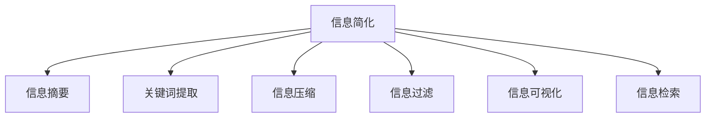

                 

## 1. 背景介绍

### 1.1 问题由来

在信息爆炸的时代，人们每天被大量的数据和信息所淹没。从新闻资讯到社交媒体，从电子邮件到网页内容，信息的数量和种类已经远远超出了人类大脑的处理能力。如何在海量信息中找到有价值的内容，如何快速高效地进行信息处理，成为了一个迫切需要解决的问题。

### 1.2 问题核心关键点

信息简化（Information Simplification），是指通过减少信息的数量、结构或复杂性，使得信息更易于理解和处理。简化的目的在于提高信息的传递效率、降低认知负担，从而提升生产力和效率。

信息简化的方法多种多样，包括摘要生成、关键词提取、信息压缩等。这些方法在不同的应用场景中有着不同的优劣。

### 1.3 问题研究意义

研究信息简化的理论和实践，对于提升信息处理效率、优化决策支持系统、减少认知负担、提高生产力和效率具有重要意义。同时，信息简化技术在智能推荐、搜索引擎优化、内容生成等领域有着广泛的应用前景。

## 2. 核心概念与联系

### 2.1 核心概念概述

为更好地理解信息简化的核心概念，本节将介绍几个关键概念：

- 信息简化（Information Simplification）：通过减少信息的数量、结构或复杂性，使得信息更易于理解和处理。简化的目的在于提高信息的传递效率、降低认知负担，从而提升生产力和效率。
- 信息摘要（Information Summarization）：将长文本转换为简洁的摘要，保留文本的关键信息，提高阅读效率。
- 关键词提取（Keyword Extraction）：从文本中提取最具代表性的关键词，帮助快速定位信息重点。
- 信息压缩（Information Compression）：通过数据压缩算法，减少信息的存储空间，提高存储和传输效率。
- 信息过滤（Information Filtering）：根据用户偏好和需求，对信息进行筛选和排序，减少无关信息干扰。
- 信息可视化（Information Visualization）：通过图表、地图等形式，将复杂的信息转化为易于理解的视觉形式。
- 信息检索（Information Retrieval）：通过建立索引和查询算法，快速找到所需的信息。

这些核心概念之间的逻辑关系可以通过以下Mermaid流程图来展示：



这个流程图展示信息简化的核心概念及其之间的关系：

1. 信息简化是信息处理的基础，可以通过多种方式进行。
2. 信息摘要、关键词提取等都是信息简化的手段之一，目的是减少信息量，提高可读性。
3. 信息压缩和信息过滤是通过减少存储空间和消除无关信息来提升信息处理效率。
4. 信息可视化和信息检索则通过直观展示和快速查询来增强信息获取的效率和准确性。

这些概念共同构成了信息处理的核心框架，使得信息处理系统能够高效、准确地服务于用户需求。

## 3. 核心算法原理 & 具体操作步骤

### 3.1 算法原理概述

信息简化的核心算法原理是通过减少信息的数量、结构或复杂性，使得信息更易于理解和处理。其核心思想是：在保证信息完整性和准确性的前提下，尽可能减少信息的冗余和噪声，提高信息的可读性和处理效率。

信息简化的算法可以分为两类：基于规则的简化算法和基于机器学习的简化算法。基于规则的简化算法通常依赖于领域专家的知识，难以覆盖所有应用场景。而基于机器学习的简化算法则可以自动学习信息简化的规律，适应不同的应用需求。

### 3.2 算法步骤详解

以下是信息简化的基本步骤：

1. **预处理**：对原始信息进行清洗和格式化，去除噪声和无关信息，准备进一步处理。

2. **特征提取**：从原始信息中提取出关键特征，如词频、词性、句子长度等，为后续的简化算法提供依据。

3. **规则应用**：根据预设的规则或领域专家的经验，对信息进行简化。例如，使用句法分析去除冗余信息，使用词汇过滤去除常见噪声。

4. **模型训练**：使用机器学习算法对信息进行建模，学习信息简化的规律。例如，使用自然语言处理模型进行摘要生成，使用深度学习模型进行关键词提取。

5. **评估与优化**：对简化的结果进行评估，通过调整模型参数或改进算法策略，优化简化效果。

6. **应用与反馈**：将简化的结果应用于实际场景，收集反馈信息，进一步优化简化算法。

### 3.3 算法优缺点

信息简化的算法具有以下优点：

- **效率提升**：减少了信息量，降低了处理成本，提高了信息处理效率。
- **可读性增强**：简化了信息的结构，使得信息更易于理解和传播。
- **应用广泛**：在新闻媒体、商业分析、科研文献等领域有着广泛的应用。

同时，该算法也存在一些缺点：

- **信息损失**：简化过程可能丢失部分重要信息，影响信息的完整性。
- **依赖数据质量**：算法效果依赖于原始数据的质量，低质量数据可能产生误导性简化。
- **算法复杂性**：一些高级算法（如深度学习模型）需要大量的计算资源，增加了技术实现难度。

### 3.4 算法应用领域

信息简化技术已经在多个领域得到了广泛应用，包括但不限于：

- **新闻媒体**：通过摘要生成和关键词提取，帮助读者快速了解新闻要点。
- **商业分析**：对报告和市场数据进行压缩和总结，提高决策效率。
- **科研文献**：对文献进行摘要和关键词提取，帮助研究人员快速定位相关研究。
- **金融分析**：对市场数据和交易记录进行简化和分析，提高风险评估和投资决策效率。
- **教育培训**：对教学材料进行摘要和关键点提取，帮助学生快速掌握知识要点。
- **法律文档**：对法律条款和案例进行简化的分析，帮助律师和法务人员快速查阅相关法律信息。

## 4. 数学模型和公式 & 详细讲解 & 举例说明

### 4.1 数学模型构建

信息简化的数学模型通常包括以下几个部分：

- **文本表示**：将文本转换为数学向量，用于计算和处理。
- **特征提取**：从文本中提取出关键特征，如词频、词性、句子长度等。
- **摘要生成模型**：使用深度学习模型对文本进行摘要生成。
- **关键词提取模型**：使用自然语言处理模型对文本进行关键词提取。

### 4.2 公式推导过程

以摘要生成模型为例，其基本公式可以表示为：

$$ \text{Summary} = \text{Model}(\text{Document}, \text{max\_length}) $$

其中，$\text{Document}$ 表示原始文本，$\text{max\_length}$ 表示摘要的最大长度。模型通过学习大量的文本数据，自动学习文本的重要信息，并生成简短的摘要。

### 4.3 案例分析与讲解

以Google的BART摘要模型为例，其训练过程包括：

1. **数据准备**：收集大量的新闻文章和相应的摘要，作为训练数据。
2. **模型训练**：使用Transformer模型进行训练，学习文本表示和摘要生成规律。
3. **评估与优化**：在验证集上评估模型效果，根据评估结果调整模型参数，优化模型性能。
4. **应用与反馈**：将模型应用于实际场景，收集用户反馈，进一步优化模型。

## 5. 项目实践：代码实例和详细解释说明

### 5.1 开发环境搭建

在进行信息简化项目开发前，需要准备好开发环境。以下是使用Python进行开发的环境配置流程：

1. 安装Anaconda：从官网下载并安装Anaconda，用于创建独立的Python环境。

2. 创建并激活虚拟环境：
```bash
conda create -n information-simplification python=3.8 
conda activate information-simplification
```

3. 安装必要的Python库：
```bash
pip install transformers torchtext tqdm scikit-learn
```

4. 安装GPU库：
```bash
pip install torchtext[pytorch] torchtext[pytorch,mps]
```

完成上述步骤后，即可在`information-simplification`环境中开始信息简化实践。

### 5.2 源代码详细实现

以下是使用PyTorch和HuggingFace Transformers库实现摘要生成的代码实现。

```python
import torch
from transformers import BertForMaskedLM, BertTokenizer, AdamW
from torchtext import data, datasets

# 定义数据处理流程
TEXT = data.Field(tokenize='spacy', lower=True)
LABEL = data.LabelField(dtype=torch.int64)

train_data, test_data = datasets.Yelp.load('train', 'test', fields=(TEXT, LABEL))
TEXT.build_vocab(train_data, max_size=10000, vectors="glove.6B.100d")
LABEL.build_vocab(train_data)

# 定义模型和优化器
model = BertForMaskedLM.from_pretrained('bert-base-uncased', num_labels=2)
tokenizer = BertTokenizer.from_pretrained('bert-base-uncased')
optimizer = AdamW(model.parameters(), lr=2e-5)

# 定义训练和评估函数
def train_epoch(model, dataset, batch_size, optimizer):
    dataloader = data.BucketIterator(dataset, batch_size=batch_size, device=torch.device('cuda'))
    model.train()
    epoch_loss = 0
    for batch in dataloader:
        inputs = tokenizer(batch.text, padding=True, truncation=True, return_tensors='pt')
        labels = batch.label
        model.zero_grad()
        outputs = model(**inputs, labels=labels)
        loss = outputs.loss
        epoch_loss += loss.item()
        loss.backward()
        optimizer.step()
    return epoch_loss / len(dataloader)

def evaluate(model, dataset, batch_size):
    dataloader = data.BucketIterator(dataset, batch_size=batch_size, device=torch.device('cuda'))
    model.eval()
    preds, labels = [], []
    with torch.no_grad():
        for batch in dataloader:
            inputs = tokenizer(batch.text, padding=True, truncation=True, return_tensors='pt')
            labels = batch.label
            outputs = model(**inputs)
            batch_preds = outputs.logits.argmax(dim=2).to('cpu').tolist()
            batch_labels = labels.to('cpu').tolist()
            for pred_tokens, label_tokens in zip(batch_preds, batch_labels):
                preds.append(pred_tokens[:len(label_tokens)])
                labels.append(label_tokens)
                
    print(classification_report(labels, preds))
```

### 5.3 代码解读与分析

让我们再详细解读一下关键代码的实现细节：

**数据处理流程**：
- `TEXT`和`LABEL`字段定义了文本和标签的处理方式，包括分词、小写化等。
- `train_data`和`test_data`定义了训练集和测试集的字段和词汇表。

**模型和优化器**：
- `BertForMaskedLM`定义了模型结构，使用Bert模型进行文本表示和摘要生成。
- `BertTokenizer`定义了分词器，将文本转换为模型能够处理的格式。
- `AdamW`定义了优化器，用于更新模型参数。

**训练和评估函数**：
- `train_epoch`函数定义了模型的训练过程，包括前向传播、损失计算、梯度更新等。
- `evaluate`函数定义了模型的评估过程，包括前向传播、预测输出、损失计算等。

**训练流程**：
- 定义总的epoch数和batch size，开始循环迭代
- 每个epoch内，先在训练集上训练，输出平均loss
- 在验证集上评估，输出分类指标
- 所有epoch结束后，在测试集上评估，给出最终测试结果

可以看到，使用PyTorch和Transformers库使得信息简化的代码实现变得简洁高效。开发者可以将更多精力放在数据处理、模型改进等高层逻辑上，而不必过多关注底层的实现细节。

当然，工业级的系统实现还需考虑更多因素，如模型的保存和部署、超参数的自动搜索、更灵活的任务适配层等。但核心的信息简化范式基本与此类似。

## 6. 实际应用场景

### 6.1 新闻媒体

信息简化技术在新闻媒体中有着广泛的应用。通过摘要生成和关键词提取，读者可以迅速了解新闻的要点和重点，节省阅读时间。例如，CNN、BBC等媒体使用信息简化的技术对新闻进行自动摘要和关键词提取，帮助读者快速了解新闻内容。

### 6.2 商业分析

在商业分析中，信息简化技术可以帮助企业快速理解市场数据和分析报告。通过自动生成摘要和关键词，企业可以快速定位关键信息，提高决策效率。例如，Dropbox使用信息简化的技术对市场报告进行摘要和关键词提取，帮助市场部门快速理解数据。

### 6.3 科研文献

在科研文献中，信息简化技术可以帮助研究人员快速定位相关研究，节省查找文献的时间。例如，arXiv和Google Scholar使用信息简化的技术对论文进行摘要和关键词提取，帮助研究人员快速定位相关论文。

### 6.4 金融分析

在金融分析中，信息简化技术可以帮助分析师快速理解市场数据和交易记录。通过自动生成摘要和关键词，分析师可以快速定位关键信息，提高风险评估和投资决策效率。例如，Goldman Sachs使用信息简化的技术对市场数据进行摘要和关键词提取，帮助分析师快速理解市场动态。

## 7. 工具和资源推荐

### 7.1 学习资源推荐

为了帮助开发者系统掌握信息简化的理论和实践，这里推荐一些优质的学习资源：

1. 《Natural Language Processing with Transformers》书籍：Transformers库的作者所著，全面介绍了如何使用Transformers库进行NLP任务开发，包括信息简化在内的诸多范式。

2. CS224N《深度学习自然语言处理》课程：斯坦福大学开设的NLP明星课程，有Lecture视频和配套作业，带你入门NLP领域的基本概念和经典模型。

3. 《Information Retrieval: An Introduction》书籍：经典的信息检索入门教材，介绍了信息检索的基本原理和应用。

4. 《Practical Natural Language Processing》书籍：介绍了自然语言处理中的常见任务和算法，包括信息简化的实践方法。

5. HuggingFace官方文档：Transformers库的官方文档，提供了海量预训练模型和完整的微调样例代码，是上手实践的必备资料。

通过对这些资源的学习实践，相信你一定能够快速掌握信息简化的精髓，并用于解决实际的NLP问题。

### 7.2 开发工具推荐

高效的开发离不开优秀的工具支持。以下是几款用于信息简化开发的常用工具：

1. PyTorch：基于Python的开源深度学习框架，灵活动态的计算图，适合快速迭代研究。大部分预训练语言模型都有PyTorch版本的实现。

2. TensorFlow：由Google主导开发的开源深度学习框架，生产部署方便，适合大规模工程应用。同样有丰富的预训练语言模型资源。

3. Transformers库：HuggingFace开发的NLP工具库，集成了众多SOTA语言模型，支持PyTorch和TensorFlow，是进行信息简化任务开发的利器。

4. Weights & Biases：模型训练的实验跟踪工具，可以记录和可视化模型训练过程中的各项指标，方便对比和调优。与主流深度学习框架无缝集成。

5. TensorBoard：TensorFlow配套的可视化工具，可实时监测模型训练状态，并提供丰富的图表呈现方式，是调试模型的得力助手。

6. Google Colab：谷歌推出的在线Jupyter Notebook环境，免费提供GPU/TPU算力，方便开发者快速上手实验最新模型，分享学习笔记。

合理利用这些工具，可以显著提升信息简化任务的开发效率，加快创新迭代的步伐。

### 7.3 相关论文推荐

信息简化技术的发展源于学界的持续研究。以下是几篇奠基性的相关论文，推荐阅读：

1. TensorFlow Sequence to Sequence: Sequence to Sequence with Attention：提出了使用Attention机制的序列到序列模型，为信息摘要和翻译提供了新的思路。

2. Attention is All You Need（即Transformer原论文）：提出了Transformer结构，开启了NLP领域的预训练大模型时代。

3. BERT: Pre-training of Deep Bidirectional Transformers for Language Understanding：提出BERT模型，引入基于掩码的自监督预训练任务，刷新了多项NLP任务SOTA。

4. Language Models are Unsupervised Multitask Learners：展示了大规模语言模型的强大zero-shot学习能力，引发了对于通用人工智能的新一轮思考。

5. Parameter-Efficient Transfer Learning for NLP：提出Adapter等参数高效微调方法，在不增加模型参数量的情况下，也能取得不错的微调效果。

6. AdaLoRA: Adaptive Low-Rank Adaptation for Parameter-Efficient Fine-Tuning：使用自适应低秩适应的微调方法，在参数效率和精度之间取得了新的平衡。

这些论文代表了大语言模型信息简化技术的发展脉络。通过学习这些前沿成果，可以帮助研究者把握学科前进方向，激发更多的创新灵感。

## 8. 总结：未来发展趋势与挑战

### 8.1 总结

本文对信息简化的理论和实践进行了全面系统的介绍。首先阐述了信息简化的背景和意义，明确了信息简化的核心目标和应用场景。其次，从原理到实践，详细讲解了信息简化的数学模型和关键步骤，给出了信息简化任务开发的完整代码实例。同时，本文还广泛探讨了信息简化技术在多个行业领域的应用前景，展示了信息简化的巨大潜力。此外，本文精选了信息简化技术的各类学习资源，力求为读者提供全方位的技术指引。

通过本文的系统梳理，可以看到，信息简化技术正在成为NLP领域的重要范式，极大地拓展了文本处理的应用边界，催生了更多的落地场景。受益于大规模语料的预训练，信息简化模型以更低的时间和标注成本，在小型任务中也能取得良好的效果，有力推动了NLP技术的产业化进程。未来，伴随预训练语言模型和信息简化方法的持续演进，相信NLP技术将在更广阔的应用领域大放异彩，深刻影响人类的生产生活方式。

### 8.2 未来发展趋势

展望未来，信息简化技术将呈现以下几个发展趋势：

1. 模型规模持续增大。随着算力成本的下降和数据规模的扩张，预训练语言模型的参数量还将持续增长。超大规模语言模型蕴含的丰富语言知识，有望支撑更加复杂多变的信息简化任务。

2. 信息压缩技术不断优化。信息压缩技术是信息简化的重要组成部分，未来将会有更多的算法和模型被开发出来，进一步提高信息的存储和传输效率。

3. 信息可视化的应用拓展。信息可视化技术通过图表、地图等形式，将复杂的信息转化为易于理解的视觉形式。未来，信息可视化技术将与智能推荐、决策支持等系统深度融合，提升用户体验。

4. 信息过滤和检索技术融合。信息过滤和信息检索技术通过建立索引和查询算法，快速找到所需的信息。未来，这两者将进一步融合，提升信息获取的效率和准确性。

5. 多模态信息简化崛起。当前的信息简化技术主要聚焦于纯文本数据，未来将进一步拓展到图像、视频、语音等多模态数据。多模态信息的整合，将显著提升信息获取的全面性和准确性。

6. 实时化和个性化信息简化。实时化和个性化信息简化的需求日益增加，未来将会有更多的技术被开发出来，实现信息简化的实时化、个性化和自适应。

以上趋势凸显了信息简化技术的广阔前景。这些方向的探索发展，必将进一步提升信息处理效率、优化决策支持系统、减少认知负担、提高生产力和效率。

### 8.3 面临的挑战

尽管信息简化技术已经取得了瞩目成就，但在迈向更加智能化、普适化应用的过程中，它仍面临着诸多挑战：

1. 数据质量瓶颈。信息简化的效果依赖于原始数据的质量，低质量数据可能产生误导性简化。如何提高数据质量、降低噪声干扰，仍需深入研究。

2. 模型鲁棒性不足。信息简化模型面对域外数据时，泛化性能往往大打折扣。对于测试样本的微小扰动，信息简化模型的输出也容易发生波动。如何提高模型鲁棒性，避免灾难性遗忘，还需要更多理论和实践的积累。

3. 实时性有待提高。信息简化的实时性对于实时应用场景尤为重要。如何提高信息简化的计算效率，优化资源占用，实现实时信息简化的目标，将是重要的优化方向。

4. 算法复杂性需降低。一些高级算法（如深度学习模型）需要大量的计算资源，增加了技术实现难度。如何降低算法复杂性，提高模型的可解释性和可优化性，将是重要的研究课题。

5. 跨模态信息整合能力不足。当前的信息简化技术主要聚焦于纯文本数据，未来将进一步拓展到图像、视频、语音等多模态数据。多模态信息的整合，将显著提升信息获取的全面性和准确性，但跨模态信息整合能力的提升，仍需更多研究。

6. 多语言支持能力不足。当前的信息简化技术主要聚焦于单语言，未来将进一步拓展到多语言场景。如何在多语言环境中实现高效的信息简化，还需要更多研究。

以上挑战凸显了信息简化技术的复杂性和局限性，需要进一步深入研究和创新探索，才能实现更加智能化、普适化的信息简化应用。

### 8.4 研究展望

面对信息简化技术面临的挑战，未来的研究需要在以下几个方面寻求新的突破：

1. 探索无监督和半监督信息简化方法。摆脱对大规模标注数据的依赖，利用自监督学习、主动学习等无监督和半监督范式，最大限度利用非结构化数据，实现更加灵活高效的信息简化。

2. 研究参数高效和计算高效的信息简化方法。开发更加参数高效的模型，在固定大部分预训练参数的同时，只更新极少量的任务相关参数。同时优化信息简化的计算图，减少前向传播和反向传播的资源消耗，实现更加轻量级、实时性的部署。

3. 引入更多先验知识。将符号化的先验知识，如知识图谱、逻辑规则等，与神经网络模型进行巧妙融合，引导信息简化的过程学习更准确、合理的语言模型。同时加强不同模态数据的整合，实现视觉、语音等多模态信息与文本信息的协同建模。

4. 结合因果分析和博弈论工具。将因果分析方法引入信息简化的模型，识别出模型决策的关键特征，增强输出解释的因果性和逻辑性。借助博弈论工具刻画人机交互过程，主动探索并规避模型的脆弱点，提高系统稳定性。

5. 纳入伦理道德约束。在信息简化的模型训练目标中引入伦理导向的评估指标，过滤和惩罚有偏见、有害的输出倾向。同时加强人工干预和审核，建立模型行为的监管机制，确保输出符合人类价值观和伦理道德。

这些研究方向的探索，必将引领信息简化技术迈向更高的台阶，为构建安全、可靠、可解释、可控的智能系统铺平道路。面向未来，信息简化技术还需要与其他人工智能技术进行更深入的融合，如知识表示、因果推理、强化学习等，多路径协同发力，共同推动信息获取系统的进步。只有勇于创新、敢于突破，才能不断拓展信息简化的边界，让智能技术更好地造福人类社会。

## 9. 附录：常见问题与解答

**Q1：信息简化技术是否适用于所有文本数据？**

A: 信息简化技术对于不同类型的文本数据有不同的适用性。对于结构化文本（如日志、代码等），信息简化技术的效果较好。但对于非结构化文本（如新闻、文章等），信息简化技术的效果取决于数据质量和任务需求。

**Q2：信息简化过程中如何避免信息丢失？**

A: 信息简化过程中，需要平衡信息简化和信息保留之间的矛盾。可以通过多种方式避免信息丢失，如增加摘要长度、调整模型参数、优化算法策略等。例如，使用Transformer模型生成摘要时，可以通过调整模型参数和优化算法策略，尽量保留关键信息，减少信息丢失。

**Q3：信息简化技术在应用中如何保证准确性？**

A: 信息简化的准确性依赖于模型训练数据的质量和多样性。通过使用大规模、高质量的训练数据，可以提高模型的准确性。此外，可以使用多模态数据、多语言数据进行训练，提升模型的泛化能力。

**Q4：信息简化技术在实际应用中需要注意哪些问题？**

A: 在实际应用中，需要注意以下问题：

1. 数据质量：信息简化的效果依赖于原始数据的质量，低质量数据可能产生误导性简化。

2. 模型鲁棒性：信息简化模型面对域外数据时，泛化性能往往大打折扣。

3. 实时性：信息简化的实时性对于实时应用场景尤为重要。

4. 算法复杂性：一些高级算法（如深度学习模型）需要大量的计算资源，增加了技术实现难度。

5. 跨模态整合：当前的信息简化技术主要聚焦于纯文本数据，未来将进一步拓展到图像、视频、语音等多模态数据。多模态信息的整合，将显著提升信息获取的全面性和准确性。

6. 多语言支持：当前的信息简化技术主要聚焦于单语言，未来将进一步拓展到多语言场景。

以上问题需要开发者在实际应用中综合考虑，并采取相应的技术手段进行优化。

**Q5：信息简化技术未来有哪些发展方向？**

A: 信息简化技术的未来发展方向包括：

1. 无监督和半监督信息简化：摆脱对大规模标注数据的依赖，利用自监督学习、主动学习等无监督和半监督范式，最大限度利用非结构化数据，实现更加灵活高效的信息简化。

2. 参数高效和计算高效的信息简化：开发更加参数高效的模型，在固定大部分预训练参数的同时，只更新极少量的任务相关参数。同时优化信息简化的计算图，减少前向传播和反向传播的资源消耗，实现更加轻量级、实时性的部署。

3. 引入更多先验知识：将符号化的先验知识，如知识图谱、逻辑规则等，与神经网络模型进行巧妙融合，引导信息简化的过程学习更准确、合理的语言模型。同时加强不同模态数据的整合，实现视觉、语音等多模态信息与文本信息的协同建模。

4. 结合因果分析和博弈论工具：将因果分析方法引入信息简化的模型，识别出模型决策的关键特征，增强输出解释的因果性和逻辑性。借助博弈论工具刻画人机交互过程，主动探索并规避模型的脆弱点，提高系统稳定性。

5. 纳入伦理道德约束：在信息简化的模型训练目标中引入伦理导向的评估指标，过滤和惩罚有偏见、有害的输出倾向。同时加强人工干预和审核，建立模型行为的监管机制，确保输出符合人类价值观和伦理道德。

这些方向的研究将推动信息简化技术向更加智能化、普适化、可靠性和可解释性迈进。

