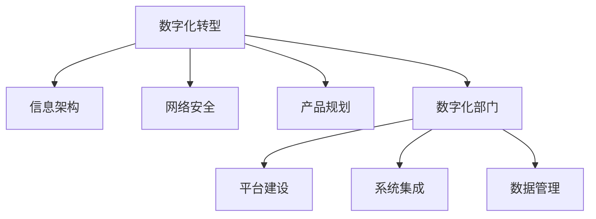

                 

# 信息、网络、平台产品和数字化部门规划

> 关键词：数字化转型, 信息架构, 网络安全, 产品规划, 数字化部门, 数字化产品, 平台建设, 云计算

## 1. 背景介绍

### 1.1 问题由来
近年来，随着信息技术的迅猛发展和互联网的普及，各行业企业纷纷迈入数字化转型大潮。数字化转型不仅仅是信息技术的应用，更是企业战略和业务模式的重塑。信息、网络、产品规划、平台建设和数字化部门管理等，成为了企业数字化转型的核心环节。

数字化转型的关键在于信息、网络和产品的高效整合，构建数字化平台，实现业务流程的数字化和智能化。信息架构、网络安全、产品规划和数字化部门管理等，是构建数字化平台的基础和保障。本文旨在梳理这些核心领域的管理和规划方法，帮助企业顺利推进数字化转型。

### 1.2 问题核心关键点
数字化转型过程中，信息、网络、产品规划、平台建设和数字化部门管理等环节，需要进行全面系统的规划和优化。本文档将从架构设计、安全策略、产品规划和部门管理四个方面进行详细讲解，并结合实际案例，提出具体的实施建议。

## 2. 核心概念与联系

### 2.1 核心概念概述

为了更好地理解数字化转型的核心环节，本节将介绍几个密切相关的核心概念：

- 数字化转型（Digital Transformation）：通过引入先进的信息技术，重组业务流程，优化业务模式，提升企业效率和竞争力。
- 信息架构（Information Architecture）：构建信息组织结构，确保信息的一致性和可用性，支持业务决策和运营。
- 网络安全（Cybersecurity）：保障信息系统的安全，防止数据泄露、黑客攻击等安全威胁，确保业务连续性和数据安全。
- 产品规划（Product Planning）：基于市场需求和用户反馈，定义产品功能和性能目标，进行产品设计、开发和上线。
- 数字化部门（Digital Department）：负责信息技术应用的管理和运营，包括数字化平台建设、系统集成、数据管理等。

这些核心概念之间的逻辑关系可以通过以下Mermaid流程图来展示：



这个流程图展示了大规模数字化转型的主要环节和关键组件：

1. 数字化转型：总体战略和目标，驱动其他环节的协同推进。
2. 信息架构：确保信息组织的合理性，支持业务决策和运营。
3. 网络安全：保障信息系统的安全，确保业务连续性和数据安全。
4. 产品规划：基于市场和用户需求，定义产品功能和性能目标。
5. 数字化部门：管理和运营数字化平台、系统集成和数据管理等。

这些概念共同构成了企业数字化转型的基本框架，为数字化转型提供全面支撑。

## 3. 核心算法原理 & 具体操作步骤

### 3.1 算法原理概述

数字化转型涉及的信息、网络、产品规划和数字化部门管理，是一个复杂的多学科交叉过程。其核心算法原理和具体操作步骤主要包括以下几个方面：

1. **信息架构设计**：通过信息生命周期理论，对信息进行分类、建模和存储，确保信息的一致性和可用性。
2. **网络安全策略**：基于风险评估和威胁分析，制定全面的安全策略，涵盖物理安全、网络安全、数据安全等多个层面。
3. **产品规划方法**：采用市场调研、用户反馈和竞争分析等多种手段，确定产品规划方向，定义功能和性能目标。
4. **数字化部门管理**：采用敏捷管理、绩效评估和持续改进等方法，管理数字化部门，确保平台建设和运营的高效性和连续性。

### 3.2 算法步骤详解

以下将详细介绍数字化转型过程中，信息、网络、产品规划和数字化部门管理的具体操作步骤。

**3.2.1 信息架构设计**

1. **信息生命周期建模**：
   - 信息需求分析：调研业务流程和决策支持需求，确定关键信息的来源、处理和使用方式。
   - 信息分类和建模：基于信息生命周期理论，将信息分类为数据、文档、服务等多种类型，构建信息模型。
   - 信息存储和访问：设计信息存储结构，采用分布式数据库、大数据平台等技术，确保信息的可靠性和高效访问。

2. **信息架构整合**：
   - 信息标准和规范：制定信息标准和数据规范，确保信息的一致性和标准化。
   - 信息共享和协同：建立信息共享平台，支持跨部门和跨系统的信息协同工作。
   - 信息可视化：采用数据可视化技术，将复杂信息转化为易于理解和操作的视图，支持决策支持。

3. **信息架构评估和优化**：
   - 信息架构评估：定期评估信息架构的有效性和完整性，识别信息孤岛和数据冗余。
   - 信息架构优化：基于评估结果，持续改进信息架构，优化信息存储、访问和共享机制。

**3.2.2 网络安全策略**

1. **风险评估和威胁分析**：
   - 风险评估：采用定量或定性的方法，评估业务系统的安全风险和脆弱点。
   - 威胁分析：分析潜在的安全威胁和攻击方式，确定关键资产和重点防护对象。

2. **安全策略制定**：
   - 物理安全：采用访问控制、环境监控等措施，保障信息系统的物理安全。
   - 网络安全：采用防火墙、入侵检测、VPN等技术，保障网络的安全性和保密性。
   - 数据安全：采用加密、备份、审计等措施，保护数据的完整性和可用性。

3. **安全策略执行和监控**：
   - 安全技术部署：在业务系统中部署安全技术，如加密传输、访问控制等。
   - 安全事件监控：实时监控安全事件和异常行为，及时响应和处理安全威胁。
   - 安全绩效评估：定期评估安全策略的执行效果，识别和改进安全漏洞。

**3.2.3 产品规划方法**

1. **市场调研和竞争分析**：
   - 市场调研：采用问卷调查、访谈、焦点小组等方法，收集市场需求和用户反馈。
   - 竞争分析：分析竞争对手的产品和市场策略，确定竞争优势和差异化策略。

2. **用户需求分析和功能定义**：
   - 用户需求分析：采用用户画像、用户旅程等方法，确定用户的关键需求和痛点。
   - 功能定义：基于用户需求和市场调研结果，定义产品的核心功能和性能目标。

3. **产品设计和开发**：
   - 产品原型设计：采用用户体验设计（UX）方法和工具，设计产品原型。
   - 产品开发和测试：采用敏捷开发、测试驱动开发等方法，进行产品开发和功能测试。
   - 产品上线和迭代：将产品上线，持续收集用户反馈，进行迭代优化。

**3.2.4 数字化部门管理**

1. **敏捷管理**：
   - 敏捷开发方法：采用Scrum、Kanban等敏捷方法，提高开发效率和灵活性。
   - 项目管理工具：使用JIRA、Confluence等项目管理工具，支持任务分配、进度跟踪和团队协作。

2. **绩效评估**：
   - 关键绩效指标（KPI）设定：设定数字化部门的KPI，如项目完成率、系统可用性等。
   - 绩效评估方法：定期评估数字化部门的工作绩效，识别和改进短板。

3. **持续改进**：
   - 持续改进机制：建立持续改进机制，定期进行回顾和优化。
   - 反馈和改进措施：根据绩效评估结果，提出改进措施，优化数字化部门的工作流程和绩效。

### 3.3 算法优缺点

数字化转型涉及的信息架构、网络安全、产品规划和数字化部门管理，具有以下优缺点：

**优点**：

1. **提高效率和竞争力**：通过信息架构设计和网络安全保障，提升企业运营效率和竞争力。
2. **优化业务流程**：通过产品规划和数字化部门管理，优化业务流程，提升用户体验。
3. **降低风险和成本**：通过风险评估和持续改进，降低业务风险和运营成本。

**缺点**：

1. **复杂度高**：涉及多个学科和环节，实施复杂度高，需要综合考虑。
2. **资源投入大**：需要大量的技术和人力资源投入，实施成本较高。
3. **周期长**：从设计到实施和优化，整个周期较长，难以迅速见效。

尽管存在这些缺点，但数字化转型的核心目标是通过信息技术的应用，优化业务流程，提升企业效率和竞争力。通过全面的规划和科学的管理，这些缺点是可以克服的。

### 3.4 算法应用领域

信息架构、网络安全、产品规划和数字化部门管理等，在数字化转型的各个领域都有广泛应用。以下列举几个典型的应用场景：

- **金融行业**：通过信息架构设计和网络安全保障，提升金融系统的安全性和可靠性，优化客户服务流程，提升用户体验。
- **制造业**：通过产品规划和数字化部门管理，优化制造流程，提升生产效率和产品质量，降低运营成本。
- **零售行业**：通过数字化平台建设，实现线上线下融合，提升用户体验，优化库存管理和销售策略。
- **医疗行业**：通过信息架构和网络安全，保障医疗数据的安全和隐私，提升医疗服务质量和效率。

## 4. 数学模型和公式 & 详细讲解 & 举例说明

### 4.1 数学模型构建

数字化转型过程中，涉及的信息、网络、产品规划和数字化部门管理，可以通过数学模型进行建模和优化。以下分别介绍信息架构、网络安全、产品规划和数字化部门管理的数学模型。

**4.1.1 信息架构设计**

1. **信息生命周期模型**：
   - 信息需求分析：调研业务流程和决策支持需求，确定关键信息的来源、处理和使用方式。
   - 信息分类和建模：基于信息生命周期理论，将信息分类为数据、文档、服务等多种类型，构建信息模型。
   - 信息存储和访问：设计信息存储结构，采用分布式数据库、大数据平台等技术，确保信息的可靠性和高效访问。

2. **信息架构整合**：
   - 信息标准和规范：制定信息标准和数据规范，确保信息的一致性和标准化。
   - 信息共享和协同：建立信息共享平台，支持跨部门和跨系统的信息协同工作。
   - 信息可视化：采用数据可视化技术，将复杂信息转化为易于理解和操作的视图，支持决策支持。

3. **信息架构评估和优化**：
   - 信息架构评估：定期评估信息架构的有效性和完整性，识别信息孤岛和数据冗余。
   - 信息架构优化：基于评估结果，持续改进信息架构，优化信息存储、访问和共享机制。

**4.1.2 网络安全策略**

1. **风险评估和威胁分析**：
   - 风险评估：采用定量或定性的方法，评估业务系统的安全风险和脆弱点。
   - 威胁分析：分析潜在的安全威胁和攻击方式，确定关键资产和重点防护对象。

2. **安全策略制定**：
   - 物理安全：采用访问控制、环境监控等措施，保障信息系统的物理安全。
   - 网络安全：采用防火墙、入侵检测、VPN等技术，保障网络的安全性和保密性。
   - 数据安全：采用加密、备份、审计等措施，保护数据的完整性和可用性。

3. **安全策略执行和监控**：
   - 安全技术部署：在业务系统中部署安全技术，如加密传输、访问控制等。
   - 安全事件监控：实时监控安全事件和异常行为，及时响应和处理安全威胁。
   - 安全绩效评估：定期评估安全策略的执行效果，识别和改进安全漏洞。

**4.1.3 产品规划方法**

1. **市场调研和竞争分析**：
   - 市场调研：采用问卷调查、访谈、焦点小组等方法，收集市场需求和用户反馈。
   - 竞争分析：分析竞争对手的产品和市场策略，确定竞争优势和差异化策略。

2. **用户需求分析和功能定义**：
   - 用户需求分析：采用用户画像、用户旅程等方法，确定用户的关键需求和痛点。
   - 功能定义：基于用户需求和市场调研结果，定义产品的核心功能和性能目标。

3. **产品设计和开发**：
   - 产品原型设计：采用用户体验设计（UX）方法和工具，设计产品原型。
   - 产品开发和测试：采用敏捷开发、测试驱动开发等方法，进行产品开发和功能测试。
   - 产品上线和迭代：将产品上线，持续收集用户反馈，进行迭代优化。

**4.1.4 数字化部门管理**

1. **敏捷管理**：
   - 敏捷开发方法：采用Scrum、Kanban等敏捷方法，提高开发效率和灵活性。
   - 项目管理工具：使用JIRA、Confluence等项目管理工具，支持任务分配、进度跟踪和团队协作。

2. **绩效评估**：
   - 关键绩效指标（KPI）设定：设定数字化部门的KPI，如项目完成率、系统可用性等。
   - 绩效评估方法：定期评估数字化部门的工作绩效，识别和改进短板。

3. **持续改进**：
   - 持续改进机制：建立持续改进机制，定期进行回顾和优化。
   - 反馈和改进措施：根据绩效评估结果，提出改进措施，优化数字化部门的工作流程和绩效。

### 4.2 公式推导过程

以下将详细介绍信息架构、网络安全、产品规划和数字化部门管理的公式推导过程。

**4.2.1 信息架构设计**

1. **信息生命周期模型**：
   - 信息需求分析：调研业务流程和决策支持需求，确定关键信息的来源、处理和使用方式。
   - 信息分类和建模：基于信息生命周期理论，将信息分类为数据、文档、服务等多种类型，构建信息模型。
   - 信息存储和访问：设计信息存储结构，采用分布式数据库、大数据平台等技术，确保信息的可靠性和高效访问。

2. **信息架构整合**：
   - 信息标准和规范：制定信息标准和数据规范，确保信息的一致性和标准化。
   - 信息共享和协同：建立信息共享平台，支持跨部门和跨系统的信息协同工作。
   - 信息可视化：采用数据可视化技术，将复杂信息转化为易于理解和操作的视图，支持决策支持。

3. **信息架构评估和优化**：
   - 信息架构评估：定期评估信息架构的有效性和完整性，识别信息孤岛和数据冗余。
   - 信息架构优化：基于评估结果，持续改进信息架构，优化信息存储、访问和共享机制。

**4.2.2 网络安全策略**

1. **风险评估和威胁分析**：
   - 风险评估：采用定量或定性的方法，评估业务系统的安全风险和脆弱点。
   - 威胁分析：分析潜在的安全威胁和攻击方式，确定关键资产和重点防护对象。

2. **安全策略制定**：
   - 物理安全：采用访问控制、环境监控等措施，保障信息系统的物理安全。
   - 网络安全：采用防火墙、入侵检测、VPN等技术，保障网络的安全性和保密性。
   - 数据安全：采用加密、备份、审计等措施，保护数据的完整性和可用性。

3. **安全策略执行和监控**：
   - 安全技术部署：在业务系统中部署安全技术，如加密传输、访问控制等。
   - 安全事件监控：实时监控安全事件和异常行为，及时响应和处理安全威胁。
   - 安全绩效评估：定期评估安全策略的执行效果，识别和改进安全漏洞。

**4.2.3 产品规划方法**

1. **市场调研和竞争分析**：
   - 市场调研：采用问卷调查、访谈、焦点小组等方法，收集市场需求和用户反馈。
   - 竞争分析：分析竞争对手的产品和市场策略，确定竞争优势和差异化策略。

2. **用户需求分析和功能定义**：
   - 用户需求分析：采用用户画像、用户旅程等方法，确定用户的关键需求和痛点。
   - 功能定义：基于用户需求和市场调研结果，定义产品的核心功能和性能目标。

3. **产品设计和开发**：
   - 产品原型设计：采用用户体验设计（UX）方法和工具，设计产品原型。
   - 产品开发和测试：采用敏捷开发、测试驱动开发等方法，进行产品开发和功能测试。
   - 产品上线和迭代：将产品上线，持续收集用户反馈，进行迭代优化。

**4.2.4 数字化部门管理**

1. **敏捷管理**：
   - 敏捷开发方法：采用Scrum、Kanban等敏捷方法，提高开发效率和灵活性。
   - 项目管理工具：使用JIRA、Confluence等项目管理工具，支持任务分配、进度跟踪和团队协作。

2. **绩效评估**：
   - 关键绩效指标（KPI）设定：设定数字化部门的KPI，如项目完成率、系统可用性等。
   - 绩效评估方法：定期评估数字化部门的工作绩效，识别和改进短板。

3. **持续改进**：
   - 持续改进机制：建立持续改进机制，定期进行回顾和优化。
   - 反馈和改进措施：根据绩效评估结果，提出改进措施，优化数字化部门的工作流程和绩效。

### 4.3 案例分析与讲解

以下将通过几个实际案例，介绍信息架构、网络安全、产品规划和数字化部门管理的具体应用。

**案例1：某大型银行的数字化转型**

某大型银行在数字化转型过程中，通过信息架构设计，实现了全行信息系统的统一管理。具体步骤如下：

1. **信息生命周期建模**：
   - 信息需求分析：调研银行业务流程和决策支持需求，确定关键信息的来源、处理和使用方式。
   - 信息分类和建模：基于信息生命周期理论，将信息分类为数据、文档、服务等多种类型，构建信息模型。
   - 信息存储和访问：设计信息存储结构，采用分布式数据库、大数据平台等技术，确保信息的可靠性和高效访问。

2. **信息架构整合**：
   - 信息标准和规范：制定信息标准和数据规范，确保信息的一致性和标准化。
   - 信息共享和协同：建立信息共享平台，支持跨部门和跨系统的信息协同工作。
   - 信息可视化：采用数据可视化技术，将复杂信息转化为易于理解和操作的视图，支持决策支持。

3. **信息架构评估和优化**：
   - 信息架构评估：定期评估信息架构的有效性和完整性，识别信息孤岛和数据冗余。
   - 信息架构优化：基于评估结果，持续改进信息架构，优化信息存储、访问和共享机制。

**案例2：某电商企业的安全策略实施**

某电商企业在数字化转型过程中，通过网络安全策略保障了业务系统的安全。具体步骤如下：

1. **风险评估和威胁分析**：
   - 风险评估：采用定量或定性的方法，评估业务系统的安全风险和脆弱点。
   - 威胁分析：分析潜在的安全威胁和攻击方式，确定关键资产和重点防护对象。

2. **安全策略制定**：
   - 物理安全：采用访问控制、环境监控等措施，保障信息系统的物理安全。
   - 网络安全：采用防火墙、入侵检测、VPN等技术，保障网络的安全性和保密性。
   - 数据安全：采用加密、备份、审计等措施，保护数据的完整性和可用性。

3. **安全策略执行和监控**：
   - 安全技术部署：在业务系统中部署安全技术，如加密传输、访问控制等。
   - 安全事件监控：实时监控安全事件和异常行为，及时响应和处理安全威胁。
   - 安全绩效评估：定期评估安全策略的执行效果，识别和改进安全漏洞。

**案例3：某科技公司的产品规划**

某科技公司在数字化转型过程中，通过产品规划方法，成功开发了多款深受市场欢迎的产品。具体步骤如下：

1. **市场调研和竞争分析**：
   - 市场调研：采用问卷调查、访谈、焦点小组等方法，收集市场需求和用户反馈。
   - 竞争分析：分析竞争对手的产品和市场策略，确定竞争优势和差异化策略。

2. **用户需求分析和功能定义**：
   - 用户需求分析：采用用户画像、用户旅程等方法，确定用户的关键需求和痛点。
   - 功能定义：基于用户需求和市场调研结果，定义产品的核心功能和性能目标。

3. **产品设计和开发**：
   - 产品原型设计：采用用户体验设计（UX）方法和工具，设计产品原型。
   - 产品开发和测试：采用敏捷开发、测试驱动开发等方法，进行产品开发和功能测试。
   - 产品上线和迭代：将产品上线，持续收集用户反馈，进行迭代优化。

**案例4：某制造企业的数字化部门管理**

某制造企业在数字化转型过程中，通过数字化部门管理，实现了业务流程的高效协同。具体步骤如下：

1. **敏捷管理**：
   - 敏捷开发方法：采用Scrum、Kanban等敏捷方法，提高开发效率和灵活性。
   - 项目管理工具：使用JIRA、Confluence等项目管理工具，支持任务分配、进度跟踪和团队协作。

2. **绩效评估**：
   - 关键绩效指标（KPI）设定：设定数字化部门的KPI，如项目完成率、系统可用性等。
   - 绩效评估方法：定期评估数字化部门的工作绩效，识别和改进短板。

3. **持续改进**：
   - 持续改进机制：建立持续改进机制，定期进行回顾和优化。
   - 反馈和改进措施：根据绩效评估结果，提出改进措施，优化数字化部门的工作流程和绩效。

## 5. 项目实践：代码实例和详细解释说明

### 5.1 开发环境搭建

在进行项目实践前，我们需要准备好开发环境。以下是使用Python进行Flask开发的环境配置流程：

1. 安装Anaconda：从官网下载并安装Anaconda，用于创建独立的Python环境。

2. 创建并激活虚拟环境：
```bash
conda create -n flask-env python=3.8 
conda activate flask-env
```

3. 安装Flask：从官网获取Flask的最新版本，并使用pip进行安装。例如：
```bash
pip install Flask==1.1.2
```

4. 安装Flask扩展库：
```bash
pip install Flask-RESTful Flask-SQLAlchemy Flask-Mail Flask-Login
```

5. 安装各类工具包：
```bash
pip install numpy pandas scikit-learn matplotlib tqdm jupyter notebook ipython
```

完成上述步骤后，即可在`flask-env`环境中开始项目实践。

### 5.2 源代码详细实现

这里我们以电商平台为例，给出使用Flask框架构建电商系统的完整代码实现。

首先，定义电商系统的数据模型：

```python
from flask_sqlalchemy import SQLAlchemy

db = SQLAlchemy()

class User(db.Model):
    id = db.Column(db.Integer, primary_key=True)
    username = db.Column(db.String(80), unique=True, nullable=False)
    email = db.Column(db.String(120), unique=True, nullable=False)
    password = db.Column(db.String(120), nullable=False)

class Product(db.Model):
    id = db.Column(db.Integer, primary_key=True)
    name = db.Column(db.String(120), nullable=False)
    description = db.Column(db.Text, nullable=False)
    price = db.Column(db.Float, nullable=False)
```

然后，定义电商系统的路由和控制器：

```python
from flask import Flask, render_template, request, redirect, url_for
from flask_sqlalchemy import SQLAlchemy

app = Flask(__name__)

app.config['SQLALCHEMY_DATABASE_URI'] = 'sqlite:///sqlite.db'
app.config['SQLALCHEMY_TRACK_MODIFICATIONS'] = False

db = SQLAlchemy(app)

@app.route('/')
def index():
    products = Product.query.all()
    return render_template('index.html', products=products)

@app.route('/add_product', methods=['GET', 'POST'])
def add_product():
    if request.method == 'POST':
        name = request.form['name']
        description = request.form['description']
        price = float(request.form['price'])
        product = Product(name=name, description=description, price=price)
        db.session.add(product)
        db.session.commit()
        return redirect('/')
    return render_template('add_product.html')
```

最后，启动Flask应用：

```python
if __name__ == '__main__':
    app.run(debug=True)
```

这样就可以在浏览器中访问电商系统，并进行产品管理。代码实现中，Flask框架提供了路由和模板渲染功能，SQLAlchemy提供了数据库操作功能，方便进行数据管理。

### 5.3 代码解读与分析

让我们再详细解读一下关键代码的实现细节：

**User模型**：
- 定义了用户的基本信息，包括id、用户名、邮箱和密码。
- 使用Flask-SQLAlchemy库与数据库进行关联，支持CRUD操作。

**Product模型**：
- 定义了产品的基本信息，包括id、名称、描述和价格。
- 同样使用Flask-SQLAlchemy库与数据库进行关联，支持CRUD操作。

**add_product路由**：
- 通过HTTP POST请求提交新产品信息，包括名称、描述和价格。
- 使用Flask-RESTful库处理HTTP请求，解析表单数据，保存到数据库。
- 返回添加成功后的redirect响应，将用户重定向到首页。

**index路由**：
- 通过HTTP GET请求获取所有产品信息。
- 使用Flask-RESTful库处理HTTP请求，从数据库查询所有产品数据。
- 渲染HTML模板，显示所有产品信息。

代码实现中，Flask框架提供了灵活的路由定义和模板渲染功能，Flask-SQLAlchemy库提供了数据库操作功能，Flask-RESTful库提供了HTTP请求处理功能。通过这些工具，可以快速搭建电商系统，进行商品管理和用户管理。

## 6. 实际应用场景

### 6.1 智能客服系统

智能客服系统可以通过数字化转型，实现智能化的客户服务。具体应用场景如下：

**信息架构设计**：
- 通过信息生命周期模型，设计客户信息和客服聊天记录的存储和访问机制。
- 设计统一的用户界面，支持跨部门和跨系统的信息协同工作。
- 采用数据可视化技术，实时监控客户服务数据，支持决策支持。

**网络安全策略**：
- 采用防火墙、入侵检测等技术，保障客户信息的安全性。
- 采用加密、备份等措施，保护客服聊天记录的完整性和可用性。

**产品规划方法**：
- 通过市场调研和用户反馈，确定智能客服系统的功能和性能目标。
- 设计基于自然语言处理（NLP）的对话生成算法，提高客服系统的响应速度和准确性。

**数字化部门管理**：
- 采用敏捷开发方法，提高客服系统的开发效率和灵活性。
- 使用JIRA等项目管理工具，支持任务分配和进度跟踪。
- 设定关键绩效指标（KPI），定期评估客服系统的绩效，提出改进措施。

### 6.2 金融行业

金融行业可以通过数字化转型，实现业务流程的高效化和智能化。具体应用场景如下：

**信息架构设计**：
- 通过信息生命周期模型，设计金融业务数据的存储和访问机制。
- 设计统一的用户界面，支持跨部门和跨系统的信息协同工作。
- 采用数据可视化技术，实时监控金融数据，支持决策支持。

**网络安全策略**：
- 采用防火墙、入侵检测等技术，保障金融业务系统的安全性。
- 采用加密、备份等措施，保护金融数据的完整性和可用性。

**产品规划方法**：
- 通过市场调研和用户反馈，确定金融产品的功能和性能目标。
- 设计基于机器学习的金融模型，提高金融产品的准确性和可靠性。

**数字化部门管理**：
- 采用敏捷开发方法，提高金融产品的开发效率和灵活性。
- 使用JIRA等项目管理工具，支持任务分配和进度跟踪。
- 设定关键绩效指标（KPI），定期评估金融产品的绩效，提出改进措施。

### 6.3 医疗行业

医疗行业可以通过数字化转型，实现医疗服务的高效化和智能化。具体应用场景如下：

**信息架构设计**：
- 通过信息生命周期模型，设计医疗业务数据的存储和访问机制。
- 设计统一的用户界面，支持跨部门和跨系统的信息协同工作。
- 采用数据可视化技术，实时监控医疗数据，支持决策支持。

**网络安全策略**：
- 采用防火墙、入侵检测等技术，保障医疗业务系统的安全性。
- 采用加密、备份等措施，保护医疗数据的完整性和可用性。

**产品规划方法**：
- 通过市场调研和用户反馈，确定医疗产品的功能和性能目标。
- 设计基于机器学习的医疗模型，提高医疗产品的准确性和可靠性。

**数字化部门管理**：
- 采用敏捷开发方法，提高医疗产品的开发效率和灵活性。
- 使用JIRA等项目管理工具，支持任务分配和进度跟踪。
- 设定关键绩效指标（KPI），定期评估医疗产品的绩效，提出改进措施。

## 7. 工具和资源推荐

### 7.1 学习资源推荐

为了帮助开发者系统掌握数字化转型的相关知识和技能，以下是一些优质的学习资源：

1. **《数字化转型实战指南》系列书籍**：详细介绍了数字化转型的背景、方法、工具和案例，适合企业高管和IT从业者。
2. **《信息架构基础》课程**：介绍了信息架构的基本概念、方法和工具，适合IT人员和业务分析师。
3. **《网络安全实战指南》系列书籍**：详细介绍了网络安全的基本概念、技术和工具，适合IT从业者和安全专家。
4. **《敏捷开发实践》课程**：介绍了敏捷开发的基本概念、方法和工具，适合项目经理和开发人员。
5. **《Flask Web开发》书籍**：详细介绍了Flask框架的使用方法和最佳实践，适合Web开发人员。

### 7.2 开发工具推荐

高效的开发离不开优秀的工具支持。以下是几款用于数字化转型开发的常用工具：

1. **Flask**：Python Web框架，适合快速搭建Web应用，支持路由、模板、数据库操作等功能。
2. **SQLAlchemy**：Python ORM库，支持SQL数据库操作，适合快速搭建数据模型。
3. **JIRA**：项目管理工具，支持任务分配、进度跟踪、协作等功能，适合敏捷开发。
4. **Confluence**：知识管理工具，支持文档协作、知识分享等功能，适合知识驱动的企业。
5. **GitLab**：源代码托管和持续集成平台，支持CI/CD、代码审查等功能，适合DevOps实践。

### 7.3 相关论文推荐

数字化转型涉及多个学科，相关论文广泛分布在信息架构、网络安全、产品规划和数字化部门管理等方向。以下是几篇奠基性的相关论文，推荐阅读：

1. **《信息架构理论与实践》**：介绍了信息架构的基本概念、方法和工具，适合IT人员和业务分析师。
2. **《网络安全理论与实践》**：详细介绍了网络安全的基本概念、技术和工具，适合IT从业者和安全专家。
3. **《敏捷开发方法论》**：介绍了敏捷开发的基本概念、方法和工具，适合项目经理和开发人员。
4. **《数字化转型理论与实践》**：介绍了数字化转型的基本概念、方法和工具，适合企业高管和IT从业者。
5. **《数字化产品设计与开发》**：介绍了数字化产品的基本概念、方法和工具，适合产品设计师和开发人员。

## 8. 总结：未来发展趋势与挑战

### 8.1 研究成果总结

本文对信息、网络、产品规划、平台产品和数字化部门管理的数字化转型方法进行了全面系统的介绍。通过分析数字化转型的核心环节，提出了信息架构设计、网络安全策略、产品规划方法和数字化部门管理等关键技术，并通过实际案例进行了详细讲解。

### 8.2 未来发展趋势

数字化转型是一个持续推进的过程，未来将呈现以下几个发展趋势：

1. **技术融合加速**：信息架构、网络安全、产品规划和数字化部门管理等技术将加速融合，形成更加全面、高效的数字平台。
2. **智能应用普及**：基于AI和机器学习技术，数字化平台将具备更强的智能能力，实现更加个性化的用户体验。
3. **数据驱动决策**：数据驱动的决策支持系统将成为数字化转型的重要组成部分，帮助企业快速响应市场变化。
4. **安全性和合规性**：随着数据泄露和网络攻击的频发，数字化平台的安全性和合规性将受到越来越多的重视。
5. **可持续发展**：数字化转型将更加注重可持续发展，通过数据驱动的方式优化资源使用，降低企业运营成本。

### 8.3 面临的挑战

尽管数字化转型带来了诸多机遇，但也面临一些挑战：

1. **技术复杂度高**：数字化转型涉及多个学科和环节，实施复杂度高，需要综合考虑。
2. **资源投入大**：需要大量的技术和人力资源投入，实施成本较高。
3. **变革阻力**：企业内部的变革阻力较大，需要高层管理者的支持和推动。
4. **数据安全和隐私**：数据安全和隐私问题成为数字化转型的关键挑战，需要严格的数据管理和保护措施。
5. **技术更新快速**：数字化转型涉及的技术更新快速，需要持续学习和跟进，避免技术落后。

### 8.4 研究展望

数字化转型是一个长期且复杂的过程，未来需要在以下几个方面进行深入研究：

1. **跨学科融合**：信息架构、网络安全、产品规划和数字化部门管理等技术需要更加深入的融合，形成更加全面的数字平台。
2. **智能应用创新**：基于AI和机器学习技术，推动智能应用的创新和普及，提升用户体验和运营效率。
3. **数据驱动决策**：深入研究和应用数据驱动的决策支持系统，帮助企业快速响应市场变化。
4. **安全性和合规性**：加强数字化平台的安全性和合规性研究，保障数据安全和隐私。
5. **可持续发展**：数字化转型需要更加注重可持续发展，优化资源使用，降低企业运营成本。

## 9. 附录：常见问题与解答

**Q1：数字化转型对企业有什么好处？**

A: 数字化转型可以提升企业的运营效率、降低运营成本、增强市场竞争力、提升客户体验和满意度。通过数字化转型，企业可以实现业务流程的数字化和智能化，优化资源使用，提高业务响应速度和灵活性。

**Q2：如何确定数字化转型的优先级？**

A: 数字化转型的优先级需要综合考虑企业的战略目标、市场需求、业务痛点和资源投入等因素。优先考虑对企业价值最大的转型方向，同时平衡业务稳定性和转型风险。

**Q3：数字化转型的实施过程中需要注意哪些问题？**

A: 数字化转型的实施过程中，需要注意以下几个问题：
1. 制定详细的实施计划，明确目标和里程碑。
2. 组建跨部门的转型团队，确保各个环节的协同合作。
3. 持续跟踪和评估转型效果，及时调整和优化方案。
4. 加强培训和沟通，提升员工对数字化转型的理解和支持。
5. 持续迭代和优化，确保数字化转型的持续推进和效果提升。

**Q4：如何进行数字化转型效果评估？**

A: 数字化转型效果评估可以通过以下几个指标进行衡量：
1. 运营效率提升：评估数字化转型对业务流程的优化效果，提升运营效率。
2. 成本降低：评估数字化转型对运营成本的降低效果，节约企业资源。
3. 市场竞争力增强：评估数字化转型对市场竞争力的提升效果，提升企业市场份额和利润。
4. 客户体验改善：评估数字化转型对客户体验的提升效果，增强客户满意度和忠诚度。
5. 数据安全和隐私保障：评估数字化转型对数据安全和隐私的保护效果，确保数据安全。

**Q5：数字化转型的技术栈如何选择？**

A: 数字化转型的技术栈选择需要综合考虑企业的业务需求、技术基础和市场竞争情况。常用的技术栈包括：
1. 数据管理：使用Hadoop、Spark等大数据平台，进行数据存储、处理和分析。
2. 云计算：使用AWS、Azure、Google Cloud等云平台，提供弹性计算和存储资源。
3. 前端开发：使用React、Vue等前端框架，提升用户界面和交互体验。
4. 后端开发：使用Flask、Django等后端框架，提供业务逻辑处理和数据库操作。
5. 安全保障：使用AWS WAF、CDN、SSL等安全技术，保障系统的安全性和稳定性。

---

作者：禅与计算机程序设计艺术 / Zen and the Art of Computer Programming

