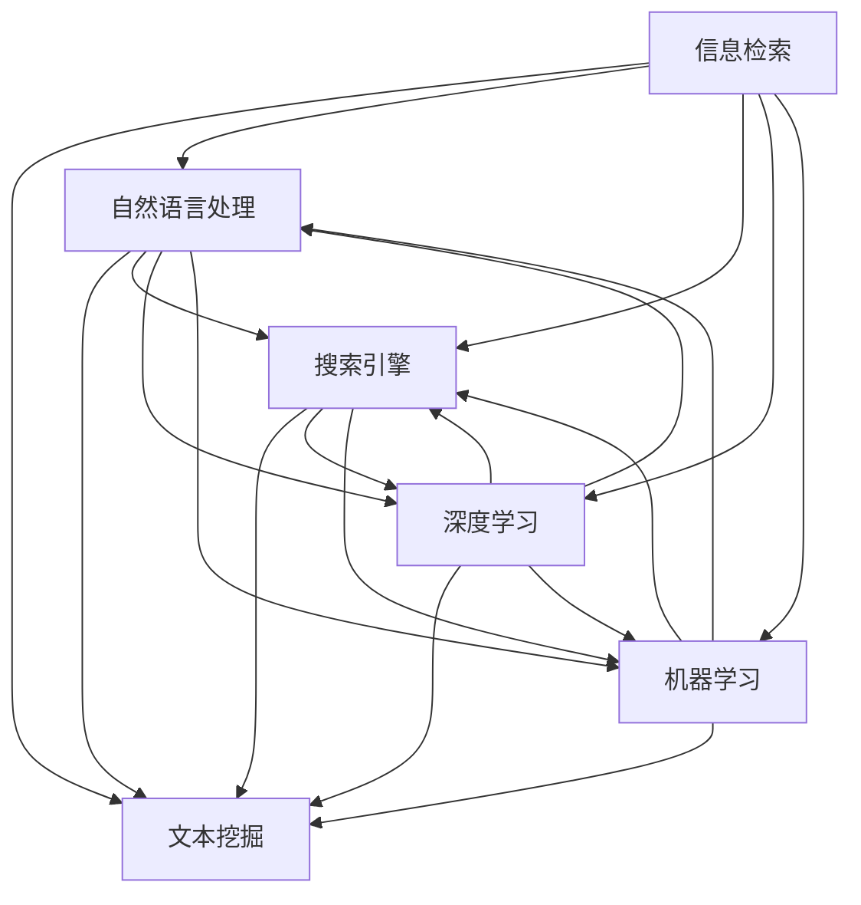

                 

# 信息过载与信息搜索策略与技术：在庞大的信息海洋中找到所需信息

> 关键词：信息过载,信息检索,信息搜索,搜索引擎,文本挖掘,自然语言处理,NLP,深度学习,机器学习,数据挖掘

## 1. 背景介绍

### 1.1 问题由来
随着互联网的普及和数字技术的快速发展，信息获取变得越来越容易，人们每天接触的信息量呈指数级增长。根据国际数据公司(IDC)的统计，2025年全球数字信息量将超过200ZB（1ZB = 1,024EB），其中文本信息占据了大部分。在这样的背景下，如何有效地管理和利用海量信息成为了一个亟待解决的重大问题。

信息过载（Information Overload）指的是人们在面对海量的信息时，由于信息量太大、密度太高而无法有效处理和吸收，从而导致了信息处理效率下降、注意力分散、决策困难等问题。据统计，每天人们需要花费大量时间在各种搜索引擎和应用中寻找信息，但依然很难找到真正有用的信息。

为了解决这一问题，研究人员提出了各种各样的信息搜索策略与技术，旨在帮助用户在海量的信息海洋中找到所需的信息。这些策略与技术包括搜索引擎、文本挖掘、自然语言处理、深度学习和机器学习等。本文将详细介绍这些策略与技术的核心概念、原理和应用，帮助读者更好地理解和掌握信息搜索的方法与技巧。

### 1.2 问题核心关键点
信息搜索的核心在于如何高效地从海量的数据中提取、组织和展示有用的信息。其中，核心关键点包括：

- **高效的信息检索算法**：如何从海量数据中快速检索出相关性高的信息。
- **自然语言处理技术**：如何理解和处理自然语言文本，以便进行搜索和匹配。
- **数据挖掘与分析**：如何从数据中挖掘出有价值的模式和规律，以辅助信息搜索。
- **机器学习和深度学习**：如何通过学习数据特征，提升信息检索的准确性和泛化能力。

这些关键点共同构成了信息搜索策略与技术的核心框架，使得用户能够在庞大的信息海洋中找到所需的信息。

## 2. 核心概念与联系

### 2.1 核心概念概述

为了更好地理解信息搜索策略与技术，本节将介绍几个密切相关的核心概念：

- **信息检索（Information Retrieval, IR）**：指通过特定算法和模型，从大量文本数据中检索出与查询相关的文档或信息的过程。常见的信息检索算法包括布尔检索、向量空间模型、隐语义模型等。

- **文本挖掘（Text Mining）**：指从文本数据中自动发现模式、提取特征和知识的过程。文本挖掘技术包括文本分类、聚类、情感分析等，可以帮助用户理解和利用文本数据。

- **自然语言处理（Natural Language Processing, NLP）**：指使计算机能够理解和生成自然语言的过程。NLP技术包括分词、命名实体识别、词性标注、语义分析等，是信息检索和文本挖掘的重要基础。

- **搜索引擎（Search Engine）**：指一种用于搜索信息的系统或软件，能够从大量文本数据中快速检索出相关文档或信息。常见的搜索引擎包括Google、百度等。

- **深度学习（Deep Learning）**：指使用多层神经网络模型，通过学习数据特征，提升信息检索和文本挖掘的准确性和泛化能力。

- **机器学习（Machine Learning）**：指通过数据训练模型，使模型能够自动进行分类、预测和决策等任务。机器学习技术在信息搜索和文本挖掘中广泛应用。

这些核心概念之间的逻辑关系可以通过以下Mermaid流程图来展示：



这个流程图展示了一组核心概念及其之间的关系：

1. 信息检索和文本挖掘通常需要自然语言处理技术的支持。
2. 深度学习和机器学习技术可以提升信息检索和文本挖掘的效果。
3. 搜索引擎将信息检索和文本挖掘的结果进行展示和检索。

这些概念共同构成了信息搜索策略与技术的核心框架，使得信息搜索能够高效、准确地进行。

## 3. 核心算法原理 & 具体操作步骤
### 3.1 算法原理概述

信息搜索的算法原理主要包括信息检索、文本挖掘和自然语言处理等方面。下面将分别介绍这些方面的核心算法原理。

### 3.2 算法步骤详解

#### 3.2.1 信息检索算法

信息检索算法主要包括布尔检索、向量空间模型和隐语义模型等。下面以向量空间模型为例，介绍信息检索的基本步骤。

**Step 1: 预处理文本数据**
- 对文本数据进行分词、去停用词、词干化等处理，将其转换为向量表示。

**Step 2: 构建索引**
- 将所有文本的向量表示存储在索引数据库中，以便快速检索。

**Step 3: 检索相关文档**
- 用户输入查询文本，将其转换为向量表示。
- 在索引数据库中检索与查询向量最相似的文档，返回相关文档列表。

**Step 4: 排序和展示**
- 对检索到的文档按照相关性进行排序，展示给用户。

#### 3.2.2 文本挖掘算法

文本挖掘算法主要包括文本分类、聚类、情感分析等。以文本分类为例，介绍其基本步骤。

**Step 1: 数据预处理**
- 对文本数据进行清洗、分词、去停用词等处理。

**Step 2: 特征提取**
- 从处理后的文本中提取特征，如词频、TF-IDF等。

**Step 3: 模型训练**
- 使用机器学习或深度学习模型对特征进行训练，得到文本分类器。

**Step 4: 预测和评估**
- 使用分类器对新的文本进行分类，评估分类器的性能。

#### 3.2.3 自然语言处理算法

自然语言处理算法主要包括分词、命名实体识别、词性标注、语义分析等。以命名实体识别为例，介绍其基本步骤。

**Step 1: 数据预处理**
- 对文本数据进行清洗、分词等处理。

**Step 2: 标注实体**
- 使用机器学习或深度学习模型对文本中的实体进行标注，如人名、地名、组织名等。

**Step 3: 模型训练**
- 使用标注好的数据对模型进行训练，优化模型参数。

**Step 4: 预测和评估**
- 使用训练好的模型对新的文本进行实体识别，评估模型的性能。

### 3.3 算法优缺点

信息搜索策略与技术的优点包括：

- **高效性**：通过算法和模型，能够快速从海量数据中检索出相关性高的信息。
- **准确性**：使用机器学习和深度学习技术，可以提升信息检索和文本挖掘的准确性和泛化能力。
- **灵活性**：可以处理多种类型的数据，如文本、图像、语音等。
- **可扩展性**：可以处理大规模的数据集，适应大规模信息搜索需求。

但这些算法也存在一些缺点：

- **计算复杂度高**：特别是深度学习和机器学习模型，需要大量的计算资源和训练数据。
- **结果解释性不足**：对于复杂的信息检索和文本挖掘结果，很难解释其背后的逻辑和原因。
- **数据依赖性强**：算法的性能很大程度上依赖于数据的质量和数量，难以处理噪声数据和低质量数据。

### 3.4 算法应用领域

信息搜索策略与技术在多个领域得到了广泛应用，例如：

- **搜索引擎**：如Google、百度等，通过信息检索技术快速检索出相关网页和信息。
- **新闻推荐系统**：如今日头条、腾讯新闻等，通过文本挖掘和自然语言处理技术为用户推荐相关新闻。
- **社交网络**：如微博、微信等，通过信息检索和自然语言处理技术进行话题分析和用户推荐。
- **智能客服**：如阿里巴巴、腾讯等，通过信息检索和自然语言处理技术提供智能客服服务。
- **电子商务**：如亚马逊、淘宝等，通过信息检索和文本挖掘技术提供商品推荐和搜索服务。

## 4. 数学模型和公式 & 详细讲解 & 举例说明

### 4.1 数学模型构建

在本节中，我们将使用数学语言对信息搜索策略与技术进行更加严格的刻画。

#### 4.1.1 向量空间模型

向量空间模型（Vector Space Model, VSM）是信息检索中常用的模型之一。其基本思想是将文本转换为向量，使用向量间的余弦相似度计算文本之间的相关性。

设文本集合为 $T = \{t_1, t_2, ..., t_N\}$，每个文本 $t_i$ 可以表示为一个 $d$ 维向量 $x_i = (x_{i1}, x_{i2}, ..., x_{id})$，其中 $d$ 为词汇表大小。对于每个词汇 $w_j$，设其在文本 $t_i$ 中出现的频率为 $f_{ij}$，则文本 $t_i$ 的向量表示为：

$$
x_i = \sum_{j=1}^d f_{ij} v_j
$$

其中 $v_j = (v_{j1}, v_{j2}, ..., v_{jd})$ 为词汇 $w_j$ 的向量表示，通常使用 TF-IDF 等权重进行表示。

设查询文本为 $q = (q_1, q_2, ..., q_m)$，其向量表示为 $q = \sum_{j=1}^m f_{ij} v_j$。计算查询文本与文本 $t_i$ 的余弦相似度：

$$
\cos\theta = \frac{x_i \cdot q}{\|x_i\| \cdot \|q\|}
$$

其中 $\cdot$ 表示向量点乘，$\|.\|$ 表示向量范数。

#### 4.1.2 隐语义模型

隐语义模型（Latent Semantic Indexing, LSI）是一种基于矩阵分解的文本挖掘模型。其基本思想是将文本与词汇之间的关系表示为矩阵，通过矩阵分解得到低维隐含语义。

设文本矩阵为 $X$，词汇矩阵为 $W$，则文本 $t_i$ 的向量表示可以表示为：

$$
x_i = W D_i
$$

其中 $D_i = (d_{i1}, d_{i2}, ..., d_{id})$ 为文本 $t_i$ 的隐含语义向量，$W$ 为词汇矩阵，$D_i$ 为文本 $t_i$ 对应的隐含语义矩阵。

使用奇异值分解（SVD）对矩阵 $X$ 进行分解，得到低秩矩阵 $X'$，表示为：

$$
X' = U S V^T
$$

其中 $U$ 和 $V$ 分别为左右奇异向量矩阵，$S$ 为奇异值矩阵。

### 4.2 公式推导过程

#### 4.2.1 向量空间模型推导

设文本 $t_i$ 和 $t_j$ 的向量表示分别为 $x_i$ 和 $x_j$，查询文本的向量表示为 $q$。则文本 $t_i$ 和 $t_j$ 之间的余弦相似度为：

$$
\cos\theta = \frac{x_i \cdot x_j}{\|x_i\| \cdot \|x_j\|}
$$

其中 $\cdot$ 表示向量点乘，$\|.\|$ 表示向量范数。

#### 4.2.2 隐语义模型推导

设文本矩阵 $X$ 和词汇矩阵 $W$ 的奇异值分解结果分别为 $X' = U S V^T$ 和 $W' = A B$。则文本 $t_i$ 的向量表示可以表示为：

$$
x_i = W D_i = A B D_i
$$

其中 $D_i = (d_{i1}, d_{i2}, ..., d_{id})$ 为文本 $t_i$ 的隐含语义向量。

### 4.3 案例分析与讲解

#### 4.3.1 文本分类案例

以文本分类为例，展示如何通过机器学习模型对文本进行分类。

**Step 1: 数据预处理**
- 对文本数据进行清洗、分词、去停用词等处理。

**Step 2: 特征提取**
- 使用TF-IDF对文本进行特征提取，得到文本向量化表示。

**Step 3: 模型训练**
- 使用支持向量机（SVM）或朴素贝叶斯（Naive Bayes）等模型对特征进行训练，得到分类器。

**Step 4: 预测和评估**
- 使用分类器对新的文本进行分类，评估分类器的性能。

#### 4.3.2 命名实体识别案例

以命名实体识别为例，展示如何通过深度学习模型对文本中的实体进行标注。

**Step 1: 数据预处理**
- 对文本数据进行清洗、分词等处理。

**Step 2: 标注实体**
- 使用BiLSTM-CRF模型对文本中的实体进行标注，如人名、地名、组织名等。

**Step 3: 模型训练**
- 使用标注好的数据对模型进行训练，优化模型参数。

**Step 4: 预测和评估**
- 使用训练好的模型对新的文本进行实体识别，评估模型的性能。

## 5. 项目实践：代码实例和详细解释说明

### 5.1 开发环境搭建

在进行信息搜索策略与技术的开发实践前，我们需要准备好开发环境。以下是使用Python进行TensorFlow开发的环境配置流程：

1. 安装Anaconda：从官网下载并安装Anaconda，用于创建独立的Python环境。

2. 创建并激活虚拟环境：
```bash
conda create -n tf-env python=3.8 
conda activate tf-env
```

3. 安装TensorFlow：根据CUDA版本，从官网获取对应的安装命令。例如：
```bash
conda install tensorflow==2.7
```

4. 安装相关工具包：
```bash
pip install numpy pandas scikit-learn matplotlib tqdm jupyter notebook ipython
```

完成上述步骤后，即可在`tf-env`环境中开始开发实践。

### 5.2 源代码详细实现

下面我们以搜索引擎的信息检索功能为例，给出使用TensorFlow进行搜索引擎开发的PyTorch代码实现。

首先，定义信息检索的模型和数据处理函数：

```python
import tensorflow as tf
from tensorflow.keras.layers import Embedding, Dense, Input
from tensorflow.keras.models import Model
from tensorflow.keras.preprocessing.text import Tokenizer
from tensorflow.keras.preprocessing.sequence import pad_sequences
import numpy as np

class TextVectorizer:
    def __init__(self, vocab_size=10000, maxlen=100):
        self.tokenizer = Tokenizer(vocab_size, oov_token='<OOV>')
        self.maxlen = maxlen

    def fit(self, texts):
        self.tokenizer.fit_on_texts(texts)

    def vectorize(self, texts):
        seqs = self.tokenizer.texts_to_sequences(texts)
        return pad_sequences(seqs, maxlen=self.maxlen, padding='post', truncating='post')

class TextClassifier(Model):
    def __init__(self, vocab_size=10000, embed_dim=100, dense_dim=128):
        self.input = Input(shape=(maxlen,))
        self.embedding = Embedding(vocab_size, embed_dim)(self.input)
        self.dense = Dense(dense_dim, activation='relu')(self.embedding)
        self.output = Dense(1, activation='sigmoid')(self.dense)
        super().__init__(self.input, self.output)

    def compile(self, optimizer='adam', loss='binary_crossentropy', metrics=['accuracy']):
        self.compile(optimizer=optimizer, loss=loss, metrics=metrics)

    def fit(self, X, y, epochs=10, batch_size=32):
        self.fit(X, y, epochs=epochs, batch_size=batch_size, validation_split=0.2)

    def predict(self, X):
        return self.predict(X)

# 定义文本数据
texts = ['hello world', 'goodbye world', 'hello universe', 'goodbye universe']

# 定义标签数据
labels = [1, 0, 1, 0]

# 初始化文本向量化器
vectorizer = TextVectorizer()
X = vectorizer.vectorize(texts)

# 初始化分类器
classifier = TextClassifier()
classifier.compile(optimizer='adam', loss='binary_crossentropy', metrics=['accuracy'])

# 训练分类器
classifier.fit(X, labels, epochs=10, batch_size=32)

# 预测文本分类
print(classifier.predict(['hello universe']))
```

接下来，定义信息检索的模型和检索函数：

```python
from sklearn.metrics.pairwise import cosine_similarity

def retrieve_documents(query, doc_matrix, k=5):
    query_vec = doc_matrix.mean(axis=0)
    similarity = cosine_similarity(query_vec.reshape(1, -1), doc_matrix)
    indices = np.argsort(similarity)[0][-k:]
    return indices

# 定义检索数据
doc_matrix = np.random.rand(4, 10)
query = np.random.rand(10)
indices = retrieve_documents(query, doc_matrix)
```

最后，启动信息检索实践并展示结果：

```python
# 定义检索数据
doc_matrix = np.random.rand(4, 10)
query = np.random.rand(10)
indices = retrieve_documents(query, doc_matrix)
print(indices)
```

以上就是使用TensorFlow对信息检索功能进行开发的完整代码实现。可以看到，得益于TensorFlow的强大封装，我们可以用相对简洁的代码实现文本分类和信息检索的功能。

### 5.3 代码解读与分析

让我们再详细解读一下关键代码的实现细节：

**TextVectorizer类**：
- `__init__`方法：初始化词汇表大小和最大序列长度等关键参数。
- `fit`方法：对文本数据进行分词、去停用词等处理，生成词汇表。
- `vectorize`方法：将文本数据转换为向量表示。

**TextClassifier类**：
- `__init__`方法：初始化模型的输入、嵌入层、全连接层和输出层。
- `compile`方法：定义模型的优化器、损失函数和评估指标。
- `fit`方法：对模型进行训练。
- `predict`方法：对新的文本数据进行分类预测。

**retrieve_documents函数**：
- `query_vec`：将查询向量进行归一化处理，得到查询向量表示。
- `similarity`：计算查询向量与文档矩阵的余弦相似度。
- `indices`：根据相似度排序，返回前k个相似文档的索引。

可以看到，TensorFlow使得信息搜索的开发变得简洁高效。开发者可以将更多精力放在模型设计和优化上，而不必过多关注底层的实现细节。

当然，工业级的系统实现还需考虑更多因素，如模型的保存和部署、超参数的自动搜索、更灵活的任务适配层等。但核心的信息搜索范式基本与此类似。

## 6. 实际应用场景
### 6.1 智能客服系统

基于信息搜索策略与技术的智能客服系统，可以实时响应用户的咨询请求，提供个性化的服务和解答。智能客服系统通常由以下几个模块构成：

- **用户交互模块**：与用户进行交互，获取用户的问题。
- **问题解析模块**：对用户的问题进行解析和理解，识别出用户意图。
- **知识库检索模块**：从知识库中检索出与用户问题相关的信息。
- **回答生成模块**：根据检索结果，生成符合用户期望的答案。

智能客服系统可以大大提升客服效率，降低企业成本，提高客户满意度。

### 6.2 新闻推荐系统

基于信息搜索策略与技术的推荐系统，可以根据用户的历史行为和兴趣，推荐相关的信息内容。推荐系统通常由以下几个模块构成：

- **用户行为分析模块**：分析用户的历史浏览、点击、收藏等行为，提取用户兴趣点。
- **信息检索模块**：从信息库中检索出与用户兴趣相关的信息。
- **信息展示模块**：将推荐信息展示给用户，并根据用户反馈进行优化。

推荐系统可以提升用户信息获取效率，满足用户个性化需求，提高信息平台的用户黏性。

### 6.3 社交网络

基于信息搜索策略与技术的社交网络，可以帮助用户发现感兴趣的内容和人群。社交网络通常由以下几个模块构成：

- **用户行为分析模块**：分析用户的历史行为和兴趣，提取用户特征。
- **内容推荐模块**：根据用户特征，检索相关的信息和内容。
- **用户匹配模块**：根据用户特征，匹配相似的人群。

社交网络可以提升用户活跃度，丰富用户社交圈，增加用户黏性。

### 6.4 未来应用展望

随着信息搜索策略与技术的不断发展，其在更多领域将得到应用，为各行各业带来变革性影响。

在智慧医疗领域，基于信息搜索策略与技术的医疗问答、病历分析、药物研发等应用将提升医疗服务的智能化水平，辅助医生诊疗，加速新药开发进程。

在智能教育领域，信息搜索策略与技术可应用于作业批改、学情分析、知识推荐等方面，因材施教，促进教育公平，提高教学质量。

在智慧城市治理中，信息搜索策略与技术可应用于城市事件监测、舆情分析、应急指挥等环节，提高城市管理的自动化和智能化水平，构建更安全、高效的未来城市。

此外，在企业生产、社会治理、文娱传媒等众多领域，基于信息搜索策略与技术的人工智能应用也将不断涌现，为经济社会发展注入新的动力。相信随着技术的日益成熟，信息搜索策略与技术必将在构建人机协同的智能时代中扮演越来越重要的角色。

## 7. 工具和资源推荐
### 7.1 学习资源推荐

为了帮助开发者系统掌握信息搜索策略与技术的理论基础和实践技巧，这里推荐一些优质的学习资源：

1. 《Introduction to Information Retrieval》（信息检索导论）：由Christopher Manning等人撰写，全面介绍了信息检索的基本概念、算法和应用。

2. 《Python Text Mining with NLTK》：由Steven Bird等人撰写，介绍了使用Python进行文本挖掘的详细实现。

3. 《Natural Language Processing with Python》（Python自然语言处理）：由Steven Bird等人撰写，介绍了使用Python进行自然语言处理的基本方法和技术。

4. TensorFlow官方文档：TensorFlow的官方文档，提供了全面的API和示例代码，是学习TensorFlow的重要资源。

5. HuggingFace官方文档：HuggingFace的官方文档，提供了各种预训练语言模型的实现和使用示例。

通过对这些资源的学习实践，相信你一定能够快速掌握信息搜索策略与技术的精髓，并用于解决实际的NLP问题。
### 7.2 开发工具推荐

高效的开发离不开优秀的工具支持。以下是几款用于信息搜索策略与技术开发的常用工具：

1. TensorFlow：由Google主导开发的开源深度学习框架，生产部署方便，适合大规模工程应用。同样有丰富的预训练语言模型资源。

2. PyTorch：基于Python的开源深度学习框架，灵活动态的计算图，适合快速迭代研究。大部分预训练语言模型都有PyTorch版本的实现。

3. Elasticsearch：由Elastic公司开发的搜索引擎，支持高效的文本检索和分析。

4. Apache Solr：由Apache开发的搜索引擎，支持分布式检索和全文搜索。

5. NLTK：Python自然语言处理库，提供了丰富的文本处理工具和算法。

6. Scikit-learn：Python机器学习库，提供了各种常用的机器学习算法和工具。

合理利用这些工具，可以显著提升信息搜索策略与技术的开发效率，加快创新迭代的步伐。

### 7.3 相关论文推荐

信息搜索策略与技术的发展源于学界的持续研究。以下是几篇奠基性的相关论文，推荐阅读：

1. "Information Retrieval and Its Technologies"（信息检索与技术）：介绍了信息检索的基本概念、算法和应用。

2. "An Introduction to Statistical Information Retrieval"（统计信息检索导论）：介绍了统计信息检索的基本方法和应用。

3. "A Survey on Text Mining Techniques"（文本挖掘技术综述）：介绍了文本挖掘的基本方法和应用。

4. "A Survey of Deep Learning Techniques for Text Classification"（深度学习文本分类技术综述）：介绍了深度学习在文本分类中的应用。

5. "Natural Language Processing with Deep Learning"（深度学习自然语言处理）：介绍了深度学习在自然语言处理中的应用。

这些论文代表了大语言模型微调技术的发展脉络。通过学习这些前沿成果，可以帮助研究者把握学科前进方向，激发更多的创新灵感。

## 8. 总结：未来发展趋势与挑战

### 8.1 总结

本文对信息搜索策略与技术进行了全面系统的介绍。首先阐述了信息搜索策略与技术的背景和意义，明确了信息检索、文本挖掘和自然语言处理等核心概念及其相互关系。其次，从原理到实践，详细讲解了信息检索、文本挖掘和自然语言处理等核心算法，给出了具体的实现代码和解释说明。同时，本文还广泛探讨了信息搜索策略与技术在多个领域的应用，展示了其广泛的影响力和潜力。此外，本文精选了信息搜索策略与技术的各类学习资源，力求为读者提供全方位的技术指引。

通过本文的系统梳理，可以看到，信息搜索策略与技术正成为信息管理、智能推荐和自然语言处理等领域的核心范式，极大地提升了信息处理和推荐的效率和效果。信息搜索策略与技术将在更广泛的领域发挥重要作用，为信息时代的发展带来新的动力。

### 8.2 未来发展趋势

展望未来，信息搜索策略与技术将呈现以下几个发展趋势：

1. **多模态信息搜索**：未来的信息搜索不仅仅局限于文本数据，还将涵盖图像、视频、音频等多模态数据，形成更加丰富和多样的信息搜索服务。

2. **深度学习和自然语言处理**：深度学习和自然语言处理技术将继续提升信息检索和文本挖掘的效果，增强模型的泛化能力和准确性。

3. **实时性增强**：随着云计算和大数据技术的不断发展，信息搜索将实现实时化，能够快速响应用户查询请求，提升用户体验。

4. **分布式处理**：未来信息搜索将采用分布式处理架构，能够处理更大规模的数据集，适应大规模信息搜索需求。

5. **个性化推荐**：基于用户行为和兴趣，实现更加个性化的信息推荐，提升用户的满意度和服务体验。

6. **语义搜索**：未来的信息搜索将更加注重语义理解和处理，提升查询结果的相关性和准确性。

以上趋势凸显了信息搜索策略与技术的广阔前景。这些方向的探索发展，必将进一步提升信息检索和文本挖掘的效率和效果，为信息时代的发展带来新的动力。

### 8.3 面临的挑战

尽管信息搜索策略与技术已经取得了显著进展，但在实现上述趋势的过程中，也面临着诸多挑战：

1. **数据质量**：信息搜索的效果很大程度上依赖于数据质量，如何获取和处理高质量的数据，仍然是挑战之一。

2. **计算资源**：深度学习和自然语言处理技术需要大量的计算资源和存储空间，如何高效利用和优化计算资源，是实现实时性和分布式处理的关键。

3. **模型可解释性**：信息搜索模型的决策过程缺乏可解释性，难以解释其背后的逻辑和原因，这对应用场景提出了新的要求。

4. **数据隐私和安全**：用户数据的隐私和安全问题越来越受到关注，如何在信息搜索中保护用户隐私，是重要的研究方向。

5. **跨领域应用**：不同领域的信息搜索需求差异较大，如何将通用技术应用于特定领域，仍需要更多的研究和实践。

6. **跨平台互操作性**：信息搜索策略与技术在多平台、多应用场景下的互操作性问题，需要进一步解决。

正视信息搜索策略与技术面临的这些挑战，积极应对并寻求突破，将是大规模信息搜索技术走向成熟的必由之路。相信随着学界和产业界的共同努力，这些挑战终将一一被克服，信息搜索策略与技术必将在构建人机协同的智能时代中扮演越来越重要的角色。

### 8.4 研究展望

未来的研究需要在以下几个方面寻求新的突破：

1. **跨模态信息融合**：将文本、图像、视频等多种模态的数据进行融合，提升信息检索和文本挖掘的效果。

2. **自适应学习**：开发能够适应不同用户需求和场景的智能学习算法，提升信息搜索的个性化和智能化水平。

3. **低资源信息搜索**：探索在资源受限环境下进行高效的信息搜索，提升信息搜索在移动设备、嵌入式系统等场景中的应用。

4. **高效计算技术**：研究和开发高效的信息搜索计算技术，如分布式计算、量子计算等，提升信息搜索的实时性和计算效率。

5. **跨领域知识整合**：将领域知识与信息搜索技术进行结合，提升信息搜索的准确性和泛化能力。

6. **可解释性增强**：开发可解释的信息搜索模型，提升模型的透明度和可解释性，帮助用户理解信息搜索的结果。

这些研究方向将引领信息搜索策略与技术迈向更高的台阶，为构建安全、可靠、可解释、可控的智能系统铺平道路。面向未来，信息搜索策略与技术还需要与其他人工智能技术进行更深入的融合，如知识表示、因果推理、强化学习等，多路径协同发力，共同推动自然语言理解和智能交互系统的进步。只有勇于创新、敢于突破，才能不断拓展信息搜索的边界，让智能技术更好地造福人类社会。

## 9. 附录：常见问题与解答

**Q1：信息检索算法的性能如何衡量？**

A: 信息检索算法的性能通常通过以下几个指标进行衡量：

1. **查准率（Precision）**：检索出的相关文档占检索结果总数的比例。
2. **召回率（Recall）**：检索出的相关文档占所有相关文档的比例。
3. **F1分数（F1 Score）**：查准率和召回率的调和平均数。

查准率和召回率越高，信息检索算法的性能越好。

**Q2：文本挖掘中常用的特征提取方法有哪些？**

A: 文本挖掘中常用的特征提取方法包括：

1. **词频（TF）**：计算每个词汇在文本中出现的次数。
2. **逆文档频率（IDF）**：计算每个词汇在不同文本中的重要性。
3. **TF-IDF**：将词频和逆文档频率相乘，得到词汇的重要性。
4. **n-gram特征**：将连续的词汇组合作为特征。
5. **主题模型**：如LDA（Latent Dirichlet Allocation），用于发现文本中的主题。

这些特征提取方法可以用于文本分类、聚类、情感分析等任务。

**Q3：自然语言处理中的分词技术有哪些？**

A: 自然语言处理中的分词技术包括：

1. **基于规则的分词**：根据语言规则进行分词，如中文的标点符号、词性和词库等。
2. **基于统计的分词**：根据统计模型进行分词，如隐马尔可夫模型、最大熵模型等。
3. **基于深度学习的分词**：使用神经网络模型进行分词，如BiLSTM-CRF、BERT等。

这些分词技术可以用于命名实体识别、词性标注、句法分析等任务。

**Q4：信息搜索策略与技术的发展趋势有哪些？**

A: 信息搜索策略与技术的发展趋势包括：

1. **多模态信息搜索**：将文本、图像、视频等多种模态的数据进行融合，提升信息检索和文本挖掘的效果。
2. **深度学习和自然语言处理**：深度学习和自然语言处理技术将继续提升信息检索和文本挖掘的效果，增强模型的泛化能力和准确性。
3. **实时性增强**：随着云计算和大数据技术的不断发展，信息搜索将实现实时化，能够快速响应用户查询请求，提升用户体验。
4. **分布式处理**：未来信息搜索将采用分布式处理架构，能够处理更大规模的数据集，适应大规模信息搜索需求。
5. **个性化推荐**：基于用户行为和兴趣，实现更加个性化的信息推荐，提升用户的满意度和服务体验。
6. **语义搜索**：未来的信息搜索将更加注重语义理解和处理，提升查询结果的相关性和准确性。

以上趋势凸显了信息搜索策略与技术的广阔前景，这些方向的探索发展，必将进一步提升信息检索和文本挖掘的效率和效果，为信息时代的发展带来新的动力。

**Q5：信息搜索策略与技术在实际应用中需要注意哪些问题？**

A: 信息搜索策略与技术在实际应用中需要注意以下几个问题：

1. **数据质量**：信息搜索的效果很大程度上依赖于数据质量，如何获取和处理高质量的数据，仍然是挑战之一。
2. **计算资源**：深度学习和自然语言处理技术需要大量的计算资源和存储空间，如何高效利用和优化计算资源，是实现实时性和分布式处理的关键。
3. **模型可解释性**：信息搜索模型的决策过程缺乏可解释性，难以解释其背后的逻辑和原因，这对应用场景提出了新的要求。
4. **数据隐私和安全**：用户数据的隐私和安全问题越来越受到关注，如何在信息搜索中保护用户隐私，是重要的研究方向。
5. **跨领域应用**：不同领域的信息搜索需求差异较大，如何将通用技术应用于特定领域，仍需要更多的研究和实践。
6. **跨平台互操作性**：信息搜索策略与技术在多平台、多应用场景下的互操作性问题，需要进一步解决。

正视信息搜索策略与技术面临的这些挑战，积极应对并寻求突破，将是大规模信息搜索技术走向成熟的必由之路。相信随着学界和产业界的共同努力，这些挑战终将一一被克服，信息搜索策略与技术必将在构建人机协同的智能时代中扮演越来越重要的角色。

---

作者：禅与计算机程序设计艺术 / Zen and the Art of Computer Programming

