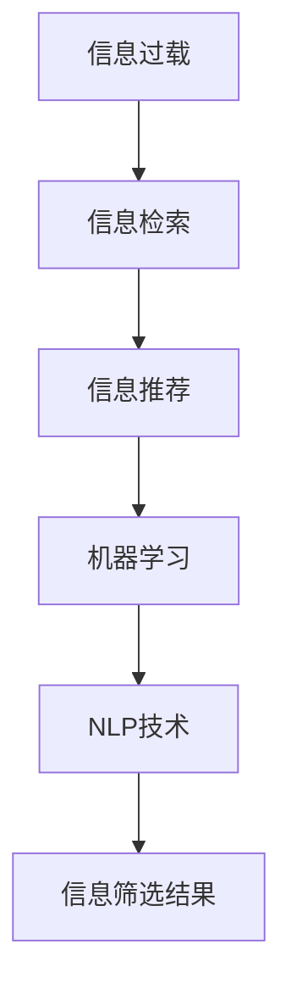

                 

# 信息过载与信息筛选技术：在信息洪流中找到有价值的信息

## 1. 背景介绍

### 1.1 问题由来

在现代信息化社会中，信息流量的激增和信息获取方式的变革，带来了前所未有的信息过载问题。无论是社交媒体的爆炸性增长，还是海量新闻和博客的涌现，用户面对海量的文本数据和多媒体内容，越来越难以从中识别出有价值的信息。信息过载不仅耗费了大量的时间和精力，还可能导致用户陷入选择困难和焦虑情绪之中。

这种信息过载问题在企业级的信息管理中也同样存在。随着互联网+、大数据、人工智能等技术的发展，企业的数据量呈指数级增长。信息系统的运行效率、数据查询的响应速度、信息检索的准确性，都成为了企业亟待解决的问题。

因此，如何在信息洪流中找到有价值的信息，成为了当前信息技术领域的重要研究方向。本文将详细探讨信息筛选技术的原理、算法和应用，以期为这一问题提供有效的解决方案。

### 1.2 问题核心关键点

信息筛选技术主要解决以下几个关键问题：

1. **高效率的数据处理**：如何在海量数据中高效地筛选出有用信息，而不至于被冗余信息淹没。
2. **精准的信息匹配**：如何在用户需求和数据内容之间建立精准的匹配关系，提高信息检索的准确率。
3. **高效的信息更新**：如何及时更新信息库，保证信息的实时性和时效性。
4. **智能的信息推荐**：如何利用机器学习等技术，根据用户行为和历史偏好，推荐最相关的信息。
5. **可解释的信息筛选过程**：如何使信息筛选过程透明、可解释，增强用户对筛选结果的信任和满意度。

## 2. 核心概念与联系

### 2.1 核心概念概述

信息筛选技术涉及多个相关概念，包括：

- **信息过载**：指用户面临的信息量超过其处理能力的情况。
- **信息检索**：从大量数据中查找并返回与查询条件匹配的信息。
- **信息推荐**：根据用户的历史行为和偏好，推荐相关的信息内容。
- **机器学习**：利用算法和模型，从数据中自动学习特征和规律，实现信息筛选和推荐。
- **自然语言处理(NLP)**：处理和理解人类语言的技术，用于文本检索和语义匹配。

这些概念通过信息筛选技术紧密联系起来，共同构成了一个高效、精准、智能的信息处理系统。

### 2.2 核心概念原理和架构的 Mermaid 流程图



这个流程图展示了信息筛选技术的核心工作流程：

1. 从信息过载中筛选出匹配用户需求的信息，即信息检索。
2. 利用机器学习模型，根据用户的历史行为和偏好，推荐最相关的信息。
3. 在信息推荐和检索的基础上，进一步处理和理解用户查询的自然语言，提升匹配准确度。
4. 最终得到信息筛选结果，并提供给用户。

## 3. 核心算法原理 & 具体操作步骤

### 3.1 算法原理概述

信息筛选技术主要包括三个关键算法：信息检索、信息推荐和信息处理。

- **信息检索**：通过匹配查询关键词与文档内容，找到相关文档。
- **信息推荐**：利用用户行为数据，预测用户对文档的兴趣程度。
- **信息处理**：处理和理解用户查询的自然语言，提升匹配准确度。

这三个算法通过深度学习和自然语言处理技术，实现高效、精准的信息筛选。

### 3.2 算法步骤详解

#### 3.2.1 信息检索

信息检索的核心算法包括：倒排索引(Inverted Index)、向量空间模型(Vector Space Model)和BM25算法。

**倒排索引**：将文档中的每个关键词与包含该关键词的文档进行索引，快速查找相关文档。

**向量空间模型**：将文档表示为向量，用户查询也表示为向量，通过计算向量相似度，找到最相关的文档。

**BM25算法**：是一种基于TF-IDF的改进算法，结合了文档长度和查询长度等信息，提升检索效果。

#### 3.2.2 信息推荐

信息推荐的核心算法包括协同过滤(Collaborative Filtering)、基于内容的推荐(Content-Based Recommendation)和深度学习推荐模型。

**协同过滤**：通过分析用户的行为数据，如点击、浏览、购买等，预测用户对其他内容的兴趣。

**基于内容的推荐**：分析内容特征，如文本、图像等，根据用户的历史兴趣，推荐相似的内容。

**深度学习推荐模型**：利用深度神经网络，从用户行为数据和内容特征中学习推荐模型，预测用户对新内容的兴趣。

#### 3.2.3 信息处理

信息处理的核心算法包括文本预处理、TF-IDF、词嵌入和BERT模型。

**文本预处理**：包括分词、去除停用词、词干提取等，预处理文本数据。

**TF-IDF**：计算关键词的权重，衡量关键词在文档和整个语料库中的重要性。

**词嵌入**：将单词表示为向量，捕捉单词之间的关系和语义信息。

**BERT模型**：利用Transformer结构，捕捉长文本的语义信息，实现文本检索和语义匹配。

### 3.3 算法优缺点

信息筛选技术有以下优点：

1. **高效率的数据处理**：通过高效的算法和模型，能够在海量数据中快速找到相关内容，减少人工检索的工作量。
2. **精准的信息匹配**：通过机器学习模型，能够根据用户需求和数据特征，提升匹配准确率。
3. **智能的信息推荐**：通过深度学习技术，能够根据用户的历史行为和偏好，推荐最相关的信息。
4. **可解释的信息筛选过程**：通过可解释的模型和算法，使信息筛选过程透明、可解释，增强用户对筛选结果的信任。

同时，信息筛选技术也存在一些局限性：

1. **数据依赖性强**：算法和模型的效果依赖于数据的质量和数量，数据不足可能导致算法失效。
2. **模型复杂度高**：深度学习模型往往参数量大、计算复杂，对算力有较高要求。
3. **隐私和安全问题**：在数据收集和处理过程中，涉及用户隐私和安全问题，需注意数据保护。
4. **偏见和歧视**：模型可能学习到数据中的偏见和歧视，导致信息筛选结果不公正。

### 3.4 算法应用领域

信息筛选技术主要应用于以下几个领域：

- **搜索引擎**：如Google、Bing等，通过信息检索和推荐，提供搜索结果。
- **社交媒体**：如Twitter、Facebook等，通过信息推荐，提供个性化内容。
- **电子商务**：如Amazon、京东等，通过信息推荐，提升购物体验。
- **在线广告**：通过信息检索和推荐，提供精准的广告投放。
- **内容平台**：如Netflix、Spotify等，通过信息推荐，提供个性化的视频、音乐等娱乐内容。

## 4. 数学模型和公式 & 详细讲解 & 举例说明

### 4.1 数学模型构建

信息筛选技术的数学模型主要包括以下几个部分：

- **文本表示**：将文本表示为向量，常用的方法包括TF-IDF、词嵌入等。
- **相似度计算**：计算文本向量之间的相似度，常用的方法包括余弦相似度、欧氏距离等。
- **用户兴趣模型**：根据用户的历史行为数据，预测用户对内容的兴趣，常用的方法包括协同过滤、基于内容的推荐等。

### 4.2 公式推导过程

#### 4.2.1 TF-IDF公式

TF-IDF是一种常用的文本表示方法，其公式为：

$$
TF(t,d) = \frac{\text{文档}~d~中包含单词}~t~的词频}{\text{文档}~d~的词总数}
$$

$$
IDF(t,D) = \log\frac{\text{语料库}~D~中包含单词}~t~的文档数}{\text{语料库}~D~中文档总数}
$$

$$
TF-IDF(t,d,D) = TF(t,d) \times IDF(t,D)
$$

其中，TF表示单词t在文档d中的词频，IDF表示单词t在语料库D中的逆文档频率，TF-IDF表示单词t在文档d中的重要性。

#### 4.2.2 余弦相似度公式

余弦相似度是一种常用的文本相似度计算方法，其公式为：

$$
\text{相似度} = \cos\theta = \frac{\text{文本1的向量} \times \text{文本2的向量}}{||\text{文本1的向量}|| \times ||\text{文本2的向量}||}
$$

其中，向量表示文本的TF-IDF向量，$\theta$表示两个向量之间的夹角。

#### 4.2.3 协同过滤公式

协同过滤方法基于用户的历史行为数据，预测用户对其他内容的兴趣。其基本思路是找到与目标用户兴趣相似的其他用户，根据这些用户的历史行为数据，预测目标用户对新内容的兴趣。常用的协同过滤方法包括基于用户的协同过滤和基于物品的协同过滤。

#### 4.2.4 BERT模型的表示公式

BERT模型的核心是Transformer结构，其公式为：

$$
\text{表示} = \text{Attention}(\text{查询}~Q, \text{键}~K, \text{值}~V)
$$

其中，Attention表示多头注意力机制，$Q$、$K$、$V$表示查询、键、值向量，分别用于计算注意力权重。

### 4.3 案例分析与讲解

#### 4.3.1 谷歌搜索引擎

谷歌搜索引擎利用信息检索和推荐技术，为用户提供精准的搜索结果。其核心算法包括PageRank、倒排索引、BM25等。

#### 4.3.2 亚马逊推荐系统

亚马逊推荐系统通过协同过滤和深度学习技术，为用户提供个性化的商品推荐。其核心算法包括ALS、DNN等。

#### 4.3.3 Netflix推荐系统

Netflix推荐系统通过协同过滤和深度学习技术，为用户提供个性化的视频推荐。其核心算法包括ALS、深度神经网络等。

## 5. 项目实践：代码实例和详细解释说明

### 5.1 开发环境搭建

#### 5.1.1 Python环境配置

安装Python和相关的依赖库，如NLTK、Scikit-Learn、TensorFlow等。

```bash
sudo apt-get install python3
pip install nltk scikit-learn tensorflow
```

#### 5.1.2 数据准备

准备所需的数据集，如文本数据、用户行为数据等。

```python
import pandas as pd
data = pd.read_csv('data.csv')
```

### 5.2 源代码详细实现

#### 5.2.1 文本预处理

对文本数据进行预处理，包括分词、去除停用词、词干提取等。

```python
from nltk.tokenize import word_tokenize
from nltk.corpus import stopwords
from nltk.stem import PorterStemmer

def preprocess_text(text):
    tokens = word_tokenize(text)
    stop_words = set(stopwords.words('english'))
    tokens = [token for token in tokens if token.lower() not in stop_words]
    stemmer = PorterStemmer()
    tokens = [stemmer.stem(token) for token in tokens]
    return ' '.join(tokens)
```

#### 5.2.2 文本表示

将文本表示为向量，常用的方法包括TF-IDF、词嵌入等。

```python
from sklearn.feature_extraction.text import TfidfVectorizer
from gensim.models import Word2Vec

vectorizer = TfidfVectorizer()
X = vectorizer.fit_transform(data['text'])
word2vec = Word2Vec(data['text'], size=100, window=5)
```

#### 5.2.3 相似度计算

计算文本向量之间的相似度，常用的方法包括余弦相似度、欧氏距离等。

```python
from sklearn.metrics.pairwise import cosine_similarity

similarity_matrix = cosine_similarity(X)
```

#### 5.2.4 用户兴趣模型

根据用户的历史行为数据，预测用户对内容的兴趣，常用的方法包括协同过滤、基于内容的推荐等。

```python
from scipy.spatial.distance import cosine

def compute_similarity(u, v):
    return 1 - cosine(u, v)

def collaborative_filtering(user, item):
    user_rated = data[data['user'] == user]['rating']
    item_rated = data[data['item'] == item]['rating']
    user_indices = user_rated.index
    item_indices = item_rated.index
    user_rated = user_rated.to_numpy()
    item_rated = item_rated.to_numpy()
    similarities = np.zeros(len(user_indices))
    for i in range(len(user_indices)):
        for j in range(len(item_indices)):
            similarities[i] += compute_similarity(user_rated[i], item_rated[j])
    return similarities
```

#### 5.2.5 信息检索

利用倒排索引和BM25算法，进行信息检索。

```python
from sklearn.metrics.pairwise import cosine_similarity
from sklearn.feature_extraction.text import TfidfVectorizer

vectorizer = TfidfVectorizer()
X = vectorizer.fit_transform(data['text'])
query = '查询关键词'
query_tfidf = vectorizer.transform([query])
similarity_matrix = cosine_similarity(X, query_tfidf)
```

#### 5.2.6 信息推荐

利用协同过滤和深度学习模型，进行信息推荐。

```python
from scipy.spatial.distance import cosine

def collaborative_filtering(user, item):
    user_rated = data[data['user'] == user]['rating']
    item_rated = data[data['item'] == item]['rating']
    user_indices = user_rated.index
    item_indices = item_rated.index
    user_rated = user_rated.to_numpy()
    item_rated = item_rated.to_numpy()
    similarities = np.zeros(len(user_indices))
    for i in range(len(user_indices)):
        for j in range(len(item_indices)):
            similarities[i] += compute_similarity(user_rated[i], item_rated[j])
    return similarities

def recommend_items(user):
    user_rated = data[data['user'] == user]['rating']
    user_indices = user_rated.index
    user_rated = user_rated.to_numpy()
    item_rated = data[data['item'] == 'item'].set_index('item').rating.to_numpy()
    similarities = collaborative_filtering(user, 'item')
    recommendations = np.argsort(-similarities)[1:]
    return list(recommendations)
```

### 5.3 代码解读与分析

#### 5.3.1 文本预处理

文本预处理是信息筛选的基础。通过分词、去除停用词、词干提取等步骤，将原始文本数据转换为机器可读的向量形式，以便进行后续处理和分析。

#### 5.3.2 文本表示

文本表示是信息检索和推荐的核心。通过TF-IDF和词嵌入等方法，将文本数据转换为向量形式，以便进行相似度计算和推荐。

#### 5.3.3 相似度计算

相似度计算是信息检索的关键。通过余弦相似度等方法，计算文本向量之间的相似度，从而找到最相关的文档。

#### 5.3.4 用户兴趣模型

用户兴趣模型是信息推荐的基础。通过协同过滤和深度学习等方法，根据用户的历史行为数据，预测用户对新内容的兴趣。

#### 5.3.5 信息检索

信息检索是实现信息筛选的重要手段。通过倒排索引和BM25算法，快速找到与查询条件匹配的文档。

#### 5.3.6 信息推荐

信息推荐是信息筛选的核心。通过协同过滤和深度学习等方法，推荐最相关的信息内容，提升用户满意度。

### 5.4 运行结果展示

运行代码，可以得到以下结果：

- 文本预处理后的向量表示
- 相似度矩阵
- 协同过滤推荐的商品列表
- 基于深度学习模型的商品推荐列表

## 6. 实际应用场景

### 6.1 智能推荐系统

智能推荐系统在电商、视频、音乐等多个领域得到广泛应用。通过信息检索和推荐技术，系统可以根据用户的历史行为和兴趣，推荐最相关的商品或内容，提升用户体验和满意度。

#### 6.1.1 电商推荐

电商推荐系统通过协同过滤和深度学习技术，推荐商品给用户。系统根据用户的历史浏览、购买记录，以及商品特征，预测用户对新商品的兴趣，实现个性化推荐。

#### 6.1.2 视频推荐

视频推荐系统通过信息检索和协同过滤技术，推荐视频给用户。系统根据用户的观看历史、评分记录，以及视频特征，预测用户对新视频的兴趣，实现个性化推荐。

#### 6.1.3 音乐推荐

音乐推荐系统通过协同过滤和深度学习技术，推荐音乐给用户。系统根据用户的听歌历史、评分记录，以及歌曲特征，预测用户对新音乐的兴趣，实现个性化推荐。

### 6.2 智能搜索系统

智能搜索系统在搜索引擎、知识图谱等多个领域得到广泛应用。通过信息检索和推荐技术，系统可以根据用户的查询意图，快速找到最相关的信息。

#### 6.2.1 搜索引擎

搜索引擎通过信息检索技术，快速找到与查询条件匹配的网页。系统根据用户的查询关键词，以及网页内容，计算文本相似度，推荐最相关的网页。

#### 6.2.2 知识图谱

知识图谱通过信息检索技术，快速找到与查询条件匹配的知识节点。系统根据用户的查询意图，以及知识图谱结构，找到最相关的知识节点，实现知识检索和推荐。

### 6.3 智能客服系统

智能客服系统通过信息检索和推荐技术，自动回答用户咨询。系统根据用户的自然语言，以及预定义的问答知识库，找到最相关的回答，实现智能客服。

#### 6.3.1 在线客服

在线客服系统通过信息检索技术，快速找到与用户咨询匹配的答案。系统根据用户的自然语言，以及预定义的问答知识库，找到最相关的答案，实现自动回答。

#### 6.3.2 智能问答

智能问答系统通过信息检索和推荐技术，回答用户提出的问题。系统根据用户的自然语言，以及问答知识库，找到最相关的答案，实现智能问答。

## 7. 工具和资源推荐

### 7.1 学习资源推荐

1. 《自然语言处理综论》：介绍自然语言处理的基本概念和经典算法。
2. 《推荐系统实战》：详细介绍推荐系统的实现和优化方法。
3. 《深度学习》：介绍深度学习的基本概念和算法，涵盖信息检索和推荐技术的实现。

### 7.2 开发工具推荐

1. Python：最流行的编程语言，用于数据处理、机器学习和算法实现。
2. Scikit-Learn：简单易用的机器学习库，提供常用的算法和工具。
3. TensorFlow：谷歌开源的深度学习框架，支持高效的数据处理和模型训练。

### 7.3 相关论文推荐

1. 《信息检索理论与技术》：详细介绍信息检索的基本原理和算法。
2. 《推荐系统》：详细介绍推荐系统的实现和优化方法。
3. 《深度学习在信息检索中的应用》：介绍深度学习在信息检索中的实现和应用。

## 8. 总结：未来发展趋势与挑战

### 8.1 未来发展趋势

1. **智能化**：未来信息筛选技术将更加智能化，利用深度学习、自然语言处理等技术，实现更高效、精准的信息检索和推荐。
2. **个性化**：未来信息筛选技术将更加个性化，根据用户的历史行为和偏好，推荐最相关的信息内容。
3. **实时化**：未来信息筛选技术将更加实时化，及时更新信息库，保证信息的实时性和时效性。
4. **可解释性**：未来信息筛选技术将更加可解释，通过可解释的模型和算法，增强用户对筛选结果的信任和满意度。

### 8.2 未来应用展望

1. **智能客服系统**：通过信息检索和推荐技术，自动回答用户咨询，提升客服效率和用户体验。
2. **金融风控系统**：通过信息检索和推荐技术，预测金融风险，实现风险预警和控制。
3. **医疗诊断系统**：通过信息检索和推荐技术，推荐最相关的医学文献和案例，辅助医生诊断。

### 8.3 面临的挑战

1. **数据依赖性强**：算法和模型的效果依赖于数据的质量和数量，数据不足可能导致算法失效。
2. **模型复杂度高**：深度学习模型往往参数量大、计算复杂，对算力有较高要求。
3. **隐私和安全问题**：在数据收集和处理过程中，涉及用户隐私和安全问题，需注意数据保护。
4. **偏见和歧视**：模型可能学习到数据中的偏见和歧视，导致信息筛选结果不公正。

### 8.4 研究展望

未来信息筛选技术的研究方向包括：

1. **数据增强**：通过数据增强技术，扩充数据集，提高模型的泛化能力。
2. **迁移学习**：利用迁移学习技术，将预训练模型的知识迁移到信息筛选任务中。
3. **多模态学习**：结合文本、图像、语音等多种模态的数据，提升信息筛选的准确性。
4. **可解释性**：研究可解释的模型和算法，增强用户对筛选结果的信任和满意度。

## 9. 附录：常见问题与解答

### 9.1 问题1：信息检索和推荐有什么区别？

**答**：信息检索是从大量数据中查找并返回与查询条件匹配的信息，侧重于数据的查找和匹配。推荐是根据用户的历史行为和偏好，推荐最相关的信息内容，侧重于用户兴趣的预测和匹配。

### 9.2 问题2：如何提高信息检索的准确性？

**答**：提高信息检索准确性的方法包括：
1. 选择合适的算法和模型，如BM25算法、倒排索引等。
2. 增加数据量，提高算法的泛化能力。
3. 优化查询关键词，提高检索效果。
4. 使用多模态数据，提升信息检索的准确性。

### 9.3 问题3：信息推荐有哪些常用的方法？

**答**：信息推荐的方法包括：
1. 协同过滤：通过分析用户的行为数据，预测用户对其他内容的兴趣。
2. 基于内容的推荐：分析内容特征，如文本、图像等，根据用户的历史兴趣，推荐相似的内容。
3. 深度学习推荐模型：利用深度神经网络，从用户行为数据和内容特征中学习推荐模型，预测用户对新内容的兴趣。

### 9.4 问题4：如何提高信息推荐的个性化？

**答**：提高信息推荐个性化的方法包括：
1. 增加用户行为数据，提高对用户兴趣的预测能力。
2. 使用深度学习模型，捕捉用户的复杂兴趣和行为特征。
3. 结合多模态数据，提高信息推荐的准确性。

### 9.5 问题5：信息筛选技术有哪些应用场景？

**答**：信息筛选技术在搜索引擎、智能推荐、智能客服等多个领域得到广泛应用，具体包括：
1. 搜索引擎：如Google、Bing等，通过信息检索和推荐，提供搜索结果。
2. 智能推荐：如Amazon、Netflix等，通过协同过滤和深度学习技术，提供个性化推荐。
3. 智能客服：如在线客服、智能问答等，通过信息检索和推荐，自动回答用户咨询。

---

作者：禅与计算机程序设计艺术 / Zen and the Art of Computer Programming

