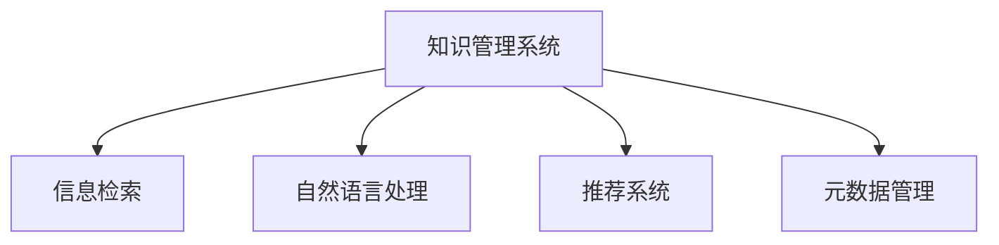

                 

# 信息过载与知识管理系统实施指南：有效组织和检索信息

> 关键词：信息过载,知识管理系统,信息检索,信息组织,数据管理

## 1. 背景介绍

### 1.1 问题由来

随着互联网和数字技术的迅猛发展，人类正面临着前所未有的信息过载问题。据统计，全球每年产生的数据量已经超过了1000万亿字节，而且这个数字还在呈指数级增长。信息的爆炸式增长，不仅带来存储和处理上的巨大挑战，也让人们在寻求和利用信息时变得愈发困难。

信息过载带来的副作用包括注意力分散、决策质量下降、知识更新迟缓等，严重影响了个人和组织的效率与创新。为了有效应对这一挑战，构建高效的知识管理系统（KMS）成为亟需解决的问题。KMS旨在整合、组织和管理各类信息资源，通过智能化的检索和推荐，帮助用户快速定位所需信息，提升工作和学习效率。

### 1.2 问题核心关键点

知识管理系统成功实施的关键点包括：

1. **数据集成**：将不同来源的结构化和非结构化数据整合到一个统一的数据平台。
2. **信息组织**：采用合适的分类、标签和元数据，对数据进行结构化处理。
3. **检索引擎**：建设高效的搜索和推荐算法，支持快速、精确的信息检索。
4. **用户界面**：设计直观易用的用户界面，提高用户体验。
5. **可扩展性**：系统应具备高度的可扩展性，以支持未来不断增长的数据需求。
6. **安全性与隐私保护**：确保系统的数据安全和用户隐私，防止信息泄露和滥用。

## 2. 核心概念与联系

### 2.1 核心概念概述

为更好地理解知识管理系统的实施，本节将介绍几个关键概念：

- **知识管理系统（KMS）**：通过整合、组织和检索信息，支持知识的获取、分享、创造和利用。
- **信息检索（IR）**：从大量信息中找出用户所需信息的过程。
- **自然语言处理（NLP）**：通过计算机自动化理解、生成和分析自然语言，支持文本信息处理。
- **推荐系统**：利用用户历史行为和偏好，为用户推荐个性化信息。
- **元数据管理**：对数据的结构化描述，包括分类、属性、关联等，支持数据组织和检索。

这些概念之间的关系可以通过以下Mermaid流程图来展示：



这个流程图展示了几大核心概念之间的联系：

1. KMS通过整合不同来源的数据，建立统一的知识库。
2. 信息检索在知识库中搜索和匹配信息，提供快速获取信息的途径。
3. NLP技术帮助理解文本信息，辅助信息检索和推荐系统。
4. 推荐系统根据用户行为生成个性化推荐。
5. 元数据管理对数据进行结构化描述，支持检索和推荐。

## 3. 核心算法原理 & 具体操作步骤

### 3.1 算法原理概述

知识管理系统的核心在于如何有效组织和检索信息。这通常涉及以下几个关键步骤：

1. **数据收集与预处理**：收集和清洗来自不同来源的结构化和非结构化数据。
2. **信息组织**：对数据进行分类、标签和元数据处理，建立知识库。
3. **检索与推荐**：建立高效的检索和推荐算法，支持信息快速获取和个性化推荐。
4. **用户交互与反馈**：通过用户界面收集用户反馈，不断优化系统。

知识管理系统实施的关键在于选择合适的算法和工具，并确保其与业务需求和技术环境的适配。

### 3.2 算法步骤详解

知识管理系统的实施通常包括以下几个关键步骤：

**Step 1: 数据集成与清洗**

- 从不同系统或文件收集数据，包括文本、图片、视频、音频等。
- 对数据进行清洗和去重，去除无关或重复信息。
- 标准化数据格式，确保数据一致性和完整性。

**Step 2: 信息组织与分类**

- 对数据进行分类和标签化，建立分类体系和标签库。
- 对文本数据进行自然语言处理，提取关键词、实体和关系。
- 使用元数据管理系统对数据进行结构化描述，包括创建、更新和维护数据分类和标签。

**Step 3: 信息检索与推荐**

- 选择合适的检索算法，如TF-IDF、BM25等，对信息进行检索和排序。
- 构建推荐算法，如协同过滤、内容推荐等，提供个性化推荐服务。
- 使用机器学习模型，如深度学习、支持向量机等，提高检索和推荐的准确性和效率。

**Step 4: 用户界面设计与反馈**

- 设计直观易用的用户界面，支持信息的浏览、搜索、分享和协作。
- 收集用户使用反馈，不断优化系统和算法。

**Step 5: 系统部署与维护**

- 部署知识管理系统，确保其稳定性和可靠性。
- 定期维护和更新系统，保持数据的时效性和准确性。

### 3.3 算法优缺点

知识管理系统的优点包括：

1. **提升信息获取效率**：通过高效的检索和推荐系统，用户可以快速定位所需信息。
2. **支持知识共享与协作**：知识管理系统支持信息的共享和协作，促进团队的知识积累和创新。
3. **自动化与智能化**：利用机器学习和自然语言处理技术，实现信息的自动化处理和智能化推荐。
4. **灵活性与可扩展性**：系统可以根据业务需求进行调整和扩展，适应不同的应用场景。

知识管理系统也存在一些局限：

1. **成本较高**：构建和维护知识管理系统需要较大的初始投资和持续运维成本。
2. **复杂性高**：系统的设计和管理需要专业的知识和技能，对企业技术架构提出较高要求。
3. **数据质量依赖**：系统的效果高度依赖于数据的质量和完整性，需进行严格的数据清洗和预处理。
4. **用户接受度问题**：系统的有效性依赖于用户的积极使用和反馈，用户培训和习惯培养需要时间。

### 3.4 算法应用领域

知识管理系统在多个领域得到了广泛应用，包括：

1. **企业知识管理**：通过整合和组织企业内部的各种知识资源，提升企业运营效率和创新能力。
2. **科研知识管理**：支持科研团队的知识共享和协作，加速科研进程。
3. **教育知识管理**：支持在线教育平台的学习资源管理和个性化推荐，提升学习效果。
4. **医疗知识管理**：支持医疗信息的收集、分析和利用，辅助临床决策和治疗。
5. **政府知识管理**：支持政策法规的收集、整理和检索，辅助决策支持。
6. **公共知识管理**：支持公共数据的收集、处理和分享，促进社会知识的普及和传播。

## 4. 数学模型和公式 & 详细讲解

### 4.1 数学模型构建

知识管理系统的构建涉及多个子模型，以下以信息检索和推荐系统为例，介绍常用的数学模型。

**信息检索模型**

假设用户查询为$q$，文档集合为$D$，向量空间模型（VSM）中，查询向量和文档向量分别为$\vec{q}$和$\vec{d}$。

设查询向量的权重为$w_q$，文档向量的权重为$w_d$，则信息检索的余弦相似度模型为：

$$
\text{similarity}(q,d) = \cos\theta = \frac{\vec{q} \cdot \vec{d}}{||\vec{q}|| \cdot ||\vec{d}||}
$$

**推荐系统模型**

假设用户$u$对$n$个物品$i$的评分序列为$R_{ui}$，物品$i$的特征向量为$\vec{f}_i$，用户的隐含特征向量为$\vec{h}_u$。推荐模型可以表示为：

$$
\hat{R}_{ui} = \vec{f}_i^T \vec{h}_u + b
$$

其中$b$为偏差项，可以进一步加入L1正则和L2正则，防止过拟合：

$$
\hat{R}_{ui} = \vec{f}_i^T \vec{h}_u + b + \lambda_1 ||\vec{h}_u||_1 + \lambda_2 ||\vec{h}_u||_2^2
$$

### 4.2 公式推导过程

**信息检索公式推导**

- 查询向量和文档向量的点积表示为：
$$
\vec{q} \cdot \vec{d} = \sum_{i=1}^D w_q q_i w_d d_i
$$

- 查询向量长度为：
$$
||\vec{q}|| = \sqrt{\sum_{i=1}^D w_q^2 q_i^2}
$$

- 文档向量长度为：
$$
||\vec{d}|| = \sqrt{\sum_{i=1}^D w_d^2 d_i^2}
$$

- 余弦相似度公式为：
$$
\text{similarity}(q,d) = \frac{\vec{q} \cdot \vec{d}}{||\vec{q}|| \cdot ||\vec{d}||} = \frac{\sum_{i=1}^D w_q q_i w_d d_i}{\sqrt{\sum_{i=1}^D w_q^2 q_i^2} \cdot \sqrt{\sum_{i=1}^D w_d^2 d_i^2}}
$$

**推荐系统公式推导**

- 推荐模型线性形式为：
$$
\hat{R}_{ui} = \vec{f}_i^T \vec{h}_u + b
$$

- 加入L1正则和L2正则后，推荐模型可以表示为：
$$
\hat{R}_{ui} = \vec{f}_i^T \vec{h}_u + b + \lambda_1 ||\vec{h}_u||_1 + \lambda_2 ||\vec{h}_u||_2^2
$$

其中，L1正则和L2正则分别表示为：
$$
||\vec{h}_u||_1 = \sum_{i=1}^D |h_{ui}|
$$

$$
||\vec{h}_u||_2^2 = \sum_{i=1}^D h_{ui}^2
$$

### 4.3 案例分析与讲解

**案例一：企业知识管理系统**

假设企业拥有一个包含技术文档、项目报告和会议记录的知识库。企业希望构建一个知识管理系统，帮助员工快速定位所需信息。

1. **数据收集与预处理**：
   - 收集企业的各类文本文件，包括技术文档、项目报告和会议记录。
   - 对数据进行清洗和预处理，去除无关信息，标准化数据格式。
2. **信息组织与分类**：
   - 对文本进行分词和词性标注，提取关键词和实体。
   - 对文本进行主题分类，建立分类体系和标签库。
   - 使用元数据管理系统，对文档进行结构化描述，包括作者、创建时间、主题等。
3. **信息检索与推荐**：
   - 选择合适的信息检索算法，如BM25算法。
   - 构建推荐算法，根据用户历史行为，生成个性化推荐。
4. **用户界面设计与反馈**：
   - 设计直观易用的用户界面，支持信息的浏览、搜索和分享。
   - 收集用户使用反馈，不断优化系统性能。

**案例二：在线教育平台**

假设一个在线教育平台希望构建知识管理系统，帮助学生和教师高效利用教学资源。

1. **数据收集与预处理**：
   - 收集在线课程、视频讲座、习题集等教学资源。
   - 对数据进行清洗和预处理，去除重复内容，标准化格式。
2. **信息组织与分类**：
   - 对视频和文本数据进行自然语言处理，提取关键词和实体。
   - 对教学资源进行分类和标签化，建立分类体系和标签库。
   - 使用元数据管理系统，对资源进行结构化描述，包括课程名称、授课教师、视频时长等。
3. **信息检索与推荐**：
   - 选择合适的信息检索算法，如TF-IDF算法。
   - 构建推荐算法，根据学生历史学习行为，生成个性化推荐。
4. **用户界面设计与反馈**：
   - 设计直观易用的用户界面，支持资源的浏览、搜索和推荐。
   - 收集用户使用反馈，不断优化推荐效果。

## 5. 项目实践：代码实例和详细解释说明

### 5.1 开发环境搭建

在进行知识管理系统的项目实践前，我们需要准备好开发环境。以下是使用Python进行ElasticSearch开发的环境配置流程：

1. 安装ElasticSearch：从官网下载并安装ElasticSearch，用于构建搜索索引和检索数据。
2. 安装Kibana：Kibana是ElasticSearch的可视化工具，用于探索和管理搜索索引。
3. 安装ElasticSearch-Py：Python客户端库，用于Python中与ElasticSearch进行交互。
4. 安装Flask：用于构建Web应用程序，支持用户界面设计。

完成上述步骤后，即可在本地启动ElasticSearch和Kibana，开始构建知识管理系统的实践。

### 5.2 源代码详细实现

这里我们以构建一个简单的企业知识管理系统为例，给出ElasticSearch和Flask的代码实现。

```python
from flask import Flask, request, jsonify
from elasticsearch import Elasticsearch

app = Flask(__name__)

es = Elasticsearch([{'host': 'localhost', 'port': 9200}])

# 添加文档
@app.route('/add_document', methods=['POST'])
def add_document():
    doc = request.json
    es.index(index='test_index', body=doc)
    return jsonify({'message': '文档添加成功'}), 200

# 搜索文档
@app.route('/search_document', methods=['GET'])
def search_document():
    query = request.args.get('query')
    res = es.search(index='test_index', body={'query': {'match': {'content': query}}})
    return jsonify(res['hits']['hits']), 200

if __name__ == '__main__':
    app.run(debug=True)
```

### 5.3 代码解读与分析

让我们再详细解读一下关键代码的实现细节：

**Flask应用配置**

- 导入Flask模块，创建Flask应用实例。
- 启动Flask应用，监听本地端口5000。

**ElasticSearch索引和文档添加**

- 使用ElasticSearch-Py客户端库，连接到本地的ElasticSearch实例。
- 定义添加文档的API，接收JSON格式的文档内容。
- 使用ElasticSearch的index方法，将文档添加到指定索引中。
- 返回文档添加成功的JSON响应。

**文档搜索**

- 定义搜索文档的API，接收查询字符串。
- 使用ElasticSearch的search方法，进行文本搜索。
- 返回搜索结果的JSON响应。

### 5.4 运行结果展示

在运行上述代码后，可以通过浏览器访问`http://localhost:5000/add_document`，向系统添加文档。例如：

```json
{
    "content": "这是一个测试文档，用于展示ElasticSearch的文档添加功能。",
    "title": "测试文档",
    "author": "张三",
    "create_time": "2022-01-01 12:00:00"
}
```

添加完成后，可以通过浏览器访问`http://localhost:5000/search_document?query=测试文档`，搜索添加的文档。例如：

```json
[
    {
        "_index": "test_index",
        "_type": "_doc",
        "_id": "1",
        "_source": {
            "content": "这是一个测试文档，用于展示ElasticSearch的文档添加功能。",
            "title": "测试文档",
            "author": "张三",
            "create_time": "2022-01-01 12:00:00"
        }
    }
]
```

以上代码和实现，展示了如何通过Python和ElasticSearch构建一个简单的企业知识管理系统。开发者可以根据需求，进一步扩展和优化系统功能。

## 6. 实际应用场景

### 6.1 智能客服系统

智能客服系统通过构建知识管理系统，整合和组织企业内部的各类客服文档和FAQ，提升客服服务效率和质量。系统可根据用户提问，快速检索相关文档，生成回答。

在技术实现上，可以收集企业内部的历史客服对话记录，将问题和最佳答复构建成监督数据，在此基础上对ElasticSearch等搜索引擎进行微调，训练模型学习匹配答案。对于新问题，可以接入检索系统实时搜索相关内容，动态生成回答。

### 6.2 科研知识管理

科研知识管理系统通过构建知识库，整合和组织各类科研文献、项目报告和专利信息，支持科研团队的协作和创新。系统可根据研究人员的需求，快速检索相关文献，提供个性化推荐。

在技术实现上，可以收集科研机构的各类文献和报告，使用NLP技术提取关键词和实体，建立分类体系和标签库。使用ElasticSearch等搜索引擎，构建信息检索和推荐系统。系统可根据研究人员的历史阅读行为，生成个性化推荐文献。

### 6.3 企业知识管理

企业知识管理系统通过整合和组织各类企业文档、知识库和内部信息，提升企业的运营效率和创新能力。系统可根据员工的需求，快速检索相关文档，提供个性化推荐。

在技术实现上，可以收集企业的各类文档和内部信息，使用NLP技术提取关键词和实体，建立分类体系和标签库。使用ElasticSearch等搜索引擎，构建信息检索和推荐系统。系统可根据员工的历史阅读行为，生成个性化推荐文档。

### 6.4 未来应用展望

随着知识管理系统技术的不断发展，其应用场景将进一步扩展，带来更多的创新和变革。

1. **智能化和自动化**：未来的知识管理系统将更多地采用AI技术，实现智能化和自动化，进一步提升用户体验和效率。
2. **跨领域融合**：知识管理系统将与各类业务系统进行深度融合，实现信息的全生命周期管理和协同应用。
3. **多模态处理**：未来的知识管理系统将支持多种信息形式，如文本、图片、视频等，提供多模态的信息检索和推荐。
4. **云计算和大数据**：利用云计算和大数据技术，实现知识的分布式存储和管理，提升系统的可扩展性和性能。
5. **协同知识网络**：构建企业、科研机构和公众的协同知识网络，促进知识的共享和传播，提升社会整体的创新能力。

## 7. 工具和资源推荐

### 7.1 学习资源推荐

为了帮助开发者系统掌握知识管理系统的理论基础和实践技巧，这里推荐一些优质的学习资源：

1. **《ElasticSearch官方文档》**：ElasticSearch官方提供的详尽文档，覆盖从安装到高级应用的各个方面。
2. **《Flask官方文档》**：Flask官方提供的文档，涵盖Flask的各个功能模块和开发实践。
3. **《Python自然语言处理》书籍**：自然语言处理领域权威教材，涵盖NLP基础和应用。
4. **《知识管理系统设计与实现》课程**：相关领域的在线课程，提供系统设计、实现和优化技巧。
5. **《信息检索与推荐系统》书籍**：涵盖信息检索和推荐系统的基本原理和算法，适合系统架构师和开发者。

通过对这些资源的学习实践，相信你一定能够快速掌握知识管理系统的精髓，并用于解决实际的业务问题。

### 7.2 开发工具推荐

高效的开发离不开优秀的工具支持。以下是几款用于知识管理系统开发的工具：

1. **ElasticSearch**：高性能的搜索引擎，支持全文检索、分词、排序等。
2. **Flask**：轻量级的Web框架，适合快速构建Web应用。
3. **ElasticSearch-Py**：Python客户端库，方便与ElasticSearch进行交互。
4. **Jupyter Notebook**：强大的交互式开发环境，支持Python和R等多种语言。
5. **Kibana**：ElasticSearch的可视化工具，方便监控和管理ElasticSearch索引。

合理利用这些工具，可以显著提升知识管理系统的开发效率，加快创新迭代的步伐。

### 7.3 相关论文推荐

知识管理系统的研究和应用涉及多个领域，以下几篇论文代表了大数据和AI领域的最新进展，推荐阅读：

1. **《Knowledge Management System Architecture: A Survey》**：系统回顾了知识管理系统的架构和实现技术，提供了全面的参考资料。
2. **《ElasticSearch in Practice》**：详细介绍了ElasticSearch的安装、配置和使用，适合系统部署和维护人员。
3. **《Flask Web Development: Build Web Applications with Flask》**：介绍Flask的开发实践，适合Web开发人员。
4. **《Information Retrieval: Implementing and Evaluating Retrieval Systems》**：涵盖了信息检索的基本原理和算法，适合系统架构师和开发者。
5. **《推荐系统：算法与应用》**：介绍推荐系统的主要算法和技术，适合推荐系统开发者和研究人员。

这些论文代表了大数据和AI领域的最新进展，通过学习这些前沿成果，可以帮助研究者把握学科前进方向，激发更多的创新灵感。

## 8. 总结：未来发展趋势与挑战

### 8.1 研究成果总结

本文对知识管理系统的实现原理和操作步骤进行了全面系统的介绍。首先阐述了知识管理系统在信息过载问题中的重要性，明确了系统实施的关键点。其次，从原理到实践，详细讲解了知识管理系统的数学模型和算法步骤，提供了完整的系统构建案例。同时，本文还广泛探讨了知识管理系统在企业、科研、教育等多个领域的应用前景，展示了系统的广泛潜力和应用价值。

通过本文的系统梳理，可以看到，知识管理系统的实施需要多学科知识的整合，涉及数据集成、信息组织、检索与推荐等多个环节。只有在数据、模型、算法、用户界面等各个环节进行全面优化，才能确保系统的有效性。未来，知识管理系统将成为企业数字化转型的重要工具，帮助企业提升效率和创新能力。

### 8.2 未来发展趋势

展望未来，知识管理系统的发展将呈现以下几个趋势：

1. **智能化和自动化**：未来的知识管理系统将更多地采用AI技术，实现智能化和自动化，进一步提升用户体验和效率。
2. **跨领域融合**：知识管理系统将与各类业务系统进行深度融合，实现信息的全生命周期管理和协同应用。
3. **多模态处理**：未来的知识管理系统将支持多种信息形式，如文本、图片、视频等，提供多模态的信息检索和推荐。
4. **云计算和大数据**：利用云计算和大数据技术，实现知识的分布式存储和管理，提升系统的可扩展性和性能。
5. **协同知识网络**：构建企业、科研机构和公众的协同知识网络，促进知识的共享和传播，提升社会整体的创新能力。

以上趋势凸显了知识管理系统的广阔前景。这些方向的探索发展，必将进一步提升知识管理系统的性能和应用范围，为知识社会的构建提供新的动力。

### 8.3 面临的挑战

尽管知识管理系统已经取得了不少进展，但在迈向更加智能化、普适化应用的过程中，它仍面临着诸多挑战：

1. **数据质量依赖**：知识管理系统的有效性高度依赖于数据的质量和完整性，需进行严格的数据清洗和预处理。
2. **复杂性高**：系统的设计和管理需要专业的知识和技能，对企业技术架构提出较高要求。
3. **资源消耗大**：知识管理系统需要高性能的硬件支持和高效的算法实现，可能面临较大的资源消耗和成本问题。
4. **用户接受度问题**：系统的有效性依赖于用户的积极使用和反馈，用户培训和习惯培养需要时间。

### 8.4 研究展望

面对知识管理系统所面临的挑战，未来的研究需要在以下几个方面寻求新的突破：

1. **数据治理与质量提升**：建立完善的数据治理体系，提升数据质量，保障系统效果的可靠性。
2. **跨平台与多设备支持**：开发跨平台和移动端的应用，实现知识管理系统的高效访问和使用。
3. **实时性与延时优化**：优化知识管理系统的实时性和响应速度，提升用户体验。
4. **安全性与隐私保护**：加强数据安全和用户隐私保护，防止信息泄露和滥用。
5. **可解释性与透明性**：赋予知识管理系统的输出以更高的可解释性和透明性，提升系统可信度。

这些研究方向的探索，必将引领知识管理系统技术迈向更高的台阶，为构建安全、可靠、可解释、可控的智能系统铺平道路。面向未来，知识管理系统需要与其他AI技术进行更深入的融合，如知识表示、因果推理、强化学习等，多路径协同发力，共同推动知识社会的进步。

## 9. 附录：常见问题与解答

**Q1：知识管理系统如何选择合适的搜索引擎？**

A: 知识管理系统的核心是搜索引擎，选择合适的搜索引擎至关重要。ElasticSearch和Solr是目前比较流行的搜索引擎，具有高效的查询性能和丰富的插件生态系统。此外，企业还可以根据自身需求选择合适的搜索引擎，如Apache OpenSearch、Apache Solr等。

**Q2：知识管理系统如何处理非结构化数据？**

A: 知识管理系统需要处理大量的非结构化数据，如文本、图片、视频等。可以通过OCR技术将图像数据转换为文本，使用NLP技术对文本数据进行语义处理。此外，还可以使用ElasticSearch等搜索引擎，直接对非结构化数据进行搜索和推荐。

**Q3：知识管理系统如何进行数据预处理？**

A: 数据预处理是知识管理系统的基础步骤，包括以下几个关键步骤：
1. 数据清洗：去除无关信息，标准化数据格式。
2. 数据标注：对文本数据进行分词、词性标注、命名实体识别等，提取关键词和实体。
3. 数据划分：将数据划分为训练集、验证集和测试集，用于模型训练和评估。

**Q4：知识管理系统如何实现个性化推荐？**

A: 个性化推荐是知识管理系统的关键功能之一。可以采用协同过滤、内容推荐、基于深度学习的推荐模型等多种算法，根据用户的历史行为和兴趣，生成个性化推荐。

**Q5：知识管理系统如何进行用户界面设计？**

A: 用户界面设计是知识管理系统用户体验的重要组成部分。可以采用Flask、React、Vue等Web开发框架，设计直观易用的用户界面。同时，可以通过用户反馈和A/B测试，不断优化用户界面和交互体验。

通过本文的系统梳理，可以看到，知识管理系统的实施需要多学科知识的整合，涉及数据集成、信息组织、检索与推荐等多个环节。只有在数据、模型、算法、用户界面等各个环节进行全面优化，才能确保系统的有效性。未来，知识管理系统将成为企业数字化转型的重要工具，帮助企业提升效率和创新能力。

---

作者：禅与计算机程序设计艺术 / Zen and the Art of Computer Programming

