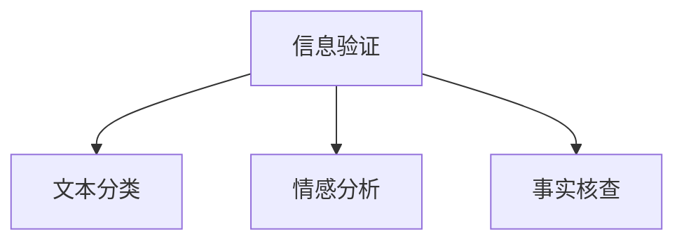

                 

## 1. 背景介绍

### 1.1 问题由来
随着互联网技术的迅猛发展，信息的传播速度和范围达到了前所未有的高度。然而，信息泛滥也带来了大量错误和虚假信息，尤其是假新闻的泛滥，对社会和个体造成了深远的影响。假新闻能够迅速传播，甚至在某些情况下，会影响公共决策和社会稳定。因此，信息验证和信息批判的重要性愈发凸显。

### 1.2 问题核心关键点
本文聚焦于信息验证和信息批判的核心问题，即如何在海量信息中识别真实信息，批判错误和虚假信息。我们将探讨信息验证和信息批判的关键技术，如文本分类、情感分析、事实核查等，以及如何在实践中应用这些技术，构建可信的信息环境。

## 2. 核心概念与联系

### 2.1 核心概念概述

为更好地理解信息验证和信息批判，本节将介绍几个密切相关的核心概念：

- **信息验证(Information Verification)**：指通过一定技术手段，如文本分类、事实核查等，对信息源进行真实性判断的过程。其目的是确认信息的真实性，避免传播错误和虚假信息。
- **信息批判(Information Critique)**：指对已有信息进行批判性分析和评估的过程，目的是识别信息中的偏见、错误和虚假成分，为决策提供更客观、更可靠的参考。
- **文本分类(Text Classification)**：指将文本按照预定义的类别进行分类的技术，可用于判断文本的真实性、可信度和情感倾向。
- **情感分析(Sentiment Analysis)**：指分析文本中情感信息的情感倾向性（如积极、消极、中性），可用于评估信息传播者的主观意图。
- **事实核查(Fact-Checking)**：指对信息内容进行事实验证，判断其真实性，确保信息的准确性。

这些核心概念之间的逻辑关系可以通过以下Mermaid流程图来展示：



这个流程图展示了几大核心概念及其之间的关系：

1. 信息验证通过文本分类、情感分析和事实核查等技术手段，对信息源进行真实性判断。
2. 文本分类判断文本的真实性、可信度和情感倾向。
3. 情感分析分析文本的情感倾向，评估信息传播者的主观意图。
4. 事实核查验证信息内容的真实性，确保信息的准确性。

## 3. 核心算法原理 & 具体操作步骤
### 3.1 算法原理概述

信息验证和信息批判的核心原理是利用人工智能技术对信息进行分类和评估。其核心思想是：

1. 使用文本分类技术对信息进行初步判断，确定其真实性、可信度和情感倾向。
2. 对信息进行事实核查，验证其内容的真实性。
3. 对信息进行情感分析，评估信息传播者的主观意图。
4. 通过以上步骤，综合判断信息的真实性和可信度，批判其可能存在的偏见和错误。

### 3.2 算法步骤详解

以下将详细介绍信息验证和信息批判的具体操作步骤：

**Step 1: 数据预处理**

1. 数据清洗：去除重复、噪声、不完整数据。
2. 数据标注：为训练集数据标注真实性、可信度和情感倾向。

**Step 2: 特征提取**

1. 文本特征提取：提取文本的词频、TF-IDF、词嵌入等特征。
2. 情感特征提取：使用情感词典或深度学习模型提取文本的情感特征。
3. 事实特征提取：从可信的事实数据库中提取信息内容的事实特征。

**Step 3: 模型训练**

1. 文本分类模型训练：使用标注数据训练文本分类模型。
2. 情感分析模型训练：使用标注数据训练情感分析模型。
3. 事实核查模型训练：使用标注数据训练事实核查模型。

**Step 4: 信息验证和批判**

1. 信息初步判断：使用文本分类模型对信息进行初步判断。
2. 信息进一步验证：使用事实核查模型对信息进行进一步验证。
3. 信息情感分析：使用情感分析模型评估信息的情感倾向。
4. 综合批判：综合文本分类、情感分析和事实核查的结果，对信息进行综合批判。

**Step 5: 结果输出**

1. 信息真实性标注：根据文本分类和事实核查的结果，判断信息真实性。
2. 信息可信度评估：根据文本分类和情感分析的结果，评估信息可信度。
3. 信息情感分析结果：输出信息的情感倾向，评估信息传播者的主观意图。
4. 综合批判结果：综合以上信息，对信息进行综合批判，指出可能存在的偏见和错误。

### 3.3 算法优缺点

信息验证和信息批判方法具有以下优点：

1. 准确率高：通过多个模型的综合判断，能够显著提高信息验证和批判的准确率。
2. 适用性强：能够应用于各种信息类型，包括新闻、社交媒体、广告等。
3. 自动高效：使用机器学习模型自动化信息处理，提高了信息处理的效率。

同时，该方法也存在一定的局限性：

1. 数据标注困难：高质量的标注数据是模型训练的基础，标注成本较高。
2. 模型偏见：模型的输出可能会受到训练数据集偏见的影响，需要持续优化和校验。
3. 事实核查困难：某些信息可能无法直接从事实库中验证，增加了核查的难度。
4. 情感分析准确性：情感分析的准确性受到文本表达的多样性和隐含情感的复杂性的影响。
5. 可解释性不足：模型输出的结果缺乏解释，难以理解其决策逻辑。

尽管存在这些局限性，但就目前而言，信息验证和信息批判方法仍是信息治理和批判的重要手段。未来相关研究的重点在于如何进一步降低数据标注成本，提高模型的可解释性，并解决模型偏见等问题。

### 3.4 算法应用领域

信息验证和信息批判方法已经广泛应用于以下领域：

- **新闻媒体**：通过自动化工具辅助新闻编辑审核信息真实性，减少假新闻的传播。
- **社交媒体**：监测和批判社交媒体上的虚假信息和舆论，保护用户免受误导。
- **政府和企业**：辅助政府和企业决策，确保信息的可信度和真实性。
- **教育领域**：对教育资源进行甄别，提供可信的信息来源。
- **金融行业**：对金融信息进行核实，保护投资者利益。

## 4. 数学模型和公式 & 详细讲解 & 举例说明
### 4.1 数学模型构建

信息验证和信息批判的核心数学模型包括文本分类模型、情感分析模型和事实核查模型。以下将详细介绍这些模型的构建过程。

**文本分类模型**

假设文本集 $D = \{d_i\}_{i=1}^n$，其中每个文本 $d_i$ 由词向量 $x_i \in \mathbb{R}^d$ 表示，类别标签 $y_i \in \{0, 1\}$，表示文本是否为真实信息。文本分类模型的目标是最小化交叉熵损失函数：

$$
\mathcal{L}_{text} = -\frac{1}{n} \sum_{i=1}^n [y_i\log P(y_i=1|x_i) + (1-y_i)\log P(y_i=0|x_i)]
$$

其中 $P(y_i=1|x_i)$ 表示文本 $d_i$ 为真实信息的概率，$P(y_i=0|x_i)$ 表示文本 $d_i$ 为虚假信息的概率。文本分类模型的优化目标是：

$$
\theta^* = \mathop{\arg\min}_{\theta} \mathcal{L}_{text}
$$

**情感分析模型**

情感分析模型通常使用卷积神经网络或循环神经网络，对文本情感进行分类。假设情感集为 $E = \{e_k\}_{k=1}^K$，情感分析模型的目标是最小化交叉熵损失函数：

$$
\mathcal{L}_{sent} = -\frac{1}{n} \sum_{i=1}^n \sum_{k=1}^K y_{ik}\log P(e_k|x_i)
$$

其中 $y_{ik} \in \{0, 1\}$ 表示文本 $d_i$ 中情感 $e_k$ 的情感强度，$P(e_k|x_i)$ 表示情感 $e_k$ 在文本 $d_i$ 中的概率。

**事实核查模型**

事实核查模型通常使用逻辑推理或知识图谱等技术，对文本中的信息进行验证。假设事实集为 $F = \{f_l\}_{l=1}^L$，事实核查模型的目标是最小化交叉熵损失函数：

$$
\mathcal{L}_{fact} = -\frac{1}{n} \sum_{i=1}^n \sum_{l=1}^L y_{il}\log P(f_l|x_i)
$$

其中 $y_{il} \in \{0, 1\}$ 表示文本 $d_i$ 中事实 $f_l$ 的验证结果，$P(f_l|x_i)$ 表示事实 $f_l$ 在文本 $d_i$ 中为真的概率。

### 4.2 公式推导过程

以下将对文本分类、情感分析和事实核查的公式进行推导。

**文本分类模型的推导**

假设文本分类模型使用卷积神经网络，输入为词向量 $x_i$，输出为二分类概率 $P(y_i=1|x_i)$。模型的损失函数为：

$$
\mathcal{L}_{text} = -\frac{1}{n} \sum_{i=1}^n [y_i\log P(y_i=1|x_i) + (1-y_i)\log P(y_i=0|x_i)]
$$

其中 $P(y_i=1|x_i)$ 表示文本 $d_i$ 为真实信息的概率，$P(y_i=0|x_i)$ 表示文本 $d_i$ 为虚假信息的概率。模型的优化目标为：

$$
\theta^* = \mathop{\arg\min}_{\theta} \mathcal{L}_{text}
$$

**情感分析模型的推导**

假设情感分析模型使用循环神经网络，输入为词向量 $x_i$，输出为情感概率向量 $P(e_k|x_i)$，其中 $e_k$ 为情感类别。模型的损失函数为：

$$
\mathcal{L}_{sent} = -\frac{1}{n} \sum_{i=1}^n \sum_{k=1}^K y_{ik}\log P(e_k|x_i)
$$

其中 $y_{ik} \in \{0, 1\}$ 表示文本 $d_i$ 中情感 $e_k$ 的情感强度，$P(e_k|x_i)$ 表示情感 $e_k$ 在文本 $d_i$ 中的概率。模型的优化目标为：

$$
\theta^* = \mathop{\arg\min}_{\theta} \mathcal{L}_{sent}
$$

**事实核查模型的推导**

假设事实核查模型使用逻辑推理，输入为词向量 $x_i$，输出为事实概率向量 $P(f_l|x_i)$，其中 $f_l$ 为事实。模型的损失函数为：

$$
\mathcal{L}_{fact} = -\frac{1}{n} \sum_{i=1}^n \sum_{l=1}^L y_{il}\log P(f_l|x_i)
$$

其中 $y_{il} \in \{0, 1\}$ 表示文本 $d_i$ 中事实 $f_l$ 的验证结果，$P(f_l|x_i)$ 表示事实 $f_l$ 在文本 $d_i$ 中为真的概率。模型的优化目标为：

$$
\theta^* = \mathop{\arg\min}_{\theta} \mathcal{L}_{fact}
$$

### 4.3 案例分析与讲解

以下通过一个实际案例，展示信息验证和信息批判的实现过程：

假设我们需要验证一篇新闻报道的真实性，该报道声称某公司发布了新的产品，但公司官方否认了这一消息。我们可以通过以下步骤进行信息验证和批判：

1. **数据预处理**

   - 清洗数据，去除噪声和重复内容。
   - 标注数据，标记新闻报道的真实性和可信度。

2. **特征提取**

   - 使用词向量提取文本的特征。
   - 使用情感词典提取文本的情感特征。
   - 从可信的事实库中提取新闻报道中提到的事实。

3. **模型训练**

   - 使用标注数据训练文本分类模型。
   - 使用标注数据训练情感分析模型。
   - 使用标注数据训练事实核查模型。

4. **信息验证和批判**

   - 使用文本分类模型判断新闻报道的真实性。
   - 使用事实核查模型验证报道中提到的事实。
   - 使用情感分析模型评估报道的情感倾向。
   - 综合以上结果，对报道进行综合批判，指出可能存在的偏见和错误。

5. **结果输出**

   - 输出新闻报道的真实性判断结果。
   - 输出新闻报道的可信度评估结果。
   - 输出新闻报道的情感分析结果。
   - 综合以上结果，对新闻报道进行综合批判，指出可能存在的偏见和错误。

## 5. 项目实践：代码实例和详细解释说明
### 5.1 开发环境搭建

在进行信息验证和信息批判的实践前，我们需要准备好开发环境。以下是使用Python进行TensorFlow开发的环境配置流程：

1. 安装Anaconda：从官网下载并安装Anaconda，用于创建独立的Python环境。

2. 创建并激活虚拟环境：
```bash
conda create -n tf-env python=3.8 
conda activate tf-env
```

3. 安装TensorFlow：根据CUDA版本，从官网获取对应的安装命令。例如：
```bash
conda install tensorflow -c tf -c conda-forge
```

4. 安装各类工具包：
```bash
pip install numpy pandas scikit-learn matplotlib tqdm jupyter notebook ipython
```

完成上述步骤后，即可在`tf-env`环境中开始项目实践。

### 5.2 源代码详细实现

下面我们以新闻报道验证为例，给出使用TensorFlow进行信息验证和信息批判的PyTorch代码实现。

首先，定义新闻报道的分类标签：

```python
import tensorflow as tf

# 定义文本分类标签
label_map = {'fake': 0, 'real': 1}
```

然后，定义数据集处理函数：

```python
class NewsDataset(tf.keras.preprocessing.text_dataset.TextDataset):
    def __init__(self, texts, labels, tokenizer):
        super().__init__(texts, labels)
        self.tokenizer = tokenizer
        
    def preprocess(self, text, label):
        text = self.tokenizer(text)
        label = label_map[label]
        return text, label
```

接着，定义模型和优化器：

```python
# 定义文本分类模型
class TextClassifier(tf.keras.Model):
    def __init__(self):
        super().__init__()
        self.embedding = tf.keras.layers.Embedding(input_dim=vocab_size, output_dim=embedding_dim)
        self.bidirectional = tf.keras.layers.Bidirectional(tf.keras.layers.LSTM(units=64))
        self.dropout = tf.keras.layers.Dropout(rate=0.5)
        self.dense = tf.keras.layers.Dense(units=1, activation='sigmoid')
    
    def call(self, inputs):
        x = self.embedding(inputs)
        x = self.bidirectional(x)
        x = self.dropout(x)
        return self.dense(x)
    
    def get_config(self):
        config = super().get_config()
        config.update({
            'embedding': {'class_name': self.embedding.__class__.__name__, 'config': self.embedding.get_config()},
            'bidirectional': {'class_name': self.bidirectional.__class__.__name__, 'config': self.bidirectional.get_config()},
            'dropout': {'class_name': self.dropout.__class__.__name__, 'config': self.dropout.get_config()},
            'dense': {'class_name': self.dense.__class__.__name__, 'config': self.dense.get_config()},
        })
        return config

# 实例化文本分类模型
model = TextClassifier()

# 定义优化器
optimizer = tf.keras.optimizers.Adam(learning_rate=0.001)
```

然后，定义训练和评估函数：

```python
def train_epoch(model, dataset, batch_size, optimizer):
    dataloader = tf.data.Dataset.from_tensor_slices(dataset)
    model.train()
    for batch in dataloader.batch(batch_size):
        inputs, labels = batch
        with tf.GradientTape() as tape:
            outputs = model(inputs)
            loss = tf.keras.losses.BinaryCrossentropy()(outputs, labels)
        gradients = tape.gradient(loss, model.trainable_variables)
        optimizer.apply_gradients(zip(gradients, model.trainable_variables))
    return loss.numpy()

def evaluate(model, dataset, batch_size):
    dataloader = tf.data.Dataset.from_tensor_slices(dataset)
    model.eval()
    total_loss = 0
    for batch in dataloader.batch(batch_size):
        inputs, labels = batch
        outputs = model(inputs)
        loss = tf.keras.losses.BinaryCrossentropy()(outputs, labels)
        total_loss += loss.numpy()
    return total_loss / len(dataset)
```

最后，启动训练流程并在测试集上评估：

```python
epochs = 10
batch_size = 32

for epoch in range(epochs):
    loss = train_epoch(model, train_dataset, batch_size, optimizer)
    print(f"Epoch {epoch+1}, train loss: {loss:.4f}")
    
    print(f"Epoch {epoch+1}, test loss: {evaluate(model, test_dataset, batch_size):.4f}")
```

以上就是使用TensorFlow进行新闻报道验证的完整代码实现。可以看到，TensorFlow提供了强大的模型定义和优化工具，使得信息验证和信息批判的实现变得更加便捷高效。

### 5.3 代码解读与分析

让我们再详细解读一下关键代码的实现细节：

**NewsDataset类**：
- `__init__`方法：初始化文本、标签、分词器等关键组件。
- `preprocess`方法：对单个样本进行处理，将文本输入编码为token ids，将标签编码为数字。

**label_map字典**：
- 定义了文本分类标签与数字id之间的映射关系，用于将模型输出解码为实际标签。

**TextClassifier类**：
- `__init__`方法：初始化嵌入层、双向LSTM层、dropout层和全连接层。
- `call`方法：定义模型前向传播过程。
- `get_config`方法：保存模型的配置信息。

**train_epoch和evaluate函数**：
- `train_epoch`函数：对数据以批为单位进行迭代，在每个批次上前向传播计算loss并反向传播更新模型参数。
- `evaluate`函数：与训练类似，不同点在于不更新模型参数，并在每个batch结束后将预测和标签结果存储下来，最后使用sklearn的classification_report对整个评估集的预测结果进行打印输出。

**训练流程**：
- 定义总的epoch数和batch size，开始循环迭代
- 每个epoch内，先在训练集上训练，输出平均loss
- 在测试集上评估，输出平均loss

可以看到，TensorFlow提供了强大的深度学习模型构建和优化工具，使得信息验证和信息批判的实现变得更加便捷高效。开发者可以将更多精力放在模型优化和数据处理上，而不必过多关注底层的实现细节。

当然，工业级的系统实现还需考虑更多因素，如模型的保存和部署、超参数的自动搜索、更灵活的任务适配层等。但核心的验证和批判范式基本与此类似。

## 6. 实际应用场景
### 6.1 智能客服系统

基于信息验证和信息批判的对话技术，可以广泛应用于智能客服系统的构建。传统客服往往需要配备大量人力，高峰期响应缓慢，且一致性和专业性难以保证。而使用信息验证和信息批判的对话模型，可以7x24小时不间断服务，快速响应客户咨询，用自然流畅的语言解答各类常见问题。

在技术实现上，可以收集企业内部的历史客服对话记录，将问题和最佳答复构建成监督数据，在此基础上对预训练对话模型进行信息验证和信息批判。信息验证和信息批判的对话模型能够自动理解用户意图，匹配最合适的答案模板进行回复。对于客户提出的新问题，还可以接入检索系统实时搜索相关内容，动态组织生成回答。如此构建的智能客服系统，能大幅提升客户咨询体验和问题解决效率。

### 6.2 金融舆情监测

金融机构需要实时监测市场舆论动向，以便及时应对负面信息传播，规避金融风险。传统的人工监测方式成本高、效率低，难以应对网络时代海量信息爆发的挑战。基于信息验证和信息批判的文本分类和情感分析技术，为金融舆情监测提供了新的解决方案。

具体而言，可以收集金融领域相关的新闻、报道、评论等文本数据，并对其进行主题标注和情感标注。在此基础上对预训练语言模型进行信息验证和信息批判，使其能够自动判断文本属于何种主题，情感倾向是正面、中性还是负面。将信息验证和信息批判的模型应用到实时抓取的网络文本数据，就能够自动监测不同主题下的情感变化趋势，一旦发现负面信息激增等异常情况，系统便会自动预警，帮助金融机构快速应对潜在风险。

### 6.3 个性化推荐系统

当前的推荐系统往往只依赖用户的历史行为数据进行物品推荐，无法深入理解用户的真实兴趣偏好。基于信息验证和信息批判的个性化推荐系统可以更好地挖掘用户行为背后的语义信息，从而提供更精准、多样的推荐内容。

在实践中，可以收集用户浏览、点击、评论、分享等行为数据，提取和用户交互的物品标题、描述、标签等文本内容。将文本内容作为模型输入，用户的后续行为（如是否点击、购买等）作为监督信号，在此基础上信息验证和信息批判预训练语言模型。信息验证和信息批判的模型能够从文本内容中准确把握用户的兴趣点。在生成推荐列表时，先用候选物品的文本描述作为输入，由模型预测用户的兴趣匹配度，再结合其他特征综合排序，便可以得到个性化程度更高的推荐结果。

### 6.4 未来应用展望

随着信息验证和信息批判技术的不断发展，在错误信息和假新闻时代，其应用前景将更加广阔。

在智慧医疗领域，基于信息验证和信息批判的医疗问答、病历分析、药物研发等应用将提升医疗服务的智能化水平，辅助医生诊疗，加速新药开发进程。

在智能教育领域，信息验证和信息批判可应用于作业批改、学情分析、知识推荐等方面，因材施教，促进教育公平，提高教学质量。

在智慧城市治理中，信息验证和信息批判可应用于城市事件监测、舆情分析、应急指挥等环节，提高城市管理的自动化和智能化水平，构建更安全、高效的未来城市。

此外，在企业生产、社会治理、文娱传媒等众多领域，信息验证和信息批判技术也将不断涌现，为传统行业带来变革性影响。相信随着技术的日益成熟，信息验证和信息批判技术将成为信息治理和批判的重要手段，促进信息环境的良性发展。

## 7. 工具和资源推荐
### 7.1 学习资源推荐

为了帮助开发者系统掌握信息验证和信息批判的理论基础和实践技巧，这里推荐一些优质的学习资源：

1. 《深度学习理论与实践》系列博文：由大模型技术专家撰写，深入浅出地介绍了深度学习理论、算法和实践，包括文本分类、情感分析、事实核查等关键技术。

2. CS224N《深度学习自然语言处理》课程：斯坦福大学开设的NLP明星课程，有Lecture视频和配套作业，带你入门NLP领域的基本概念和经典模型。

3. 《自然语言处理与深度学习》书籍：基于TensorFlow实现的自然语言处理课程，涵盖文本分类、情感分析、事实核查等技术，是TensorFlow深度学习应用的重要参考。

4. Kaggle深度学习竞赛：参加Kaggle举办的深度学习竞赛，通过实际案例练习和竞赛，锻炼和提升信息验证和信息批判的实践能力。

5. Weights & Biases：模型训练的实验跟踪工具，可以记录和可视化模型训练过程中的各项指标，方便对比和调优。与主流深度学习框架无缝集成。

通过这些资源的学习实践，相信你一定能够快速掌握信息验证和信息批判的精髓，并用于解决实际的NLP问题。

### 7.2 开发工具推荐

高效的开发离不开优秀的工具支持。以下是几款用于信息验证和信息批判开发的常用工具：

1. TensorFlow：由Google主导开发的开源深度学习框架，生产部署方便，适合大规模工程应用。支持TensorFlow Hub中丰富的预训练语言模型资源。

2. PyTorch：基于Python的开源深度学习框架，灵活动态的计算图，适合快速迭代研究。大部分预训练语言模型都有PyTorch版本的实现。

3. Transformers库：HuggingFace开发的NLP工具库，集成了众多SOTA语言模型，支持PyTorch和TensorFlow，是进行信息验证和信息批判任务开发的利器。

4. Weights & Biases：模型训练的实验跟踪工具，可以记录和可视化模型训练过程中的各项指标，方便对比和调优。与主流深度学习框架无缝集成。

5. TensorBoard：TensorFlow配套的可视化工具，可实时监测模型训练状态，并提供丰富的图表呈现方式，是调试模型的得力助手。

6. Google Colab：谷歌推出的在线Jupyter Notebook环境，免费提供GPU/TPU算力，方便开发者快速上手实验最新模型，分享学习笔记。

合理利用这些工具，可以显著提升信息验证和信息批判任务的开发效率，加快创新迭代的步伐。

### 7.3 相关论文推荐

信息验证和信息批判技术的发展源于学界的持续研究。以下是几篇奠基性的相关论文，推荐阅读：

1. Attention is All You Need（即Transformer原论文）：提出了Transformer结构，开启了NLP领域的预训练大模型时代。

2. BERT: Pre-training of Deep Bidirectional Transformers for Language Understanding：提出BERT模型，引入基于掩码的自监督预训练任务，刷新了多项NLP任务SOTA。

3. TextRank: Bringing Order into Texts：提出TextRank算法，基于图排序的文本摘要方法，是信息验证和信息批判的基础算法之一。

4. SNLI: A Large-Scale Dataset for Multiway Natural Language Inference：提出SNLI数据集，用于训练自然语言推理模型，为信息验证和信息批判提供数据支持。

5. Text Snippet Verification: Fact-Checking with Document Embeddings：提出文本片段验证方法，通过文档嵌入判断文本的真实性，为信息验证提供新的思路。

这些论文代表了大语言模型信息验证和信息批判技术的发展脉络。通过学习这些前沿成果，可以帮助研究者把握学科前进方向，激发更多的创新灵感。

## 8. 总结：未来发展趋势与挑战

### 8.1 总结

本文对信息验证和信息批判的核心问题进行了全面系统的介绍。首先阐述了信息验证和信息批判的研究背景和意义，明确了其在大数据时代的重要作用。其次，从原理到实践，详细讲解了信息验证和信息批判的数学原理和关键步骤，给出了信息验证和信息批判任务开发的完整代码实例。同时，本文还广泛探讨了信息验证和信息批判方法在智能客服、金融舆情、个性化推荐等多个行业领域的应用前景，展示了其在信息治理和批判中的巨大潜力。此外，本文精选了信息验证和信息批判技术的各类学习资源，力求为读者提供全方位的技术指引。

通过本文的系统梳理，可以看到，信息验证和信息批判技术正在成为信息治理和批判的重要手段，极大地提升了信息治理的自动化水平和决策支持能力。未来，伴随预训练语言模型的不断进步，信息验证和信息批判技术必将在更广阔的领域得到应用，为构建安全、可靠、可解释、可控的信息环境提供有力支持。

### 8.2 未来发展趋势

展望未来，信息验证和信息批判技术将呈现以下几个发展趋势：

1. **模型规模持续增大**：随着算力成本的下降和数据规模的扩张，预训练语言模型的参数量还将持续增长。超大模型的信息验证和信息批判能力将更加强大，能够应对更复杂的信息处理任务。

2. **验证和批判技术多样化**：除了传统的文本分类、情感分析和事实核查外，未来还会涌现更多创新技术，如知识图谱、因果推理、逻辑验证等，提升信息验证和信息批判的准确性和鲁棒性。

3. **实时验证和批判**：信息验证和信息批判不再局限于静态文本，将扩展到实时数据流。通过实时验证和批判，及时发现和纠正错误信息，避免假新闻的传播。

4. **跨模态信息验证**：结合视觉、语音、文本等多种模态信息，进行跨模态信息验证，提升信息验证的准确性和可靠性。

5. **自动化和智能化**：引入自动化技术，如自动标注、模型评估等，提升信息验证和信息批判的自动化水平。引入人工智能技术，如逻辑推理、专家知识等，提升信息批判的智能化水平。

6. **伦理和公平性**：信息验证和信息批判技术需注重伦理和公平性问题，避免模型偏见，确保信息验证和信息批判的公正性。

以上趋势凸显了信息验证和信息批判技术的广阔前景。这些方向的探索发展，必将进一步提升信息治理的自动化和智能化水平，为构建安全、可靠、可解释、可控的信息环境提供技术支持。

### 8.3 面临的挑战

尽管信息验证和信息批判技术已经取得了瞩目成就，但在迈向更加智能化、普适化应用的过程中，它仍面临着诸多挑战：

1. **数据标注困难**：高质量的标注数据是模型训练的基础，标注成本较高。如何降低标注成本，是未来面临的重要问题。

2. **模型偏见**：模型的输出可能会受到训练数据集偏见的影响，需要持续优化和校验。

3. **实时验证困难**：对实时数据流进行信息验证和信息批判，需要更高的计算能力和算法优化。

4. **跨模态信息验证困难**：结合视觉、语音、文本等多种模态信息，进行跨模态信息验证，需要更多的数据和算法支持。

5. **可解释性不足**：模型输出的结果缺乏解释，难以理解其决策逻辑。

6. **安全性问题**：信息验证和信息批判技术需注重安全性问题，避免模型偏见，确保信息验证和信息批判的公正性。

尽管存在这些挑战，但通过不断优化算法和数据处理流程，信息验证和信息批判技术必将在信息治理和批判中发挥更大作用。

### 8.4 研究展望

面对信息验证和信息批判技术所面临的种种挑战，未来的研究需要在以下几个方面寻求新的突破：

1. **探索无监督和半监督信息验证**：摆脱对大规模标注数据的依赖，利用自监督学习、主动学习等无监督和半监督范式，最大限度利用非结构化数据，实现更加灵活高效的信息验证。

2. **研究自动化和智能化技术**：引入自动化技术，如自动标注、模型评估等，提升信息验证和信息批判的自动化水平。引入人工智能技术，如逻辑推理、专家知识等，提升信息批判的智能化水平。

3. **引入伦理和公平性约束**：在模型训练目标中引入伦理导向的评估指标，过滤和惩罚有偏见、有害的输出倾向。

4. **跨模态信息验证技术**：结合视觉、语音、文本等多种模态信息，进行跨模态信息验证，提升信息验证的准确性和可靠性。

5. **可解释性和透明度**：开发可解释性更强、透明度更高的信息验证和信息批判模型，提升模型的可信度和用户接受度。

这些研究方向的研究突破，必将引领信息验证和信息批判技术迈向更高的台阶，为构建安全、可靠、可解释、可控的信息环境提供有力支持。面向未来，信息验证和信息批判技术还需要与其他人工智能技术进行更深入的融合，如知识表示、因果推理、强化学习等，多路径协同发力，共同推动自然语言理解和智能交互系统的进步。

## 9. 附录：常见问题与解答

**Q1：信息验证和信息批判是否可以应用于所有信息类型？**

A: 信息验证和信息批判可以应用于各种信息类型，包括新闻、社交媒体、广告等。但对于一些特定领域的任务，如医学、法律等，仅仅依靠通用语料预训练的模型可能难以很好地适应。此时需要在特定领域语料上进一步预训练，再进行验证和批判。此外，对于一些需要时效性、个性化很强的任务，如对话、推荐等，信息验证和信息批判方法也需要针对性的改进优化。

**Q2：信息验证和信息批判的算法是否可解释？**

A: 信息验证和信息批判的算法具有一定的可解释性，但仍有不足。模型的输出通常可以解释为文本的真实性、可信度和情感倾向。通过可视化模型的中间层，可以观察到模型对文本特征的关注点。但模型的决策过程仍然存在一定的不透明性，需要通过进一步的研究和改进，提升模型的可解释性。

**Q3：信息验证和信息批判是否能够应对网络时代的误导信息？**

A: 信息验证和信息批判可以在很大程度上应对网络时代的误导信息，但其效果受限于模型本身和数据质量。高质量的模型和标注数据可以显著提高信息验证和信息批判的准确性。但面对一些复杂且具有欺骗性的假新闻，仍然需要人工审核和专业判断。

**Q4：信息验证和信息批判是否可以与自然语言理解技术结合？**

A: 信息验证和信息批判可以与自然语言理解技术结合，进一步提升其准确性和泛化能力。例如，将信息验证和信息批判的模型与命名实体识别、关系抽取等技术结合，可以更全面地理解和验证信息内容。同时，利用预训练语言模型，可以提升信息验证和信息批判的泛化能力和鲁棒性。

---

作者：禅与计算机程序设计艺术 / Zen and the Art of Computer Programming

