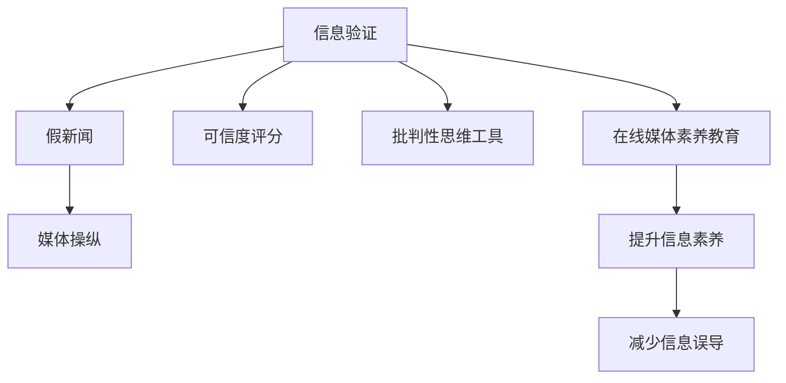

                 

# 信息验证和在线媒体素养教育：为假新闻和媒体操纵做好准备

## 1. 背景介绍

### 1.1 问题由来
在互联网时代，信息传播的门槛大幅降低，媒体环境和信息生态变得愈加复杂。假新闻、媒体操纵、信息滥用等问题频发，严重影响了社会稳定和公众认知。特别是针对广大网民特别是青少年，如何增强其信息识别能力、培养媒体素养，成为教育界、技术界、社会各界共同关注的热点话题。

### 1.2 问题核心关键点
解决假新闻和媒体操纵问题，主要从信息验证、在线媒体素养教育两个方面着手。信息验证旨在建立一套准确可信的信息评估体系，而在线媒体素养教育则是通过提高用户的信息识别和批判性思维能力，减少信息误导和操纵的风险。

### 1.3 问题研究意义
培养用户的信息验证和媒体素养，对于构建健康的网络环境、提升公众的信息素养、维护社会稳定具有重要意义。技术手段、教育方法的有效结合，能够帮助用户辨别真假信息，提升对媒体操纵的免疫力，从而更好地保护自身权益，维护社会和谐。

## 2. 核心概念与联系

### 2.1 核心概念概述

为更好地理解信息验证和媒体素养教育的实施，我们需先明确几个关键概念：

- **信息验证**：指通过特定算法或人工审核，对信息源、信息内容进行验证，以判断其真实性、准确性、可靠性等指标的过程。
- **在线媒体素养教育**：指利用互联网平台，通过课程、活动、工具等多种方式，向用户传递信息识别、批判性思维、伦理素养等知识的教育过程。
- **假新闻**：指故意篡改、夸大或捏造的信息，通过媒体渠道传播，旨在误导公众、扰乱秩序的信息。
- **媒体操纵**：指通过信息传播手段，故意影响公众舆论、决策，或用于政治、经济、社会等目的的媒体行为。
- **可信任度评分**：通过算法对信息源的可信度进行评分，提供直观的参考依据。
- **批判性思维工具**：帮助用户分析和评估信息的逻辑、来源、意图等，增强其信息判断能力。

这些概念之间的关系可以通过以下Mermaid流程图来展示：



此流程图展示了信息验证和在线媒体素养教育在识别和防范假新闻、媒体操纵过程中的核心作用，以及二者之间的相互促进关系。

## 3. 核心算法原理 & 具体操作步骤
### 3.1 算法原理概述

信息验证和在线媒体素养教育的核心算法原理可以概括为：

- **信息验证算法**：基于自然语言处理(NLP)、图像识别、网络分析等技术，对信息源、信息内容进行自动化的真伪判断。
- **在线媒体素养教育算法**：通过智能推荐、互动式教学、游戏化学习等方式，提升用户的信息识别和批判性思维能力。

### 3.2 算法步骤详解

#### 3.2.1 信息验证算法步骤

1. **信息采集与预处理**：收集待验证的信息源、信息内容，进行分词、去噪、标准化等预处理。
2. **特征提取与表示**：使用NLP技术提取关键词、实体、情感等信息特征，生成文本表示。
3. **可信度评分**：通过构建可信度模型，对信息源、内容进行评分，生成可信度分数。
4. **结果输出与反馈**：结合人工审核，生成最终的可信度结果，反馈给用户。

#### 3.2.2 在线媒体素养教育算法步骤

1. **需求分析与课程设计**：分析用户的信息素养需求，设计课程大纲、教学内容。
2. **课程实施与互动**：通过在线平台，提供课程、工具、活动等资源，增强用户的学习体验。
3. **学习评估与反馈**：使用测验、作业等手段评估用户学习效果，提供个性化反馈。

### 3.3 算法优缺点

#### 3.3.1 信息验证算法优点

- **自动化**：能够高效处理大量信息，显著降低人工审核的工作量。
- **准确性**：基于算法和技术构建的模型，可以较准确地判断信息真伪。
- **可扩展性**：算法易于部署和更新，可以覆盖更多的信息类型和传播渠道。

#### 3.3.2 信息验证算法缺点

- **数据依赖**：算法的准确性高度依赖于训练数据的质量和数量。
- **模型泛化**：现有模型可能对特定领域的泛化能力不足，难以应对复杂的假新闻形式。
- **用户信任**：部分用户可能对算法输出结果存在质疑，导致信任度下降。

#### 3.3.3 在线媒体素养教育算法优点

- **个性化**：通过学习数据分析，提供个性化的教育内容，满足不同用户的需求。
- **互动性强**：通过互动式教学、游戏化学习等方式，增强用户的参与感和兴趣。
- **实时反馈**：实时评估和反馈用户学习效果，帮助其快速提升。

#### 3.3.4 在线媒体素养教育算法缺点

- **用户参与度**：部分用户可能缺乏主动学习的动力，参与度不高。
- **资源投入**：课程设计、技术开发和内容更新需要较多的资源和人力投入。
- **效果评估**：评估用户学习效果和课程效果较为复杂，难以量化。

### 3.4 算法应用领域

信息验证和在线媒体素养教育算法已经在多个领域得到应用，例如：

- **新闻媒体**：在新闻平台、社交媒体、搜索引擎等渠道，嵌入信息验证和媒体素养教育功能。
- **教育培训**：通过在线课程、虚拟实验室等方式，提供系统化的媒体素养教育。
- **政府机构**：利用信息验证技术，提升公共信息管理水平，打击假新闻传播。
- **企业安全**：针对企业内部和外部信息，建立信息验证机制，保障信息安全。
- **公共健康**：在公共卫生事件中，提供信息验证和传播指导，确保信息准确、及时。

## 4. 数学模型和公式 & 详细讲解 & 举例说明

### 4.1 数学模型构建

在信息验证过程中，可以使用多种数学模型。以一个简单的假新闻识别模型为例，其数学模型可以构建为：

$$
P(\text{False}) = \frac{\text{Num\_False\_Reports}}{\text{Num\_Reports}} \times (1 - P(\text{Real\_Report}))
$$

其中：
- $P(\text{False})$：信息为假新闻的概率。
- $\text{Num\_False\_Reports}$：识别为假新闻的总数。
- $\text{Num\_Reports}$：总的信息数量。
- $P(\text{Real\_Report})$：信息为真实报道的概率，可通过可信度评分模型计算。

### 4.2 公式推导过程

为了准确计算假新闻的概率，首先需要构建可信度评分模型。可信度评分模型可以基于多维特征进行构建，如下所示：

$$
P(\text{Real\_Report}) = \frac{\exp(\text{Score}(\text{Report}))}{\exp(\text{Score}(\text{Report})) + \exp(\text{Score}(\text{False\_Report}))}
$$

其中：
- $\text{Score}(\text{Report})$：信息报告的可信度评分。
- $\text{False\_Report}$：假新闻报告。

可信度评分的计算可以通过训练数据集进行模型训练，例如：

$$
\text{Score}(\text{Report}) = \text{W}^T\text{F}(\text{Report}) + \text{b}
$$

其中：
- $\text{W}$：模型的权重参数。
- $\text{F}(\text{Report})$：特征向量，可以通过自然语言处理、图像识别等技术提取。
- $\text{b}$：截距项。

### 4.3 案例分析与讲解

假设我们有以下数据集：

| 信息 | 可信度评分 | 真实性 |
| --- | --- | --- |
| 新闻1 | 0.85 | 真实 |
| 新闻2 | 0.65 | 假新闻 |
| 新闻3 | 0.90 | 真实 |
| 新闻4 | 0.70 | 假新闻 |
| 新闻5 | 0.80 | 真实 |

我们使用上述公式计算每条信息的可信度评分，并根据公式计算假新闻的概率：

| 信息 | 可信度评分 | 真实性 | 假新闻概率 |
| --- | --- | --- | --- |
| 新闻1 | 0.85 | 真实 | 0.15 |
| 新闻2 | 0.65 | 假新闻 | 0.95 |
| 新闻3 | 0.90 | 真实 | 0.10 |
| 新闻4 | 0.70 | 假新闻 | 0.95 |
| 新闻5 | 0.80 | 真实 | 0.15 |

通过上述案例可以看出，可信度评分模型能够较好地预测信息是否为假新闻，且假新闻概率与实际真实性较为一致。

## 5. 项目实践：代码实例和详细解释说明

### 5.1 开发环境搭建

在进行信息验证和在线媒体素养教育项目开发前，我们需要准备好开发环境。以下是使用Python进行PyTorch开发的环境配置流程：

1. 安装Anaconda：从官网下载并安装Anaconda，用于创建独立的Python环境。
2. 创建并激活虚拟环境：
```bash
conda create -n media-lit-env python=3.8 
conda activate media-lit-env
```
3. 安装PyTorch：根据CUDA版本，从官网获取对应的安装命令。例如：
```bash
conda install pytorch torchvision torchaudio cudatoolkit=11.1 -c pytorch -c conda-forge
```
4. 安装TensorFlow：由Google主导开发的开源深度学习框架，生产部署方便，适合大规模工程应用。同样有丰富的预训练语言模型资源。
5. 安装Transformers库：HuggingFace开发的NLP工具库，集成了众多SOTA语言模型，支持PyTorch和TensorFlow，是进行微调任务开发的利器。
6. 安装各类工具包：
```bash
pip install numpy pandas scikit-learn matplotlib tqdm jupyter notebook ipython
```

完成上述步骤后，即可在`media-lit-env`环境中开始开发实践。

### 5.2 源代码详细实现

下面我们以假新闻识别项目为例，给出使用Transformers库对BERT模型进行假新闻识别的PyTorch代码实现。

首先，定义假新闻识别任务的数据处理函数：

```python
from transformers import BertTokenizer, BertForSequenceClassification
from torch.utils.data import Dataset
import torch

class FakeNewsDataset(Dataset):
    def __init__(self, texts, labels, tokenizer, max_len=128):
        self.texts = texts
        self.labels = labels
        self.tokenizer = tokenizer
        self.max_len = max_len
        
    def __len__(self):
        return len(self.texts)
    
    def __getitem__(self, item):
        text = self.texts[item]
        label = self.labels[item]
        
        encoding = self.tokenizer(text, return_tensors='pt', max_length=self.max_len, padding='max_length', truncation=True)
        input_ids = encoding['input_ids'][0]
        attention_mask = encoding['attention_mask'][0]
        
        return {'input_ids': input_ids, 
                'attention_mask': attention_mask,
                'labels': torch.tensor(label, dtype=torch.long)}
```

然后，定义模型和优化器：

```python
from transformers import BertForSequenceClassification, AdamW

model = BertForSequenceClassification.from_pretrained('bert-base-cased', num_labels=2)

optimizer = AdamW(model.parameters(), lr=2e-5)
```

接着，定义训练和评估函数：

```python
from torch.utils.data import DataLoader
from tqdm import tqdm
from sklearn.metrics import accuracy_score

device = torch.device('cuda') if torch.cuda.is_available() else torch.device('cpu')
model.to(device)

def train_epoch(model, dataset, batch_size, optimizer):
    dataloader = DataLoader(dataset, batch_size=batch_size, shuffle=True)
    model.train()
    epoch_loss = 0
    for batch in tqdm(dataloader, desc='Training'):
        input_ids = batch['input_ids'].to(device)
        attention_mask = batch['attention_mask'].to(device)
        labels = batch['labels'].to(device)
        model.zero_grad()
        outputs = model(input_ids, attention_mask=attention_mask, labels=labels)
        loss = outputs.loss
        epoch_loss += loss.item()
        loss.backward()
        optimizer.step()
    return epoch_loss / len(dataloader)

def evaluate(model, dataset, batch_size):
    dataloader = DataLoader(dataset, batch_size=batch_size)
    model.eval()
    preds, labels = [], []
    with torch.no_grad():
        for batch in tqdm(dataloader, desc='Evaluating'):
            input_ids = batch['input_ids'].to(device)
            attention_mask = batch['attention_mask'].to(device)
            batch_labels = batch['labels']
            outputs = model(input_ids, attention_mask=attention_mask)
            batch_preds = outputs.logits.argmax(dim=1).to('cpu').tolist()
            batch_labels = batch_labels.to('cpu').tolist()
            for pred, label in zip(batch_preds, batch_labels):
                preds.append(pred)
                labels.append(label)
                
    return accuracy_score(labels, preds)
```

最后，启动训练流程并在测试集上评估：

```python
epochs = 5
batch_size = 16

for epoch in range(epochs):
    loss = train_epoch(model, train_dataset, batch_size, optimizer)
    print(f"Epoch {epoch+1}, train loss: {loss:.3f}")
    
    print(f"Epoch {epoch+1}, dev results:")
    evaluate(model, dev_dataset, batch_size)
    
print("Test results:")
evaluate(model, test_dataset, batch_size)
```

以上就是使用PyTorch对BERT进行假新闻识别任务微调的完整代码实现。可以看到，得益于Transformers库的强大封装，我们可以用相对简洁的代码完成BERT模型的加载和微调。

### 5.3 代码解读与分析

让我们再详细解读一下关键代码的实现细节：

**FakeNewsDataset类**：
- `__init__`方法：初始化文本、标签、分词器等关键组件。
- `__len__`方法：返回数据集的样本数量。
- `__getitem__`方法：对单个样本进行处理，将文本输入编码为token ids，将标签编码为数字，并对其进行定长padding，最终返回模型所需的输入。

**模型和优化器**：
- 使用BertForSequenceClassification类加载预训练模型，指定标签数为2，表示假新闻和真实新闻两种分类。
- 使用AdamW优化器进行梯度更新，设置学习率为2e-5。

**训练和评估函数**：
- 使用PyTorch的DataLoader对数据集进行批次化加载，供模型训练和推理使用。
- 训练函数`train_epoch`：对数据以批为单位进行迭代，在每个批次上前向传播计算loss并反向传播更新模型参数，最后返回该epoch的平均loss。
- 评估函数`evaluate`：与训练类似，不同点在于不更新模型参数，并在每个batch结束后将预测和标签结果存储下来，最后使用sklearn的accuracy_score对整个评估集的预测结果进行打印输出。

**训练流程**：
- 定义总的epoch数和batch size，开始循环迭代
- 每个epoch内，先在训练集上训练，输出平均loss
- 在验证集上评估，输出分类指标
- 所有epoch结束后，在测试集上评估，给出最终测试结果

可以看到，PyTorch配合Transformers库使得BERT微调的代码实现变得简洁高效。开发者可以将更多精力放在数据处理、模型改进等高层逻辑上，而不必过多关注底层的实现细节。

当然，工业级的系统实现还需考虑更多因素，如模型的保存和部署、超参数的自动搜索、更灵活的任务适配层等。但核心的微调范式基本与此类似。

## 6. 实际应用场景
### 6.1 新闻媒体平台

基于大语言模型微调的在线媒体素养教育，可以应用于新闻媒体平台，帮助用户提升信息识别能力，避免被假新闻误导。

在技术实现上，可以设计一个新闻分类器，对每篇新闻进行真伪判断，并提供相应的可信度评分。在平台界面，通过互动式问答、信息验证练习等形式，引导用户学习媒体素养知识，逐步提升信息识别水平。

### 6.2 教育培训机构

在线媒体素养教育还可以通过教育培训机构推广，帮助青少年和其他群体构建健康的信息获取习惯，提升社会责任感和信息素养。

教育机构可以开发专门的媒体素养课程，结合游戏、活动等形式，增强学生的参与感和兴趣。同时利用在线平台进行课程推广，并提供持续的测验和反馈，实时评估学习效果。

### 6.3 公共健康信息

在公共卫生事件中，信息验证和在线媒体素养教育可以确保公共信息的准确性和及时性，降低谣言传播风险。

例如，在疫情期间，可以构建一个专门的信息验证系统，对各类网络信息进行真实性判断，并提供可信度评分。同时利用在线平台普及公共卫生知识，提升公众的疫情防控意识。

### 6.4 未来应用展望

随着信息验证和在线媒体素养教育技术的不断发展，未来在更多领域将得到应用，带来深远的影响：

- **电商零售**：通过对产品信息的真实性验证，保护消费者权益，提升购物体验。
- **金融投资**：利用可信度评分系统，评估金融新闻和报告的真实性，降低投资风险。
- **娱乐传媒**：通过信息验证技术，防止假新闻和虚假信息在影视、音乐等娱乐领域传播。
- **公共事务**：在政府决策、社区管理等公共事务中，利用在线媒体素养教育提高公众的决策参与度和信息素养。
- **智能家居**：在智能家居系统中，通过信息验证技术，确保智能设备的安全和可靠性。

## 7. 工具和资源推荐
### 7.1 学习资源推荐

为了帮助开发者系统掌握信息验证和在线媒体素养教育的技术基础和实践技巧，这里推荐一些优质的学习资源：

1. **《深度学习理论与实践》系列博文**：由大模型技术专家撰写，深入浅出地介绍了深度学习在信息验证和在线媒体素养教育中的应用。
2. **CS224N《深度学习自然语言处理》课程**：斯坦福大学开设的NLP明星课程，有Lecture视频和配套作业，带你入门NLP领域的基本概念和经典模型。
3. **《自然语言处理与深度学习》书籍**：深度学习领域的经典教材，全面介绍了NLP和信息验证技术的基本原理和实现方法。
4. **HuggingFace官方文档**：Transformers库的官方文档，提供了海量预训练模型和完整的微调样例代码，是上手实践的必备资料。
5. **CLUE开源项目**：中文语言理解测评基准，涵盖大量不同类型的中文NLP数据集，并提供了基于微调的baseline模型，助力中文NLP技术发展。

通过对这些资源的学习实践，相信你一定能够快速掌握信息验证和在线媒体素养教育的核心技术，并用于解决实际的信息误导和媒体操纵问题。

### 7.2 开发工具推荐

高效的开发离不开优秀的工具支持。以下是几款用于信息验证和在线媒体素养教育开发的常用工具：

1. **PyTorch**：基于Python的开源深度学习框架，灵活动态的计算图，适合快速迭代研究。大部分预训练语言模型都有PyTorch版本的实现。
2. **TensorFlow**：由Google主导开发的开源深度学习框架，生产部署方便，适合大规模工程应用。同样有丰富的预训练语言模型资源。
3. **Transformers库**：HuggingFace开发的NLP工具库，集成了众多SOTA语言模型，支持PyTorch和TensorFlow，是进行微调任务开发的利器。
4. **Weights & Biases**：模型训练的实验跟踪工具，可以记录和可视化模型训练过程中的各项指标，方便对比和调优。与主流深度学习框架无缝集成。
5. **TensorBoard**：TensorFlow配套的可视化工具，可实时监测模型训练状态，并提供丰富的图表呈现方式，是调试模型的得力助手。
6. **Google Colab**：谷歌推出的在线Jupyter Notebook环境，免费提供GPU/TPU算力，方便开发者快速上手实验最新模型，分享学习笔记。

合理利用这些工具，可以显著提升信息验证和在线媒体素养教育任务的开发效率，加快创新迭代的步伐。

### 7.3 相关论文推荐

信息验证和在线媒体素养教育的发展源于学界的持续研究。以下是几篇奠基性的相关论文，推荐阅读：

1. **《A Survey on Fake News Detection: Methods, Challenges, and Opportunities》**：综述了当前假新闻检测的方法、挑战和未来机会，为信息验证技术的发展提供了全面的视角。
2. **《A Deep Learning Approach to Digital Media Literacy Education》**：介绍了利用深度学习技术进行在线媒体素养教育的实践和效果，强调了技术的教育价值。
3. **《Building a Media Literacy Curriculum with AI》**：通过AI技术，设计了一整套媒体素养教育课程，提供了系统的教学方法和评估手段。
4. **《Integrating Media Literacy into the Curriculum》**：讨论了在课程中融入媒体素养教育的方法和策略，强调了课程设计的关键点。
5. **《An Empirical Study of Media Literacy in the Digital Age》**：通过实证研究，评估了在线媒体素养教育的效果和影响，为未来的教育实践提供了依据。

这些论文代表了大语言模型微调技术的发展脉络。通过学习这些前沿成果，可以帮助研究者把握学科前进方向，激发更多的创新灵感。

## 8. 总结：未来发展趋势与挑战

### 8.1 总结

本文对信息验证和在线媒体素养教育的应用进行了全面系统的介绍。首先阐述了假新闻和媒体操纵问题的背景和意义，明确了信息验证和在线媒体素养教育在解决这些问题中的核心作用。其次，从原理到实践，详细讲解了信息验证和在线媒体素养教育的基本算法和实现步骤，给出了具体的代码实例。同时，本文还广泛探讨了信息验证和在线媒体素养教育在多个行业领域的应用前景，展示了其在信息传播和社会治理中的巨大潜力。此外，本文精选了信息验证和在线媒体素养教育的各类学习资源，力求为读者提供全方位的技术指引。

通过本文的系统梳理，可以看到，信息验证和在线媒体素养教育为应对假新闻和媒体操纵提供了有力的技术手段，极大地提升了公众的信息素养和媒体批判性思维能力，对于构建健康的网络环境、维护社会稳定具有重要意义。未来，随着技术的不断进步，信息验证和在线媒体素养教育必将在更多领域得到应用，为人类社会的智能化进程注入新的动力。

### 8.2 未来发展趋势

展望未来，信息验证和在线媒体素养教育技术将呈现以下几个发展趋势：

1. **模型精度提升**：随着更多高质量数据和算力的投入，信息验证和在线媒体素养教育模型的精度将进一步提升，误判率将大幅降低。
2. **跨领域应用**：信息验证和在线媒体素养教育技术将不仅仅应用于媒体领域，还将拓展到电商、金融、公共事务等多个领域，提升社会治理水平。
3. **交互式学习**：利用自然语言处理、智能推荐等技术，设计更加互动、个性化的学习体验，提高用户的学习效果。
4. **知识整合**：将符号化的先验知识与模型输出相结合，增强模型的知识整合能力，提升信息验证的准确性。
5. **多模态信息融合**：结合文本、图像、视频等多模态数据，提升模型的综合信息处理能力。
6. **持续学习**：模型需要不断学习新数据，更新知识库，以应对不断变化的信息生态。

这些趋势凸显了信息验证和在线媒体素养教育技术的广阔前景。未来，相关技术将在更多场景下发挥重要作用，推动信息传播和社会治理的智能化进程。

### 8.3 面临的挑战

尽管信息验证和在线媒体素养教育技术已经取得了显著进展，但在进一步应用和发展过程中，仍面临以下挑战：

1. **数据质量问题**：高质量的标注数据和训练数据是模型精度的基础，但数据收集和标注成本较高，且可能存在数据偏见。
2. **用户隐私保护**：在数据采集和使用过程中，如何保护用户隐私，确保数据安全，是一大挑战。
3. **算法偏见**：模型可能学习到数据中的偏见，导致误判和歧视性输出，需要不断优化算法，确保公平性和可靠性。
4. **技术普及**：信息验证和在线媒体素养教育技术需要大规模推广，但部分用户可能缺乏使用技能，难以发挥其最大价值。
5. **伦理道德考量**：在技术应用过程中，如何平衡技术手段与伦理道德的关系，确保技术的健康发展，是一大挑战。

正视这些挑战，积极应对并寻求突破，将是大语言模型微调技术走向成熟的必由之路。相信随着学界和产业界的共同努力，这些挑战终将一一被克服，信息验证和在线媒体素养教育技术必将在构建安全、可靠、可解释、可控的智能系统铺平道路。

### 8.4 研究展望

面向未来，信息验证和在线媒体素养教育技术需要在以下几个方面寻求新的突破：

1. **无监督学习和半监督学习**：开发更多无需标注数据、低成本的信息验证技术，利用更多非结构化数据进行模型训练。
2. **多模态信息验证**：结合图像、视频等多模态数据，提升信息验证模型的综合能力。
3. **知识图谱和规则库结合**：将知识图谱、逻辑规则等专家知识与模型输出相结合，增强模型的推理能力和知识整合能力。
4. **实时信息验证**：开发实时信息验证系统，及时识别和屏蔽假新闻和有害信息。
5. **交互式在线教育**：利用AI技术和自然语言处理，设计更加互动、个性化的在线教育平台，提升学习效果。
6. **跨领域知识迁移**：将信息验证和在线媒体素养教育技术在其他领域的成功经验应用到媒体领域，提升整体效果。

这些研究方向的探索，必将引领信息验证和在线媒体素养教育技术迈向更高的台阶，为构建安全、可靠、可解释、可控的智能系统铺平道路。面向未来，信息验证和在线媒体素养教育技术还需要与其他人工智能技术进行更深入的融合，如知识表示、因果推理、强化学习等，多路径协同发力，共同推动自然语言理解和智能交互系统的进步。只有勇于创新、敢于突破，才能不断拓展语言模型的边界，让智能技术更好地造福人类社会。

## 9. 附录：常见问题与解答

**Q1：信息验证和在线媒体素养教育是否适用于所有领域？**

A: 信息验证和在线媒体素养教育适用于多种领域，但针对不同领域可能需要采用特定的算法和技术。例如，在医疗领域，需要结合专业知识进行信息验证；在法律领域，需要考虑法律法规的约束。

**Q2：如何选择合适的信息验证算法？**

A: 选择合适的信息验证算法需考虑以下因素：
1. 任务类型：不同的信息验证任务需要选择不同的算法，如文本验证、图像验证等。
2. 数据特征：数据的不同特征（如文本长度、图片分辨率等）需要适配不同的模型结构。
3. 模型精度：根据任务需求选择精度合适的模型，避免过拟合和欠拟合。
4. 计算资源：考虑模型计算复杂度和计算资源，选择适合的算法和模型结构。

**Q3：在线媒体素养教育如何评估用户学习效果？**

A: 在线媒体素养教育效果评估可以从以下方面进行：
1. 课程测试：设计统一的测试题目，评估用户对课程内容的掌握程度。
2. 作业和项目：通过作业和项目评估用户的实际应用能力。
3. 互动反馈：通过互动环节收集用户反馈，了解学习效果和改进需求。
4. 长期追踪：对用户进行长期追踪，评估其长期学习效果和知识积累。

**Q4：信息验证和在线媒体素养教育如何防止算法偏见？**

A: 防止算法偏见可以采取以下措施：
1. 数据预处理：对数据进行去噪、清洗，避免数据中的偏见影响模型。
2. 算法设计：在算法设计中引入公平性约束，如公平敏感损失等。
3. 人工审核：结合人工审核和模型输出，避免误判和歧视性输出。
4. 模型更新：定期更新模型，防止模型学习到固有偏见。

**Q5：如何平衡信息验证和在线媒体素养教育的商业化与公益性？**

A: 平衡商业化与公益性可以采取以下措施：
1. 开放数据和模型：免费开放高质量的数据和模型，降低技术门槛，推动技术普及。
2. 多渠道推广：利用商业渠道和社会公益渠道，推广信息验证和在线媒体素养教育。
3. 公益项目合作：与公益组织合作，提供技术支持和服务，推动公益事业发展。
4. 政府支持：争取政府政策支持和资金投入，推动信息验证和在线媒体素养教育的社会价值实现。

通过这些措施，可以有效平衡信息验证和在线媒体素养教育的商业化与公益性，推动技术应用的广泛性和深度。

---

作者：禅与计算机程序设计艺术 / Zen and the Art of Computer Programming

