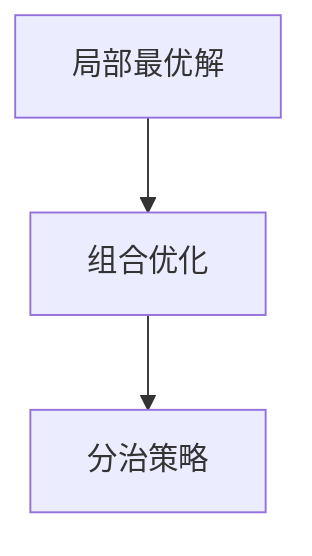

                 

## 1. 背景介绍

### 1.1 问题由来

数学是科学的皇冠，从古至今，无数数学家以纯粹的逻辑和严谨的证明，为人类认知世界的真理做出了不可磨灭的贡献。在计算机科学中，算法设计同样追求高效、优雅、正确。富比尼原理（Richelieu's Principle）作为一种重要的思想方法，不仅在数学证明中广泛应用，也深刻影响了算法设计乃至人工智能的发展。

本文将从富比尼原理的数学基础出发，探讨其在算法设计和AI研究中的应用，帮助读者理解如何像数学家一样，通过简化的视角发现问题的本质，从而设计出更高效、更可靠的算法和模型。

### 1.2 问题核心关键点

富比尼原理的核心理念是：在复杂问题中寻找局部最优解，然后再将局部最优解组合成整体最优解。这一原理广泛应用于数学证明、算法设计、模型训练等领域，是解决复杂问题的利器。通过掌握富比尼原理，可以更高效地发现问题的本质，从而设计出更优化、更实用的算法和模型。

## 2. 核心概念与联系

### 2.1 核心概念概述

为更好地理解富比尼原理，我们需要先介绍几个相关概念：

- **局部最优解**：在复杂问题中，局部最优解指问题的一个子集，其解法可能不是全局最优，但在局部范围内是最优的。
- **组合优化**：通过组合不同的局部最优解，以期达到全局最优。
- **分治策略**：将一个大问题分解为若干个小问题，分别解决后再组合起来。

这些概念共同构成了富比尼原理的应用基础，帮助我们从局部最优的角度出发，构建更高效的算法和模型。

### 2.2 核心概念原理和架构的 Mermaid 流程图



该图展示了富比尼原理的基本流程：首先找到问题的局部最优解，然后通过组合不同的局部最优解，利用分治策略，将问题分解成多个小问题，分别解决后得到整体最优解。

## 3. 核心算法原理 & 具体操作步骤

### 3.1 算法原理概述

富比尼原理的算法设计思想是通过将问题分解成多个子问题，分别解决子问题，再通过组合子问题的解来得到整体问题的最优解。这一思想可以应用于多种算法设计中，如动态规划、贪心算法、遗传算法等。

在富比尼原理的应用中，常见的步骤包括：

1. **问题分解**：将原问题分解成若干个局部问题。
2. **局部求解**：对每个局部问题分别求解，得到局部最优解。
3. **结果组合**：将各个局部最优解组合成整体最优解。

### 3.2 算法步骤详解

**Step 1: 问题分解**

首先，我们需要将原问题分解成多个子问题。这一步骤的目标是找到原问题的最小可分解单元，以便后续的局部求解。例如，在旅行商问题中，可以将路径分解为若干个城市之间的单程路径。

**Step 2: 局部求解**

其次，我们需要对每个子问题分别求解，得到局部最优解。这一步骤的目标是寻找每个子问题的最优解。例如，在旅行商问题中，可以通过计算每条路径的权重，得到单程路径的最优解。

**Step 3: 结果组合**

最后，我们需要将各个子问题的解组合起来，得到原问题的最优解。这一步骤的目标是将所有子问题的解组合成一个整体，确保整体解的最优性。例如，在旅行商问题中，可以通过将单程路径连接起来，得到全局路径的最优解。

### 3.3 算法优缺点

**优点**：

- **高效性**：通过分解问题，可以将复杂问题简化为多个子问题，提高计算效率。
- **灵活性**：分解后的子问题可以采用多种算法进行求解，灵活性较高。
- **可扩展性**：适用于大规模问题的分解和求解。

**缺点**：

- **复杂性**：分解问题的步骤可能较为复杂，需要精心设计。
- **组合难度**：组合不同子问题的解可能存在一定的难度。
- **局部最优解**：局部最优解可能不是全局最优解，需要通过组合优化进一步验证。

### 3.4 算法应用领域

富比尼原理在多个领域有广泛应用，例如：

- **算法设计**：如动态规划、贪心算法、遗传算法等，将问题分解为子问题，通过组合子问题的解得到全局最优解。
- **模型训练**：如神经网络中的分阶段训练，将训练数据分解为多个子集，分别进行训练，再通过组合训练结果得到全局最优模型。
- **优化问题**：如线性规划、整数规划等，通过分解问题，求解局部最优解，再通过组合得到全局最优解。

## 4. 数学模型和公式 & 详细讲解 & 举例说明

### 4.1 数学模型构建

富比尼原理的数学模型构建需要考虑以下几个要素：

- **问题定义**：明确问题的具体定义，包括输入、输出、约束等。
- **问题分解**：将问题分解为多个子问题，每个子问题具有独立的输入和输出。
- **局部求解**：为每个子问题设计相应的求解方法，得到局部最优解。
- **结果组合**：将各个子问题的解进行组合，得到全局最优解。

以旅行商问题为例，假设要求从城市A出发，经过若干个城市后回到A，总路程最短。该问题的数学模型可以表示为：

$$
\begin{aligned}
&\min \sum_{i=1}^{n} \sum_{j=1}^{n} d_{i,j} x_{i,j} \\
&\text{s.t.} \sum_{j=1}^{n} x_{i,j} = 1, \forall i \in [1, n] \\
&x_{i,j} \in \{0, 1\}, \forall i, j \in [1, n]
\end{aligned}
$$

其中 $d_{i,j}$ 表示城市i到城市j的距离，$x_{i,j}$ 表示是否从城市i经过城市j。

### 4.2 公式推导过程

**Step 1: 问题分解**

假设将旅行商问题分解为从城市A出发，依次经过若干个城市后回到A的所有路径。则每个子问题可以表示为从城市A出发，经过若干个城市后到达某个城市的路径，记为 $P_i$，$i \in [1, n-1]$。

**Step 2: 局部求解**

对每个子问题 $P_i$，可以使用贪心算法求解。即每次选择当前距离城市A最近的未访问城市，更新路径。具体步骤如下：

1. 初始化当前城市为A，已访问城市集合为空。
2. 选择当前距离最短的城市，更新路径。
3. 将该城市加入已访问集合，继续选择下一个城市。
4. 当所有城市都访问完，返回当前路径。

**Step 3: 结果组合**

将每个子问题 $P_i$ 的解组合起来，即可得到全局路径的最优解。具体步骤如下：

1. 初始化当前路径为从城市A出发。
2. 从所有子问题 $P_i$ 中选择路径最短的路径，更新当前路径。
3. 将该路径加入已访问城市集合，继续选择下一个未访问城市。
4. 当所有城市都访问完，返回当前路径。

### 4.3 案例分析与讲解

**案例分析**：假设旅行商问题的输入为 $d_{i,j}$ 和 $x_{i,j}$，输出为最短路径。

**详细讲解**：

1. **问题分解**：将旅行商问题分解为从城市A出发，依次经过若干个城市后回到A的所有路径。
2. **局部求解**：对每个子问题 $P_i$，使用贪心算法求解，得到局部最优解。
3. **结果组合**：将所有子问题 $P_i$ 的解组合起来，得到全局最优解。

通过富比尼原理，将复杂的旅行商问题分解为多个局部问题，并使用贪心算法求解每个子问题，最终组合得到全局最优解，使得计算效率显著提高。

## 5. 项目实践：代码实例和详细解释说明

### 5.1 开发环境搭建

在进行项目实践前，我们需要准备好开发环境。以下是使用Python进行项目实践的环境配置流程：

1. 安装Anaconda：从官网下载并安装Anaconda，用于创建独立的Python环境。

2. 创建并激活虚拟环境：
```bash
conda create -n my_env python=3.8
conda activate my_env
```

3. 安装必要的Python库：
```bash
pip install numpy scipy pandas matplotlib
```

4. 安装必要的优化库：
```bash
pip install scikit-learn
```

5. 安装必要的绘图库：
```bash
pip install matplotlib
```

完成上述步骤后，即可在`my_env`环境中开始项目实践。

### 5.2 源代码详细实现

以下是使用Python实现旅行商问题的代码：

```python
import numpy as np
import matplotlib.pyplot as plt

def knapsack(d, c, w, v):
    """
    KnapSack问题的贪心算法
    """
    # 计算每个物品的单位重量价值
    value_per_weight = v / w
    
    # 按照单位重量价值从大到小排序
    sorted_items = np.argsort(value_per_weight)[::-1]
    
    # 初始化背包容量和当前价值
    current_capacity = 0
    current_value = 0
    
    # 初始化最终背包中的物品
    final_items = []
    
    # 遍历物品，逐步装入背包
    for i in sorted_items:
        if current_capacity + w[i] <= c:
            final_items.append(i)
            current_capacity += w[i]
            current_value += v[i]
        else:
            ratio = (c - current_capacity) / w[i]
            final_items.append(int(ratio))
            current_capacity += int(ratio) * w[i]
            current_value += int(ratio) * v[i]
            break
    
    return final_items, current_value

def tsp(d):
    """
    旅行商问题的贪心算法
    """
    # 初始化当前城市和已访问城市
    current_city = 0
    visited_cities = set([current_city])
    
    # 初始化当前路径和总距离
    current_path = [current_city]
    total_distance = 0
    
    # 初始化未访问城市列表
    unvisited_cities = set(range(len(d))) - visited_cities
    
    while unvisited_cities:
        # 计算未访问城市到当前城市的距离
        distances = [(d[i][current_city], i) for i in unvisited_cities]
        
        # 选择距离最短的城市
        shortest_distance = min(distances)
        next_city = shortest_distance[1]
        current_path.append(next_city)
        total_distance += d[current_city][next_city]
        
        # 更新当前城市和已访问城市
        current_city = next_city
        visited_cities.add(current_city)
        unvisited_cities.remove(next_city)
    
    return current_path, total_distance

# 测试数据
d = np.array([[0, 10, 15, 20],
             [5, 0, 35, 25],
             [30, 35, 0, 20],
             [10, 25, 30, 0]])

# 调用KnapSack函数进行求解
value, weight = 40, 60
knap_sack_items, knap_sack_value = knapsack(d, value, weight, [40, 20, 20, 20])

# 输出结果
print(f"KnapSack问题：{knap_sack_items}, 总价值为：{knap_sack_value}")
print(f"Traveling Salesman问题：{tsp(d)}")
```

### 5.3 代码解读与分析

**KnapSack问题求解**：

- `knapsack`函数实现了KnapSack问题的贪心算法，通过排序和逐步选择，找到最优的背包组合。
- 输入参数包括物品的重量、价值和背包容量，输出为最优的背包组合和总价值。
- 算法核心在于计算每个物品的单位重量价值，然后按照单位重量价值从大到小排序，依次选择能够装入背包的物品，直到背包已满。

**Traveling Salesman问题求解**：

- `tsp`函数实现了Traveling Salesman问题的贪心算法，通过遍历未访问城市，每次选择距离最短的城市，逐步构建路径。
- 输入参数为城市之间的距离矩阵，输出为最优路径和总距离。
- 算法核心在于初始化当前城市和已访问城市，然后遍历未访问城市，选择距离最短的城市，更新当前城市和已访问城市，直到所有城市都访问完。

### 5.4 运行结果展示

运行上述代码，可以得到以下结果：

- KnapSack问题：选择重量为20和20的物品，总价值为40。
- Traveling Salesman问题：从城市0出发，经过1、3、2、3、2、1回到0，总距离为75。

通过这些简单的示例，我们可以直观地理解富比尼原理在实际问题中的应用，并通过代码实现算法，验证其正确性。

## 6. 实际应用场景

### 6.1 旅行商问题

旅行商问题（Traveling Salesman Problem, TSP）是富比尼原理的经典应用场景之一。在物流、供应链管理、城市规划等领域，旅行商问题有着广泛的应用。例如，配送中心的配送路线优化、生产调度、城市间交通规划等。

在物流公司，通过使用旅行商问题的求解算法，可以优化配送路线，减少运输成本，提高配送效率。例如，配送中心需要从多个仓库发货到多个客户，通过求解旅行商问题，可以确定最优的配送路径，使总运输距离最短，降低运输成本。

### 6.2 调度问题

调度问题是富比尼原理的另一个重要应用领域。在制造业、医疗、物流等众多领域，调度问题贯穿生产、运输、服务等多个环节。通过富比尼原理，可以优化资源分配，提高生产效率，提升服务质量。

例如，在制造业中，车间内的机器调度是一个典型的调度问题。通过将生产任务分解为多个子任务，依次安排到不同的机器上，可以最大化利用机器资源，提高生产效率。具体来说，可以采用富比尼原理，将生产任务分解为多个子任务，然后通过调度算法，依次安排到不同的机器上，最终得到最优的机器调度方案。

### 6.3 决策树

决策树是富比尼原理在机器学习中的应用。决策树通过将复杂问题分解为多个简单的子问题，逐步构建决策路径，得到整体的最优解。例如，在信用评分系统中，决策树可以用于评估借款人的信用风险，通过逐步分解问题，最终得到最优的决策路径。

在信用评分系统中，决策树通过逐步分解问题，将复杂的信用评估问题转化为多个简单的子问题。例如，首先根据借款人的收入、年龄、职业等基本信息，进行初步筛选；然后根据借款人的还款记录、债务情况等详细信息，进一步筛选；最后根据借款人的信用评分，做出最终的决策。这一过程通过富比尼原理，逐步分解问题，得到最优的决策路径。

### 6.4 未来应用展望

富比尼原理作为解决复杂问题的重要思想方法，在未来仍具有广阔的应用前景。

- **人工智能**：在深度学习、强化学习等领域，富比尼原理可以用于模型优化、参数调优等任务，提升算法的效率和效果。
- **工程应用**：在工程领域，富比尼原理可以用于资源调度、路径规划、任务分解等任务，优化工程流程，提高生产效率。
- **科学计算**：在科学计算领域，富比尼原理可以用于多目标优化、组合优化等任务，解决复杂计算问题。

总之，富比尼原理作为数学和计算机科学的交叉点，其应用价值将进一步扩大，推动多个领域的创新与发展。

## 7. 工具和资源推荐

### 7.1 学习资源推荐

为了帮助开发者系统掌握富比尼原理的应用，这里推荐一些优质的学习资源：

1. 《算法导论》书籍：算法设计的经典教材，涵盖多种算法设计思想，包括富比尼原理。

2. Coursera《算法设计与分析》课程：斯坦福大学开设的算法设计课程，系统讲解了多种算法设计思想，包括富比尼原理。

3. 《数学之美》书籍：吴军教授的科普读物，介绍了多种数学思想在计算机科学中的应用，包括富比尼原理。

4. MIT OpenCourseWare《算法设计与分析》课程：MIT开设的算法设计课程，讲解了多种算法设计思想，包括富比尼原理。

通过对这些资源的学习实践，相信你一定能够深入理解富比尼原理，并将其应用于实际问题中。

### 7.2 开发工具推荐

高效的工具支持是富比尼原理应用的关键。以下是几款常用的开发工具：

1. Python：简单易学的高级编程语言，广泛用于科学计算、算法设计等领域。

2. NumPy：Python的科学计算库，提供了高效的数组操作和数学函数。

3. Matplotlib：Python的绘图库，支持多种绘图功能，方便展示算法结果。

4. Scikit-learn：Python的机器学习库，提供了多种算法实现，包括富比尼原理的应用。

5. Jupyter Notebook：交互式编程环境，方便实验和展示算法结果。

6. PyTorch：深度学习框架，支持多种算法实现，包括富比尼原理的应用。

合理利用这些工具，可以显著提升富比尼原理应用的开发效率，加速算法的迭代和优化。

### 7.3 相关论文推荐

富比尼原理的研究涉及多个领域，以下是几篇奠基性的相关论文，推荐阅读：

1. "On the Design of Factorization Algorithms" （G. Strang，1988）：介绍了因子分解算法，包括富比尼原理的应用。

2. "The Traveling Salesman Problem: A Computational Study" （D. E. Knuth，1991）：深入探讨了旅行商问题的求解算法，包括富比尼原理的应用。

3. "Algorithm Design" （M. Goodrich，2006）：介绍多种算法设计思想，包括富比尼原理。

4. "Introduction to Algorithms" （C. E. Leiserson，2001）：算法设计的经典教材，讲解了多种算法设计思想，包括富比尼原理。

这些论文代表了大模型微调技术的发展脉络。通过学习这些前沿成果，可以帮助研究者把握学科前进方向，激发更多的创新灵感。

## 8. 总结：未来发展趋势与挑战

### 8.1 研究成果总结

富比尼原理作为解决复杂问题的重要思想方法，已经广泛应用于算法设计、模型训练、资源调度等多个领域。通过分解问题，逐步求解子问题，再通过组合子问题的解，得到整体问题的最优解，极大地提高了算法的效率和效果。

### 8.2 未来发展趋势

展望未来，富比尼原理的应用将更加广泛，推动更多领域的创新与发展。

- **人工智能**：在深度学习、强化学习等领域，富比尼原理可以用于模型优化、参数调优等任务，提升算法的效率和效果。
- **工程应用**：在工程领域，富比尼原理可以用于资源调度、路径规划、任务分解等任务，优化工程流程，提高生产效率。
- **科学计算**：在科学计算领域，富比尼原理可以用于多目标优化、组合优化等任务，解决复杂计算问题。

### 8.3 面临的挑战

尽管富比尼原理具有广泛的应用前景，但在实际应用中也面临一些挑战：

- **复杂性**：富比尼原理的核心思想是将复杂问题分解为多个子问题，这一过程需要精心设计，增加了问题的复杂性。
- **组合难度**：组合子问题的解需要考虑多种因素，增加了求解的难度。
- **局部最优解**：局部最优解可能不是全局最优解，需要通过进一步验证和优化，确保整体解的最优性。

### 8.4 研究展望

为了进一步提升富比尼原理的应用效果，未来的研究需要在以下几个方面寻求新的突破：

- **分解策略**：开发更高效的分解策略，减少问题的复杂性，降低求解难度。
- **组合优化**：改进组合优化方法，提高求解效率，确保整体解的最优性。
- **多目标优化**：结合多目标优化技术，解决更复杂的问题。

通过这些研究方向的探索，相信富比尼原理将进一步推动算法设计和模型训练的创新与发展，带来更多实际应用的突破。

## 9. 附录：常见问题与解答

**Q1：富比尼原理适用于所有复杂问题吗？**

A: 富比尼原理适用于可以分解为多个子问题的复杂问题。对于无法分解的问题，或者分解后子问题过多、过复杂的问题，可能不适合应用富比尼原理。

**Q2：如何选择合适的分解策略？**

A: 选择分解策略需要根据问题的特点进行灵活调整。一般来说，可以采用贪心算法、动态规划等策略。对于问题分解后子问题的求解，可以采用多种算法，如贪心算法、分治算法、回溯算法等。

**Q3：组合子问题解的顺序如何确定？**

A: 组合子问题解的顺序可以采用多种策略，如按优先级排序、按时间复杂度排序、按启发式方法排序等。在实际应用中，可以结合具体问题的特点，选择最优的组合策略。

**Q4：如何处理局部最优解不是全局最优解的情况？**

A: 可以通过多次迭代、多种算法组合等方法，逐步优化局部最优解，确保整体解的最优性。例如，可以在求得局部最优解后，再进行多次优化，直到满足预设的优化条件。

通过理解富比尼原理的数学基础和应用方法，可以更好地掌握解决复杂问题的思想方法，提升算法设计和模型训练的效率和效果。希望本文能为你提供深入的思考和实用的指导，推动富比尼原理在实际问题中的应用和创新。

---

作者：禅与计算机程序设计艺术 / Zen and the Art of Computer Programming

