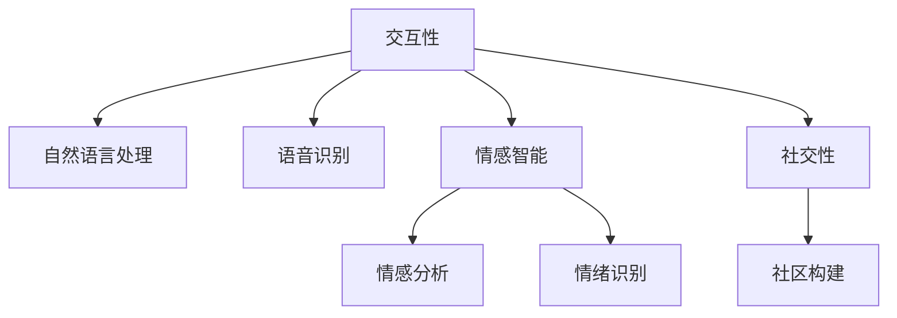
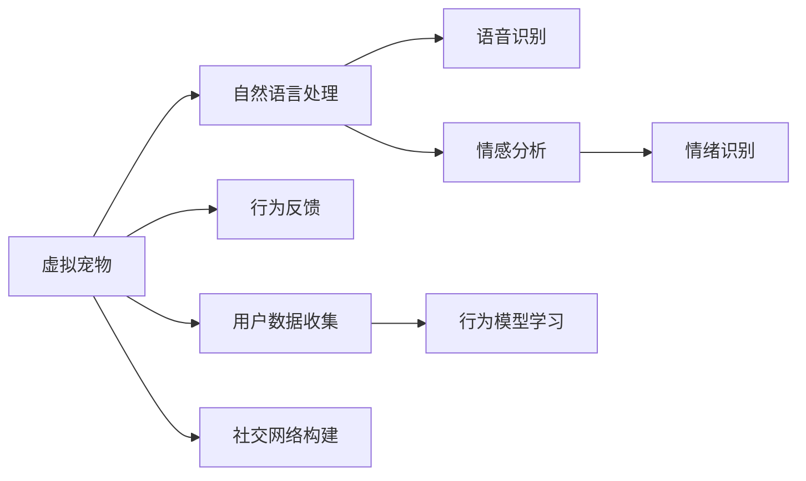

                 

# 元宇宙中的虚拟宠物:情感陪伴的新形式

## 1. 背景介绍

随着技术的演进和社会的变化，人类对数字化生存的追求愈发强烈。虚拟现实(VR)、增强现实(AR)、区块链、云计算等新兴技术纷纷涌现，共同催生了元宇宙(Metaverse)的初步形态。元宇宙不再局限于虚拟空间的游戏、娱乐，它开始融入人类社会的各个方面，提供了前所未有的沉浸式体验。

在元宇宙中，人类不仅生活在数字世界中，还与之进行互动、交流，甚至创造价值。而情感陪伴，作为人类最基本的需求之一，也正在迎来一场革命。传统的人工智能(AI)情感陪伴技术在元宇宙中得到全新的发展空间，以虚拟宠物为代表的新型情感陪伴形式应运而生，为人们的虚拟生活带来更深的情感连接和心理慰藉。

## 2. 核心概念与联系

### 2.1 核心概念概述

在元宇宙中，虚拟宠物扮演着情感陪伴的重要角色。它不仅是一个有灵魂的“动物”，更是人类在数字世界中的朋友。虚拟宠物与人类之间通过模拟的自然语言交互，能够进行情感表达、情绪识别和行为反馈，提供了丰富的情感互动体验。

元宇宙虚拟宠物的核心要素包括：
- **交互性**：通过自然语言处理(NLP)、语音识别等技术，使虚拟宠物能够理解并回应用户的指令和情感表达。
- **自主性**：虚拟宠物能够自主学习用户行为模式，调整行为策略，提供个性化体验。
- **情感智能**：通过情感分析技术，识别用户情感状态，并给出相应的情感回应，提供心理支持。
- **社交性**：虚拟宠物可以与其他虚拟宠物或人类用户互动，构建社群，增强社交属性。

这些要素构成了元宇宙虚拟宠物的核心功能模块，形成了复杂的交互网络。下图展示了虚拟宠物核心概念的联系：



### 2.2 核心概念原理和架构的 Mermaid 流程图

在元宇宙中，虚拟宠物与用户之间的交互是建立在多种AI技术基础上的。下图展示了虚拟宠物的核心技术架构：



这个架构展示了虚拟宠物与用户交互的流程，主要包括自然语言处理、语音识别、情感分析、情绪识别、行为反馈和社交网络构建等技术模块。

## 3. 核心算法原理 & 具体操作步骤

### 3.1 算法原理概述

元宇宙虚拟宠物的核心算法原理主要涉及自然语言处理、情感分析、语音识别、行为建模和社交网络构建等多个领域。以情感智能模块为例，其核心算法包括：

- **情感分类**：对用户的文本输入进行情感分类，识别用户的情感状态。
- **情绪识别**：分析用户的语音或文字输入，识别其中的情绪波动，如愤怒、悲伤、快乐等。
- **情感回应**：根据用户的情感状态和情绪波动，生成合适的情感回应，如安慰、鼓励、陪伴等。

### 3.2 算法步骤详解

以下是元宇宙虚拟宠物情感智能模块的主要算法步骤：

**Step 1: 数据准备**
- 收集用户的历史文本和语音数据，准备用于训练和验证模型。

**Step 2: 情感分类模型训练**
- 使用标记好的情感数据集训练情感分类模型，如使用卷积神经网络(CNN)或循环神经网络(RNN)。

**Step 3: 情绪识别模型训练**
- 使用标记好的情绪数据集训练情绪识别模型，如使用长短时记忆网络(LSTM)或注意力机制。

**Step 4: 情感回应生成**
- 根据用户的情感状态和情绪波动，选择对应的情感回应模板，使用生成对抗网络(GAN)或自回归模型生成自然语言或语音回应。

**Step 5: 反馈与调整**
- 根据用户对情感回应的反馈，调整情感分类、情绪识别和情感回应生成模型的参数，持续优化模型性能。

### 3.3 算法优缺点

元宇宙虚拟宠物情感智能模块的算法优点包括：
- **高准确率**：通过深度学习模型训练，能够实现高精度的情感分类和情绪识别。
- **实时性**：算法在用户输入后能够快速响应，提供即时的情感支持。
- **个性化**：通过不断的反馈调整，能够实现个性化的情感回应，提高用户体验。

算法缺点包括：
- **高成本**：数据标注和模型训练需要大量人力和资源。
- **解释性不足**：深度学习模型通常是“黑盒”，难以解释其内部决策过程。
- **泛化能力有限**：不同用户的情感表达方式多样，模型可能需要针对特定用户进行定制。

### 3.4 算法应用领域

元宇宙虚拟宠物的情感智能模块不仅适用于娱乐应用，还可以拓展到教育、医疗、心理辅导等多个领域。例如：

- **教育**：在虚拟教室中，虚拟宠物可以陪伴学生学习，提供心理支持，增强学习体验。
- **医疗**：在医院环境中，虚拟宠物可以陪伴病患，提供心理安慰，缓解焦虑情绪。
- **心理辅导**：在心理咨询过程中，虚拟宠物可以与患者互动，提供情感支持，促进康复。

## 4. 数学模型和公式 & 详细讲解 & 举例说明

### 4.1 数学模型构建

元宇宙虚拟宠物的情感智能模块主要涉及以下几个数学模型：

- **情感分类模型**：使用卷积神经网络(CNN)或循环神经网络(RNN)，将用户输入文本转化为情感标签。
- **情绪识别模型**：使用长短时记忆网络(LSTM)或注意力机制，将用户输入文本或语音转化为情绪标签。
- **情感回应生成模型**：使用生成对抗网络(GAN)或自回归模型，生成自然语言或语音回应。

### 4.2 公式推导过程

以情感分类模型为例，其公式推导如下：

假设输入文本为 $x$，情感标签为 $y \in \{p, n\}$，其中 $p$ 表示正面情感，$n$ 表示负面情感。使用卷积神经网络对输入文本进行特征提取，将特征输入到全连接层进行分类：

$$
y = \sigma(Wx + b)
$$

其中 $W$ 和 $b$ 为分类器的参数，$\sigma$ 为激活函数。通过最小化损失函数 $L = \mathbb{E}[\ell(y, \hat{y})]$，使用反向传播算法更新模型参数，实现情感分类。

### 4.3 案例分析与讲解

假设某用户输入了文本“最近工作太累了，感觉情绪很低落”，情感分类模型首先需要对文本进行预处理，提取特征：

$$
x' = \text{preprocess}(x)
$$

然后，将特征输入卷积神经网络中进行特征提取和分类：

$$
y = \sigma(Wx' + b)
$$

最后，根据分类结果，生成情感回应，如“朋友，来和我聊聊吧，别太累了，你的感受很重要”。

## 5. 项目实践：代码实例和详细解释说明

### 5.1 开发环境搭建

在开发元宇宙虚拟宠物的情感智能模块时，需要搭建一个支持深度学习的Python环境，主要步骤如下：

1. 安装Python 3.7及以上版本。
2. 安装深度学习框架TensorFlow或PyTorch，以及相关库。
3. 安装数据处理和可视化库，如NumPy、Pandas、Matplotlib等。

### 5.2 源代码详细实现

以下是一个简单的情感分类模型的代码实现：

```python
import tensorflow as tf
from tensorflow.keras import layers

# 定义情感分类模型
model = tf.keras.Sequential([
    layers.Embedding(input_dim=vocab_size, output_dim=embedding_dim, input_length=max_len),
    layers.Conv1D(filters=32, kernel_size=3, activation='relu'),
    layers.GlobalMaxPooling1D(),
    layers.Dense(units=1, activation='sigmoid')
])

# 编译模型
model.compile(optimizer='adam', loss='binary_crossentropy', metrics=['accuracy'])

# 训练模型
model.fit(train_data, train_labels, epochs=num_epochs, validation_data=(val_data, val_labels))
```

### 5.3 代码解读与分析

以上代码实现了一个简单的情感分类模型。首先定义了一个包含嵌入层、卷积层、池化层和全连接层的深度神经网络。然后，使用交叉熵损失函数进行编译，并在训练数据上训练模型，同时使用验证数据集进行验证。

## 6. 实际应用场景

### 6.1 社交媒体

在社交媒体平台上，元宇宙虚拟宠物可以作为一个情感伴侣，陪伴用户浏览内容，提供心理支持。例如，当用户发布负面状态时，虚拟宠物可以给出安慰或鼓励的话语，帮助用户缓解情绪。

### 6.2 在线教育

在在线教育平台中，虚拟宠物可以陪伴学生学习，提供个性化辅导和情感支持。例如，当学生遇到难题或情绪低落时，虚拟宠物可以提供适当的帮助或安慰。

### 6.3 心理健康

在心理健康应用中，虚拟宠物可以成为用户的情感伴侣，帮助用户进行心理疏导和情感调节。例如，当用户进行心理辅导时，虚拟宠物可以陪伴用户，提供情感支持和心理安慰。

### 6.4 未来应用展望

未来，随着元宇宙的发展和技术的进步，元宇宙虚拟宠物的应用场景将更加丰富。例如，在虚拟办公室中，虚拟宠物可以陪伴员工工作，提供情感支持；在虚拟家庭中，虚拟宠物可以陪伴孩子游戏，提供教育支持；在虚拟城市中，虚拟宠物可以成为市民的情感伴侣，提供社区互动。

## 7. 工具和资源推荐

### 7.1 学习资源推荐

为了帮助开发者系统掌握元宇宙虚拟宠物的开发技术，以下是一些优质的学习资源：

1. **《Python深度学习》**：由Francois Chollet撰写，全面介绍了深度学习的基础知识和实践技巧。
2. **《自然语言处理入门》**：由斯坦福大学开设的课程，涵盖自然语言处理的基本概念和经典模型。
3. **《生成对抗网络》**：由Ian Goodfellow等人撰写，深入讲解了GAN的基本原理和应用。
4. **《深度学习入门》**：由斋藤康毅撰写，涵盖深度学习的基本理论和实践技巧。
5. **《元宇宙技术白皮书》**：全面介绍了元宇宙的核心技术和应用场景。

通过对这些资源的学习实践，相信你一定能够快速掌握元宇宙虚拟宠物的开发技术，并用于解决实际的情感陪伴问题。

### 7.2 开发工具推荐

元宇宙虚拟宠物的开发需要借助多种AI技术和工具，以下是几款常用的开发工具：

1. **TensorFlow**：由Google主导开发的深度学习框架，支持分布式训练和部署。
2. **PyTorch**：由Facebook主导开发的深度学习框架，灵活易用，适合研究和原型开发。
3. **OpenAI GPT**：一个强大的自然语言处理模型，可以用于情感分析、语言生成等任务。
4. **IBM Watson**：提供了一系列AI服务，包括情感分析、语音识别等，支持元宇宙应用开发。
5. **Unity**：一个游戏引擎，支持3D场景和用户交互，适合开发虚拟宠物应用。

合理利用这些工具，可以显著提升元宇宙虚拟宠物的开发效率，加快创新迭代的步伐。

### 7.3 相关论文推荐

元宇宙虚拟宠物的研究离不开学界的持续探索。以下是几篇奠基性的相关论文，推荐阅读：

1. **《元宇宙：从概念到技术》**：全面介绍了元宇宙的核心技术和应用场景。
2. **《虚拟宠物在虚拟现实中的应用》**：探讨了虚拟宠物在虚拟现实中的情感互动和行为反馈。
3. **《情感智能技术的发展与挑战》**：讨论了情感智能技术在各个领域的应用和发展趋势。
4. **《生成对抗网络在自然语言处理中的应用》**：介绍了GAN在文本生成、情感分析等任务中的应用。

这些论文代表了大语言模型微调技术的发展脉络。通过学习这些前沿成果，可以帮助研究者把握学科前进方向，激发更多的创新灵感。

## 8. 总结：未来发展趋势与挑战

### 8.1 总结

本文对元宇宙中的虚拟宠物进行了全面系统的介绍。首先阐述了虚拟宠物在元宇宙中的重要性和应用场景，明确了虚拟宠物在情感陪伴、社交互动等方面的独特价值。其次，从原理到实践，详细讲解了虚拟宠物的核心算法原理和具体操作步骤，给出了虚拟宠物开发的全代码实例。同时，本文还广泛探讨了虚拟宠物在社交媒体、在线教育、心理健康等多个领域的应用前景，展示了虚拟宠物范式的巨大潜力。此外，本文精选了虚拟宠物技术的各类学习资源，力求为读者提供全方位的技术指引。

通过本文的系统梳理，可以看到，元宇宙虚拟宠物正在成为情感陪伴的重要工具，极大地丰富了用户的虚拟生活体验。未来，随着技术的进步和应用的拓展，元宇宙虚拟宠物将进一步融入人们的生活，成为情感支持和社交互动的重要伙伴。

### 8.2 未来发展趋势

展望未来，元宇宙虚拟宠物将呈现以下几个发展趋势：

1. **智能化提升**：未来的虚拟宠物将更加智能化，具备更强的情感理解和表达能力，能够提供更加个性化和自然化的情感互动体验。
2. **跨领域融合**：虚拟宠物将与更多的技术领域进行融合，如虚拟现实、增强现实、人工智能等，提升其应用范围和价值。
3. **多模态交互**：未来的虚拟宠物将支持多种交互形式，如语音、图像、手势等，提升用户体验。
4. **情感共情**：虚拟宠物将通过更先进的技术手段，理解用户的情感状态，提供更准确和有效的情感支持。
5. **社区构建**：虚拟宠物将与用户构建社区，形成虚拟社交网络，增强用户粘性和互动性。

这些趋势凸显了元宇宙虚拟宠物的发展前景，将为人们带来更加丰富和深刻的虚拟生活体验。

### 8.3 面临的挑战

尽管元宇宙虚拟宠物在情感陪伴方面展现了巨大的潜力，但在实际应用中也面临诸多挑战：

1. **数据隐私**：虚拟宠物需要收集用户的数据进行情感分析，如何保护用户隐私，确保数据安全，是一大难题。
2. **算法鲁棒性**：虚拟宠物的情感智能模块需要在多样化的用户环境中保持稳定，避免模型偏见和误判。
3. **交互体验**：虚拟宠物的交互体验需要不断优化，提升自然度和流畅性，避免生硬和机械。
4. **跨平台兼容性**：虚拟宠物需要在不同平台和设备上进行流畅的交互，这需要开发者的努力和优化。
5. **用户接受度**：虚拟宠物的推广和应用需要用户接受，这需要通过不断的市场教育和用户体验优化来实现。

这些挑战需要开发者和技术研究者共同应对，不断优化虚拟宠物的技术和应用。

### 8.4 研究展望

面对元宇宙虚拟宠物面临的挑战，未来的研究需要在以下几个方面寻求新的突破：

1. **数据隐私保护**：研究更先进的数据加密和隐私保护技术，确保用户数据的安全性和隐私性。
2. **算法鲁棒性提升**：开发更鲁棒的情感智能算法，提升模型的泛化能力和抗干扰能力。
3. **交互体验优化**：通过多模态交互和自然语言处理技术，提升虚拟宠物的交互自然度和流畅性。
4. **跨平台兼容性**：开发跨平台的虚拟宠物系统，确保在不同设备上的一致性和流畅性。
5. **用户接受度提升**：通过市场教育和用户体验优化，提升用户对虚拟宠物的接受度和使用意愿。

这些研究方向的探索，必将引领元宇宙虚拟宠物技术迈向更高的台阶，为人们带来更加丰富和深刻的虚拟生活体验。总之，元宇宙虚拟宠物需要开发者和技术研究者共同努力，不断优化和创新，方能实现其巨大的应用潜力。

## 9. 附录：常见问题与解答

**Q1: 元宇宙虚拟宠物与传统宠物有何不同？**

A: 元宇宙虚拟宠物与传统宠物的最大不同在于其虚拟性和技术性。虚拟宠物可以在数字世界中陪伴用户，提供情感支持，而传统宠物则需要物理存在。虚拟宠物具备智能化的情感理解和回应能力，可以通过算法和AI技术进行优化和升级，而传统宠物则需要人类的悉心照料和陪伴。

**Q2: 如何设计虚拟宠物的情感回应策略？**

A: 设计虚拟宠物的情感回应策略需要考虑以下几个方面：
1. **用户情感识别**：通过情感分类和情绪识别技术，了解用户的情感状态。
2. **情感回应生成**：根据用户的情感状态，选择合适的回应模板，使用生成对抗网络或自回归模型生成自然语言或语音回应。
3. **反馈调整**：根据用户对情感回应的反馈，不断调整情感分类和回应生成模型的参数，提升回应效果。

**Q3: 虚拟宠物如何实现跨平台兼容性？**

A: 实现虚拟宠物的跨平台兼容性需要以下步骤：
1. 统一交互协议：设计统一的交互协议，确保不同平台上的虚拟宠物可以进行交互。
2. 跨平台部署：在不同平台上部署虚拟宠物，确保其兼容性和一致性。
3. 优化性能：根据不同平台的性能要求，优化虚拟宠物的计算图和算法，确保流畅的交互体验。

**Q4: 虚拟宠物的情感智能模块是否可以实时调整？**

A: 虚拟宠物的情感智能模块可以通过不断的反馈调整和模型更新，实现实时调整。例如，通过用户反馈和情感分类模型，实时更新情感回应生成模型的参数，提升回应的准确性和自然度。

**Q5: 虚拟宠物在情感智能模块中如何使用多模态数据？**

A: 虚拟宠物在情感智能模块中使用多模态数据可以通过以下步骤：
1. 收集多模态数据：如文本、语音、图像等。
2. 数据预处理：对多模态数据进行预处理，提取特征。
3. 模型融合：使用多模态融合技术，将不同模态的数据整合到情感智能模型中。
4. 情感分类和回应生成：通过多模态数据进行情感分类和回应生成，提升情感回应的准确性和自然度。

---

作者：禅与计算机程序设计艺术 / Zen and the Art of Computer Programming

