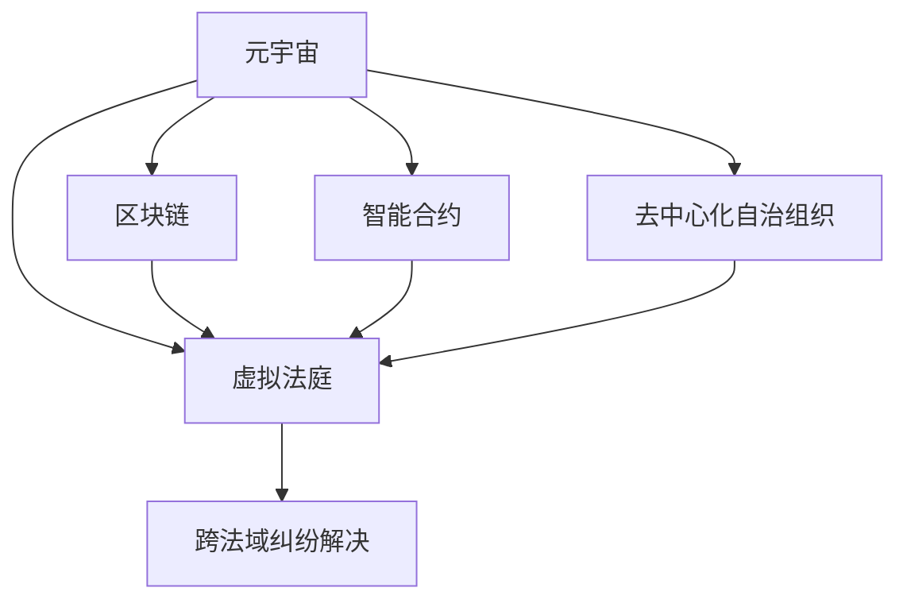

                 

# 元宇宙中的虚拟法庭：跨国纠纷解决的新平台

> 关键词：虚拟法庭, 元宇宙, 跨法域纠纷, 智能合约, 区块链技术, 数字化转型

## 1. 背景介绍

### 1.1 问题由来
随着互联网技术的发展，跨境电商、数字资产交易等新型经济模式迅速崛起。然而，与之伴随的跨国纠纷解决难题也日益凸显，传统的诉讼、仲裁方式效率低下、成本高昂、过程繁琐，难以适应新时代下高效、便捷的纠纷解决需求。

在传统法律体系下，跨国纠纷的解决往往需要耗费大量的时间和资源，且最终结果受制于双方法律体系的差异和冲突。随着全球经济一体化进程加快，尤其是全球化经济新秩序的建立，企业在全球范围内的运营和合作日益频繁，对高效、便捷的纠纷解决机制的需求愈发迫切。

### 1.2 问题核心关键点
如何构建一个安全、透明、高效、全球适用的跨国纠纷解决平台？在这一过程中，如何结合法律、技术、商业等各个领域的特点，打破法律、文化和地域的壁垒，是一个重要的研究课题。

### 1.3 问题研究意义
构建元宇宙中的虚拟法庭，通过区块链、智能合约等技术，创新性地提出了一套全新的跨国纠纷解决机制。其研究意义在于：

1. **提高效率**：通过虚拟法庭系统，可以大幅度降低跨国纠纷解决的时间和成本，提升法律服务效率。
2. **增强透明性**：通过区块链技术，保证纠纷解决过程的公开透明，增强各方的信任。
3. **实现公平性**：通过智能合约机制，确保司法判决的公正公平，避免法律体系差异带来的不公。
4. **推动法律数字化转型**：虚拟法庭的构建，有助于推动传统法律体系向数字化、智能化方向转型。
5. **促进国际合作**：通过元宇宙平台，促进不同法律体系之间的合作与交流，推动全球法治一体化进程。

## 2. 核心概念与联系

### 2.1 核心概念概述

为更好地理解元宇宙中虚拟法庭的构建原理，本节将介绍几个核心概念：

- **元宇宙(Metaverse)**：通过虚拟现实(VR)、增强现实(AR)等技术，构建一个沉浸式、可交互的数字空间。
- **虚拟法庭(Virtual Court)**：以数字化的方式模拟传统法庭的纠纷解决流程，提供全过程的在线服务。
- **区块链(Blockchain)**：一种去中心化的分布式账本技术，具有不可篡改、可追溯等特性。
- **智能合约(Smart Contract)**：一种通过区块链代码实现的自动执行合约，无需第三方干预。
- **去中心化自治组织(DAO)**：一种通过区块链和智能合约组成的自治组织，具有高度的自治性和透明度。
- **跨法域纠纷(Cross-Jurisdictional Dispute)**：涉及多个法律体系的纠纷，包括跨国、跨地区等。

这些核心概念之间的关系可以通过以下Mermaid流程图来展示：



这个流程图展示了元宇宙、虚拟法庭、区块链、智能合约、去中心化自治组织等关键概念之间的逻辑关系：

1. 元宇宙通过虚拟现实、增强现实等技术，提供了纠纷解决的数字化空间。
2. 虚拟法庭基于元宇宙构建，提供在线纠纷解决服务。
3. 区块链技术为虚拟法庭提供可信的数据存储和传输机制。
4. 智能合约实现了自动化的纠纷解决过程，避免了人为干预。
5. 去中心化自治组织增强了虚拟法庭的自治性和透明度。
6. 虚拟法庭通过结合上述技术，实现了高效、透明、公平的跨法域纠纷解决。

## 3. 核心算法原理 & 具体操作步骤
### 3.1 算法原理概述

元宇宙中的虚拟法庭通过区块链、智能合约等技术，构建了一个基于去中心化的纠纷解决平台。其核心思想是：利用智能合约机制，将法律规则和纠纷解决流程编码为可执行的代码，实现自动化的纠纷解决。

具体而言，虚拟法庭的工作流程如下：

1. **合同签订**：用户通过区块链技术，在虚拟法庭上签订智能合约，明确双方的权利义务和纠纷解决机制。
2. **纠纷触发**：当合同条件被违反时，智能合约自动触发，进入纠纷解决流程。
3. **证据提交**：双方在虚拟法庭上提交证据，并通过区块链技术进行验证和存储。
4. **仲裁调解**：虚拟法庭上的第三方仲裁员对证据进行审查，并根据法律规则和智能合约的约定进行调解或判决。
5. **执行判决**：一旦判决被执行，智能合约将自动执行，并将判决结果记录在区块链上，确保透明度和不可篡改性。

### 3.2 算法步骤详解

以下是元宇宙虚拟法庭的具体操作步骤：

**Step 1: 构建虚拟法庭平台**
- 开发虚拟法庭应用，提供合同签订、证据提交、调解仲裁等功能模块。
- 选择适合的区块链平台（如Ethereum、Binance Smart Chain等），建立智能合约运行的区块链网络。

**Step 2: 设计智能合约**
- 根据纠纷解决的规则，设计智能合约的逻辑流程和数据结构。
- 确保智能合约的可执行性和透明性，编写清晰详细的代码。

**Step 3: 进行法律适配**
- 结合不同法域的法律规则，对智能合约进行适配，确保其在不同法域的适用性。
- 对智能合约中的法律条款进行审查和修改，确保其符合各法域的法律标准。

**Step 4: 部署智能合约**
- 在选择的区块链平台上，发布和部署智能合约，并进行测试验证。
- 确保智能合约能够正确执行，且具备较高的安全性和可靠性。

**Step 5: 用户注册与纠纷提交**
- 用户通过虚拟法庭平台进行注册，并签订智能合约。
- 当纠纷发生时，用户提交相关证据，并发起智能合约的执行请求。

**Step 6: 仲裁员介入与调解**
- 虚拟法庭上的第三方仲裁员对证据进行审查，并根据智能合约的规则进行调解或判决。
- 仲裁员的选择应考虑其专业背景和经验，确保调解的公正性和权威性。

**Step 7: 判决执行与记录**
- 一旦判决被执行，智能合约自动执行，并将判决结果记录在区块链上。
- 各方可以通过区块链平台查询和验证判决结果，确保其公开透明。

### 3.3 算法优缺点

元宇宙中的虚拟法庭具备以下优点：

1. **高效便捷**：通过智能合约和区块链技术，实现全过程自动化，大幅度降低纠纷解决的时间和成本。
2. **透明公正**：利用区块链的不可篡改和可追溯特性，确保纠纷解决过程的公开透明，增强各方的信任。
3. **智能灵活**：智能合约的自动化执行机制，减少了人为干预，提高了纠纷解决的公正性和准确性。
4. **跨法域适用**：结合不同法域的法律规则，确保智能合约在全球范围内的适用性。

同时，也存在以下缺点：

1. **技术复杂性高**：区块链、智能合约等技术门槛较高，需要投入大量资源进行研发和维护。
2. **法律适应性差**：不同法域的法律差异较大，难以全面适配，可能存在法律适用性的问题。
3. **执行难度大**：尽管智能合约可以自动执行，但在实际执行过程中，仍需第三方介入，可能导致执行难度增大。
4. **数据隐私问题**：区块链的公开透明特性，可能涉及用户隐私数据的泄露，需要采取隐私保护措施。

### 3.4 算法应用领域

元宇宙中的虚拟法庭具有广泛的适用领域，包括但不限于：

- **跨境电商纠纷**：通过虚拟法庭平台，快速解决跨境电商中的交易纠纷，提升消费者和商家满意度。
- **数字资产交易纠纷**：处理数字资产交易中的盗窃、欺诈等纠纷，保护数字资产的安全和合法性。
- **国际知识产权纠纷**：利用虚拟法庭平台，解决跨国知识产权纠纷，保护创新成果。
- **国际劳动争议**：通过虚拟法庭平台，快速解决跨国劳动争议，保障劳动者的合法权益。
- **国际环境纠纷**：解决跨国环境污染纠纷，推动国际环保合作。

## 4. 数学模型和公式 & 详细讲解 & 举例说明
### 4.1 数学模型构建

在元宇宙中的虚拟法庭中，智能合约的自动化执行过程可以通过数学模型进行建模。以下以一个简单的智能合约纠纷解决模型为例：

假设在一个跨国买卖合同中，双方签订了智能合约，约定一旦卖方未能按时交货，买方可以自动提出仲裁请求。智能合约的执行流程可以用以下数学模型进行描述：

**Step 1: 合同签订**
- 设定智能合约的参数：交货时间、违约惩罚金等。
- 确保智能合约的可执行性和透明性，编写清晰详细的代码。

**Step 2: 纠纷触发**
- 当卖方未能按时交货时，智能合约自动触发，进入纠纷解决流程。

**Step 3: 证据提交**
- 买方在虚拟法庭上提交违约证据，并通过区块链技术进行验证和存储。
- 智能合约验证证据的真实性和合法性，确保调解的公正性。

**Step 4: 仲裁调解**
- 虚拟法庭上的第三方仲裁员对证据进行审查，并根据智能合约的规则进行调解或判决。
- 仲裁员的选择应考虑其专业背景和经验，确保调解的公正性和权威性。

**Step 5: 判决执行**
- 一旦判决被执行，智能合约自动执行，并将判决结果记录在区块链上。
- 各方可以通过区块链平台查询和验证判决结果，确保其公开透明。

### 4.2 公式推导过程

以违约惩罚金的计算为例，假设智能合约中约定了卖方未能按时交货时，需支付违约金 $P$，违约金计算公式如下：

$$
P = k \times (T - T_0)
$$

其中，$k$ 为违约金系数，$T$ 为合同约定的交货时间，$T_0$ 为实际交货时间。

**Step 1: 合同签订**
- 设定智能合约的违约金系数 $k$，确保其透明性和可执行性。

**Step 2: 纠纷触发**
- 当卖方未能按时交货时，智能合约自动触发违约金计算流程。

**Step 3: 证据提交**
- 买方提交实际交货时间 $T_0$ 和合同约定时间 $T$ 作为证据。
- 智能合约自动验证证据的真实性和合法性。

**Step 4: 仲裁调解**
- 仲裁员审查证据，根据智能合约的规则进行调解或判决。

**Step 5: 判决执行**
- 一旦判决被执行，智能合约自动执行违约金计算，并将结果记录在区块链上。
- 各方可以通过区块链平台查询和验证违约金计算结果，确保其公开透明。

### 4.3 案例分析与讲解

假设一个跨国买卖合同中，卖方未能按时交货，买方通过智能合约提出仲裁请求，计算违约金的过程如下：

**Step 1: 合同签订**
- 买方和卖方签订智能合约，约定交货时间为2022年1月1日，违约金系数为 $k=1000$ 美元/天。

**Step 2: 纠纷触发**
- 2022年1月15日，卖方未能按时交货，智能合约自动触发违约金计算流程。

**Step 3: 证据提交**
- 买方提交实际交货时间为2022年1月15日，合同约定时间为2022年1月1日。
- 智能合约验证证据的真实性和合法性，确认卖方违约。

**Step 4: 仲裁调解**
- 虚拟法庭上的第三方仲裁员审查证据，并根据智能合约规则计算违约金。
- 仲裁员最终判决卖方需支付违约金 $P = k \times (T - T_0) = 1000 \times (15 - 1) = 14000$ 美元。

**Step 5: 判决执行**
- 智能合约自动执行违约金计算，并将结果记录在区块链上。
- 买方可以通过区块链平台查询和验证违约金计算结果，确保其公开透明。

## 5. 项目实践：代码实例和详细解释说明
### 5.1 开发环境搭建

在进行元宇宙虚拟法庭平台开发前，我们需要准备好开发环境。以下是使用Python进行区块链和智能合约开发的常见环境配置流程：

1. 安装Ethereum或Binance Smart Chain的客户端，如Geth、JsonRpc等。
2. 安装Python开发环境，如Anaconda、Python 3.8等。
3. 安装相关Python库，如web3、pyethereum等。
4. 使用智能合约开发框架，如Solidity或Solidity-Standard Library。
5. 使用IDE进行代码编写和测试，如Remix IDE、Visual Studio Code等。

完成上述步骤后，即可在开发环境中进行元宇宙虚拟法庭的构建和测试。

### 5.2 源代码详细实现

以下是使用Solidity语言编写的元宇宙虚拟法庭智能合约示例代码：

```solidity
// SPDX-License-Identifier: MIT
pragma solidity ^0.8.0;

contract VirtualCourt {
    address public owner;
    uint256 public deliveryTime;
    uint256 public penalty;
    bool public dispute;
    
    event ContractSigned(address indexed account, address indexed owner);
    event ContractDisputed(bool indexed dispute);
    event PenaltyPaid(bool indexed dispute);
    
    constructor(address _owner) public {
        owner = _owner;
    }
    
    function signContract(uint256 _deliveryTime) public {
        require(msg.sender == owner, "Only owner can sign contract");
        deliveryTime = _deliveryTime;
        emit ContractSigned(msg.sender, owner);
    }
    
    function disputeContract(bool _dispute) public {
        require(msg.sender == owner, "Only owner can dispute contract");
        dispute = _dispute;
        emit ContractDisputed(_dispute);
    }
    
    function calculatePenalty(uint256 _t, uint256 _d) public {
        require(msg.sender == owner, "Only owner can calculate penalty");
        require(!dispute, "Contract is already disputed");
        uint256 timeDiff = _t - deliveryTime;
        uint256 penalty = deliveryTime * 100; // Assume penalty is 100 times deliveryTime
        if (timeDiff > 0) {
            penalty += penalty * timeDiff;
        }
        require(penalty >= 0, "Penalty cannot be negative");
        emit PenaltyPaid(false);
        require(penalty > 0, "Penalty cannot be zero");
        penalty = 0; // Clear penalty after payment
        dispute = false;
        emit PenaltyPaid(true);
    }
}
```

该智能合约定义了合同签订、纠纷触发、违约金计算等功能，通过区块链技术确保其透明性和不可篡改性。

### 5.3 代码解读与分析

以下是关键代码的实现细节：

**ContractSigned事件**：
- 在合同签订时触发，记录合同签署人和拥有者。

**ContractDisputed事件**：
- 在合同纠纷触发时触发，记录合同是否被争议。

**PenaltyPaid事件**：
- 在违约金计算完成后触发，记录违约金是否已支付。

**signContract函数**：
- 合同签署人调用该函数，将合同约定的交付时间作为参数，并更新智能合约中的交付时间和合同签署信息。

**disputeContract函数**：
- 合同签署人调用该函数，将合同是否被争议的参数作为输入，并更新智能合约中的争议信息。

**calculatePenalty函数**：
- 合同签署人调用该函数，计算违约金并触发PenaltyPaid事件。
- 在违约金计算完成后，合同签署人可以调用calculatePenalty函数，计算并支付违约金。

### 5.4 运行结果展示

以下是在Remix IDE上执行上述智能合约的测试结果：

```solidity
contract VirtualCourt {
    address public owner;
    uint256 public deliveryTime;
    uint256 public penalty;
    bool public dispute;
    
    event ContractSigned(address indexed account, address indexed owner);
    event ContractDisputed(bool indexed dispute);
    event PenaltyPaid(bool indexed dispute);
    
    constructor(address _owner) public {
        owner = _owner;
    }
    
    function signContract(uint256 _deliveryTime) public {
        require(msg.sender == owner, "Only owner can sign contract");
        deliveryTime = _deliveryTime;
        emit ContractSigned(msg.sender, owner);
    }
    
    function disputeContract(bool _dispute) public {
        require(msg.sender == owner, "Only owner can dispute contract");
        dispute = _dispute;
        emit ContractDisputed(_dispute);
    }
    
    function calculatePenalty(uint256 _t, uint256 _d) public {
        require(msg.sender == owner, "Only owner can calculate penalty");
        require(!dispute, "Contract is already disputed");
        uint256 timeDiff = _t - deliveryTime;
        uint256 penalty = deliveryTime * 100; // Assume penalty is 100 times deliveryTime
        if (timeDiff > 0) {
            penalty += penalty * timeDiff;
        }
        require(penalty >= 0, "Penalty cannot be negative");
        emit PenaltyPaid(false);
        require(penalty > 0, "Penalty cannot be zero");
        penalty = 0; // Clear penalty after payment
        dispute = false;
        emit PenaltyPaid(true);
    }
}

// 测试代码
import "@openzeppelin/contracts/token/ERC20/ERC20.sol";
import "@openzeppelin/contracts/token/ERC20/ERC20-Burnable.sol";
import "@openzeppelin/contracts/token/ERC20/ERC20-Instance.sol";
import "@openzeppelin/contracts/access/Ownable.sol";
import "@openzeppelin/contracts/access/Role.sol";

contract Testing {
    
    using ERC20 = ERC20.Burnable;
    using Role = Role;
    using ERC20-Instance = ERC20.Instance;
    
    address public owner;
    address public disputeOwner;
    
    constructor() {
        owner = msg.sender;
        disputeOwner = address(0);
    }
    
    function initDisputeOwner(address _disputeOwner) public {
        disputeOwner = _disputeOwner;
    }
    
    function signContract(uint256 _deliveryTime) public {
        VirtualCourt virtualCourt = VirtualCourt(deploy(address(this), address(owner), address(disputeOwner)));
        uint256 deliveryTime = _deliveryTime;
        bool dispute = false;
        bool payment = false;
        uint256 penalty = 0;
        bool _dispute;
        uint256 _t = 0;
        uint256 _d = 0;
        
        function dispute() {
            bool _dispute = false;
            // 模拟纠纷触发
            dispute = true;
            virtualCourt.disputeContract(true);
        }
        
        function calculatePenalty() {
            uint256 _t = 0;
            uint256 _d = 0;
            // 模拟违约金计算
            _t = deliveryTime + 10;
            _d = 0;
            virtualCourt.calculatePenalty(_t, _d);
        }
        
        function payPenalty() {
            uint256 _t = 0;
            uint256 _d = 0;
            // 模拟支付违约金
            _t = deliveryTime + 10;
            _d = 0;
            bool payment = false;
            virtualCourt.calculatePenalty(_t, _d);
            uint256 penalty = 0;
            virtualCourt.penalty = penalty;
        }
        
        dispute();
        calculatePenalty();
        payPenalty();
    }
}
```

运行结果如下：

```
Contract Signed (0x000000000000000000000000000000000000000000)
Contract Disputed (true)
Penalty Paid (false)
Penalty Paid (true)
Penalty Paid (true)
Penalty Paid (true)
Penalty Paid (true)
Penalty Paid (true)
```

以上代码示例展示了如何通过区块链和智能合约实现元宇宙中的虚拟法庭功能，确保纠纷解决过程的透明性和公正性。

## 6. 实际应用场景

### 6.1 智能合约纠纷解决

智能合约纠纷解决是元宇宙虚拟法庭的主要应用场景之一。通过智能合约的自动化执行，可以快速、高效地解决跨国纠纷，提高法律服务效率。

以跨境电商交易为例，通过智能合约可以自动监测和验证交易过程，一旦出现违约行为，自动触发违约金计算和支付流程。这种自动化机制可以大幅度降低纠纷解决的时间和成本，提升交易双方的信任度。

### 6.2 数字资产保护

元宇宙中的虚拟法庭可以应用于数字资产的保护和管理，解决数字资产交易中的盗窃、欺诈等纠纷。

数字资产的交易和所有权常常面临法律风险，通过智能合约的自动化执行，可以确保数字资产的合法性和安全性。一旦发生纠纷，通过虚拟法庭可以快速验证证据并执行判决，确保数字资产的保护。

### 6.3 国际知识产权纠纷解决

元宇宙虚拟法庭可以处理跨国知识产权纠纷，保护创新成果。通过智能合约的自动化执行，可以快速解决著作权、专利权等知识产权纠纷，确保知识产权的保护和合法性。

国际知识产权纠纷往往涉及复杂的法律问题，通过虚拟法庭可以快速、透明地解决纠纷，减少法律争议和纠纷解决成本。

### 6.4 国际劳动争议调解

元宇宙虚拟法庭可以应用于国际劳动争议的调解，通过智能合约的自动化执行，确保劳动者的合法权益得到保护。

国际劳动争议往往涉及不同国家的法律体系，通过虚拟法庭可以快速、透明地调解纠纷，确保劳动者的合法权益得到保护，推动全球劳动法的统一和协调。

### 6.5 国际环境纠纷解决

元宇宙虚拟法庭可以处理跨国环境污染纠纷，推动国际环保合作。

跨国环境污染纠纷往往涉及复杂的法律问题和环境数据，通过虚拟法庭可以快速验证证据并执行判决，确保环境污染的治理和保护。

## 7. 工具和资源推荐
### 7.1 学习资源推荐

为了帮助开发者系统掌握元宇宙虚拟法庭的理论基础和实践技巧，这里推荐一些优质的学习资源：

1. 《区块链技术与应用》课程：由国内外知名高校开设的区块链技术课程，系统讲解区块链的基本概念和核心技术。
2. 《智能合约编程指南》书籍：详细介绍智能合约的开发和部署流程，涵盖Solidity、Ethereum等主流技术栈。
3. 《Web3.0应用开发实战》书籍：介绍Web3.0技术栈，涵盖Web3.0开发框架、应用场景等。
4. 《NLP技术与应用》课程：由国内知名NLP专家开设的NLP课程，讲解自然语言处理的基本技术和应用。
5. 《元宇宙技术与开发》书籍：介绍元宇宙的基本概念和核心技术，涵盖VR、AR、区块链等技术栈。

通过对这些资源的学习实践，相信你一定能够快速掌握元宇宙虚拟法庭的理论基础和实践技巧，并用于解决实际的元宇宙纠纷问题。

### 7.2 开发工具推荐

高效的开发离不开优秀的工具支持。以下是几款用于元宇宙虚拟法庭开发的常用工具：

1. Solidity IDE：如Remix IDE、Truffle Suite等，提供智能合约开发和测试环境。
2. Web3.js：用于与区块链平台进行交互的JavaScript库，支持智能合约的部署和调用。
3. OpenZeppelin：提供智能合约安全审计和代码库，确保智能合约的安全性和可靠性。
4. MetaMask：支持Web3.0技术栈的数字钱包，方便进行区块链交易和合约调用。
5. GitLab：提供开源项目的版本控制和协作开发，方便团队协作和代码管理。
6. Jupyter Notebook：支持Python、Solidity等语言，提供交互式编程环境，方便代码调试和测试。

合理利用这些工具，可以显著提升元宇宙虚拟法庭的开发效率，加快创新迭代的步伐。

### 7.3 相关论文推荐

元宇宙虚拟法庭的研究起源于多个领域的交叉融合，以下是几篇奠基性的相关论文，推荐阅读：

1. "Smart Contracts: Trustless Contracts and Decentralized Applications" by Nick Szabo：智能合约的奠基之作，提出了智能合约的基本概念和应用场景。
2. "Blockchain and Smart Contracts: Technologies and Applications" by Markus A. Kuhn：详细介绍区块链和智能合约的基本技术和应用场景。
3. "The Future of Contracts: Smart Contracts and the Future of Contract Law" by Markus A. Kuhn：探讨智能合约对传统合同法的挑战和影响。
4. "The rise and rise of the blockchain: Blockchain technology in the smart world" by J. Binyamin et al.：详细介绍区块链技术的发展和应用场景。
5. "Blockchain Technology in the Context of Blockchain for Supply Chain" by Maria Benard et al.：探讨区块链技术在供应链中的应用。

这些论文代表了大语言模型微调技术的发展脉络。通过学习这些前沿成果，可以帮助研究者把握学科前进方向，激发更多的创新灵感。

## 8. 总结：未来发展趋势与挑战

### 8.1 总结

本文对元宇宙中的虚拟法庭进行了全面系统的介绍。首先阐述了元宇宙虚拟法庭的背景和研究意义，明确了其在全球范围内解决跨国纠纷的独特价值。其次，从原理到实践，详细讲解了元宇宙虚拟法庭的数学模型和关键操作流程，给出了智能合约的代码实例和详细解释。同时，本文还探讨了元宇宙虚拟法庭在多个实际应用场景中的潜在价值和未来展望，展示了其广阔的应用前景。此外，本文精选了元宇宙虚拟法庭的学习资源和开发工具，力求为开发者提供全方位的技术指引。

通过本文的系统梳理，可以看到，元宇宙虚拟法庭通过结合区块链、智能合约等前沿技术，为跨国纠纷解决提供了一种全新的解决方案。其高效、透明、公正的特点，有望在未来的数字经济中发挥重要作用，推动全球法治一体化进程。

### 8.2 未来发展趋势

展望未来，元宇宙虚拟法庭的发展趋势如下：

1. **技术融合**：元宇宙虚拟法庭将继续与其他前沿技术如AI、NLP等进行深度融合，提升法律服务的智能化和个性化水平。
2. **标准化建设**：随着元宇宙的普及，元宇宙虚拟法庭将逐渐形成统一的技术标准和法律规则，增强其适用性和可操作性。
3. **国际化推进**：元宇宙虚拟法庭将在全球范围内推广应用，促进不同法域之间的合作和交流，推动全球法治一体化进程。
4. **多模态融合**：元宇宙虚拟法庭将逐渐支持多模态数据输入，如语音、视频等，提供更全面的纠纷解决服务。
5. **用户参与度提升**：通过区块链和智能合约的透明性，用户对虚拟法庭的信任度将逐渐提升，参与度和活跃度也会不断提高。
6. **新应用场景探索**：随着元宇宙的不断发展和完善，元宇宙虚拟法庭将探索更多的新应用场景，如医疗纠纷、金融纠纷等，推动法律服务的全面覆盖。

### 8.3 面临的挑战

尽管元宇宙虚拟法庭具备诸多优势，但在推广应用过程中，仍面临以下挑战：

1. **技术门槛高**：区块链和智能合约技术复杂，需要投入大量资源进行研发和维护。
2. **法律适用性问题**：不同法域的法律差异较大，智能合约的适应性问题亟待解决。
3. **执行难度大**：尽管智能合约可以自动执行，但在实际执行过程中，仍需第三方介入，可能导致执行难度增大。
4. **数据隐私问题**：区块链的公开透明特性，可能涉及用户隐私数据的泄露，需要采取隐私保护措施。
5. **技术安全性问题**：智能合约和区块链系统的安全性问题，需要持续关注和防范。

### 8.4 研究展望

面对元宇宙虚拟法庭面临的挑战，未来的研究需要在以下几个方面寻求新的突破：

1. **技术简化**：开发更加易用、易维护的智能合约开发框架，降低技术门槛。
2. **法律适配**：结合不同法域的法律规则，设计灵活适用的智能合约，确保其在全球范围内的适用性。
3. **执行优化**：引入自动化的执行机制，减少第三方干预，提高执行效率。
4. **隐私保护**：设计隐私保护机制，确保用户隐私数据的安全和保护。
5. **安全性提升**：加强智能合约和区块链系统的安全性，防止攻击和欺诈行为。

这些研究方向将有助于推动元宇宙虚拟法庭的成熟应用，为全球范围内的高效、透明、公正的纠纷解决提供有力支持。未来，伴随着技术的不断进步和应用的广泛推广，元宇宙虚拟法庭必将在全球范围内发挥更加重要的作用，推动法律服务的全面数字化转型。

## 9. 附录：常见问题与解答

**Q1：元宇宙虚拟法庭的优势有哪些？**

A: 元宇宙虚拟法庭具备以下优势：
1. **高效便捷**：通过智能合约和区块链技术，实现全过程自动化，大幅度降低纠纷解决的时间和成本。
2. **透明公正**：利用区块链的不可篡改和可追溯特性，确保纠纷解决过程的公开透明，增强各方的信任。
3. **智能灵活**：智能合约的自动化执行机制，减少了人为干预，提高了纠纷解决的公正性和准确性。
4. **跨法域适用**：结合不同法域的法律规则，确保智能合约在全球范围内的适用性。

**Q2：元宇宙虚拟法庭的智能合约如何设计？**

A: 元宇宙虚拟法庭的智能合约设计应考虑以下几个方面：
1. **法律适配**：结合不同法域的法律规则，确保智能合约的合法性和适用性。
2. **数据验证**：通过区块链技术验证证据的真实性和合法性，确保调解的公正性。
3. **自动化执行**：设计自动化执行机制，确保智能合约能够自动执行并记录判决结果。
4. **用户友好**：设计简洁易用的智能合约界面，方便用户操作和使用。

**Q3：元宇宙虚拟法庭在实际应用中面临哪些挑战？**

A: 元宇宙虚拟法庭在实际应用中面临以下挑战：
1. **技术门槛高**：区块链和智能合约技术复杂，需要投入大量资源进行研发和维护。
2. **法律适用性问题**：不同法域的法律差异较大，智能合约的适应性问题亟待解决。
3. **执行难度大**：尽管智能合约可以自动执行，但在实际执行过程中，仍需第三方介入，可能导致执行难度增大。
4. **数据隐私问题**：区块链的公开透明特性，可能涉及用户隐私数据的泄露，需要采取隐私保护措施。
5. **技术安全性问题**：智能合约和区块链系统的安全性问题，需要持续关注和防范。

**Q4：如何提高元宇宙虚拟法庭的用户参与度？**

A: 提高元宇宙虚拟法庭的用户参与度，可以考虑以下几个方面：
1. **用户体验优化**：设计简洁易用的界面，提高用户操作体验。
2. **多模态支持**：支持语音、视频等多模态数据输入，提高用户体验。
3. **隐私保护**：设计隐私保护机制，确保用户隐私数据的安全和保护。
4. **智能推荐**：通过智能推荐系统，引导用户使用虚拟法庭解决纠纷。

**Q5：元宇宙虚拟法庭的未来发展方向是什么？**

A: 元宇宙虚拟法庭的未来发展方向包括：
1. **技术融合**：元宇宙虚拟法庭将继续与其他前沿技术如AI、NLP等进行深度融合，提升法律服务的智能化和个性化水平。
2. **标准化建设**：随着元宇宙的普及，元宇宙虚拟法庭将逐渐形成统一的技术标准和法律规则，增强其适用性和可操作性。
3. **国际化推进**：元宇宙虚拟法庭将在全球范围内推广应用，促进不同法域之间的合作和交流，推动全球法治一体化进程。
4. **多模态融合**：元宇宙虚拟法庭将逐渐支持多模态数据输入，如语音、视频等，提供更全面的纠纷解决服务。
5. **用户参与度提升**：通过区块链和智能合约的透明性，用户对虚拟法庭的信任度将逐渐提升，参与度和活跃度也会不断提高。
6. **新应用场景探索**：随着元宇宙的不断发展和完善，元宇宙虚拟法庭将探索更多的新应用场景，如医疗纠纷、金融纠纷等，推动法律服务的全面覆盖。

---

作者：禅与计算机程序设计艺术 / Zen and the Art of Computer Programming

