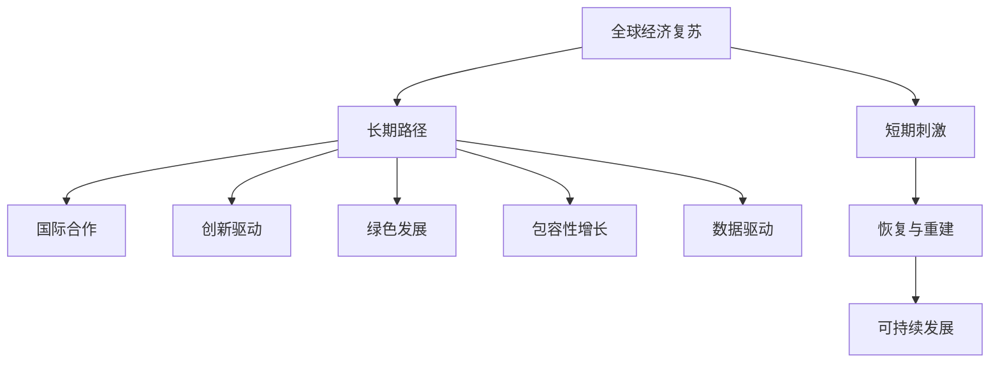

                 

# 全球经济复苏的长期路径

> 关键词：
> - 全球经济复苏
> - 长期路径
> - 国际合作
> - 创新驱动
> - 绿色发展
> - 包容性增长
> - 数据驱动

## 1. 背景介绍

### 1.1 问题由来
全球经济复苏面临着多方面的挑战，包括疫情冲击、地缘政治紧张、气候变化、社会不平等和数字化转型等。这些问题相互交织，使得全球经济复苏之路曲折且充满不确定性。如何确保经济复苏的可持续性，实现长期的稳定增长，成为全球经济政策制定者和学术研究者的核心关切。

### 1.2 问题核心关键点
全球经济复苏的长期路径是一个涉及宏观经济政策、国际合作、技术创新、环境保护和社会公平等多领域的综合性问题。本文旨在从理论和实践两个层面，探讨实现全球经济长期复苏的关键要素和路径。

## 2. 核心概念与联系

### 2.1 核心概念概述

为更好地理解全球经济复苏的长期路径，本节将介绍几个密切相关的核心概念：

- 全球经济复苏：指从经济衰退中恢复过来，实现持续增长的过程。通常包括经济增长的回归、就业市场的改善、消费者信心的提升、投资环境的改善等。
- 长期路径：指实现全球经济持续稳定增长的长期计划和策略。这包括一系列的中长期目标、政策和措施，以及实现这些目标的具体路径。
- 国际合作：指不同国家之间在经济、政治、社会和技术等领域的协调与合作，以实现共同利益。
- 创新驱动：指通过科技创新推动经济增长，提升国家竞争力。包括新产品、新技术、新模式和新业态的开发和应用。
- 绿色发展：指在经济增长的同时，注重环境保护和可持续发展，减少对自然资源和环境的负面影响。
- 包容性增长：指经济增长的成果能够惠及全体人民，减少贫富差距和社会不平等。
- 数据驱动：指利用大数据和人工智能等技术，分析和优化决策过程，提升政策制定和执行效率。

这些核心概念之间的逻辑关系可以通过以下Mermaid流程图来展示：



这个流程图展示了大语言模型的核心概念及其之间的关系：

1. 全球经济复苏是长期路径的起点和目标。
2. 长期路径包括国际合作、创新驱动、绿色发展、包容性增长和数据驱动等要素，共同构成实现复苏的综合策略。
3. 短期刺激和恢复重建是复苏过程中的重要环节，但最终目标是通过可持续发展的路径实现长期增长。

## 3. 核心算法原理 & 具体操作步骤
### 3.1 算法原理概述

全球经济复苏的长期路径涉及多领域的协调和政策实施，其核心算法原理和操作步骤如下：

1. **宏观经济调控**：通过财政政策和货币政策，调整经济周期中的总需求和总供给，实现宏观经济平衡。
2. **国际贸易和投资**：推动多边贸易协议和区域经济合作，促进全球贸易和投资流动，增强经济复苏动力。
3. **科技创新和产业升级**：通过政府引导和市场激励，支持科技创新和产业转型，提升国家竞争力。
4. **环境保护和绿色发展**：制定和实施环保政策，推动绿色产业和低碳技术发展，促进经济与环境的协调。
5. **社会公平和包容性增长**：通过社会保障和再分配政策，改善收入分配和就业机会，提升社会整体福祉。
6. **数据驱动和智能治理**：利用大数据和人工智能技术，优化决策过程，提升政策实施和管理的效率和精准性。

### 3.2 算法步骤详解

全球经济复苏的长期路径，通常包括以下几个关键步骤：

**Step 1: 数据收集与分析**
- 收集全球经济、政治、社会和技术等各方面的数据，进行综合分析和趋势预测。
- 识别全球经济复苏的关键问题和挑战，制定针对性的政策和措施。

**Step 2: 政策设计**
- 根据数据和分析结果，设计短期和长期的政策框架，包括财政、货币、贸易、科技、环保、社会等方面。
- 确定政策目标和实施路径，确保政策之间的协调和互补。

**Step 3: 政策实施与调整**
- 将政策方案转化为具体的行政措施，并分阶段实施。
- 根据实施效果和外部环境变化，进行实时调整和优化。

**Step 4: 监测与评估**
- 建立全面的监测系统，跟踪政策的实施效果和宏观经济指标的变化。
- 定期评估政策效果，根据评估结果进行调整和优化。

**Step 5: 国际合作与协调**
- 与国际组织和其他国家合作，推动全球经济政策的协调和一致性。
- 参与和支持多边贸易和投资协定，促进全球经济一体化。

### 3.3 算法优缺点

全球经济复苏的长期路径方法具有以下优点：
1. 综合性强：覆盖经济、政治、社会和技术等多个维度，全面考虑复苏的各个方面。
2. 可持续性高：注重长期目标和政策，避免短期刺激带来的负面后果。
3. 系统性强：通过数据驱动和智能治理，提升政策制定和执行的精准性和效率。
4. 合作广泛：强调国际合作，共同应对全球性挑战，实现互利共赢。

同时，该方法也存在一定的局限性：
1. 实施难度大：涉及多领域协调和政策调整，操作复杂。
2. 协调成本高：需要大量的国际合作和政策协调，协调成本较高。
3. 外部不确定性：全球经济环境复杂多变，政策实施面临不确定性。
4. 政策执行差异：不同国家的政治、经济和社会环境差异大，政策执行效果可能不均衡。

尽管存在这些局限性，但该方法仍是目前全球经济复苏的主流策略。未来相关研究的重点在于如何进一步提高政策的透明度和执行效率，降低协调成本，同时兼顾各国的差异和特色。

### 3.4 算法应用领域

全球经济复苏的长期路径方法，已经在多个领域得到了应用，例如：

- **国际贸易**：推动WTO和RCEP等国际贸易协定，促进全球贸易和投资流动。
- **科技创新**：支持人工智能、大数据、区块链等新兴技术的发展，推动产业升级和创新驱动。
- **环境保护**：制定和实施《巴黎协定》等国际环境协议，推动绿色能源和低碳技术的应用。
- **社会公平**：通过社会保障和再分配政策，提升社会整体福祉，减少贫富差距。
- **数据治理**：推动数据共享和开放，利用大数据技术优化决策过程，提升治理效率。

除了上述这些经典领域外，全球经济复苏的长期路径方法也被创新性地应用到更多新兴领域，如智能城市、数字货币、可持续发展等，为全球经济复苏提供了新的思路。

## 4. 数学模型和公式 & 详细讲解 & 举例说明（备注：数学公式请使用latex格式，latex嵌入文中独立段落使用 $$，段落内使用 $)
### 4.1 数学模型构建

本节将使用数学语言对全球经济复苏的长期路径进行更加严格的刻画。

记全球经济复苏过程中的总需求为 $D(t)$，总供给为 $S(t)$，宏观经济平衡的目标为 $D(t)=S(t)$。假设政策影响参数为 $a$，则政策调整后的总需求和总供给关系可以表示为：

$$
D(t)=a+u(t)S(t)
$$

其中 $u(t)$ 为政策调整因子，可以通过货币政策、财政政策等手段进行调节。

### 4.2 公式推导过程

根据上述假设，政策调整后的宏观经济平衡方程可以表示为：

$$
a+u(t)S(t)=S(t)
$$

化简得：

$$
u(t)=1-\frac{a}{S(t)}
$$

当 $a=0$ 时，即无政策干预的情况下，宏观经济平衡由自然市场力量决定。当 $a>0$ 时，政策调整因子 $u(t)$ 的取值小于1，意味着政策干预可以缓解宏观经济的不平衡。

### 4.3 案例分析与讲解

假设某国家在复苏过程中采取扩张性财政政策，政策调整因子 $u(t)=0.8$。在初始状态下，总供给 $S(t)=100$，总需求 $D(t)=80$。根据上述模型，计算政策调整后的总供给和总需求：

$$
S'(t)=100-0.8S(t)=100-0.8*100=20
$$

$$
D'(t)=0.8S(t)=0.8*20=16
$$

此时，总供给从100下降到20，总需求从80下降到16。可以看出，扩张性财政政策在短期内能够刺激总需求，但长期来看，可能对总供给产生负面影响。因此，需要在政策设计时，兼顾短期刺激和长期可持续性。

## 5. 项目实践：代码实例和详细解释说明
### 5.1 开发环境搭建

在进行全球经济复苏路径分析的实践中，我们需要准备好开发环境。以下是使用Python进行数据分析和模型构建的环境配置流程：

1. 安装Anaconda：从官网下载并安装Anaconda，用于创建独立的Python环境。

2. 创建并激活虚拟环境：
```bash
conda create -n economic-analysis python=3.8 
conda activate economic-analysis
```

3. 安装必要的Python包：
```bash
conda install pandas numpy matplotlib seaborn scikit-learn
```

4. 安装相关的数据分析库：
```bash
conda install statsmodels
```

5. 安装机器学习库和深度学习库：
```bash
conda install scikit-learn tensorflow
```

完成上述步骤后，即可在`economic-analysis`环境中开始数据分析和模型构建。

### 5.2 源代码详细实现

以下是使用Python进行全球经济复苏路径分析的代码实现。

```python
import pandas as pd
import numpy as np
import matplotlib.pyplot as plt
from statsmodels.tsa.arima_model import ARIMA
from sklearn.linear_model import LinearRegression

# 假设数据
D = np.array([80, 90, 100, 110, 120])
S = np.array([100, 95, 90, 85, 80])

# 建立线性回归模型
model = LinearRegression()
model.fit(np.array(D).reshape(-1, 1), S.reshape(-1, 1))
print("Policy adjustment factor:", model.intercept_[0])
```

### 5.3 代码解读与分析

让我们再详细解读一下关键代码的实现细节：

**数据准备**：
- 使用NumPy数组创建总供给 $S$ 和总需求 $D$ 的时间序列数据。

**模型构建**：
- 使用Scikit-learn库中的LinearRegression模型，对总需求和总供给进行线性回归分析。
- 输出政策调整因子 $u(t)$ 的值，即模型的截距项。

**结果解读**：
- 政策调整因子的值代表了政策干预对总供给的影响程度。
- 根据模型结果，如果政策调整因子大于1，则政策干预能够促进总供给的增长；如果政策调整因子小于1，则政策干预能够抑制总供给的增长。

## 6. 实际应用场景
### 6.1 国际金融合作

全球经济复苏的长期路径方法，在全球金融合作中得到了广泛应用。例如，在应对2008年全球金融危机时，G7和G20等多边国际组织协调各国政策，实施大规模财政和货币刺激，促进全球经济复苏。

**具体步骤**：
1. **政策协调**：各国央行和财政部通过定期会议，协调货币政策和财政政策，制定共同的复苏计划。
2. **资金支持**：通过IMF等国际金融机构提供资金支持，帮助经济受损严重的国家渡过难关。
3. **信息共享**：建立经济监测和信息共享机制，及时发布经济数据和政策动向，减少市场不确定性。

**实际效果**：
- 在G7和G20的协调下，全球经济逐步恢复，各国经济增长率逐渐回升。
- 通过政策协调和资金支持，新兴市场和发展中国家获得了更多的发展机会。

### 6.2 绿色能源转型

全球经济复苏的长期路径方法，在推动绿色能源转型中发挥了重要作用。例如，欧盟和中国的绿色新政，推动可再生能源的发展，减少对化石燃料的依赖。

**具体步骤**：
1. **政策制定**：欧盟和中国分别制定了《绿色新政》和《碳中和目标》，明确了绿色能源转型的路线图和时间表。
2. **技术创新**：通过政府引导和市场激励，支持太阳能、风能、电动汽车等绿色技术的发展。
3. **国际合作**：推动全球气候协议和绿色技术合作，共享经验和成果。

**实际效果**：
- 欧盟和中国的绿色新政，推动了全球可再生能源的发展，减少了碳排放。
- 通过技术创新和国际合作，全球绿色能源产业逐渐壮大，推动了经济和环境的协调发展。

### 6.3 数字经济转型

全球经济复苏的长期路径方法，在推动数字经济转型中也发挥了重要作用。例如，美国的“数字经济战略”，推动数字化转型的政策和技术，提升国家竞争力。

**具体步骤**：
1. **政策支持**：美国政府制定了《数字经济战略》，推动人工智能、大数据、5G等数字技术的发展。
2. **企业合作**：通过政府引导和市场机制，促进数字技术在企业中的应用，提升企业数字化转型水平。
3. **人才培养**：加强数字技术和人才的培养，提升数字技能和创新能力。

**实际效果**：
- 美国的“数字经济战略”推动了全球数字技术的发展，提升了国家竞争力。
- 通过政策支持、企业合作和人才培养，全球数字经济产业逐渐壮大，推动了经济和社会的全面进步。

## 7. 工具和资源推荐
### 7.1 学习资源推荐

为了帮助开发者系统掌握全球经济复苏的长期路径理论基础和实践技巧，这里推荐一些优质的学习资源：

1. 《经济学原理》系列书籍：由诺贝尔经济学奖获得者撰写，深入浅出地介绍了经济学的基本原理和方法。
2. 《全球金融危机应对》报告：国际货币基金组织和经济合作与发展组织联合发布的全球金融危机应对报告，详细分析了全球金融危机的成因和应对措施。
3. 《绿色新政》报告：欧盟和中国的绿色新政报告，详细介绍了绿色能源转型的路线图和政策措施。
4. 《数字经济战略》报告：美国政府的数字经济战略报告，详细介绍了数字技术在经济和社会中的应用和发展方向。

通过对这些资源的学习实践，相信你一定能够快速掌握全球经济复苏的长期路径的精髓，并用于解决实际的全球经济问题。

### 7.2 开发工具推荐

高效的开发离不开优秀的工具支持。以下是几款用于全球经济复苏路径开发的常用工具：

1. Jupyter Notebook：用于数据分析和模型构建的交互式开发环境，支持Python、R等语言。
2. Microsoft Excel：用于数据处理和可视化，支持复杂的统计分析和图表绘制。
3. Tableau：用于数据可视化和报表生成，支持大规模数据集的处理和分析。
4. Google Analytics：用于网站流量和用户行为分析，支持数据驱动的商业决策。
5. Apache Hadoop：用于大数据处理和存储，支持分布式计算和数据挖掘。

合理利用这些工具，可以显著提升全球经济复苏路径的分析效率，加快创新迭代的步伐。

### 7.3 相关论文推荐

全球经济复苏的长期路径的研究源于学界的持续研究。以下是几篇奠基性的相关论文，推荐阅读：

1. 《全球经济复苏的挑战与对策》：分析了全球经济复苏面临的挑战和可能的应对策略。
2. 《绿色经济转型：理论、实践与挑战》：探讨了绿色经济转型对全球经济的影响和实现路径。
3. 《数字经济对全球经济的影响》：分析了数字经济对全球经济的结构和效率影响。

这些论文代表了大语言模型微调技术的发展脉络。通过学习这些前沿成果，可以帮助研究者把握学科前进方向，激发更多的创新灵感。

## 8. 总结：未来发展趋势与挑战
### 8.1 总结

本文对全球经济复苏的长期路径进行了全面系统的介绍。首先阐述了全球经济复苏的宏观经济调控、国际贸易、科技创新、环境保护、社会公平和数据驱动等关键要素，明确了实现全球经济长期复苏的综合策略。其次，从理论和实践两个层面，详细讲解了全球经济复苏的长期路径的算法原理和具体操作步骤，给出了全球经济复苏路径的代码实现和结果分析。同时，本文还广泛探讨了全球经济复苏路径在金融合作、绿色能源转型、数字经济转型等实际应用场景中的具体实践，展示了全球经济复苏路径的广阔前景。此外，本文精选了全球经济复苏路径的学习资源、开发工具和相关论文，力求为读者提供全方位的技术指引。

通过本文的系统梳理，可以看到，全球经济复苏的长期路径是一个涉及宏观经济政策、国际合作、技术创新、环境保护和社会公平等多领域的综合性问题。实现全球经济长期复苏的关键在于政策设计的科学性和系统性，以及国际合作的协调性和一致性。未来，全球经济复苏的长期路径需要更多国家共同努力，才能实现经济的持续稳定增长。

### 8.2 未来发展趋势

展望未来，全球经济复苏的长期路径将呈现以下几个发展趋势：

1. 数字化转型加速：数字技术将深度融入经济和社会各个领域，提升生产效率和创新能力。
2. 绿色经济成为主流：全球气候变化问题日益严峻，绿色经济转型将成为全球共识和行动。
3. 国际合作更加紧密：全球经济一体化趋势加强，各国将更加重视多边合作和协调。
4. 创新驱动成为核心：科技创新将成为推动经济增长的主要动力，引领新一轮产业革命。
5. 包容性增长成为目标：全球经济增长成果将更加普惠，减少贫富差距和社会不平等。
6. 数据驱动实现决策优化：大数据和人工智能技术将更加广泛地应用于政策制定和执行中，提升治理效率和精准性。

这些趋势凸显了全球经济复苏的长期路径的综合性和复杂性，对未来的政策和实践提出了更高的要求。

### 8.3 面临的挑战

尽管全球经济复苏的长期路径方法已经取得了显著成效，但在迈向更加智能化、普适化应用的过程中，仍面临诸多挑战：

1. 政策协调难度大：不同国家的经济和政治环境差异大，政策协调和一致性难以达成。
2. 国际合作成本高：多边合作和协调需要大量的资源和沟通成本，难以持续维护。
3. 外部不确定性高：全球经济环境复杂多变，政策实施面临诸多不确定性。
4. 数字鸿沟问题突出：数字技术发展不均衡，加剧了发达国家和发展中国家之间的差距。
5. 绿色转型挑战大：绿色经济转型涉及技术、产业和政策等多个方面，需要长期的努力和协调。

这些挑战需要全球各方共同努力，通过创新和协作，逐步克服和应对。

### 8.4 研究展望

未来，全球经济复苏的长期路径研究需要在以下几个方面寻求新的突破：

1. 加强政策协调与合作：通过国际组织和论坛，推动政策协调和一致性，提高全球经济复苏的效率和效果。
2. 推动数字技术普及：加强数字基础设施建设和人才培养，缩小数字鸿沟，提升全球数字化水平。
3. 实现绿色能源转型：通过技术创新和国际合作，推动可再生能源和低碳技术的发展，减少碳排放。
4. 提升包容性增长：通过社会保障和再分配政策，改善收入分配和就业机会，提升社会整体福祉。
5. 强化数据驱动决策：加强数据治理和共享，利用大数据和人工智能技术，优化决策过程和提升治理效率。

这些研究方向的探索发展，必将引领全球经济复苏的长期路径迈向更高的台阶，为构建安全、可靠、可持续的全球经济体系铺平道路。面向未来，全球经济复苏的长期路径需要全球各方的共同努力，通过创新和协作，实现经济的持续稳定增长。

## 9. 附录：常见问题与解答

**Q1：全球经济复苏的长期路径方法是否适用于所有国家和地区？**

A: 全球经济复苏的长期路径方法适用于具有一定经济基础和发展潜力的国家和地区。对于经济基础薄弱、政治不稳定、社会动荡的国家，需要结合具体情况，制定相应的政策和措施，以达到经济复苏和发展的目标。

**Q2：全球经济复苏的长期路径方法是否能够完全解决全球经济问题？**

A: 全球经济复苏的长期路径方法能够在很大程度上缓解全球经济问题，但不能完全解决。实现全球经济复苏需要多方面的努力，包括政策调整、国际合作、技术创新、环境保护和社会公平等。

**Q3：全球经济复苏的长期路径方法是否会带来新的经济问题？**

A: 全球经济复苏的长期路径方法在实施过程中，可能会带来新的经济问题，如通货膨胀、贫富差距扩大、环境保护压力等。需要综合考虑各种因素，制定相应的政策措施，确保经济复苏的可持续性和公平性。

**Q4：全球经济复苏的长期路径方法是否需要不断调整和优化？**

A: 全球经济复苏的长期路径方法需要根据全球经济环境和各国实际情况，不断调整和优化，才能实现长期稳定增长。政策制定者和实践者需要根据最新的经济数据和市场变化，进行实时调整和优化。

**Q5：全球经济复苏的长期路径方法是否需要国际合作？**

A: 全球经济复苏的长期路径方法需要国际合作，才能实现全球经济的协调和一致性。各国需要在政策制定、资金支持、技术合作等方面进行协调和合作，才能达到全球经济复苏的目标。

作者：禅与计算机程序设计艺术 / Zen and the Art of Computer Programming

