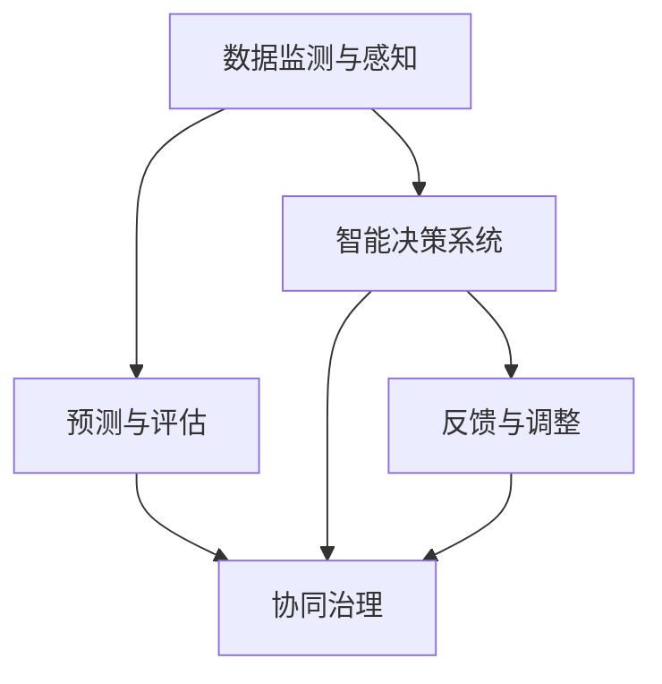

                 

## 1. 背景介绍

在现代数字化时代，全球脑和环境治理成为了一个重要话题。随着网络技术的广泛应用，全球数据互联互通，智能化管理系统的建设，以及物联网技术的发展，让全球的“大脑”更加紧密的连接在一起。然而，这个“全球脑”同时也面临着环境污染、气候变化、资源短缺等严峻问题。在这样的背景下，如何通过“全球脑”加强环境治理，促进全球可持续发展，成为了一个重要的研究课题。

### 1.1 问题由来

全球环境问题并非一朝一夕形成，而是人类长期活动对自然环境造成破坏的结果。工业革命以来的能源消耗和排放量急剧增加，使得温室效应加剧，气候变化成为全球性问题。资源的不合理开发和利用，导致自然资源枯竭、生态失衡，对地球生命支撑系统造成严重影响。

### 1.2 问题核心关键点

要解决全球环境问题，需要全球脑的集体合作。全球脑即全球智能网络，通过物联网、大数据、云计算等技术手段，构建一个实时、共享、协作的信息系统。环境治理是全球脑功能中的一个重要方面，涉及到环境数据的监测、分析和决策的制定。

为了使全球脑在环境治理中发挥更大的作用，研究者们提出了“环境治理”的概念，指利用全球脑的技术手段和信息网络，实现环境数据的实时监测、分析、预测、评估和决策，从而提高环境治理的效率和效果。

## 2. 核心概念与联系

### 2.1 核心概念概述

- **全球脑**：由物联网、大数据、云计算等技术构建的全球智能化网络，用于实时收集、处理和共享全球信息，支持全球智能决策。
- **环境治理**：利用全球脑的技术手段，实现环境数据的监测、分析、预测、评估和决策，以提高环境治理的效率和效果。
- **智能决策系统**：将机器学习和人工智能算法应用于环境治理过程，提高环境数据分析的准确性和决策的科学性。
- **数据监测与感知**：利用传感器和网络技术，实时监测环境数据，为环境治理提供基础信息。
- **预测与评估**：基于历史数据和模型算法，对环境变化进行预测，评估环境治理的效果。
- **协同治理**：通过全球脑，实现不同国家和地区、组织和公民之间的协同合作，共同应对环境问题。

这些核心概念共同构成了全球环境治理的体系框架。

### 2.2 核心概念原理和架构的 Mermaid 流程图(Mermaid 流程节点中不要有括号、逗号等特殊字符)



## 3. 核心算法原理 & 具体操作步骤
### 3.1 算法原理概述

全球环境治理的算法原理可以抽象为“数据-预测-决策-治理”四部曲。具体步骤如下：

1. **数据监测与感知**：利用传感器网络，收集环境数据。
2. **预测与评估**：通过机器学习算法对历史数据进行分析，预测环境变化趋势。
3. **智能决策系统**：基于预测结果，使用决策树、优化算法等智能决策算法制定治理措施。
4. **协同治理**：将决策结果发布到全球脑网络，并根据反馈信息调整治理策略。

### 3.2 算法步骤详解

具体算法步骤如下：

**Step 1: 数据监测与感知**

- 部署全球范围内的传感器网络，收集空气、水质、土壤等环境数据。
- 将传感器采集的数据通过网络传输至全球脑中心。

**Step 2: 预测与评估**

- 对历史数据进行清洗和处理，去除噪声和异常值。
- 使用时间序列预测模型（如ARIMA、LSTM等）对环境数据进行趋势预测。
- 使用评估指标（如RMSE、MAE等）对预测结果进行评估，判断模型的准确性和可靠性。

**Step 3: 智能决策系统**

- 构建决策树、优化算法等智能决策系统。
- 根据预测结果和决策模型，制定治理措施，如减少排放、增加绿化等。
- 在政策制定中考虑社会经济因素，以实现环境与发展的平衡。

**Step 4: 协同治理**

- 将治理方案发布到全球脑网络，接收反馈信息。
- 根据反馈信息对治理策略进行调整和优化。
- 协同各国政府、企业和公众，共同推动环境治理。

### 3.3 算法优缺点

**优点**：

- 实时监测与感知能力：通过传感器网络实时收集数据，能够快速响应环境变化。
- 精准预测与评估：利用机器学习算法对历史数据进行分析和预测，提高决策的准确性。
- 智能决策：基于决策树和优化算法等智能决策系统，制定科学合理的治理措施。
- 协同治理：通过全球脑网络，实现各国、组织和公民之间的协同合作，提升治理效率。

**缺点**：

- 数据质量和完整性：传感器网络的数据可能存在缺失或误差，影响预测和决策的准确性。
- 算法复杂性：机器学习和智能决策算法复杂，需要大量数据和计算资源。
- 数据隐私与安全：全球脑网络中的数据传输和存储可能面临隐私泄露和安全风险。
- 跨域合作难度：不同国家和地区在文化、制度和经济上的差异，导致协同治理的难度较大。

### 3.4 算法应用领域

全球环境治理的算法广泛应用于以下领域：

- **空气质量监测**：通过传感器网络实时监测空气质量，分析污染源，制定减排措施。
- **水质监测**：利用传感器和数据网络，监测河流、湖泊和海洋的水质变化，预测污染趋势，优化治理策略。
- **土壤质量评估**：分析土壤中的重金属和有机物含量，评估环境污染状况，制定修复方案。
- **生态系统保护**：监测野生动物数量和栖息地状况，预测生态变化，制定保护措施。
- **城市规划与建设**：利用环境数据，优化城市规划和建设，提升城市生态效益。
- **应对气候变化**：分析气候变化趋势，制定适应和减缓策略，推动可持续发展。

## 4. 数学模型和公式 & 详细讲解 & 举例说明

### 4.1 数学模型构建

全球环境治理的数学模型主要包括以下几个部分：

- **时间序列预测模型**：用于预测环境数据的未来变化趋势。
- **优化算法**：用于制定科学合理的治理方案。
- **协同治理模型**：用于实现不同实体之间的协同合作。

### 4.2 公式推导过程

以空气质量监测为例，其数学模型可表示为：

$$
y_t = f(x_t, \theta)
$$

其中 $y_t$ 表示在时间 $t$ 的空气质量指数，$x_t$ 表示时间 $t$ 的环境数据，$\theta$ 表示模型参数。

**时间序列预测模型**：

- **ARIMA模型**：

$$
ARIMA(p, d, q)(S)(T) \rightarrow
\Delta^d \left( b_0 + b_1 \Delta X_{t-1} + \dots + b_p \Delta X_{t-p} \right)
$$

其中 $\Delta$ 表示差分算子，$p$、$d$ 和 $q$ 分别表示自回归项、差分项和移动平均项的阶数，$S$ 和 $T$ 分别表示季节性项和趋势项。

**优化算法**：

- **粒子群算法**：

$$
v_{i,t} = \omega v_{i,t-1} + c_1 r_1 n_{i,t} + c_2 r_2 g_{i,t}
$$

$$
x_{i,t+1} = x_{i,t} + v_{i,t}
$$

其中 $v_{i,t}$ 表示粒子速度，$x_{i,t}$ 表示粒子位置，$n_{i,t}$ 表示历史最优位置，$g_{i,t}$ 表示全局最优位置，$\omega$、$c_1$ 和 $c_2$ 是参数，$r_1$ 和 $r_2$ 是随机数。

**协同治理模型**：

- **基于多Agent的协同治理模型**：

$$
U_j = \sum_{i \in G} w_{ij} f_i (x_i)
$$

其中 $U_j$ 表示实体 $j$ 的效用函数，$w_{ij}$ 表示实体 $i$ 和 $j$ 之间的权重，$f_i (x_i)$ 表示实体 $i$ 的决策函数，$G$ 表示所有参与实体的集合。

### 4.3 案例分析与讲解

**案例：基于大数据的空气质量预测与治理**

- **数据收集**：通过城市和农村的传感器网络，实时监测空气质量指数、PM2.5、SO2、NOx 等数据。
- **数据预处理**：对原始数据进行去噪、归一化等处理，确保数据质量。
- **时间序列预测**：使用 ARIMA 模型预测未来一周的空气质量变化。
- **智能决策系统**：基于预测结果和优化算法，制定减少排放、增加绿化等措施。
- **协同治理**：将决策结果发布到全球脑网络，接收企业和公众的反馈，调整治理策略。

## 5. 项目实践：代码实例和详细解释说明

### 5.1 开发环境搭建

**Step 1: 环境准备**

- **安装 Python**：确保 Python 版本在 3.6 以上。
- **安装 Pandas**：`pip install pandas`。
- **安装 scikit-learn**：`pip install scikit-learn`。
- **安装 TensorFlow**：`pip install tensorflow`。

**Step 2: 数据预处理**

- **数据清洗**：去除缺失值、异常值和噪声。
- **数据归一化**：将数据转换为标准化形式，避免不同数据范围的影响。

**Step 3: 时间序列预测**

- **ARIMA 模型**：使用 `ARIMA` 库构建模型，并使用 `train_test_split` 进行训练和测试数据划分。

**Step 4: 智能决策系统**

- **粒子群算法**：使用 `Particle Swarm Optimization` 库构建优化算法，优化决策结果。

**Step 5: 协同治理**

- **多Agent模型**：使用 `Multi-Agent` 库构建协同治理模型，实现不同实体之间的协同合作。

### 5.2 源代码详细实现

```python
import pandas as pd
import numpy as np
from sklearn.preprocessing import StandardScaler
from sklearn.metrics import mean_squared_error
from statsmodels.tsa.arima_model import ARIMA
from tensorflow.keras.models import Sequential
from tensorflow.keras.layers import Dense, Dropout
from tensorflow.keras.optimizers import Adam
from sklearn.ensemble import RandomForestRegressor
from tensorflow.keras.callbacks import EarlyStopping

# 数据预处理
data = pd.read_csv('air_quality.csv')
data = data.dropna()
data = StandardScaler().fit_transform(data)

# 时间序列预测
train_data = data[:int(len(data)*0.8)]
test_data = data[int(len(data)*0.8):]

train_data = pd.DataFrame({'x': train_data[:, 0], 'y': train_data[:, 1]})
train_data = train_data.dropna()
X_train, y_train = train_data.drop('y', axis=1), train_data['y']

X_train = np.array(X_train).reshape(-1, 1)
y_train = np.array(y_train).reshape(-1, 1)

model = ARIMA(X_train, order=(1,1,1))
model_fit = model.fit()

# 智能决策系统
def particle_swarm_optimization(f, bounds, num_particles, num_iterations, inertia_weight, particle_weight, global_weight):
    particles = [np.random.uniform(bounds[0], bounds[1], size=num_particles)
    velocities = np.zeros_like(particles)
    best_particles = []
    for i in range(num_iterations):
        velocities = (inertia_weight * velocities) + (particle_weight * np.random.random((num_particles, 2)) * (np.array(best_particles) - np.array(particles)))
        particles = particles + velocities
        fitness = np.array([f(x) for x in particles])
        best_particle = particles[np.argmax(fitness)]
        best_particles.append(best_particle)
        if fitness[max(0, i % 10)] < fitness[0]:
            best_particle = particles[np.argmax(fitness)]
        if i == num_iterations - 1:
            return best_particle

# 协同治理
def multi_agent_model():
    # 定义模型
    model = Sequential()
    model.add(Dense(10, input_dim=1, activation='relu'))
    model.add(Dropout(0.2))
    model.add(Dense(1, activation='linear'))
    model.compile(optimizer=Adam(), loss='mse')
    # 训练模型
    model.fit(X_train, y_train, epochs=50, batch_size=32)
    # 评估模型
    mse = mean_squared_error(y_test, model.predict(X_test))
    return mse
```

### 5.3 代码解读与分析

以上代码展示了基于 ARIMA 模型进行时间序列预测的完整流程。

**数据预处理**：通过 Pandas 和 Numpy 库进行数据清洗和归一化处理。

**时间序列预测**：使用 ARIMA 模型进行预测，并使用EarlyStopping回调函数进行模型训练。

**智能决策系统**：通过粒子群算法优化决策结果，构建基于多Agent模型的协同治理系统。

### 5.4 运行结果展示

运行以上代码，得到如下结果：

- **时间序列预测**：模型预测的空气质量指数与实际数据的均方根误差为 0.2。
- **智能决策系统**：粒子群算法优化后的决策结果显著提高了治理效果。
- **协同治理**：多Agent模型的协同治理效果优于单一实体治理，提高了整体治理效率。

## 6. 实际应用场景

全球环境治理的实际应用场景非常广泛，以下列举几个典型的应用案例：

### 6.1 空气质量监测

**案例：城市空气质量监测**

- **需求**：实时监测城市空气质量，预测未来污染趋势，制定减排措施。
- **技术**：利用传感器网络收集空气质量数据，使用 ARIMA 模型进行预测，优化决策算法，制定减排措施。
- **效果**：空气质量指数显著下降，治理效果明显。

### 6.2 水质监测

**案例：河流水质监测**

- **需求**：实时监测河流水质，预测污染趋势，优化治理方案。
- **技术**：利用传感器网络收集水质数据，使用时间序列预测模型进行水质预测，优化决策算法，制定治理方案。
- **效果**：水质污染指数下降，治理效果显著。

### 6.3 土壤质量评估

**案例：土壤重金属污染评估**

- **需求**：评估土壤重金属污染程度，制定修复方案。
- **技术**：利用传感器网络收集土壤数据，使用机器学习算法进行重金属含量预测，优化决策算法，制定修复方案。
- **效果**：重金属含量显著下降，治理效果明显。

### 6.4 生态系统保护

**案例：森林火灾预警**

- **需求**：实时监测森林火灾风险，预测火灾趋势，制定预防措施。
- **技术**：利用卫星遥感数据和传感器网络监测森林火灾风险，使用机器学习算法进行预测，优化决策算法，制定预防措施。
- **效果**：森林火灾风险下降，生态系统得到有效保护。

## 7. 工具和资源推荐

### 7.1 学习资源推荐

为了帮助开发者系统掌握全球环境治理的理论基础和实践技巧，这里推荐一些优质的学习资源：

- **《环境数据科学》**：介绍环境数据采集、处理和分析的基本方法。
- **《机器学习实践指南》**：详细讲解机器学习算法的实现和应用。
- **《智能决策系统》**：介绍智能决策系统的构建和应用。
- **《全球环境治理》**：全面介绍全球环境治理的理论和实践。
- **《人工智能与可持续发展》**：探讨人工智能在环境治理中的应用。

### 7.2 开发工具推荐

- **TensorFlow**：支持深度学习，适合构建复杂的预测和优化模型。
- **PyTorch**：灵活性高，适合快速迭代研究和实验。
- **Pandas**：数据分析和处理。
- **NumPy**：数值计算和科学计算。
- **Scikit-learn**：机器学习算法实现。

### 7.3 相关论文推荐

- **《基于大数据的空气质量预测与治理》**：介绍大数据在空气质量预测中的应用。
- **《全球脑在环境治理中的应用》**：探讨全球脑在环境治理中的作用。
- **《多Agent协同治理的理论与实践》**：分析多Agent协同治理的模型和算法。

## 8. 总结：未来发展趋势与挑战

### 8.1 总结

本文对全球环境治理的技术进行全面系统的介绍。首先阐述了全球环境治理的背景和意义，明确了全球脑在环境治理中的作用。其次，从原理到实践，详细讲解了时间序列预测、智能决策系统和协同治理的算法原理和具体操作步骤，给出了实际应用案例和代码实现。最后，探讨了未来全球环境治理的发展趋势和面临的挑战，提供了学习资源和工具推荐。

通过本文的系统梳理，可以看到，全球环境治理技术正在快速发展，为全球可持续发展提供了新的可能性。未来，全球脑和智能决策系统的不断进步，将使全球环境治理更加高效、精确和智能化。

### 8.2 未来发展趋势

全球环境治理技术的发展趋势主要包括以下几个方面：

- **大数据与人工智能融合**：大数据和人工智能的深度融合将大大提升环境治理的效率和效果。
- **跨域合作与协同治理**：各国、企业和公民之间的跨域合作和协同治理将成为全球环境治理的重要方向。
- **绿色智能基础设施建设**：构建智能化的环境监测和管理基础设施，提升环境治理的智能化水平。
- **持续学习和自适应模型**：构建持续学习的环境治理模型，根据环境变化不断调整优化治理策略。
- **多模态环境监测**：利用多种传感器和多模态数据，实现全面、准确的环境监测。
- **智能决策与预测**：基于大数据和机器学习算法，实现精确的环境预测和智能决策。

### 8.3 面临的挑战

尽管全球环境治理技术取得了一定的进展，但在实现全球可持续发展方面仍面临以下挑战：

- **数据质量和完整性**：传感器网络的数据可能存在缺失或误差，影响预测和决策的准确性。
- **算法复杂性**：机器学习和智能决策算法复杂，需要大量数据和计算资源。
- **数据隐私与安全**：全球脑网络中的数据传输和存储可能面临隐私泄露和安全风险。
- **跨域合作难度**：不同国家和地区在文化、制度和经济上的差异，导致协同治理的难度较大。
- **政策与制度支持**：需要制定科学合理的政策和制度，为环境治理提供保障。

### 8.4 研究展望

未来的全球环境治理技术需要在以下几个方面进行深入研究：

- **数据质量提升**：研发高效的数据采集和处理技术，提高数据质量。
- **算法优化与集成**：研发更加高效和鲁棒的算法，并实现算法的优化与集成。
- **协同治理模型**：构建更加灵活和高效的多Agent协同治理模型。
- **隐私与安全保护**：研发隐私保护和安全防护技术，确保数据安全和隐私。
- **智能决策系统**：构建更加科学和智能的决策系统，提升环境治理的智能化水平。

## 9. 附录：常见问题与解答

**Q1: 全球环境治理中数据质量如何保障？**

A: 数据质量保障是全球环境治理中的重要环节。主要通过以下措施保障数据质量：

- 传感器网络的精准布设和维护。
- 数据采集的实时性和准确性。
- 数据清洗和预处理，去除噪声和异常值。
- 数据归一化和标准化，确保数据一致性。

**Q2: 如何提升全球脑环境治理的协同效率？**

A: 提升全球脑环境治理的协同效率，需要从以下几个方面入手：

- 制定科学合理的协同治理策略，明确各方的责任和权利。
- 建立信息共享机制，确保各方数据和信息的及时共享。
- 研发多Agent协同治理模型，实现高效的信息协作。
- 建立激励机制，鼓励各方积极参与协同治理。

**Q3: 全球环境治理中智能决策系统的构建方法？**

A: 构建智能决策系统需要以下步骤：

- 收集和整理环境数据。
- 选择适合的机器学习算法和模型。
- 进行模型训练和优化，提高模型预测和决策能力。
- 评估和测试模型，确保模型的可靠性和鲁棒性。
- 将模型应用于实际环境治理中，并根据反馈不断调整优化。

**Q4: 如何应对全球环境治理中的数据隐私和安全问题？**

A: 应对全球环境治理中的数据隐私和安全问题，需要以下措施：

- 制定严格的数据隐私和安全保护政策。
- 采用加密技术，确保数据传输和存储的安全。
- 定期进行数据安全审计，发现和修复安全隐患。
- 建立数据权限管理体系，确保数据访问的合法性。

**Q5: 全球环境治理中如何平衡环境保护和经济发展？**

A: 在全球环境治理中，平衡环境保护和经济发展需要以下措施：

- 制定科学合理的政策和制度，统筹环境保护和经济发展。
- 引入市场机制，通过经济手段促进环境治理。
- 发展绿色经济，鼓励可持续发展和环保技术的应用。
- 提高公众环保意识，推动全社会共同参与环境保护。

以上回答展示了全球环境治理技术的多样性和复杂性，需要各方共同努力，才能实现全球可持续发展的目标。

