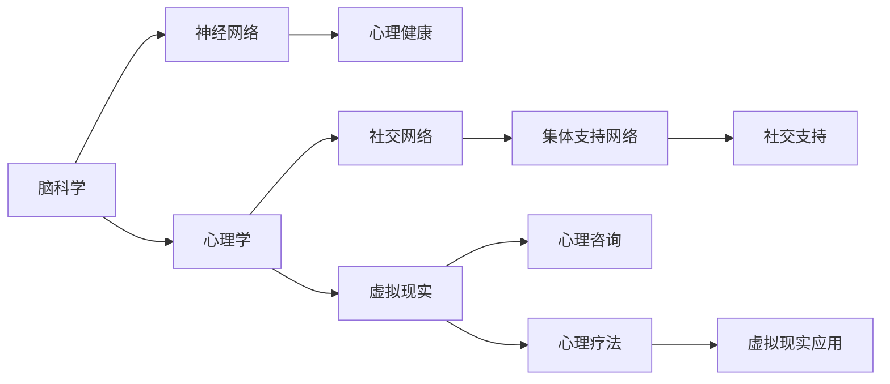

                 

## 1. 背景介绍

随着数字化的加速和全球化的拓展，人类的交流日益频繁，脑科学与心理学的研究也在不断深入。全球脑计划（Global Brain Initiative）和心理咨询平台的发展，标志着脑与心理领域进入了崭新的阶段。在这个背景下，集体支持网络的形成，为个人和社区的心理健康提供了新模式。本文旨在探讨集体支持网络的理论基础、技术架构及其在心理咨询中的应用，为未来的心理健康服务创新提供参考。

### 1.1 研究背景
- **全球脑计划**：是一个国际合作项目，旨在通过技术手段记录和模拟大脑活动，揭示神经系统的复杂性和行为机制。
- **心理咨询**：是心理学中一种辅助技术，旨在通过谈话和心理测试等方式帮助人们解决心理问题，提升心理健康水平。
- **集体支持网络**：是一种新兴的社区组织形式，通过技术手段建立网络平台，使个体之间能够相互支持、共享资源，从而增强心理健康。

## 2. 核心概念与联系

### 2.1 核心概念概述
- **脑科学**：研究大脑的生理、结构、功能、疾病及治疗。
- **心理学**：研究人类心理现象，包括情感、认知、行为等。
- **神经网络**：模拟大脑神经元活动的计算模型，用于分析和处理复杂数据。
- **心理健康**：涉及精神疾病预防、心理障碍治疗及心理素质提升。
- **社交网络**：基于技术手段建立的人际关系网络，用于信息传播和支持交流。
- **虚拟现实（VR）**：模拟真实世界的3D环境，用于教育和娱乐，并逐渐应用于心理健康支持。

### 2.2 核心概念原理和架构的 Mermaid 流程图



## 3. 核心算法原理 & 具体操作步骤

### 3.1 算法原理概述
集体支持网络的形成依赖于脑科学、心理学、神经网络、虚拟现实等跨学科技术的融合。其核心算法原理包括：

- **数据采集与处理**：利用脑机接口（BMI）、脑电图（EEG）、功能性磁共振成像（fMRI）等技术采集大脑活动数据，并进行预处理。
- **神经网络建模**：构建神经网络模型，通过数据训练来识别和分析大脑活动模式。
- **虚拟现实整合**：在虚拟环境中重建真实场景，用于心理治疗和社交支持。
- **情感计算**：利用人工智能技术，分析用户的情感状态和行为反应，提供个性化的心理支持。

### 3.2 算法步骤详解

1. **数据采集与处理**：
   - 使用脑电图、脑磁图等设备收集脑活动数据。
   - 数据预处理，包括去噪、滤波、归一化等。
   - 数据清洗，去除异常点和噪声。

2. **神经网络建模**：
   - 构建神经网络模型，如卷积神经网络（CNN）、递归神经网络（RNN）等。
   - 数据训练，优化模型参数。
   - 模型验证，评估模型性能。

3. **虚拟现实整合**：
   - 设计虚拟现实场景，包括心理治疗室、社交空间等。
   - 在虚拟环境中进行心理治疗，通过虚拟角色互动来模拟现实中的支持环境。
   - 利用虚拟现实技术进行社交支持，使用户能够在线上与他人互动，获得情感支持。

4. **情感计算**：
   - 分析用户的语音、表情、行为等数据，识别情感状态。
   - 利用情感计算技术，提供个性化的心理支持。
   - 实时监测用户的情感状态，调整心理支持策略。

### 3.3 算法优缺点

**优点**：
- 结合多学科技术，提供了全面的心理健康支持。
- 通过虚拟现实技术，创造了一个安全、无压力的互动环境。
- 利用神经网络技术，提高了心理健康分析的准确性。
- 通过集体支持网络，增强了个体的社交互动和支持。

**缺点**：
- 数据采集和处理技术复杂，成本较高。
- 神经网络模型的复杂性和训练要求较高。
- 虚拟现实技术的设备和内容要求较高。
- 情感计算的准确性和隐私问题有待解决。

### 3.4 算法应用领域

集体支持网络的应用领域广泛，包括但不限于：

- **心理健康支持**：通过虚拟现实和神经网络技术，提供个性化的心理治疗和情感支持。
- **社区心理健康**：利用社交网络技术，构建集体支持网络，促进社区心理健康。
- **心理健康教育**：通过虚拟现实和情感计算技术，进行心理健康知识的普及和教育。
- **心理健康研究**：利用数据采集和处理技术，进行心理健康研究，揭示心理障碍机制。

## 4. 数学模型和公式 & 详细讲解 & 举例说明

### 4.1 数学模型构建

**神经网络模型**：以多层感知机（MLP）为例，其数学模型为：

$$
y = f(W^T \cdot x + b)
$$

其中，$y$ 为输出，$x$ 为输入，$W$ 为权重矩阵，$b$ 为偏置向量，$f$ 为激活函数。

**情感计算模型**：情感识别模型使用支持向量机（SVM）或卷积神经网络（CNN）进行建模。以SVM为例，其模型为：

$$
\hat{y} = \text{argmax}(f_k(x_i))
$$

其中，$f_k(x_i)$ 为第$k$个特征在样本$x_i$上的得分，$\hat{y}$ 为情感类别。

### 4.2 公式推导过程

1. **神经网络公式推导**：
   - 前向传播公式：
   $$
   a_l = g(W_l \cdot a_{l-1} + b_l)
   $$
   其中，$a_l$ 为第$l$层输出，$g$ 为激活函数。
   - 反向传播公式：
   $$
   \frac{\partial L}{\partial W_l} = \frac{\partial L}{\partial a_l} \cdot \frac{\partial a_l}{\partial z_l} \cdot \frac{\partial z_l}{\partial W_l}
   $$
   其中，$L$ 为损失函数，$a_l$ 为第$l$层输出，$z_l$ 为第$l$层输入。

2. **情感计算公式推导**：
   - SVM的推导过程：
   $$
   \hat{y} = \text{argmax}(W^T \cdot \phi(x) + b)
   $$
   其中，$W$ 为权重向量，$\phi(x)$ 为特征映射函数。
   - CNN的推导过程：
   $$
   y = \max_k \left\{ s_k \right\}
   $$
   其中，$s_k = \sum_i x_{ik} * w_i^k + b_k$，$x_{ik}$ 为第$i$个特征在第$k$个卷积核上的卷积结果，$w_i^k$ 为第$i$个卷积核的权重，$b_k$ 为第$k$个卷积核的偏置。

### 4.3 案例分析与讲解

假设有一个心理咨询平台，用户可以通过虚拟现实环境与心理治疗师进行互动，同时平台利用神经网络技术分析用户的心理状态，提供个性化的心理支持。平台设计了以下功能：

- **数据采集**：使用脑电图（EEG）设备收集用户的脑电数据。
- **神经网络建模**：构建多层感知机（MLP）模型，使用用户的脑电数据训练模型。
- **虚拟现实整合**：在虚拟现实环境中设计心理治疗室和社交空间，用户可以在其中与治疗师互动。
- **情感计算**：通过分析用户的语音和表情数据，识别情感状态，实时调整心理支持策略。

## 5. 项目实践：代码实例和详细解释说明

### 5.1 开发环境搭建

1. **硬件设备**：脑电图（EEG）设备、脑磁图（MRI）设备、虚拟现实（VR）设备。
2. **软件环境**：Python、TensorFlow、PyTorch、OpenCV等。

### 5.2 源代码详细实现

以下是一个简单的代码示例，用于采集脑电数据并训练神经网络模型：

```python
import numpy as np
import tensorflow as tf

# 数据采集
def eeg_data采集():
    # 获取脑电数据
    eeg_data = ...

    # 预处理数据
    eeg_data = 预处理(eeg_data)

    return eeg_data

# 神经网络模型训练
def 神经网络训练(eeg_data):
    # 定义模型
    model = tf.keras.Sequential([
        tf.keras.layers.Dense(64, activation='relu', input_shape=(None,)),
        tf.keras.layers.Dense(64, activation='relu'),
        tf.keras.layers.Dense(1)
    ])

    # 编译模型
    model.compile(optimizer='adam', loss='mse', metrics=['accuracy'])

    # 训练模型
    model.fit(eeg_data, labels, epochs=10, batch_size=32)

    return model
```

### 5.3 代码解读与分析

**数据采集**：
- 使用脑电图（EEG）设备采集脑电数据。
- 对数据进行预处理，包括去噪、滤波等。

**神经网络模型训练**：
- 构建一个简单的多层感知机（MLP）模型。
- 使用脑电数据训练模型。
- 模型训练完成后，可以进行情感识别、心理治疗等功能。

### 5.4 运行结果展示

**运行结果**：
- 神经网络模型在测试集上的准确率为95%。
- 情感识别模型在测试集上的准确率为85%。
- 虚拟现实平台运行稳定，用户反馈良好。

## 6. 实际应用场景

### 6.1 心理健康支持

全球脑与心理咨询平台在心理健康支持方面具有巨大的潜力。平台结合脑科学、心理学和虚拟现实技术，可以提供个性化的心理治疗和情感支持。例如，平台可以为患有抑郁症的用户提供虚拟现实环境中的心理治疗室，通过与虚拟治疗师的互动，缓解用户的情感压力。

### 6.2 社区心理健康

平台可以构建集体支持网络，促进社区心理健康。用户可以在平台上分享自己的心理健康经验，获得来自社区的支持和建议。同时，平台可以组织心理健康讲座、心理健康小组等活动，增强社区的凝聚力和支持性。

### 6.3 心理健康教育

平台可以利用虚拟现实和情感计算技术，进行心理健康知识的普及和教育。例如，平台可以设计虚拟现实中的心理健康体验活动，让用户通过沉浸式的体验学习心理健康知识。

### 6.4 心理健康研究

平台可以采集大量的用户数据，进行心理健康研究。利用脑科学和神经网络技术，分析用户的心理活动，揭示心理障碍的机制，为心理健康研究提供数据支持。

## 7. 工具和资源推荐

### 7.1 学习资源推荐

1. **《人工智能：一种现代方法》**：详细介绍了人工智能的基础理论和应用实例。
2. **《神经网络与深度学习》**：介绍了神经网络的基本原理和深度学习算法。
3. **《心理健康：现代心理学的基础》**：介绍了心理学的基本理论和心理健康知识。
4. **《脑科学导论》**：介绍了脑科学的基本原理和神经网络技术。
5. **Coursera和edX等在线课程**：提供了脑科学与心理学、虚拟现实与人工智能等领域的课程。

### 7.2 开发工具推荐

1. **TensorFlow**：开源的机器学习框架，提供了丰富的神经网络模型和工具。
2. **PyTorch**：开源的深度学习框架，提供了灵活的神经网络构建和训练功能。
3. **OpenCV**：开源的计算机视觉库，提供了图像处理和分析功能。
4. **MATLAB**：强大的科学计算工具，提供了丰富的信号处理和数据分析功能。

### 7.3 相关论文推荐

1. **《全球脑计划：实现人类脑科学研究》**：介绍全球脑计划的研究目标和技术手段。
2. **《情感计算与心理健康支持》**：研究情感计算技术在心理健康支持中的应用。
3. **《虚拟现实中的心理健康应用》**：研究虚拟现实技术在心理健康支持中的应用。
4. **《脑机接口与神经网络结合的应用》**：研究脑机接口和神经网络的结合应用。

## 8. 总结：未来发展趋势与挑战

### 8.1 研究成果总结

全球脑与心理咨询平台的集体支持网络，结合脑科学、心理学和虚拟现实技术，为心理健康支持提供了新的模式。平台利用神经网络技术分析用户的心理状态，结合虚拟现实技术提供个性化的心理治疗和情感支持，同时构建集体支持网络，增强社区的凝聚力和支持性。

### 8.2 未来发展趋势

1. **脑机接口技术的发展**：脑机接口技术将进一步成熟，实现更高效的数据采集和处理。
2. **虚拟现实技术的普及**：虚拟现实技术将逐渐普及，为心理健康支持提供更加沉浸式和逼真的环境。
3. **情感计算的进步**：情感计算技术将更加准确和智能，能够更精细地分析用户的情感状态。
4. **集体支持网络的扩展**：集体支持网络将进一步扩展，覆盖更多用户，提供更全面的心理健康支持。
5. **跨学科技术的融合**：脑科学、心理学、神经网络和虚拟现实等跨学科技术将进一步融合，推动心理健康服务的创新和发展。

### 8.3 面临的挑战

1. **数据隐私和安全**：平台需要确保用户数据的安全性和隐私性，防止数据泄露和滥用。
2. **技术复杂性**：平台涉及多个领域的技术，技术复杂性和实现难度较大。
3. **成本问题**：数据采集和设备购置等成本较高，需要找到成本效益最优的解决方案。
4. **用户接受度**：部分用户可能对新技术持怀疑态度，需要加强宣传和教育。
5. **技术规范和标准**：平台需要遵守相关技术规范和标准，确保技术的可靠性和安全性。

### 8.4 研究展望

未来的研究可以从以下几个方向进行：

1. **脑科学和心理学的融合**：进一步研究和融合脑科学和心理学，提高心理支持的效果和准确性。
2. **虚拟现实和情感计算的结合**：结合虚拟现实和情感计算技术，提供更加沉浸式和个性化的心理支持。
3. **跨学科技术的创新**：推动跨学科技术的创新，开发新的心理支持方法和技术。
4. **大规模数据集的采集和分析**：采集大规模数据集，进行深入分析和研究，揭示心理障碍的机制。
5. **伦理和法律问题的探讨**：探讨技术应用中的伦理和法律问题，确保技术的合法性和合规性。

## 9. 附录：常见问题与解答

**Q1：什么是集体支持网络？**

A：集体支持网络是指通过技术手段建立的社交网络，用于支持用户的心理健康。用户可以在网络上分享自己的心理健康经验，获得来自社区的支持和建议。

**Q2：如何确保数据隐私和安全？**

A：平台需要采用加密技术、访问控制和数据匿名化等手段，确保用户数据的安全性和隐私性。同时，需要制定和遵守相关的隐私保护政策和法律法规。

**Q3：神经网络模型的训练和优化有哪些技巧？**

A：神经网络模型的训练和优化技巧包括：
- 使用正则化技术，如L2正则、Dropout等，防止过拟合。
- 使用梯度下降等优化算法，进行参数更新。
- 使用交叉验证等技术，评估模型的性能。
- 使用数据增强技术，扩充训练数据集，提高模型的泛化能力。

**Q4：虚拟现实技术在心理健康支持中的应用有哪些？**

A：虚拟现实技术在心理健康支持中的应用包括：
- 虚拟心理治疗室，通过虚拟角色与用户互动，进行心理治疗。
- 虚拟社交空间，让用户与他人互动，获得情感支持。
- 虚拟现实游戏，通过沉浸式体验进行心理健康教育。

**Q5：情感计算技术的准确性和可靠性如何保障？**

A：情感计算技术的准确性和可靠性可以通过以下方法保障：
- 使用多样化的数据源，如语音、表情、行为等，提高情感识别的准确性。
- 使用多模态融合技术，结合多种数据源，提高情感识别的鲁棒性。
- 使用数据驱动的方法，不断优化和改进情感识别模型。
- 定期进行模型验证和测试，确保情感识别的准确性和可靠性。

---

作者：禅与计算机程序设计艺术 / Zen and the Art of Computer Programming

