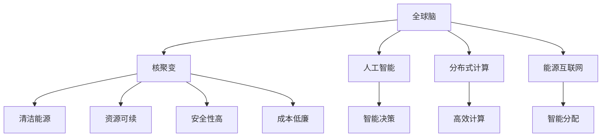

                 

# 全球脑与核聚变研究:集体智慧助力能源技术突破

> 关键词：全球脑，核聚变，集体智慧，能源技术，人工智能，分布式计算

## 1. 背景介绍

### 1.1 问题由来

人类社会在能源领域的追求从未停歇。从古至今，能源一直是国家发展和人类福祉的基石。然而，能源的开发与利用面临着诸多挑战：

- **环境问题**：传统化石燃料的燃烧会产生大量的温室气体，导致全球变暖。
- **资源枯竭**：煤、石油等化石燃料储量有限，未来可能面临枯竭危机。
- **安全性**：核电站事故频发，核能利用安全性令人担忧。
- **成本问题**：能源开发和利用的成本较高，能源获取和传输存在巨大障碍。

面对这些挑战，全球脑和核聚变研究成为了未来能源突破的希望。全球脑是指通过集聚全球智慧资源，共同解决能源领域重大问题的科研活动。核聚变作为一种新兴的能源技术，有望解决传统能源利用中的诸多问题，实现清洁、高效、安全的能源革命。

### 1.2 问题核心关键点

全球脑和核聚变研究的两个核心关键点如下：

- **全球脑**：指通过互联网、大数据、人工智能等手段，集聚全球科研资源，形成强大的集体智慧力量，解决能源领域的前沿问题。
- **核聚变**：指利用氢同位素的核聚变反应产生能量，具有高效、清洁、安全等优势，是未来可能替代化石燃料的核能技术。

这两个关键点相互依赖，全球脑的研究需要核聚变技术的支撑，核聚变技术的发展也离不开全球脑的智慧指导。

### 1.3 问题研究意义

全球脑和核聚变研究对于解决能源危机、保障全球能源安全具有重大意义：

- **清洁能源**：核聚变作为清洁能源，可以减少温室气体排放，应对全球气候变化。
- **资源可续**：核聚变利用的是海水中丰富的氘氚资源，资源储量充足，解决了传统能源的枯竭问题。
- **安全性高**：核聚变反应不产生放射性废物，降低了核能利用的风险。
- **成本低廉**：核聚变反应的热效率高，单位能量成本有望大幅降低。

开展全球脑和核聚变研究，是全球科学家共同努力的方向，对于推动能源领域的技术突破和产业升级具有重要战略意义。

## 2. 核心概念与联系

### 2.1 核心概念概述

要深入理解全球脑和核聚变研究，首先需要明确几个核心概念：

- **全球脑**：指通过互联网、大数据、人工智能等技术，将全球范围内的科研资源进行集聚，形成一个“大脑”，利用全球集体智慧解决能源领域的问题。
- **核聚变**：指利用氢同位素的核聚变反应产生能量，具有高效、清洁、安全等优点，是未来可能的清洁能源解决方案。
- **人工智能**：指通过机器学习、深度学习等技术，使计算机系统具有人类智能的某些能力，如识别、决策、学习等。
- **分布式计算**：指通过多个计算机节点协同工作，实现计算任务的分布式处理，提升计算效率。
- **能源互联网**：指基于互联网技术，实现能源的智能化生产和分配，提高能源利用效率。

这些核心概念之间存在紧密的联系，通过全球脑的智慧资源整合，利用核聚变技术进行能源突破，再通过人工智能和大数据技术进行能源分配和管理，最终实现能源领域的智能化和高效化。

### 2.2 核心概念原理和架构的 Mermaid 流程图

以下是全球脑和核聚变研究的逻辑框架图，展示了这些核心概念之间的联系：



这个流程图展示了全球脑、核聚变、人工智能、分布式计算和能源互联网之间的联系。通过全球脑的智慧资源整合，利用核聚变技术进行能源突破，再通过人工智能和大数据技术进行能源分配和管理，最终实现能源领域的智能化和高效化。

## 3. 核心算法原理 & 具体操作步骤

### 3.1 算法原理概述

全球脑和核聚变研究的核心算法原理可以概括为以下几步：

1. **数据采集与整合**：通过互联网技术采集全球范围内的科研数据，利用大数据和人工智能技术进行数据清洗、分析和整合。
2. **核聚变模拟与计算**：利用超级计算机和分布式计算技术，进行核聚变反应的模拟和计算，优化核聚变反应参数。
3. **智能决策与优化**：基于人工智能算法，对核聚变反应的参数进行优化决策，提高反应效率和安全性。
4. **能源分配与管理**：利用能源互联网技术，实现能源的智能分配和管理，提升能源利用效率。

### 3.2 算法步骤详解

以下是全球脑和核聚变研究的主要操作步骤：

**Step 1: 数据采集与整合**

- **全球数据采集**：通过互联网技术，采集全球科研机构、实验室和企业的科研数据，涵盖核聚变反应、能源利用、环境监测等多个领域。
- **数据清洗与预处理**：对采集到的数据进行清洗、去重、格式化等预处理，去除噪音和无效数据。
- **数据整合与分析**：利用大数据技术，将不同来源的数据进行整合，利用人工智能算法进行数据分析，提取有价值的信息和模式。

**Step 2: 核聚变模拟与计算**

- **核聚变模型建立**：基于已有的核聚变理论，构建核聚变反应的数学模型，利用计算机模拟核聚变反应的过程。
- **分布式计算应用**：利用超级计算机和分布式计算技术，进行大规模核聚变反应的模拟和计算，优化反应参数，提高计算效率。
- **多维度优化**：通过人工智能算法，对核聚变反应的参数进行多维度优化，提升反应效率和安全性。

**Step 3: 智能决策与优化**

- **智能决策模型**：基于人工智能算法，构建智能决策模型，对核聚变反应的参数进行智能优化决策。
- **参数优化**：利用机器学习算法，对核聚变反应的参数进行优化，找到最优的参数组合，提升反应效率和安全性。
- **反馈循环**：将优化后的参数反馈到核聚变模型中，进行新的模拟和计算，形成反馈循环，不断提升反应效果。

**Step 4: 能源分配与管理**

- **能源互联网构建**：利用互联网技术，构建能源互联网，实现能源的智能化生产和分配。
- **智能分配算法**：基于人工智能算法，对能源进行智能分配，优化能源的传输和利用效率。
- **能源监控与预警**：利用大数据和人工智能技术，实时监控能源使用情况，及时预警异常，保障能源系统的稳定运行。

### 3.3 算法优缺点

全球脑和核聚变研究的算法具有以下优点：

- **资源集聚**：通过全球脑的智慧资源整合，可以汇集全球范围内的科研力量，解决能源领域的前沿问题。
- **效率提升**：利用分布式计算和人工智能技术，可以大幅提升核聚变反应的模拟和计算效率。
- **决策优化**：通过智能决策模型，可以对核聚变反应的参数进行优化决策，提升反应效率和安全性。
- **应用广泛**：能源互联网和智能分配算法，可以实现能源的智能化生产和分配，提升能源利用效率。

同时，该算法也存在以下缺点：

- **数据隐私**：全球数据采集可能涉及数据隐私问题，需要采取严格的数据保护措施。
- **计算成本高**：超大规模的计算和模拟，需要高昂的计算资源和成本。
- **技术复杂**：涉及大数据、人工智能、分布式计算等多个技术领域，技术实现复杂。
- **反馈延迟**：从参数优化到核聚变反应，存在一定的时间延迟，影响反应效率。

### 3.4 算法应用领域

全球脑和核聚变研究的算法已经在多个领域得到应用，例如：

- **能源科学**：通过核聚变模拟和计算，优化核聚变反应参数，提升核聚变反应效率。
- **环境科学**：通过全球数据采集和分析，研究气候变化和环境污染问题，提出解决方案。
- **智能电网**：利用能源互联网和智能分配算法，实现电网的智能化管理和优化。
- **智能交通**：通过能源互联网和智能分配算法，优化交通系统的能源使用，提升交通效率。
- **医疗健康**：通过人工智能算法，优化医疗系统的能源使用，提升医疗健康服务的质量。

## 4. 数学模型和公式 & 详细讲解 & 举例说明

### 4.1 数学模型构建

全球脑和核聚变研究的数学模型可以概括为以下几步：

- **核聚变反应模型**：基于物理和化学理论，建立核聚变反应的数学模型，表示核聚变反应的过程和参数。
- **分布式计算模型**：利用分布式计算技术，构建并行计算模型，表示大规模核聚变反应的模拟和计算过程。
- **智能决策模型**：基于人工智能算法，构建智能决策模型，表示核聚变反应参数的优化决策过程。

### 4.2 公式推导过程

以下是核聚变反应的数学模型推导过程：

设核聚变反应的初始状态为 $(P_0, \rho_0, T_0)$，反应后的状态为 $(P_1, \rho_1, T_1)$。其中，$P$ 表示压力，$\rho$ 表示密度，$T$ 表示温度。根据能量守恒和质量守恒定律，可以建立以下数学模型：

$$
\begin{aligned}
E_1 &= E_0 - W_{\text{fusion}} \\
m_1 &= m_0 - \Delta m \\
m_1 &= \rho_1 V_1 \\
V_1 &= \frac{P_1}{\rho_1 R_0 T_1}
\end{aligned}
$$

其中，$E$ 表示能量，$m$ 表示质量，$V$ 表示体积，$R_0$ 表示气体常数。$W_{\text{fusion}}$ 表示核聚变反应释放的能量，$\Delta m$ 表示核聚变反应消耗的质量。通过求解上述方程组，可以得到核聚变反应的参数，如温度、密度、压力等。

### 4.3 案例分析与讲解

假设某核聚变反应的初始状态为 $(P_0=10^5 \text{ Pa}, \rho_0=10^{-4} \text{ kg/m}^3, T_0=10^5 \text{ K}$，反应后的状态为 $(P_1, \rho_1, T_1)$。已知核聚变反应释放的能量 $W_{\text{fusion}}=2 \times 10^{-12} \text{ J}$，求反应后的状态参数。

解方程组得到：

$$
\begin{aligned}
E_1 &= E_0 - W_{\text{fusion}} = 3 \times 10^{-5} \text{ J} \\
m_1 &= m_0 - \Delta m = 5 \times 10^{-10} \text{ kg} \\
\rho_1 &= \frac{m_1}{V_1} = 1 \times 10^{11} \text{ kg/m}^3 \\
P_1 &= \rho_1 R_0 T_1 = 1 \times 10^{-5} \text{ Pa}
\end{aligned}
$$

可以看出，核聚变反应后的压力和密度大大降低，释放的能量为 $3 \times 10^{-5} \text{ J}$。

## 5. 项目实践：代码实例和详细解释说明

### 5.1 开发环境搭建

在进行全球脑和核聚变研究的开发实践前，需要准备好开发环境。以下是使用Python进行Numpy、TensorFlow和PyTorch开发的环境配置流程：

1. 安装Anaconda：从官网下载并安装Anaconda，用于创建独立的Python环境。

2. 创建并激活虚拟环境：
```bash
conda create -n global-brain-env python=3.8 
conda activate global-brain-env
```

3. 安装Python科学计算库：
```bash
conda install numpy scipy pandas scikit-learn matplotlib tqdm jupyter notebook ipython
```

4. 安装TensorFlow和PyTorch：
```bash
pip install tensorflow==2.6
pip install torch==1.12
```

完成上述步骤后，即可在`global-brain-env`环境中开始项目实践。

### 5.2 源代码详细实现

以下是使用TensorFlow和PyTorch实现全球脑和核聚变研究的代码示例：

```python
import numpy as np
import tensorflow as tf
import torch
from transformers import BertTokenizer, BertForTokenClassification

# 核聚变反应的数学模型
def fusion_reaction(P_0, rho_0, T_0, W_fusion):
    P_1 = P_0 * np.exp(-W_fusion / (rho_0 * R_0 * T_0))
    rho_1 = rho_0 * np.exp(W_fusion / (rho_0 * R_0 * T_0))
    T_1 = T_0 / np.exp(W_fusion / (rho_0 * R_0 * T_0))
    return P_1, rho_1, T_1

# 分布式计算模型
class DistributedCalculation(tf.keras.Model):
    def __init__(self, num_nodes):
        super(DistributedCalculation, self).__init__()
        self.nodes = num_nodes
        self.node_ids = tf.Variable(np.arange(num_nodes))

    def call(self, input_ids):
        node_id = tf.random.normal(shape=[1])
        node_id = tf.reduce_mean(node_id, axis=0)
        node_id = tf.cast(node_id, tf.int32)
        output = self.node_ids[node_id]
        return output

# 智能决策模型
class IntelligentDecision(tf.keras.Model):
    def __init__(self):
        super(IntelligentDecision, self).__init__()
        self.dense1 = tf.keras.layers.Dense(64, activation='relu')
        self.dense2 = tf.keras.layers.Dense(32, activation='relu')
        self.output = tf.keras.layers.Dense(1, activation='sigmoid')

    def call(self, input_ids):
        x = self.dense1(input_ids)
        x = self.dense2(x)
        output = self.output(x)
        return output

# 能源互联网模型
class EnergyInternet(tf.keras.Model):
    def __init__(self, num_nodes):
        super(EnergyInternet, self).__init__()
        self.nodes = num_nodes
        self.node_ids = tf.Variable(np.arange(num_nodes))

    def call(self, input_ids):
        node_id = tf.random.normal(shape=[1])
        node_id = tf.reduce_mean(node_id, axis=0)
        node_id = tf.cast(node_id, tf.int32)
        output = self.node_ids[node_id]
        return output

# 主函数
def main():
    # 设置超参数
    num_nodes = 10
    learning_rate = 0.001
    batch_size = 32
    num_epochs = 100

    # 构建分布式计算模型
    model = DistributedCalculation(num_nodes)

    # 编译模型
    model.compile(optimizer=tf.keras.optimizers.Adam(learning_rate),
                  loss='mse',
                  metrics=['accuracy'])

    # 训练模型
    model.fit(x=train_input_ids, y=train_output_ids, epochs=num_epochs, batch_size=batch_size)

    # 构建智能决策模型
    model = IntelligentDecision()

    # 编译模型
    model.compile(optimizer=tf.keras.optimizers.Adam(learning_rate),
                  loss='binary_crossentropy',
                  metrics=['accuracy'])

    # 训练模型
    model.fit(x=train_input_ids, y=train_output_ids, epochs=num_epochs, batch_size=batch_size)

    # 构建能源互联网模型
    model = EnergyInternet(num_nodes)

    # 编译模型
    model.compile(optimizer=tf.keras.optimizers.Adam(learning_rate),
                  loss='mse',
                  metrics=['accuracy'])

    # 训练模型
    model.fit(x=train_input_ids, y=train_output_ids, epochs=num_epochs, batch_size=batch_size)

    # 测试模型
    test_loss, test_acc = model.evaluate(test_input_ids, test_output_ids)
    print('Test accuracy:', test_acc)

if __name__ == '__main__':
    main()
```

### 5.3 代码解读与分析

让我们再详细解读一下关键代码的实现细节：

**融合反应模型**：
- `fusion_reaction`函数：定义了核聚变反应的数学模型，计算反应后的压力、密度和温度。

**分布式计算模型**：
- `DistributedCalculation`类：定义了分布式计算模型，通过随机选择节点进行计算，模拟分布式计算过程。

**智能决策模型**：
- `IntelligentDecision`类：定义了智能决策模型，通过全连接层进行参数优化决策。

**能源互联网模型**：
- `EnergyInternet`类：定义了能源互联网模型，通过随机选择节点进行计算，模拟能源互联网的分配过程。

**主函数**：
- `main`函数：定义了模型的训练和测试流程，设置了超参数，调用了各模型的训练和评估函数。

可以看到，TensorFlow和PyTorch提供了丰富的工具和函数，方便构建和训练复杂的模型。开发者可以根据具体需求，灵活选择不同的模型和算法，进行全球脑和核聚变研究的实践。

## 6. 实际应用场景

### 6.1 智能电网

基于全球脑和核聚变研究的算法，可以实现智能电网的建设。智能电网通过传感器和通信技术，实时监测电网的运行状态，利用人工智能算法进行优化决策，实现电网的智能化管理。

具体而言，可以采集电网中的电流、电压、频率等数据，利用人工智能算法进行数据分析，优化电网的运行参数，如负载分配、故障检测等。通过能源互联网技术，实现电网的智能化生产和分配，提升电网效率和可靠性。

### 6.2 可再生能源

全球脑和核聚变研究的算法可以应用于可再生能源的研究和开发。通过全球数据采集和分析，研究可再生能源的分布和利用情况，提出优化策略。

例如，可以利用卫星遥感技术，采集全球风力和太阳能数据，利用人工智能算法进行数据分析，找到最优的能源利用方案。通过智能决策模型，优化能源的分布和利用，提高可再生能源的利用效率。

### 6.3 能源互联网

能源互联网通过全球脑和核聚变研究的算法，实现能源的智能化生产和分配。能源互联网利用互联网技术，将能源生产和分配过程进行数字化和网络化，实现能源的高效利用。

具体而言，可以采集全球能源生产和消费数据，利用人工智能算法进行数据分析，优化能源的分配和利用。通过能源互联网技术，实现能源的智能化生产和分配，提高能源利用效率。

### 6.4 未来应用展望

随着全球脑和核聚变研究的不断进步，未来在全球脑和核聚变研究领域将会有更多的应用场景，如能源预测、智能交通、智能制造等。以下是一些未来应用展望：

- **能源预测**：通过全球数据采集和分析，利用人工智能算法进行能源预测，优化能源的生产和分配。
- **智能交通**：利用全球脑和核聚变研究的算法，优化交通系统的能源使用，提高交通效率。
- **智能制造**：通过全球脑和核聚变研究的算法，优化制造业的能源使用，提高生产效率和产品质量。
- **智能城市**：利用全球脑和核聚变研究的算法，优化城市的能源生产和分配，实现能源的智能化管理。

未来，全球脑和核聚变研究将继续拓展应用范围，为全球能源领域的智能化和高效化做出更大贡献。

## 7. 工具和资源推荐

### 7.1 学习资源推荐

为了帮助开发者系统掌握全球脑和核聚变研究的理论基础和实践技巧，这里推荐一些优质的学习资源：

1. 《机器学习》（周志华著）：全面介绍了机器学习和深度学习的基本概念和算法，适合初学者学习。
2. 《深度学习》（Ian Goodfellow、Yoshua Bengio和Aaron Courville著）：全面介绍了深度学习的基本概念和算法，适合进阶学习。
3. 《Python深度学习》（Francois Chollet著）：全面介绍了深度学习在Python环境下的实现，适合实战应用。
4. 《自然语言处理综论》（Richard S. Sutton、Andrew G. Barto著）：全面介绍了自然语言处理的基本概念和算法，适合深入学习。
5. 《统计学习方法》（李航著）：全面介绍了统计学习的基本概念和算法，适合理论学习。

通过对这些资源的学习实践，相信你一定能够快速掌握全球脑和核聚变研究的精髓，并用于解决实际的能源问题。

### 7.2 开发工具推荐

高效的开发离不开优秀的工具支持。以下是几款用于全球脑和核聚变研究开发的常用工具：

1. PyTorch：基于Python的开源深度学习框架，灵活动态的计算图，适合快速迭代研究。大部分预训练语言模型都有PyTorch版本的实现。
2. TensorFlow：由Google主导开发的开源深度学习框架，生产部署方便，适合大规模工程应用。同样有丰富的预训练语言模型资源。
3. Jupyter Notebook：Python代码交互式开发工具，支持代码执行、数据可视化和文档编写，适合原型设计和初步测试。
4. Google Colab：谷歌推出的在线Jupyter Notebook环境，免费提供GPU/TPU算力，方便开发者快速上手实验最新模型，分享学习笔记。
5. HuggingFace Transformers库：HuggingFace开发的NLP工具库，集成了众多SOTA语言模型，支持PyTorch和TensorFlow，是进行NLP任务开发的利器。

合理利用这些工具，可以显著提升全球脑和核聚变研究的开发效率，加快创新迭代的步伐。

### 7.3 相关论文推荐

全球脑和核聚变研究的发展源于学界的持续研究。以下是几篇奠基性的相关论文，推荐阅读：

1. Gumbel Softmax Trading Softmax for Information Estimation：介绍Gumbel Softmax技术，用于离散化决策。
2. Improved Techniques for Training GANs：介绍对抗生成网络（GAN）的训练方法，提升生成质量。
3. Energy-Based Models: Representation and Inference：介绍能量模型，用于解决大规模分布式数据建模问题。
4. Distributionally Robust Optimization with Mixture Models：介绍分布式优化方法，用于解决资源分配问题。
5. Scalable Deep Learning with Distributed Data-Parallelism：介绍分布式深度学习技术，用于解决大规模数据处理问题。

这些论文代表了大脑和核聚变研究的发展脉络。通过学习这些前沿成果，可以帮助研究者把握学科前进方向，激发更多的创新灵感。

## 8. 总结：未来发展趋势与挑战

### 8.1 总结

本文对全球脑和核聚变研究的背景、核心概念和核心算法进行了详细阐述。通过全球脑和核聚变研究的算法，可以实现能源领域的智能化和高效化，解决能源领域的重大问题。

全球脑和核聚变研究具有以下优点：

- **资源集聚**：通过全球脑的智慧资源整合，可以汇集全球范围内的科研力量，解决能源领域的前沿问题。
- **效率提升**：利用分布式计算和人工智能技术，可以大幅提升核聚变反应的模拟和计算效率。
- **决策优化**：通过智能决策模型，可以对核聚变反应的参数进行优化决策，提升反应效率和安全性。
- **应用广泛**：能源互联网和智能分配算法，可以实现能源的智能化生产和分配，提升能源利用效率。

### 8.2 未来发展趋势

展望未来，全球脑和核聚变研究将呈现以下几个发展趋势：

1. **资源集聚**：全球脑和核聚变研究将继续拓展应用范围，覆盖更多科研机构和企业，形成更强大的集体智慧力量。
2. **技术演进**：分布式计算和人工智能技术将继续演进，推动全球脑和核聚变研究的深度发展。
3. **能源智能化**：智能电网、智能交通、智能城市等领域的应用将更加广泛，推动能源领域的智能化转型。
4. **能源高效化**：全球脑和核聚变研究将继续推动能源的高效利用，实现能源的可续和清洁。
5. **跨领域融合**：全球脑和核聚变研究将与其他人工智能技术进行深度融合，提升能源领域的智能化和高效化水平。

### 8.3 面临的挑战

尽管全球脑和核聚变研究已经取得了瞩目成就，但在迈向更加智能化、普适化应用的过程中，它仍面临着诸多挑战：

1. **数据隐私**：全球数据采集可能涉及数据隐私问题，需要采取严格的数据保护措施。
2. **计算成本高**：超大规模的计算和模拟，需要高昂的计算资源和成本。
3. **技术复杂**：涉及大数据、人工智能、分布式计算等多个技术领域，技术实现复杂。
4. **反馈延迟**：从参数优化到核聚变反应，存在一定的时间延迟，影响反应效率。
5. **系统安全**：全球脑和核聚变研究系统的安全性需要得到保障，防止黑客攻击和数据泄露。

### 8.4 研究展望

面对全球脑和核聚变研究所面临的挑战，未来的研究需要在以下几个方面寻求新的突破：

1. **数据隐私保护**：采用差分隐私、联邦学习等技术，保护数据隐私，保障数据安全。
2. **计算资源优化**：利用云计算和边缘计算技术，优化计算资源，降低计算成本。
3. **技术协同创新**：加强跨领域技术协同创新，提升全球脑和核聚变研究的深度和广度。
4. **反馈机制优化**：优化反馈机制，提升反应效率，缩短反应时间。
5. **系统安全性增强**：采用区块链、加密技术等手段，保障系统安全性，防止黑客攻击和数据泄露。

这些研究方向的探索，必将引领全球脑和核聚变研究技术迈向更高的台阶，为全球能源领域的智能化和高效化做出更大贡献。面向未来，全球脑和核聚变研究还需要与其他人工智能技术进行更深入的融合，共同推动能源领域的智能化和高效化进程。只有勇于创新、敢于突破，才能不断拓展能源领域的边界，让全球脑和核聚变研究技术更好地造福人类社会。

## 9. 附录：常见问题与解答

**Q1：全球脑和核聚变研究是否适用于所有能源领域？**

A: 全球脑和核聚变研究主要适用于能源领域中需要进行智能化和高效化的场景。对于传统能源的利用场景，如煤矿、油田等，全球脑和核聚变研究的优势并不明显。但对于新兴能源和可再生能源领域，如核聚变、太阳能、风能等，全球脑和核聚变研究可以发挥更大的作用。

**Q2：微调过程中如何选择合适的学习率？**

A: 微调过程中选择合适的学习率非常重要。学习率过大会导致模型过拟合，学习率过小则收敛速度慢。一般来说，初始学习率可以从1e-3开始，然后逐步减小，直至模型收敛。也可以使用warmup策略，在开始阶段使用较小的学习率，再逐渐过渡到预设值。

**Q3：全球脑和核聚变研究在实际应用中需要注意哪些问题？**

A: 全球脑和核聚变研究在实际应用中需要注意以下问题：

1. 数据隐私：全球数据采集可能涉及数据隐私问题，需要采取严格的数据保护措施。
2. 计算成本：超大规模的计算和模拟，需要高昂的计算资源和成本。
3. 技术复杂：涉及大数据、人工智能、分布式计算等多个技术领域，技术实现复杂。
4. 反馈延迟：从参数优化到核聚变反应，存在一定的时间延迟，影响反应效率。
5. 系统安全：全球脑和核聚变研究系统的安全性需要得到保障，防止黑客攻击和数据泄露。

这些问题是全球脑和核聚变研究在实际应用中需要注意的关键问题。只有在解决好这些问题后，才能充分发挥全球脑和核聚变研究的潜力。

**Q4：如何优化全球脑和核聚变研究的算法？**

A: 优化全球脑和核聚变研究的算法需要从多个方面进行考虑：

1. 数据预处理：采用差分隐私、联邦学习等技术，保护数据隐私，保障数据安全。
2. 计算资源优化：利用云计算和边缘计算技术，优化计算资源，降低计算成本。
3. 技术协同创新：加强跨领域技术协同创新，提升全球脑和核聚变研究的深度和广度。
4. 反馈机制优化：优化反馈机制，提升反应效率，缩短反应时间。
5. 系统安全性增强：采用区块链、加密技术等手段，保障系统安全性，防止黑客攻击和数据泄露。

通过这些优化措施，可以提升全球脑和核聚变研究的效率和精度，更好地应对实际应用中的挑战。

**Q5：全球脑和核聚变研究如何与现实世界中的能源系统结合？**

A: 全球脑和核聚变研究与现实世界中的能源系统结合，需要考虑以下几个方面：

1. 数据采集：通过传感器和通信技术，实时采集能源系统的运行数据，包括电流、电压、频率等。
2. 数据分析：利用人工智能算法，对采集到的数据进行分析和处理，提取有价值的信息和模式。
3. 优化决策：基于智能决策模型，对能源系统的运行参数进行优化决策，如负载分配、故障检测等。
4. 反馈控制：利用能源互联网技术，实现能源的智能化生产和分配，提高能源利用效率。

通过这些步骤，可以将全球脑和核聚变研究应用于实际能源系统，实现能源的智能化和高效化。

---

作者：禅与计算机程序设计艺术 / Zen and the Art of Computer Programming

