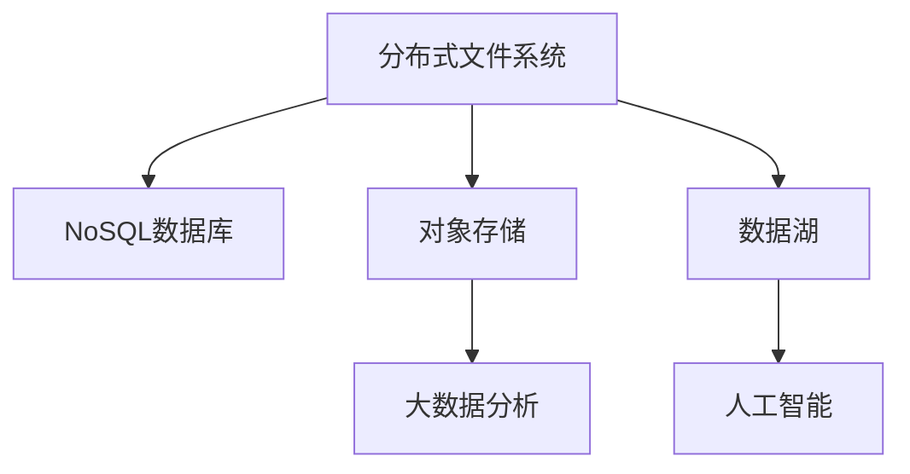

                 

# 分布式存储系统：大规模数据管理解决方案

> 关键词：分布式存储,大规模数据管理,分布式文件系统,NoSQL数据库,对象存储,数据湖

## 1. 背景介绍

### 1.1 问题由来
在互联网数据爆炸的今天，数据规模迅速增长，如何高效、可靠地存储和管理这些海量数据，成为许多企业和组织面临的巨大挑战。传统的集中式存储系统已经难以满足大规模数据存储的需求。分布式存储系统应运而生，通过构建一个由多个存储节点构成的分布式网络，来实现数据的高可用性、高扩展性、高性能和低成本。

### 1.2 问题核心关键点
分布式存储系统的主要优势在于：
1. **高可用性**：通过数据复制和冗余存储，确保数据的持久性和可靠性。
2. **高扩展性**：可以动态扩展存储容量和性能，支持数据量的快速增长。
3. **高性能**：通过并行计算和数据本地化，提高数据访问和处理效率。
4. **低成本**：通过标准化硬件和软件，降低单台服务器的成本，实现资源的有效利用。

### 1.3 问题研究意义
分布式存储系统在大规模数据管理中发挥着至关重要的作用，支持了大数据分析、云计算、物联网、人工智能等多个领域的应用。通过分布式存储系统，企业可以实现数据的高效管理和智能分析，提升业务决策的准确性和及时性，推动技术创新和商业模式的变革。

## 2. 核心概念与联系

### 2.1 核心概念概述

为更好地理解分布式存储系统的核心原理，本节将介绍几个关键概念：

- **分布式文件系统(Distributed File System)**：一种允许多个客户端同时访问文件存储系统的文件系统，通过网络将数据分散存储在不同的服务器节点上。
- **NoSQL数据库(Not Only SQL Database)**：一类非关系型数据库，支持分布式存储、非结构化数据和实时处理等特性，适用于大数据量的存储和分析。
- **对象存储(Object Storage)**：一种以对象为基本单位进行存储的数据模型，支持更灵活的数据访问和处理方式。
- **数据湖(Data Lake)**：一种集成了多种数据源、支持大规模数据分析和机器学习的数据平台，旨在为企业提供统一的、开放的数据访问和分析服务。

这些核心概念之间的逻辑关系可以通过以下Mermaid流程图来展示：



这个流程图展示了一些常见分布式存储概念及其之间的关系：

1. 分布式文件系统是分布式存储的基础。
2. NoSQL数据库和对象存储是分布式文件系统的高级形式，支持更多的数据类型和处理方式。
3. 数据湖整合了多个数据源，提供统一的数据访问和分析服务。
4. 数据湖和NoSQL数据库、对象存储均可用于大数据分析和人工智能。

这些核心概念共同构成了分布式存储系统的理论基础，使得企业在处理大规模数据时能够灵活选择适合自己的数据存储和管理方式。

## 3. 核心算法原理 & 具体操作步骤

### 3.1 算法原理概述

分布式存储系统通常采用一种中心化的架构，由一个或多个主节点协调多个从节点的数据操作。主节点负责数据的存储管理和调度，从节点负责数据的实际存储和访问。这种架构下，数据的读写操作被分为多个步骤，每一步都有对应的算法来保证数据的一致性和可靠性。

核心算法包括：
1. **数据分布算法**：确定数据如何分布到不同的节点上，以实现负载均衡和高可用性。
2. **数据一致性算法**：确保分布式系统中数据的最终一致性，避免数据冗余和数据丢失。
3. **数据复制算法**：实现数据的冗余存储，增强系统的容错性和可靠性。
4. **数据访问算法**：优化数据的读取和写入操作，提升系统的性能和响应速度。

### 3.2 算法步骤详解

下面详细介绍分布式存储系统的核心算法步骤：

**Step 1: 数据分布算法**
- 首先，确定数据的分布策略。常见的策略包括哈希算法和一致性哈希算法。
- 哈希算法将数据按照一定规则散列到不同的节点上，实现负载均衡。
- 一致性哈希算法在节点发生变化时，自动重新分配数据，保证数据分布的稳定性和一致性。

**Step 2: 数据一致性算法**
- 数据一致性算法通常使用两阶段提交协议、Paxos协议等，保证所有节点对同一数据操作的结果一致。
- 两阶段提交协议首先由主节点将数据操作分发到所有从节点，然后收集所有节点的确认，最后提交操作。
- Paxos协议通过分布式投票机制，确保数据操作的最终一致性。

**Step 3: 数据复制算法**
- 数据复制算法通常采用主从复制、多主复制等策略，确保数据的冗余存储和高可用性。
- 主从复制通过在多个节点中复制一份主数据，保证数据在主节点故障时的可用性。
- 多主复制通过在多个节点中复制数据，实现负载均衡和高可用性。

**Step 4: 数据访问算法**
- 数据访问算法优化数据的读取和写入操作，提升系统的性能和响应速度。
- 常用的数据访问算法包括局部性优先算法、缓存算法等。
- 局部性优先算法通过优先访问靠近客户端的节点，减少数据传输距离，提升性能。
- 缓存算法通过在客户端和节点之间缓存数据，减少数据的读写次数，提升系统的响应速度。

### 3.3 算法优缺点

分布式存储系统具有以下优点：
1. **高可用性**：通过数据复制和冗余存储，确保数据的持久性和可靠性。
2. **高扩展性**：可以动态扩展存储容量和性能，支持数据量的快速增长。
3. **高性能**：通过并行计算和数据本地化，提高数据访问和处理效率。
4. **低成本**：通过标准化硬件和软件，降低单台服务器的成本，实现资源的有效利用。

同时，分布式存储系统也存在一定的局限性：
1. **复杂性高**：系统设计复杂，需要处理的数据和业务场景多种多样，实现难度大。
2. **数据一致性难以保证**：在分布式系统中，数据一致性的维护比集中式系统复杂，容易出现数据冲突和丢失。
3. **资源管理困难**：由于分布式系统的异构性，资源管理和调度较为困难，容易出现资源浪费和性能瓶颈。

尽管存在这些局限性，但就目前而言，分布式存储系统仍然是数据存储和管理的最佳选择。未来相关研究的重点在于如何进一步提高系统的可用性、可扩展性和性能，同时降低复杂性和管理难度。

### 3.4 算法应用领域

分布式存储系统已经在多个领域得到了广泛应用，例如：

- **云计算**：云计算基础设施的核心组成部分，支持弹性计算和存储资源管理。
- **大数据分析**：支持海量数据的存储、处理和分析，提供实时的数据分析服务。
- **物联网**：支持传感器数据的存储和处理，实现设备的互联互通。
- **人工智能**：支持大规模模型训练和数据处理，提供高效的计算和存储服务。
- **医疗健康**：支持医疗数据的存储和管理，实现远程医疗和精准医疗。
- **金融服务**：支持金融数据的存储和分析，提供实时交易和风险控制服务。
- **智能制造**：支持工业数据的存储和处理，实现智能生产和供应链管理。

除了上述这些经典应用外，分布式存储系统还在更多新兴领域得到应用，如智慧城市、智能交通、智能农业等，为各行业的数字化转型提供了重要的技术支持。

## 4. 数学模型和公式 & 详细讲解 & 举例说明

### 4.1 数学模型构建

为更好地理解分布式存储系统的算法原理，本节将使用数学语言对核心算法进行更加严格的刻画。

记分布式存储系统中的数据块为 $D$，由多个子块组成，每个子块的大小为 $S$，系统中有 $n$ 个存储节点，每个节点的容量为 $C$，系统的总容量为 $N$。

定义系统中的数据分布策略为 $P$，数据一致性算法为 $A$，数据复制策略为 $R$，数据访问策略为 $M$。

定义数据块的分布为 $d$，数据块的一致性状态为 $c$，数据块的副本数量为 $r$，数据块的读取次数为 $m$。

定义系统在时间 $t$ 内的性能指标为 $P(t)$，包括数据访问时间、数据写入时间、数据一致性维护时间等。

### 4.2 公式推导过程

以下我们以一致性哈希算法为例，推导数据的分布和一致性维护过程的数学模型。

在一致性哈希算法中，数据块的分布 $d$ 通过哈希函数 $H$ 计算得到：

$$
d = H(D)
$$

其中 $H$ 为哈希函数，将数据块 $D$ 映射到存储节点集合 $N$ 中的一个节点 $n$。

一致性哈希算法在节点发生变化时，自动重新分配数据，保证数据分布的稳定性和一致性。假设系统中的节点集合为 $N$，当前节点集合为 $N_0$，新加入的节点为 $n$，则数据块 $D$ 的分布更新过程如下：

1. 计算哈希值 $H(D)$。
2. 如果 $H(D)$ 落在节点集合 $N_0$ 中的某个节点 $n_0$，则数据块 $D$ 继续存放在 $n_0$ 中。
3. 如果 $H(D)$ 落在新节点 $n$ 中，则将数据块 $D$ 从 $n_0$ 迁移到 $n$ 中。

数据一致性维护算法通常使用两阶段提交协议或Paxos协议，以确保所有节点对同一数据操作的结果一致。假设系统中的节点集合为 $N$，当前节点集合为 $N_0$，节点 $n$ 和 $n_0$ 对数据块 $D$ 的操作一致性维护过程如下：

1. 节点 $n$ 执行数据操作 $O$，将操作结果 $R$ 发送给节点 $n_0$。
2. 节点 $n_0$ 接收节点 $n$ 发送的操作结果 $R$。
3. 节点 $n_0$ 向节点 $n$ 发送确认消息，表示已接收操作结果 $R$。
4. 节点 $n$ 和 $n_0$ 都收到对方的确认消息后，才提交操作 $O$。

数据复制算法通常采用主从复制或多主复制等策略，以实现数据的冗余存储和高可用性。假设系统中的节点集合为 $N$，当前节点集合为 $N_0$，数据块 $D$ 的副本数量为 $r$，则数据复制过程如下：

1. 在节点集合 $N_0$ 中选择 $r$ 个节点 $N_r$，将数据块 $D$ 复制存储在 $N_r$ 中。
2. 当节点 $n$ 故障时，从节点集合 $N_0$ 中选择一个节点 $n_0$，将数据块 $D$ 迁移到 $n_0$ 中。

数据访问算法优化数据的读取和写入操作，提升系统的性能和响应速度。假设系统中的节点集合为 $N$，当前节点集合为 $N_0$，数据块 $D$ 的读取次数为 $m$，则数据访问过程如下：

1. 计算哈希值 $H(D)$，找到数据块 $D$ 的分布节点 $n$。
2. 读取数据块 $D$ 的本地副本，如果本地副本不可用，则从其他节点 $n_0$ 中读取。
3. 如果数据块 $D$ 的副本数量 $r$ 大于 1，则读取多个副本，选择响应时间最短的副本作为读取结果。

在得到这些算法过程的数学模型后，即可基于这些模型设计具体的实现方法。

### 4.3 案例分析与讲解

下面以一个具体案例，来进一步说明一致性哈希算法、数据一致性维护算法和数据复制算法的实现过程。

假设系统中的节点集合为 $N=\{node1,node2,node3,node4,node5\}$，数据块 $D$ 的大小为 $S$，系统总容量为 $N=4S$。

**一致性哈希算法**：

1. 计算哈希值 $H(D)$，假设 $H(D)=0.8$。
2. 节点集合 $N$ 中的节点 $n_0=node1$ 存储数据块 $D$。
3. 假设节点 $n_0$ 故障，新加入节点 $n=node6$。
4. 计算哈希值 $H(D)$，假设 $H(D)=0.9$。
5. 节点集合 $N$ 中的节点 $n=node6$ 存储数据块 $D$。

**数据一致性维护算法**：

1. 节点 $n$ 执行数据操作 $O$，将操作结果 $R$ 发送给节点 $n_0$。
2. 节点 $n_0$ 接收节点 $n$ 发送的操作结果 $R$。
3. 节点 $n_0$ 向节点 $n$ 发送确认消息，表示已接收操作结果 $R$。
4. 节点 $n$ 和 $n_0$ 都收到对方的确认消息后，才提交操作 $O$。

**数据复制算法**：

1. 在节点集合 $N$ 中选择 2 个节点 $N_r=\{node1,node2\}$，将数据块 $D$ 复制存储在 $N_r$ 中。
2. 当节点 $n$ 故障时，从节点集合 $N$ 中选择一个节点 $n_0=node3$，将数据块 $D$ 迁移到 $n_0$ 中。

通过这些算法，分布式存储系统能够实现数据的分布式存储和高效访问，支持大规模数据的管理和分析。

## 5. 项目实践：代码实例和详细解释说明

### 5.1 开发环境搭建

在进行分布式存储系统的实践前，我们需要准备好开发环境。以下是使用Python进行分布式文件系统开发的常见环境配置流程：

1. 安装Anaconda：从官网下载并安装Anaconda，用于创建独立的Python环境。

2. 创建并激活虚拟环境：
```bash
conda create -n fs-env python=3.8 
conda activate fs-env
```

3. 安装相关库：
```bash
pip install PyHadoop PySpark
```

4. 安装Hadoop和Spark：
```bash
wget http://apache-hadoop.s3.amazonaws.com/hadoop-3.2.1/hadoop-3.2.1.tar.gz
tar -xvzf hadoop-3.2.1.tar.gz
cd hadoop-3.2.1
bin/hadoop version
```

5. 启动Hadoop服务：
```bash
bin/hadoop namenode -daemonlog /var/log/hadoop/namenode.log
bin/hdfs dfsadmin -refreshNodes
bin/hdfs dfs -ls /
```

6. 安装Spark：
```bash
wget https://archive.apache.org/dist/spark/spark-3.0.1/spark-3.0.1-bin-hadoop3.tgz
tar -xvzf spark-3.0.1-bin-hadoop3.tgz
cd spark-3.0.1-bin-hadoop3
bin/spark-submit --master local[*] --class com.example.HadoopExample my.jar
```

完成上述步骤后，即可在`fs-env`环境中开始分布式文件系统的开发实践。

### 5.2 源代码详细实现

这里我们以Hadoop分布式文件系统为例，展示一个简单的分布式文件系统代码实现。

```python
from pyhdfs import HdfsClient

class HadoopFS:
    def __init__(self, host, port):
        self.client = HdfsClient(host, port)

    def list_files(self, path):
        return self.client.listdir(path)

    def create_file(self, path, data):
        with self.client.writeFile(path, data, encoding='utf-8') as file:
            file.write(data)

    def read_file(self, path):
        with self.client.readFile(path, encoding='utf-8') as file:
            return file.read()

# 示例代码
hdfs = HadoopFS('localhost', 9000)
files = hdfs.list_files('/')
print(files)
hdfs.create_file('test.txt', 'Hello, Hadoop!')
print(hdfs.read_file('test.txt'))
```

在这个代码中，我们定义了一个HadoopFS类，通过PyHadoop库访问HDFS系统，实现了文件列表的列出、文件的创建和读取等基本操作。

### 5.3 代码解读与分析

让我们再详细解读一下关键代码的实现细节：

**HadoopFS类**：
- `__init__`方法：初始化HdfsClient，建立与服务器的连接。
- `list_files`方法：通过HdfsClient的listdir方法，列出指定路径下的所有文件。
- `create_file`方法：通过HdfsClient的createFile方法，创建指定路径的文件，并写入数据。
- `read_file`方法：通过HdfsClient的readFile方法，读取指定路径的文件内容。

这些方法通过调用PyHadoop库的底层HdfsClient对象，实现了Hadoop分布式文件系统的基本操作。

**示例代码**：
- 首先，创建了一个HadoopFS对象，指定了HDFS服务器的地址和端口号。
- 通过`list_files`方法列出所有文件。
- 通过`create_file`方法创建了一个名为'test.txt'的文件，并写入数据'Hello, Hadoop!'。
- 通过`read_file`方法读取文件'test.txt'的内容，并输出到控制台。

通过这些代码示例，可以看到，PyHadoop库为Hadoop分布式文件系统的开发提供了便捷的API接口，使得开发者可以快速上手实现文件系统的基本功能。

当然，实际的分布式文件系统实现还需要考虑更多因素，如并发控制、数据同步、故障恢复等，但核心的文件读写操作原理类似。

## 6. 实际应用场景

### 6.1 智能存储系统

智能存储系统利用分布式文件系统的先进技术，实现了数据的分布式存储和管理，支持大规模数据的实时分析和处理。

在数据中心、智慧城市、物联网等场景中，智能存储系统通过分布式文件系统提供高效的数据存储和管理服务，支持海量数据的实时处理和分析，实现智能监控、预测和决策。

### 6.2 数据湖

数据湖是集成了多种数据源、支持大规模数据分析和机器学习的数据平台，是分布式文件系统的高级应用。

通过数据湖，企业可以轻松地整合来自不同业务系统、不同类型的数据，实现数据的集中管理和分析。数据湖支持实时数据的存储和处理，提供实时的数据分析服务，支持复杂的查询和分析操作，为企业的决策支持和商业智能提供强有力的支持。

### 6.3 大数据分析

大数据分析需要处理和存储海量数据，分布式文件系统为大数据分析提供了高效的数据存储和管理服务。

通过分布式文件系统，企业可以快速存储和访问海量数据，支持大规模数据的分布式处理和分析。大数据分析工具如Hadoop MapReduce、Spark等，能够高效地处理和分析数据，提供实时的数据分析服务，支持复杂的查询和分析操作，为企业的业务决策提供数据支持。

### 6.4 未来应用展望

未来，分布式存储系统将呈现以下几个发展趋势：

1. **自动扩展**：随着云计算和物联网的普及，数据规模将持续增长。自动扩展技术将使得分布式存储系统能够动态扩展，满足数据量快速增长的需求。

2. **多云集成**：云存储将成为未来数据存储的主流，多云集成技术将使得数据能够在不同的云平台之间无缝迁移和同步，实现数据的集中管理和分析。

3. **混合存储**：传统的集中式存储和分布式存储各有优劣，混合存储技术将使得企业能够灵活选择不同的存储方式，实现数据的高效管理和分析。

4. **边缘计算**：边缘计算技术将使得数据能够在本地进行处理和存储，减少数据的传输延迟，提高数据访问效率。

5. **安全性和隐私保护**：数据安全和隐私保护将成为未来分布式存储系统的重要方向，加密存储、访问控制等技术将得到广泛应用。

6. **智能分析**：智能分析技术将使得分布式存储系统能够实现对数据的深度分析和挖掘，为企业的业务决策提供更有价值的数据支持。

以上趋势凸显了分布式存储系统未来的发展方向，这些方向的探索发展，将使得分布式存储系统在数据管理和分析中发挥更大的作用。

## 7. 工具和资源推荐

### 7.1 学习资源推荐

为帮助开发者系统掌握分布式存储系统的理论基础和实践技巧，这里推荐一些优质的学习资源：

1. 《分布式系统原理与实现》系列书籍：介绍分布式系统的基本原理和实现方法，涵盖分布式文件系统、数据库、云计算等多个领域。

2. Hadoop官方文档：Hadoop的官方文档提供了详细的分布式文件系统设计和实现指南，适合深入学习Hadoop的技术细节。

3. Spark官方文档：Spark的官方文档提供了详细的分布式计算和数据分析实现指南，适合深入学习Spark的技术细节。

4. 《大数据技术与应用》课程：清华大学开设的MOOC课程，涵盖大数据的基本概念和核心技术，包括分布式文件系统、大数据分析等。

5. 《数据科学与分布式系统》课程：北京大学开设的MOOC课程，涵盖数据科学和分布式系统的基本概念和核心技术，包括分布式文件系统、数据湖等。

通过对这些资源的学习实践，相信你一定能够快速掌握分布式存储系统的精髓，并用于解决实际的存储和分析问题。

### 7.2 开发工具推荐

高效的开发离不开优秀的工具支持。以下是几款用于分布式文件系统开发的常用工具：

1. PyHadoop：基于Python的Hadoop API接口，提供便捷的文件系统访问接口，支持HDFS和Hive等分布式文件系统。

2. PySpark：基于Python的Spark API接口，提供便捷的分布式计算和数据分析接口，支持Spark等分布式计算系统。

3. Hadoop环境搭建工具：如Cloudera Manager、Apache Ambari等，可以快速搭建和部署Hadoop分布式文件系统。

4. Spark环境搭建工具：如Spark Standalone、Apache Mesos等，可以快速搭建和部署Spark分布式计算系统。

5. 数据可视化工具：如Tableau、PowerBI等，可以快速可视化分析数据，支持数据的深度分析和挖掘。

合理利用这些工具，可以显著提升分布式文件系统的开发效率，加快创新迭代的步伐。

### 7.3 相关论文推荐

分布式存储系统的发展离不开学界的持续研究。以下是几篇奠基性的相关论文，推荐阅读：

1. Google File System (GFS)：介绍Google分布式文件系统的设计原理和实现方法，是分布式文件系统的经典案例。

2. Hadoop: A Distributed File System：介绍Hadoop分布式文件系统的设计原理和实现方法，是分布式文件系统的开源经典。

3. Fast Distributed File Systems: A Survey：全面综述了分布式文件系统的各种设计和实现方法，为进一步研究提供了丰富的参考资料。

4. Ecosystem-Level Management for Hadoop Cluster：介绍Hadoop集群管理系统的设计和实现方法，为分布式文件系统的优化提供了重要参考。

5. S3: Simple Storage Service：介绍Amazon S3对象存储系统的设计原理和实现方法，是对象存储系统的经典案例。

这些论文代表了大规模数据存储和管理系统的发展脉络。通过学习这些前沿成果，可以帮助研究者把握学科前进方向，激发更多的创新灵感。

## 8. 总结：未来发展趋势与挑战

### 8.1 总结

本文对分布式存储系统的核心原理和实践方法进行了全面系统的介绍。首先阐述了分布式存储系统的研究背景和意义，明确了其在数据管理中的重要价值。其次，从原理到实践，详细讲解了分布式文件系统的核心算法和操作步骤，给出了分布式文件系统的代码实例和详细解释说明。同时，本文还广泛探讨了分布式文件系统在实际应用中的多个场景，展示了其广泛的应用前景。

通过本文的系统梳理，可以看到，分布式文件系统在大数据管理和分析中发挥着至关重要的作用，支持了云计算、大数据分析、智能存储等多个领域的应用。未来，随着技术的发展，分布式文件系统还将带来更多的突破和创新。

### 8.2 未来发展趋势

展望未来，分布式存储系统将呈现以下几个发展趋势：

1. **自动扩展**：随着云计算和物联网的普及，数据规模将持续增长。自动扩展技术将使得分布式存储系统能够动态扩展，满足数据量快速增长的需求。

2. **多云集成**：云存储将成为未来数据存储的主流，多云集成技术将使得数据能够在不同的云平台之间无缝迁移和同步，实现数据的集中管理和分析。

3. **混合存储**：传统的集中式存储和分布式存储各有优劣，混合存储技术将使得企业能够灵活选择不同的存储方式，实现数据的高效管理和分析。

4. **边缘计算**：边缘计算技术将使得数据能够在本地进行处理和存储，减少数据的传输延迟，提高数据访问效率。

5. **安全性和隐私保护**：数据安全和隐私保护将成为未来分布式存储系统的重要方向，加密存储、访问控制等技术将得到广泛应用。

6. **智能分析**：智能分析技术将使得分布式存储系统能够实现对数据的深度分析和挖掘，为企业的业务决策提供更有价值的数据支持。

以上趋势凸显了分布式存储系统未来的发展方向，这些方向的探索发展，将使得分布式存储系统在数据管理和分析中发挥更大的作用。

### 8.3 面临的挑战

尽管分布式存储系统在数据管理和分析中发挥着重要作用，但在实际应用中也面临诸多挑战：

1. **复杂性高**：系统设计复杂，需要处理的数据和业务场景多种多样，实现难度大。
2. **数据一致性难以保证**：在分布式系统中，数据一致性的维护比集中式系统复杂，容易出现数据冲突和丢失。
3. **资源管理困难**：由于分布式系统的异构性，资源管理和调度较为困难，容易出现资源浪费和性能瓶颈。
4. **扩展性和容错性不足**：当前分布式存储系统的扩展性和容错性仍有待提高，需要在数据一致性和性能之间找到平衡。
5. **性能瓶颈**：在处理大规模数据时，分布式存储系统的性能瓶颈仍然存在，需要在设计上进一步优化。

尽管存在这些挑战，但分布式存储系统仍然是大规模数据管理的首选方案，未来相关研究需要在各个方面进行深入探索，以应对这些挑战，实现更高的可用性、可扩展性和性能。

### 8.4 研究展望

面向未来，分布式存储系统需要在以下几个方面进行进一步的研究和探索：

1. **自动扩展和负载均衡**：研究自动扩展算法和负载均衡技术，使得系统能够动态扩展，满足数据量快速增长的需求。

2. **数据一致性**：研究高一致性算法和容错技术，确保数据在分布式系统中的最终一致性。

3. **资源管理和调度**：研究资源管理和调度算法，实现资源的有效利用，避免资源浪费和性能瓶颈。

4. **边缘计算和本地存储**：研究边缘计算和本地存储技术，实现数据的本地处理和存储，提高数据访问效率。

5. **安全性和隐私保护**：研究加密存储、访问控制等技术，确保数据的安全性和隐私保护。

6. **智能分析和数据挖掘**：研究智能分析和数据挖掘技术，实现对数据的深度分析和挖掘，提供更有价值的数据支持。

这些研究方向将引领分布式存储系统的进一步发展和优化，推动数据管理和分析技术的不断进步。

## 9. 附录：常见问题与解答

**Q1: 分布式存储系统和集中式存储系统的主要区别是什么？**

A: 集中式存储系统通常是一个集中管理的存储设备，数据存储在一台或多台集中式的服务器上。分布式存储系统则是通过多个节点共同协作，实现数据的分布式存储和访问。

**Q2: 如何选择合适的分布式文件系统？**

A: 选择合适的分布式文件系统需要考虑以下几个因素：
1. 数据规模和类型：不同的分布式文件系统适用于不同类型和规模的数据。
2. 性能需求：根据数据访问和处理的性能需求，选择合适的分布式文件系统。
3. 扩展性：根据数据量的增长需求，选择合适的分布式文件系统。
4. 成本和复杂性：根据资源和管理成本，选择合适的分布式文件系统。

**Q3: 如何优化分布式文件系统的性能？**

A: 优化分布式文件系统的性能可以从以下几个方面入手：
1. 数据本地化：尽量将数据存储在靠近客户端的节点上，减少数据传输距离，提高访问速度。
2. 缓存技术：在客户端和节点之间缓存数据，减少数据读写次数，提高访问速度。
3. 并行处理：通过多节点并行处理，提高数据访问和处理的效率。
4. 数据压缩：对数据进行压缩，减少数据传输和存储的空间占用，提高性能。

**Q4: 分布式文件系统如何保证数据一致性？**

A: 分布式文件系统通常采用一致性哈希算法和两阶段提交协议等算法，保证数据的一致性。一致性哈希算法通过将数据分散到多个节点上，实现负载均衡和高可用性。两阶段提交协议通过在多个节点之间协调数据操作，确保所有节点对同一数据操作的结果一致。

**Q5: 分布式文件系统的扩展性如何实现？**

A: 分布式文件系统的扩展性可以通过以下几个方面实现：
1. 自动扩展：通过自动扩展算法，动态增加存储节点，满足数据量快速增长的需求。
2. 多云集成：通过多云集成技术，将数据分布在不同的云平台上，实现数据的集中管理和分析。
3. 混合存储：通过混合存储技术，结合集中式存储和分布式存储的优点，实现数据的高效管理和分析。

通过这些常见问题的解答，可以看到分布式存储系统在实际应用中的挑战和解决方案，帮助开发者更好地理解和应用分布式文件系统。

---

作者：禅与计算机程序设计艺术 / Zen and the Art of Computer Programming

