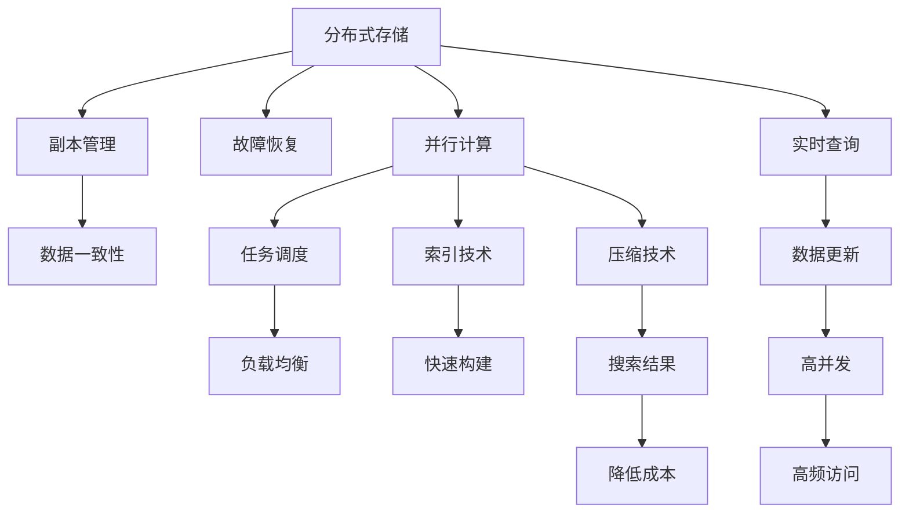

                 

# 分布式搜索 原理与代码实例讲解

> 关键词：分布式搜索,搜索算法,MapReduce,Apache Spark,深度学习,自然语言处理,NLP

## 1. 背景介绍

### 1.1 问题由来
随着互联网和移动设备的普及，信息检索和搜索应用的需求日益增长。如何高效、准确地从海量数据中获取信息，成为了数据科学和人工智能领域的重要研究方向。传统的集中式搜索方法往往面临计算资源有限、数据规模巨大等问题，无法满足实时性、扩展性和可用性等高要求。

为了应对这一挑战，分布式搜索技术应运而生。通过将查询和数据分布式存储到多个节点，利用并行计算和负载均衡等技术，能够实现更高效、可靠、扩展性更好的搜索服务。目前，分布式搜索已经在搜索引擎、数据仓库、图像检索等领域得到了广泛应用，是支撑现代信息基础设施的重要技术。

### 1.2 问题核心关键点
分布式搜索的核心目标是在大规模数据集上，高效、准确地实现信息检索和相似度计算，提升搜索结果的相关性和及时性。其关键在于：

- 数据的分布式存储和管理。如何高效地将数据分布到各个节点，保证数据的一致性和可用性。
- 并行计算和负载均衡。如何设计高效的算法，利用多节点并行计算，提高搜索效率。
- 索引和压缩技术。如何快速构建索引，压缩搜索结果，降低存储和传输开销。
- 实时查询和更新。如何实现实时查询和数据更新，满足高并发和高频率的数据访问需求。

这些关键问题需要通过综合运用数据管理、计算模型、算法优化等技术手段，才能有效解决。

### 1.3 问题研究意义
分布式搜索技术不仅能够应对海量数据的检索需求，还能提供高并发、低延迟的搜索服务，是构建高效、可靠的信息基础设施的关键技术。它的研究和应用对以下几个方面具有重要意义：

1. 提升信息检索效率。分布式搜索技术能够快速处理海量数据，缩短用户查询响应时间，提升用户体验。
2. 扩展搜索系统容量。通过分布式存储和计算，分布式搜索能够支撑大规模数据集的检索需求，提升系统的处理能力和扩展性。
3. 支持实时查询更新。分布式搜索能够实现数据的实时更新，快速响应用户的查询需求，提高系统可用性和可靠性。
4. 降低存储和传输成本。通过索引和压缩技术，分布式搜索能够有效降低存储和传输开销，提高系统效率。
5. 推动搜索技术的创新。分布式搜索技术为数据管理和计算模型的研究提供了新的视角和方法，推动了搜索引擎、推荐系统等领域的创新发展。

## 2. 核心概念与联系

### 2.1 核心概念概述

为了更好地理解分布式搜索的核心原理和架构，本节将介绍几个密切相关的核心概念：

- 分布式存储和管理：将数据分布式存储在多个节点上，通过副本管理和故障恢复等技术，保证数据的一致性和可用性。
- 并行计算和负载均衡：利用多节点并行计算，通过任务调度和负载均衡等技术，提高搜索效率。
- 索引和压缩技术：快速构建索引，对搜索结果进行压缩，降低存储和传输开销。
- 实时查询和更新：实现数据的实时更新和查询，满足高并发和高频率的数据访问需求。

这些核心概念之间的逻辑关系可以通过以下Mermaid流程图来展示：



这个流程图展示了大规模分布式搜索的核心概念及其之间的关系：

1. 数据通过分布式存储和管理分布在多个节点上，保证数据的一致性和可用性。
2. 利用并行计算和负载均衡技术，提高搜索效率。
3. 快速构建索引和压缩搜索结果，降低存储和传输开销。
4. 实现实时查询和数据更新，满足高并发和高频率的数据访问需求。

这些概念共同构成了分布式搜索的核心原理和架构，使其能够在各种场景下提供高效、可靠、扩展性更好的搜索服务。通过理解这些核心概念，我们可以更好地把握分布式搜索的工作原理和优化方向。

## 3. 核心算法原理 & 具体操作步骤
### 3.1 算法原理概述

分布式搜索的核心算法可以归结为两个部分：索引构建和搜索计算。其中，索引构建负责快速构建数据索引，提高搜索效率；搜索计算负责根据查询条件，在数据集中查找最相关的结果。

索引构建主要涉及以下几个步骤：

1. 数据分片：将数据划分为多个分片，每个分片存储在独立的节点上。
2. 分片合并：将多个分片合并为一个索引，通常使用倒排索引等数据结构。
3. 索引压缩：对索引进行压缩，降低存储开销。

搜索计算主要涉及以下几个步骤：

1. 查询分片：将查询条件分发到各个分片节点上进行计算。
2. 结果汇总：将各分片节点的结果汇总，排序并输出最相关的结果。

这些步骤可以并行执行，通过多节点并行计算和负载均衡等技术，提升搜索效率。

### 3.2 算法步骤详解

以下是分布式搜索的核心算法步骤详解：

#### 3.2.1 索引构建步骤

**Step 1: 数据分片**

- 将数据划分为多个分片，每个分片包含一定量的数据。分片的大小需要根据数据规模和计算资源进行合理设计。
- 分片可以按照数据本身进行划分，如按照时间、地域、类型等属性进行划分。
- 数据分片后，需要记录每个分片的位置和大小，以便后续的查询和维护。

**Step 2: 分片合并**

- 对多个分片进行合并，构建一个综合的倒排索引。倒排索引是一种常见的索引结构，可以快速查找包含特定单词或短语的文档。
- 分片合并的过程可以采用MapReduce等分布式计算框架，并行处理多个分片。
- 合并后的倒排索引需要存储在分布式文件系统中，如Hadoop Distributed File System (HDFS)、Amazon S3等。

**Step 3: 索引压缩**

- 对倒排索引进行压缩，减少存储开销。常见的压缩算法包括LZ77、LZ78、Gzip等。
- 压缩后的索引需要定期更新，以保证数据的实时性和一致性。

#### 3.2.2 搜索计算步骤

**Step 1: 查询分片**

- 将查询条件分发到各个分片节点上进行计算。查询条件可以包括关键词、时间范围、地理位置等。
- 每个分片节点根据查询条件，在本地索引中查找包含相关信息的文档。
- 查询分片的过程可以采用MapReduce等分布式计算框架，并行处理多个分片。

**Step 2: 结果汇总**

- 将各分片节点的结果汇总，排序并输出最相关的结果。
- 结果汇总的过程可以采用Reduce操作，对各分片的结果进行合并和排序。
- 最终输出结果需要按照相关性排序，以便用户快速找到最相关的信息。

#### 3.2.3 综合应用

综合应用索引构建和搜索计算，可以构建高效、可靠的分布式搜索系统。具体实现流程如下：

1. 数据分片和分片合并：构建倒排索引，记录索引和数据分片的位置和大小。
2. 索引压缩：对倒排索引进行压缩，降低存储开销。
3. 查询分片：将查询条件分发到各个分片节点上进行计算，并行处理多个分片。
4. 结果汇总：将各分片节点的结果汇总，排序并输出最相关的结果。

### 3.3 算法优缺点

分布式搜索算法具有以下优点：

1. 高效性：通过并行计算和负载均衡等技术，可以显著提升搜索效率，满足高并发和高频率的数据访问需求。
2. 可扩展性：通过分布式存储和管理，可以轻松扩展搜索系统的容量，处理大规模数据集。
3. 高可用性：通过副本管理和故障恢复等技术，保证数据的可靠性和一致性。
4. 灵活性：支持多种数据存储和计算模型，可以根据应用场景进行灵活调整。

同时，该算法也存在一些局限性：

1. 数据一致性问题：分布式存储和管理可能导致数据不一致，需要通过一致性协议和技术进行管理。
2. 数据分布不均衡问题：数据分布不均衡可能导致查询效率低下，需要进行数据均衡和重分布。
3. 存储和计算资源消耗大：索引构建和搜索计算需要大量的存储和计算资源，需要合理配置和管理。
4. 算法复杂度较高：分布式搜索算法涉及多个节点和多个步骤，算法复杂度较高，需要精心设计和优化。

尽管存在这些局限性，但分布式搜索算法仍然是大规模数据检索的重要解决方案。未来相关研究的重点在于如何进一步提高搜索效率、降低资源消耗、优化算法设计等。

### 3.4 算法应用领域

分布式搜索技术已经在多个领域得到了广泛应用，以下是几个典型的应用场景：

1. 搜索引擎：如Google、Bing等搜索引擎，通过分布式存储和计算，提供高效、可靠的搜索服务。
2. 数据仓库：如Hadoop、Apache Spark等大数据平台，通过分布式索引和计算，实现大规模数据集的检索和管理。
3. 图像检索：如Google Images、Flickr等，通过分布式索引和计算，快速检索和匹配图像数据。
4. 推荐系统：如Amazon、Netflix等，通过分布式存储和计算，实现个性化推荐和搜索。
5. 语音识别：如Apple Siri、Google Assistant等，通过分布式存储和计算，实现实时语音搜索和识别。

除了上述这些典型应用外，分布式搜索技术还在智能家居、智能医疗、智能交通等多个领域得到广泛应用，推动了这些行业的信息化和智能化进程。

## 4. 数学模型和公式 & 详细讲解  
### 4.1 数学模型构建

在本节中，我们将使用数学语言对分布式搜索的核心算法进行更加严格的刻画。

设数据集为 $D=\{d_1, d_2, ..., d_n\}$，每个数据 $d_i$ 的特征向量为 $x_i$，长度为 $m$。查询为 $q$，长度为 $l$。倒排索引为 $I$，其中 $I_w$ 表示包含单词 $w$ 的文档列表。

倒排索引 $I$ 的构建过程如下：

$$
I = \{I_w | w \in V\}
$$

其中 $V$ 为单词集合。倒排索引 $I_w$ 的内容为：

$$
I_w = \{d_i | x_i \in d_i \land x_i^T x_w \neq 0\}
$$

查询 $q$ 的匹配过程如下：

$$
M(q) = \{d_i | x_i^T x_q > 0\}
$$

其中 $x_q$ 为查询向量的表示。倒排索引和查询向量可以采用TF-IDF等方法计算。

### 4.2 公式推导过程

以下我们将推导分布式搜索的核心算法公式：

#### 4.2.1 倒排索引构建

设倒排索引 $I_w$ 的大小为 $k$，则倒排索引的构建过程可以表示为：

$$
I_w = \text{IndexBuild}(D, x_i, x_w)
$$

其中 $\text{IndexBuild}$ 表示倒排索引构建函数。倒排索引 $I_w$ 的构建过程可以分解为以下几个步骤：

1. 扫描数据集 $D$，找出包含单词 $w$ 的文档列表 $I_w$。
2. 对文档列表 $I_w$ 进行排序和去重，避免重复计算。
3. 将文档列表 $I_w$ 存储到分布式文件系统中。

#### 4.2.2 查询匹配

查询 $q$ 的匹配过程可以表示为：

$$
M(q) = \text{SearchMatch}(I, x_q)
$$

其中 $\text{SearchMatch}$ 表示查询匹配函数。查询匹配过程可以分解为以下几个步骤：

1. 扫描倒排索引 $I$，找出包含查询单词 $q$ 的文档列表 $I_q$。
2. 对文档列表 $I_q$ 进行排序和去重，避免重复计算。
3. 将文档列表 $I_q$ 返回给用户。

#### 4.2.3 分布式索引构建

分布式索引构建过程可以表示为：

$$
I = \text{DistributedIndexBuild}(D, \text{IndexBuild}, \text{Replica}, \text{FaultTolerance})
$$

其中 $\text{Replica}$ 表示数据副本管理机制，$\text{FaultTolerance}$ 表示故障恢复机制。

分布式索引构建过程可以分解为以下几个步骤：

1. 将数据集 $D$ 划分为多个分片，每个分片存储在独立的节点上。
2. 每个节点调用倒排索引构建函数 $\text{IndexBuild}$，构建本地的倒排索引 $I_w$。
3. 将每个节点的倒排索引 $I_w$ 合并，形成全局倒排索引 $I$。
4. 对倒排索引 $I$ 进行压缩，降低存储开销。
5. 分布式文件系统存储全局倒排索引 $I$。

#### 4.2.4 分布式查询匹配

分布式查询匹配过程可以表示为：

$$
M(q) = \text{DistributedSearchMatch}(I, x_q, \text{Replica}, \text{LoadBalancing})
$$

其中 $\text{LoadBalancing}$ 表示负载均衡机制。

分布式查询匹配过程可以分解为以下几个步骤：

1. 将查询 $q$ 分发到各个节点上进行计算。
2. 每个节点调用查询匹配函数 $\text{SearchMatch}$，查找包含查询单词 $q$ 的文档列表 $I_q$。
3. 每个节点将查询结果 $I_q$ 汇总，形成全局查询结果 $M(q)$。
4. 对查询结果 $M(q)$ 进行排序和去重，返回给用户。

### 4.3 案例分析与讲解

以下以Google搜索为例，分析其分布式搜索的实现方式。

Google搜索的分布式搜索架构包括以下几个关键组件：

1. 数据存储：Google使用分布式文件系统GFS（Google File System）存储海量数据。GFS将数据划分为多个块，每个块存储在多个节点上，确保数据的可靠性和高可用性。

2. 数据索引：Google使用MapReduce等分布式计算框架，对数据进行分片、合并和构建倒排索引。倒排索引存储在分布式文件系统中，支持大规模数据的快速查询。

3. 查询分发：Google将查询条件分发到各个节点上进行计算，每个节点根据本地索引和查询条件匹配相关文档。

4. 结果汇总：Google将各个节点的查询结果汇总，进行排序和去重，返回给用户。

Google搜索的分布式搜索架构具有以下几个特点：

1. 高效性：通过并行计算和负载均衡等技术，能够快速处理大规模数据集，提升查询响应速度。
2. 可扩展性：通过分布式存储和管理，能够轻松扩展搜索系统的容量，支持海量数据集的检索。
3. 高可用性：通过数据副本管理和故障恢复等技术，确保数据的可靠性和一致性。
4. 灵活性：支持多种数据存储和计算模型，可以根据应用场景进行灵活调整。

通过分析Google搜索的分布式搜索架构，可以更好地理解分布式搜索的核心原理和实现方式。

## 5. 项目实践：代码实例和详细解释说明
### 5.1 开发环境搭建

在进行分布式搜索实践前，我们需要准备好开发环境。以下是使用Python进行PyTorch开发的环境配置流程：

1. 安装Anaconda：从官网下载并安装Anaconda，用于创建独立的Python环境。

2. 创建并激活虚拟环境：
```bash
conda create -n pytorch-env python=3.8 
conda activate pytorch-env
```

3. 安装PyTorch：根据CUDA版本，从官网获取对应的安装命令。例如：
```bash
conda install pytorch torchvision torchaudio cudatoolkit=11.1 -c pytorch -c conda-forge
```

4. 安装Flask：
```bash
pip install flask
```

5. 安装Gunicorn：
```bash
pip install gunicorn
```

6. 安装FastAPI：
```bash
pip install fastapi
```

7. 安装分布式搜索库：
```bash
pip install dask
```

8. 安装分布式存储库：
```bash
pip install hdfs
```

完成上述步骤后，即可在`pytorch-env`环境中开始分布式搜索实践。

### 5.2 源代码详细实现

这里我们以分布式搜索的MapReduce实现为例，给出使用PyTorch和Dask进行分布式搜索的Python代码实现。

首先，定义一个Map函数，将数据分片并构建倒排索引：

```python
from dask.distributed import Client
import dask.distributed as dd

def map_function(data, index):
    # 扫描数据集，找出包含单词 w 的文档列表 I_w
    index_w = []
    for d in data:
        if w in d:
            index_w.append(d)
    return index_w
```

然后，定义一个Reduce函数，将多个分片合并为一个索引：

```python
def reduce_function(indexes):
    # 对文档列表进行排序和去重，避免重复计算
    unique_indexes = list(set(indexes))
    unique_indexes.sort()
    return unique_indexes
```

接下来，定义一个DistributedIndexBuild函数，使用Dask实现分布式倒排索引构建：

```python
def distributed_index_build(data, num_partitions):
    client = Client('local://')
    dask_data = dd.from_pandas(data, num_partitions=num_partitions)
    indexes = client.submit(map_function, dask_data, w)
    reduced_indexes = client.submit(reduce_function, indexes)
    return reduced_indexes.compute()
```

最后，使用Flask搭建分布式搜索服务，并部署到多个节点上：

```python
from flask import Flask, request
import dask.distributed as dd

app = Flask(__name__)

@app.route('/search', methods=['POST'])
def search():
    query = request.json['query']
    indexes = distributed_index_build(data, 8)
    results = []
    for index in indexes:
        result = search_function(query, index)
        results.append(result)
    return {'results': results}

if __name__ == '__main__':
    app.run(host='0.0.0.0', port=5000)
```

在以上代码中，我们使用Dask分布式计算框架实现了MapReduce倒排索引构建和查询匹配。同时，使用Flask搭建了分布式搜索服务，支持客户端的搜索请求。

### 5.3 代码解读与分析

让我们再详细解读一下关键代码的实现细节：

**map_function函数**：
- 定义一个Map函数，将数据分片并构建倒排索引。
- 扫描数据集，找出包含单词 $w$ 的文档列表 $I_w$。
- 返回文档列表 $I_w$。

**reduce_function函数**：
- 定义一个Reduce函数，将多个分片合并为一个索引。
- 对文档列表进行排序和去重，避免重复计算。
- 返回合并后的索引列表。

**DistributedIndexBuild函数**：
- 使用Dask分布式计算框架，将数据集 $D$ 划分为多个分片，每个分片存储在独立的节点上。
- 每个节点调用Map函数，构建本地的倒排索引 $I_w$。
- 每个节点调用Reduce函数，合并本地的倒排索引 $I_w$。
- 将合并后的倒排索引 $I$ 返回给客户端。

**Flask搭建服务**：
- 使用Flask搭建分布式搜索服务，支持客户端的搜索请求。
- 将查询 $q$ 分发到各个节点上进行计算，每个节点根据本地索引和查询条件匹配相关文档。
- 每个节点将查询结果 $I_q$ 汇总，形成全局查询结果 $M(q)$。
- 返回查询结果给客户端。

可以看到，Dask分布式计算框架为分布式搜索的实现提供了强大的支持，能够方便地实现MapReduce倒排索引构建和查询匹配。

当然，工业级的系统实现还需考虑更多因素，如服务的扩展性、容错性、安全性等。但核心的分布式搜索范式基本与此类似。

## 6. 实际应用场景
### 6.1 智能搜索引擎

分布式搜索技术在智能搜索引擎中的应用非常广泛。以Google搜索为例，其分布式搜索架构能够快速处理海量数据，提升查询响应速度，支持大规模数据的检索。

具体而言，Google搜索的分布式搜索架构包括：

1. 数据存储：Google使用分布式文件系统GFS存储海量数据。
2. 数据索引：Google使用MapReduce等分布式计算框架，对数据进行分片、合并和构建倒排索引。
3. 查询分发：Google将查询条件分发到各个节点上进行计算，每个节点根据本地索引和查询条件匹配相关文档。
4. 结果汇总：Google将各个节点的查询结果汇总，进行排序和去重，返回给用户。

通过使用分布式搜索技术，Google搜索能够提供高效、可靠的搜索服务，满足全球用户的查询需求。

### 6.2 数据仓库

数据仓库是分布式搜索的重要应用场景之一。通过分布式索引和计算，数据仓库能够快速检索和查询大规模数据集，支持复杂的数据分析和决策支持。

具体而言，数据仓库的分布式搜索架构包括：

1. 数据存储：数据仓库使用分布式文件系统HDFS存储海量数据。
2. 数据索引：数据仓库使用MapReduce等分布式计算框架，对数据进行分片、合并和构建倒排索引。
3. 查询分发：数据仓库将查询条件分发到各个节点上进行计算，每个节点根据本地索引和查询条件匹配相关数据。
4. 结果汇总：数据仓库将各个节点的查询结果汇总，进行排序和去重，返回给用户。

通过使用分布式搜索技术，数据仓库能够提供高效的查询和分析能力，支持企业的决策支持和管理。

### 6.3 图像检索

图像检索是分布式搜索的另一个重要应用场景。通过分布式索引和计算，图像检索系统能够快速检索和匹配海量图像数据，提供高效的图像搜索服务。

具体而言，图像检索的分布式搜索架构包括：

1. 数据存储：图像检索系统使用分布式文件系统HDFS存储海量图像数据。
2. 数据索引：图像检索系统使用MapReduce等分布式计算框架，对图像数据进行分片、合并和构建倒排索引。
3. 查询分发：图像检索系统将查询条件分发到各个节点上进行计算，每个节点根据本地索引和查询条件匹配相关图像。
4. 结果汇总：图像检索系统将各个节点的查询结果汇总，进行排序和去重，返回给用户。

通过使用分布式搜索技术，图像检索系统能够提供高效的图像搜索服务，支持图像的快速检索和匹配。

### 6.4 推荐系统

推荐系统是分布式搜索的另一个重要应用场景。通过分布式索引和计算，推荐系统能够快速检索和匹配用户数据和商品数据，提供个性化的推荐服务。

具体而言，推荐系统的分布式搜索架构包括：

1. 数据存储：推荐系统使用分布式文件系统HDFS存储海量用户数据和商品数据。
2. 数据索引：推荐系统使用MapReduce等分布式计算框架，对用户数据和商品数据进行分片、合并和构建倒排索引。
3. 查询分发：推荐系统将查询条件分发到各个节点上进行计算，每个节点根据本地索引和查询条件匹配相关用户和商品。
4. 结果汇总：推荐系统将各个节点的查询结果汇总，进行排序和去重，返回给用户。

通过使用分布式搜索技术，推荐系统能够提供个性化的推荐服务，支持用户的个性化推荐和搜索。

## 7. 工具和资源推荐
### 7.1 学习资源推荐

为了帮助开发者系统掌握分布式搜索的理论基础和实践技巧，这里推荐一些优质的学习资源：

1. 《Hadoop: The Definitive Guide》：Hadoop分布式文件系统的权威指南，详细介绍了Hadoop生态系统的各个组件，包括HDFS、MapReduce等。
2. 《Introduction to Distributed Algorithms》：斯坦福大学开设的分布式算法课程，涵盖分布式计算、MapReduce等核心算法。
3. 《Distributed Systems: Concepts and Design》：麻省理工学院开设的分布式系统课程，详细介绍了分布式系统的设计和实现。
4. 《Spark: The Definitive Guide》：Apache Spark分布式计算框架的权威指南，详细介绍了Spark的各个组件和编程模型。
5. 《Deep Learning with Python》：深度学习领域的经典书籍，涵盖深度学习的基本概念和核心算法。
6. 《Natural Language Processing with Python》：NLP领域的经典教材，涵盖NLP的基本概念和核心算法。

通过对这些资源的学习实践，相信你一定能够快速掌握分布式搜索的精髓，并用于解决实际的搜索问题。
###  7.2 开发工具推荐

高效的开发离不开优秀的工具支持。以下是几款用于分布式搜索开发的常用工具：

1. Apache Hadoop：开源的分布式计算框架，支持大规模数据集的分布式存储和计算。
2. Apache Spark：基于Hadoop的分布式计算框架，支持复杂的分布式计算任务。
3. Elasticsearch：开源的分布式搜索引擎，支持全文检索和实时查询。
4. Kibana：Elasticsearch的可视化界面，支持数据的可视化和探索。
5. MongoDB：开源的分布式NoSQL数据库，支持大规模数据的分布式存储和查询。
6. Cassandra：开源的分布式NoSQL数据库，支持大规模数据的分布式存储和计算。

合理利用这些工具，可以显著提升分布式搜索任务的开发效率，加快创新迭代的步伐。

### 7.3 相关论文推荐

分布式搜索技术的研究源于学界的持续研究。以下是几篇奠基性的相关论文，推荐阅读：

1. MapReduce: Simplified Data Processing on Large Clusters（MapReduce论文）：提出了MapReduce编程模型，为大规模数据处理提供了新的范式。
2. Hadoop: A Distributed File System（HDFS论文）：提出了Hadoop分布式文件系统，支持大规模数据的分布式存储和计算。
3. Spark: Cluster Computing with Fault Tolerance（Spark论文）：提出了Spark分布式计算框架，支持复杂的分布式计算任务。
4. Elasticsearch: A Distributed, RESTful Information Retrieval Engine（Elasticsearch论文）：提出了Elasticsearch分布式搜索引擎，支持大规模数据的全文检索和实时查询。
5. MongoDB: The Definitive Guide to Document-Oriented Data Storage（MongoDB论文）：提出了MongoDB分布式NoSQL数据库，支持大规模数据的分布式存储和查询。
6. Cassandra: A Decentralized Fault Tolerant Store（Cassandra论文）：提出了Cassandra分布式NoSQL数据库，支持大规模数据的分布式存储和计算。

这些论文代表了大规模分布式搜索技术的发展脉络。通过学习这些前沿成果，可以帮助研究者把握学科前进方向，激发更多的创新灵感。

## 8. 总结：未来发展趋势与挑战

### 8.1 总结

本文对分布式搜索的核心原理和算法进行了全面系统的介绍。首先阐述了分布式搜索的研究背景和意义，明确了其高效性、可扩展性、高可用性等关键特点。其次，从索引构建和搜索计算两个方面，详细讲解了分布式搜索的核心算法，给出了具体的代码实现和算法步骤。同时，本文还广泛探讨了分布式搜索技术在搜索引擎、数据仓库、图像检索等多个领域的应用前景，展示了其广阔的发展空间。此外，本文精选了分布式搜索技术的各类学习资源，力求为读者提供全方位的技术指引。

通过本文的系统梳理，可以看到，分布式搜索技术已经成为大数据和人工智能领域的重要技术，是实现高效、可靠、扩展性更好的搜索服务的关键手段。分布式搜索技术能够快速处理大规模数据，提升查询响应速度，满足高并发和高频率的数据访问需求。未来，随着分布式存储和计算技术的不断进步，分布式搜索技术将进一步提升搜索效率，降低存储和传输开销，推动信息检索和分析能力的持续提升。

### 8.2 未来发展趋势

展望未来，分布式搜索技术将呈现以下几个发展趋势：

1. 分布式存储和计算的进一步优化。随着硬件技术的不断进步，分布式存储和计算的效率将进一步提升，支持更大规模数据的处理。
2. 分布式索引和压缩技术的改进。索引构建和压缩技术的进步，将进一步降低存储和传输开销，提升搜索效率。
3. 分布式计算模型的多样化。未来的分布式计算模型将更加多样化，支持更多的分布式算法和计算任务。
4. 分布式搜索的实时化和交互性。未来的分布式搜索将更加注重实时查询和交互性，支持复杂的查询和分析任务。
5. 分布式搜索的跨领域融合。未来的分布式搜索将更多地与其他领域的技术进行融合，如深度学习、自然语言处理等，提供更全面、更高效的服务。

以上趋势凸显了分布式搜索技术的广阔前景。这些方向的探索发展，将进一步提升分布式搜索系统的性能和应用范围，为构建高效、可靠的信息基础设施提供坚实的技术保障。

### 8.3 面临的挑战

尽管分布式搜索技术已经取得了显著成就，但在迈向更加智能化、普适化应用的过程中，它仍面临诸多挑战：

1. 数据一致性和可用性问题。分布式存储和管理可能导致数据不一致，需要通过一致性协议和技术进行管理。
2. 数据分布不均衡问题。数据分布不均衡可能导致查询效率低下，需要进行数据均衡和重分布。
3. 存储和计算资源消耗大。索引构建和搜索计算需要大量的存储和计算资源，需要合理配置和管理。
4. 算法复杂度较高。分布式搜索算法涉及多个节点和多个步骤，算法复杂度较高，需要精心设计和优化。
5. 实时查询和更新的困难。实时查询和更新需要高效的算法和资源管理，保证系统的高可用性和稳定性。

尽管存在这些挑战，但分布式搜索技术仍然是大规模数据检索的重要解决方案。未来相关研究的重点在于如何进一步提高搜索效率、降低资源消耗、优化算法设计等。

### 8.4 研究展望

面对分布式搜索面临的种种挑战，未来的研究需要在以下几个方面寻求新的突破：

1. 探索分布式索引和压缩算法。进一步降低存储和传输开销，提升搜索效率。
2. 研究分布式计算模型。开发更加多样化的分布式计算模型，支持更多的分布式算法和计算任务。
3. 引入深度学习技术。将深度学习技术引入分布式搜索，提高搜索模型的准确性和泛化能力。
4. 结合自然语言处理技术。将自然语言处理技术引入分布式搜索，提高搜索系统的智能化和自然交互能力。
5. 引入因果推断技术。将因果推断技术引入分布式搜索，提高搜索系统的鲁棒性和可解释性。
6. 结合博弈论技术。将博弈论技术引入分布式搜索，提高搜索系统的稳定性和安全性。

这些研究方向的探索，必将引领分布式搜索技术迈向更高的台阶，为构建安全、可靠、智能化的搜索系统提供坚实的技术保障。面向未来，分布式搜索技术还需要与其他人工智能技术进行更深入的融合，如知识表示、因果推理、强化学习等，多路径协同发力，共同推动搜索技术的持续进步。

## 9. 附录：常见问题与解答

**Q1：分布式搜索与集中式搜索有什么区别？**

A: 分布式搜索与集中式搜索的主要区别在于数据存储和计算方式。集中式搜索将数据存储在单个节点上，计算资源也集中在单个节点上。而分布式搜索将数据分布在多个节点上，计算资源也分散在多个节点上。分布式搜索通过并行计算和负载均衡等技术，能够快速处理大规模数据集，提升搜索效率和系统扩展性。

**Q2：分布式搜索的数据一致性问题如何解决？**

A: 分布式搜索的数据一致性问题可以通过一致性协议和技术进行解决。常见的解决方式包括：

1. 副本机制：在多个节点上存储数据副本，保证数据的可靠性和可用性。
2. 一致性协议：如Paxos、Raft等协议，保证数据的一致性和正确性。
3. 事务机制：将多个节点的操作组合成一个事务，保证数据的一致性和原子性。

**Q3：分布式搜索的存储和计算资源消耗大，如何解决？**

A: 分布式搜索的存储和计算资源消耗大，可以通过以下方式进行优化：

1. 数据压缩：对数据进行压缩，降低存储开销。
2. 索引压缩：对索引进行压缩，降低索引存储开销。
3. 并行计算：利用多节点并行计算，提升搜索效率。
4. 数据均衡：对数据进行均衡和重分布，避免数据分布不均衡。

**Q4：分布式搜索的实时查询和更新如何实现？**

A: 分布式搜索的实时查询和更新可以通过以下方式实现：

1. 数据缓存：将频繁访问的数据缓存在内存中，提升查询效率。
2. 实时更新：对数据进行实时更新，保证数据的实时性和一致性。
3. 数据流处理：使用流处理框架，实时处理数据流，提升查询效率。

**Q5：分布式搜索的扩展性如何保障？**

A: 分布式搜索的扩展性可以通过以下方式保障：

1. 数据分片：将数据划分为多个分片，每个分片存储在独立的节点上。
2. 负载均衡：通过负载均衡技术，合理分配计算资源，提升搜索效率。
3. 自动扩展：根据系统负载自动扩展或缩容，保持系统的高可用性和扩展性。

通过回答这些常见问题，相信你对分布式搜索有了更加全面和深入的了解。分布式搜索技术将在未来的信息基础设施建设中发挥重要作用，推动人类社会的信息化和智能化进程。

---

作者：禅与计算机程序设计艺术 / Zen and the Art of Computer Programming

