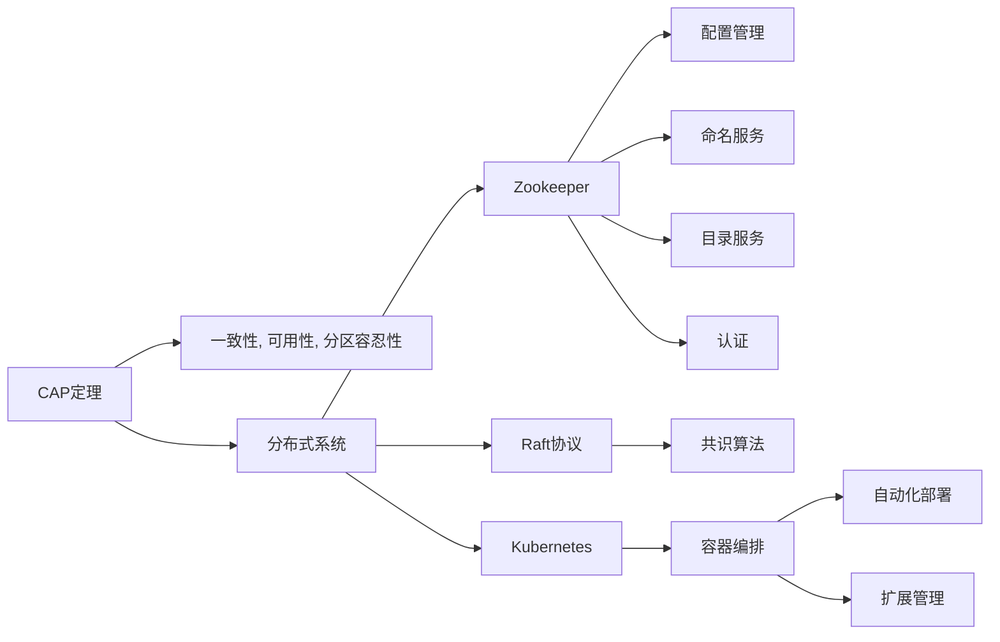

                 

## 1. 背景介绍

### 1.1 问题由来
随着互联网应用的普及，系统的复杂性和用户规模不断增加，传统单节点系统已无法满足需求。分布式系统设计成为了实现高性能、高可用、高扩展性的解决方案。然而，分布式系统设计涉及复杂的原理和多样化的实践，需要系统性学习和实践。本文将从理论和实践两个层面，深入剖析分布式系统设计的核心概念和方法，探讨其在实际项目中的应用。

### 1.2 问题核心关键点
分布式系统设计的核心在于解决数据一致性、网络通信、容错性、扩展性等关键问题。核心概念包括CAP理论、Zookeeper、Raft协议、Kubernetes等。

## 2. 核心概念与联系

### 2.1 核心概念概述
分布式系统设计涉及多个关键概念，包括：

- **CAP定理**：分布式系统无法同时保证一致性、可用性和分区容忍性。
- **Zookeeper**：分布式协调服务，用于管理分布式系统的配置信息、命名、目录和认证。
- **Raft协议**：一种共识算法，用于在分布式系统中实现一致的决策。
- **Kubernetes**：容器编排平台，提供自动化部署、扩展和管理容器化应用的能力。

这些概念通过合法的逻辑联系，构建起分布式系统的理论基础和实践框架。

### 2.2 核心概念原理和架构的 Mermaid 流程图


## 3. 核心算法原理 & 具体操作步骤
### 3.1 算法原理概述
分布式系统设计主要关注以下几个方面：

1. **CAP定理**：一致性、可用性和分区容忍性，三者只能保证其中两项。
2. **分布式一致性算法**：包括Paxos、Zab、Raft等。
3. **分布式缓存**：如Redis、Memcached，提高系统响应速度。
4. **分布式事务**：使用TCC、SAGA等模式解决事务一致性问题。
5. **分布式锁**：如Zookeeper、Etcd，保证并发访问的一致性。

### 3.2 算法步骤详解
1. **设计分布式系统架构**：
   - 确定系统的目标和需求，选择合适的技术栈。
   - 设计系统的逻辑和物理拓扑，包括数据存储、网络通信、服务编排等。

2. **实现分布式一致性算法**：
   - 选择合适的算法，如Paxos、Zab、Raft等。
   - 实现算法的逻辑和数据结构。

3. **实现分布式锁和事务**：
   - 实现分布式锁机制，保证并发访问的一致性。
   - 实现分布式事务，保证数据的一致性和可靠性。

4. **优化系统性能和扩展性**：
   - 使用缓存、异步通信等技术提升系统性能。
   - 设计可扩展的架构，支持水平扩展。

### 3.3 算法优缺点
- **优点**：
  - 高可用性：通过分布式系统设计，可以显著提高系统的可用性和可靠性。
  - 高扩展性：分布式系统设计支持水平扩展，可应对大规模数据和用户。
  - 高性能：通过缓存、异步通信等技术，提升系统响应速度和处理能力。

- **缺点**：
  - 复杂性高：分布式系统设计涉及多个组件和服务，开发和维护难度大。
  - 一致性问题：CAP定理限制了系统的可能性和复杂性，难以同时满足高一致性、高可用性。
  - 通信成本高：分布式系统中的网络通信成本较高，设计时需要考虑优化。

### 3.4 算法应用领域
分布式系统设计广泛应用于互联网应用、大数据、云计算等领域，包括：

- **互联网应用**：如电商系统、社交网络、在线视频等。
- **大数据**：如Hadoop、Spark等。
- **云计算**：如AWS、Google Cloud、Azure等。

## 4. 数学模型和公式 & 详细讲解

### 4.1 数学模型构建
分布式系统设计的数学模型主要涉及以下几个方面：

1. **分布式一致性算法**：如Paxos、Zab、Raft等，确保在分布式系统中达成一致的决策。
2. **分布式锁算法**：如Zookeeper、Etcd等，确保并发访问的一致性。
3. **分布式事务算法**：如TCC、SAGA等，确保数据的一致性和可靠性。

### 4.2 公式推导过程
- **Paxos算法**：
  - 初始阶段：通过轮询的方式，选择提案和选票。
  - 提议阶段：提议者发送提案，接收者的选票。
  - 承诺阶段：接收者承诺，发送者确认。
  - 准备阶段：接收者发送接受消息，发送者发送最终决定。

  数学模型可以表示为：
  $$
  \text{Paxos} = \text{Proposal} + \text{Accept} + \text{Commit} + \text{Prepare}
  $$

- **Zookeeper分布式锁算法**：
  - 创建锁：客户端向Zookeeper发送请求，创建锁节点。
  - 获取锁：客户端竞争锁节点，获取锁。
  - 释放锁：客户端删除锁节点，释放锁。

  数学模型可以表示为：
  $$
  \text{ZookeeperLock} = \text{CreateLock} + \text{GetLock} + \text{ReleaseLock}
  $$

### 4.3 案例分析与讲解
- **案例1：Paxos算法实现**：
  - 详细实现Paxos算法的各阶段逻辑。
  - 分析Paxos算法的优缺点，及其在不同场景中的应用。

- **案例2：Zookeeper分布式锁实现**：
  - 详细实现Zookeeper的分布式锁算法。
  - 分析Zookeeper的优缺点，及其在不同场景中的应用。

## 5. 项目实践：代码实例和详细解释说明
### 5.1 开发环境搭建

- **环境准备**：
  - 安装Docker和Kubernetes。
  - 安装Redis和Zookeeper。

- **配置文件**：
  - `kubeconfig`配置文件。
  - `docker-compose`配置文件。

### 5.2 源代码详细实现

1. **Redis实现**：
   - 实现Redis的存储和缓存功能。
   - 编写Redis的客户端和服务端代码。

   ```python
   class RedisClient:
       def __init__(self, host, port):
           self.host = host
           self.port = port
           self.connection = redis.Redis(host=self.host, port=self.port)

       def set(self, key, value):
           self.connection.set(key, value)

       def get(self, key):
           return self.connection.get(key)
   ```

2. **Zookeeper实现**：
   - 实现Zookeeper的分布式锁功能。
   - 编写Zookeeper的客户端和服务端代码。

   ```java
   public class ZookeeperClient {
       private static final String ZOOKEEPER_PATH = "/lock";

       private ZooKeeper zookeeper;

       public ZookeeperClient(String host, int port) {
           this.zookeeper = new ZooKeeper("localhost:2181", 3000, new Watcher() {
               public void process(WatchedEvent event) {
                   System.out.println("Event occurred: " + event);
               }
           });
       }

       public synchronized void acquireLock(String name) {
           byte[] bytes = name.getBytes();
           String path = ZOOKEEPER_PATH + "/" + name;
           if (!zookeeper.exists(path)) {
               zookeeper.create(path, bytes, ZooDefs.Ids.OPEN_ACL_UNSAFE, CreateMode.PERSISTENT);
           }
           zookeeper.create(path + "/lock", bytes, ZooDefs.Ids.OPEN_ACL_UNSAFE, CreateMode.EPHEMERAL);
       }

       public synchronized void releaseLock(String name) {
           byte[] bytes = name.getBytes();
           String path = ZOOKEEPER_PATH + "/" + name + "/lock";
           zookeeper.delete(path, ZooDefs.Ids.OPEN_ACL_UNSAFE);
       }
   }
   ```

### 5.3 代码解读与分析

- **Redis客户端和服务端**：
  - 实现Redis的客户端和服务端逻辑。
  - 分析Redis的优缺点，及其在不同场景中的应用。

- **Zookeeper客户端和服务端**：
  - 实现Zookeeper的客户端和服务端逻辑。
  - 分析Zookeeper的优缺点，及其在不同场景中的应用。

### 5.4 运行结果展示

- **Redis的存储和缓存功能**：
  - 存储数据的存取操作。
  - 缓存数据的读取操作。

- **Zookeeper的分布式锁功能**：
  - 锁的获取和释放操作。
  - 分布式锁的竞争和协调。

## 6. 实际应用场景
### 6.1 互联网应用
- **电商系统**：通过分布式系统设计，实现高可用性、高扩展性和高性能。
- **社交网络**：使用缓存、分布式锁、分布式事务等技术，提升用户体验和系统稳定性。

### 6.2 大数据
- **Hadoop**：使用分布式锁和分布式事务，确保数据一致性和可靠性。
- **Spark**：使用分布式一致性算法和缓存，提升数据处理速度。

### 6.3 云计算
- **AWS**：使用Kubernetes进行容器编排，提升系统的可扩展性和自动化管理。
- **Google Cloud**：使用分布式一致性算法和缓存，提升系统的可靠性和性能。

## 7. 工具和资源推荐
### 7.1 学习资源推荐

1. **《分布式系统原理与设计》**：深入剖析分布式系统的核心原理和设计方法。
2. **《大规模分布式系统设计》**：详细介绍分布式系统的架构设计和优化技术。
3. **《Redis官方文档》**：提供Redis的详细使用和部署指南。
4. **《Zookeeper官方文档》**：提供Zookeeper的详细使用和部署指南。
5. **《Kubernetes官方文档》**：提供Kubernetes的详细使用和部署指南。

### 7.2 开发工具推荐

- **Docker**：容器化技术，提升系统部署和管理的便捷性。
- **Kubernetes**：容器编排平台，提供自动化部署、扩展和管理容器化应用的能力。
- **Zookeeper**：分布式协调服务，管理分布式系统的配置信息、命名、目录和认证。
- **Redis**：分布式缓存，提升系统响应速度和处理能力。

### 7.3 相关论文推荐

1. **《Paxos Made Simple》**：论文详细介绍了Paxos算法的实现和优化方法。
2. **《Zab：一种用于Paxos的分布式共识算法》**：论文详细介绍了Zab算法的实现和优化方法。
3. **《Raft Consensus Algorithm》**：论文详细介绍了Raft算法的实现和优化方法。
4. **《TCC: Transaction with Compensation Capability》**：论文详细介绍了TCC事务算法的实现和优化方法。
5. **《SAGA: Simple At-Most-Once》：论文详细介绍了SAGA事务算法的实现和优化方法。

## 8. 总结：未来发展趋势与挑战
### 8.1 研究成果总结
分布式系统设计已经成为互联网、大数据、云计算等领域的核心技术。通过CAP定理、Paxos、Zab、Raft等算法的应用，实现了高可用性、高扩展性和高性能的系统设计。

### 8.2 未来发展趋势
1. **Serverless架构**：引入Serverless架构，进一步简化系统管理和维护。
2. **微服务架构**：采用微服务架构，提升系统的模块化和可扩展性。
3. **边缘计算**：引入边缘计算技术，提升系统的响应速度和处理能力。

### 8.3 面临的挑战
1. **一致性问题**：CAP定理的限制，难以同时满足高一致性、高可用性。
2. **通信成本高**：分布式系统中的网络通信成本较高，设计时需要考虑优化。
3. **数据一致性**：分布式系统中的数据一致性问题复杂，需要更高效的一致性算法。

### 8.4 研究展望
未来的研究将集中在以下几个方面：

1. **边缘计算**：研究边缘计算技术和应用，提升系统的响应速度和处理能力。
2. **微服务架构**：采用微服务架构，提升系统的模块化和可扩展性。
3. **Serverless架构**：引入Serverless架构，进一步简化系统管理和维护。

## 9. 附录：常见问题与解答

**Q1：CAP定理是什么？**
A：CAP定理指出，分布式系统无法同时满足一致性（Consistency）、可用性（Availability）和分区容忍性（Partition Tolerance）这三项要求。系统在面对网络分区时，只能同时满足其中两项。

**Q2：什么是分布式锁？**
A：分布式锁是一种分布式系统中的同步机制，用于保证并发访问的一致性。通常通过Zookeeper、Etcd等分布式协调服务实现。

**Q3：什么是分布式事务？**
A：分布式事务是指在分布式系统中，多个节点共同完成一个事务的操作。通常使用TCC、SAGA等模式解决分布式事务的一致性问题。

**Q4：如何使用Zookeeper实现分布式锁？**
A：使用Zookeeper实现分布式锁，主要分为创建锁、获取锁、释放锁三个步骤。通过Zookeeper的节点的创建和删除，实现分布式锁的同步。

**Q5：什么是微服务架构？**
A：微服务架构是一种分布式系统架构，将系统拆分为多个小型、独立、自治的服务，每个服务运行在独立的进程中，通过轻量级的通信机制进行通信。

---

作者：禅与计算机程序设计艺术 / Zen and the Art of Computer Programming

