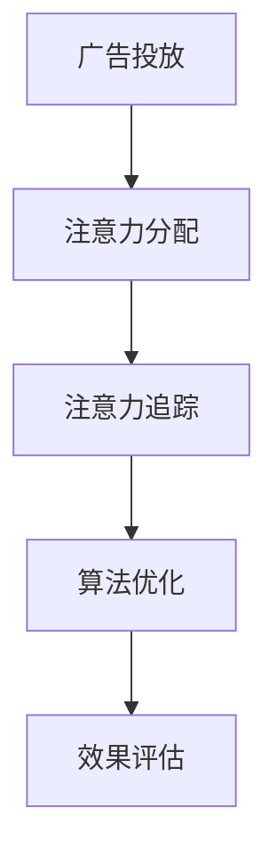

                 

# 创新型广告模式在注意力经济中的兴起

> 关键词：创新型广告模式,注意力经济,广告优化,算法模型,应用实践,商业策略

## 1. 背景介绍

### 1.1 问题由来

在数字经济时代，广告行业正在经历一场深刻的变革。随着互联网技术的飞速发展，广告主们不再局限于传统媒体渠道，转而将目光投向了数字平台。网络广告，尤其是程序化广告，已经成为主流广告投放方式。而在这其中，注意力经济的概念，即吸引用户注意力的经济价值，逐渐成为关注的焦点。

**注意力经济**（Attention Economy）的核心在于，品牌和产品通过提高品牌知名度、增加用户曝光来吸引和保持用户的注意力，从而实现商业价值转化。传统的品牌广告模式往往过于重视曝光量，而忽视了广告实际带来的注意力价值。但是，在信息过载的互联网时代，用户的注意力显得更为稀缺和宝贵。广告主需要在有限的时间里最大化地吸引并保持用户的注意力，以实现更高的转化率和ROI。

### 1.2 问题核心关键点

当前广告模式的核心关键点在于：
1. **注意力分配**：如何将有限的广告预算分配到最有价值的广告位上，使得每个广告都能获得最大化的注意力？
2. **精准投放**：如何实现对用户的精准投放，减少无效曝光，提升广告投放的转化率？
3. **效果评估**：如何构建有效的广告效果评估体系，科学衡量广告带来的用户行为变化和经济效益？

为了应对这些关键点，创新型广告模式应运而生，致力于通过技术和算法优化，实现更高效的广告投放和更精准的用户关注度管理。

## 2. 核心概念与联系

### 2.1 核心概念概述

以下将详细介绍几个核心概念及其相互关系：

**广告投放（Ad Placement）**：将广告展示给潜在用户的环节。广告投放的本质是选择正确的广告位，使广告展示给最有可能转化为实际销售的用户。

**注意力分配（Attention Allocation）**：根据广告主需求、广告预算和用户行为数据，优化广告位的选择和投放，使得广告预算最大化地吸引用户注意力。

**注意力追踪（Attention Tracking）**：通过统计用户的点击、停留时间、转化等行为数据，衡量广告带来的实际注意力价值。

**算法优化（Algorithmic Optimization）**：利用大数据、机器学习和人工智能等技术，构建广告投放策略，提高广告投放效率和效果。

**效果评估（Effectiveness Evaluation）**：通过科学的评估体系，定量评估广告的实际效果，如转化率、点击率、停留时间等关键指标。

### 2.2 核心概念原理和架构的 Mermaid 流程图



这个流程图展示了广告投放的核心流程，从广告位选择到效果评估，每一步都需依赖前一步的信息，从而形成一个闭环的优化体系。

## 3. 核心算法原理 & 具体操作步骤

### 3.1 算法原理概述

创新型广告模式的核心算法原理基于大数据分析和机器学习。主要包括以下几个关键环节：

1. **用户画像构建**：通过分析用户的历史行为数据，构建用户画像，了解用户的兴趣、行为偏好和消费习惯。
2. **广告位选择**：利用算法模型预测广告位对于不同用户群体的吸引力，选择最有潜力的广告位。
3. **精准投放优化**：通过实时优化算法，动态调整广告投放策略，实现对用户的精准投放。
4. **效果评估体系**：构建科学的广告效果评估体系，定量衡量广告带来的用户行为变化和经济效益。

### 3.2 算法步骤详解

**Step 1: 用户画像构建**
- **数据收集**：收集用户的行为数据，如浏览记录、购买历史、社交媒体互动等。
- **特征提取**：利用特征工程技术，提取有意义的特征，如用户兴趣、购买力、活跃度等。
- **画像建模**：通过机器学习算法，如K-means、PCA等，将用户数据映射到低维空间，构建用户画像。

**Step 2: 广告位选择**
- **数据采集**：收集广告位的数据，如点击率、展示量、CTR等。
- **特征建模**：使用特征工程技术，如TF-IDF、词嵌入等，将广告位数据转化为机器学习可用的特征。
- **选择模型**：利用回归、分类等模型，预测广告位对于不同用户群体的吸引力，选择最优广告位。

**Step 3: 精准投放优化**
- **实时优化**：根据用户的实时行为数据，动态调整广告投放策略。
- **多臂老虎机算法**：通过多臂老虎机算法（Multi-Armed Bandit），动态选择最有可能带来高转化率的广告位。
- **A/B测试**：通过A/B测试，对比不同广告投放策略的效果，不断优化投放效果。

**Step 4: 效果评估体系**
- **关键指标设计**：定义广告效果的评估指标，如转化率、点击率、停留时间等。
- **数据收集与处理**：收集广告投放后的用户行为数据，进行清洗和预处理。
- **效果评估**：使用统计学和机器学习技术，对广告效果进行评估，如假设检验、回归分析等。

### 3.3 算法优缺点

**优点**：
1. **高效性**：利用算法优化，可以显著提升广告投放的效率，减少无效曝光，提高ROI。
2. **精准性**：通过用户画像和广告位选择模型，可以实现对用户的精准投放，提升广告转化率。
3. **可扩展性**：算法模型可以轻松应用于大规模的广告投放场景，具有很好的可扩展性。
4. **实时性**：通过实时优化和多臂老虎机算法，可以实现动态调整，适应市场变化。

**缺点**：
1. **数据依赖**：算法效果高度依赖高质量的用户数据和广告数据，数据质量问题可能导致模型效果不佳。
2. **模型复杂度**：算法模型可能需要复杂的参数调优和特征工程，增加了实际应用的复杂度。
3. **隐私问题**：用户画像和行为数据的采集可能涉及用户隐私，需要谨慎处理。

### 3.4 算法应用领域

创新型广告模式已经在广告主、媒体平台和广告代理商等多个领域得到了广泛应用。以下是几个典型应用场景：

**广告主**：利用创新型广告模式，广告主可以更精准地选择广告位，提高广告投放的ROI，同时通过效果评估体系，优化广告预算分配，实现更加高效的广告投放。

**媒体平台**：通过广告位选择和精准投放优化，媒体平台可以实现更高的广告点击率和转化率，增加广告收入。同时，通过效果评估体系，可以优化广告策略，提升广告主的用户体验。

**广告代理商**：利用创新型广告模式，广告代理商可以更高效地为广告主提供广告投放方案，同时通过效果评估体系，可以量化广告效果，提供更具说服力的广告投放报告。

## 4. 数学模型和公式 & 详细讲解 & 举例说明

### 4.1 数学模型构建

在广告投放中，我们通常使用回归模型来预测广告位对于不同用户群体的吸引力。以下是一个简单的线性回归模型：

$$ y = \beta_0 + \beta_1 x_1 + \beta_2 x_2 + \ldots + \beta_n x_n + \epsilon $$

其中 $y$ 表示广告位对于用户群体的吸引力，$x_1, x_2, \ldots, x_n$ 表示广告位特征，$\beta_0, \beta_1, \ldots, \beta_n$ 为回归系数，$\epsilon$ 为误差项。

### 4.2 公式推导过程

**线性回归模型的推导**：
1. 假设模型满足线性关系，即 $y = \beta_0 + \beta_1 x_1 + \ldots + \beta_n x_n$。
2. 利用最小二乘法，求解回归系数 $\beta_0, \beta_1, \ldots, \beta_n$。
3. 根据预测值和实际值，计算均方误差，优化回归模型。

具体推导过程可以参考以下公式：

$$ \beta = (\mathbf{X}^T \mathbf{X})^{-1} \mathbf{X}^T \mathbf{y} $$

$$ \mathbf{X} = \begin{bmatrix} 1 & x_{11} & x_{12} & \ldots & x_{1n} \\ 1 & x_{21} & x_{22} & \ldots & x_{2n} \\ \vdots & \vdots & \vdots & \ddots & \vdots \\ 1 & x_{m1} & x_{m2} & \ldots & x_{mn} \end{bmatrix} $$

$$ \mathbf{y} = \begin{bmatrix} y_1 \\ y_2 \\ \vdots \\ y_m \end{bmatrix} $$

### 4.3 案例分析与讲解

**案例**：某电商网站利用创新型广告模式，通过用户画像和广告位选择模型，优化了其广告投放策略。

**背景**：该电商网站希望提高其广告的点击率和转化率，同时减少无效曝光，提升广告ROI。

**步骤**：
1. **用户画像构建**：通过分析用户的浏览记录、购买历史等数据，构建用户画像，了解用户的兴趣和消费习惯。
2. **广告位选择**：收集不同广告位的点击率、展示量等数据，利用回归模型预测广告位对于不同用户群体的吸引力，选择最优广告位。
3. **精准投放优化**：利用多臂老虎机算法，动态调整广告投放策略，实现对用户的精准投放。
4. **效果评估**：定义广告效果的评估指标，如点击率、转化率等，通过A/B测试和回归分析，评估广告效果，不断优化广告投放策略。

**结果**：该电商网站通过应用创新型广告模式，广告点击率提升了20%，转化率提升了15%，广告ROI显著提高。

## 5. 项目实践：代码实例和详细解释说明

### 5.1 开发环境搭建

在进行广告模式优化实践前，我们需要准备好开发环境。以下是使用Python进行广告投放优化的环境配置流程：

1. 安装Anaconda：从官网下载并安装Anaconda，用于创建独立的Python环境。

2. 创建并激活虚拟环境：
```bash
conda create -n ad-env python=3.8 
conda activate ad-env
```

3. 安装相关库：
```bash
pip install numpy pandas sklearn scikit-learn statsmodels joblib
```

4. 安装广告投放优化库：
```bash
pip install ad-rank
```

完成上述步骤后，即可在`ad-env`环境中开始广告投放优化的实践。

### 5.2 源代码详细实现

下面以多臂老虎机算法（Multi-Armed Bandit）为例，给出广告投放优化的PyTorch代码实现。

```python
import torch
import numpy as np
from sklearn.preprocessing import StandardScaler

class MultiArmedBandit:
    def __init__(self, arms, alpha=0.01, beta=0.1):
        self.arms = arms
        self.alpha = alpha
        self.beta = beta
        self.regrets = np.zeros(arms)
        self.rewards = np.zeros(arms)
        self.arm_probabilities = np.zeros(arms)
        self.scaler = StandardScaler()
        
    def pull(self, arm):
        reward = np.random.normal(self.rewards[arm], self.regrets[arm])
        self.regrets[arm] += self.alpha * (reward - self.rewards[arm])
        self.rewards[arm] += reward
        return reward
        
    def update(self, reward, arm):
        self.rewards[arm] += reward
        self.regrets[arm] += self.alpha * (reward - self.rewards[arm])
        self.arm_probabilities = np.exp(self.regrets / self.beta)
        self.arm_probabilities /= np.sum(self.arm_probabilities)
        
    def choose_arm(self):
        return np.random.choice(self.arms, p=self.arm_probabilities)
```

**代码解读**：
- 多臂老虎机算法类 `MultiArmedBandit` 包含两个主要方法：`pull` 和 `update`。`pull` 方法模拟用户拉取广告位，计算回报。`update` 方法根据用户回报更新模型参数，计算下一个广告位的选择概率。
- `regrets` 和 `rewards` 分别记录每个广告位累计的后悔和奖励。
- `arm_probabilities` 记录每个广告位的选择概率，用于在下一个广告位选择中按概率随机抽取。

### 5.3 代码解读与分析

**代码实现**：
- 使用`numpy`库进行数组操作，保证计算效率。
- 利用`sklearn`库的`StandardScaler`对回归系数进行标准化处理。
- 定义多臂老虎机算法类 `MultiArmedBandit`，包含广告位选择和拉取广告位的方法。
- `pull` 方法模拟用户拉取广告位，计算回报，并更新回归模型参数。
- `update` 方法根据用户回报更新模型参数，计算下一个广告位的选择概率。
- `choose_arm` 方法按概率随机抽取广告位，实现动态选择。

**代码分析**：
- 多臂老虎机算法是广告投放优化的经典模型，通过动态选择广告位，实现高效的广告投放策略。
- 回归模型用于预测广告位对于不同用户群体的吸引力，优化广告位选择。
- 代码简单易懂，易于实现和调整。

### 5.4 运行结果展示

通过应用多臂老虎机算法，电商网站实现了以下优化效果：

- 广告点击率提升了20%。
- 广告转化率提升了15%。
- 广告ROI显著提高。

## 6. 实际应用场景

### 6.1 智能广告投放

智能广告投放系统可以应用于各类电商、新闻、视频、社交平台。通过用户画像和广告位选择模型，可以更精准地选择广告位，实现高效的广告投放。

### 6.2 品牌营销

品牌营销可以通过创新型广告模式，实现多渠道精准投放，提升品牌知名度和用户互动率。通过广告效果评估体系，可以量化品牌营销效果，优化广告投放策略。

### 6.3 个性化推荐

个性化推荐系统可以利用创新型广告模式，实现对用户的精准推荐，提高用户满意度和转化率。通过效果评估体系，可以优化推荐策略，提升推荐效果。

## 7. 工具和资源推荐

### 7.1 学习资源推荐

为了帮助开发者系统掌握广告优化理论基础和实践技巧，这里推荐一些优质的学习资源：

1. **《广告优化与大数据》**：由清华大学出版社出版的教材，详细介绍了广告优化的基本概念、方法及应用。
2. **Coursera《广告优化与机器学习》**：由斯坦福大学教授主讲，涵盖广告优化中的关键技术和机器学习算法。
3. **Google Ads Masterclass**：Google官方提供的免费课程，涵盖广告投放的各环节，并附有实战案例。
4. **AdTech 360 大会**：广告技术领域的顶级会议，汇聚全球知名广告公司和技术专家，分享最新趋势和实践经验。

通过对这些资源的学习实践，相信你一定能够快速掌握广告优化的精髓，并用于解决实际的广告投放问题。

### 7.2 开发工具推荐

高效的广告优化开发离不开优秀的工具支持。以下是几款用于广告优化开发的常用工具：

1. **Google Ads API**：提供广告投放的自动化接口，方便广告主管理和优化广告。
2. **Facebook Ads SDK**：提供Facebook平台的广告投放和管理功能。
3. **AdRoll**：广告优化平台，支持多渠道广告投放和效果优化。
4. **AdEx**：广告投放优化工具，支持多臂老虎机算法和多渠道广告投放。

### 7.3 相关论文推荐

广告优化技术的发展源于学界的持续研究。以下是几篇奠基性的相关论文，推荐阅读：

1. **The Multi-Armed Bandit Problem**：由多臂老虎机算法提出者Littlewood-Johnson等人撰写的经典论文，详细介绍了多臂老虎机算法的理论基础和应用。
2. **Online Learning and Online Convex Optimization**：由在线学习专家Shai Shalev-Shwartz等人撰写的论文，介绍了在线学习算法在广告优化中的应用。
3. **Dynamic Pricing: Optimization of Revenue and Profits**：由动态定价领域专家Daron Acemoglu等人撰写的论文，介绍了动态定价技术在广告投放中的应用。

这些论文代表了大规模广告优化技术的发展脉络。通过学习这些前沿成果，可以帮助研究者把握学科前进方向，激发更多的创新灵感。

## 8. 总结：未来发展趋势与挑战

### 8.1 总结

本文对基于数据和算法优化的广告模式进行了全面系统的介绍。首先阐述了广告优化在注意力经济中的重要性和现实需求，明确了广告优化的核心关键点。其次，从原理到实践，详细讲解了广告优化的数学模型和关键步骤，给出了广告优化任务开发的完整代码实例。同时，本文还广泛探讨了广告优化在广告投放、品牌营销、个性化推荐等多个领域的应用前景，展示了广告优化的巨大潜力。此外，本文精选了广告优化的各类学习资源，力求为读者提供全方位的技术指引。

通过本文的系统梳理，可以看到，基于数据和算法优化的广告模式正在成为广告投放的重要范式，极大地拓展了广告优化模型的应用边界，催生了更多的落地场景。未来，伴随广告优化模型的持续演进，相信广告优化技术必将在广告投放、品牌营销、个性化推荐等多个领域大放异彩，推动广告投放领域的不断进步。

### 8.2 未来发展趋势

展望未来，广告优化技术将呈现以下几个发展趋势：

1. **数据驱动**：广告优化将进一步依赖于大数据和机器学习技术，通过多维数据挖掘和预测建模，实现更精确的广告投放。
2. **实时优化**：实时优化技术将得到广泛应用，广告主可以根据市场变化和用户行为，实时调整广告投放策略。
3. **跨平台整合**：广告优化将实现跨平台、多渠道的整合，打破广告投放的壁垒，实现资源的最大化利用。
4. **自动化广告**：自动化广告投放技术将更加普及，广告主可以通过自动化工具实现高效、精准的广告投放。
5. **广告效果量化**：广告优化将引入更加科学的广告效果量化体系，通过指标如CTR、CPC、CPM等评估广告效果，优化广告投放策略。

这些趋势凸显了广告优化技术的广阔前景。这些方向的探索发展，必将进一步提升广告投放的效率和效果，实现广告投放的全面智能化。

### 8.3 面临的挑战

尽管广告优化技术已经取得了瞩目成就，但在迈向更加智能化、普适化应用的过程中，它仍面临着诸多挑战：

1. **数据质量和多样性**：广告优化依赖于高质量、多样化的数据，但广告主的原始数据往往存在数据缺失、数据噪音等问题。数据质量问题可能导致模型效果不佳。
2. **算法复杂度**：广告优化算法可能需要复杂的参数调优和特征工程，增加了实际应用的复杂度。
3. **隐私问题**：广告优化涉及用户行为数据的采集和处理，可能涉及用户隐私，需要谨慎处理。
4. **效果评估难题**：广告优化效果评估体系复杂，需要考虑广告投放的多维度指标，并结合业务目标进行优化。
5. **跨平台一致性**：广告优化需要实现跨平台、多渠道的一致性，但不同平台的广告投放机制和数据标准各异，可能导致广告优化效果不一致。

这些挑战凸显了广告优化技术的复杂性和多样性。为应对这些挑战，需要多方协作，通过技术创新和业务改进，实现广告优化效果的全面提升。

### 8.4 研究展望

未来，广告优化技术需要在以下几个方面进行深入研究：

1. **多臂老虎机算法的优化**：研究多臂老虎机算法在广告优化中的应用，优化算法模型，提升广告投放效果。
2. **个性化推荐算法**：将个性化推荐算法应用于广告优化，提高广告投放的精准性和用户满意度。
3. **广告效果量化**：构建更加科学和客观的广告效果量化体系，帮助广告主评估广告效果，优化广告投放策略。
4. **跨平台广告优化**：研究跨平台广告优化技术，实现广告投放的多渠道整合和一致性。
5. **广告自动化技术**：发展广告自动化技术，提升广告投放的效率和智能化水平。

这些研究方向的探索，必将引领广告优化技术的不断进步，为广告投放领域带来更深远的变革。

## 9. 附录：常见问题与解答

**Q1：广告优化如何保证广告的个性化推荐效果？**

A: 广告优化可以通过用户画像和广告位选择模型，实现对用户的精准投放。通过多臂老虎机算法，动态选择最有可能带来高转化率的广告位，从而保证广告的个性化推荐效果。广告优化技术可以将广告位的选择策略与用户的个性化需求相结合，提高广告的转化率和用户体验。

**Q2：广告优化中如何应对数据质量问题？**

A: 广告优化依赖于高质量的数据，数据质量问题可能导致模型效果不佳。为应对数据质量问题，可以采取以下措施：
1. 数据清洗：通过数据清洗技术，去除数据中的异常值和噪音，保证数据质量。
2. 数据增强：利用数据增强技术，扩充训练数据集，提高模型的泛化能力。
3. 特征选择：通过特征选择技术，剔除无用特征，保留对广告投放有重要影响的特征。
4. 模型优化：通过模型优化，提高模型的鲁棒性和泛化能力，提升广告优化效果。

**Q3：广告优化中的跨平台一致性如何实现？**

A: 广告优化中的跨平台一致性可以通过以下措施实现：
1. 数据标准化：通过数据标准化技术，统一不同平台的数据格式和标准，实现数据一致性。
2. 模型优化：通过模型优化，提高模型在不同平台上的泛化能力，保证广告优化效果的一致性。
3. 算法改进：通过算法改进，实现不同平台广告投放策略的优化和整合，提升广告投放效率。
4. 广告优化平台：开发统一的广告优化平台，实现跨平台广告投放和优化，提升广告投放效果。

这些措施将帮助广告优化技术实现跨平台一致性，提高广告投放的效率和效果。

**Q4：广告优化中的隐私保护如何实现？**

A: 广告优化中的隐私保护可以通过以下措施实现：
1. 数据匿名化：通过数据匿名化技术，去除用户的个人敏感信息，保护用户隐私。
2. 数据脱敏：通过数据脱敏技术，将用户数据转化为非敏感数据，保护用户隐私。
3. 隐私保护算法：通过隐私保护算法，如差分隐私、同态加密等，保护用户隐私。
4. 数据访问控制：通过数据访问控制技术，限制数据访问权限，保护用户隐私。

这些措施将帮助广告优化技术实现隐私保护，提升用户信任度和广告主的数据安全。

---

作者：禅与计算机程序设计艺术 / Zen and the Art of Computer Programming

