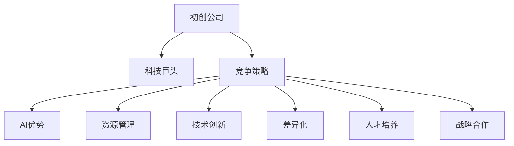

                 

# 初创公司如何在AI领域与科技巨头竞争

> 关键词：初创公司, 人工智能, 科技巨头, 竞争策略, AI优势, 资源管理, 技术创新, 差异化, 人才培养, 战略合作

## 1. 背景介绍

在21世纪，人工智能(AI)领域成为全球科技竞争的前沿阵地。科技巨头如Google、Microsoft、Amazon、Facebook等，凭借强大的资源、技术积累和品牌影响力，在AI领域占据了领先地位。然而，对于许多初创公司而言，要在AI领域与这些巨头竞争，需要采取一系列策略和措施。本文将从背景介绍、核心概念与联系、核心算法原理和具体操作步骤、数学模型和公式讲解、项目实践、实际应用场景、工具和资源推荐、总结未来发展趋势与挑战、常见问题与解答等多个方面，全面阐述初创公司如何在AI领域与科技巨头竞争。

## 2. 核心概念与联系

### 2.1 核心概念概述

要理解如何在AI领域与科技巨头竞争，首先需要掌握几个关键概念：

- **初创公司**：指新成立，业务规模较小，技术积累不足的公司。
- **科技巨头**：指在AI领域具有强大技术实力、资源和市场影响力的公司。
- **竞争策略**：指公司为在市场中获得优势而采取的一系列策略和行动。
- **AI优势**：指初创公司在AI技术上的独特优势，如创新性、灵活性、用户体验等。
- **资源管理**：指公司如何有效利用有限的资源，提升竞争力。
- **技术创新**：指公司如何通过技术研发获得竞争优势。
- **差异化**：指公司在产品和服务上的独特卖点，使其与竞争对手区分开来。
- **人才培养**：指公司如何培养和吸引顶尖人才，提升团队的技术能力。
- **战略合作**：指公司与其他公司或组织建立的合作关系，共同开发新技术或市场。

这些概念之间通过以下Mermaid流程图联系起来：



这个流程图展示了初创公司在AI领域与科技巨头竞争的核心逻辑：通过制定竞争策略，充分发挥AI优势，有效管理资源，推动技术创新，实现产品差异化，培养高素质人才，建立战略合作关系，以获得竞争优势。

## 3. 核心算法原理 & 具体操作步骤

### 3.1 算法原理概述

初创公司要在AI领域与科技巨头竞争，必须充分理解AI技术和应用的原理，掌握核心算法，以便在产品开发和业务拓展中保持领先。

AI技术和应用的原理主要包括以下几个方面：

- **机器学习**：通过数据训练模型，使计算机能够从数据中学习规律，并用于预测或决策。
- **深度学习**：一种特殊的机器学习方法，使用多层神经网络，模拟人脑进行复杂数据分析和模式识别。
- **自然语言处理(NLP)**：使计算机能够理解和处理人类语言，广泛应用于智能客服、自动翻译、文本分析等领域。
- **计算机视觉(CV)**：使计算机能够“看”和理解图像和视频，广泛应用于图像识别、物体检测、场景分析等领域。
- **强化学习**：通过与环境互动，使计算机能够不断优化策略，提升决策能力，广泛应用于机器人控制、游戏AI等领域。

这些算法和技术是初创公司需要掌握的核心内容。

### 3.2 算法步骤详解

以下是初创公司AI项目开发的具体步骤：

1. **需求分析**：明确项目目标和业务需求，确定AI应用的场景和用户需求。
2. **数据准备**：收集和预处理数据，包括清洗、标注、分割等，确保数据的质量和多样性。
3. **模型选择**：选择合适的AI算法和模型，如CNN、RNN、Transformer等，根据需求进行配置和调整。
4. **模型训练**：使用训练数据训练模型，调整模型参数，优化模型性能。
5. **模型评估**：使用测试数据评估模型效果，确保模型在实际应用中表现良好。
6. **模型部署**：将训练好的模型部署到生产环境，进行实时推理和决策。
7. **优化迭代**：根据反馈数据，不断优化模型和算法，提升系统性能。

这些步骤是初创公司AI项目开发的通用流程，需要根据具体需求和场景进行灵活调整。

### 3.3 算法优缺点

初创公司在AI项目开发中，需要充分理解算法的优缺点，以便在实际应用中进行权衡和优化。

算法的优点包括：

- **高效性**：部分算法可以高效处理大规模数据，提升系统响应速度。
- **准确性**：通过深度学习和强化学习等技术，算法在复杂场景下表现出色。
- **可解释性**：部分算法可以通过解释性模型，帮助用户理解模型决策过程。
- **灵活性**：算法可以根据业务需求灵活调整，适应不同的应用场景。

算法的缺点包括：

- **数据依赖性**：算法效果依赖高质量的数据，数据不足或标注错误会影响模型性能。
- **计算资源需求高**：部分算法需要大量的计算资源，初创公司可能面临成本压力。
- **模型复杂度**：部分算法模型复杂，不易理解，难以进行优化和调试。
- **鲁棒性不足**：部分算法对噪声和异常数据敏感，易受干扰。

初创公司需要根据自身资源和业务需求，合理选择和应用算法，以优化成本和效果。

### 3.4 算法应用领域

AI技术在各个领域都有广泛应用，以下是初创公司可以关注的几个应用领域：

- **医疗健康**：AI可用于疾病诊断、个性化医疗、健康管理等领域，帮助提高医疗服务效率和质量。
- **金融科技**：AI可用于风险管理、智能投顾、反欺诈等领域，提升金融机构的运营效率和安全性。
- **智能制造**：AI可用于生产优化、质量控制、供应链管理等领域，提高制造业的智能化水平。
- **智能交通**：AI可用于智能驾驶、交通流量优化、智能停车等领域，提升交通管理效率和用户体验。
- **智慧教育**：AI可用于个性化教育、智能评估、学习分析等领域，提升教育质量和效果。
- **智慧城市**：AI可用于城市管理、智能安防、公共服务等领域，提升城市的智能化水平。

初创公司需要根据自身业务方向，选择适合的AI应用领域，进行深入研究和技术开发。

## 4. 数学模型和公式 & 详细讲解 & 举例说明

### 4.1 数学模型构建

初创公司开发AI项目时，需要构建数学模型来描述问题，并使用算法求解。

以图像识别任务为例，常用的数学模型包括：

- **卷积神经网络(CNN)**：用于处理图像数据，通过卷积操作提取特征。
- **支持向量机(SVM)**：用于分类任务，通过寻找最优决策边界实现分类。
- **随机森林(Random Forest)**：用于分类和回归任务，通过集成多个决策树提升模型准确性。

这些数学模型都需要构建损失函数和优化算法，以确保模型能够准确地预测输出。

### 4.2 公式推导过程

以CNN为例，其核心公式包括卷积操作、池化操作和激活函数等。

- **卷积操作**：
  $$
  C_{i,j} = \sum_{m,n} W_{m,n} \cdot A_{i-m,j-n}
  $$
  其中 $W$ 为卷积核，$A$ 为输入图像，$C$ 为输出特征图。

- **池化操作**：
  $$
  C'_{i,j} = \max\limits_{m,n} A_{i,m,j,n}
  $$
  其中 $C'$ 为池化后的特征图，$A$ 为输入特征图，$C$ 为输出特征图。

- **激活函数**：
  $$
  f(x) = \max(0, x)
  $$
  其中 $f$ 为激活函数，$x$ 为输入。

这些公式展示了CNN的基本操作，帮助理解模型的工作原理。

### 4.3 案例分析与讲解

以图像分类为例，初创公司可以使用CNN模型进行训练和推理。

首先，使用标注数据进行模型训练，计算损失函数，使用优化算法更新模型参数。然后，使用测试数据评估模型效果，调整模型参数以提升精度。最后，将训练好的模型部署到生产环境，进行实时图像分类。

通过这种方式，初创公司可以实现高效的图像分类，提升业务决策的智能化水平。

## 5. 项目实践：代码实例和详细解释说明

### 5.1 开发环境搭建

以下是使用Python和TensorFlow搭建AI项目开发环境的流程：

1. **安装Python**：从官网下载并安装Python，建议使用3.6及以上版本。
2. **安装TensorFlow**：使用pip命令安装TensorFlow，例如：
   ```bash
   pip install tensorflow
   ```
3. **创建虚拟环境**：使用venv命令创建虚拟环境，例如：
   ```bash
   python3 -m venv myenv
   source myenv/bin/activate
   ```
4. **安装其他依赖**：使用pip命令安装其他必要的依赖，例如：
   ```bash
   pip install numpy scipy matplotlib pandas scikit-learn tensorflow-hub
   ```

### 5.2 源代码详细实现

以下是使用TensorFlow实现图像分类的Python代码示例：

```python
import tensorflow as tf
from tensorflow.keras import layers, models

# 定义模型
model = models.Sequential([
    layers.Conv2D(32, (3,3), activation='relu', input_shape=(28, 28, 1)),
    layers.MaxPooling2D((2, 2)),
    layers.Conv2D(64, (3, 3), activation='relu'),
    layers.MaxPooling2D((2, 2)),
    layers.Conv2D(64, (3, 3), activation='relu'),
    layers.Flatten(),
    layers.Dense(64, activation='relu'),
    layers.Dense(10, activation='softmax')
])

# 编译模型
model.compile(optimizer='adam',
              loss='sparse_categorical_crossentropy',
              metrics=['accuracy'])

# 训练模型
model.fit(train_images, train_labels, epochs=10, validation_data=(test_images, test_labels))

# 评估模型
test_loss, test_acc = model.evaluate(test_images, test_labels)
print('Test accuracy:', test_acc)
```

### 5.3 代码解读与分析

代码中，首先定义了一个包含多个卷积层和池化层的神经网络模型，用于图像分类。然后，使用编译函数设置模型的优化器、损失函数和评估指标，使用fit函数进行模型训练。最后，使用evaluate函数评估模型效果，并输出测试准确率。

### 5.4 运行结果展示

训练完成后，可以使用模型进行图像分类预测。例如：

```python
# 预测图像分类
predictions = model.predict(test_images)
predicted_labels = [np.argmax(p) for p in predictions]
```

以上代码展示了初创公司如何使用TensorFlow进行AI项目开发，从模型构建到训练和评估，实现图像分类任务。

## 6. 实际应用场景

### 6.4 未来应用展望

随着AI技术的不断发展，初创公司在AI领域与科技巨头的竞争也将更加激烈。未来，初创公司需要关注以下几个发展趋势：

- **多模态融合**：AI技术将不断扩展到更多模态数据，如语音、视频、图像等，初创公司需要构建多模态融合的AI系统，提升系统的综合性能。
- **边缘计算**：AI系统将逐渐向边缘计算方向发展，初创公司需要开发轻量级、实时性的AI模型，以满足边缘设备的需求。
- **自动驾驶**：自动驾驶技术将成为未来AI应用的重点领域，初创公司需要开发高性能的视觉和感知算法，提升自动驾驶系统的安全性和可靠性。
- **医疗健康**：AI在医疗健康领域的应用前景广阔，初创公司需要开发精准的医学影像诊断、个性化医疗等AI应用，提升医疗服务水平。
- **金融科技**：AI在金融科技领域的应用也在不断扩展，初创公司需要开发智能投顾、风险管理等AI应用，提升金融服务的智能化水平。
- **智能制造**：AI在智能制造领域的应用将推动制造业的智能化转型，初创公司需要开发智能质控、生产优化等AI应用，提升制造业的效率和质量。

初创公司需要紧跟AI技术的发展趋势，不断创新和优化，以在未来的竞争中获得优势。

## 7. 工具和资源推荐

### 7.1 学习资源推荐

以下是一些优秀的学习资源，帮助初创公司提升AI技术水平：

- **Coursera**：提供大量高质量的AI课程，涵盖机器学习、深度学习、自然语言处理等领域。
- **Kaggle**：提供丰富的AI竞赛和数据集，帮助初创公司提升实战能力。
- **Google AI Blog**：谷歌AI团队定期发布博客，分享AI技术的最新进展和应用案例。
- **MIT Technology Review**：麻省理工科技评论，涵盖最新AI技术研究进展和商业应用。
- **Deep Learning Book**：深度学习领域的经典教材，由Ian Goodfellow等作者编写。

这些资源可以帮助初创公司提升AI技术水平，加速AI项目开发。

### 7.2 开发工具推荐

以下是一些常用的AI开发工具，帮助初创公司提升开发效率：

- **TensorFlow**：Google开发的深度学习框架，支持GPU加速，广泛应用于AI项目开发。
- **PyTorch**：Facebook开发的深度学习框架，易于使用，支持动态图和静态图。
- **Keras**：高层神经网络API，支持TensorFlow和Theano等后端，易于上手。
- **Jupyter Notebook**：交互式编程环境，支持Python和R等语言，方便数据可视化和代码调试。
- **GitHub**：代码托管平台，方便团队协作和代码共享。
- **Google Colab**：Google提供的云端Jupyter Notebook环境，免费提供GPU和TPU算力。

这些工具可以帮助初创公司提升AI项目开发效率，加速创新迭代。

### 7.3 相关论文推荐

以下是一些经典的AI论文，帮助初创公司掌握前沿技术：

- **"ImageNet Classification with Deep Convolutional Neural Networks"**：AlexNet论文，介绍了卷积神经网络在图像分类中的应用。
- **"Google's Neural Machine Translation System"**：Google翻译系统论文，介绍了神经机器翻译技术。
- **"Attention is All You Need"**：Transformer论文，介绍了Transformer模型在机器翻译中的应用。
- **"Playing Atari with Deep Reinforcement Learning"**：AlphaGo论文，介绍了深度强化学习在棋类游戏中的应用。
- **"BERT: Pre-training of Deep Bidirectional Transformers for Language Understanding"**：BERT论文，介绍了基于掩码语言模型的预训练技术。

这些论文代表了AI技术的前沿研究，初创公司需要关注最新的研究方向和应用进展。

## 8. 总结：未来发展趋势与挑战

### 8.1 总结

本文详细介绍了初创公司如何在AI领域与科技巨头竞争，包括背景介绍、核心概念与联系、核心算法原理和具体操作步骤、数学模型和公式讲解、项目实践、实际应用场景、工具和资源推荐、总结未来发展趋势与挑战、常见问题与解答等内容。通过系统性阐述初创公司在AI领域竞争中的策略和方法，帮助初创公司更好地理解AI技术和应用，提升市场竞争力。

### 8.2 未来发展趋势

未来，初创公司需要在AI领域不断创新和优化，以应对科技巨头的竞争压力。以下是一些未来发展趋势：

- **技术创新**：持续研发新的AI技术和算法，提升系统性能和应用效果。
- **模型压缩**：优化模型结构和参数，减少计算资源消耗，提升系统实时性。
- **数据质量提升**：提升数据标注和清洗的质量，减少模型误差和偏差。
- **团队建设**：培养和吸引顶尖AI人才，提升团队的技术能力和创新能力。
- **战略合作**：与上下游企业和组织建立合作关系，共同开发新技术和市场。

初创公司需要在技术、数据、人才和合作等多方面进行全面优化，以获得竞争优势。

### 8.3 面临的挑战

初创公司在AI领域竞争中，面临诸多挑战：

- **数据获取**：获取高质量的数据是AI项目开发的基础，但数据获取成本较高。
- **资源限制**：初创公司资源有限，难以承担大规模计算和存储需求。
- **市场竞争**：科技巨头具有强大的市场和技术优势，初创公司难以与其竞争。
- **技术迭代**：AI技术发展迅速，初创公司需要不断创新，跟上技术潮流。
- **人才缺乏**：AI领域人才稀缺，初创公司难以吸引和保留顶尖人才。
- **应用落地**：AI技术需要与实际业务结合，初创公司需要开发具有实际应用价值的产品。

初创公司需要克服这些挑战，以在AI领域取得突破性进展。

### 8.4 研究展望

未来，初创公司需要在以下几个方面进行深入研究：

- **新算法研究**：探索新的AI算法和技术，提升系统性能和应用效果。
- **数据增强**：研究新的数据增强技术，提升数据质量和多样性。
- **模型优化**：优化模型结构和参数，提升模型的压缩比和实时性。
- **自动学习**：研究自动学习和自适应学习技术，提升模型的鲁棒性和泛化能力。
- **隐私保护**：研究隐私保护技术，保护用户数据和隐私安全。
- **伦理规范**：制定AI技术的伦理规范，确保技术应用符合社会价值观和道德标准。

初创公司需要在多个研究方向进行深入探索，以推动AI技术的发展和应用。

## 9. 附录：常见问题与解答

**Q1：初创公司需要具备哪些基本素质？**

A: 初创公司需要具备以下基本素质：

- **技术实力**：拥有强大的技术团队，具备先进的AI技术储备。
- **数据资源**：拥有丰富的数据资源，数据质量和多样性较高。
- **市场洞察**：具备敏锐的市场洞察力，能够快速识别市场机会和需求。
- **资金支持**：拥有足够的资金支持，能够进行大规模项目开发和市场推广。
- **团队管理**：拥有高效的团队管理能力，能够激发团队创造力和凝聚力。

初创公司需要在技术、数据、市场、资金和管理等多个方面进行全面提升，以提高竞争力。

**Q2：初创公司如何选择AI应用领域？**

A: 初创公司选择AI应用领域时，需要考虑以下因素：

- **市场需求**：选择市场需求较大、潜力较大的应用领域。
- **技术匹配**：选择与自身技术实力匹配的应用领域，避免技术壁垒过高。
- **数据可得性**：选择数据获取成本较低、数据质量较高的应用领域。
- **竞争状况**：选择竞争较弱、有较大市场空间的应用领域。
- **可持续发展**：选择具有长期发展潜力的应用领域，避免短期市场波动。

初创公司需要根据自身优势和市场需求，选择适合的AI应用领域，进行深入研发和市场拓展。

**Q3：初创公司如何建立战略合作关系？**

A: 初创公司建立战略合作关系时，需要考虑以下因素：

- **互补优势**：选择与自身有互补优势的企业或组织进行合作，共同开发新技术和新市场。
- **资源共享**：利用合作伙伴的资源和技术优势，提升自身创新能力。
- **风险共担**：与合作伙伴共同承担项目风险，分散风险压力。
- **长期合作**：建立长期稳定的合作关系，共同推动技术进步和市场扩展。

初创公司需要积极寻找战略合作伙伴，通过合作提升自身竞争力和市场影响力。

**Q4：初创公司如何提升团队技术能力？**

A: 初创公司提升团队技术能力时，需要考虑以下措施：

- **培训和教育**：定期组织培训和教育活动，提升团队技术水平和创新能力。
- **引入顶尖人才**：通过招聘、引进等方式，引入顶尖AI人才，提升团队技术实力。
- **团队协作**：建立高效的团队协作机制，激发团队创造力和凝聚力。
- **跨学科合作**：与跨学科团队合作，提升团队综合能力。
- **技术交流**：与国内外科研机构和企业进行技术交流，学习前沿技术。

初创公司需要通过多种措施提升团队技术能力，以支撑AI项目开发和市场拓展。

**Q5：初创公司如何应对市场竞争？**

A: 初创公司应对市场竞争时，需要考虑以下策略：

- **产品创新**：不断创新和优化产品，提升用户体验和市场竞争力。
- **市场营销**：积极进行市场营销，提升品牌影响力和市场份额。
- **合作伙伴**：建立广泛的合作伙伴关系，共同开拓市场。
- **市场策略**：制定科学的市场策略，提升市场响应速度和灵活性。
- **品牌建设**：打造强大的品牌形象，提升品牌价值和市场影响力。

初创公司需要通过多种策略应对市场竞争，提升自身市场竞争力。

---

作者：禅与计算机程序设计艺术 / Zen and the Art of Computer Programming

